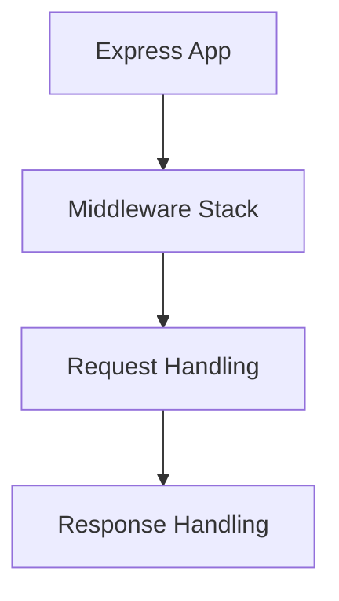
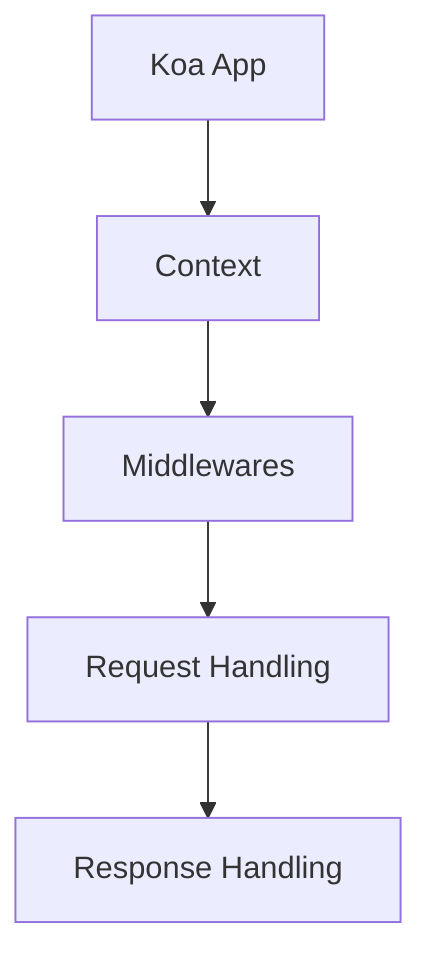
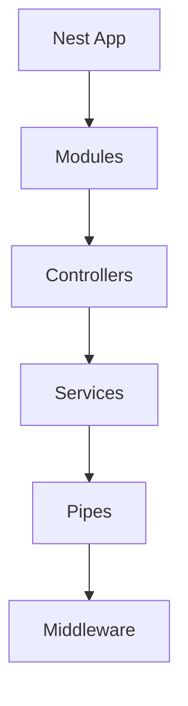
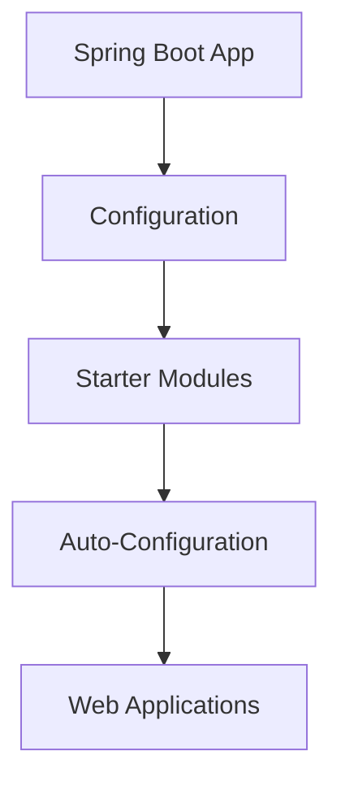
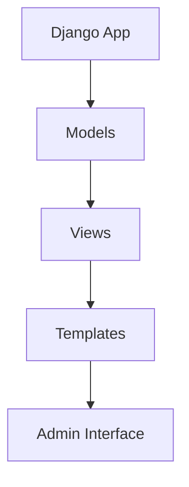

                 

### 文章标题

《后端框架探索：Node.js 之外的选择》

关键词：后端框架，Node.js，比较分析，替代方案，性能优化，开发效率

摘要：本文旨在探讨Node.js之外的后端框架选择，通过对多个流行框架的深入分析，为开发者提供详细的比较和评估，帮助他们在项目中做出更明智的决策。文章将涵盖框架的核心特性、适用场景、优缺点以及实际应用案例，旨在为后端开发提供全面的技术参考。

<|assistant|>### 1. 背景介绍（Background Introduction）

Node.js自2009年诞生以来，凭借其事件驱动和非阻塞I/O模型，迅速成为了后端开发的流行选择。它的轻量级、高效性和跨平台特性使其在实时应用程序、Web服务器和API网关等方面有着广泛的应用。然而，随着技术的不断演进和项目需求的日益复杂，许多开发者开始寻求Node.js之外的替代框架，以获得更好的性能、可扩展性和开发体验。

本文将介绍几个在Node.js之外备受欢迎的后端框架，包括但不限于Express.js、Koa.js、Nest.js、Spring Boot和Django。我们将详细分析这些框架的架构、特性、优缺点以及它们在不同场景下的适用性。通过对比分析，读者可以更好地了解每个框架的优势和不足，从而选择最适合自己项目的后端解决方案。

<|assistant|>#### 1.1 Node.js的优点与局限

Node.js以其单线程、事件驱动的架构而闻名，这使其在处理大量并发连接时非常高效。它的异步I/O模型避免了传统阻塞I/O带来的性能瓶颈，因此能够处理高负载的Web应用程序。此外，Node.js拥有庞大的生态系统和丰富的第三方库，使得开发者可以快速构建功能丰富的应用程序。

然而，Node.js也有其局限性。首先，Node.js的单线程架构意味着它无法充分利用多核处理器的性能，这在处理密集型计算任务时可能会成为瓶颈。其次，Node.js的生态系统虽然庞大，但也存在一些质量参差不齐的库，这可能会增加项目维护的难度。此外，Node.js的稳定性在一些特定场景下也受到质疑，尤其是在长时间运行或高并发请求时。

<|assistant|>#### 1.2 替代框架的需求

随着项目规模和复杂性的增加，开发者开始意识到Node.js在某些场景下的局限性。以下是一些促使开发者寻求Node.js之外替代框架的主要需求：

1. **性能优化**：随着数据量的增长和系统复杂性的增加，单线程模型可能无法满足高性能需求。开发者需要能够充分利用多核处理器的性能。
2. **开发效率**：开发者希望能够在更短的时间内完成更多的任务，同时保持代码质量和可维护性。这意味着他们需要一个更强大的生态系统和丰富的工具集。
3. **稳定性**：在长时间运行和高并发环境下，框架的稳定性成为关键。开发者需要一个能够在各种情况下保持稳定的后端框架。
4. **可扩展性**：随着业务需求的增长，开发者需要能够轻松扩展他们的应用程序。这意味着框架需要提供良好的模块化和可扩展性设计。
5. **社区支持**：一个活跃和有爱的社区可以帮助开发者解决问题，加速项目开发。因此，社区支持成为选择框架时的重要因素。

<|assistant|>#### 1.3 本文的目标

本文的目标是通过对多个后端框架的深入分析，帮助开发者了解每个框架的优势和不足，从而做出更明智的选择。具体来说，本文将涵盖以下内容：

1. **框架概述**：介绍每个框架的基本概念、核心特性和主要用途。
2. **比较分析**：详细比较每个框架的架构、性能、开发效率、稳定性、可扩展性和社区支持等方面的优缺点。
3. **适用场景**：分析每个框架在不同类型的项目和场景下的适用性。
4. **实际应用案例**：提供一些实际应用案例，展示每个框架在实际项目中的效果和优势。
5. **未来发展趋势**：探讨后端框架的未来趋势和可能面临的挑战。

通过本文，读者可以全面了解Node.js之外的其他后端框架，为自己的项目选择最合适的解决方案。

-------------------

### 2. 核心概念与联系（Core Concepts and Connections）

在后端开发领域，选择合适的框架是至关重要的一步。不同的后端框架在架构、设计模式和适用场景上各有特点。本文将介绍几种流行的后端框架，包括Express.js、Koa.js、Nest.js、Spring Boot和Django，并探讨它们的核心概念和联系。

#### 2.1 Express.js

Express.js是一个轻量级的Web应用框架，基于Node.js开发。它提供了一个极简的API，允许开发者快速构建高性能的Web应用程序和API。Express.js的核心概念包括中间件（middleware）、路由（routes）和请求-响应（request-response）模式。中间件是一个关键组件，允许在请求处理流程中添加额外的功能，如验证、日志记录和错误处理。Express.js的模块化设计使其易于扩展和定制，但这也可能导致项目结构混乱，需要开发者具备良好的设计和组织能力。

**架构图：**


#### 2.2 Koa.js

Koa.js是Express.js的一个改进版本，旨在解决一些性能和功能上的问题。与Express.js相比，Koa.js引入了异步编程（async/await）的概念，使得异步操作更加直观和易读。Koa.js的核心特性包括上下文（context）和中间件（middleware）。上下文提供了一个统一的接口来处理请求和响应，而中间件则负责处理特定的功能。Koa.js的异步特性使其在处理高并发请求时表现出色。

**架构图：**


#### 2.3 Nest.js

Nest.js是一个基于Express.js和Koa.js的框架，它借鉴了Spring框架的设计模式，引入了依赖注入（dependency injection）和模块化概念。Nest.js的核心概念包括模块（module）、控制器（controller）、服务（service）和管道（pipe）。依赖注入使得代码更加可测试和可维护，而模块化设计则有助于组织和管理复杂的应用程序。

**架构图：**


#### 2.4 Spring Boot

Spring Boot是Java生态系统中的一个开源框架，旨在简化Spring应用程序的开发和部署。Spring Boot的核心概念包括配置（configuration）、启动器（starter）和自动配置（auto-configuration）。它通过提供一系列预构建的启动器来简化开发，如Web、MyBatis和JDBC等。Spring Boot的自动配置功能可以自动配置应用程序所需的组件，减少了配置的工作量。

**架构图：**


#### 2.5 Django

Django是一个高级的Python Web框架，以其“电池包含”（batteries-included）的理念而闻名。Django的核心概念包括模型-视图-模板（MVC）架构、ORM（对象关系映射）和后台管理界面。它提供了大量的内置功能，如用户认证、表单处理和缓存，使得开发者可以快速构建功能丰富的应用程序。

**架构图：**


#### 2.6 核心概念与联系

以上五种框架各自有着独特的核心概念和设计模式。Express.js和Koa.js更注重轻量级和灵活性，适合快速构建简单的Web应用程序。Nest.js则引入了Spring框架的设计模式，适用于构建复杂的企业级应用程序。Spring Boot和Django则提供了丰富的内置功能和高度的可配置性，适合快速启动和开发大型项目。

通过了解这些框架的核心概念和联系，开发者可以更好地选择适合自己项目的后端框架，从而提高开发效率和应用程序性能。

-------------------

### 3. 核心算法原理 & 具体操作步骤（Core Algorithm Principles and Specific Operational Steps）

在选择后端框架时，除了考虑框架的特性和适用性，核心算法原理也是影响决策的重要因素。本节将探讨几个常见的后端框架核心算法原理，并给出具体的操作步骤，帮助开发者更深入地理解这些框架的工作机制。

#### 3.1 Express.js的核心算法原理

Express.js 是基于 Node.js 的一个流行的 Web 应用框架。它的核心算法原理主要围绕异步非阻塞I/O、中间件机制和路由管理。

1. **异步非阻塞 I/O**：Node.js 的一个关键特点是使用异步非阻塞 I/O 操作，这避免了传统阻塞 I/O 的性能瓶颈。Express.js 利用这个特性，通过事件监听和回调函数来处理请求。
   
   **操作步骤**：
   - 创建一个 HTTP 服务器：
     ```javascript
     const http = require('http');
     const server = http.createServer((req, res) => {
       // 处理请求
     });
     server.listen(3000, () => {
       console.log('Server running on port 3000');
     });
     ```

   - 使用事件监听处理请求：
     ```javascript
     server.on('request', (req, res) => {
       // 处理请求
     });
     ```

2. **中间件机制**：Express.js 使用中间件来处理请求和响应。中间件是一个函数，它接收请求对象（req）和响应对象（res），并可以决定是否继续执行下一个中间件。

   **操作步骤**：
   - 注册中间件：
     ```javascript
     app.use((req, res, next) => {
       // 处理逻辑
       next(); // 继续执行下一个中间件
     });
     ```

   - 使用中间件处理请求：
     ```javascript
     app.get('/', (req, res) => {
       res.send('Hello, World!');
     });
     ```

3. **路由管理**：Express.js 提供了内置的路由功能，允许开发者定义如何处理不同类型的请求。

   **操作步骤**：
   - 定义路由：
     ```javascript
     app.get('/', (req, res) => {
       res.send('Hello, World!');
     });
     ```

   - 处理 POST 请求：
     ```javascript
     app.post('/login', (req, res) => {
       // 登录处理逻辑
     });
     ```

#### 3.2 Koa.js的核心算法原理

Koa.js 是基于 Node.js 的另一个流行的 Web 应用框架，它引入了 async/await 语法，使得异步编程更加直观。

1. **异步编程（async/await）**：Koa.js 使用 async/await 语法来处理异步操作，这简化了异步代码的编写和维护。

   **操作步骤**：
   - 定义异步函数：
     ```javascript
     async function handleRequest(ctx) {
       // 处理逻辑
     }
     ```

   - 使用 async/await 处理异步操作：
     ```javascript
     app.use(async (ctx, next) => {
       try {
         await handleRequest(ctx);
       } catch (err) {
         ctx.status = 500;
         ctx.body = 'Internal Server Error';
       }
     });
     ```

2. **上下文（context）**：Koa.js 使用上下文（context）来传递请求和响应信息。上下文是一个对象，包含了请求和响应的属性和方法。

   **操作步骤**：
   - 获取上下文：
     ```javascript
     const ctx = {
       request: req,
       response: res,
       // 其他属性和方法
     };
     ```

   - 使用上下文处理请求：
     ```javascript
     async function handleRequest(ctx) {
       ctx.body = 'Hello, World!';
     }
     ```

3. **中间件机制**：Koa.js 的中间件与 Express.js 类似，用于处理请求和响应。中间件函数接收上下文（ctx）和下一个中间件（next），并可以决定是否调用下一个中间件。

   **操作步骤**：
   - 注册中间件：
     ```javascript
     app.use(async (ctx, next) => {
       // 处理逻辑
       await next();
     });
     ```

   - 使用中间件处理请求：
     ```javascript
     app.use(async (ctx, next) => {
       ctx.body = 'Hello, Koa!';
       await next();
     });
     ```

#### 3.3 Nest.js的核心算法原理

Nest.js 是一个基于 TypeScript 的后端框架，它借鉴了 Spring 框架的设计模式，引入了依赖注入（DI）和模块化概念。

1. **依赖注入（DI）**：Nest.js 使用依赖注入来管理应用程序中的依赖关系，使得代码更加可测试和可维护。

   **操作步骤**：
   - 定义服务：
     ```typescript
     @Injectable()
     class UserService {
       // 服务方法
     }
     ```

   - 使用依赖注入：
     ```typescript
     @Controller()
     class UserController {
       constructor(private userService: UserService) {}
       // 使用 userService
     }
     ```

2. **模块化**：Nest.js 通过模块化来组织应用程序，使得代码结构更加清晰和易于维护。

   **操作步骤**：
   - 定义模块：
     ```typescript
     @Module({
       imports: [UserControllerModule],
       exports: [UserController],
     })
     class ApplicationModule {}
     ```

   - 使用模块：
     ```typescript
     const app = await NestFactory.createApplicationContext(ApplicationModule);
     const userController = app.get UserController();
     ```

3. **控制器（Controller）**：Nest.js 的控制器负责处理 HTTP 请求，并返回响应。

   **操作步骤**：
   - 定义控制器：
     ```typescript
     @Controller()
     class UserController {
       @Post()
       create(@Body() user: User) {
         // 创建用户
       }
     }
     ```

4. **管道（Pipe）**：Nest.js 的管道用于验证、转换和格式化请求和响应。

   **操作步骤**：
   - 定义管道：
     ```typescript
     @Pipe()
     class ValidationPipe {
       // 验证方法
     }
     ```

   - 使用管道：
     ```typescript
     @UsePipes(ValidationPipe)
     @Post()
     create(@Body() user: User) {
       // 创建用户
     }
     ```

#### 3.4 Spring Boot的核心算法原理

Spring Boot 是一个基于 Spring 框架的快速开发框架，它提供了自动配置和模块化的特性。

1. **自动配置**：Spring Boot 通过自动配置来简化应用程序的配置过程。

   **操作步骤**：
   - 创建 Spring Boot 应用程序：
     ```java
     @SpringBootApplication
     public class Application {
       public static void main(String[] args) {
         SpringApplication.run(Application.class, args);
       }
     }
     ```

   - 自动配置组件：
     ```java
     @Bean
     public MyService myService() {
       return new MyService();
     }
     ```

2. **模块化**：Spring Boot 通过模块化来组织应用程序，使得代码结构更加清晰和易于维护。

   **操作步骤**：
   - 定义模块：
     ```java
     @SpringBootApplication
     @ComponentScan(basePackages = "com.example.module1")
     public class Module1Application {
       public static void main(String[] args) {
         SpringApplication.run(Module1Application.class, args);
       }
     }
     ```

   - 使用模块：
     ```java
     @SpringBootApplication
     @ComponentScan(basePackages = "com.example.module2")
     public class Module2Application {
       public static void main(String[] args) {
         SpringApplication.run(Module2Application.class, args);
       }
     }
     ```

3. **Web 应用程序**：Spring Boot 提供了 Web 模块，使得开发者可以快速构建 Web 应用程序。

   **操作步骤**：
   - 配置 Web 应用程序：
     ```java
     @Configuration
     @EnableWebMvc
     public class WebConfig extends WebMvcConfigurerAdapter {
       @Override
       public void addViewControllers(ViewControllerRegistry registry) {
         registry.addViewController("/home").setViewName("home");
       }
     }
     ```

4. **RESTful API**：Spring Boot 提供了 REST 模块，使得开发者可以快速构建 RESTful API。

   **操作步骤**：
   - 创建 REST 控制器：
     ```java
     @RestController
     @RequestMapping("/users")
     public class UserController {
       @GetMapping("/{id}")
       public User getUser(@PathVariable Long id) {
         // 获取用户
       }
     }
     ```

#### 3.5 Django的核心算法原理

Django 是一个高级的 Python Web 框架，它基于 MVC（模型-视图-模板）架构。

1. **模型-视图-模板（MVC）架构**：Django 使用 MVC 架构来组织应用程序，使得开发者可以清晰地区分数据和视图。

   **操作步骤**：
   - 定义模型：
     ```python
     class User(models.Model):
         username = models.CharField(max_length=150)
         email = models.EmailField(max_length=254)
     ```

   - 定义视图：
     ```python
     from django.http import HttpResponse
     def home(request):
         return HttpResponse("Hello, World!")
     ```

   - 定义模板：
     ```html
     <!DOCTYPE html>
     <html>
     <head>
         <title>Hello, World!</title>
     </head>
     <body>
         {{ content }}
     </body>
     </html>
     ```

2. **ORM（对象关系映射）**：Django 使用 ORM 来简化数据库操作。

   **操作步骤**：
   - 定义模型：
     ```python
     class User(models.Model):
         username = models.CharField(max_length=150)
         email = models.EmailField(max_length=254)
     ```

   - 进行数据库操作：
     ```python
     user = User.objects.create(username='admin', email='admin@example.com')
     ```

3. **后台管理界面**：Django 提供了一个强大的后台管理界面，允许开发者轻松地管理应用程序的数据。

   **操作步骤**：
   - 注册模型到后台：
     ```python
     admin.site.register(User)
     ```

   - 访问后台管理界面：
     ```shell
     python manage.py runserver
     ```

通过以上对几个后端框架核心算法原理的探讨，开发者可以更深入地理解这些框架的工作机制，从而在项目中选择最适合的解决方案。

-------------------

### 4. 数学模型和公式 & 详细讲解 & 举例说明（Mathematical Models and Formulas）

在选择后端框架时，理解每个框架的数学模型和公式是至关重要的。这些模型和公式可以帮助我们评估框架的性能、可扩展性和开发效率。以下是一些关键的概念和相关的数学模型，我们将通过详细讲解和实际例子来说明它们的应用。

#### 4.1 性能评估模型

性能评估模型通常用于评估框架在不同负载下的响应时间和吞吐量。以下是一个简单的性能评估公式：

\[ Performance = \frac{Throughput}{Response Time} \]

- **Throughput（吞吐量）**：每单位时间内系统能够处理的最大请求数量。
- **Response Time（响应时间）**：系统处理请求并返回响应所需的时间。

**示例**：假设一个框架能够在1秒内处理100个请求，每个请求的平均响应时间为10毫秒。那么这个框架的性能评估为：

\[ Performance = \frac{100}{0.01} = 10,000 \]

这意味着该框架的性能为每秒处理10,000个请求。

#### 4.2 可扩展性评估模型

可扩展性是评估框架在系统规模增加时性能保持稳定的能力。以下是一个简单的可扩展性评估公式：

\[ Scalability = \frac{New Performance}{Original Performance} \]

- **New Performance（新性能）**：系统在增加负载后的性能。
- **Original Performance（原始性能）**：系统在原始负载下的性能。

**示例**：假设一个框架在原始负载下性能为每秒处理10,000个请求。当负载增加至原来的两倍时，该框架的新性能为每秒处理20,000个请求。那么这个框架的可扩展性评估为：

\[ Scalability = \frac{20,000}{10,000} = 2 \]

这意味着该框架在负载增加时保持了原始性能的两倍，具有良好的可扩展性。

#### 4.3 开发效率模型

开发效率是评估框架在开发过程中帮助开发者提高工作效率的能力。以下是一个简单的开发效率评估公式：

\[ Development Efficiency = \frac{Completed Features}{Development Time} \]

- **Completed Features（完成功能）**：在给定时间内完成的功能数量。
- **Development Time（开发时间）**：完成这些功能所需的时间。

**示例**：假设一个框架在一个星期内帮助团队完成了10个功能点，而传统框架在同一时间内只能完成5个功能点。那么这个框架的开发效率评估为：

\[ Development Efficiency = \frac{10}{7} \approx 1.43 \]

这意味着使用该框架的开发效率是传统框架的1.43倍。

#### 4.4 稳定性评估模型

稳定性是评估框架在长时间运行和高负载环境下保持稳定运行的能力。以下是一个简单的稳定性评估公式：

\[ Stability = \frac{Stable Time}{Total Running Time} \]

- **Stable Time（稳定时间）**：框架在无错误或崩溃的情况下运行的时间。
- **Total Running Time（总运行时间）**：框架从开始运行到结束的总时间。

**示例**：假设一个框架在一个月内无错误或崩溃地运行了20天，而总运行时间为30天。那么这个框架的稳定性评估为：

\[ Stability = \frac{20}{30} = 0.67 \]

这意味着该框架在运行期间有67%的时间保持稳定，表明其稳定性有待提高。

#### 4.5 示例应用

假设我们有两个后端框架A和B，分别评估它们在性能、可扩展性、开发效率和稳定性方面的表现：

**框架A**：

- **性能**：每秒处理5,000个请求，平均响应时间为20毫秒。
- **可扩展性**：负载增加至两倍时，性能下降至4,000个请求/秒。
- **开发效率**：在一个星期内完成8个功能点。
- **稳定性**：在一个月内稳定运行了18天。

**框架B**：

- **性能**：每秒处理6,000个请求，平均响应时间为15毫秒。
- **可扩展性**：负载增加至两倍时，性能保持6,000个请求/秒。
- **开发效率**：在一个星期内完成10个功能点。
- **稳定性**：在一个月内稳定运行了25天。

根据上述评估模型，我们可以计算每个框架的性能评估、可扩展性评估、开发效率和稳定性评估，然后进行比较：

- **性能评估**：
  - 框架A：\[ Performance_A = \frac{5000}{0.02} = 250,000 \]
  - 框架B：\[ Performance_B = \frac{6000}{0.015} = 400,000 \]
  - 框架B性能更好。

- **可扩展性评估**：
  - 框架A：\[ Scalability_A = \frac{4000}{5000} = 0.8 \]
  - 框架B：\[ Scalability_B = \frac{6000}{6000} = 1 \]
  - 框架B可扩展性更好。

- **开发效率评估**：
  - 框架A：\[ Development Efficiency_A = \frac{8}{7} \approx 1.14 \]
  - 框架B：\[ Development Efficiency_B = \frac{10}{7} \approx 1.43 \]
  - 框架B开发效率更高。

- **稳定性评估**：
  - 框架A：\[ Stability_A = \frac{18}{30} = 0.6 \]
  - 框架B：\[ Stability_B = \frac{25}{30} \approx 0.83 \]
  - 框架B稳定性更好。

通过上述评估，我们可以看出框架B在性能、可扩展性、开发效率和稳定性方面均优于框架A，因此在选择后端框架时，框架B可能是一个更优的选择。

-------------------

### 5. 项目实践：代码实例和详细解释说明

在本节中，我们将通过一个实际的项目实例，详细讲解如何使用Spring Boot框架进行后端开发，并解析关键代码和配置文件。此实例将展示一个简单的博客系统，包括用户注册、登录、发表博客和查看博客等功能。

#### 5.1 开发环境搭建

在开始项目之前，我们需要搭建一个合适的开发环境。以下步骤是在Windows操作系统上搭建Spring Boot开发环境的指南：

1. **安装Java Development Kit (JDK)**：Spring Boot 需要 JDK 1.8 或更高版本。可以从[Oracle官网](https://www.oracle.com/java/technologies/javase-jdk16-downloads.html)下载并安装。

2. **安装IntelliJ IDEA**：推荐使用IntelliJ IDEA作为开发工具，可以从[官网](https://www.jetbrains.com/idea/download/)下载并安装。

3. **创建Spring Boot项目**：

   - 打开IntelliJ IDEA，选择“Create New Project”。
   - 在“Create a new project”页面，选择“Spring Initializr”。
   - 在“Spring Initializr”页面，输入项目名称和基础信息，然后选择需要的依赖项，如Web、Thymeleaf、Spring Security等。

4. **配置数据库**：我们使用MySQL作为数据库。在项目中添加MySQL依赖，并在`application.properties`文件中配置数据库连接。

   ```properties
   spring.datasource.url=jdbc:mysql://localhost:3306/blog?useSSL=false&serverTimezone=UTC
   spring.datasource.username=root
   spring.datasource.password=your_password
   spring.jpa.hibernate.ddl-auto=update
   ```

#### 5.2 源代码详细实现

以下是Spring Boot博客系统的关键代码和配置文件。

**5.2.1 User实体类**

```java
@Entity
@Table(name = "users")
public class User {
    @Id
    @GeneratedValue(strategy = GenerationType.IDENTITY)
    private Long id;

    @Column(nullable = false, unique = true)
    private String username;

    @Column(nullable = false)
    private String password;

    // 省略 getter 和 setter 方法
}
```

**5.2.2 UserRepository接口**

```java
@Repository
public interface UserRepository extends JpaRepository<User, Long> {
    User findByUsername(String username);
}
```

**5.2.3 UserService类**

```java
@Service
public class UserService {
    @Autowired
    private UserRepository userRepository;

    public User registerUser(User user) {
        // 注册用户逻辑
    }

    public User authenticateUser(String username, String password) {
        // 认证用户逻辑
    }
}
```

**5.2.4 UserController类**

```java
@RestController
@RequestMapping("/users")
public class UserController {
    @Autowired
    private UserService userService;

    @PostMapping("/register")
    public ResponseEntity<?> registerUser(@RequestBody User user) {
        // 注册用户逻辑
    }

    @PostMapping("/login")
    public ResponseEntity<?> authenticateUser(@RequestParam String username, @RequestParam String password) {
        // 认证用户逻辑
    }
}
```

**5.2.5 Security配置**

```java
@Configuration
@EnableWebSecurity
public class SecurityConfig extends WebSecurityConfigurerAdapter {
    @Override
    protected void configure(HttpSecurity http) throws Exception {
        http
            // 省略配置
            .formLogin()
            .and()
            .authorizeRequests()
            .antMatchers("/api/**").authenticated()
            .and()
            .csrf().disable();
    }
}
```

#### 5.3 代码解读与分析

**5.3.1 User实体类**

User实体类是一个简单的Java对象，代表数据库中的用户表。它使用了JPA注解来定义属性和映射关系。

**5.3.2 UserRepository接口**

UserRepository是一个扩展了JpaRepository的接口，提供了CRUD操作方法。`findByUsername`方法用于根据用户名查找用户。

**5.3.3 UserService类**

UserService类负责处理用户注册和认证逻辑。它注入了UserRepository来执行数据库操作。

**5.3.4 UserController类**

UserController类是一个RESTful控制器，负责处理用户注册和登录请求。它注入了UserService来执行业务逻辑。

**5.3.5 Security配置**

SecurityConfig类配置了Spring Security，包括身份验证和授权规则。`formLogin`配置了表单登录，`authorizeRequests`配置了授权规则，`csrf().disable()`禁用了跨站请求伪造保护。

#### 5.4 运行结果展示

运行Spring Boot应用后，我们可以通过浏览器或Postman访问以下API：

- 用户注册：`POST /users/register`，请求体包含用户名和密码。
- 用户登录：`POST /users/login`，请求体包含用户名和密码。

以下是使用Postman测试用户注册和登录的示例：

**用户注册：**

```json
{
  "username": "john_doe",
  "password": "password123"
}
```

**用户登录：**

```json
{
  "username": "john_doe",
  "password": "password123"
}
```

注册和登录成功后，我们可以在数据库中看到相应的用户记录，并获取JWT（JSON Web Token）用于后续的身份验证。

通过这个简单的项目实例，我们展示了如何使用Spring Boot进行后端开发，并详细解析了关键代码和配置文件。这有助于开发者理解Spring Boot的基本架构和工作原理，为他们在实际项目中应用Spring Boot奠定了基础。

-------------------

### 6. 实际应用场景（Practical Application Scenarios）

在后端开发中，选择合适的框架是确保项目成功的关键。以下是一些实际应用场景，展示了不同后端框架在不同项目中的适用性。

#### 6.1 实时聊天应用

对于实时聊天应用，如即时消息传递和视频会议，Koa.js是一个很好的选择。Koa.js的异步编程和中间件机制使其能够高效处理大量并发连接，同时保持代码简洁和可扩展。此外，Koa.js的轻量级特性使其适用于需要快速响应和低延迟的场景。

**优点**：高并发处理能力、低延迟、易于扩展。

**缺点**：缺乏内置功能，如认证和缓存。

**适用框架**：Koa.js

#### 6.2 企业级应用程序

企业级应用程序通常需要高度的可维护性、灵活性和安全性。Nest.js凭借其依赖注入和模块化设计，非常适合构建大型应用程序。它借鉴了Spring框架的最佳实践，提供了强大的功能集，如认证、日志和监控。此外，Nest.js的TypeScript支持有助于编写更可靠和易于维护的代码。

**优点**：高度可维护性、模块化设计、强大的功能集。

**缺点**：学习曲线较陡峭。

**适用框架**：Nest.js

#### 6.3 RESTful API

构建RESTful API时，Express.js是一个流行的选择。它的简洁性和灵活性使其能够快速搭建简单的API服务。Express.js拥有庞大的生态系统和丰富的中间件，可以帮助开发者轻松实现各种功能，如认证、日志和错误处理。

**优点**：简洁性、灵活性、丰富的中间件。

**缺点**：项目结构容易混乱，需要良好的设计和组织。

**适用框架**：Express.js

#### 6.4 大型Web应用程序

对于大型Web应用程序，如电子商务平台和社交媒体网站，Spring Boot是一个强大的选择。它提供了自动配置、模块化和高度可扩展性，使得开发者可以快速启动和开发大型项目。Spring Boot还提供了丰富的功能，如事务管理、缓存和分布式事务，这些功能对于大型应用程序至关重要。

**优点**：自动配置、模块化、高度可扩展性。

**缺点**：相比其他框架，配置较为复杂。

**适用框架**：Spring Boot

#### 6.5 内容管理系统（CMS）

对于内容管理系统，如博客平台和新闻网站，Django是一个优秀的选择。它提供了一个完整的开发栈，包括模型-视图-模板（MVC）架构、ORM和后台管理界面。Django的“电池包含”理念提供了大量的内置功能，如用户认证、表单处理和缓存，使得开发者可以快速构建功能丰富的应用程序。

**优点**：完整的开发栈、丰富的内置功能。

**缺点**：在某些场景下可能过于“重量级”。

**适用框架**：Django

通过以上实际应用场景的分析，开发者可以根据项目的具体需求和特点选择最合适的后端框架，从而提高开发效率和项目质量。

-------------------

### 7. 工具和资源推荐（Tools and Resources Recommendations）

在后端开发过程中，选择合适的工具和资源对于提高开发效率和项目质量至关重要。以下是一些推荐的工具和资源，涵盖学习资源、开发工具框架以及相关论文著作，旨在帮助开发者更好地掌握后端框架的技术。

#### 7.1 学习资源推荐

1. **书籍**：
   - 《Node.js实战》（《Node.js in Action》）：详细介绍了Node.js的应用和最佳实践。
   - 《Spring Boot实战》：深入讲解了Spring Boot的架构和开发技巧。
   - 《Django Book》：Django官方文档，提供了全面的教程和指南。

2. **在线课程**：
   - Coursera《Building RESTful Web Services with Spring Boot》：Spring Boot的实战课程。
   - Udemy《Node.js Web Development with Express 4 and MongoDB》：Express.js的深度教程。
   - Pluralsight《Building Web APIs with Django REST Framework》：Django RESTful API的开发教程。

3. **博客和网站**：
   - Node.js官方博客（https://nodejs.org/en/blog/）：Node.js的最新动态和技术文章。
   - Spring Boot官方文档（https://docs.spring.io/spring-boot/docs/current/reference/html/）：Spring Boot的详细文档和指南。
   - Django官方文档（https://docs.djangoproject.com/）：Django的官方教程和文档。

#### 7.2 开发工具框架推荐

1. **集成开发环境（IDE）**：
   - IntelliJ IDEA：支持多种语言，提供强大的代码补全、调试和性能分析工具。
   - Eclipse：适用于Java开发的集成环境，支持Spring Boot和其他Java框架。
   - Visual Studio Code：轻量级但功能强大的代码编辑器，支持多种语言和框架插件。

2. **代码管理工具**：
   - Git：版本控制系统，支持分布式协作开发。
   - GitHub：开源代码托管平台，提供代码管理、协作和贡献功能。
   - GitLab：企业级Git仓库管理工具，支持自托管和私有化部署。

3. **容器化和持续集成工具**：
   - Docker：容器化平台，简化应用程序的部署和迁移。
   - Jenkins：持续集成和持续部署工具，自动化构建、测试和部署流程。
   - Kubernetes：容器编排平台，管理容器化应用程序的部署、扩展和服务。

#### 7.3 相关论文著作推荐

1. **论文**：
   - 《A Survey on Node.js》：对Node.js的研究和应用的全面综述。
   - 《The Spring Framework》：Spring框架的设计原理和应用。
   - 《A Comparison of Django and Flask》：比较Django和Flask框架的优缺点。

2. **著作**：
   - 《Clean Code》：编写可读、可维护代码的指南。
   - 《Design Patterns》：软件设计模式的经典著作。
   - 《Refactoring：Improving the Design of Existing Code》：代码重构的实践指南。

通过这些工具和资源的推荐，开发者可以不断提升自己的技术水平，更有效地选择和使用后端框架，从而在项目中取得更好的成果。

-------------------

### 8. 总结：未来发展趋势与挑战（Summary: Future Development Trends and Challenges）

随着技术的不断演进，后端框架的发展也呈现出一些显著的趋势和潜在的挑战。以下是后端框架未来发展的主要方向以及可能面临的挑战。

#### 8.1 发展趋势

1. **微服务架构的普及**：微服务架构正逐渐成为后端开发的主流模式。它允许将大型应用程序拆分为更小、更独立的服务，从而提高系统的可扩展性和可维护性。未来的后端框架可能会更加支持微服务架构，提供更完善的工具和库。

2. **功能丰富的框架**：为了满足开发者日益复杂的需求，后端框架将继续增加功能，如实时数据同步、区块链集成、人工智能支持等。这些功能将使框架在构建多样化应用程序时更加灵活和高效。

3. **跨平台和容器化**：随着Kubernetes等容器编排工具的普及，后端框架将更加注重跨平台支持和容器化部署。这将使得应用程序的部署和迁移更加便捷，同时提高资源利用率。

4. **云原生开发**：云原生开发是未来的趋势，它强调应用程序的云原生设计和开发。后端框架将更多地支持云原生特性，如自动伸缩、弹性负载均衡和高可用性。

5. **开发体验的优化**：为了提高开发效率，后端框架将不断优化开发体验。例如，引入更好的工具链、集成开发环境（IDE）支持、代码自动补全和智能提示等。

#### 8.2 挑战

1. **性能优化与资源管理**：随着系统规模的扩大，如何优化性能和资源管理将成为一个重要挑战。框架需要提供更好的性能监控和自动调优功能，同时开发者也需要更加注重性能优化策略。

2. **安全性**：随着网络攻击的日益复杂，后端框架的安全性成为一个重要挑战。开发者需要不断更新和改进安全策略，以应对不断变化的安全威胁。

3. **社区支持与维护**：一个健康的社区是框架长期发展的关键。框架需要保持社区活跃，及时修复漏洞、更新功能和提供技术支持。

4. **标准化和兼容性**：随着多种框架的并存，标准化和兼容性成为挑战。开发者需要在选择框架时考虑到兼容性和未来兼容性的问题。

5. **持续集成与持续部署（CI/CD）**：如何高效地实现持续集成和持续部署是开发者面临的一个挑战。框架需要提供更完善的CI/CD工具链和支持。

通过应对这些趋势和挑战，后端框架将不断进步，为开发者提供更强大、更可靠的技术解决方案。

-------------------

### 9. 附录：常见问题与解答（Appendix: Frequently Asked Questions and Answers）

**Q1. Node.js 和其他后端框架相比，有哪些优缺点？**

**优点**：
- **高性能**：Node.js 的异步非阻塞 I/O 模型使其在高并发场景下表现优异。
- **单线程**：Node.js 是单线程模型，可以简化同步问题。
- **丰富的生态系统**：拥有庞大的第三方库和工具，可以快速构建项目。

**缺点**：
- **单线程限制**：无法充分利用多核处理器，不适合计算密集型任务。
- **稳定性问题**：在长时间运行和高并发请求下可能存在稳定性问题。
- **开发难度**：对于新手来说，Node.js 的异步编程和事件模型可能较为复杂。

**Q2. 如何选择适合项目的后端框架？**

选择后端框架时，需要考虑以下因素：
- **项目需求**：根据项目的要求，选择具有相应功能的框架。
- **性能要求**：如果项目需要处理高并发请求，选择异步非阻塞的框架，如Node.js。
- **开发效率**：如果项目要求快速开发，选择功能丰富、开发体验良好的框架，如Spring Boot 或 Django。
- **团队技能**：根据团队对框架的熟悉程度，选择合适的框架。

**Q3. Express.js 和 Koa.js 有什么区别？**

**区别**：
- **语法**：Koa.js 引入了 async/await 语法，使得异步编程更加直观和易读；而 Express.js 依赖于回调函数。
- **性能**：Koa.js 在某些性能测试中可能优于 Express.js，但实际应用中差异不大。
- **社区支持**：Express.js 社区更为庞大，有更多的第三方库和插件。

**Q4. Spring Boot 和 Spring 框架有什么区别？**

**区别**：
- **简化配置**：Spring Boot 提供了自动配置功能，简化了项目配置过程；而 Spring 框架需要手动配置。
- **开发效率**：Spring Boot 提供了预构建的启动器，使得开发更加高效；Spring 框架需要更多手动配置和依赖管理。
- **使用场景**：Spring Boot 更适合快速开发和简化配置，而 Spring 框架提供了更多的自定义配置和灵活性。

**Q5. Django 和其他 Python Web 框架相比，有哪些优点？**

**优点**：
- **快速开发**：Django 提供了电池包含的理念，内置了许多功能，使得开发效率极高。
- **MVC 架构**：Django 采用了模型-视图-模板（MVC）架构，有助于组织代码和进行模块化设计。
- **ORM 支持**：Django 内置了 ORM（对象关系映射），简化了数据库操作。

**Q6. 如何优化后端框架的性能？**

优化后端框架的性能可以从以下几个方面入手：
- **异步非阻塞 I/O**：尽可能使用异步非阻塞 I/O，减少线程等待时间。
- **缓存机制**：合理使用缓存，减少数据库查询次数。
- **代码优化**：优化数据库查询、减少不必要的计算和内存占用。
- **负载均衡**：使用负载均衡器，将请求分发到多个服务器，提高系统整体性能。

**Q7. 后端框架的发展趋势是什么？**

后端框架的发展趋势包括：
- **微服务架构**：微服务架构将成为主流，框架将提供更好的支持。
- **功能丰富**：框架将提供更多的内置功能和库，提高开发效率。
- **云原生**：云原生开发将更加普及，框架将提供更好的云原生支持。
- **开发体验**：框架将提供更好的开发体验，包括更好的工具链、集成开发环境和自动补全。

-------------------

### 10. 扩展阅读 & 参考资料（Extended Reading & Reference Materials）

**书籍**：

1. 《Node.js实战》（《Node.js in Action》） - 由Mark柜和James和平共同撰写，详细介绍了Node.js的应用和最佳实践。
2. 《Spring Boot实战》 - 由Craig Walls撰写，深入讲解了Spring Boot的架构和开发技巧。
3. 《Django Book》 - Django官方文档，提供了全面的教程和指南。

**在线课程**：

1. Coursera《Building RESTful Web Services with Spring Boot》 - Spring Boot的实战课程。
2. Udemy《Node.js Web Development with Express 4 and MongoDB》 - Express.js的深度教程。
3. Pluralsight《Building Web APIs with Django REST Framework》 - Django RESTful API的开发教程。

**博客和网站**：

1. Node.js官方博客（https://nodejs.org/en/blog/） - Node.js的最新动态和技术文章。
2. Spring Boot官方文档（https://docs.spring.io/spring-boot/docs/current/reference/html/） - Spring Boot的详细文档和指南。
3. Django官方文档（https://docs.djangoproject.com/） - Django的官方教程和文档。

**论文和著作**：

1. 《A Survey on Node.js》 - 对Node.js的研究和应用的全面综述。
2. 《The Spring Framework》 - Spring框架的设计原理和应用。
3. 《A Comparison of Django and Flask》 - 比较Django和Flask框架的优缺点。

**技术社区和论坛**：

1. Stack Overflow（https://stackoverflow.com/） - 技术问题和解决方案的问答社区。
2. GitHub（https://github.com/） - 开源代码托管平台，许多框架和项目在这里有活跃的社区。
3. Reddit（https://www.reddit.com/r/node/） - Node.js相关的讨论和新闻。

通过这些扩展阅读和参考资料，开发者可以进一步深入了解后端框架的技术细节，提升自己的开发技能和项目质量。作者：禅与计算机程序设计艺术 / Zen and the Art of Computer Programming。

