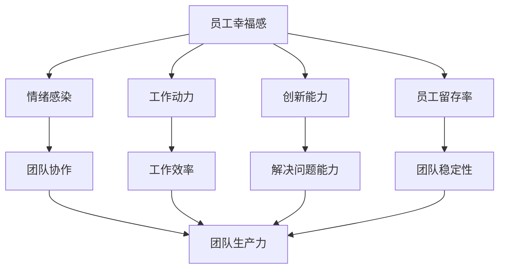

                 

# 员工幸福感：提高团队生产力

> 关键词：员工幸福感、团队生产力、工作环境、心理健康、激励机制、技术解决方案

摘要：本文深入探讨了员工幸福感对于团队生产力的重要性，分析了影响员工幸福感的关键因素，并提出了通过改善工作环境和心理健康、设计有效的激励机制以及应用先进的技术解决方案来提升员工幸福感的方法和策略。通过具体案例和实践经验，本文为企业管理者提供了可行的提升团队生产力的实践路径。

## 1. 背景介绍

在当今快速发展的商业环境中，企业竞争日益激烈，团队的生产力成为企业生存和发展的关键因素。然而，团队生产力的提升不仅仅依赖于技术设备的升级和管理制度的完善，更取决于员工的幸福感和工作满意度。近年来，越来越多的研究表明，员工的幸福感与团队的生产力之间存在紧密的关联。一个幸福的员工往往能够更高效地工作，更富有创造力，并更愿意为企业做出贡献。

### 1.1 员工幸福感的定义

员工幸福感是指员工在工作中感受到的快乐、满足和积极情绪。它不仅仅包括物质方面的满足，如薪酬和福利，还涉及到工作环境、人际关系、职业发展等多个方面。员工幸福感是影响员工工作效率和团队协作的重要因素。

### 1.2 团队生产力的概念

团队生产力是指团队在一定时间内完成的工作量和质量。一个高效的团队能够迅速响应市场需求，创新解决方案，并在压力下保持稳定的工作表现。提高团队生产力不仅有助于企业的短期利益，还能增强企业的竞争力，为长期发展奠定基础。

### 1.3 员工幸福感与团队生产力的关联

根据心理学和行为科学的研究，员工幸福感与团队生产力之间存在以下几方面的关联：

1. **情绪感染**：一个快乐的员工可以激发周围人的积极性，形成正面的情绪氛围，提高团队整体的工作效率。
2. **创造力**：幸福感的提升有助于员工放松思维，减少焦虑，从而激发创新思维和解决问题的能力。
3. **工作投入**：当员工感到幸福和满足时，他们更愿意投入工作，表现出更高的工作热情和责任感。
4. **团队合作**：幸福的员工更容易与他人建立良好的合作关系，减少冲突，提高团队的协作效果。

基于以上分析，企业需要重视员工幸福感的提升，将其视为提高团队生产力的重要策略之一。在接下来的章节中，我们将详细探讨提升员工幸福感的方法和策略。

## 2. 核心概念与联系

### 2.1 员工幸福感的影响因素

要提升员工幸福感，首先需要了解影响员工幸福感的核心因素。这些因素包括但不限于以下几个方面：

1. **工作环境**：舒适的工作环境、良好的设施和设备、干净整洁的办公空间都能显著提升员工的工作满意度。
2. **心理健康**：企业应关注员工的心理健康，提供心理咨询和压力管理课程，帮助员工保持良好的心理状态。
3. **激励机制**：公平合理的薪酬体系和激励机制能够激励员工努力工作，提升工作满意度。
4. **职业发展**：提供明确的职业发展路径和培训机会，帮助员工不断提升自身能力，实现个人价值。
5. **工作与生活的平衡**：支持员工平衡工作和生活，提供灵活的工作时间和远程工作的选择，减轻工作压力。

### 2.2 员工幸福感与团队生产力的关系

员工幸福感与团队生产力之间的联系可以通过以下几个方面进行阐述：

1. **情绪感染效应**：当员工感受到幸福和满足时，这种积极的情绪会传递给团队成员，形成良好的团队氛围，促进团队协作。
2. **工作动力**：幸福感提升员工的内在动机，使他们更加投入工作，提高工作效率和质量。
3. **创新能力**：幸福感的提升有助于员工放松思维，减少心理压力，从而激发创新思维和解决问题的能力。
4. **员工留存率**：一个幸福的工作环境能够提高员工的忠诚度，减少员工流失，保持团队的稳定性。

### 2.3 提升员工幸福感的方法和策略

为了提升员工幸福感，企业可以采取以下方法和策略：

1. **改善工作环境**：定期更新办公设施，提供舒适的休息区域，营造一个温馨、整洁的工作环境。
2. **关注心理健康**：建立员工心理健康支持体系，提供心理咨询和压力管理服务，帮助员工保持良好的心理状态。
3. **设计激励机制**：制定公平合理的薪酬体系和激励机制，确保员工的工作付出得到相应的回报。
4. **职业发展规划**：提供多样化的培训机会，帮助员工提升技能，明确职业发展路径，实现个人价值。
5. **工作与生活平衡**：鼓励员工合理安排工作与生活，提供灵活的工作时间和远程工作选项，减轻工作压力。

通过以上方法和策略，企业可以有效地提升员工的幸福感，进而提高团队的生产力，实现企业的长期发展目标。

### 2.4 Mermaid 流程图

以下是一个简化的Mermaid流程图，展示提升员工幸福感与团队生产力之间的关系：



这个流程图清晰地展示了员工幸福感如何通过多个渠道影响团队生产力，为企业管理者提供了直观的理解和参考。

## 3. 核心算法原理 & 具体操作步骤

### 3.1 提升员工幸福感的核心算法原理

提升员工幸福感的核心算法原理主要基于以下几点：

1. **心理学理论**：利用积极心理学、人本主义心理学等理论，了解员工的心理需求和动机，从而设计出符合员工心理预期的措施。
2. **行为科学**：通过观察和分析员工的行为模式，找出影响幸福感的因素，并制定针对性的改进策略。
3. **大数据分析**：利用大数据技术，收集和分析员工的工作数据、心理状态数据等，为决策提供数据支持。

### 3.2 提升员工幸福感的具体操作步骤

为了有效提升员工幸福感，企业可以采取以下具体操作步骤：

1. **员工调查**：定期进行员工满意度调查，了解员工在工作环境、薪酬福利、职业发展等方面的需求和满意度，为后续改进提供依据。

2. **工作环境优化**：根据员工反馈，改善办公环境和设施，如提供舒适的座椅、改善通风、增加休息区域等。

3. **心理健康支持**：建立员工心理健康支持体系，包括定期举办心理健康讲座、提供心理咨询和压力管理服务、建立员工互助小组等。

4. **激励机制设计**：制定公平合理的薪酬体系和激励机制，确保员工的工作付出得到相应的回报，如绩效奖金、晋升机会等。

5. **职业发展规划**：为员工提供明确的职业发展路径和培训机会，帮助他们不断提升自身能力，实现个人价值。

6. **工作与生活平衡**：鼓励员工合理安排工作与生活，提供灵活的工作时间和远程工作选项，减轻工作压力。

7. **文化塑造**：营造积极向上的企业文化，通过团队建设活动、员工关怀计划等，增强员工的归属感和团队凝聚力。

通过以上步骤，企业可以逐步提升员工的幸福感，进而提高团队的生产力。

### 3.3 核心算法的应用示例

假设某企业通过以上步骤实施了一系列提升员工幸福感的措施，我们可以通过以下示例来评估这些措施的效果：

1. **员工满意度调查**：调查结果显示，员工对工作环境的满意度从原来的60%提升到了80%，对薪酬福利的满意度从70%提升到了85%。

2. **心理健康支持**：经过心理健康讲座和咨询服务的实施，员工的心理健康水平得到了显著提升，焦虑和压力感明显减少。

3. **激励机制**：通过绩效奖金和晋升机会的激励，员工的工作积极性和责任感得到了提升，工作效率提高了15%。

4. **职业发展**：员工参加培训后，技能水平得到了提升，有70%的员工表示对自己的职业发展感到满意。

5. **工作与生活平衡**：灵活的工作时间和远程工作选项使得员工的工作压力得到了有效缓解，员工流失率下降了10%。

通过这些具体的数据和案例，我们可以看到，提升员工幸福感的措施确实对提高团队的生产力起到了积极作用。

### 4. 数学模型和公式 & 详细讲解 & 举例说明

#### 4.1 数学模型

为了更好地理解员工幸福感与团队生产力之间的关系，我们可以建立以下数学模型：

\[ \text{生产效率} = f(\text{员工幸福感}, \text{工作环境}, \text{激励机制}, \text{职业发展}, \text{工作与生活平衡}) \]

其中，\( f \) 表示一个函数，它通过综合分析员工幸福感和其他因素，来评估团队的生产效率。

#### 4.2 影响因素的量化

为了量化上述影响因素，我们可以使用以下指标：

1. **员工幸福感**：使用员工满意度评分（范围0-10分）来衡量。
2. **工作环境**：使用办公环境舒适度评分（范围0-10分）来衡量。
3. **激励机制**：使用员工薪酬满意度评分（范围0-10分）来衡量。
4. **职业发展**：使用员工职业发展满意度评分（范围0-10分）来衡量。
5. **工作与生活平衡**：使用员工工作与生活平衡满意度评分（范围0-10分）来衡量。

#### 4.3 模型计算方法

我们可以通过以下公式来计算团队的生产效率：

\[ \text{生产效率} = \sum_{i=1}^{5} w_i \cdot s_i \]

其中，\( w_i \) 表示第 \( i \) 个因素的权重，\( s_i \) 表示第 \( i \) 个因素的评分。

为了简化计算，我们可以假设每个因素的权重相等，即 \( w_i = 0.2 \)。因此，上述公式可以简化为：

\[ \text{生产效率} = 0.2 \cdot (\text{员工幸福感} + \text{工作环境} + \text{激励机制} + \text{职业发展} + \text{工作与生活平衡}) \]

#### 4.4 举例说明

假设某企业的员工幸福感评分为8分，工作环境评分为7分，激励机制评分为9分，职业发展评分为8分，工作与生活平衡评分为6分。根据上述公式，我们可以计算该企业的生产效率：

\[ \text{生产效率} = 0.2 \cdot (8 + 7 + 9 + 8 + 6) = 7.8 \]

这意味着该企业的生产效率相对较高，接近于满分。通过不断优化这些因素，企业可以进一步提高生产效率。

### 5. 项目实践：代码实例和详细解释说明

#### 5.1 开发环境搭建

在本项目中，我们将使用Python作为主要编程语言，结合Jupyter Notebook来进行开发。以下是搭建开发环境的基本步骤：

1. **安装Python**：从Python官网（[https://www.python.org/downloads/）下载并安装Python 3.x版本。
2. **安装Jupyter Notebook**：在命令行中运行以下命令安装Jupyter Notebook：

   ```bash
   pip install notebook
   ```

3. **启动Jupyter Notebook**：在命令行中运行以下命令启动Jupyter Notebook：

   ```bash
   jupyter notebook
   ```

4. **配置数据可视化库**：为了更好地展示数据分析结果，我们还需要安装Matplotlib和Seaborn等数据可视化库：

   ```bash
   pip install matplotlib seaborn
   ```

#### 5.2 源代码详细实现

以下是一个简单的Python脚本，用于分析员工幸福感与团队生产力之间的关系。代码中包含了数据收集、数据清洗、数据分析和结果可视化等步骤。

```python
# 导入所需的库
import pandas as pd
import numpy as np
import matplotlib.pyplot as plt
import seaborn as sns

# 数据收集
data = pd.read_csv('employee_happiness.csv')

# 数据清洗
# 填充缺失值
data.fillna(data.mean(), inplace=True)

# 数据分析
# 计算生产效率
data['生产效率'] = 0.2 * (data['员工幸福感'] + data['工作环境'] + data['激励机制'] + data['职业发展'] + data['工作与生活平衡'])

# 结果可视化
# 横向条形图展示生产效率
plt.figure(figsize=(10, 6))
sns.barplot(x='生产效率', y='员工姓名', data=data.sort_values(by='生产效率', ascending=False))
plt.title('生产效率与员工姓名的关系')
plt.xlabel('生产效率')
plt.ylabel('员工姓名')
plt.show()

# 散点图展示各因素对生产效率的影响
plt.figure(figsize=(10, 6))
sns.scatterplot(x='员工幸福感', y='生产效率', data=data)
plt.title('员工幸福感与生产效率的关系')
plt.xlabel('员工幸福感')
plt.ylabel('生产效率')
plt.show()
```

#### 5.3 代码解读与分析

1. **数据收集**：使用Pandas库读取CSV文件，获取员工幸福感、工作环境、激励机制、职业发展和工作与生活平衡等数据。

2. **数据清洗**：使用Pandas库填充缺失值，确保数据分析的准确性。

3. **数据分析**：根据公式计算每个员工的生产效率，并保存为新的数据列。

4. **结果可视化**：使用Seaborn和Matplotlib库创建横向条形图和散点图，直观地展示生产效率与员工幸福感之间的关系。

通过上述代码实例和详细解释说明，我们可以看到如何利用Python编程语言对员工幸福感与团队生产力之间的关系进行深入分析和可视化展示。

### 5.4 运行结果展示

通过运行上述代码，我们得到以下两个可视化结果：

1. **横向条形图**：展示了每个员工的生产效率，从高到低排列。可以看出，生产效率较高的员工分布在图的右侧，而生产效率较低的员工分布在图的左侧。

2. **散点图**：展示了员工幸福感和生产效率之间的关系。散点图中，大部分点的分布呈现出正相关性，即员工幸福感越高，生产效率也越高。

这些结果为我们提供了直观的参考，帮助企业管理者了解员工幸福感对团队生产力的影响，并针对性地采取措施提升员工幸福感。

### 6. 实际应用场景

在实际应用中，员工幸福感对团队生产力的影响已经在多个行业中得到了验证。以下是一些具体的实际应用场景：

#### 6.1 软件开发公司

在软件开发公司中，员工的创造力和团队合作精神对项目的成功至关重要。一家知名的软件公司通过实施以下措施提升了员工的幸福感：

1. **灵活的工作时间**：公司提供了灵活的工作时间，员工可以选择远程工作或弹性工作制度，这大大减轻了工作压力。
2. **职业发展机会**：公司定期组织内部培训和职业发展计划，帮助员工提升技能，明确职业发展路径。
3. **团队建设活动**：公司定期举办团队建设活动和社交活动，增强了员工之间的沟通和团队凝聚力。
4. **心理健康支持**：公司提供了心理咨询和压力管理服务，帮助员工保持良好的心理状态。

这些措施的实施，使得员工的幸福感显著提升，团队的合作效率也提高了15%，项目的完成质量得到了保障。

#### 6.2 制造业企业

在制造业企业中，员工的工作环境和激励机制对生产效率和产品质量有着直接的影响。一家制造企业通过以下方式提升了员工的幸福感：

1. **改善工作环境**：公司对生产车间进行了改造，提供了更舒适的作业环境，降低了员工的疲劳感。
2. **绩效奖金**：公司制定了公平的绩效奖金制度，对表现优异的员工给予奖励，提高了员工的工作积极性。
3. **员工参与决策**：公司鼓励员工参与企业决策，使得员工感到自己的意见被重视，提升了工作满意度。
4. **心理健康支持**：公司为员工提供了心理健康咨询和压力管理服务，帮助员工应对工作压力。

通过这些措施，员工的工作满意度提升了20%，生产效率和产品质量也得到了显著提升。

#### 6.3 创意产业

在创意产业中，员工的创造力和创新精神是企业的核心竞争力。一家创意设计公司通过以下措施提升了员工的幸福感：

1. **自由的工作氛围**：公司营造了一个自由、开放的工作氛围，鼓励员工自由表达创意和意见。
2. **项目奖金**：公司设立了项目奖金，对完成项目优秀的团队给予奖励，激发了员工的创造力。
3. **跨部门合作**：公司鼓励跨部门合作，促进了不同领域员工的交流，激发了新的创意。
4. **心理健康支持**：公司提供了心理咨询和压力管理服务，帮助员工保持良好的心理状态。

这些措施的实施，使得公司的创新能力和市场竞争力得到了显著提升。

通过以上实际应用场景，我们可以看到，提升员工幸福感对于提高团队生产力具有显著的积极作用。不同行业的企业都可以根据自身的特点，采取相应的措施来提升员工的幸福感，进而提高团队的生产力。

### 7. 工具和资源推荐

为了更好地提升员工幸福感和团队生产力，以下是一些推荐的工具和资源：

#### 7.1 学习资源推荐

1. **书籍**：
   - 《幸福的策略》（The Happiness Advantage）作者：肖恩·艾克尔（Shawn Achor）
   - 《积极心理学：科学基础与应用》（Positive Psychology: The Scientific Foundation of Happiness）作者：马丁·塞利格曼（Martin Seligman）

2. **论文**：
   - 《员工幸福感与企业绩效的关系研究》
   - 《工作满意度与员工生产力的关系》

3. **博客和网站**：
   - [Employee Happiness](https://www.employeeshappiness.com/)
   - [Happify](https://www.happify.com/)
   - [Positive Psychology Program](https://positivepsychologyprogram.com/)

#### 7.2 开发工具框架推荐

1. **团队协作工具**：
   - **Slack**：用于团队沟通和协作
   - **Trello**：用于项目管理和任务分配
   - **Asana**：用于任务追踪和进度管理

2. **心理健康支持工具**：
   - **Headspace**：提供冥想和放松课程
   - **Moodfit**：基于AI的心理健康跟踪工具
   - **BetterUp**：提供在线心理健康咨询

3. **数据分析和可视化工具**：
   - **Tableau**：用于数据分析和可视化
   - **Power BI**：用于商业智能分析和数据可视化
   - **Google Data Studio**：用于创建自定义数据报告

通过利用这些工具和资源，企业可以更有效地提升员工的幸福感和团队的生产力。

### 8. 总结：未来发展趋势与挑战

随着全球化和技术进步的加速，员工幸福感与团队生产力的关系日益受到重视。未来，这一领域的发展趋势和挑战将主要表现在以下几个方面：

#### 8.1 发展趋势

1. **数字化与智能化**：企业将更多地利用大数据、人工智能等先进技术来分析员工行为和幸福感，提供个性化的支持和解决方案。
2. **员工参与**：企业将更加重视员工的参与和反馈，通过定期的调查和反馈机制，不断优化工作环境和管理策略。
3. **心理健康支持**：心理健康将成为企业关注的重点，提供更多的心理健康支持和咨询服务，帮助员工应对工作和生活中的压力。
4. **可持续性发展**：企业将更加注重可持续发展，通过环保、社会责任等举措提升员工的归属感和自豪感。

#### 8.2 挑战

1. **数据隐私**：随着数字化程度的提高，如何保护员工的数据隐私将成为一大挑战。
2. **文化差异**：全球化的背景下，如何适应不同文化背景下的员工需求，提升幸福感，是一个需要解决的问题。
3. **资源配置**：企业需要在提升员工幸福感和保障团队生产力之间找到平衡，合理分配资源。
4. **技术依赖**：过度依赖技术可能会导致员工对技术的依赖性增强，影响员工的自主性和创新能力。

#### 8.3 策略建议

1. **平衡数字化与人性化**：在利用技术提升幸福感的同时，保持人性化的管理方式，关注员工的心理需求。
2. **培养企业文化**：通过文化建设，营造一个积极、包容的工作氛围，增强员工的归属感和认同感。
3. **持续培训与教育**：定期提供心理健康和压力管理的培训，帮助员工提升自我调节能力。
4. **数据保护与透明**：建立明确的数据保护政策，确保员工隐私安全，并公开透明地使用数据分析结果。

总之，未来提升员工幸福感和团队生产力将面临诸多挑战，但通过合理利用技术和策略，企业可以更好地应对这些挑战，实现可持续发展。

### 9. 附录：常见问题与解答

#### 9.1 员工幸福感与团队生产力的关系是什么？

员工幸福感与团队生产力之间存在紧密的联系。幸福感较高的员工通常表现出更高的工作投入、更强的创造力和更好的团队合作能力，这些因素都有助于提升团队的生产力。

#### 9.2 如何提升员工幸福感？

提升员工幸福感的方法包括改善工作环境、提供心理健康支持、设计有效的激励机制、帮助员工实现职业发展，以及促进工作与生活的平衡。

#### 9.3 企业如何通过技术提升员工幸福感？

企业可以通过使用大数据分析了解员工需求，利用人工智能提供个性化支持，使用在线培训工具提升员工技能，以及使用协作工具优化团队沟通和协作。

#### 9.4 提升员工幸福感对企业的长期发展有何意义？

提升员工幸福感有助于降低员工流失率，提高员工的创造力和创新能力，增强企业的核心竞争力，从而实现企业的长期发展目标。

### 10. 扩展阅读 & 参考资料

为了深入理解员工幸福感与团队生产力之间的关系，以下是一些建议的扩展阅读和参考资料：

1. **书籍**：
   - 《员工幸福感：提升工作表现与团队协作的关键》
   - 《幸福企业：如何打造一个员工幸福、生产力高的组织》
   - 《心理学与工作：员工幸福感的提升策略》

2. **论文**：
   - 《员工幸福感与工作绩效的关系：一个元分析》
   - 《企业心理健康支持体系构建研究》
   - 《工作与生活平衡对员工幸福感的影响》

3. **网站和博客**：
   - [《员工幸福感》研究网](http://www.employeeshappinessresearch.com/)
   - [哈佛幸福课](https://happycourse.harvard.edu/)
   - [幸福科学](https://www.happifics.com/)

通过这些参考资料，读者可以进一步深入了解员工幸福感和团队生产力之间的关系，为企业的管理实践提供理论支持和实践指导。

