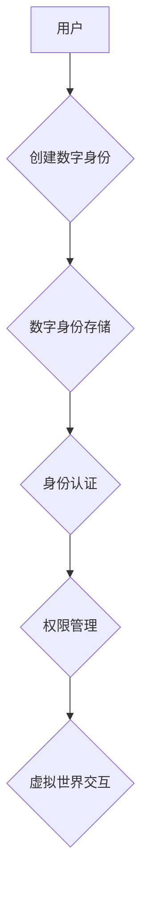

                 

## 元宇宙中的数字身份:虚拟世界的自我定义

> 关键词：元宇宙、数字身份、虚拟世界、自我定义、区块链、去中心化、隐私保护、身份认证、数字孪生

## 1. 背景介绍

元宇宙概念近年来备受关注，它被描绘成一个由虚拟现实、增强现实和互联网连接而成的沉浸式数字世界。在这个世界里，人们可以创建数字身份，参与各种虚拟活动，并与现实世界进行交互。数字身份在元宇宙中扮演着至关重要的角色，它代表着个体在虚拟世界中的存在和属性，决定着用户在元宇宙中的体验和权利。

然而，数字身份的构建和管理也面临着诸多挑战。传统数字身份体系往往集中化、缺乏可控性和隐私保护，难以满足元宇宙的多样性和复杂性需求。如何构建一个安全、可信、可控的数字身份体系，是元宇宙发展的重要课题。

## 2. 核心概念与联系

### 2.1 数字身份

数字身份是指在数字环境中代表个体身份的虚拟标识。它可以包含个人信息、属性、权限等数据，用于身份认证、授权和数据管理等场景。

### 2.2 元宇宙

元宇宙是一个由虚拟现实、增强现实和互联网连接而成的沉浸式数字世界。它是一个开放、共享、互联的虚拟空间，用户可以在其中创建数字身份，参与各种虚拟活动，并与现实世界进行交互。

### 2.3 核心概念联系

数字身份是元宇宙中不可或缺的一部分，它为用户在虚拟世界中提供身份认证、权限管理和数据安全等功能。

**Mermaid 流程图**



## 3. 核心算法原理 & 具体操作步骤

### 3.1 算法原理概述

数字身份的构建和管理通常涉及以下核心算法：

* **加密算法**: 用于保护数字身份信息的安全性和隐私性。
* **哈希算法**: 用于生成数字身份的唯一标识符，确保身份的不可伪造性。
* **数字签名**: 用于验证数字身份的合法性和完整性。
* **区块链技术**: 用于存储和管理数字身份信息，确保其安全性和不可篡改性。

### 3.2 算法步骤详解

1. **身份信息收集**: 用户提供个人信息、身份证明等数据。
2. **数据加密**: 使用加密算法对用户数据进行加密，保护其隐私性。
3. **哈希生成**: 使用哈希算法对加密后的数据生成唯一标识符，作为数字身份的标识。
4. **数字签名**: 使用私钥对数字身份标识符进行数字签名，验证身份的合法性。
5. **区块链存储**: 将数字身份信息和签名存储在区块链网络中，确保其安全性和不可篡改性。
6. **身份认证**: 用户在需要访问服务或资源时，使用数字身份标识符和私钥进行身份认证。

### 3.3 算法优缺点

**优点**:

* **安全性**: 加密算法和数字签名技术确保了数字身份信息的安全性。
* **不可篡改性**: 区块链技术确保了数字身份信息的不可篡改性。
* **可控性**: 用户拥有自己的私钥，可以控制数字身份信息的访问和使用。

**缺点**:

* **技术复杂性**: 数字身份的构建和管理需要复杂的算法和技术支持。
* **隐私保护**: 虽然加密算法可以保护用户数据，但仍然存在数据泄露的风险。
* **用户体验**: 用户需要学习和使用新的技术，才能有效地管理自己的数字身份。

### 3.4 算法应用领域

数字身份算法广泛应用于以下领域:

* **元宇宙**: 为用户在虚拟世界中提供身份认证、权限管理和数据安全等功能。
* **区块链**: 用于身份验证、数据管理和资产交易等场景。
* **物联网**: 为物联网设备提供身份认证和安全访问控制。
* **金融**: 用于身份验证、欺诈检测和风险管理等场景。

## 4. 数学模型和公式 & 详细讲解 & 举例说明

### 4.1 数学模型构建

数字身份的数学模型可以基于密码学和图论等理论构建。

* **密码学**: 用于构建数字签名、加密算法等安全机制。
* **图论**: 用于表示数字身份之间的关系和网络结构。

### 4.2 公式推导过程

* **哈希函数**:  $h(x) = y$，其中 $x$ 是输入数据，$y$ 是哈希值。哈希函数用于生成数字身份的唯一标识符。
* **数字签名**:  $signature = sign(private\_key, message)$，其中 $private\_key$ 是用户的私钥，$message$ 是需要签名的消息。数字签名用于验证身份的合法性。

### 4.3 案例分析与讲解

假设 Alice 想要在元宇宙中创建数字身份。

1. Alice 提供个人信息和身份证明。
2. 系统使用哈希函数对 Alice 的信息进行加密，生成一个唯一的数字身份标识符。
3. Alice 使用私钥对数字身份标识符进行数字签名，生成数字签名。
4. Alice 的数字身份信息和签名存储在区块链网络中。
5. 当 Alice 想要访问元宇宙中的服务或资源时，她需要使用数字身份标识符和私钥进行身份认证。
6. 系统验证 Alice 的数字签名，确认其身份合法后，允许 Alice 访问服务或资源。

## 5. 项目实践：代码实例和详细解释说明

### 5.1 开发环境搭建

* **编程语言**: Python
* **框架**: Flask
* **区块链平台**: Ethereum

### 5.2 源代码详细实现

```python
from flask import Flask, request, jsonify
from web3 import Web3

app = Flask(__name__)

# 连接到 Ethereum 网络
w3 = Web3(Web3.HTTPProvider('https://mainnet.infura.io/v3/YOUR_INFURA_PROJECT_ID'))

# 合约地址
contract_address = '0xYOUR_CONTRACT_ADDRESS'

# 合约实例
contract = w3.eth.contract(address=contract_address, abi=YOUR_CONTRACT_ABI)

@app.route('/create_identity', methods=['POST'])
def create_identity():
    # 获取用户数据
    user_data = request.get_json()

    # 对用户数据进行加密
    encrypted_data = encrypt(user_data)

    # 生成哈希值
    hash_value = hashlib.sha256(encrypted_data.encode()).hexdigest()

    # 使用私钥对哈希值进行数字签名
    signature = sign(private_key, hash_value)

    # 将数字身份信息存储到区块链
    tx_hash = contract.functions.storeIdentity(hash_value, signature).transact()

    # 返回交易哈希值
    return jsonify({'tx_hash': tx_hash.hex()})

# ... 其他 API 路由

if __name__ == '__main__':
    app.run(debug=True)
```

### 5.3 代码解读与分析

* **连接到区块链网络**: 使用 Web3 库连接到 Ethereum 网络。
* **部署合约**: 部署数字身份合约到区块链网络。
* **创建数字身份**: 用户提交个人信息，系统对数据进行加密，生成哈希值并进行数字签名，最终将数字身份信息存储到区块链。
* **身份认证**: 用户使用数字身份标识符和私钥进行身份认证。

### 5.4 运行结果展示

* 用户成功创建数字身份后，系统会返回交易哈希值，用户可以查看交易状态。
* 用户在元宇宙中访问服务或资源时，需要使用数字身份标识符和私钥进行身份认证。

## 6. 实际应用场景

### 6.1 元宇宙游戏

* 用户可以使用数字身份在游戏中创建角色，拥有虚拟资产，并参与游戏活动。
* 数字身份可以跨游戏平台进行互通，实现虚拟资产的流通和交易。

### 6.2 元宇宙社交

* 用户可以使用数字身份创建虚拟形象，与其他用户进行社交互动。
* 数字身份可以记录用户的社交关系和行为轨迹，为个性化推荐和社交体验提供支持。

### 6.3 元宇宙教育

* 用户可以使用数字身份在虚拟课堂中学习，与老师和同学进行互动。
* 数字身份可以记录用户的学习进度和成绩，为个性化学习和教育管理提供支持。

### 6.4 未来应用展望

* 数字身份将成为元宇宙中不可或缺的一部分，为用户提供更安全、更便捷、更丰富的虚拟体验。
* 数字身份的应用场景将不断扩展，覆盖更多领域，例如医疗、金融、娱乐等。

## 7. 工具和资源推荐

### 7.1 学习资源推荐

* **书籍**:
    * 《区块链技术入门》
    * 《元宇宙：虚拟世界的新纪元》
* **在线课程**:
    * Coursera: Blockchain Specialization
    * Udemy: The Metaverse: A Beginner's Guide

### 7.2 开发工具推荐

* **Web3 库**: Web3.py
* **区块链开发平台**: Remix IDE
* **编程语言**: Python, Solidity

### 7.3 相关论文推荐

* **Decentralized Identity: A Survey**
* **The Metaverse: A New Paradigm for Social Interaction**

## 8. 总结：未来发展趋势与挑战

### 8.1 研究成果总结

数字身份在元宇宙中的应用已经取得了一定的进展，但仍然面临着诸多挑战。

### 8.2 未来发展趋势

* **去中心化**: 数字身份将更加去中心化，用户拥有更大的控制权。
* **可互操作性**: 数字身份将更加互操作，用户可以在不同的元宇宙平台之间自由切换。
* **隐私保护**: 数字身份将更加注重隐私保护，用户可以控制自己的数据共享。

### 8.3 面临的挑战

* **技术复杂性**: 数字身份的构建和管理需要复杂的算法和技术支持。
* **用户体验**: 用户需要学习和使用新的技术，才能有效地管理自己的数字身份。
* **监管政策**: 数字身份的监管政策尚不完善，需要进一步的规范和引导。

### 8.4 研究展望

未来，数字身份技术将继续发展，为用户提供更安全、更便捷、更丰富的虚拟体验。

## 9. 附录：常见问题与解答

* **什么是数字身份？**

数字身份是指在数字环境中代表个体身份的虚拟标识。它可以包含个人信息、属性、权限等数据，用于身份认证、授权和数据管理等场景。

* **数字身份有什么优势？**

数字身份可以提供以下优势:

* **安全性**: 加密算法和数字签名技术确保了数字身份信息的安全性。
* **不可篡改性**: 区块链技术确保了数字身份信息的不可篡改性。
* **可控性**: 用户拥有自己的私钥，可以控制数字身份信息的访问和使用。

* **如何创建数字身份？**

用户可以通过注册平台或使用数字身份钱包创建数字身份。

* **如何保护数字身份安全？**

用户需要妥善保管自己的私钥，避免泄露或丢失。


作者：禅与计算机程序设计艺术 / Zen and the Art of Computer Programming 
<end_of_turn>

