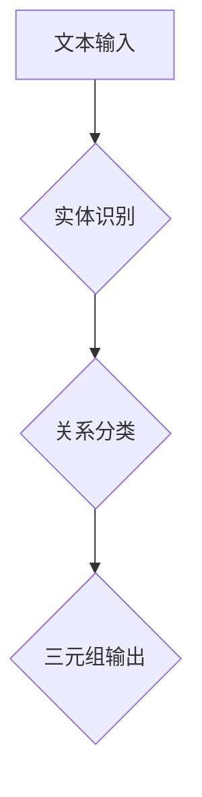

                 

## 关系抽取：从非结构化文本中提取知识

> 关键词：关系抽取、自然语言处理、知识图谱、深度学习、实体识别、关系分类

### 1. 背景介绍

在海量非结构化文本数据时代，如何从文本中自动提取有价值的知识，并将其组织成可理解和可利用的形式，成为一个重要的研究课题。关系抽取 (Relation Extraction，RE) 正是解决这一问题的关键技术之一。

关系抽取是指从文本中识别出实体之间的关系，并将其表示为三元组 (实体1, 关系, 实体2)。例如，在句子“苹果公司由史蒂夫·乔布斯创立”中，我们可以抽取出 (苹果公司, 创立者, 史蒂夫·乔布斯) 这个三元组。

关系抽取技术在构建知识图谱、信息检索、问答系统、文本摘要等领域有着广泛的应用。它可以帮助我们从文本中发现隐藏的知识，并将其用于各种智能应用。

### 2. 核心概念与联系

关系抽取的核心概念包括：

* **实体识别 (Entity Recognition)**：识别文本中的关键实体，例如人名、地名、机构名等。
* **关系分类 (Relation Classification)**：根据上下文判断实体之间的关系类型，例如“创立者”、“雇员”、“所在地”等。

关系抽取流程可以概括为以下步骤：



**实体识别**和**关系分类**是关系抽取的两大关键步骤。

* **实体识别**通常使用命名实体识别 (Named Entity Recognition，NER) 技术，通过训练模型识别文本中的实体。
* **关系分类**则需要根据实体之间的上下文关系，判断它们之间的关系类型。

### 3. 核心算法原理 & 具体操作步骤

#### 3.1 算法原理概述

关系抽取算法主要分为两类：

* **基于规则的方法**：依赖于人工定义的规则，通过正则表达式、模板匹配等方式提取关系。
* **基于机器学习的方法**：利用机器学习算法从训练数据中学习关系抽取模型。

基于机器学习的方法在近年来取得了显著的进展，并成为关系抽取的主流方法。常见的机器学习算法包括：

* **支持向量机 (Support Vector Machine，SVM)**
* **条件随机场 (Conditional Random Field，CRF)**
* **深度学习 (Deep Learning)**

#### 3.2 算法步骤详解

以深度学习方法为例，关系抽取的具体操作步骤如下：

1. **数据预处理**: 将文本数据进行清洗、分词、词性标注等预处理操作，以便模型训练。
2. **特征提取**: 从预处理后的文本数据中提取特征，例如词向量、句子结构特征、实体之间的距离等。
3. **模型训练**: 使用深度学习算法，例如循环神经网络 (Recurrent Neural Network，RNN) 或 transformers，训练关系抽取模型。
4. **模型评估**: 使用测试数据评估模型的性能，例如准确率、召回率、F1-score等。
5. **关系抽取**: 将训练好的模型应用于新的文本数据，进行关系抽取。

#### 3.3 算法优缺点

**深度学习方法**在关系抽取领域取得了显著的进展，其优点包括：

* **能够学习复杂的语义关系**: 深度学习模型能够学习文本中的复杂语义关系，并进行更准确的预测。
* **泛化能力强**: 深度学习模型在训练数据之外的文本数据上也表现良好。

**缺点包括**:

* **需要大量训练数据**: 深度学习模型需要大量的训练数据才能达到较好的性能。
* **训练时间长**: 深度学习模型的训练时间较长，需要强大的计算资源。

#### 3.4 算法应用领域

关系抽取技术在以下领域有着广泛的应用：

* **知识图谱构建**: 从文本数据中自动构建知识图谱，丰富知识库。
* **信息检索**: 理解用户查询意图，并从海量文本数据中检索相关信息。
* **问答系统**: 回答用户提出的问题，并提供相关文本证据。
* **文本摘要**: 从文本中提取关键信息，生成简洁的摘要。
* **社会网络分析**: 分析社交网络中的关系和互动模式。

### 4. 数学模型和公式 & 详细讲解 & 举例说明

#### 4.1 数学模型构建

关系抽取模型通常可以看作是一个分类问题，目标是将输入的文本片段分类到不同的关系类别中。

假设我们有一个文本片段 $T = (e_1, e_2, s)$，其中 $e_1$ 和 $e_2$ 是实体， $s$ 是连接实体的句子。

我们可以将关系抽取任务建模为一个二分类问题：

* $y = 1$ 表示 $(e_1, e_2)$ 属于关系 $r$。
* $y = 0$ 表示 $(e_1, e_2)$ 不属于关系 $r$。

#### 4.2 公式推导过程

可以使用逻辑回归或支持向量机等算法构建关系抽取模型。

例如，使用逻辑回归模型，我们可以将关系抽取任务转化为以下公式：

$$
P(y = 1 | T) = \frac{1}{1 + exp(-(w \cdot h(T) + b))}
$$

其中：

* $P(y = 1 | T)$ 是给定文本片段 $T$ 属于关系 $r$ 的概率。
* $w$ 是模型参数向量。
* $h(T)$ 是文本片段 $T$ 的特征向量。
* $b$ 是模型偏置项。

#### 4.3 案例分析与讲解

例如，假设我们想要抽取“雇员”关系。我们可以将训练数据中的句子进行标注，例如：

* “张三是谷歌的雇员。” (张三, 雇员, 谷歌)
* “李四在百度工作。” (李四, 雇员, 百度)

然后，我们可以使用逻辑回归模型训练一个关系抽取模型，该模型能够根据输入的文本片段预测实体之间的“雇员”关系。

### 5. 项目实践：代码实例和详细解释说明

#### 5.1 开发环境搭建

关系抽取项目可以使用 Python 语言进行开发。

需要安装以下库：

* **NLTK**: 自然语言处理库
* **spaCy**: 自然语言处理库
* **TensorFlow** 或 **PyTorch**: 深度学习框架

#### 5.2 源代码详细实现

以下是一个使用 TensorFlow 实现关系抽取模型的简单代码示例：

```python
import tensorflow as tf

# 定义模型结构
model = tf.keras.Sequential([
    tf.keras.layers.Embedding(input_dim=vocab_size, output_dim=embedding_dim),
    tf.keras.layers.LSTM(units=128),
    tf.keras.layers.Dense(units=num_classes, activation='softmax')
])

# 编译模型
model.compile(optimizer='adam',
              loss='sparse_categorical_crossentropy',
              metrics=['accuracy'])

# 训练模型
model.fit(x_train, y_train, epochs=10)

# 评估模型
loss, accuracy = model.evaluate(x_test, y_test)
print('Loss:', loss)
print('Accuracy:', accuracy)
```

#### 5.3 代码解读与分析

* **Embedding层**: 将词向量化，将每个词映射到一个低维向量空间。
* **LSTM层**: 学习文本序列中的长短时依赖关系。
* **Dense层**: 将 LSTM 层的输出映射到关系类别数。
* **softmax激活函数**: 将输出转换为概率分布，预测每个关系类别的概率。

#### 5.4 运行结果展示

训练完成后，可以使用测试数据评估模型的性能。

模型的性能指标包括：

* **准确率**: 预测正确的关系数占总关系数的比例。
* **召回率**: 预测正确的关系数占实际关系数的比例。
* **F1-score**: 准确率和召回率的 harmonic mean。

### 6. 实际应用场景

#### 6.1 知识图谱构建

关系抽取技术可以用于从文本数据中自动构建知识图谱。

例如，可以从新闻文章、维基百科等文本数据中抽取实体和关系，构建一个关于人物、事件、地点的知识图谱。

#### 6.2 信息检索

关系抽取技术可以用于理解用户查询意图，并从海量文本数据中检索相关信息。

例如，用户查询“苹果公司CEO是谁？”，关系抽取模型可以识别出“苹果公司”和“CEO”之间的关系，并返回“蒂姆·库克”。

#### 6.3 问答系统

关系抽取技术可以用于回答用户提出的问题，并提供相关文本证据。

例如，用户提问“谷歌总部在哪里？”，关系抽取模型可以从文本数据中抽取出“谷歌”和“总部”之间的关系，并返回“加州山景城”。

#### 6.4 文本摘要

关系抽取技术可以用于从文本中提取关键信息，生成简洁的摘要。

例如，可以从新闻报道中抽取出事件、人物、地点等关键实体和关系，生成一个简短的新闻摘要。

#### 6.5 社会网络分析

关系抽取技术可以用于分析社交网络中的关系和互动模式。

例如，可以从社交媒体数据中抽取出用户之间的关系，分析用户之间的社交圈和影响力。

#### 6.6 未来应用展望

随着深度学习技术的不断发展，关系抽取技术将有更广泛的应用场景。

例如：

* **医疗领域**: 从医学文献中抽取疾病、症状、治疗方法等关系，辅助医生诊断和治疗。
* **金融领域**: 从金融新闻和报告中抽取公司财务信息、市场趋势等关系，辅助投资者决策。
* **法律领域**: 从法律文件和判决书中抽取法律条款、案例关系，辅助律师进行法律研究和诉讼。

### 7. 工具和资源推荐

#### 7.1 学习资源推荐

* **Stanford NLP Group**: https://nlp.stanford.edu/
* **ACL Anthology**: https://aclanthology.org/
* **Hugging Face**: https://huggingface.co/

#### 7.2 开发工具推荐

* **spaCy**: https://spacy.io/
* **NLTK**: https://www.nltk.org/
* **TensorFlow**: https://www.tensorflow.org/
* **PyTorch**: https://pytorch.org/

#### 7.3 相关论文推荐

* **Relation Extraction via Convolutional Neural Networks**: https://arxiv.org/abs/1508.04464
* **A Unified Approach to Relation Extraction**: https://arxiv.org/abs/1709.01444
* **BERT for Relation Extraction**: https://arxiv.org/abs/1908.08894

### 8. 总结：未来发展趋势与挑战

#### 8.1 研究成果总结

关系抽取技术近年来取得了显著的进展，深度学习方法在关系抽取领域取得了突破性进展。

#### 8.2 未来发展趋势

未来关系抽取技术的发展趋势包括：

* **跨语言关系抽取**: 能够处理不同语言的文本数据。
* **低资源关系抽取**: 在少量训练数据的情况下也能有效地进行关系抽取。
* **多模态关系抽取**: 能够从文本、图像、音频等多模态数据中抽取关系。

#### 8.3 面临的挑战

关系抽取技术仍然面临一些挑战，例如：

* **语义歧义**: 许多关系在不同的语境下可能具有不同的含义。
* **长距离依赖关系**: 实体之间的关系可能跨越很长的文本片段。
* **噪声数据**: 现实世界中的文本数据往往包含噪声和错误。

#### 8.4 研究展望

未来关系抽取技术的研究方向包括：

* **开发更强大的深度学习模型**: 能够更好地处理语义歧义和长距离依赖关系。
* **设计更有效的训练方法**: 能够在低资源情况下有效地进行关系抽取。
* **探索多模态关系抽取**: 能够从多模态数据中抽取更丰富的知识。

### 9. 附录：常见问题与解答

#### 9.1 什么是关系抽取？

关系抽取是指从文本中识别出实体之间的关系，并将其表示为三元组 (实体1, 关系, 实体2)。

#### 9.2 关系抽取有哪些应用场景？

关系抽取技术在知识图谱构建、信息检索、问答系统、文本摘要、社会网络分析等领域有着广泛的应用。

#### 9.3 关系抽取算法有哪些？

常见的关系抽取算法包括基于规则的方法和基于机器学习的方法。基于机器学习的方法包括支持向量机、条件随机场和深度学习等。

#### 9.4 如何评估关系抽取模型的性能？

关系抽取模型的性能指标包括准确率、召回率和F1-score。


作者：禅与计算机程序设计艺术 / Zen and the Art of Computer Programming 
<end_of_turn>

