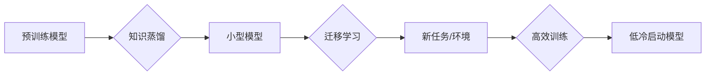

                 

## 冷启动问题：大模型的突破

> 关键词：大模型、冷启动、知识蒸馏、迁移学习、模型压缩、高效训练

### 1. 背景介绍

近年来，深度学习模型取得了令人瞩目的成就，在自然语言处理、计算机视觉、语音识别等领域展现出强大的能力。然而，这些大型模型的训练和部署也面临着诸多挑战，其中之一便是“冷启动问题”。

冷启动问题是指大型模型在首次使用或部署到新的环境时，其性能表现不佳，需要经过一段时间的“预热”才能达到预期水平。这主要是因为大型模型需要大量的训练数据和计算资源才能充分学习和优化，而初始阶段缺乏足够的上下文信息和经验，导致其在处理新数据时表现不佳。

冷启动问题对大型模型的应用带来了诸多不便，例如：

* **延迟响应:** 在首次使用时，模型需要花费大量时间进行初始化和预热，导致响应时间显著延长。
* **性能不稳定:** 模型在冷启动阶段的性能表现不稳定，难以保证一致性。
* **资源浪费:** 冷启动过程需要消耗大量的计算资源，增加了部署成本。

### 2. 核心概念与联系

冷启动问题本质上是模型缺乏初始知识和经验导致的。为了解决这个问题，我们需要探索如何有效地将预先训练好的模型知识迁移到新的任务或环境中，从而降低冷启动时间和提升模型性能。

**2.1 知识蒸馏**

知识蒸馏是一种模型压缩技术，通过将一个大型模型的知识“蒸馏”到一个小型模型中，从而实现模型压缩和性能提升。

**2.2 迁移学习**

迁移学习是指利用预先训练好的模型在新的任务或领域上进行训练，从而减少训练数据和训练时间。

**2.3 模型压缩**

模型压缩是指通过各种技术手段减少模型的大小，从而降低模型的部署成本和延迟时间。

**2.4 流程图**



### 3. 核心算法原理 & 具体操作步骤

**3.1 算法原理概述**

冷启动问题的解决方案主要集中在以下几个方面：

* **知识蒸馏:** 将大型模型的知识“蒸馏”到小型模型中，从而降低模型大小和部署成本，同时保留大部分模型性能。
* **迁移学习:** 利用预先训练好的模型在新的任务或领域上进行训练，从而减少训练数据和训练时间。
* **模型压缩:** 通过各种技术手段减少模型的大小，从而降低模型的部署成本和延迟时间。

**3.2 算法步骤详解**

**3.2.1 知识蒸馏**

1. **选择预训练模型:** 选择一个在相关领域具有良好性能的预训练模型作为教师模型。
2. **构建小型模型:** 构建一个比教师模型规模更小的学生模型。
3. **知识迁移:** 利用教师模型的输出作为监督信号，训练学生模型。
4. **模型评估:** 对学生模型进行评估，并根据性能进行调整。

**3.2.2 迁移学习**

1. **选择预训练模型:** 选择一个在相关领域具有良好性能的预训练模型。
2. **特征提取:** 将预训练模型的特征提取层作为新的模型的特征提取模块。
3. **微调:** 对新的模型进行微调，训练新的分类器或回归器。

**3.2.3 模型压缩**

1. **量化:** 将模型参数的精度降低，例如将32位浮点数转换为8位整数。
2. **剪枝:** 删除模型中不重要的参数或连接。
3. **知识蒸馏:** 将大型模型的知识“蒸馏”到小型模型中。

**3.3 算法优缺点**

**3.3.1 知识蒸馏**

* **优点:** 可以有效地压缩模型大小，降低部署成本，同时保留大部分模型性能。
* **缺点:** 需要额外的训练时间和资源，学生模型的性能可能无法完全达到教师模型的水平。

**3.3.2 迁移学习**

* **优点:** 可以有效地减少训练数据和训练时间，提高模型在新的任务或领域上的性能。
* **缺点:** 需要选择合适的预训练模型，否则可能会导致模型性能下降。

**3.3.3 模型压缩**

* **优点:** 可以有效地降低模型大小和部署成本，提高模型的效率。
* **缺点:** 模型压缩可能会导致模型性能下降。

**3.4 算法应用领域**

* **自然语言处理:** 文本分类、情感分析、机器翻译等。
* **计算机视觉:** 图像识别、目标检测、图像分割等。
* **语音识别:** 语音转文本、语音合成等。
* **推荐系统:** 商品推荐、用户画像等。

### 4. 数学模型和公式 & 详细讲解 & 举例说明

**4.1 数学模型构建**

知识蒸馏的数学模型可以表示为：

$$
L = L_{CE}(y, \hat{y}) + \alpha L_{KD}(y, \hat{y}_s)
$$

其中：

* $L_{CE}$ 是交叉熵损失函数，用于衡量教师模型的输出与真实标签之间的差异。
* $L_{KD}$ 是知识蒸馏损失函数，用于衡量学生模型的输出与教师模型的输出之间的差异。
* $\alpha$ 是平衡系数，用于控制知识蒸馏损失函数的权重。
* $y$ 是真实标签。
* $\hat{y}$ 是教师模型的输出。
* $\hat{y}_s$ 是学生模型的输出。

**4.2 公式推导过程**

知识蒸馏损失函数 $L_{KD}$ 通常采用KL散度来衡量两个概率分布之间的差异。

$$
L_{KD}(p, q) = \sum_i p(i) \log \frac{p(i)}{q(i)}
$$

其中：

* $p$ 是教师模型的输出概率分布。
* $q$ 是学生模型的输出概率分布。

**4.3 案例分析与讲解**

假设我们有一个预训练的图像分类模型，我们想将其知识蒸馏到一个更小的模型中。我们可以将预训练模型作为教师模型，构建一个更小的模型作为学生模型。然后，我们可以使用交叉熵损失函数和知识蒸馏损失函数来训练学生模型。

在训练过程中，教师模型的输出作为监督信号，指导学生模型学习。通过知识蒸馏，学生模型可以学习到教师模型的知识，从而提高其在图像分类任务上的性能。

### 5. 项目实践：代码实例和详细解释说明

**5.1 开发环境搭建**

* Python 3.7+
* TensorFlow 2.0+
* PyTorch 1.0+

**5.2 源代码详细实现**

```python
# 知识蒸馏代码示例 (使用 TensorFlow)

import tensorflow as tf

# 定义教师模型和学生模型
teacher_model = tf.keras.applications.ResNet50(weights='imagenet')
student_model = tf.keras.models.Sequential([
    tf.keras.layers.Conv2D(32, (3, 3), activation='relu', input_shape=(224, 224, 3)),
    tf.keras.layers.MaxPooling2D((2, 2)),
    tf.keras.layers.Conv2D(64, (3, 3), activation='relu'),
    tf.keras.layers.MaxPooling2D((2, 2)),
    tf.keras.layers.Flatten(),
    tf.keras.layers.Dense(1000, activation='softmax')
])

# 定义知识蒸馏损失函数
def distillation_loss(y_true, y_pred, y_teacher):
    return tf.keras.losses.CategoricalCrossentropy()(y_true, y_pred) + 0.1 * tf.keras.losses.KLDivergence()(y_true, y_teacher)

# 训练模型
student_model.compile(optimizer='adam', loss=distillation_loss, metrics=['accuracy'])
student_model.fit(x_train, y_train, epochs=10, validation_data=(x_val, y_val))

```

**5.3 代码解读与分析**

* 代码首先定义了教师模型和学生模型。教师模型是一个预训练的ResNet50模型，学生模型是一个更小的模型。
* 然后，代码定义了一个知识蒸馏损失函数，该函数包含交叉熵损失函数和KL散度损失函数。
* 最后，代码使用该损失函数训练学生模型。

**5.4 运行结果展示**

在训练完成后，我们可以评估学生模型的性能，并将其与教师模型的性能进行比较。

### 6. 实际应用场景

**6.1 自然语言处理**

* **聊天机器人:** 利用预训练语言模型的知识，快速构建能够进行自然对话的聊天机器人。
* **文本摘要:** 利用预训练语言模型的知识，快速生成文本摘要。

**6.2 计算机视觉**

* **目标检测:** 利用预训练图像分类模型的知识，快速构建能够检测目标的模型。
* **图像分类:** 利用预训练图像分类模型的知识，快速构建能够分类图像的模型。

**6.3 语音识别**

* **语音转文本:** 利用预训练语音识别模型的知识，快速构建能够将语音转换为文本的模型。
* **语音合成:** 利用预训练语音识别模型的知识，快速构建能够将文本转换为语音的模型。

**6.4 未来应用展望**

随着大模型技术的不断发展，冷启动问题将得到越来越多的关注和解决。未来，我们可能会看到以下方面的进展：

* **更有效的知识蒸馏方法:** 能够更有效地将大型模型的知识迁移到小型模型中。
* **更强大的迁移学习方法:** 能够在更少的训练数据和时间内，实现更好的模型性能。
* **更轻量级的模型架构:** 能够在保证性能的同时，进一步降低模型大小和部署成本。

### 7. 工具和资源推荐

**7.1 学习资源推荐**

* **书籍:**
    * 《深度学习》 by Ian Goodfellow, Yoshua Bengio, and Aaron Courville
    * 《动手学深度学习》 by Aurélien Géron
* **在线课程:**
    * TensorFlow 官方教程: https://www.tensorflow.org/tutorials
    * PyTorch 官方教程: https://pytorch.org/tutorials/

**7.2 开发工具推荐**

* **TensorFlow:** https://www.tensorflow.org/
* **PyTorch:** https://pytorch.org/
* **Keras:** https://keras.io/

**7.3 相关论文推荐**

* **Distilling the Knowledge in a Neural Network** by Geoffrey Hinton, Oriol Vinyals, and Jeff Dean
* **Transfer Learning** by Yoshua Bengio, Jean-Marc Vincent, and Pascal Lamblin

### 8. 总结：未来发展趋势与挑战

**8.1 研究成果总结**

近年来，在冷启动问题领域取得了显著进展，知识蒸馏、迁移学习和模型压缩等技术已经取得了不错的成果。这些技术能够有效地降低模型的冷启动时间和提升模型性能，为大模型的实际应用提供了重要的保障。

**8.2 未来发展趋势**

未来，冷启动问题研究将朝着以下几个方向发展：

* **更有效的知识蒸馏方法:** 探索更有效的知识蒸馏方法，能够更准确地将大型模型的知识迁移到小型模型中。
* **更强大的迁移学习方法:** 研究更强大的迁移学习方法，能够在更少的训练数据和时间内，实现更好的模型性能。
* **模型自适应性:** 研究能够根据不同的环境和任务自动调整模型参数和结构的模型，从而降低冷启动时间。

**8.3 面临的挑战**

尽管取得了显著进展，冷启动问题仍然面临着一些挑战：

* **知识迁移的效率:** 现有的知识蒸馏方法仍然存在一定的效率问题，需要进一步提高知识迁移的效率。
* **模型泛化能力:** 迁移学习模型在新的任务或领域上的泛化能力仍然需要提升。
* **数据隐私问题:** 在迁移学习过程中，需要考虑数据隐私问题，确保数据的安全性和合法性。

**8.4 研究展望**

冷启动问题是一个重要的研究方向，其解决将对大模型的应用产生深远的影响。未来，我们将继续探索更有效的解决方案，推动大模型技术的发展和应用。

### 9. 附录：常见问题与解答

**9.1 如何选择合适的预训练模型？**

选择预训练模型需要根据具体的应用场景和任务需求进行选择。一般来说，应该选择在相关领域具有良好性能的预训练模型。

**9.2 知识蒸馏的训练过程需要多长时间？**

知识蒸馏的训练时间取决于模型大小、数据集规模和训练参数等因素。一般来说，知识蒸馏的训练时间比从头训练模型的时间短。

**9.3 迁移学习的模型泛化能力如何提升？**

迁移学习模型的泛化能力可以通过以下方法提升：

* 使用更大的数据集进行训练。
* 使用更复杂的模型架构。
* 使用数据增强技术来增加训练数据的多样性。


作者：禅与计算机程序设计艺术 / Zen and the Art of Computer Programming<end_of_turn>

