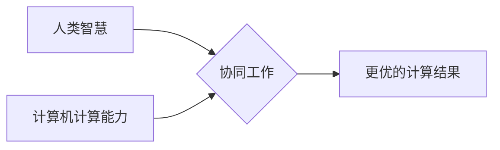

                 

## 创造更美好的明天：人类计算的积极作用

> 关键词： 人类计算、人工智能、计算模型、算法优化、数据分析、可持续发展、未来趋势

### 1. 背景介绍

人类文明的进步离不开对计算的不断探索和应用。从简单的算盘到复杂的超级计算机，计算一直是推动科技发展的重要驱动力。而随着人工智能技术的飞速发展，人类计算的概念逐渐成为一个重要的研究领域。

人类计算是指利用人类的智慧和认知能力，结合计算机技术，共同完成复杂的任务。它打破了传统计算机和人类之间的界限，将两者优势有机结合，形成一种全新的计算模式。

近年来，人类计算在各个领域展现出巨大的潜力，例如：

* **科学研究:** 人类计算可以帮助科学家更快地分析海量数据，发现新的规律和知识，加速科学发现。
* **医疗诊断:** 人类计算可以辅助医生进行疾病诊断，提高诊断的准确性和效率。
* **教育教学:** 人类计算可以个性化定制学习方案，提高学生的学习兴趣和效率。
* **艺术创作:** 人类计算可以帮助艺术家突破创作瓶颈，探索新的艺术形式。

### 2. 核心概念与联系

人类计算的核心概念是将人类的智慧和计算机的计算能力相结合，形成一个协同工作系统。

**2.1 人类智慧**

人类拥有独特的认知能力，例如：

* **创造力:** 人类能够产生新的想法和概念，解决复杂问题。
* **批判性思维:** 人类能够分析信息，判断是非，做出合理的决策。
* **情感智能:** 人类能够理解和处理情感，与他人建立良好的沟通和合作关系。

**2.2 计算机计算能力**

计算机拥有强大的计算能力，例如：

* **高速处理:** 计算机能够快速处理海量数据，进行复杂的计算。
* **存储能力:** 计算机能够存储海量信息，方便检索和分析。
* **自动化:** 计算机能够自动执行重复性任务，提高效率。

**2.3 协同工作模式**

人类和计算机在协同工作中，可以相互补充，发挥各自优势。例如：

* 人类提供创意和决策，计算机进行数据分析和计算。
* 人类进行复杂问题分析，计算机提供辅助工具和信息。
* 人类进行情感交流和沟通，计算机提供语言翻译和辅助工具。

**Mermaid 流程图**



### 3. 核心算法原理 & 具体操作步骤

人类计算的核心算法原理是将人类的智慧和计算机的计算能力有机结合，形成一种高效的计算模式。

**3.1 算法原理概述**

人类计算算法通常包括以下几个步骤：

1. **数据收集和预处理:** 收集相关数据，并进行清洗、转换和格式化等预处理工作。
2. **特征提取:** 从数据中提取关键特征，用于后续的计算和分析。
3. **模型构建:** 根据提取的特征，构建相应的计算模型，例如机器学习模型、深度学习模型等。
4. **模型训练和评估:** 使用训练数据训练模型，并评估模型的性能。
5. **预测和决策:** 将训练好的模型应用于新的数据，进行预测和决策。

**3.2 算法步骤详解**

* **数据收集和预处理:** 

   * 确定需要收集的数据类型和来源。
   * 使用爬虫、API等工具收集数据。
   * 对收集到的数据进行清洗，去除重复数据、错误数据等。
   * 对数据进行转换，例如将文本数据转换为数字数据。
   * 对数据进行格式化，例如将数据存储到数据库中。

* **特征提取:**

   * 确定需要提取的特征，例如文本中的关键词、图像中的物体等。
   * 使用自然语言处理、计算机视觉等技术提取特征。
   * 对提取的特征进行选择和筛选，保留最关键的特征。

* **模型构建:**

   * 选择合适的计算模型，例如线性回归、决策树、神经网络等。
   * 根据提取的特征和模型类型，构建相应的模型结构。
   * 使用编程语言或机器学习框架，实现模型的代码。

* **模型训练和评估:**

   * 使用训练数据训练模型，调整模型参数，使模型能够准确地预测结果。
   * 使用测试数据评估模型的性能，例如准确率、召回率、F1-score等。
   * 根据评估结果，对模型进行调整和优化。

* **预测和决策:**

   * 将训练好的模型应用于新的数据，进行预测和决策。
   * 根据预测结果，采取相应的行动。

**3.3 算法优缺点**

**优点:**

* 能够解决传统计算机难以解决的复杂问题。
* 能够利用人类的创造力和批判性思维，提高计算结果的质量。
* 能够更好地适应复杂和动态的环境。

**缺点:**

* 需要大量的计算资源和时间。
* 需要人类专家进行模型设计和参数调整。
* 存在伦理和安全方面的挑战。

**3.4 算法应用领域**

人类计算算法在各个领域都有广泛的应用，例如：

* **医疗诊断:** 辅助医生进行疾病诊断，提高诊断的准确性和效率。
* **金融风险管理:** 识别和评估金融风险，帮助金融机构做出更明智的决策。
* **科学研究:** 加速科学发现，例如药物研发、材料科学等。
* **教育教学:** 个性化定制学习方案，提高学生的学习兴趣和效率。

### 4. 数学模型和公式 & 详细讲解 & 举例说明

人类计算算法的数学模型通常基于概率论、统计学和机器学习等学科。

**4.1 数学模型构建**

例如，在机器学习领域，常用的数学模型是神经网络。神经网络是一种模仿人脑神经网络结构的计算模型，它由多个层级的神经元组成，每个神经元都连接到其他神经元，并通过权重进行信息传递。

**4.2 公式推导过程**

神经网络的训练过程是通过调整神经元的权重，使模型能够准确地预测结果。常用的训练算法是反向传播算法，它通过计算误差，并反向传播到每个神经元，调整每个神经元的权重。

**反向传播算法公式:**

$$
\Delta w_{ij} = \eta \frac{\partial E}{\partial w_{ij}}
$$

其中：

* $\Delta w_{ij}$ 是神经元 $i$ 和 $j$ 之间权重的更新量。
* $\eta$ 是学习率，控制着权重更新的幅度。
* $\frac{\partial E}{\partial w_{ij}}$ 是误差函数 $E$ 对权重 $w_{ij}$ 的偏导数。

**4.3 案例分析与讲解**

例如，在图像识别任务中，可以使用神经网络模型识别图像中的物体。训练数据包括大量的图像和对应的标签，例如“猫”、“狗”、“车”等。通过反向传播算法，神经网络模型可以学习到图像特征，并能够准确地识别图像中的物体。

### 5. 项目实践：代码实例和详细解释说明

**5.1 开发环境搭建**

* 安装 Python 语言和相关库，例如 TensorFlow、PyTorch 等。
* 设置开发环境，例如使用 Jupyter Notebook 进行代码编写和调试。

**5.2 源代码详细实现**

```python
import tensorflow as tf

# 定义神经网络模型
model = tf.keras.models.Sequential([
    tf.keras.layers.Conv2D(32, (3, 3), activation='relu', input_shape=(28, 28, 1)),
    tf.keras.layers.MaxPooling2D((2, 2)),
    tf.keras.layers.Conv2D(64, (3, 3), activation='relu'),
    tf.keras.layers.MaxPooling2D((2, 2)),
    tf.keras.layers.Flatten(),
    tf.keras.layers.Dense(10, activation='softmax')
])

# 编译模型
model.compile(optimizer='adam',
              loss='sparse_categorical_crossentropy',
              metrics=['accuracy'])

# 训练模型
model.fit(x_train, y_train, epochs=5)

# 评估模型
loss, accuracy = model.evaluate(x_test, y_test)
print('Test loss:', loss)
print('Test accuracy:', accuracy)
```

**5.3 代码解读与分析**

* 代码定义了一个简单的卷积神经网络模型，用于图像识别任务。
* 模型包含两个卷积层、两个池化层、一个全连接层和一个输出层。
* 模型使用 Adam 优化器、交叉熵损失函数和准确率作为评估指标。
* 模型使用训练数据进行训练，并使用测试数据进行评估。

**5.4 运行结果展示**

运行代码后，可以得到模型的训练过程和测试结果，例如训练损失、测试损失、训练准确率和测试准确率等。

### 6. 实际应用场景

人类计算在各个领域都有着广泛的应用场景，例如：

* **医疗诊断:** 人类计算可以帮助医生更快、更准确地诊断疾病，例如癌症、心血管疾病等。
* **金融风险管理:** 人类计算可以帮助金融机构识别和评估金融风险，例如欺诈、洗钱等。
* **科学研究:** 人类计算可以加速科学发现，例如药物研发、材料科学等。
* **教育教学:** 人类计算可以个性化定制学习方案，提高学生的学习兴趣和效率。

**6.4 未来应用展望**

未来，人类计算将更加深入地融入到我们的生活之中，例如：

* **智能家居:** 人类计算可以帮助智能家居设备更好地理解用户的需求，提供更个性化的服务。
* **自动驾驶:** 人类计算可以帮助自动驾驶汽车更好地感知周围环境，做出更安全的决策。
* **虚拟现实:** 人类计算可以帮助虚拟现实技术更加逼真、交互性更强。

### 7. 工具和资源推荐

**7.1 学习资源推荐**

* **书籍:**

    * 《深度学习》
    * 《机器学习》
    * 《人工智能：一种现代方法》

* **在线课程:**

    * Coursera
    * edX
    * Udacity

**7.2 开发工具推荐**

* **Python:** 

    * TensorFlow
    * PyTorch
    * scikit-learn

* **云计算平台:**

    * AWS
    * Azure
    * Google Cloud

**7.3 相关论文推荐**

* **《ImageNet Classification with Deep Convolutional Neural Networks》**
* **《Attention Is All You Need》**
* **《BERT: Pre-training of Deep Bidirectional Transformers for Language Understanding》**

### 8. 总结：未来发展趋势与挑战

**8.1 研究成果总结**

人类计算在各个领域取得了显著的成果，例如：

* **医疗诊断:** 人类计算可以帮助医生更快、更准确地诊断疾病。
* **金融风险管理:** 人类计算可以帮助金融机构识别和评估金融风险。
* **科学研究:** 人类计算可以加速科学发现。
* **教育教学:** 人类计算可以个性化定制学习方案。

**8.2 未来发展趋势**

未来，人类计算将朝着以下几个方向发展：

* **更加智能化:** 人类计算模型将更加智能化，能够更好地理解和处理复杂信息。
* **更加个性化:** 人类计算将更加个性化，能够根据用户的需求提供定制化的服务。
* **更加协同化:** 人类计算将更加协同化，能够更好地结合人类的智慧和计算机的计算能力。

**8.3 面临的挑战**

人类计算也面临着一些挑战，例如：

* **数据安全:** 人类计算需要处理大量的个人数据，需要确保数据的安全和隐私。
* **算法偏见:** 人类计算算法可能会存在偏见，需要进行公平性和可解释性的研究。
* **伦理问题:** 人类计算可能会引发一些伦理问题，例如人工智能的责任和义务。

**8.4 研究展望**

未来，我们需要继续加强对人类计算的理论研究和技术开发，并积极应对人类计算带来的挑战，推动人类计算技术朝着更加安全、可持续、可解释的方向发展。

### 9. 附录：常见问题与解答

**常见问题:**

* **什么是人类计算？**

   人类计算是指利用人类的智慧和计算机的计算能力，共同完成复杂任务的一种计算模式。

* **人类计算有哪些应用场景？**

   人类计算在各个领域都有广泛的应用场景，例如医疗诊断、金融风险管理、科学研究、教育教学等。

* **人类计算有哪些挑战？**

   人类计算面临着数据安全、算法偏见、伦理问题等挑战。

* **未来人类计算的发展趋势是什么？**

   未来，人类计算将更加智能化、个性化、协同化。


作者：禅与计算机程序设计艺术 / Zen and the Art of Computer Programming 
<end_of_turn>

