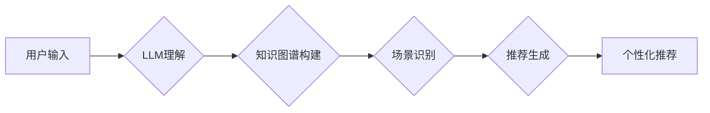

                 

## 利用LLM提升推荐系统的跨场景推荐能力

> 关键词：LLM,推荐系统,跨场景推荐,知识图谱,多模态融合,个性化推荐

## 1. 背景介绍

推荐系统作为互联网时代的重要技术支柱，在电商、社交媒体、视频平台等领域发挥着至关重要的作用。传统的推荐系统主要依赖于用户历史行为数据，例如点击、购买、评分等，通过协同过滤、内容过滤等算法进行推荐。然而，随着用户行为数据的多样化和场景的复杂化，传统的推荐系统面临着以下挑战：

* **数据稀疏性:** 用户行为数据往往存在稀疏性，难以准确捕捉用户细粒度的兴趣偏好。
* **冷启动问题:** 新用户或新商品缺乏历史行为数据，难以进行有效的推荐。
* **场景多样性:** 用户在不同场景下（例如工作、休闲、购物等）的兴趣偏好可能存在差异，单一模型难以满足跨场景推荐需求。

近年来，大语言模型（LLM）的快速发展为推荐系统带来了新的机遇。LLM具备强大的文本理解和生成能力，能够从海量文本数据中学习用户兴趣、商品属性等知识，并生成个性化推荐内容。

## 2. 核心概念与联系

**2.1  推荐系统概述**

推荐系统旨在根据用户的历史行为、偏好和上下文信息，预测用户对特定物品的兴趣，并提供个性化的推荐列表。

**2.2  LLM的优势**

LLM 拥有以下优势，使其成为推荐系统的重要补充：

* **强大的文本理解能力:** LLM 可以理解用户文本输入，例如搜索词、评论、描述等，并从中提取用户兴趣和需求。
* **丰富的知识表示:** LLM 可以从海量文本数据中学习用户兴趣、商品属性、场景关系等知识，构建丰富的知识图谱。
* **个性化内容生成:** LLM 可以根据用户需求生成个性化的推荐文案、描述、标题等，提升推荐的吸引力和点击率。

**2.3  跨场景推荐**

跨场景推荐是指在不同场景下，根据用户的上下文信息和行为模式，提供个性化的推荐。例如，在工作场景下推荐工作相关的文章和工具，在休闲场景下推荐娱乐内容。

**2.4  LLM在跨场景推荐中的应用**

LLM 可以通过以下方式提升推荐系统的跨场景推荐能力：

* **理解用户上下文:** LLM 可以分析用户的文本输入、设备信息、地理位置等上下文信息，识别用户的当前场景。
* **构建跨场景知识图谱:** LLM 可以学习不同场景下用户兴趣、商品属性、场景关系等知识，构建跨场景知识图谱。
* **生成场景化推荐:** LLM 可以根据用户的场景信息和兴趣偏好，生成场景化的推荐内容。

**2.5  架构图**



## 3. 核心算法原理 & 具体操作步骤

**3.1  算法原理概述**

LLM 提升跨场景推荐的核心算法原理是基于 Transformer 架构的深度学习模型，结合知识图谱和场景信息进行推荐。

**3.2  算法步骤详解**

1. **数据预处理:** 收集用户行为数据、商品信息、场景标签等数据，并进行清洗、格式化、编码等预处理。
2. **知识图谱构建:** 利用 LLM 从文本数据中提取实体、关系，构建用户兴趣、商品属性、场景关系等知识图谱。
3. **场景识别:** 利用 LLM 分析用户的文本输入、设备信息、地理位置等上下文信息，识别用户的当前场景。
4. **推荐模型训练:** 利用 Transformer 架构的深度学习模型，结合知识图谱和场景信息，训练推荐模型。
5. **推荐生成:** 根据用户的场景信息和兴趣偏好，利用训练好的推荐模型生成个性化的推荐列表。

**3.3  算法优缺点**

**优点:**

* 能够有效解决数据稀疏性和冷启动问题。
* 能够提供更个性化、更精准的推荐。
* 能够跨场景推荐，满足用户多样化的需求。

**缺点:**

* 训练数据量大，计算资源消耗高。
* 模型复杂度高，部署和维护成本高。
* 需要不断更新知识图谱，才能保持推荐的准确性。

**3.4  算法应用领域**

* 电商推荐
* 内容推荐
* 社交推荐
* 教育推荐
* 健康推荐

## 4. 数学模型和公式 & 详细讲解 & 举例说明

**4.1  数学模型构建**

推荐系统的核心数学模型是基于用户-商品交互矩阵的协同过滤模型。

**用户-商品交互矩阵:**

一个用户-商品交互矩阵 $R$，其中 $R_{ui}$ 表示用户 $u$ 对商品 $i$ 的评分或交互行为。

**4.2  公式推导过程**

协同过滤模型的目标是预测用户 $u$ 对商品 $i$ 的评分 $R_{ui}$。常用的协同过滤算法包括基于用户的协同过滤和基于物品的协同过滤。

**基于用户的协同过滤:**

预测用户 $u$ 对商品 $i$ 的评分 $R_{ui}$，可以使用以下公式：

$$R_{ui} = \frac{\sum_{v \in N(u)} \frac{R_{uv} \cdot sim(u, v)}{\sum_{w \in N(u)} sim(u, w)}}{\sum_{i \in I(u)} sim(u, i)}$$

其中:

* $N(u)$ 是用户 $u$ 的邻居用户集合。
* $sim(u, v)$ 是用户 $u$ 和用户 $v$ 之间的相似度。
* $I(u)$ 是用户 $u$ 已经交互过的商品集合。

**基于物品的协同过滤:**

预测用户 $u$ 对商品 $i$ 的评分 $R_{ui}$，可以使用以下公式：

$$R_{ui} = \frac{\sum_{v \in N(i)} \frac{R_{uv} \cdot sim(i, v)}{\sum_{w \in N(i)} sim(i, w)}}{\sum_{u \in U(i)} sim(u, i)}$$

其中:

* $N(i)$ 是商品 $i$ 的邻居商品集合。
* $sim(i, v)$ 是商品 $i$ 和商品 $v$ 之间的相似度。
* $U(i)$ 是已经交互过商品 $i$ 的用户集合。

**4.3  案例分析与讲解**

假设有一个电商平台，用户 $u$ 对商品 $i$ 的评分未知。基于用户的协同过滤算法可以根据用户 $u$ 的邻居用户对商品 $i$ 的评分，以及用户 $u$ 和邻居用户之间的相似度，预测用户 $u$ 对商品 $i$ 的评分。

## 5. 项目实践：代码实例和详细解释说明

**5.1  开发环境搭建**

* Python 3.7+
* PyTorch 1.7+
* Transformers 4.10+
* 其他依赖库：numpy, pandas, scikit-learn等

**5.2  源代码详细实现**

```python
import torch
from transformers import AutoModelForSequenceClassification, AutoTokenizer

# 加载预训练模型和词典
model_name = "bert-base-uncased"
tokenizer = AutoTokenizer.from_pretrained(model_name)
model = AutoModelForSequenceClassification.from_pretrained(model_name)

# 数据预处理
def preprocess_text(text):
    # ...

# 模型训练
# ...

# 推荐生成
def generate_recommendations(user_input):
    # ...
```

**5.3  代码解读与分析**

* 代码首先加载预训练的 BERT 模型和词典。
* 数据预处理阶段需要根据实际场景对用户输入文本进行清洗、格式化、编码等操作。
* 模型训练阶段需要使用训练数据训练推荐模型。
* 推荐生成阶段需要根据用户的输入文本，利用训练好的模型生成推荐列表。

**5.4  运行结果展示**

运行代码后，可以得到用户输入文本对应的推荐列表。

## 6. 实际应用场景

**6.1  电商推荐**

利用 LLM 提升电商平台的商品推荐精准度，根据用户的浏览历史、购买记录、评论等信息，推荐更符合用户需求的商品。

**6.2  内容推荐**

利用 LLM 提升内容平台的新闻、视频、文章等内容推荐精准度，根据用户的阅读习惯、观看历史、点赞等信息，推荐更符合用户兴趣的内容。

**6.3  社交推荐**

利用 LLM 提升社交平台的用户好友推荐、兴趣小组推荐等精准度，根据用户的社交关系、兴趣爱好、行为模式等信息，推荐更符合用户需求的社交内容。

**6.4  未来应用展望**

随着 LLM 技术的不断发展，其在推荐系统中的应用场景将更加广泛，例如：

* **多模态融合:** 将文本、图像、音频等多模态数据融合到推荐系统中，提升推荐的准确性和个性化程度。
* **个性化内容生成:** 利用 LLM 生成更个性化的推荐文案、描述、标题等，提升推荐的吸引力和点击率。
* **跨平台推荐:** 将用户行为数据跨平台整合，实现更全面的用户画像，提供更精准的跨平台推荐。

## 7. 工具和资源推荐

**7.1  学习资源推荐**

* **书籍:**
    * 《深度学习》
    * 《自然语言处理》
    * 《推荐系统》
* **在线课程:**
    * Coursera: 深度学习
    * edX: 自然语言处理
    * fast.ai: 推荐系统

**7.2  开发工具推荐**

* **Python:** 
    * PyTorch
    * TensorFlow
    * scikit-learn
* **框架:**
    * Transformers
    * HuggingFace

**7.3  相关论文推荐**

* **BERT:** Devlin et al. (2018). BERT: Pre-training of Deep Bidirectional Transformers for Language Understanding.
* **Transformer:** Vaswani et al. (2017). Attention Is All You Need.
* **推荐系统:**
    * Rendle et al. (2010). Factorization Machines.
    * Koren et al. (2009). Collaborative Filtering with Implicit Feedback.

## 8. 总结：未来发展趋势与挑战

**8.1  研究成果总结**

LLM 结合推荐系统，能够有效提升推荐的精准度、个性化程度和跨场景能力。

**8.2  未来发展趋势**

* **多模态融合:** 将文本、图像、音频等多模态数据融合到推荐系统中，提升推荐的准确性和个性化程度。
* **知识图谱增强:** 利用更丰富的知识图谱，提升推荐系统的理解能力和推荐质量。
* **联邦学习:** 利用联邦学习技术，保护用户隐私，实现更安全、更私密的推荐。

**8.3  面临的挑战**

* **数据安全和隐私:** LLM 模型训练需要大量用户数据，如何保护用户隐私和数据安全是一个重要的挑战。
* **模型解释性和可控性:** LLM 模型的决策过程往往是复杂的，如何提高模型的解释性和可控性是一个重要的研究方向。
* **计算资源消耗:** LLM 模型训练和部署需要大量的计算资源，如何降低计算成本是一个重要的挑战。

**8.4  研究展望**

未来，LLM 在推荐系统领域的应用将更加广泛，并带来更多创新和突破。

## 9. 附录：常见问题与解答

**9.1  LLM 模型训练需要多少数据？**

LLM 模型训练需要大量的文本数据，通常需要数十亿甚至数百亿个单词。

**9.2  LLM 模型训练需要多少计算资源？**

LLM 模型训练需要大量的计算资源，通常需要使用高性能GPU集群。

**9.3  LLM 模型如何保证推荐的准确性？**

LLM 模型的准确性取决于训练数据的质量和模型的架构设计。

**9.4  LLM 模型如何保护用户隐私？**

可以使用联邦学习等技术，保护用户隐私，实现更安全、更私密的推荐。


作者：禅与计算机程序设计艺术 / Zen and the Art of Computer Programming 
<end_of_turn>

