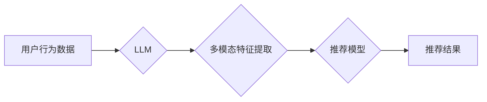

                 

## 利用LLM提升推荐系统的跨媒体推荐能力

> 关键词：LLM, 跨媒体推荐, 推荐系统, 自然语言处理, 多模态学习, 嵌入式表示, 用户行为分析

## 1. 背景介绍

推荐系统作为互联网时代的重要组成部分，旨在根据用户的历史行为、偏好和上下文信息，为用户推荐相关、有价值的内容。传统的推荐系统主要依赖于文本数据，例如用户评分、商品描述等，但随着数字内容的多样化，跨媒体推荐的需求日益增长。跨媒体推荐是指能够处理多种类型媒体数据（如文本、图像、音频、视频等）的推荐系统，能够更全面地理解用户的需求，提供更个性化、精准的推荐。

然而，跨媒体推荐面临着诸多挑战：

* **数据异构性:** 不同类型媒体数据具有不同的特征和表示方式，难以直接融合。
* **语义理解:** 需要理解不同媒体数据之间的语义关系，才能有效地进行跨媒体推荐。
* **计算复杂度:** 处理海量多模态数据需要强大的计算能力。

## 2. 核心概念与联系

近年来，大语言模型（LLM）的快速发展为跨媒体推荐提供了新的思路。LLM 拥有强大的文本理解和生成能力，能够学习和理解复杂的语义关系，并将其应用于跨媒体推荐任务。

**核心概念:**

* **LLM (Large Language Model):**  大型语言模型，通过训练海量文本数据，学习语言的语法、语义和上下文关系，能够进行文本生成、翻译、问答等多种任务。
* **跨媒体推荐:**  能够处理多种类型媒体数据（如文本、图像、音频、视频等）的推荐系统，提供更个性化、精准的推荐。
* **多模态学习:**  学习和理解多种类型数据之间的关系，并从中提取有价值的信息。

**架构图:**



**核心联系:**

LLM 可以用于跨媒体推荐系统中的多个环节，例如：

* **多模态特征提取:**  LLM 可以学习文本、图像、音频等不同类型媒体数据的语义特征，并将其转换为统一的嵌入式表示。
* **用户行为分析:**  LLM 可以分析用户的文本评论、浏览记录等行为数据，理解用户的兴趣和偏好。
* **推荐模型训练:**  LLM 可以作为推荐模型的一部分，学习用户和物品之间的关系，并进行推荐预测。

## 3. 核心算法原理 & 具体操作步骤

### 3.1  算法原理概述

LLM 提升跨媒体推荐的核心算法原理是利用其强大的文本理解能力，将不同类型媒体数据转换为统一的语义表示，并通过多模态学习方法，学习用户和物品之间的关系，进行推荐预测。

具体来说，该算法主要包括以下步骤：

1. **多模态数据预处理:** 对不同类型媒体数据进行预处理，例如文本数据进行分词、词干提取等，图像数据进行特征提取等。
2. **LLM 嵌入式表示学习:** 利用 LLM 将预处理后的多模态数据转换为统一的嵌入式表示，例如将文本数据转换为词向量，将图像数据转换为图像特征向量。
3. **多模态特征融合:** 将不同类型媒体数据的嵌入式表示进行融合，例如使用注意力机制或拼接操作，得到最终的多模态特征向量。
4. **推荐模型训练:** 利用融合后的多模态特征向量，训练推荐模型，例如基于用户的协同过滤模型、基于物品的协同过滤模型、深度学习模型等。
5. **推荐结果输出:** 根据训练好的推荐模型，对用户进行推荐，输出推荐结果。

### 3.2  算法步骤详解

1. **多模态数据预处理:**

* **文本数据:** 分词、词干提取、词向量化等。
* **图像数据:** 使用卷积神经网络 (CNN) 进行特征提取，例如 ResNet、VGG 等。
* **音频数据:** 使用循环神经网络 (RNN) 进行特征提取，例如 LSTM、GRU 等。

2. **LLM 嵌入式表示学习:**

* 使用预训练的 LLM 模型，例如 BERT、RoBERTa、GPT 等，对多模态数据进行编码，得到相应的嵌入式表示。
* 可以使用 fine-tuning 技术，对 LLM 模型进行微调，使其更适合跨媒体推荐任务。

3. **多模态特征融合:**

* **注意力机制:**  根据不同模态数据的 relevance，赋予不同的权重，融合多模态特征。
* **拼接操作:** 将不同模态数据的嵌入式表示直接拼接在一起，形成最终的多模态特征向量。
* **其他融合方法:**  例如多层感知机 (MLP)、图神经网络 (GNN) 等。

4. **推荐模型训练:**

* **基于用户的协同过滤:**  根据用户的历史行为数据，预测用户对物品的评分。
* **基于物品的协同过滤:**  根据物品之间的相似性，预测用户对物品的评分。
* **深度学习模型:**  例如多层感知机 (MLP)、卷积神经网络 (CNN)、循环神经网络 (RNN) 等，可以学习更复杂的特征关系。

5. **推荐结果输出:**

* 根据训练好的推荐模型，对用户进行推荐，输出推荐结果。
* 可以根据用户的反馈进行模型更新和优化。

### 3.3  算法优缺点

**优点:**

* **能够处理多种类型媒体数据:**  LLM 可以学习不同类型媒体数据的语义特征，并将其转换为统一的表示，从而实现跨媒体推荐。
* **语义理解能力强:**  LLM 拥有强大的文本理解能力，能够理解不同媒体数据之间的语义关系，从而进行更精准的推荐。
* **个性化推荐:**  LLM 可以分析用户的文本评论、浏览记录等行为数据，理解用户的兴趣和偏好，从而提供更个性化的推荐。

**缺点:**

* **计算复杂度高:**  LLM 的训练和推理过程需要大量的计算资源。
* **数据依赖性强:**  LLM 的性能取决于训练数据的质量和数量。
* **可解释性差:**  LLM 的决策过程比较复杂，难以解释其推荐结果背后的原因。

### 3.4  算法应用领域

LLM 提升跨媒体推荐的算法在以下领域具有广泛的应用前景:

* **电商推荐:**  根据用户的浏览记录、购买历史、评论等多模态数据，推荐相关的商品。
* **内容推荐:**  根据用户的阅读习惯、观看记录、点赞等多模态数据，推荐相关的文章、视频、音频等内容。
* **社交媒体推荐:**  根据用户的关注关系、互动行为、发布内容等多模态数据，推荐相关的用户、话题、群组等。
* **教育推荐:**  根据学生的学习进度、考试成绩、兴趣爱好等多模态数据，推荐相关的学习资源、课程、辅导等。

## 4. 数学模型和公式 & 详细讲解 & 举例说明

### 4.1  数学模型构建

假设我们有用户集合 U，物品集合 I，以及多模态特征矩阵 X，其中 X ∈ R^(|U|×|I|×d)，d 为多模态特征维度。

我们的目标是学习一个推荐模型 f(u, i)，预测用户 u 对物品 i 的评分。

### 4.2  公式推导过程

我们可以使用以下公式来表示推荐模型：

$$
f(u, i) = \mathbf{w}^T \cdot \mathbf{h}(u, i)
$$

其中：

*  **w** 为模型参数向量。
*  **h(u, i)** 为用户 u 和物品 i 的多模态特征融合后的表示向量。

我们可以使用以下方法来计算 **h(u, i)**：

$$
\mathbf{h}(u, i) = \mathbf{A} \cdot [\mathbf{x}_u, \mathbf{x}_i]
$$

其中：

*  **A** 为注意力机制矩阵，用于赋予不同模态特征不同的权重。
*  **x_u** 为用户 u 的多模态特征向量。
*  **x_i** 为物品 i 的多模态特征向量。

### 4.3  案例分析与讲解

例如，在电商推荐场景中，我们可以使用 LLM 将商品描述、用户评论等文本数据转换为嵌入式表示，并将商品图像特征也作为多模态特征输入。

通过注意力机制，模型可以学习到用户对不同模态特征的关注程度，并将其融合到最终的推荐结果中。

## 5. 项目实践：代码实例和详细解释说明

### 5.1  开发环境搭建

* Python 3.7+
* PyTorch 或 TensorFlow
* CUDA 和 cuDNN (可选，用于 GPU 加速)
* 其他依赖库：transformers, numpy, pandas 等

### 5.2  源代码详细实现

```python
import torch
from transformers import AutoModel, AutoTokenizer

# 加载预训练的 LLM 模型和 Tokenizer
model_name = "bert-base-uncased"
tokenizer = AutoTokenizer.from_pretrained(model_name)
model = AutoModel.from_pretrained(model_name)

# 定义多模态特征融合函数
def fuse_multimodal_features(text_embedding, image_embedding):
    # 使用注意力机制融合文本和图像特征
    # ...
    return fused_embedding

# 定义推荐模型
class RecommenderModel(torch.nn.Module):
    def __init__(self, embedding_dim, num_classes):
        super(RecommenderModel, self).__init__()
        self.fc = torch.nn.Linear(embedding_dim, num_classes)

    def forward(self, fused_embedding):
        return self.fc(fused_embedding)

# 训练推荐模型
# ...

```

### 5.3  代码解读与分析

* 代码首先加载预训练的 LLM 模型和 Tokenizer。
* 然后定义了一个多模态特征融合函数，该函数使用注意力机制将文本和图像特征融合在一起。
* 最后定义了一个推荐模型，该模型接收融合后的多模态特征作为输入，并输出推荐结果。

### 5.4  运行结果展示

* 通过训练和测试推荐模型，可以评估其推荐效果，例如准确率、召回率、NDCG 等指标。
* 可以使用可视化工具展示推荐结果，例如用户-物品交互图、推荐列表等。

## 6. 实际应用场景

### 6.1  电商推荐

* 结合商品描述、用户评论、商品图片等多模态数据，为用户推荐更精准的商品。
* 例如，可以根据用户的浏览历史和评论内容，推荐与用户兴趣相符的商品，并根据商品图片特征，推荐用户喜欢的风格的商品。

### 6.2  内容推荐

* 结合文章标题、内容、用户阅读记录、点赞等多模态数据，为用户推荐更相关的文章、视频、音频等内容。
* 例如，可以根据用户的阅读习惯和点赞记录，推荐用户感兴趣的主题的文章，并根据视频内容和用户观看记录，推荐用户喜欢的类型视频。

### 6.3  社交媒体推荐

* 结合用户关注关系、互动行为、发布内容等多模态数据，为用户推荐更相关的用户、话题、群组等。
* 例如，可以根据用户的关注关系和互动行为，推荐用户可能感兴趣的用户，并根据用户的发布内容和话题关注，推荐用户可能感兴趣的话题和群组。

### 6.4  未来应用展望

随着 LLM 技术的不断发展，跨媒体推荐系统将能够更加精准、个性化地为用户提供推荐服务。未来，跨媒体推荐系统可能在以下方面取得突破：

* **更复杂的语义理解:**  LLM 将能够更好地理解不同类型媒体数据之间的语义关系，从而进行更精准的推荐。
* **更个性化的推荐:**  LLM 将能够更加深入地理解用户的兴趣和偏好，从而提供更个性化的推荐。
* **更丰富的交互方式:**  LLM 将能够支持更丰富的交互方式，例如语音、图像、视频等，从而提供更沉浸式的推荐体验。

## 7. 工具和资源推荐

### 7.1  学习资源推荐

* **书籍:**
    * Deep Learning by Ian Goodfellow, Yoshua Bengio, and Aaron Courville
    * Natural Language Processing with Python by Steven Bird, Ewan Klein, and Edward Loper
* **在线课程:**
    * Stanford CS224N: Natural Language Processing with Deep Learning
    * DeepLearning.AI Specialization by Andrew Ng
* **博客和网站:**
    * Towards Data Science
    * Machine Learning Mastery

### 7.2  开发工具推荐

* **Python:**  用于开发推荐系统
* **PyTorch 或 TensorFlow:**  用于深度学习模型训练
* **transformers:**  用于加载预训练的 LLM 模型
* **scikit-learn:**  用于传统机器学习算法

### 7.3  相关论文推荐

* **BERT: Pre-training of Deep Bidirectional Transformers for Language Understanding**
* **Attention Is All You Need**
* **Multimodal Learning with Transformers**

## 8. 总结：未来发展趋势与挑战

### 8.1  研究成果总结

LLM 提升跨媒体推荐的算法取得了显著的成果，能够有效地处理多种类型媒体数据，并进行更精准的推荐。

### 8.2  未来发展趋势

* **更强大的 LLMs:**  未来将出现更强大的 LLMs，能够更好地理解复杂的语义关系，并进行更精准的推荐。
* **多模态学习的深入研究:**  未来将对多模态学习进行更深入的研究，探索更有效的融合方法，以及如何更好地利用不同模态数据的互补性。
* **个性化推荐的增强:**  未来将更加注重个性化推荐，利用 LLMs 深入理解用户的兴趣和偏好，提供更精准、更个性化的推荐服务。

### 8.3  面临的挑战

* **数据稀缺性:**  跨媒体数据的收集和标注成本较高，数据稀缺性是 LLMs 训练和应用的一个挑战。
* **计算资源需求:**  LLMs 的训练和推理过程需要大量的计算资源，这对于资源有限的机构或个人来说是一个挑战。
* **可解释性问题:**  LLMs 的决策过程比较复杂，难以解释其推荐结果背后的原因，这对于用户信任和推荐系统的可信度是一个挑战。

### 8.4  研究展望

未来，LLM 提升跨媒体推荐的研究将继续深入，探索更有效的算法、模型和应用场景，为用户提供更精准、更个性化的推荐服务。


## 9. 附录：常见问题与解答

**Q1:  LLM 提升跨媒体推荐的优势是什么？**

**A1:**  LLM 提升跨媒体推荐的优势在于其强大的文本理解能力，能够学习不同类型媒体数据的语义特征，并将其转换为统一的表示，从而实现跨媒体推荐。

**Q2:  LLM 提升跨媒体推荐有哪些应用场景？**

**A2:**  LLM 提升跨媒体推荐的应用场景广泛，例如电商推荐、内容推荐、社交媒体推荐等。

**Q3:  LLM 提升跨媒体推荐面临哪些挑战？**

**A3:**  LLM 提升跨媒体推荐面临的数据稀缺性、计算资源需求和可解释性问题等挑战。


作者：禅与计算机程序设计艺术 / Zen and the Art of Computer Programming<end_of_turn>

