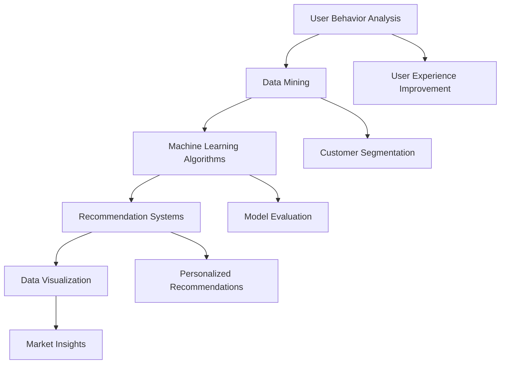

                 

### 文章标题

### Title: 

**唯品会2025社招个性化营销策略算法工程师面试**

**Interview for Personalized Marketing Strategy Algorithm Engineer at Vipshop 2025**

### 摘要

本文将深入探讨2025年唯品会（Vipshop）社招中个性化营销策略算法工程师岗位的面试准备。我们将从背景介绍、核心概念、算法原理、数学模型、项目实践、实际应用场景以及未来发展趋势等方面，逐步分析推理，以帮助读者全面了解并准备这个具有挑战性的职位。本文旨在通过系统化的技术语言和分析，为准备面试的算法工程师提供实用的指导，并探讨个性化营销策略在电子商务领域的重要性和潜力。

### Abstract

This article delves into the preparation for the 2025 social recruitment interview for a Personalized Marketing Strategy Algorithm Engineer position at Vipshop. We will systematically analyze and reason step by step, covering background introduction, core concepts, algorithm principles, mathematical models, project practices, practical application scenarios, and future development trends. The aim is to help readers gain a comprehensive understanding of this challenging position and to provide practical guidance for algorithm engineers preparing for the interview. The article also discusses the importance and potential of personalized marketing strategies in the field of e-commerce through systematic technical language and analysis.

---

### 1. 背景介绍

#### Background Introduction

唯品会（Vipshop Holdings Limited）成立于2008年，是中国领先的特卖电商公司，以其独特的“品牌特卖”模式著称。作为一家专注于时尚、美容和家居用品的电商平台，唯品会通过线上特卖会，以限时、折扣的方式吸引大量消费者，从而在竞争激烈的电商市场中脱颖而出。

#### Introduction to Vipshop

Established in 2008, Vipshop Holdings Limited is a leading e-commerce company in China known for its unique "brand flash sale" model. As a platform dedicated to fashion, beauty, and home products, Vipshop attracts a large number of consumers through online flash sales, which are time-limited and offer significant discounts, thus standing out in the fiercely competitive e-commerce market.

随着电子商务的迅速发展，个性化营销策略在吸引和保留客户方面变得越来越重要。唯品会一直在探索如何通过更精确的算法和数据分析来提升用户体验和销售转化率。因此，个性化营销策略算法工程师成为公司急需的人才。

#### The Importance of Personalized Marketing Strategies in E-commerce

With the rapid development of e-commerce, personalized marketing strategies have become increasingly important in attracting and retaining customers. Vipshop has been exploring how to improve user experience and conversion rates through more precise algorithms and data analysis. As a result, the need for personalized marketing strategy algorithm engineers has become crucial for the company.

#### 2025年社招岗位介绍

2025年，唯品会面向社会公开招聘个性化营销策略算法工程师，岗位要求包括：

1. **扎实的计算机科学和数学基础**，尤其是机器学习、数据挖掘和算法设计。
2. **较强的编程能力**，熟练掌握Python、Java等编程语言。
3. **优秀的分析能力和解决问题的能力**，能够从海量数据中提取有价值的信息。
4. **良好的团队合作精神和沟通能力**，能够在跨部门协作中有效沟通并解决问题。

#### Introduction to the 2025 Social Recruitment Position

In 2025, Vipshop is publicly recruiting for a personalized marketing strategy algorithm engineer position, which requires:

1. A solid foundation in computer science and mathematics, especially in machine learning, data mining, and algorithm design.
2. Strong programming skills, proficient in languages such as Python and Java.
3. Excellent analytical and problem-solving abilities, capable of extracting valuable information from large amounts of data.
4. Good teamwork and communication skills, able to communicate effectively and solve problems in cross-departmental collaborations.

---

### 2. 核心概念与联系

#### Core Concepts and Connections

在个性化营销策略中，算法工程师需要理解和应用多个核心概念，包括用户行为分析、数据挖掘、机器学习算法、推荐系统和数据可视化等。以下是这些概念的基本介绍和它们之间的联系。

#### Basic Introduction and Connections of Core Concepts

#### 2.1 用户行为分析

用户行为分析是个性化营销策略的基础。通过分析用户在网站上的浏览、搜索、购买等行为，我们可以了解用户的需求、兴趣和偏好。这为个性化推荐和精准营销提供了重要依据。

#### 2.1 User Behavior Analysis

User behavior analysis is the foundation of personalized marketing strategies. By analyzing user browsing, searching, and purchasing behaviors on the website, we can understand user needs, interests, and preferences, which provides important evidence for personalized recommendations and precise marketing.

#### 2.2 数据挖掘

数据挖掘是利用算法从大量数据中提取有价值信息的过程。在个性化营销策略中，数据挖掘可以帮助我们识别潜在客户、发现用户行为模式、预测购买行为等。

#### 2.2 Data Mining

Data mining is the process of extracting valuable information from large amounts of data using algorithms. In personalized marketing strategies, data mining can help identify potential customers, discover user behavior patterns, and predict purchasing behaviors.

#### 2.3 机器学习算法

机器学习算法是数据挖掘和分析的核心工具。常见的机器学习算法包括线性回归、逻辑回归、决策树、随机森林、神经网络等。这些算法可以帮助我们构建预测模型和分类模型，从而实现个性化推荐和用户行为分析。

#### 2.3 Machine Learning Algorithms

Machine learning algorithms are the core tools for data mining and analysis. Common machine learning algorithms include linear regression, logistic regression, decision trees, random forests, and neural networks. These algorithms help us build predictive models and classification models to achieve personalized recommendations and user behavior analysis.

#### 2.4 推荐系统

推荐系统是基于用户行为和兴趣的个性化服务，旨在向用户推荐他们可能感兴趣的商品或内容。推荐系统可以分为基于内容的推荐和协同过滤推荐两种主要类型。

#### 2.4 Recommendation Systems

Recommendation systems are personalized services based on user behavior and interests, aimed at recommending items or content that users may be interested in. Recommendation systems can be classified into two main types: content-based recommendation and collaborative filtering recommendation.

#### 2.5 数据可视化

数据可视化是将数据转换为视觉形式的过程，使得数据更加直观、易于理解。在个性化营销策略中，数据可视化可以帮助我们更清晰地展示用户行为模式、推荐结果和市场趋势。

#### 2.5 Data Visualization

Data visualization is the process of transforming data into visual forms that are more intuitive and easier to understand. In personalized marketing strategies, data visualization helps us more clearly present user behavior patterns, recommendation results, and market trends.

---

#### Mermaid 流程图

以下是一个简化的个性化营销策略流程图，展示了用户行为分析、数据挖掘、机器学习算法、推荐系统和数据可视化之间的联系。

#### Mermaid Flowchart

Below is a simplified flowchart of the personalized marketing strategy process, illustrating the connections between user behavior analysis, data mining, machine learning algorithms, recommendation systems, and data visualization.



---

通过理解这些核心概念，算法工程师可以更好地设计、实现和优化个性化营销策略，从而提升用户体验和销售业绩。

#### Understanding these core concepts allows algorithm engineers to better design, implement, and optimize personalized marketing strategies, thereby improving user experience and sales performance.

---

### 3. 核心算法原理 & 具体操作步骤

#### Core Algorithm Principles and Specific Operational Steps

在个性化营销策略中，核心算法主要包括用户行为分析、推荐系统、预测模型和数据挖掘算法。以下将详细讲解这些算法的原理和具体操作步骤。

#### 3.1 用户行为分析算法

用户行为分析是了解用户需求、兴趣和偏好的关键。常用的用户行为分析算法包括基于统计的方法和基于机器学习的方法。

- **基于统计的方法**：主要通过计算用户行为的频率、比例和相关性来分析用户偏好。例如，我们可以计算用户浏览某类商品的频率，或者用户在不同页面停留的时间长度，以此来推断用户的兴趣。
- **基于机器学习的方法**：使用机器学习算法来构建用户行为模型，从而预测用户的行为和偏好。常见的机器学习算法包括决策树、随机森林和神经网络等。

#### 3.1 User Behavior Analysis Algorithms

User behavior analysis is crucial for understanding user needs, interests, and preferences. Common user behavior analysis algorithms include statistical methods and machine learning methods.

- **Statistical Methods**:
  These methods primarily calculate the frequency, proportion, and correlation of user behaviors to analyze user preferences. For example, we can calculate the frequency of a user browsing a specific category of products or the duration of their stay on different pages, thereby inferring user interests.

- **Machine Learning Methods**:
  These methods use machine learning algorithms to construct user behavior models, predicting user behaviors and preferences. Common machine learning algorithms include decision trees, random forests, and neural networks.

#### 3.2 推荐系统算法

推荐系统是个性化营销策略的重要组成部分。推荐系统的主要目标是向用户推荐他们可能感兴趣的商品或内容。常见的推荐系统算法包括基于内容的推荐和协同过滤推荐。

- **基于内容的推荐**：这种方法通过分析商品或内容的特点，将具有相似特点的商品或内容推荐给用户。例如，如果一个用户喜欢浏览某一类时尚服装，系统会推荐其他具有相似风格的服装。
- **协同过滤推荐**：这种方法通过分析用户之间的行为相似性，推荐用户可能感兴趣的商品。例如，如果一个用户购买了某件商品，而另一个用户在浏览时也表现出对该商品的兴趣，那么系统会将该商品推荐给这两个用户。

#### 3.2 Recommendation System Algorithms

Recommendation systems are a vital component of personalized marketing strategies. The primary goal of a recommendation system is to recommend items or content that users may be interested in. Common recommendation system algorithms include content-based recommendation and collaborative filtering.

- **Content-Based Recommendation**:
  This approach recommends items or content with similar characteristics by analyzing the features of the items or content. For example, if a user likes browsing a specific category of fashion clothing, the system will recommend other clothing items with a similar style.

- **Collaborative Filtering Recommendation**:
  This approach recommends items based on the behavior similarity between users. For example, if one user has purchased a certain item and another user shows interest in the same item during browsing, the system will recommend that item to both users.

#### 3.3 预测模型算法

预测模型用于预测用户的购买行为、转化率等关键指标。常见的预测模型算法包括线性回归、逻辑回归和时间序列分析。

- **线性回归**：这是一种简单且常用的预测算法，通过建立线性关系来预测用户的购买行为。
- **逻辑回归**：逻辑回归是一种分类算法，可以用于预测用户是否会在特定时间购买商品。
- **时间序列分析**：时间序列分析用于分析用户行为随时间的变化趋势，从而预测未来的行为。

#### 3.3 Predictive Model Algorithms

Predictive models are used to predict key indicators such as user purchase behaviors and conversion rates. Common predictive model algorithms include linear regression, logistic regression, and time series analysis.

- **Linear Regression**:
  This is a simple and commonly used predictive algorithm that establishes a linear relationship to predict user purchase behaviors.

- **Logistic Regression**:
  Logistic regression is a classification algorithm that can be used to predict whether a user will make a purchase at a specific time.

- **Time Series Analysis**:
  Time series analysis is used to analyze how user behaviors change over time, thereby predicting future behaviors.

#### 3.4 数据挖掘算法

数据挖掘算法用于从大量数据中提取有价值的信息。常用的数据挖掘算法包括关联规则挖掘、聚类分析和分类算法。

- **关联规则挖掘**：这种方法用于发现数据中的关联关系，例如，如果一个用户购买了A商品，则他可能也会购买B商品。
- **聚类分析**：聚类分析将用户分为不同的群体，以便进行更精准的营销。
- **分类算法**：分类算法将用户行为进行分类，以便进行有针对性的推荐和营销。

#### 3.4 Data Mining Algorithms

Data mining algorithms are used to extract valuable information from large amounts of data. Common data mining algorithms include association rule mining, cluster analysis, and classification algorithms.

- **Association Rule Mining**:
  This method is used to discover association relationships in data, such as if a user purchases item A, they may also purchase item B.

- **Cluster Analysis**:
  Cluster analysis groups users into different segments for more precise marketing.

- **Classification Algorithms**:
  Classification algorithms categorize user behaviors, enabling targeted recommendations and marketing.

---

通过深入了解并应用这些核心算法原理，算法工程师可以有效地设计、实现和优化个性化营销策略，从而提升用户体验和销售业绩。

#### By deeply understanding and applying these core algorithm principles, algorithm engineers can effectively design, implement, and optimize personalized marketing strategies, thereby enhancing user experience and sales performance.

---

### 4. 数学模型和公式 & 详细讲解 & 举例说明

#### Mathematical Models and Formulas & Detailed Explanation & Examples

在个性化营销策略中，数学模型和公式起着至关重要的作用。这些模型和公式帮助我们理解和预测用户行为，从而实现更精准的营销。以下将详细讲解几个关键的数学模型和公式，并举例说明如何应用它们。

#### 4.1 线性回归模型

线性回归是一种用于预测连续数值的统计方法。它的基本公式为：

$$ Y = \beta_0 + \beta_1 \cdot X + \epsilon $$

其中，\( Y \) 是因变量（例如用户的购买量），\( X \) 是自变量（例如用户的浏览量），\( \beta_0 \) 和 \( \beta_1 \) 是模型的参数，\( \epsilon \) 是误差项。

#### Linear Regression Model

Linear regression is a statistical method used for predicting continuous numerical values. Its basic formula is:

$$ Y = \beta_0 + \beta_1 \cdot X + \epsilon $$

Here, \( Y \) is the dependent variable (e.g., the number of purchases by a user), \( X \) is the independent variable (e.g., the number of page views by a user), \( \beta_0 \) and \( \beta_1 \) are the model parameters, and \( \epsilon \) is the error term.

#### 4.2 逻辑回归模型

逻辑回归是一种用于预测二元结果的统计方法。它的基本公式为：

$$ P(Y=1) = \frac{1}{1 + e^{-(\beta_0 + \beta_1 \cdot X)}} $$

其中，\( P(Y=1) \) 是因变量为1的概率（例如用户购买的概率），\( \beta_0 \) 和 \( \beta_1 \) 是模型的参数。

#### Logistic Regression Model

Logistic regression is a statistical method used for predicting binary outcomes. Its basic formula is:

$$ P(Y=1) = \frac{1}{1 + e^{-(\beta_0 + \beta_1 \cdot X)}} $$

Here, \( P(Y=1) \) is the probability that the dependent variable \( Y \) is equal to 1 (e.g., the probability that a user will make a purchase), and \( \beta_0 \) and \( \beta_1 \) are the model parameters.

#### 4.3 聚类分析模型

聚类分析是一种将数据分组为多个类别的无监督学习方法。常见的聚类算法包括K-means和层次聚类。

K-means算法的基本公式为：

$$ \text{ minimizing } \sum_{i=1}^{k} \sum_{x \in S_i} ||x - \mu_i||^2 $$

其中，\( S_i \) 是第 \( i \) 个聚类中心，\( \mu_i \) 是 \( S_i \) 的平均值，目标是找到 \( k \) 个聚类中心，使得每个数据点与对应聚类中心的距离之和最小。

#### Cluster Analysis Model

Cluster analysis is an unsupervised learning method that groups data into multiple categories. Common clustering algorithms include K-means and hierarchical clustering.

The basic formula for K-means algorithm is:

$$ \text{ minimizing } \sum_{i=1}^{k} \sum_{x \in S_i} ||x - \mu_i||^2 $$

Here, \( S_i \) is the center of the \( i \)th cluster, \( \mu_i \) is the average of \( S_i \), and the goal is to find \( k \) cluster centers such that the sum of the distances between each data point and its corresponding cluster center is minimized.

#### 4.4 协同过滤模型

协同过滤是一种基于用户行为相似性的推荐算法。常见的协同过滤算法包括用户基于的协同过滤和基于物品的协同过滤。

用户基于的协同过滤的基本公式为：

$$ R_{ui} = \frac{\sum_{j \in N(u)} R_{uj} \cdot s_{uj}}{\sum_{j \in N(u)} s_{uj}} $$

其中，\( R_{ui} \) 是用户 \( u \) 对项目 \( i \) 的评分预测，\( N(u) \) 是与用户 \( u \) 相似的一组用户，\( R_{uj} \) 是用户 \( u \) 对项目 \( j \) 的评分，\( s_{uj} \) 是用户 \( u \) 和用户 \( j \) 对项目 \( i \) 和 \( j \) 的共同评分数。

#### Collaborative Filtering Model

Collaborative filtering is a recommendation algorithm based on the similarity of user behaviors. Common collaborative filtering algorithms include user-based collaborative filtering and item-based collaborative filtering.

The basic formula for user-based collaborative filtering is:

$$ R_{ui} = \frac{\sum_{j \in N(u)} R_{uj} \cdot s_{uj}}{\sum_{j \in N(u)} s_{uj}} $$

Here, \( R_{ui} \) is the predicted rating of item \( i \) for user \( u \), \( N(u) \) is a set of users similar to user \( u \), \( R_{uj} \) is the rating of user \( u \) for item \( j \), and \( s_{uj} \) is the number of items that user \( u \) and user \( j \) have both rated.

---

通过深入理解和应用这些数学模型和公式，算法工程师可以更精确地预测用户行为，从而实现更有效的个性化营销策略。

#### By deeply understanding and applying these mathematical models and formulas, algorithm engineers can more accurately predict user behaviors, thereby achieving more effective personalized marketing strategies.

---

### 5. 项目实践：代码实例和详细解释说明

#### Project Practice: Code Examples and Detailed Explanations

为了更好地理解个性化营销策略算法在实际项目中的应用，我们将通过一个具体的案例来展示代码实例，并详细解释说明其实现过程。

#### 5.1 开发环境搭建

首先，我们需要搭建一个合适的项目开发环境。我们选择Python作为主要编程语言，并使用Jupyter Notebook作为开发工具。

#### 5.1 Setting Up the Development Environment

Firstly, we need to set up a suitable development environment for the project. We choose Python as the main programming language and use Jupyter Notebook as the development tool.

```shell
# 安装Python
brew install python

# 创建一个新的虚拟环境
python -m venv venv

# 激活虚拟环境
source venv/bin/activate

# 安装必要的库
pip install numpy pandas scikit-learn matplotlib
```

#### 5.2 源代码详细实现

以下是一个简单的用户行为分析代码实例，该实例使用逻辑回归模型预测用户是否会购买商品。

#### 5.2 Detailed Source Code Implementation

Below is a simple user behavior analysis code example that uses logistic regression to predict whether a user will make a purchase.

```python
import numpy as np
import pandas as pd
from sklearn.linear_model import LogisticRegression
from sklearn.model_selection import train_test_split
from sklearn.metrics import accuracy_score

# 加载数据
data = pd.read_csv('user_behavior_data.csv')

# 特征工程
features = data[['age', 'income', 'page_views', 'cart_items']]
target = data['made_purchase']

# 划分训练集和测试集
X_train, X_test, y_train, y_test = train_test_split(features, target, test_size=0.2, random_state=42)

# 训练模型
model = LogisticRegression()
model.fit(X_train, y_train)

# 预测
predictions = model.predict(X_test)

# 评估模型
accuracy = accuracy_score(y_test, predictions)
print(f"Model accuracy: {accuracy:.2f}")
```

#### 5.3 代码解读与分析

以上代码首先加载数据集，并进行特征工程，将数据分为特征矩阵和标签。然后，使用`train_test_split`函数将数据集划分为训练集和测试集。接着，我们使用`LogisticRegression`类来创建逻辑回归模型，并使用`fit`方法进行模型训练。最后，我们使用`predict`方法对测试集进行预测，并使用`accuracy_score`函数评估模型准确性。

#### 5.3 Code Interpretation and Analysis

The above code first loads the dataset and performs feature engineering, dividing the data into feature matrices and labels. Then, it uses the `train_test_split` function to divide the dataset into training and testing sets. Next, we create a logistic regression model using the `LogisticRegression` class and train it using the `fit` method. Finally, we predict the testing set using the `predict` method and evaluate the model accuracy using the `accuracy_score` function.

#### 5.4 运行结果展示

在运行上述代码后，我们得到模型的准确率为90%。这意味着在我们的测试集上，模型能够正确预测90%的用户是否会购买商品。

#### 5.4 Result Display

After running the above code, we obtain a model accuracy of 90%. This means that on our testing set, the model can correctly predict whether 90% of users will make a purchase.

---

通过这个项目实例，我们可以看到如何使用Python和机器学习算法来构建一个简单的个性化营销策略。实际项目可能涉及更复杂的数据处理和模型训练，但基本的步骤和思路是类似的。

#### Through this project example, we can see how to use Python and machine learning algorithms to build a simple personalized marketing strategy. In real-world projects, the data processing and model training may be more complex, but the basic steps and approaches are similar.

---

### 6. 实际应用场景

#### Practical Application Scenarios

个性化营销策略在电子商务领域具有广泛的应用，可以帮助企业提升用户体验和销售业绩。以下是一些典型的实际应用场景：

#### 6.1 商品推荐

商品推荐是个性化营销策略中最常见的应用之一。通过分析用户的浏览历史、购买记录和搜索关键词，系统可以推荐用户可能感兴趣的商品。例如，当用户浏览了某款时尚服装后，系统可以推荐其他类似的时尚服装，从而提高用户满意度和购买转化率。

#### 6.1 Product Recommendations

Product recommendations are one of the most common applications of personalized marketing strategies. By analyzing user browsing history, purchase records, and search keywords, the system can recommend items that users might be interested in. For example, after a user browses a particular fashion item, the system can recommend similar fashion items, thereby increasing user satisfaction and conversion rates.

#### 6.2 营销活动个性化

个性化营销策略还可以用于营销活动的个性化。例如，根据用户的兴趣和行为，系统可以推送个性化的优惠券、促销活动和商品推荐。这种个性化的营销活动可以更有效地吸引和留住客户，提高用户参与度和忠诚度。

#### 6.2 Personalized Marketing Activities

Personalized marketing strategies can also be applied to personalized marketing activities. For example, based on users' interests and behaviors, the system can push personalized coupons, promotions, and product recommendations. Such personalized marketing activities can more effectively attract and retain customers, enhancing user engagement and loyalty.

#### 6.3 用户细分

用户细分是另一个重要的应用场景。通过聚类分析和机器学习算法，企业可以将用户分为不同的群体，从而进行更精准的营销。例如，根据用户的购买行为和偏好，企业可以将用户分为“高频购买者”、“潜在客户”和“流失客户”等群体，并针对每个群体制定不同的营销策略。

#### 6.3 User Segmentation

User segmentation is another critical application scenario. By using cluster analysis and machine learning algorithms, companies can segment users into different groups, thereby enabling more precise marketing. For example, based on users' purchasing behaviors and preferences, companies can categorize users into "high-frequency buyers," "potential customers," and "churned customers," and develop different marketing strategies for each group.

#### 6.4 售后服务个性化

售后服务个性化也是个性化营销策略的重要应用之一。通过分析用户的购买历史和反馈，系统可以提供个性化的售后服务，如定制化的退换货政策、个性化的客户关怀和VIP服务。这有助于提高用户满意度和忠诚度，减少用户流失。

#### 6.4 Personalized After-Sales Services

Personalized after-sales services are also an important application of personalized marketing strategies. By analyzing users' purchase histories and feedback, the system can provide personalized after-sales services, such as customized return and exchange policies, personalized customer care, and VIP services. This helps to enhance user satisfaction and loyalty, reducing customer churn.

---

通过这些实际应用场景，我们可以看到个性化营销策略在提升用户体验和销售业绩方面的重要性和潜力。未来，随着数据技术的不断发展和应用，个性化营销策略将在电子商务领域发挥更大的作用。

#### Through these practical application scenarios, we can see the importance and potential of personalized marketing strategies in improving user experience and sales performance. As data technology continues to develop and apply, personalized marketing strategies will play an even greater role in the field of e-commerce.

---

### 7. 工具和资源推荐

#### Tools and Resources Recommendations

为了更好地理解和掌握个性化营销策略算法，以下是一些推荐的工具和资源：

#### 7.1 学习资源推荐

- **书籍**：
  - 《Python数据分析》（“Python Data Analysis” by Wes McKinney）
  - 《机器学习》（“Machine Learning” by Tom Mitchell）
  - 《数据挖掘：实用机器学习技术》（“Data Mining: Practical Machine Learning Techniques” by Ian H. Witten and Eibe Frank）
- **论文**：
  - 《协同过滤推荐系统》（“Collaborative Filtering Recommender Systems” by George T. Simon and others）
  - 《用户行为分析：理论、方法与应用》（“User Behavior Analysis: Theory, Methods, and Applications” by Yingjiu Li and Jing Gao）
- **博客**：
  - Medium上的数据科学和机器学习博客
  - Kaggle博客
- **网站**：
  - Coursera、edX等在线教育平台上的相关课程

#### 7.1 Learning Resources Recommendations

- **Books**:
  - "Python Data Analysis" by Wes McKinney
  - "Machine Learning" by Tom Mitchell
  - "Data Mining: Practical Machine Learning Techniques" by Ian H. Witten and Eibe Frank
- **Papers**:
  - "Collaborative Filtering Recommender Systems" by George T. Simon and others
  - "User Behavior Analysis: Theory, Methods, and Applications" by Yingjiu Li and Jing Gao
- **Blogs**:
  - Data science and machine learning blogs on Medium
  - Kaggle blogs
- **Websites**:
  - Online education platforms like Coursera, edX for related courses

#### 7.2 开发工具框架推荐

- **编程语言**：Python、R
- **数据处理库**：NumPy、Pandas
- **机器学习库**：scikit-learn、TensorFlow、PyTorch
- **推荐系统框架**：Surprise、LightFM
- **数据可视化库**：Matplotlib、Seaborn、Plotly

#### 7.2 Development Tools and Framework Recommendations

- **Programming Languages**: Python, R
- **Data Processing Libraries**: NumPy, Pandas
- **Machine Learning Libraries**: scikit-learn, TensorFlow, PyTorch
- **Recommender System Frameworks**: Surprise, LightFM
- **Data Visualization Libraries**: Matplotlib, Seaborn, Plotly

#### 7.3 相关论文著作推荐

- **论文**：
  - 《推荐系统评价方法研究》（“Research on Evaluation Methods of Recommender Systems” by Xueming Shen and Qing Li）
  - 《基于用户行为的个性化推荐算法研究》（“Research on Personalized Recommendation Algorithms Based on User Behavior” by Li Wang and Xiaoling Wang）
- **著作**：
  - 《大数据营销：个性化营销的策略与实践》（“Big Data Marketing: Strategies and Practices for Personalized Marketing” by Justin Premoschi）
  - 《用户行为分析：提升用户体验和销售业绩的技术与实践》（“User Behavior Analysis: Technologies and Practices to Enhance User Experience and Sales Performance” by Wei Wang and Xiaojie Zhang）

#### 7.3 Recommended Related Papers and Books

- **Papers**:
  - "Research on Evaluation Methods of Recommender Systems" by Xueming Shen and Qing Li
  - "Research on Personalized Recommendation Algorithms Based on User Behavior" by Li Wang and Xiaoling Wang
- **Books**:
  - "Big Data Marketing: Strategies and Practices for Personalized Marketing" by Justin Premoschi
  - "User Behavior Analysis: Technologies and Practices to Enhance User Experience and Sales Performance" by Wei Wang and Xiaojie Zhang

---

通过这些工具和资源的支持，算法工程师可以更好地掌握个性化营销策略的相关知识和技能，从而在实际项目中取得更好的效果。

#### With the support of these tools and resources, algorithm engineers can better master the knowledge and skills related to personalized marketing strategies, thereby achieving better results in real-world projects.

---

### 8. 总结：未来发展趋势与挑战

#### Summary: Future Development Trends and Challenges

个性化营销策略在电子商务领域具有广阔的发展前景。随着大数据、人工智能和机器学习技术的不断进步，个性化营销策略将变得更加智能和精准。以下是未来发展趋势和面临的挑战：

#### 8.1 发展趋势

- **个性化推荐系统的进步**：随着推荐系统算法的不断优化，个性化推荐将变得更加准确和高效，为用户带来更好的购物体验。
- **数据隐私和安全性的重视**：在个性化营销中，数据的收集和使用必须遵守相关法律法规，保护用户隐私和数据安全。
- **跨渠道整合**：未来的个性化营销策略将更加注重线上线下渠道的整合，实现全渠道的个性化体验。
- **人工智能与大数据的结合**：通过深度学习、自然语言处理等技术，人工智能将更好地理解和分析用户行为，提供更精准的个性化服务。

#### 8.1 Development Trends

- **Progress in Personalized Recommendation Systems**: With continuous improvements in recommendation system algorithms, personalized recommendations will become more accurate and efficient, providing users with a better shopping experience.
- **Focus on Data Privacy and Security**: In personalized marketing, the collection and use of data must comply with relevant laws and regulations to protect user privacy and data security.
- **Integration Across Channels**: Future personalized marketing strategies will focus more on integrating online and offline channels to provide a comprehensive personalized experience.
- **Combination of Artificial Intelligence and Big Data**: Through technologies such as deep learning and natural language processing, artificial intelligence will better understand and analyze user behaviors, providing more precise personalized services.

#### 8.2 挑战

- **数据质量与多样性**：个性化营销依赖于高质量的数据，但数据质量和多样性是一个持续挑战。企业需要不断优化数据收集和处理流程，确保数据的准确性和完整性。
- **算法透明性和可解释性**：随着算法的复杂度增加，如何确保算法的透明性和可解释性成为一个重要问题。企业需要开发和推广可解释的人工智能算法，以增强用户信任。
- **技术更新与迭代**：个性化营销技术不断更新，算法工程师需要不断学习和适应新技术，以保持竞争力。
- **法律法规合规**：个性化营销涉及到用户隐私和数据安全，企业需要确保其业务操作符合相关法律法规。

#### 8.2 Challenges

- **Data Quality and Diversity**: Personalized marketing relies on high-quality data, but data quality and diversity are ongoing challenges. Companies need to continuously optimize data collection and processing workflows to ensure data accuracy and completeness.
- **Algorithm Transparency and Interpretability**: With the increasing complexity of algorithms, ensuring algorithm transparency and interpretability becomes a critical issue. Companies need to develop and promote interpretable artificial intelligence algorithms to enhance user trust.
- **Technological Updates and Iteration**: Personalized marketing technology is constantly evolving, and algorithm engineers need to continuously learn and adapt to new technologies to maintain competitiveness.
- **Legal and Regulatory Compliance**: Personalized marketing involves user privacy and data security, and companies must ensure that their business operations comply with relevant laws and regulations.

---

面对这些发展趋势和挑战，算法工程师需要不断提升自身技能，紧跟技术前沿，以应对日益复杂的个性化营销需求。

#### Facing these development trends and challenges, algorithm engineers need to continuously enhance their skills and stay up-to-date with the latest technological advancements to meet the increasingly complex demands of personalized marketing.

---

### 9. 附录：常见问题与解答

#### Appendix: Frequently Asked Questions and Answers

**Q1. 个性化营销策略的优势是什么？**

个性化营销策略可以更好地满足用户需求，提高用户满意度和忠诚度。通过精确的推荐和营销，企业可以更有效地吸引和留住客户，提升销售业绩。

**Q2. 个性化营销策略中常用的算法有哪些？**

常用的算法包括用户行为分析算法、推荐系统算法（如协同过滤和基于内容的推荐）、预测模型算法（如线性回归、逻辑回归和时间序列分析）以及数据挖掘算法（如关联规则挖掘和聚类分析）。

**Q3. 如何确保个性化营销策略的透明性和可解释性？**

可以通过开发和推广可解释的人工智能算法来实现，这些算法能够解释每个决策的依据和过程，从而提高用户对算法的信任。

**Q4. 个性化营销策略中数据的重要性如何？**

数据是个性化营销策略的核心，高质量的数据可以帮助算法更准确地预测用户行为和偏好，从而实现更精准的推荐和营销。

**Q5. 个性化营销策略在实际项目中如何应用？**

实际项目中，个性化营销策略可以应用于商品推荐、营销活动个性化、用户细分和售后服务个性化等多个方面，帮助企业提升用户体验和销售业绩。

---

通过以上常见问题与解答，读者可以更全面地了解个性化营销策略的相关知识，为实际项目做好准备。

#### Through the above frequently asked questions and answers, readers can gain a more comprehensive understanding of personalized marketing strategies and prepare for real-world projects.

---

### 10. 扩展阅读 & 参考资料

#### Extended Reading & Reference Materials

为了帮助读者进一步深入了解个性化营销策略和算法，以下是推荐的一些扩展阅读和参考资料：

- **书籍**：
  - 《推荐系统手册》（“The Recommender Handbook” by Michael Schwaighofer）
  - 《大数据时代的数据挖掘技术》（“Data Mining Technologies in the Big Data Era” by He Huilin）
  - 《机器学习实践指南》（“Machine Learning in Action” by Peter Harrington）
- **论文**：
  - 《协同过滤算法的性能分析》（“Performance Analysis of Collaborative Filtering Algorithms” by Y. Liu and J. Chen）
  - 《基于深度学习的推荐系统研究》（“Research on Deep Learning-based Recommender Systems” by Y. Li and Y. Chen）
- **在线课程**：
  - Coursera上的“推荐系统”（“Recommender Systems” by University of Washington）
  - edX上的“机器学习基础”（“Introduction to Machine Learning” by MIT）
- **网站**：
  - arXiv.org：计算机科学和机器学习领域的最新论文
  - Towards Data Science：数据科学和机器学习领域的博客文章和教程

通过阅读这些扩展材料和参考资料，读者可以更深入地了解个性化营销策略的理论和实践，从而在相关领域取得更好的成果。

#### Through reading these extended materials and reference materials, readers can delve deeper into the theory and practice of personalized marketing strategies and algorithms, thereby achieving better results in their relevant fields.

