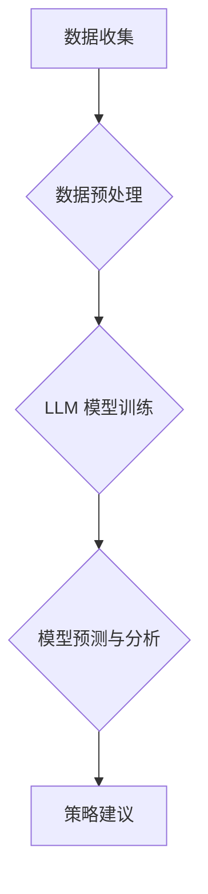

                 

## 商业策略顾问：LLM 驱动数据决策

> 关键词：LLM, 大语言模型, 数据决策, 商业策略, 深度学习, 自然语言处理

### 1. 背景介绍

在当今数据爆炸的时代，企业面临着海量数据的挑战。如何从海量数据中提取有价值的信息，并将其转化为有效的商业策略，成为企业发展的关键。大型语言模型（LLM）作为一种强大的人工智能技术，凭借其强大的文本理解和生成能力，为企业提供了一种全新的数据决策解决方案。

LLM 是一种基于深度学习的算法，能够学习和理解人类语言的复杂结构和语义。通过训练大量的文本数据，LLM 可以掌握丰富的知识和语言表达能力，并能够执行各种自然语言处理任务，例如文本分类、文本摘要、机器翻译、问答系统等。

近年来，LLM 技术取得了长足的进步，例如 GPT-3、LaMDA、BERT 等模型的出现，展现了其强大的潜力。这些模型能够处理复杂的任务，生成高质量的文本，并展现出令人惊叹的创造力和理解能力。

### 2. 核心概念与联系

LLM 驱动数据决策的核心概念是利用 LLM 的文本理解和生成能力，从海量文本数据中提取有价值的信息，并将其转化为可操作的商业策略建议。

**LLM 驱动数据决策的流程:**

**核心概念解释:**

* **数据收集:** 从各种来源收集相关数据，例如客户评论、市场报告、社交媒体数据等。
* **数据预处理:** 对收集到的数据进行清洗、转换和格式化，使其能够被 LLM 模型理解和处理。
* **LLM 模型训练:** 使用预处理后的数据训练 LLM 模型，使其能够学习数据中的模式和关系。
* **模型预测与分析:** 利用训练好的 LLM 模型对新的数据进行预测和分析，例如预测客户行为、识别市场趋势等。
* **策略建议:** 根据模型的预测结果，为企业提供可操作的商业策略建议。

### 3. 核心算法原理 & 具体操作步骤

#### 3.1  算法原理概述

LLM 的核心算法原理是基于 Transformer 架构的深度神经网络。Transformer 架构能够有效地处理序列数据，例如文本，并能够捕捉长距离依赖关系。

LLM 的训练过程是通过最大化预测下一个词的概率来实现的。模型会根据输入的文本序列，预测下一个词的可能性，并根据预测结果进行调整，最终学习到语言的模式和规律。

#### 3.2  算法步骤详解

1. **数据预处理:** 将文本数据转换为数字格式，例如使用词嵌入技术将每个词转换为向量表示。
2. **模型构建:** 使用 Transformer 架构构建 LLM 模型，并定义模型的层数、隐藏单元数等参数。
3. **模型训练:** 使用训练数据训练模型，并使用交叉熵损失函数计算模型的误差。
4. **模型评估:** 使用验证数据评估模型的性能，例如使用困惑度（Perplexity）来衡量模型的预测能力。
5. **模型调优:** 根据模型的评估结果，调整模型的参数，例如学习率、批处理大小等，以提高模型的性能。

#### 3.3  算法优缺点

**优点:**

* 强大的文本理解和生成能力
* 能够处理长距离依赖关系
* 能够学习复杂的语言模式

**缺点:**

* 训练成本高
* 需要大量的训练数据
* 容易受到训练数据偏差的影响

#### 3.4  算法应用领域

* **自然语言处理:** 文本分类、文本摘要、机器翻译、问答系统等
* **商业智能:** 客户行为分析、市场趋势预测、风险评估等
* **个性化推荐:** 产品推荐、内容推荐、广告推荐等
* **创意写作:** 故事创作、诗歌创作、剧本创作等

### 4. 数学模型和公式 & 详细讲解 & 举例说明

#### 4.1  数学模型构建

LLM 的数学模型主要基于 Transformer 架构，其核心组件是多头注意力机制和前馈神经网络。

**多头注意力机制:**

多头注意力机制能够捕捉文本序列中不同词之间的关系，并赋予每个词不同的权重。其公式如下:

$$
Attention(Q, K, V) = softmax(\frac{QK^T}{\sqrt{d_k}})V
$$

其中:

* $Q$ 是查询矩阵
* $K$ 是键矩阵
* $V$ 是值矩阵
* $d_k$ 是键向量的维度

**前馈神经网络:**

前馈神经网络用于对每个词的表示进行进一步的变换。其结构通常为两层全连接神经网络，并使用 ReLU 激活函数。

#### 4.2  公式推导过程

多头注意力机制的 softmax 函数用于计算每个词对其他词的注意力权重。该权重表示每个词对其他词的重要性。

前馈神经网络的计算过程是通过逐层传递信息，并使用激活函数进行非线性变换。

#### 4.3  案例分析与讲解

例如，在机器翻译任务中，LLM 可以使用多头注意力机制来捕捉源语言和目标语言之间的关系，并生成准确的翻译结果。

### 5. 项目实践：代码实例和详细解释说明

#### 5.1  开发环境搭建

LLM 的开发环境通常需要安装 Python 和相关的深度学习框架，例如 TensorFlow 或 PyTorch。

#### 5.2  源代码详细实现

LLM 的源代码实现通常比较复杂，需要大量的代码和参数配置。

#### 5.3  代码解读与分析

代码解读需要对 Transformer 架构、多头注意力机制、前馈神经网络等算法原理有深入的理解。

#### 5.4  运行结果展示

LLM 的运行结果通常是文本格式的输出，例如机器翻译的结果、文本摘要的结果等。

### 6. 实际应用场景

#### 6.1  客户服务

LLM 可以用于构建智能客服系统，自动回答客户常见问题，提高客户服务效率。

#### 6.2  市场营销

LLM 可以用于生成个性化的营销文案，例如产品推荐、广告文案等，提高营销效果。

#### 6.3  产品开发

LLM 可以用于分析用户反馈，识别产品需求，帮助企业开发更符合用户需求的产品。

#### 6.4  未来应用展望

LLM 的应用场景还在不断扩展，未来将应用于更多领域，例如教育、医疗、法律等。

### 7. 工具和资源推荐

#### 7.1  学习资源推荐

* **书籍:** 《深度学习》、《自然语言处理》
* **在线课程:** Coursera、edX、Udacity 等平台提供相关的深度学习和自然语言处理课程。
* **开源项目:** TensorFlow、PyTorch 等深度学习框架的官方文档和示例代码。

#### 7.2  开发工具推荐

* **Python:** LLM 开发的主要编程语言。
* **TensorFlow:** Google 开发的开源深度学习框架。
* **PyTorch:** Facebook 开发的开源深度学习框架。

#### 7.3  相关论文推荐

* **Attention Is All You Need:** https://arxiv.org/abs/1706.03762
* **BERT: Pre-training of Deep Bidirectional Transformers for Language Understanding:** https://arxiv.org/abs/1810.04805

### 8. 总结：未来发展趋势与挑战

#### 8.1  研究成果总结

LLM 技术取得了长足的进步，展现出强大的文本理解和生成能力，为数据决策提供了新的解决方案。

#### 8.2  未来发展趋势

* **模型规模和性能的提升:** 未来 LLM 模型的规模和性能将继续提升，能够处理更复杂的任务，生成更高质量的文本。
* **多模态 LLMs:** 未来 LLM 将融合多模态数据，例如文本、图像、音频等，能够处理更丰富的任务。
* **可解释性增强:** 未来 LLM 的决策过程将更加透明可解释，能够帮助企业更好地理解模型的决策逻辑。

#### 8.3  面临的挑战

* **数据安全和隐私:** LLM 的训练需要大量的文本数据，如何保证数据安全和隐私是一个重要的挑战。
* **模型偏见和公平性:** LLM 的训练数据可能存在偏见，导致模型生成带有偏见的输出，如何解决模型偏见和公平性是一个重要的研究方向。
* **伦理问题:** LLM 的应用可能带来一些伦理问题，例如深度伪造、信息操纵等，需要谨慎考虑和规避。

#### 8.4  研究展望

未来 LLM 研究将继续探索模型的规模、性能、可解释性和伦理问题等方面，为企业提供更强大的数据决策解决方案。

### 9. 附录：常见问题与解答

* **Q: LLM 的训练成本很高吗？**

A: 确实，LLM 的训练成本较高，需要大量的计算资源和时间。

* **Q: 如何评估 LLM 的性能？**

A: 可以使用困惑度（Perplexity）、BLEU 等指标来评估 LLM 的性能。

* **Q: LLM 是否可以理解人类的情感？**

A: 目前 LLM 只能识别文本中的情感表达，但不能真正理解人类的情感。

作者：禅与计算机程序设计艺术 / Zen and the Art of Computer Programming 
<end_of_turn>

