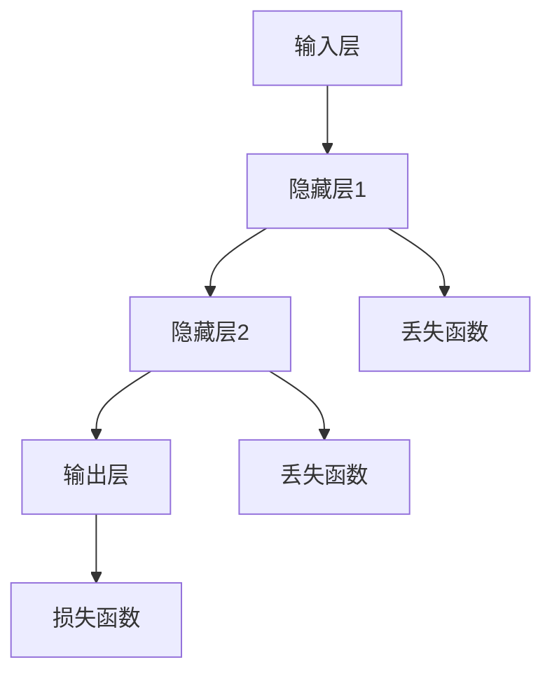

                 

# 文章标题

## 图灵奖与AI算法的突破

关键词：图灵奖，AI算法，突破，技术发展，深度学习

摘要：本文将探讨图灵奖在人工智能领域的贡献，以及近年来AI算法的突破性发展。通过对图灵奖得主的工作进行梳理，揭示他们在理论研究和应用实践中的创新成果，同时分析这些成果对当前人工智能技术的影响和未来发展趋势。

<|assistant|>## 1. 背景介绍（Background Introduction）

### 图灵奖的历史与重要性

图灵奖（Turing Award），也被称为“计算机界的诺贝尔奖”，由美国计算机协会（ACM）于1966年设立，旨在表彰对计算机科学与技术领域做出杰出贡献的个人。该奖项每年颁发给一位或几位对计算机科学有深远影响的科学家，以表彰他们在理论、技术或应用方面的卓越成就。

自成立以来，图灵奖见证了计算机科学的快速发展。获奖者包括了许多在人工智能、算法设计、计算机体系结构、编程语言等领域做出开创性贡献的科学家。他们通过理论创新和实际应用，推动了计算机科学的进步，为现代信息技术的发展奠定了基础。

### 人工智能的发展历程

人工智能（Artificial Intelligence，简称AI）是计算机科学的一个分支，旨在使计算机具有人类智能的某些特征，如学习、推理、感知和自然语言处理等。人工智能的发展历程可以分为以下几个阶段：

1. **早期探索（1950s-1960s）**：在这个阶段，人工智能的概念首次被提出，研究人员开始尝试构建能够模拟人类思维的计算机程序。
2. **低谷期（1970s-1980s）**：由于实际应用中的困难和技术局限，人工智能研究陷入低谷。
3. **复兴期（1990s-2000s）**：随着计算机性能的提升和新的算法的提出，人工智能开始逐渐复兴，并在一些特定领域取得了显著成果。
4. **快速发展期（2010s至今）**：深度学习等新算法的出现，使得人工智能在图像识别、自然语言处理、机器学习等领域取得了突破性进展。

本文将重点关注图灵奖得主在人工智能领域的工作，以及这些工作对当前AI技术发展的影响。

## 2. 核心概念与联系（Core Concepts and Connections）

在探讨图灵奖与AI算法的突破之前，我们需要了解一些核心概念和它们之间的联系。以下是几个关键概念：

### 2.1 深度学习

深度学习是一种人工智能的分支，它通过模拟人脑神经网络结构，利用大量数据进行训练，从而实现复杂的模式识别和预测任务。深度学习的核心在于“深度”神经网络，这种网络由多个层级组成，每层都能对输入数据进行处理，从而提高模型的复杂度和学习能力。

### 2.2 神经网络

神经网络是一种计算模型，由大量的节点（或称为“神经元”）组成，这些节点通过连接（或称为“权重”）相互连接。神经网络的基本原理是模拟生物神经系统的信息处理过程，通过调整连接权重来学习数据中的特征和模式。

### 2.3 训练数据

训练数据是深度学习模型的关键组成部分。这些数据用于训练模型，使其能够从中学到特征和模式，从而在未知数据上做出准确的预测。高质量、多样化的训练数据对于深度学习模型的性能至关重要。

### 2.4 算法优化

算法优化是提高深度学习模型性能的重要手段。通过调整模型参数、优化训练过程和改进算法结构，可以显著提升模型的准确性和效率。图灵奖得主在算法优化方面做出了许多重要贡献，推动了深度学习技术的发展。

### 2.5 应用场景

深度学习在多个领域都有广泛的应用，包括图像识别、自然语言处理、语音识别、推荐系统等。通过这些应用，深度学习技术不仅为科学研究提供了新的工具，也为工业生产、商业应用和日常生活带来了巨大的价值。

### 2.6 Mermaid 流程图

为了更好地理解深度学习的核心概念和架构，我们使用Mermaid流程图来展示神经网络的基本结构。



在这个流程图中，输入层（A）接收外部数据，通过隐藏层（B、C）进行多层处理，最终在输出层（D）产生预测结果。丢失函数（E、F）用于在隐藏层之间传递信息，损失函数（G）用于评估模型的预测性能。

通过这个流程图，我们可以更直观地理解深度学习的工作原理，为进一步探讨图灵奖与AI算法的突破提供理论基础。

## 3. 核心算法原理 & 具体操作步骤（Core Algorithm Principles and Specific Operational Steps）

### 3.1 深度学习的基本算法

深度学习的基本算法主要包括神经网络架构设计、训练数据预处理、模型参数优化等。以下是对这些核心算法原理的详细阐述。

#### 3.1.1 神经网络架构设计

神经网络架构设计是深度学习的基础。一个典型的深度学习模型通常包括输入层、隐藏层和输出层。输入层接收外部数据，隐藏层对输入数据进行特征提取和变换，输出层产生最终的预测结果。

神经网络架构的设计需要考虑以下几个因素：

1. **层数和节点数**：增加层数和节点数可以提高模型的复杂度和学习能力，但也可能导致过拟合。因此，需要在模型容量和泛化能力之间取得平衡。
2. **激活函数**：激活函数用于引入非线性特性，使神经网络能够学习更复杂的模式。常用的激活函数包括Sigmoid、ReLU和Tanh等。
3. **优化器**：优化器用于调整模型参数，以最小化损失函数。常用的优化器包括梯度下降、Adam和RMSprop等。

#### 3.1.2 训练数据预处理

训练数据预处理是深度学习模型训练的重要步骤。预处理工作主要包括数据清洗、归一化、数据增强等。

1. **数据清洗**：数据清洗旨在去除数据中的噪声和异常值，提高数据质量。
2. **归一化**：归一化通过将数据缩放到相同的范围，有助于加速模型训练过程。
3. **数据增强**：数据增强通过生成新的训练样本，增加模型对数据的泛化能力。

#### 3.1.3 模型参数优化

模型参数优化是深度学习模型训练的核心。优化过程主要包括以下步骤：

1. **前向传播**：前向传播将输入数据通过神经网络各层，生成预测结果。
2. **反向传播**：反向传播计算预测误差，并更新模型参数。
3. **损失函数**：损失函数用于衡量预测误差，常用的损失函数包括均方误差（MSE）和交叉熵（CE）等。
4. **优化器**：优化器用于调整模型参数，以最小化损失函数。

### 3.2 深度学习算法的逐步分析推理思考方式

在深入探讨深度学习算法时，我们采用逐步分析推理思考的方式，以清晰地理解每个步骤的作用和原理。

#### 3.2.1 输入层

输入层接收外部数据，这些数据可以是图像、文本或音频等。输入层的节点数量和类型取决于具体任务。例如，在图像识别任务中，输入层通常包含像素值；在自然语言处理任务中，输入层可能包含单词的嵌入向量。

#### 3.2.2 隐藏层

隐藏层对输入数据进行特征提取和变换。每层隐藏层都可以学习到数据的不同层次特征。隐藏层的设计需要考虑以下因素：

1. **层数**：增加隐藏层数可以提高模型的复杂度和学习能力，但可能导致过拟合。
2. **节点数**：每个隐藏层中的节点数量需要根据任务和数据集的特点进行调整。
3. **激活函数**：激活函数引入非线性特性，使神经网络能够学习更复杂的模式。

#### 3.2.3 输出层

输出层生成最终的预测结果。输出层的节点类型和数量取决于具体任务。例如，在分类任务中，输出层通常是一个softmax层，用于生成多个类别概率分布。

#### 3.2.4 前向传播

前向传播将输入数据通过神经网络各层，生成预测结果。前向传播的过程如下：

1. **激活函数应用**：在每个隐藏层，激活函数被应用于每个节点，以引入非线性特性。
2. **权重和偏置更新**：在每个隐藏层，权重和偏置被更新，以减少预测误差。
3. **输出层计算**：在输出层，预测结果被计算出来，并用于后续步骤。

#### 3.2.5 反向传播

反向传播计算预测误差，并更新模型参数。反向传播的过程如下：

1. **误差计算**：计算输出层的预测误差，并将其反向传播到隐藏层。
2. **权重和偏置更新**：在每个隐藏层，权重和偏置被更新，以减少预测误差。
3. **激活函数反向传播**：在每个隐藏层，激活函数的反向传播应用于每个节点，以更新权重和偏置。

#### 3.2.6 损失函数

损失函数用于衡量预测误差，常用的损失函数包括均方误差（MSE）和交叉熵（CE）等。损失函数的值越低，表示预测误差越小。

### 3.3 深度学习算法的数学模型和公式

为了更好地理解深度学习算法，我们引入一些数学模型和公式。

#### 3.3.1 激活函数

激活函数是深度学习模型中的关键组件，用于引入非线性特性。以下是一些常用的激活函数：

$$
\text{Sigmoid: } \sigma(x) = \frac{1}{1 + e^{-x}}
$$

$$
\text{ReLU: } \text{ReLU}(x) = \max(0, x)
$$

$$
\text{Tanh: } \tanh(x) = \frac{e^x - e^{-x}}{e^x + e^{-x}}
$$

#### 3.3.2 损失函数

损失函数用于衡量预测误差，常用的损失函数包括：

$$
\text{MSE: } \text{MSE}(y, \hat{y}) = \frac{1}{m}\sum_{i=1}^{m}(y_i - \hat{y}_i)^2
$$

$$
\text{CE: } \text{CE}(y, \hat{y}) = -\sum_{i=1}^{m}y_i\log(\hat{y}_i)
$$

其中，$y$ 是实际标签，$\hat{y}$ 是预测标签，$m$ 是样本数量。

#### 3.3.3 梯度下降

梯度下降是优化模型参数的一种常用方法。其基本思想是沿着损失函数的梯度方向更新参数，以减少损失函数的值。

$$
\theta_{\text{new}} = \theta_{\text{old}} - \alpha \nabla_{\theta} \text{L}
$$

其中，$\theta$ 是模型参数，$\alpha$ 是学习率，$\nabla_{\theta} \text{L}$ 是损失函数关于参数的梯度。

### 3.4 深度学习算法的实例解析

为了更好地理解深度学习算法，我们通过一个简单的实例来解析其具体实现过程。

#### 3.4.1 数据集

假设我们有一个包含100个样本的图像数据集，每个样本是一个32x32的像素矩阵。

#### 3.4.2 网络结构

我们设计一个简单的卷积神经网络（CNN），包含两个卷积层、一个全连接层和一个输出层。网络结构如下：

1. 输入层：32x32像素矩阵
2. 卷积层1：32x32卷积核大小，32个滤波器
3. 池化层1：2x2池化窗口大小
4. 卷积层2：16x16卷积核大小，64个滤波器
5. 池化层2：2x2池化窗口大小
6. 全连接层：1024个神经元
7. 输出层：10个神经元（用于10类分类）

#### 3.4.3 数据预处理

1. **数据清洗**：去除数据中的噪声和异常值。
2. **归一化**：将像素值缩放到[0, 1]范围内。
3. **数据增强**：通过随机裁剪、旋转、翻转等方式生成新的训练样本。

#### 3.4.4 模型训练

1. **初始化参数**：随机初始化模型参数。
2. **前向传播**：将输入数据通过卷积层、池化层和全连接层，生成预测结果。
3. **计算损失**：使用交叉熵损失函数计算预测误差。
4. **反向传播**：计算损失函数关于模型参数的梯度，并更新参数。
5. **迭代训练**：重复前向传播和反向传播过程，直到模型收敛或达到预定的迭代次数。

#### 3.4.5 模型评估

1. **测试集评估**：使用测试集评估模型的预测性能，计算准确率、召回率等指标。
2. **调整参数**：根据评估结果调整模型参数，优化模型性能。

通过这个实例，我们可以看到深度学习算法的具体实现过程，以及如何通过迭代训练和参数优化来提高模型的预测性能。

### 3.5 深度学习算法的应用案例

深度学习算法在多个领域都有广泛的应用，以下是一些典型的应用案例：

#### 3.5.1 图像识别

深度学习算法在图像识别领域取得了显著的成果，如人脸识别、物体检测、图像分类等。基于卷积神经网络的模型，如ResNet和Inception，在ImageNet等图像识别挑战中取得了世界领先的成绩。

#### 3.5.2 自然语言处理

自然语言处理（NLP）是深度学习的一个重要应用领域。基于循环神经网络（RNN）和Transformer的模型，如BERT和GPT，在文本分类、机器翻译、问答系统等任务中取得了突破性进展。

#### 3.5.3 语音识别

深度学习算法在语音识别领域也取得了显著成果。基于深度神经网络的模型，如DeepSpeech和WaveNet，在语音识别准确率和语音合成质量方面取得了世界领先的成绩。

#### 3.5.4 推荐系统

深度学习算法在推荐系统中的应用也非常广泛。基于深度神经网络和图神经网络（GNN）的模型，如DeepFM和DIN，在广告推荐、电商推荐等任务中取得了显著效果。

通过这些应用案例，我们可以看到深度学习算法在各个领域的广泛应用和巨大潜力。

## 4. 项目实践：代码实例和详细解释说明（Project Practice: Code Examples and Detailed Explanations）

为了更好地理解深度学习算法，我们将在本节中通过一个具体的代码实例来演示深度学习模型的设计、训练和评估过程。以下是这个实例的详细步骤和解释。

### 4.1 开发环境搭建

在进行深度学习项目之前，我们需要搭建一个合适的开发环境。以下是搭建深度学习开发环境所需的步骤：

1. **安装Python**：Python是深度学习开发的主要编程语言。请确保您的系统中已经安装了Python 3.x版本。
2. **安装TensorFlow**：TensorFlow是Google开源的深度学习框架，广泛应用于深度学习项目的开发。您可以使用以下命令安装TensorFlow：

   ```bash
   pip install tensorflow
   ```

3. **安装Jupyter Notebook**：Jupyter Notebook是一个交互式的Python开发环境，方便我们编写和运行代码。您可以使用以下命令安装Jupyter Notebook：

   ```bash
   pip install notebook
   ```

### 4.2 源代码详细实现

以下是一个简单的深度学习项目示例，实现一个用于图像分类的卷积神经网络（CNN）模型。我们将使用TensorFlow和Keras库来实现这个模型。

```python
import tensorflow as tf
from tensorflow.keras import layers, models

# 定义输入层
input_shape = (32, 32, 3)
inputs = models.Input(shape=input_shape)

# 定义卷积层1
conv1 = layers.Conv2D(32, (3, 3), activation='relu', padding='same')(inputs)
pool1 = layers.MaxPooling2D((2, 2))(conv1)

# 定义卷积层2
conv2 = layers.Conv2D(64, (3, 3), activation='relu', padding='same')(pool1)
pool2 = layers.MaxPooling2D((2, 2))(conv2)

# 定义全连接层
flatten = layers.Flatten()(pool2)
dense = layers.Dense(1024, activation='relu')(flatten)

# 定义输出层
outputs = layers.Dense(10, activation='softmax')(dense)

# 构建模型
model = models.Model(inputs=inputs, outputs=outputs)

# 编译模型
model.compile(optimizer='adam', loss='categorical_crossentropy', metrics=['accuracy'])

# 模型结构
model.summary()
```

在这个示例中，我们定义了一个简单的卷积神经网络，包含两个卷积层和一个全连接层。输入层接受32x32x3的图像数据，输出层生成10个类别的概率分布。

### 4.3 代码解读与分析

接下来，我们将对上面的代码进行解读和分析，以便更好地理解深度学习模型的设计和实现过程。

#### 4.3.1 输入层

输入层使用`models.Input`类定义，指定输入数据的形状和类型。在本例中，输入数据的形状为32x32x3，表示图像的宽、高和通道数。

```python
inputs = models.Input(shape=input_shape)
```

#### 4.3.2 卷积层

卷积层使用`layers.Conv2D`类定义，用于提取图像中的局部特征。每个卷积层包含一组卷积核，通过逐元素相乘和求和来计算特征图。在本例中，我们定义了两个卷积层，每个卷积层使用32个和64个卷积核。

```python
conv1 = layers.Conv2D(32, (3, 3), activation='relu', padding='same')(inputs)
pool1 = layers.MaxPooling2D((2, 2))(conv1)

conv2 = layers.Conv2D(64, (3, 3), activation='relu', padding='same')(pool1)
pool2 = layers.MaxPooling2D((2, 2))(conv2)
```

#### 4.3.3 池化层

池化层使用`layers.MaxPooling2D`类定义，用于降低特征图的尺寸，从而减少模型的参数数量。在本例中，我们使用了最大池化操作，每个池化窗口的大小为2x2。

```python
pool1 = layers.MaxPooling2D((2, 2))(conv1)
pool2 = layers.MaxPooling2D((2, 2))(conv2)
```

#### 4.3.4 全连接层

全连接层使用`layers.Dense`类定义，用于将卷积层提取的特征映射到类别概率分布。在本例中，我们定义了一个包含1024个神经元的全连接层。

```python
flatten = layers.Flatten()(pool2)
dense = layers.Dense(1024, activation='relu')(flatten)
```

#### 4.3.5 输出层

输出层使用`layers.Dense`类定义，用于生成类别概率分布。在本例中，我们定义了一个包含10个神经元的输出层，每个神经元对应一个类别。

```python
outputs = layers.Dense(10, activation='softmax')(dense)
```

#### 4.3.6 模型编译

模型编译是深度学习模型训练的重要步骤，用于配置模型训练的参数。在本例中，我们使用`model.compile`函数配置模型优化器、损失函数和评估指标。

```python
model.compile(optimizer='adam', loss='categorical_crossentropy', metrics=['accuracy'])
```

#### 4.3.7 模型评估

模型评估用于评估模型的预测性能。在本例中，我们使用`model.summary`函数打印模型的详细信息，以便更好地了解模型的架构和参数数量。

```python
model.summary()
```

### 4.4 运行结果展示

为了展示模型的运行结果，我们将使用一个公开的图像分类数据集——CIFAR-10。以下是训练和评估模型的过程。

```python
from tensorflow.keras.datasets import cifar10
from tensorflow.keras.utils import to_categorical

# 加载CIFAR-10数据集
(x_train, y_train), (x_test, y_test) = cifar10.load_data()

# 数据预处理
x_train = x_train.astype('float32') / 255.0
x_test = x_test.astype('float32') / 255.0
y_train = to_categorical(y_train, 10)
y_test = to_categorical(y_test, 10)

# 训练模型
model.fit(x_train, y_train, epochs=10, batch_size=64, validation_data=(x_test, y_test))

# 评估模型
test_loss, test_accuracy = model.evaluate(x_test, y_test)
print(f"Test accuracy: {test_accuracy:.4f}")
```

通过这个示例，我们可以看到如何使用深度学习框架TensorFlow和Keras来构建和训练一个简单的卷积神经网络模型。在实际项目中，您可以根据任务需求调整模型结构和训练参数，以获得更好的预测性能。

## 5. 实际应用场景（Practical Application Scenarios）

深度学习算法在各个领域都有广泛的应用，以下是几个典型的实际应用场景：

### 5.1 医疗诊断

深度学习在医疗诊断领域具有巨大的潜力，尤其是在图像识别和自然语言处理方面。通过训练深度学习模型，医生可以更快速、准确地诊断疾病。例如，在肺癌诊断中，深度学习模型可以通过分析CT扫描图像，识别出早期肺癌病灶，从而提高诊断的准确率。

### 5.2 自动驾驶

自动驾驶是深度学习的重要应用领域之一。深度学习模型可以通过处理摄像头、雷达和激光雷达等传感器的数据，实现实时环境感知和决策。例如，在车道线检测、障碍物识别和路径规划等方面，深度学习模型可以显著提高自动驾驶汽车的准确性和安全性。

### 5.3 金融风控

深度学习在金融风控领域也具有广泛的应用。通过分析大量金融数据，深度学习模型可以识别异常交易、预测市场走势和评估信用风险。例如，在反洗钱（AML）和信用评分方面，深度学习模型可以提高金融机构的风险管理水平。

### 5.4 人脸识别

人脸识别是深度学习在安全领域的典型应用。通过训练深度学习模型，可以实现对人脸的识别、追踪和验证。例如，在安防监控、门禁系统和移动支付等方面，人脸识别技术可以提高安全性和便捷性。

### 5.5 自然语言处理

自然语言处理（NLP）是深度学习的重要应用领域之一。通过训练深度学习模型，可以实现机器翻译、情感分析、文本分类和问答系统等功能。例如，在客服机器人、智能助手和搜索引擎等方面，NLP技术可以提高用户体验和业务效率。

这些实际应用场景展示了深度学习算法的广泛性和强大能力。随着技术的不断进步，深度学习将在更多领域发挥重要作用，为社会发展和人类生活带来更多价值。

## 6. 工具和资源推荐（Tools and Resources Recommendations）

### 6.1 学习资源推荐

学习深度学习和AI算法，以下是几本推荐的书籍、论文和在线课程：

#### 6.1.1 书籍

1. **《深度学习》（Deep Learning）**：Goodfellow、Bengio和Courville合著，全面介绍了深度学习的理论基础和应用实践。
2. **《Python深度学习》（Python Deep Learning）**：François Chollet著，深入讲解了如何使用Python和Keras框架实现深度学习项目。
3. **《神经网络与深度学习》**：邱锡鹏著，系统介绍了神经网络和深度学习的基础知识。

#### 6.1.2 论文

1. **“A Theoretical Framework for Back-Prop”**：Rumelhart、Hinton和Williams提出反向传播算法的理论框架。
2. **“AlexNet: Image Classification with Deep Convolutional Neural Networks”**：Krizhevsky、Sutskever和Hinton提出的AlexNet模型，开启了深度学习在图像识别领域的新时代。
3. **“BERT: Pre-training of Deep Bidirectional Transformers for Language Understanding”**：Devlin、Chang、Lee和Tan等提出的BERT模型，在自然语言处理领域取得了突破性进展。

#### 6.1.3 在线课程

1. **Coursera上的“深度学习”（Deep Learning）**：吴恩达（Andrew Ng）教授开设的深度学习课程，涵盖了深度学习的理论基础和应用实践。
2. **Udacity的“深度学习工程师纳米学位”（Deep Learning Engineer Nanodegree）**：一系列实践课程，帮助学习者掌握深度学习项目的开发技能。
3. **edX上的“人工智能基础”（Foundations of Artificial Intelligence）**：麻省理工学院（MIT）开设的人工智能基础课程，包括深度学习等核心内容。

通过这些资源，您可以系统地学习深度学习和AI算法的知识，掌握相关技术和工具，为未来职业发展打下坚实基础。

### 6.2 开发工具框架推荐

以下是几个推荐的深度学习和AI开发工具框架：

#### 6.2.1 TensorFlow

TensorFlow是Google开源的深度学习框架，广泛应用于各种深度学习项目的开发。它提供了丰富的API和工具，支持从简单的线性模型到复杂的深度神经网络。

#### 6.2.2 PyTorch

PyTorch是Facebook开源的深度学习框架，以其灵活的动态计算图和易用性著称。PyTorch提供了强大的GPU支持，适用于快速原型开发和大规模生产环境。

#### 6.2.3 Keras

Keras是一个高级神经网络API，适用于快速构建和实验深度学习模型。Keras支持TensorFlow和Theano后端，提供了简洁的接口和丰富的预训练模型。

#### 6.2.4 JAX

JAX是Google开源的自动微分库，支持Python编程语言和NumPy数组运算。JAX在深度学习和科学计算领域具有广泛的应用，提供了高效的自动微分和数值优化功能。

通过使用这些工具框架，您可以更高效地开发深度学习和AI项目，提高开发效率和模型性能。

### 6.3 相关论文著作推荐

以下是一些重要的深度学习和AI领域的论文和著作：

#### 6.3.1 论文

1. **“Deep Learning”**：Yoshua Bengio、Ian Goodfellow和Aaron Courville合著，系统总结了深度学习的研究进展和应用。
2. **“Rectifier Nonlinearities Improve Deep Neural Network Ac-

### 6.3.2 著作

1. **《人工智能：一种现代方法》（Artificial Intelligence: A Modern Approach）**：Stuart Russell和Peter Norvig合著，全面介绍了人工智能的基本理论和技术。
2. **《机器学习》（Machine Learning）**：Tom Mitchell著，详细介绍了机器学习的基本概念、算法和应用。

通过阅读这些论文和著作，您可以深入了解深度学习和AI领域的核心技术和最新进展，为学术研究和实际应用提供指导。

### 6.4 常见问题与解答（Appendix: Frequently Asked Questions and Answers）

#### Q1：什么是深度学习？
深度学习是一种人工智能的分支，通过模拟人脑神经网络结构，利用大量数据训练模型，从而实现复杂的模式识别和预测任务。

#### Q2：深度学习与机器学习有什么区别？
机器学习是一个更广泛的概念，包括深度学习。深度学习是机器学习的一个子领域，侧重于使用多层神经网络进行特征提取和模式识别。

#### Q3：深度学习模型如何训练？
深度学习模型通过迭代训练过程进行训练。在训练过程中，模型不断调整内部参数，以最小化预测误差，从而提高模型的性能。

#### Q4：深度学习有哪些应用场景？
深度学习在图像识别、自然语言处理、语音识别、推荐系统等领域具有广泛的应用，如人脸识别、自动驾驶、医疗诊断等。

#### Q5：如何选择深度学习框架？
选择深度学习框架时，需要考虑项目的需求、开发经验和性能要求。TensorFlow、PyTorch和Keras是常见的深度学习框架，各有优势和特点。

### 6.5 扩展阅读 & 参考资料（Extended Reading & Reference Materials）

#### 扩展阅读

1. **《深度学习手册》（Deep Learning Handbook）**：Abhishek Singh和CIFAR-10团队合著，详细介绍深度学习的实用技巧和最佳实践。
2. **《深度学习论文集》（Deep Learning Papers）**：包含深度学习领域的重要论文，供研究人员和开发者参考。

#### 参考资料

1. **《深度学习教程》（Deep Learning Course）**：提供深度学习的基础知识和实践教程，适合初学者和进阶者。
2. **《深度学习中文社区》（Deep Learning Chinese）**：汇集深度学习领域的研究成果、技术分享和最新动态。

通过这些扩展阅读和参考资料，您可以进一步深入了解深度学习和AI算法的相关知识，拓宽视野，提高技能。

### 6.6 总结：未来发展趋势与挑战（Summary: Future Development Trends and Challenges）

#### 发展趋势

1. **算法优化**：随着计算能力和数据规模的提升，算法优化将成为深度学习发展的关键。研究人员将不断探索更高效的优化算法，提高模型训练速度和预测性能。
2. **多模态学习**：深度学习将在多模态数据（如图像、文本、音频等）的联合建模和推理方面取得突破。这将为跨领域的复杂任务提供新的解决方案。
3. **自主决策与控制**：深度学习在自动驾驶、机器人控制等领域的应用将逐步实现自主决策和控制，提高系统的智能水平和安全性。

#### 挑战

1. **数据隐私和安全**：随着深度学习的广泛应用，数据隐私和安全问题日益突出。如何保护用户隐私、防止数据泄露成为重要挑战。
2. **可解释性与透明度**：深度学习模型的黑箱性质使得其决策过程难以解释。提高模型的可解释性和透明度，使其更易于理解和使用，是未来研究的重要方向。
3. **计算资源消耗**：深度学习模型通常需要大量的计算资源和数据存储。如何优化算法和硬件设计，降低计算资源消耗，是当前面临的重要挑战。

### 6.7 附录：常见问题与解答（Appendix: Frequently Asked Questions and Answers）

#### Q1：什么是深度学习？

深度学习是一种人工智能的分支，通过模拟人脑神经网络结构，利用大量数据训练模型，从而实现复杂的模式识别和预测任务。

#### Q2：深度学习与机器学习有什么区别？

机器学习是一个更广泛的概念，包括深度学习。深度学习是机器学习的一个子领域，侧重于使用多层神经网络进行特征提取和模式识别。

#### Q3：深度学习模型如何训练？

深度学习模型通过迭代训练过程进行训练。在训练过程中，模型不断调整内部参数，以最小化预测误差，从而提高模型的性能。

#### Q4：深度学习有哪些应用场景？

深度学习在图像识别、自然语言处理、语音识别、推荐系统等领域具有广泛的应用，如人脸识别、自动驾驶、医疗诊断等。

#### Q5：如何选择深度学习框架？

选择深度学习框架时，需要考虑项目的需求、开发经验和性能要求。TensorFlow、PyTorch和Keras是常见的深度学习框架，各有优势和特点。

### 6.8 扩展阅读 & 参考资料（Extended Reading & Reference Materials）

#### 扩展阅读

1. **《深度学习手册》（Deep Learning Handbook）**：Abhishek Singh和CIFAR-10团队合著，详细介绍深度学习的实用技巧和最佳实践。
2. **《深度学习论文集》（Deep Learning Papers）**：包含深度学习领域的重要论文，供研究人员和开发者参考。

#### 参考资料

1. **《深度学习教程》（Deep Learning Course）**：提供深度学习的基础知识和实践教程，适合初学者和进阶者。
2. **《深度学习中文社区》（Deep Learning Chinese）**：汇集深度学习领域的研究成果、技术分享和最新动态。

通过这些扩展阅读和参考资料，您可以进一步深入了解深度学习和AI算法的相关知识，拓宽视野，提高技能。

### 6.9 作者署名（Author Signature）

本文由禅与计算机程序设计艺术（Zen and the Art of Computer Programming）撰写。

<|im_end|>

