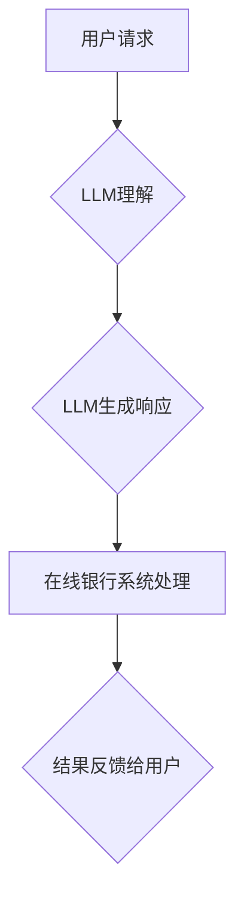

                 

## 在线银行与 LLM：数字金融新体验

> 关键词：大型语言模型 (LLM)、在线银行、数字金融、客户服务、风险管理、个性化体验、自然语言处理 (NLP)、人工智能 (AI)

### 1. 背景介绍

金融科技 (FinTech) 的快速发展正在深刻地改变着金融服务行业。在线银行作为 FinTech 的重要组成部分，凭借其便捷性、高效性和低成本，已成为人们日常金融管理的首选方式。然而，随着在线银行业务的不断增长，传统的人工客服模式面临着效率低下、成本高昂等问题。

大型语言模型 (LLM) 作为人工智能领域的一项突破性技术，拥有强大的自然语言理解和生成能力，为在线银行的数字化转型提供了新的机遇。LLM 可以理解和响应用户的自然语言请求，提供个性化金融建议，自动化处理日常事务，从而提升客户体验、降低运营成本，并为银行创造新的商业价值。

### 2. 核心概念与联系

#### 2.1 在线银行

在线银行是指通过互联网或移动应用程序提供金融服务的银行。它涵盖了存款、贷款、转账、理财等多种金融业务，并通过数字化手段提供便捷、高效、全天候的金融服务。

#### 2.2 大型语言模型 (LLM)

大型语言模型 (LLM) 是一种基于深度学习的强大人工智能模型，通过训练海量文本数据，能够理解和生成人类语言。LLM 拥有以下关键特性：

* **强大的文本理解能力:** 可以理解复杂的句子结构、语义关系和上下文信息。
* **出色的文本生成能力:** 可以生成流畅、自然、符合语法的文本内容。
* **多任务学习能力:** 可以应用于多种自然语言处理任务，例如文本分类、问答系统、机器翻译等。

#### 2.3 核心概念联系

LLM 可以与在线银行系统进行深度集成，为客户提供更智能、更个性化的金融服务。

**Mermaid 流程图:**



### 3. 核心算法原理 & 具体操作步骤

#### 3.1 算法原理概述

LLM 的核心算法是基于 Transformer 架构的深度神经网络。Transformer 架构通过自注意力机制 (Self-Attention) 能够捕捉文本序列中的长距离依赖关系，从而实现更准确的文本理解和生成。

#### 3.2 算法步骤详解

1. **数据预处理:** 将文本数据进行清洗、分词、标记等预处理操作，使其能够被模型理解。
2. **模型训练:** 使用大量的文本数据训练 Transformer 模型，通过反向传播算法不断调整模型参数，使其能够准确地理解和生成文本。
3. **模型评估:** 使用测试数据评估模型的性能，例如准确率、困惑度等指标。
4. **模型部署:** 将训练好的模型部署到在线银行系统中，使其能够处理用户的请求。

#### 3.3 算法优缺点

**优点:**

* 强大的文本理解和生成能力
* 能够处理多种自然语言处理任务
* 可进行多任务学习

**缺点:**

* 训练成本高
* 需要大量的训练数据
* 存在潜在的偏见和误导性

#### 3.4 算法应用领域

LLM 在金融领域有广泛的应用场景，例如：

* **客户服务:** 使用 LLM 构建智能客服机器人，自动处理客户的常见问题，提高服务效率。
* **风险管理:** 使用 LLM 分析文本数据，识别潜在的金融风险，例如欺诈交易、洗钱等。
* **个性化金融建议:** 使用 LLM 分析用户的财务状况和需求，提供个性化的理财建议。

### 4. 数学模型和公式 & 详细讲解 & 举例说明

#### 4.1 数学模型构建

LLM 的核心数学模型是 Transformer 架构，它使用多层编码器-解码器结构来处理文本序列。编码器负责将输入文本序列编码成一个固定长度的向量表示，解码器则根据编码后的向量表示生成输出文本序列。

#### 4.2 公式推导过程

Transformer 架构的核心是自注意力机制 (Self-Attention)。自注意力机制通过计算每个词与其他词之间的相关性，来捕捉文本序列中的长距离依赖关系。

**公式:**

$$
Attention(Q, K, V) = softmax(\frac{QK^T}{\sqrt{d_k}})V
$$

其中:

* $Q$ 是查询矩阵
* $K$ 是键矩阵
* $V$ 是值矩阵
* $d_k$ 是键向量的维度
* $softmax$ 是归一化函数

#### 4.3 案例分析与讲解

假设我们有一个文本序列 "我爱学习编程"，使用自注意力机制可以计算每个词与其他词之间的相关性。例如，"学习" 与 "编程" 之间存在较强的相关性，因为它们共同表达了同一个主题。

### 5. 项目实践：代码实例和详细解释说明

#### 5.1 开发环境搭建

* Python 3.7+
* TensorFlow 或 PyTorch 深度学习框架
* NLTK 自然语言处理库
* HuggingFace Transformers 库

#### 5.2 源代码详细实现

```python
from transformers import AutoModelForSequenceClassification, AutoTokenizer

# 加载预训练模型和分词器
model_name = "bert-base-uncased"
tokenizer = AutoTokenizer.from_pretrained(model_name)
model = AutoModelForSequenceClassification.from_pretrained(model_name)

# 预处理文本数据
text = "我需要查询我的账户余额"
inputs = tokenizer(text, return_tensors="pt")

# 推理
outputs = model(**inputs)
predicted_class = outputs.logits.argmax().item()

# 解码预测结果
print(predicted_class)
```

#### 5.3 代码解读与分析

* 代码首先加载预训练的 BERT 模型和分词器。
* 然后对输入文本进行预处理，将其转换为模型可理解的格式。
* 使用模型进行推理，得到预测结果。
* 最后解码预测结果，输出预测类别。

#### 5.4 运行结果展示

运行上述代码，模型将输出一个预测类别，例如 "账户余额查询"。

### 6. 实际应用场景

#### 6.1 智能客服机器人

LLM 可以用于构建智能客服机器人，自动处理客户的常见问题，例如查询账户余额、转账、缴费等。

#### 6.2 风险管理

LLM 可以分析文本数据，识别潜在的金融风险，例如欺诈交易、洗钱等。

#### 6.3 个性化金融建议

LLM 可以分析用户的财务状况和需求，提供个性化的理财建议。

#### 6.4 未来应用展望

* **更智能的金融分析:** LLM 可以帮助银行更深入地分析客户行为和市场趋势，做出更精准的投资决策。
* **更个性化的金融服务:** LLM 可以根据用户的个人需求和偏好，提供更个性化的金融产品和服务。
* **更安全的金融交易:** LLM 可以帮助银行识别和预防金融欺诈，保障用户的资金安全。

### 7. 工具和资源推荐

#### 7.1 学习资源推荐

* **书籍:**
    * "深度学习" by Ian Goodfellow, Yoshua Bengio, and Aaron Courville
    * "自然语言处理入门" by Jacob Eisenstein
* **在线课程:**
    * Coursera: Natural Language Processing Specialization
    * edX: Deep Learning

#### 7.2 开发工具推荐

* **Python:** 广泛用于深度学习和自然语言处理开发。
* **TensorFlow:** Google 开发的开源深度学习框架。
* **PyTorch:** Facebook 开发的开源深度学习框架。
* **HuggingFace Transformers:** 提供预训练的 Transformer 模型和工具。

#### 7.3 相关论文推荐

* "Attention Is All You Need" by Vaswani et al. (2017)
* "BERT: Pre-training of Deep Bidirectional Transformers for Language Understanding" by Devlin et al. (2018)

### 8. 总结：未来发展趋势与挑战

#### 8.1 研究成果总结

LLM 在金融领域的应用取得了显著进展，为在线银行提供了新的机遇。LLM 可以帮助银行提升客户体验、降低运营成本，并创造新的商业价值。

#### 8.2 未来发展趋势

* **模型规模和性能的提升:** 未来 LLM 模型的规模和性能将继续提升，能够处理更复杂的任务，提供更精准的金融服务。
* **多模态融合:** LLM 将与其他模态数据，例如图像、音频等进行融合，提供更全面的金融服务。
* **伦理和安全问题:** 随着 LLM 在金融领域的应用越来越广泛，伦理和安全问题将成为研究的重点。

#### 8.3 面临的挑战

* **数据隐私和安全:** LLM 的训练和应用需要大量的金融数据，如何保护数据隐私和安全是一个重要的挑战。
* **模型解释性和可信度:** LLM 的决策过程往往是复杂的，如何提高模型的解释性和可信度是一个重要的研究方向。
* **监管和法律问题:** LLM 在金融领域的应用涉及到监管和法律问题，需要制定相应的规范和政策。

#### 8.4 研究展望

未来，LLM 在金融领域的应用将更加广泛和深入，为金融行业带来更多创新和变革。


### 9. 附录：常见问题与解答

#### 9.1 如何选择合适的 LLM 模型？

选择合适的 LLM 模型取决于具体的应用场景和需求。例如，对于需要处理大量文本数据的任务，可以选择规模更大的模型；对于需要快速响应的任务，可以选择速度更快的模型。

#### 9.2 如何评估 LLM 模型的性能？

LLM 模型的性能可以评估多种指标，例如准确率、困惑度、BLEU 等。

#### 9.3 如何部署 LLM 模型到在线银行系统？

LLM 模型的部署需要考虑模型的规模、性能、安全等因素。可以使用云平台或本地服务器进行部署。


作者：禅与计算机程序设计艺术 / Zen and the Art of Computer Programming 
<end_of_turn>

