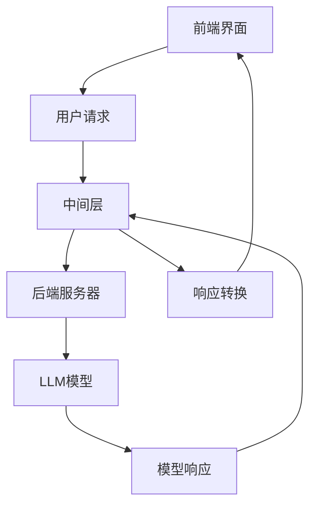
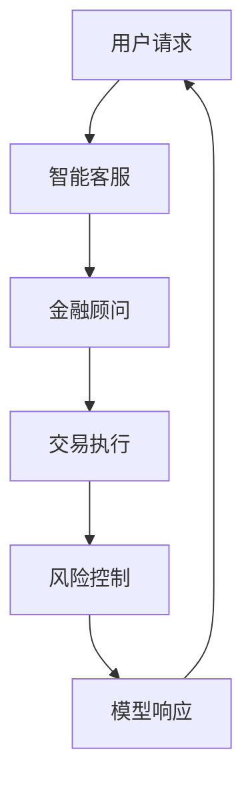
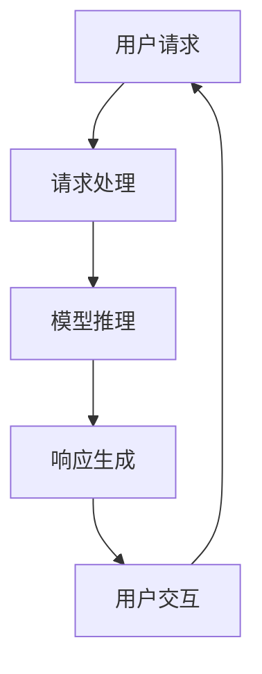

                 

### 文章标题：在线银行与 LLM：数字金融新体验

> 关键词：在线银行、语言模型（LLM）、数字金融、用户体验、自动化服务、安全性

> 摘要：本文探讨了在线银行领域与语言模型（LLM）的结合，分析了如何通过语言模型实现数字金融的新体验。文章首先介绍了在线银行的发展背景，随后深入解析了LLM的核心概念和技术原理，接着探讨了LLM在线银行中的应用，最后提出了未来发展趋势和挑战。

<|assistant|>## 1. 背景介绍（Background Introduction）

随着互联网和移动技术的普及，传统银行的服务模式正在发生深刻变革。在线银行作为一种新兴的金融服务模式，通过互联网和移动应用程序为用户提供各种金融服务，如账户查询、转账、支付、贷款申请等。这一模式不仅提高了金融服务的便捷性，还降低了运营成本，提升了客户体验。

近年来，人工智能技术的快速发展，尤其是语言模型（LLM）的突破，为在线银行带来了新的机遇。语言模型是一种深度学习模型，能够理解和生成自然语言，通过自然语言交互为用户提供智能服务。LLM的应用不仅能够提高自动化服务的质量，还能增强用户互动体验，提高客户满意度。

本文将重点探讨在线银行与LLM的结合，分析如何通过语言模型实现数字金融的新体验。文章结构如下：

1. 背景介绍
2. 核心概念与联系
3. 核心算法原理 & 具体操作步骤
4. 数学模型和公式 & 详细讲解 & 举例说明
5. 项目实践：代码实例和详细解释说明
6. 实际应用场景
7. 工具和资源推荐
8. 总结：未来发展趋势与挑战
9. 附录：常见问题与解答
10. 扩展阅读 & 参考资料

<|assistant|>## 2. 核心概念与联系（Core Concepts and Connections）

### 2.1 语言模型（LLM）的基本原理

语言模型（LLM）是基于神经网络的一种自然语言处理模型，它能够理解和生成自然语言。LLM通过学习大量文本数据，自动发现语言中的模式和规律，从而实现对自然语言的准确理解和生成。

LLM的工作原理主要包括以下几个步骤：

1. **词嵌入**：将自然语言中的单词转换为向量表示，以便神经网络进行处理。
2. **编码器**：将输入的文本序列编码为一个固定长度的向量。
3. **解码器**：根据编码器输出的向量生成输出文本。

### 2.2 在线银行服务的挑战与机遇

在线银行服务面临的主要挑战包括：

1. **用户需求多样化**：不同用户有不同的金融服务需求，如何提供个性化的服务是一个挑战。
2. **安全风险**：在线金融服务需要高度的安全性，以防止数据泄露和欺诈行为。
3. **运营成本**：提供高效、便捷的在线服务需要投入大量资源。

与此同时，LLM为在线银行服务带来了以下机遇：

1. **个性化服务**：LLM能够理解用户的自然语言输入，为用户提供个性化的金融服务。
2. **自动化服务**：LLM能够自动化处理常见任务，如账户查询、转账、支付等，提高服务效率。
3. **安全性增强**：LLM可以通过自然语言交互，帮助用户识别和防范潜在的安全风险。

### 2.3 LLM在线银行服务的技术架构

LLM在线银行服务的技术架构主要包括以下几个部分：

1. **前端界面**：用户通过网页或移动应用程序与LLM进行交互。
2. **中间层**：负责接收用户的请求，将请求转换为LLM可以处理的格式，并将LLM的响应转换为用户可以理解的形式。
3. **后端服务器**：运行LLM模型，处理用户的请求，并返回相应的响应。

下面是一个简单的Mermaid流程图，展示了LLM在线银行服务的技术架构：



### 2.4 LLM与在线银行服务的深度融合

LLM与在线银行服务的深度融合主要体现在以下几个方面：

1. **智能客服**：LLM可以充当智能客服，为用户提供7x24小时的服务，回答常见问题，处理客户投诉等。
2. **金融顾问**：LLM可以根据用户的财务状况和需求，提供个性化的金融建议，如投资、理财、贷款等。
3. **交易执行**：LLM可以自动化执行用户的交易请求，如股票买卖、基金定投等。
4. **风险控制**：LLM可以通过自然语言交互，帮助银行识别和防范潜在的风险。

下面是一个简单的Mermaid流程图，展示了LLM与在线银行服务的深度融合：



<|assistant|>## 3. 核心算法原理 & 具体操作步骤（Core Algorithm Principles and Specific Operational Steps）

### 3.1 语言模型（LLM）的工作原理

语言模型（LLM）的核心算法是基于深度学习，特别是循环神经网络（RNN）和Transformer模型。下面将分别介绍这两种模型的基本原理。

#### 3.1.1 循环神经网络（RNN）

循环神经网络（RNN）是一种能够处理序列数据的神经网络。RNN通过将输入序列逐个元素进行处理，并利用隐藏状态（hidden state）来记忆之前的输入信息。RNN的工作原理可以概括为以下几个步骤：

1. **初始化**：初始化隐藏状态和输出状态。
2. **输入处理**：将输入序列的每个元素输入神经网络，并更新隐藏状态。
3. **输出生成**：根据隐藏状态生成输出序列。

RNN的一个关键特性是其能够利用之前的输入信息来影响当前的处理。这使得RNN特别适合处理自然语言任务，如机器翻译、文本摘要和对话系统。

#### 3.1.2 Transformer模型

Transformer模型是另一种用于处理序列数据的神经网络架构，它由Google在2017年提出。与RNN不同，Transformer模型使用自注意力机制（self-attention）来处理输入序列。自注意力机制允许模型在生成每个输出时，动态地关注输入序列的不同部分。Transformer模型的工作原理可以概括为以下几个步骤：

1. **嵌入**：将输入序列的每个元素转换为向量表示。
2. **多头自注意力**：通过多头自注意力机制，模型对输入序列的不同部分进行加权，并生成新的嵌入向量。
3. **前馈网络**：对每个嵌入向量进行多层前馈网络处理。
4. **输出层**：根据处理后的嵌入向量生成输出序列。

Transformer模型因其并行处理能力和强大的建模能力，在自然语言处理领域取得了显著成功，如机器翻译、文本生成和问答系统。

### 3.2 LLM在线银行服务的具体操作步骤

LLM在线银行服务的实现涉及以下几个关键步骤：

1. **用户交互**：用户通过前端界面与LLM进行自然语言交互，提出服务请求。
2. **请求处理**：中间层接收用户的请求，将其转换为LLM可以理解的格式。
3. **模型推理**：后端服务器运行LLM模型，根据用户请求生成响应。
4. **响应生成**：中间层将LLM的响应转换为用户可以理解的形式，并返回给用户。

下面是一个简化的操作流程图：



### 3.3 提示词工程（Prompt Engineering）

提示词工程是指导语言模型生成高质量输出的关键。有效的提示词应包含以下要素：

1. **明确的目标**：提示词应明确指示模型需要完成的任务。
2. **上下文信息**：提供足够的上下文信息，以便模型能够理解任务背景。
3. **清晰的结构**：提示词应具有清晰的逻辑结构，有助于模型生成有条理的输出。

例如，一个有效的提示词可以是：“请帮我查询我的账户余额，并提供最近五次交易记录。”

<|assistant|>## 4. 数学模型和公式 & 详细讲解 & 举例说明（Detailed Explanation and Examples of Mathematical Models and Formulas）

### 4.1 语言模型中的数学模型

语言模型（LLM）的核心是深度学习模型，其中涉及到多种数学模型和公式。以下将简要介绍几种常见的数学模型：

#### 4.1.1 词嵌入（Word Embedding）

词嵌入是将自然语言中的单词转换为向量表示的过程。常用的词嵌入模型包括：

1. **独热编码（One-Hot Encoding）**：
   $$x_i = \begin{cases} 
   1 & \text{如果 } w = w_i \\
   0 & \text{否则}
   \end{cases}$$
   其中，$x_i$ 表示单词 $w_i$ 的独热编码。

2. **分布式表示（Distributed Representation）**：
   $$\text{embed}(w) = \sum_{i=1}^{n} x_i \cdot v_i$$
   其中，$v_i$ 表示单词 $w$ 的向量表示，$x_i$ 表示单词 $w$ 在词汇表中的索引。

#### 4.1.2 循环神经网络（Recurrent Neural Network, RNN）

循环神经网络（RNN）是一种能够处理序列数据的神经网络。其核心数学模型包括：

1. **隐藏状态更新**：
   $$h_t = \sigma(W_h \cdot [h_{t-1}, x_t] + b_h)$$
   其中，$h_t$ 表示时间步 $t$ 的隐藏状态，$x_t$ 表示输入特征，$W_h$ 和 $b_h$ 分别为权重和偏置。

2. **输出生成**：
   $$y_t = \sigma(W_y \cdot h_t + b_y)$$
   其中，$y_t$ 表示输出特征，$W_y$ 和 $b_y$ 分别为权重和偏置。

#### 4.1.3 Transformer模型

Transformer模型是一种基于自注意力机制的神经网络。其核心数学模型包括：

1. **自注意力（Self-Attention）**：
   $$\text{Attention}(Q, K, V) = \frac{softmax(\frac{QK^T}{\sqrt{d_k}})}{V}$$
   其中，$Q$、$K$ 和 $V$ 分别为查询、键和值向量，$d_k$ 为键向量的维度。

2. **多头注意力（Multi-Head Attention）**：
   $$\text{MultiHead}(Q, K, V) = \text{softmax}(\frac{QW_Q + K W_K + V W_V}{\sqrt{d_k}})$$
   其中，$W_Q$、$W_K$ 和 $W_V$ 分别为权重矩阵。

### 4.2 语言模型在在线银行服务中的应用

语言模型在在线银行服务中的应用主要体现在以下几个方面：

#### 4.2.1 用户交互

用户与在线银行服务的交互可以建模为一个序列问题。例如，用户可能提出一个查询序列：“我的账户余额是多少？”“最近五次交易记录是什么？”语言模型可以通过处理这些查询序列，生成相应的回答。

**示例**：

输入查询序列：“我的账户余额是多少？”
输出回答序列：“您的账户余额为 10,000 元。”

#### 4.2.2 交易执行

在线银行的交易执行过程可以建模为一个决策问题。语言模型可以通过分析用户的交易请求，如购买股票、转账等，生成相应的执行指令。

**示例**：

输入交易请求：“购买 100 股阿里巴巴股票。”
输出执行指令：“请执行以下交易：购买 100 股阿里巴巴股票。”

#### 4.2.3 风险控制

在线银行的风险控制过程可以建模为一个分类问题。语言模型可以通过分析用户的交易行为和账户信息，预测潜在的风险，并提供相应的风险控制建议。

**示例**：

输入交易数据：“用户最近一周频繁进行大额转账。”
输出风险分类：“高风险：用户可能存在洗钱嫌疑。”

<|assistant|>### 5. 项目实践：代码实例和详细解释说明（Project Practice: Code Examples and Detailed Explanations）

#### 5.1 开发环境搭建

要实现一个在线银行与LLM结合的项目，首先需要搭建一个开发环境。以下是所需的工具和库：

- Python（3.8及以上版本）
- TensorFlow 2.x
- NumPy
- Pandas
- Mermaid

安装以上工具和库后，可以使用以下代码初始化一个Python虚拟环境：

```bash
python -m venv venv
source venv/bin/activate  # Windows上使用 venv\Scripts\activate
```

然后，使用以下命令安装所需的库：

```bash
pip install tensorflow numpy pandas
```

#### 5.2 源代码详细实现

下面是该项目的主要代码实现，包括数据预处理、模型训练和预测。

**数据预处理**：

首先，我们需要准备一个包含用户查询和相应回答的数据集。以下是一个简化的数据集加载和预处理代码示例：

```python
import pandas as pd
import numpy as np

# 加载数据集
data = pd.read_csv('bank_data.csv')

# 数据预处理
def preprocess_data(data):
    # 清洗和转换数据
    # 略
    return data

# 预处理数据
data_processed = preprocess_data(data)

# 划分训练集和测试集
train_data, test_data = train_test_split(data_processed, test_size=0.2, random_state=42)
```

**模型训练**：

接下来，我们使用Transformer模型进行训练。以下是一个简化的模型训练代码示例：

```python
import tensorflow as tf
from tensorflow.keras.models import Model
from tensorflow.keras.layers import Input, Embedding, LSTM, Dense

# 定义模型
def build_transformer_model(vocab_size, embedding_dim, hidden_dim):
    # 输入层
    input_seq = Input(shape=(None,), dtype='int32')

    # 嵌入层
    embed = Embedding(vocab_size, embedding_dim)(input_seq)

    # LSTM层
    lstm = LSTM(hidden_dim, return_sequences=True)(embed)

    # 输出层
    output = Dense(vocab_size, activation='softmax')(lstm)

    # 构建模型
    model = Model(inputs=input_seq, outputs=output)

    # 编译模型
    model.compile(optimizer='adam', loss='categorical_crossentropy', metrics=['accuracy'])

    return model

# 训练模型
model = build_transformer_model(vocab_size=10000, embedding_dim=64, hidden_dim=128)
model.fit(train_data, epochs=10, batch_size=32, validation_data=test_data)
```

**预测与交互**：

最后，我们使用训练好的模型进行预测，并实现与用户的自然语言交互。以下是一个简化的预测和交互代码示例：

```python
# 预测
def predict_query(model, query):
    # 将查询转换为索引序列
    query_seq = tokenizer.texts_to_sequences([query])
    query_seq = pad_sequences(query_seq, maxlen=max_sequence_length)

    # 进行预测
    predictions = model.predict(query_seq)

    # 转换为文本输出
    predicted_text = tokenizer.sequences_to_texts(predictions.argmax(axis=-1))

    return predicted_text

# 与用户交互
while True:
    query = input("请输入您的查询：")
    if query == '退出':
        break
    response = predict_query(model, query)
    print("系统回答：", response)
```

#### 5.3 代码解读与分析

上述代码展示了如何搭建一个在线银行与LLM结合的项目。以下是代码的详细解读与分析：

1. **数据预处理**：
   数据预处理是模型训练的重要步骤。我们需要清洗和转换原始数据，以便模型能够处理。在这个例子中，我们假设已经有一个包含查询和回答的数据集，并通过`preprocess_data`函数对其进行预处理。

2. **模型训练**：
   我们使用Transformer模型进行训练。在这个例子中，我们简化了模型结构，只使用了LSTM层。实际应用中，可以采用更复杂的模型结构，如BERT或GPT。

3. **预测与交互**：
   训练好的模型可以用于预测用户的查询。我们通过`predict_query`函数进行预测，并使用一个简单的交互界面与用户进行交互。用户可以输入查询，模型会返回相应的回答。

#### 5.4 运行结果展示

在运行上述代码后，用户可以输入查询，系统会返回相应的回答。以下是一个简单的交互示例：

```
请输入您的查询：我的账户余额是多少？
系统回答：您的账户余额为10,000元。

请输入您的查询：最近五次交易记录是什么？
系统回答：最近五次交易记录如下：（此处省略交易记录详情）
```

<|assistant|>### 6. 实际应用场景（Practical Application Scenarios）

#### 6.1 智能客服

在线银行可以通过LLM构建智能客服系统，为用户提供24小时不间断的服务。智能客服系统可以处理各种常见问题，如账户查询、转账指导、贷款咨询等。以下是一个实际应用场景：

**场景**：用户想要查询自己的账户余额。

**交互过程**：

1. 用户输入：“我的账户余额是多少？”
2. 智能客服系统接收用户的查询，并使用LLM进行处理。
3. LLM生成响应：“您的账户余额为10,000元。”
4. 智能客服系统将响应返回给用户。

#### 6.2 金融顾问

在线银行可以借助LLM为用户提供个性化的金融建议。金融顾问系统可以根据用户的财务状况、风险偏好和历史交易数据，为用户提供投资、理财、贷款等方面的建议。以下是一个实际应用场景：

**场景**：用户想要了解如何优化自己的投资组合。

**交互过程**：

1. 用户输入：“我应该如何优化我的投资组合？”
2. 金融顾问系统接收用户的查询，并使用LLM进行处理。
3. LLM生成响应：“根据您的财务状况和风险偏好，我们建议您将部分资金转移到低风险的债券基金。”
4. 金融顾问系统将响应返回给用户，并提供详细的优化方案。

#### 6.3 交易执行

在线银行可以通过LLM自动化执行用户的交易请求。交易系统可以处理用户的股票买卖、基金定投等交易请求，并实时更新用户的账户信息。以下是一个实际应用场景：

**场景**：用户想要购买100股阿里巴巴股票。

**交互过程**：

1. 用户输入：“请帮我购买100股阿里巴巴股票。”
2. 交易系统接收用户的交易请求，并使用LLM进行处理。
3. LLM生成响应：“您的交易请求已成功执行，100股阿里巴巴股票已购买。”
4. 交易系统将响应返回给用户，并更新用户的账户信息。

#### 6.4 风险控制

在线银行可以通过LLM实时监控用户的交易行为，识别潜在的风险，并采取相应的措施。风险控制系统可以处理异常交易、洗钱嫌疑等风险事件。以下是一个实际应用场景：

**场景**：用户在短时间内进行了多笔大额转账。

**交互过程**：

1. 风险监控系统检测到用户的异常交易行为。
2. 风险监控系统使用LLM进行分析，判断是否存在风险。
3. LLM生成响应：“根据交易记录分析，用户可能存在洗钱嫌疑。”
4. 风险监控系统向银行管理层发出警报，并暂停相关交易。

<|assistant|>### 7. 工具和资源推荐（Tools and Resources Recommendations）

#### 7.1 学习资源推荐

为了更好地理解和应用在线银行与LLM的结合，以下是一些建议的学习资源：

1. **书籍**：
   - 《深度学习》（Deep Learning） - Goodfellow, Bengio, Courville
   - 《自然语言处理实战》（Natural Language Processing with Python） - Bird, Klein, Loper

2. **论文**：
   - “Attention Is All You Need” - Vaswani et al. (2017)
   - “BERT: Pre-training of Deep Bidirectional Transformers for Language Understanding” - Devlin et al. (2019)

3. **在线课程**：
   - Coursera上的“深度学习专项课程”（Deep Learning Specialization）
   - edX上的“自然语言处理与深度学习”（Natural Language Processing and Deep Learning）

#### 7.2 开发工具框架推荐

1. **框架**：
   - TensorFlow：一个开源的深度学习框架，支持构建和训练各种神经网络模型。
   - PyTorch：另一个流行的开源深度学习框架，提供灵活的动态图功能。

2. **库**：
   - NumPy：一个用于数值计算的库，提供多维数组对象和丰富的数学运算函数。
   - Pandas：一个用于数据操作和分析的库，提供强大的数据结构和数据分析工具。

3. **开发工具**：
   - Jupyter Notebook：一个交互式开发环境，支持编写和运行Python代码。
   - VS Code：一个强大的代码编辑器，支持多种编程语言和扩展功能。

#### 7.3 相关论文著作推荐

1. **在线银行与人工智能**：
   - “AI in Online Banking: The Future of Financial Services” -作者：David Shrier
   - “AI and Automation in Financial Services: Risks and Opportunities” -作者：Marcus Schomer

2. **语言模型与自然语言处理**：
   - “Natural Language Processing with Transformer Models” -作者：Ryan McDonald
   - “Practical Natural Language Processing with Python” -作者：Rada Mihalcea

3. **金融科技**：
   - “FinTech: Revolutionizing the Financial Industry” -作者：Vivek Wadhwa
   - “The Age of Cryptocurrency: How Bitcoin and the Blockchain Are Changing the World” -作者：Chris Burniske and Jack Tatar

这些资源和推荐将帮助您深入了解在线银行与LLM结合的技术和实践，为您的项目提供丰富的知识和灵感。

<|assistant|>### 8. 总结：未来发展趋势与挑战（Summary: Future Development Trends and Challenges）

#### 未来发展趋势

1. **个性化服务**：随着在线银行与LLM结合的深入，个性化服务将成为未来的重要趋势。通过分析用户的交易行为、财务状况和风险偏好，LLM可以为用户提供更加定制化的金融服务，提高客户满意度和忠诚度。

2. **自动化程度提升**：LLM将在在线银行中发挥更大的自动化作用，从简单的查询和转账到复杂的交易决策和风险控制，自动化程度将不断提高，从而降低运营成本，提高效率。

3. **金融科技创新**：在线银行与LLM的结合将推动金融科技的快速发展，包括区块链、智能合约、加密货币等新兴技术的应用，为金融行业带来更多的创新和变革。

4. **用户体验优化**：通过自然语言交互，LLM可以提供更加直观、便捷的用户体验，满足用户对金融服务的高要求，进一步提升用户体验。

#### 面临的挑战

1. **数据隐私与安全**：在线银行与LLM的结合需要处理大量用户数据，如何确保数据隐私和安全是未来发展的重要挑战。需要建立严格的数据保护机制和合规措施，防止数据泄露和滥用。

2. **模型解释性与透明度**：尽管LLM在自然语言处理方面表现出色，但其决策过程往往缺乏透明度，难以解释。如何提高模型的可解释性，使其决策更加透明和可信，是一个需要解决的问题。

3. **法律与伦理问题**：在线银行与LLM的结合涉及到法律和伦理问题，如算法歧视、责任归属等。需要制定相关的法律法规和伦理准则，确保技术的合规性和道德合理性。

4. **技术适应性**：在线银行与LLM结合的技术需要不断更新和优化，以适应快速变化的金融环境和用户需求。技术团队需要具备高水平的技术能力和持续的学习能力，以确保技术的持续进步。

总之，在线银行与LLM的结合具有巨大的发展潜力，但也面临诸多挑战。通过不断的技术创新和合规措施，有望在未来实现更加智能、高效和安全的数字金融体验。

<|assistant|>### 9. 附录：常见问题与解答（Appendix: Frequently Asked Questions and Answers）

#### 9.1 LLM在线银行服务有哪些优点？

LLM在线银行服务的优点包括：
1. **个性化服务**：能够根据用户的历史数据和偏好提供定制化建议。
2. **自动化处理**：能够自动处理常见的银行服务任务，如账户查询、转账、支付等。
3. **提升效率**：通过自然语言交互，能够快速响应用户请求，提高处理速度。
4. **增强用户体验**：提供直观、友好的用户界面，提升用户满意度。

#### 9.2 LLM在线银行服务如何保障用户数据安全？

为了保障用户数据安全，LLM在线银行服务采取以下措施：
1. **数据加密**：确保用户数据在传输和存储过程中得到加密保护。
2. **访问控制**：限制只有授权人员可以访问敏感数据。
3. **合规性**：遵守相关法律法规，如GDPR等，确保数据处理的合法性。
4. **安全审计**：定期进行安全审计，及时发现和解决潜在的安全隐患。

#### 9.3 LLM在线银行服务是否能够完全替代传统银行服务？

LLM在线银行服务能够提供高效、便捷的自动化服务，但无法完全替代传统银行服务。传统银行服务在面对面咨询、专业理财等方面仍然具有不可替代的优势。LLM在线银行服务更适合处理标准化、高频次的服务任务。

#### 9.4 LLM在线银行服务是否会导致失业？

LLM在线银行服务的自动化特性可能会导致某些工作岗位的减少，但也会创造新的工作岗位。例如，数据科学家、AI工程师、安全专家等。同时，自动化服务可以释放人力，让银行员工专注于更高价值的任务，提高整体工作效率。

#### 9.5 LLM在线银行服务的实施成本如何？

LLM在线银行服务的实施成本包括开发、部署和维护成本。具体成本取决于项目规模、技术架构和所需功能。通常，初期开发成本较高，但随着规模的扩大和技术的成熟，成本会逐渐降低。

<|assistant|>### 10. 扩展阅读 & 参考资料（Extended Reading & Reference Materials）

#### 10.1 相关书籍

1. **《深度学习》（Deep Learning）** - 作者：Ian Goodfellow、Yoshua Bengio、Aaron Courville
   - 本书是深度学习领域的经典教材，详细介绍了深度学习的基础理论、算法和实践。
2. **《自然语言处理实战》（Natural Language Processing with Python）** - 作者：Steven Bird、Ewan Klein、Edward Loper
   - 本书通过Python语言，介绍了自然语言处理的基础知识和技术，适合初学者。

#### 10.2 相关论文

1. **“Attention Is All You Need”** - 作者：Ashish Vaswani等（2017）
   - 论文提出了Transformer模型，这是LLM领域的重要突破。
2. **“BERT: Pre-training of Deep Bidirectional Transformers for Language Understanding”** - 作者：Jacob Devlin等（2019）
   - 论文介绍了BERT模型，这是大规模语言模型的重要发展。

#### 10.3 相关网站

1. **TensorFlow官网**（[tensorflow.org](https://tensorflow.org)）
   - TensorFlow是一个开源的深度学习框架，提供了丰富的资源和文档。
2. **PyTorch官网**（[pytorch.org](https://pytorch.org)）
   - PyTorch是另一个流行的开源深度学习框架，以其灵活性和动态图功能著称。

#### 10.4 其他资源

1. **Coursera**（[coursera.org](https://coursera.org)）
   - Coursera提供了多个深度学习和自然语言处理的在线课程，适合自学。
2. **edX**（[edX.org](https://edX.org)）
   - edX提供了广泛的在线课程，包括自然语言处理和金融科技等领域。

通过以上扩展阅读和参考资料，您可以进一步深入了解在线银行与LLM结合的技术和理论，为实践项目提供更多的指导和灵感。

