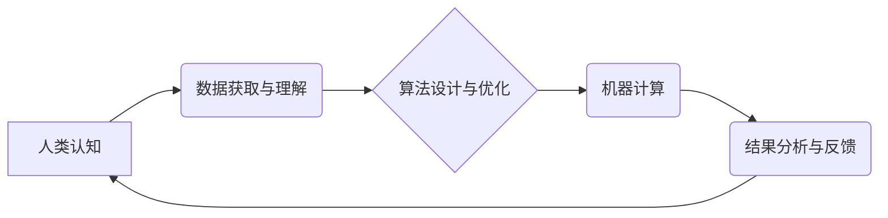

                 

## 塑造数字时代：人类计算的关键作用

> 关键词：人工智能、计算模型、人类认知、数字时代、计算能力、算法优化、未来趋势

### 1. 背景介绍

数字时代正在以惊人的速度发展，人工智能（AI）技术作为其核心驱动力，正在深刻地改变着我们的生活、工作和世界观。从自动驾驶汽车到智能医疗，从个性化教育到金融风控，AI技术的应用场景日益广泛，其带来的便利和效率提升不可否认。然而，在AI技术飞速发展的过程中，我们也必须认真思考一个至关重要的问题：在数字时代，人类计算究竟扮演着怎样的角色？

传统上，我们认为计算是机器的强项，而人类擅长创造、思考和解决复杂问题。然而，随着AI技术的进步，机器的计算能力正在不断增强，甚至超越人类的想象。那么，人类在数字时代还能发挥什么独特价值？

### 2. 核心概念与联系

人类计算的核心概念在于将人类的智慧、经验和创造力与机器的计算能力相结合，从而实现超越单一智能的协同效应。

**人类计算的架构**



**核心概念原理和架构**

* **人类认知:** 人类拥有独特的认知能力，包括抽象思维、逻辑推理、情感判断和创造力等。这些能力是机器难以模仿的，也是人类计算的核心驱动力。
* **数据获取与理解:** 人类可以通过各种方式获取信息，并对信息进行理解和解释。在人类计算中，人类扮演着数据筛选、分析和解读的角色。
* **算法设计与优化:** 人类可以根据具体任务设计和优化算法，引导机器进行高效的计算。
* **机器计算:** 机器拥有强大的计算能力，可以快速处理海量数据，并根据算法进行计算和分析。
* **结果分析与反馈:** 人类需要对机器计算的结果进行分析和评估，并根据结果进行反馈和调整，以不断优化人类计算的过程。

### 3. 核心算法原理 & 具体操作步骤

**3.1 算法原理概述**

人类计算的核心算法原理是将人类的智慧和经验融入到机器学习算法中，从而提升算法的准确性和泛化能力。常见的算法包括：

* **强化学习:** 通过奖励机制，引导机器学习最佳策略。
* **迁移学习:** 利用已有的知识和经验，快速学习新的任务。
* **联邦学习:** 在不共享原始数据的条件下，协同训练模型。

**3.2 算法步骤详解**

1. **数据收集与预处理:** 收集与任务相关的原始数据，并进行清洗、转换和格式化等预处理操作。
2. **特征工程:** 从原始数据中提取有价值的特征，并进行编码和转换，以便机器学习算法理解。
3. **模型选择与训练:** 根据任务需求选择合适的机器学习算法，并利用训练数据训练模型参数。
4. **模型评估与优化:** 利用测试数据评估模型性能，并根据评估结果调整模型参数或算法结构，以提升模型性能。
5. **模型部署与应用:** 将训练好的模型部署到实际应用场景中，并进行持续监控和维护。

**3.3 算法优缺点**

* **优点:** 能够提升算法的准确性和泛化能力，解决传统机器学习算法难以解决的复杂问题。
* **缺点:** 需要大量的标注数据和计算资源，训练过程复杂且耗时。

**3.4 算法应用领域**

* **医疗诊断:** 利用患者的医疗记录和影像数据，辅助医生进行疾病诊断。
* **金融风险控制:** 分析用户的交易行为和财务状况，识别潜在的风险。
* **个性化推荐:** 根据用户的兴趣爱好和行为数据，推荐个性化的商品或服务。
* **自动驾驶:** 利用传感器数据和地图信息，实现车辆的自动驾驶功能。

### 4. 数学模型和公式 & 详细讲解 & 举例说明

**4.1 数学模型构建**

人类计算可以抽象为一个数学模型，其中：

* **输入:** 人类提供的数据和知识。
* **输出:** 机器计算的结果和建议。
* **算法:** 映射输入到输出的规则和逻辑。

**4.2 公式推导过程**

例如，在强化学习算法中，我们可以用Bellman方程来描述状态价值函数的更新过程：

$$
V(s) = \max_{\alpha} \sum_{s'} P(s' | s, \alpha) [R(s, \alpha, s') + \gamma V(s')]
$$

其中：

* $V(s)$ 是状态 $s$ 的价值函数。
* $\alpha$ 是动作。
* $P(s' | s, \alpha)$ 是从状态 $s$ 执行动作 $\alpha$ 到状态 $s'$ 的转移概率。
* $R(s, \alpha, s')$ 是从状态 $s$ 执行动作 $\alpha$ 到状态 $s'$ 的奖励。
* $\gamma$ 是折扣因子，控制未来奖励的权重。

**4.3 案例分析与讲解**

例如，在自动驾驶场景中，我们可以利用强化学习算法训练车辆的决策模型。

* **输入:** 车辆周围的环境信息，例如道路状况、交通信号、其他车辆的位置等。
* **输出:** 车辆的控制指令，例如加速、减速、转向等。
* **奖励:** 根据车辆行驶的安全性和效率，给予相应的奖励。

通过不断训练和迭代，车辆的决策模型能够学习到最佳的驾驶策略，从而实现自动驾驶功能。

### 5. 项目实践：代码实例和详细解释说明

**5.1 开发环境搭建**

* 操作系统: Ubuntu 20.04
* Python 版本: 3.8
* 必要的库: TensorFlow, PyTorch, NumPy, Pandas

**5.2 源代码详细实现**

```python
import tensorflow as tf

# 定义模型结构
model = tf.keras.models.Sequential([
  tf.keras.layers.Dense(64, activation='relu', input_shape=(784,)),
  tf.keras.layers.Dense(10, activation='softmax')
])

# 编译模型
model.compile(optimizer='adam',
              loss='sparse_categorical_crossentropy',
              metrics=['accuracy'])

# 加载 MNIST 数据集
(x_train, y_train), (x_test, y_test) = tf.keras.datasets.mnist.load_data()

# 数据预处理
x_train = x_train.reshape(60000, 784).astype('float32') / 255
x_test = x_test.reshape(10000, 784).astype('float32') / 255

# 模型训练
model.fit(x_train, y_train, epochs=5)

# 模型评估
loss, accuracy = model.evaluate(x_test, y_test)
print('Test loss:', loss)
print('Test accuracy:', accuracy)
```

**5.3 代码解读与分析**

这段代码实现了使用 TensorFlow 库训练一个简单的 MNIST 手写数字识别模型。

* 首先，定义了模型结构，包括两个全连接层。
* 然后，编译了模型，指定了优化器、损失函数和评估指标。
* 接着，加载了 MNIST 数据集，并对数据进行了预处理，例如归一化。
* 最后，训练了模型，并评估了模型的性能。

**5.4 运行结果展示**

训练完成后，模型能够识别手写数字，并输出识别结果的准确率。

### 6. 实际应用场景

**6.1 智能客服:** 人工智能技术可以用于构建智能客服系统，自动回答用户常见问题，提高客户服务效率。

**6.2 个性化教育:** 人工智能可以根据学生的学习进度和特点，提供个性化的学习内容和辅导，提升学习效果。

**6.3 医疗诊断辅助:** 人工智能可以辅助医生进行疾病诊断，提高诊断准确率和效率。

**6.4 金融风险控制:** 人工智能可以分析用户的交易行为和财务状况，识别潜在的风险，帮助金融机构防范风险。

**6.5 自动驾驶:** 人工智能是自动驾驶的核心技术，可以帮助车辆感知周围环境，做出安全可靠的驾驶决策。

**6.6 未来应用展望**

随着人工智能技术的不断发展，人类计算将在更多领域发挥重要作用，例如：

* **科学研究:** 人工智能可以帮助科学家分析海量数据，发现新的科学规律。
* **艺术创作:** 人工智能可以辅助艺术家创作新的艺术作品。
* **社会治理:** 人工智能可以帮助政府部门提高决策效率，优化资源配置。

### 7. 工具和资源推荐

**7.1 学习资源推荐**

* **在线课程:** Coursera, edX, Udacity
* **书籍:** 《深度学习》、《人工智能：一种现代方法》
* **开源项目:** TensorFlow, PyTorch

**7.2 开发工具推荐**

* **编程语言:** Python
* **机器学习框架:** TensorFlow, PyTorch
* **数据可视化工具:** Matplotlib, Seaborn

**7.3 相关论文推荐**

* **AlphaGo论文:** https://arxiv.org/abs/1607.02886
* **BERT论文:** https://arxiv.org/abs/1810.04805

### 8. 总结：未来发展趋势与挑战

**8.1 研究成果总结**

人类计算的研究取得了显著进展，在人工智能、机器学习、自然语言处理等领域取得了突破性成果。

**8.2 未来发展趋势**

* **更强大的计算能力:** 随着硬件技术的进步，机器的计算能力将进一步增强，为人类计算提供更强大的支持。
* **更智能的算法:** 人工智能算法将更加智能化，能够更好地理解和处理复杂数据，提升人类计算的效率和准确性。
* **更广泛的应用场景:** 人类计算将应用于更多领域，例如医疗、教育、金融、交通等，为人类社会带来更多福祉。

**8.3 面临的挑战**

* **数据安全和隐私保护:** 人类计算需要处理大量数据，因此数据安全和隐私保护是一个重要的挑战。
* **算法偏见和公平性:** 人工智能算法可能存在偏见，导致不公平的结果，需要解决算法偏见和公平性问题。
* **伦理和社会影响:** 人类计算可能会对社会产生深远影响，需要认真思考其伦理和社会影响，并制定相应的规范和政策。

**8.4 研究展望**

未来，人类计算的研究将更加注重以下方面：

* **开发更安全、更可靠的人工智能算法。**
* **解决算法偏见和公平性问题。**
* **探索人类计算与其他新兴技术的融合应用。**
* **研究人类计算的伦理和社会影响，并制定相应的规范和政策。**


### 9. 附录：常见问题与解答

**9.1 如何获取高质量的数据用于人类计算？**

高质量的数据是人类计算的基础，可以通过以下方式获取：

* **公开数据集:** 许多组织和研究机构提供公开数据集，例如 MNIST 手写数字数据集、ImageNet 图像数据集等。
* **数据标注:** 可以雇佣专业人员对数据进行标注，例如图像识别、自然语言处理等任务。
* **数据合成:** 可以利用生成对抗网络（GAN）等技术合成高质量的数据。

**9.2 如何评估人类计算的性能？**

人类计算的性能评估需要根据具体任务和应用场景进行设计。常见的评估指标包括：

* **准确率:** 算法正确预测的比例。
* **召回率:** 算法能够识别出所有真实样本的比例。
* **F1-score:** 准确率和召回率的调和平均值。
* **鲁棒性:** 算法对噪声和异常数据的影响。

**9.3 人类计算会取代人类工作吗？**

人类计算不会完全取代人类工作，而是会与人类协同工作，提升工作效率和质量。人类仍然需要发挥创造力、解决复杂问题和进行伦理判断等方面的优势。


作者：禅与计算机程序设计艺术 / Zen and the Art of Computer Programming 
<end_of_turn>

