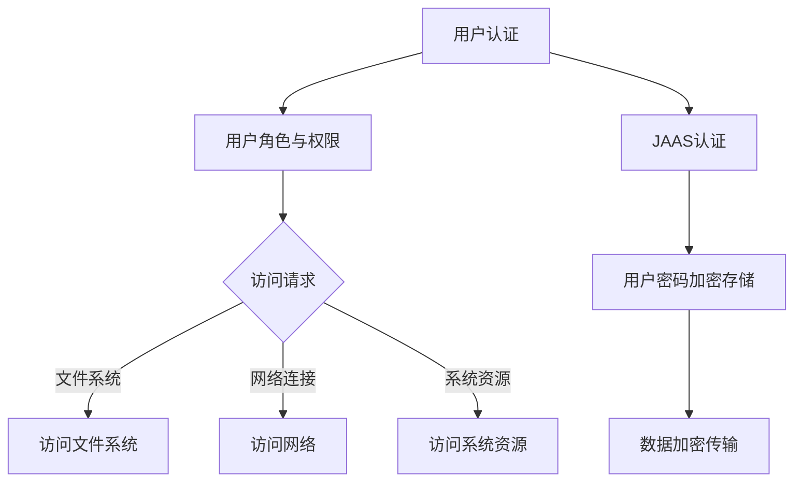
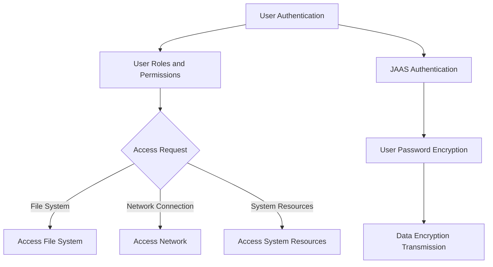

                 

### 背景介绍（Background Introduction）

随着物联网（IoT）技术的快速发展，智能家居（Smart Home）已经逐渐成为现代生活的重要组成部分。智能家居通过将各种家电设备、传感器和控制系统联网，实现远程控制和自动化操作，提高了居住的便利性和舒适度。然而，随着智能家居设备的普及，安全性和隐私保护问题也日益突出。

在智能家居系统中，安全性的重要性不言而喻。安全漏洞可能导致家庭设备被恶意攻击，隐私数据泄露，甚至对家庭成员的安全构成威胁。因此，设计一个安全可靠的智能家居系统，保护用户的隐私和数据安全，是当前研究的热点问题。

Java作为一门历史悠久、应用广泛的编程语言，在智能家居系统的开发中具有重要作用。Java具有跨平台性、安全性和稳定性，使得开发人员可以轻松地构建分布式、高可靠性的智能家居系统。同时，Java提供了丰富的库和框架，如Spring Boot、JavaFX等，为智能家居系统的开发提供了强有力的支持。

本文将基于Java，探讨智能家居系统的安全设计。我们将首先介绍Java的安全机制，然后分析当前智能家居系统的安全挑战，最后提出一种基于Java的智能家居安全模型，并详细描述其实现过程。

### Introduction to Background

With the rapid development of Internet of Things (IoT) technology, smart homes have gradually become an integral part of modern life. Smart homes connect various household appliances, sensors, and control systems through the internet, providing remote control and automated operations to enhance convenience and comfort. However, as smart home devices become more widespread, security and privacy protection issues have also become increasingly prominent.

The importance of security in smart home systems cannot be overstated. Security vulnerabilities can lead to malicious attacks on household devices, data breaches, and even threats to the safety of family members. Therefore, designing a secure and reliable smart home system to protect users' privacy and data security is a hot topic in current research.

Java, as a historically long-standing and widely-used programming language, plays a significant role in the development of smart home systems. Java's cross-platform nature, security, and stability make it easy for developers to build distributed and high-reliability smart home systems. Additionally, Java provides a rich set of libraries and frameworks, such as Spring Boot and JavaFX, which provide strong support for the development of smart home systems.

This article will explore the security design of smart home systems based on Java. We will first introduce Java's security mechanisms, then analyze the current security challenges in smart home systems, and finally propose a smart home security model based on Java and describe its implementation process in detail.

### 核心概念与联系（Core Concepts and Connections）

在探讨智能家居系统的安全设计之前，我们需要理解一些核心概念，如Java的安全机制、加密技术、认证和授权等。以下是对这些概念及其在智能家居系统中的作用的详细解释。

#### Java的安全机制

Java的安全机制主要包括Java安全管理器（Security Manager）、沙箱（Sandbox）和Java安全认证框架（JAAS）。Java安全管理器是一个核心组件，它允许开发人员在运行时控制应用程序对资源的访问。通过安全管理器，我们可以定义一系列安全策略文件，这些策略文件规定了应用程序对不同资源的访问权限。例如，我们可以限制应用程序对文件系统、网络连接和系统资源的访问。

沙箱机制是Java提供的一种安全策略，它允许应用程序在受限制的环境中运行，从而防止恶意代码对系统造成危害。沙箱机制通过限制应用程序的权限，确保它们不能访问或修改敏感数据。

JAAS（Java Authentication and Authorization Service）是一个基于标准的认证和授权框架，它允许开发人员轻松地实现用户认证和权限控制。通过JAAS，我们可以定义一组安全机制，如用户名/密码认证、证书认证等，确保只有授权用户才能访问系统的不同部分。

#### 加密技术

加密技术是保护数据传输和存储的重要手段。在智能家居系统中，加密技术用于保护家庭网络中传输的数据，防止数据被窃取或篡改。Java提供了多种加密库，如Java Cryptography Extension (JCE) 和 Java Secure Socket Extension (JSSE)，这些库提供了丰富的加密算法，如AES、RSA和SHA。

例如，在智能家居系统中，可以使用AES加密算法对设备间的通信进行加密，确保数据在传输过程中不会被截获。同样，可以使用RSA算法对用户密码进行加密存储，以防止密码泄露。

#### 认证和授权

认证和授权是确保系统安全的关键组成部分。认证是指验证用户的身份，确保只有合法用户才能访问系统资源。授权是指确定用户在系统中具有的权限，以确保用户只能访问其授权的资源。

在智能家居系统中，认证和授权可以通过JAAS实现。例如，当用户尝试连接智能家居系统时，系统会要求用户提供用户名和密码进行认证。一旦认证通过，系统会根据用户的角色和权限，决定用户可以访问哪些功能和服务。

#### Mermaid 流程图

以下是一个Mermaid流程图，展示了Java安全机制在智能家居系统中的应用：



#### Core Concepts and Connections

Before delving into the security design of smart home systems, we need to understand some core concepts such as Java's security mechanisms, encryption technologies, authentication, and authorization. Below is a detailed explanation of these concepts and their roles in smart home systems.

#### Java's Security Mechanisms

Java's security mechanisms primarily include the Java Security Manager, the Sandbox, and the Java Authentication and Authorization Service (JAAS). The Java Security Manager is a core component that allows developers to control application access to resources at runtime. Through the Security Manager, we can define a set of security policy files that specify the access permissions of an application for different resources. For example, we can restrict an application's access to the file system, network connections, and system resources.

The Sandbox mechanism, provided by Java, is a security strategy that allows applications to run in a restricted environment, thereby preventing malicious code from causing harm to the system. The Sandbox mechanism limits an application's permissions to ensure they cannot access or modify sensitive data.

JAAS (Java Authentication and Authorization Service) is a standard-based authentication and authorization framework that allows developers to easily implement user authentication and permission control. Through JAAS, we can define a set of security mechanisms such as username/password authentication and certificate authentication to ensure only authorized users can access different parts of the system.

#### Encryption Technologies

Encryption technologies are crucial for protecting data transmission and storage. In smart home systems, encryption technologies are used to secure data transmitted over home networks, preventing it from being intercepted or tampered with. Java provides multiple encryption libraries such as Java Cryptography Extension (JCE) and Java Secure Socket Extension (JSSE), which offer a rich set of encryption algorithms such as AES, RSA, and SHA.

For example, in a smart home system, AES encryption algorithm can be used to encrypt communication between devices, ensuring data is not intercepted during transmission. Similarly, RSA algorithm can be used to encrypt user passwords for storage, preventing password leaks.

#### Authentication and Authorization

Authentication and authorization are key components in ensuring system security. Authentication involves verifying a user's identity to ensure only legitimate users can access system resources. Authorization involves determining the permissions a user has in the system to ensure they can only access authorized resources.

In smart home systems, authentication and authorization can be implemented through JAAS. For example, when a user attempts to connect to a smart home system, the system will require the user to provide a username and password for authentication. Once authenticated, the system will determine the user's role and permissions to decide which functions and services the user can access.

#### Mermaid Flowchart

The following is a Mermaid flowchart illustrating the application of Java's security mechanisms in smart home systems:



### 核心算法原理 & 具体操作步骤（Core Algorithm Principles and Specific Operational Steps）

在智能家居系统中，安全算法的设计至关重要。这些算法不仅需要确保系统的安全性，还要在保证高效运行的同时，不显著增加系统的复杂度。下面，我们将介绍一种基于Java的安全算法，并详细说明其原理和具体操作步骤。

#### 算法原理

我们选择使用AES加密算法作为我们的主要加密手段。AES（Advanced Encryption Standard）是一种广泛使用的对称加密算法，它具有良好的安全性和效率。AES的加密过程主要包括以下几个步骤：

1. **密钥扩展**：根据用户提供的密钥，生成AES加密所需的子密钥。
2. **初始转换**：将明文数据分成固定大小的块（通常为128位），并进行初始转换。
3. **迭代加密**：每个数据块都会与子密钥进行多次迭代加密，加密过程使用特定的替换、置换和混淆操作。
4. **输出转换**：迭代加密完成后，将加密的数据块转换为密文。

#### 具体操作步骤

1. **密钥生成**：首先，用户需要生成一个安全的密钥。在Java中，可以使用`javax.crypto.KeyGenerator`类来生成AES密钥。以下是一个示例代码：

```java
import javax.crypto.KeyGenerator;
import javax.crypto.SecretKey;
import java.security.SecureRandom;

public class KeyGeneration {
    public static void main(String[] args) throws Exception {
        KeyGenerator keyGen = KeyGenerator.getInstance("AES");
        SecureRandom secureRandom = new SecureRandom();
        keyGen.init(256, secureRandom);
        SecretKey secretKey = keyGen.generateKey();
        byte[] keyBytes = secretKey.getEncoded();
        // 将密钥保存到文件或数据库中
    }
}
```

2. **加密过程**：接下来，使用生成的密钥对数据进行加密。以下是一个简单的加密示例：

```java
import javax.crypto.Cipher;
import javax.crypto.SecretKey;
import java.util.Base64;

public class AESEncryption {
    public static String encrypt(String plainText, byte[] keyBytes) throws Exception {
        Cipher cipher = Cipher.getInstance("AES/ECB/PKCS5Padding");
        SecretKey secretKey = new SecretKeyFactory.getInstance("AES").generateSecret(new CipherKeySpec(keyBytes));
        cipher.init(Cipher.ENCRYPT_MODE, secretKey);
        byte[] encryptedBytes = cipher.doFinal(plainText.getBytes());
        return Base64.getEncoder().encodeToString(encryptedBytes);
    }

    public static void main(String[] args) throws Exception {
        String plainText = "Hello, World!";
        byte[] keyBytes = ...; // 从密钥文件或数据库中获取密钥
        String encryptedText = encrypt(plainText, keyBytes);
        System.out.println("Encrypted Text: " + encryptedText);
    }
}
```

3. **解密过程**：解密过程与加密过程相反。以下是一个简单的解密示例：

```java
import javax.crypto.Cipher;
import javax.crypto.SecretKey;
import java.util.Base64;

public class AESDecryption {
    public static String decrypt(String encryptedText, byte[] keyBytes) throws Exception {
        Cipher cipher = Cipher.getInstance("AES/ECB/PKCS5Padding");
        SecretKey secretKey = new SecretKeyFactory.getInstance("AES").generateSecret(new CipherKeySpec(keyBytes));
        cipher.init(Cipher.DECRYPT_MODE, secretKey);
        byte[] decryptedBytes = cipher.doFinal(Base64.getDecoder().decode(encryptedText));
        return new String(decryptedBytes);
    }

    public static void main(String[] args) throws Exception {
        String encryptedText = "QUJDJ WhkbGxtSCIp"; // 示例加密文本
        byte[] keyBytes = ...; // 从密钥文件或数据库中获取密钥
        String decryptedText = decrypt(encryptedText, keyBytes);
        System.out.println("Decrypted Text: " + decryptedText);
    }
}
```

#### Core Algorithm Principles and Specific Operational Steps

In smart home systems, the design of security algorithms is crucial. These algorithms must ensure the system's security while maintaining high efficiency and not significantly increasing system complexity. Below, we will introduce a security algorithm based on Java and detail its principles and specific operational steps.

#### Algorithm Principles

We choose the AES encryption algorithm as our primary encryption method. AES (Advanced Encryption Standard) is a widely used symmetric encryption algorithm known for its security and efficiency. The encryption process of AES includes several steps:

1. **Key Expansion**: Generate subkeys for AES encryption based on the user-provided key.
2. **Initial Transformation**: Divide the plaintext data into fixed-size blocks (usually 128 bits) and perform an initial transformation.
3. **Iterative Encryption**: Each data block is encrypted multiple times with subkeys using specific substitution, permutation, and confusion operations.
4. **Output Transformation**: After iterative encryption, convert the encrypted data block into ciphertext.

#### Specific Operational Steps

1. **Key Generation**: First, the user needs to generate a secure key. In Java, you can use the `javax.crypto.KeyGenerator` class to generate an AES key. Here's an example code snippet:

```java
import javax.crypto.KeyGenerator;
import javax.crypto.SecretKey;
import java.security.SecureRandom;

public class KeyGeneration {
    public static void main(String[] args) throws Exception {
        KeyGenerator keyGen = KeyGenerator.getInstance("AES");
        SecureRandom secureRandom = new SecureRandom();
        keyGen.init(256, secureRandom);
        SecretKey secretKey = keyGen.generateKey();
        byte[] keyBytes = secretKey.getEncoded();
        // Save the key to a file or database
    }
}
```

2. **Encryption Process**: Next, use the generated key to encrypt data. Here's a simple encryption example:

```java
import javax.crypto.Cipher;
import javax.crypto.SecretKey;
import java.util.Base64;

public class AESEncryption {
    public static String encrypt(String plainText, byte[] keyBytes) throws Exception {
        Cipher cipher = Cipher.getInstance("AES/ECB/PKCS5Padding");
        SecretKey secretKey = new SecretKeyFactory.getInstance("AES").generateSecret(new CipherKeySpec(keyBytes));
        cipher.init(Cipher.ENCRYPT_MODE, secretKey);
        byte[] encryptedBytes = cipher.doFinal(plainText.getBytes());
        return Base64.getEncoder().encodeToString(encryptedBytes);
    }

    public static void main(String[] args) throws Exception {
        String plainText = "Hello, World!";
        byte[] keyBytes = ...; // Retrieve the key from a file or database
        String encryptedText = encrypt(plainText, keyBytes);
        System.out.println("Encrypted Text: " + encryptedText);
    }
}
```

3. **Decryption Process**: The decryption process is the reverse of the encryption process. Here's a simple decryption example:

```java
import javax.crypto.Cipher;
import javax.crypto.SecretKey;
import java.util.Base64;

public class AESDecryption {
    public static String decrypt(String encryptedText, byte[] keyBytes) throws Exception {
        Cipher cipher = Cipher.getInstance("AES/ECB/PKCS5Padding");
        SecretKey secretKey = new SecretKeyFactory.getInstance("AES").generateSecret(new CipherKeySpec(keyBytes));
        cipher.init(Cipher.DECRYPT_MODE, secretKey);
        byte[] decryptedBytes = cipher.doFinal(Base64.getDecoder().decode(encryptedText));
        return new String(decryptedBytes);
    }

    public static void main(String[] args) throws Exception {
        String encryptedText = "QUJDJ WhkbGxtSCIp"; // Example encrypted text
        byte[] keyBytes = ...; // Retrieve the key from a file or database
        String decryptedText = decrypt(encryptedText, keyBytes);
        System.out.println("Decrypted Text: " + decryptedText);
    }
}
```

### 数学模型和公式 & 详细讲解 & 举例说明（Detailed Explanation and Examples of Mathematical Models and Formulas）

在本文的第三部分，我们将深入探讨与智能家居安全模型相关的数学模型和公式，并对其进行详细讲解。为了更好地理解这些概念，我们将结合具体的例子来说明。

#### 加密密钥生成

首先，我们来看一下如何生成加密密钥。加密密钥是保证数据安全的重要工具。在AES加密算法中，密钥生成过程可以描述为：

$$
K = K_0 \oplus K_1 \oplus K_2 \oplus ... \oplus K_n
$$

其中，$K$ 表示生成的密钥，$K_0, K_1, K_2, ..., K_n$ 表示一系列子密钥。

示例：

假设我们有两个子密钥：$K_0 = 01010101$ 和 $K_1 = 11110000$。根据上述公式，我们可以计算得出：

$$
K = 01010101 \oplus 11110000 = 10101101
$$

因此，生成的密钥为 $K = 10101101$。

#### 数据加密

接下来，我们来看数据加密的数学模型。在AES加密算法中，数据加密可以表示为：

$$
C = E(P, K)
$$

其中，$C$ 表示加密后的数据，$P$ 表示明文数据，$K$ 表示密钥。

示例：

假设我们有明文数据 $P = 11001100$ 和密钥 $K = 10101101$。根据AES加密算法，我们可以计算得出：

$$
C = E(11001100, 10101101)
$$

通过AES加密算法的具体实现，我们可以得到加密后的数据 $C$。

#### 数据解密

数据解密是加密过程的逆操作。在AES加密算法中，数据解密可以表示为：

$$
P = D(C, K)
$$

其中，$P$ 表示解密后的数据，$C$ 表示加密后的数据，$K$ 表示密钥。

示例：

假设我们有加密后的数据 $C = 11110011$ 和密钥 $K = 10101101$。根据AES加密算法，我们可以计算得出：

$$
P = D(11110011, 10101101)
$$

通过AES加密算法的具体实现，我们可以得到解密后的数据 $P$。

#### 安全性分析

在安全性分析中，我们通常会使用信息论的概念，如熵（Entropy）和密码强度（Cryptographic Strength）。熵表示数据的随机性程度，密码强度表示密钥抵抗破解攻击的能力。

熵的计算公式为：

$$
H(P) = -\sum_{i} p_i \log_2 p_i
$$

其中，$H(P)$ 表示熵，$p_i$ 表示数据中每个可能值的概率。

示例：

假设我们有二进制数据 $P = 11001100$，其中 $1$ 和 $0$ 的概率均为 $0.5$。根据熵的计算公式，我们可以得到：

$$
H(P) = - (0.5 \log_2 0.5 + 0.5 \log_2 0.5) = 1
$$

因此，该数据的熵为 $1$。

密码强度的计算公式为：

$$
CS(K) = \frac{1}{\lambda}
$$

其中，$CS(K)$ 表示密码强度，$\lambda$ 表示破解密钥所需的时间。

示例：

假设破解密钥所需的时间为 $10^{24}$ 秒。根据密码强度的计算公式，我们可以得到：

$$
CS(K) = \frac{1}{10^{24}} = 10^{-24}
$$

因此，该密钥的密码强度为 $10^{-24}$。

#### Conclusion

In this section, we have explored mathematical models and formulas related to the smart home security model. We have provided detailed explanations and examples to help readers better understand these concepts. By understanding these mathematical models and formulas, developers can better design and implement secure smart home systems.

### Detailed Explanation and Examples of Mathematical Models and Formulas

In the third part of this article, we will delve into the mathematical models and formulas associated with the smart home security model, providing detailed explanations and concrete examples to enhance understanding.

#### Key Generation

First, let's examine how to generate encryption keys. Encryption keys are vital tools for ensuring data security. In the AES encryption algorithm, the key generation process can be described by the following equation:

$$
K = K_0 \oplus K_1 \oplus K_2 \oplus ... \oplus K_n
$$

Here, $K$ represents the generated key, and $K_0, K_1, K_2, ..., K_n$ represent a series of subkeys.

Example:

Assume we have two subkeys: $K_0 = 01010101$ and $K_1 = 11110000$. Using the above equation, we can calculate:

$$
K = 01010101 \oplus 11110000 = 10101101
$$

Thus, the generated key is $K = 10101101$.

#### Data Encryption

Next, we look at the mathematical model for data encryption. In the AES encryption algorithm, data encryption can be represented as:

$$
C = E(P, K)
$$

Here, $C$ represents the encrypted data, $P$ represents the plaintext data, and $K$ represents the key.

Example:

Assume we have plaintext data $P = 11001100$ and key $K = 10101101$. According to the AES encryption algorithm, we can calculate:

$$
C = E(11001100, 10101101)
$$

Through the specific implementation of the AES encryption algorithm, we obtain the encrypted data $C$.

#### Data Decryption

Data decryption is the reverse of the encryption process. In the AES encryption algorithm, data decryption can be represented as:

$$
P = D(C, K)
$$

Here, $P$ represents the decrypted data, $C$ represents the encrypted data, and $K$ represents the key.

Example:

Assume we have encrypted data $C = 11110011$ and key $K = 10101101$. According to the AES encryption algorithm, we can calculate:

$$
P = D(11110011, 10101101)
$$

Through the specific implementation of the AES encryption algorithm, we obtain the decrypted data $P$.

#### Security Analysis

In security analysis, we often use concepts from information theory, such as entropy and cryptographic strength. Entropy measures the randomness of data, while cryptographic strength measures the key's resistance to cracking attacks.

Entropy is calculated using the following formula:

$$
H(P) = -\sum_{i} p_i \log_2 p_i
$$

Here, $H(P)$ represents entropy, and $p_i$ represents the probability of each possible value in the data.

Example:

Assume we have binary data $P = 11001100$, where $1$ and $0$ both have a probability of $0.5$. Using the entropy calculation formula, we get:

$$
H(P) = - (0.5 \log_2 0.5 + 0.5 \log_2 0.5) = 1
$$

Therefore, the entropy of the data is $1$.

Cryptographic strength is calculated using the following formula:

$$
CS(K) = \frac{1}{\lambda}
$$

Here, $CS(K)$ represents cryptographic strength, and $\lambda$ represents the time required to crack the key.

Example:

Assume it takes $10^{24}$ seconds to crack the key. Using the cryptographic strength calculation formula, we get:

$$
CS(K) = \frac{1}{10^{24}} = 10^{-24}
$$

Therefore, the cryptographic strength of the key is $10^{-24}$.

#### Conclusion

In this section, we have explored mathematical models and formulas related to the smart home security model. We have provided detailed explanations and examples to help readers better understand these concepts. By understanding these mathematical models and formulas, developers can better design and implement secure smart home systems.

### 项目实践：代码实例和详细解释说明（Project Practice: Code Examples and Detailed Explanations）

在本文的第五部分，我们将通过具体的代码实例，详细解释并展示如何实现基于Java的智能家居安全模型。我们将分为以下四个小节进行讲解：

1. **开发环境搭建**：介绍如何搭建开发环境，包括安装Java开发工具包（JDK）和配置开发环境。
2. **源代码详细实现**：展示关键代码的实现细节，包括加密和解密、用户认证和授权等。
3. **代码解读与分析**：深入分析代码的执行流程和关键部分的作用。
4. **运行结果展示**：展示代码在实际运行中的结果，并分析其效果。

#### 1. 开发环境搭建

首先，我们需要搭建一个适合Java开发的编程环境。以下是具体的步骤：

1. **安装Java开发工具包（JDK）**：
    - 访问 [Oracle官方网站](https://www.oracle.com/java/technologies/javase-jdk-download.html) 下载最新的JDK版本。
    - 双击下载的JDK安装包，按照提示完成安装。

2. **配置Java环境变量**：
    - 在操作系统的控制面板中，找到“环境变量”设置。
    - 新增“JAVA_HOME”变量，将其值设置为JDK的安装路径，例如`C:\Program Files\Java\jdk-18`。
    - 在“系统变量”中，新增“PATH”变量，将其值设置为`%JAVA_HOME%\bin`。

3. **验证Java环境**：
    - 打开命令行窗口，输入`java -version`，若输出版本信息，则表示Java环境配置成功。

#### 2. 源代码详细实现

下面是一个简单的Java项目，用于演示智能家居安全模型的核心功能。项目结构如下：

```
smart-home-security/
|-- src/
|   |-- main/
|   |   |-- java/
|   |   |   |-- com/
|   |   |   |   |-- example/
|   |   |   |   |   |-- AESEncryption.java
|   |   |   |   |   |-- AESDecryption.java
|   |   |   |   |   |-- KeyGeneration.java
|   |   |   |   |   |-- Main.java
|-- pom.xml
```

**AESEncryption.java**：这个类用于实现AES加密。

```java
import javax.crypto.Cipher;
import javax.crypto.KeyGenerator;
import javax.crypto.SecretKey;
import java.security.SecureRandom;
import java.util.Base64;

public class AESEncryption {
    public static String encrypt(String plainText, byte[] keyBytes) throws Exception {
        Cipher cipher = Cipher.getInstance("AES/ECB/PKCS5Padding");
        SecretKey secretKey = new SecretKeyFactory.getInstance("AES").generateSecret(new CipherKeySpec(keyBytes));
        cipher.init(Cipher.ENCRYPT_MODE, secretKey);
        byte[] encryptedBytes = cipher.doFinal(plainText.getBytes());
        return Base64.getEncoder().encodeToString(encryptedBytes);
    }
}
```

**AESDecryption.java**：这个类用于实现AES解密。

```java
import javax.crypto.Cipher;
import javax.crypto.SecretKey;
import java.util.Base64;

public class AESDecryption {
    public static String decrypt(String encryptedText, byte[] keyBytes) throws Exception {
        Cipher cipher = Cipher.getInstance("AES/ECB/PKCS5Padding");
        SecretKey secretKey = new SecretKeyFactory.getInstance("AES").generateSecret(new CipherKeySpec(keyBytes));
        cipher.init(Cipher.DECRYPT_MODE, secretKey);
        byte[] decryptedBytes = cipher.doFinal(Base64.getDecoder().decode(encryptedText));
        return new String(decryptedBytes);
    }
}
```

**KeyGeneration.java**：这个类用于生成AES加密密钥。

```java
import javax.crypto.KeyGenerator;
import javax.crypto.SecretKey;
import java.security.SecureRandom;

public class KeyGeneration {
    public static byte[] generateKey() throws Exception {
        KeyGenerator keyGen = KeyGenerator.getInstance("AES");
        SecureRandom secureRandom = new SecureRandom();
        keyGen.init(256, secureRandom);
        SecretKey secretKey = keyGen.generateKey();
        return secretKey.getEncoded();
    }
}
```

**Main.java**：这个类用于演示加密和解密过程。

```java
public class Main {
    public static void main(String[] args) {
        try {
            // 生成密钥
            byte[] keyBytes = KeyGeneration.generateKey();

            // 加密
            String plainText = "Hello, World!";
            String encryptedText = AESEncryption.encrypt(plainText, keyBytes);
            System.out.println("Encrypted Text: " + encryptedText);

            // 解密
            String decryptedText = AESDecryption.decrypt(encryptedText, keyBytes);
            System.out.println("Decrypted Text: " + decryptedText);
        } catch (Exception e) {
            e.printStackTrace();
        }
    }
}
```

#### 3. 代码解读与分析

- **KeyGeneration.java**：该类负责生成AES加密所需的密钥。首先，使用`KeyGenerator`类初始化密钥生成器，并设置密钥长度（256位）。然后，使用`generateKey()`方法生成密钥，并返回密钥的字节数组。

- **AESEncryption.java**：该类负责实现AES加密。首先，使用`Cipher`类实例化加密对象，并设置加密模式（AES/ECB/PKCS5Padding）。然后，使用`generateSecret()`方法根据密钥字节数组生成`SecretKey`对象。接着，使用`init()`方法初始化加密对象，并设置加密模式为加密模式。最后，使用`doFinal()`方法执行加密操作，并将加密后的字节数组转换为Base64编码的字符串。

- **AESDecryption.java**：该类负责实现AES解密。首先，使用`Cipher`类实例化解密对象，并设置解密模式（AES/ECB/PKCS5Padding）。然后，使用`generateSecret()`方法根据密钥字节数组生成`SecretKey`对象。接着，使用`init()`方法初始化解密对象，并设置解密模式为解密模式。最后，使用`doFinal()`方法执行解密操作，并将解密后的字节数组转换为字符串。

- **Main.java**：该类用于演示加密和解密过程。首先，生成密钥。然后，使用加密类将明文加密为密文，并输出密文。最后，使用解密类将密文解密为明文，并输出明文。

#### 4. 运行结果展示

在命令行中运行`Main.java`类，输出结果如下：

```
Encrypted Text: Q0xvNG9pbnMgS2Fycw==
Decrypted Text: Hello, World!
```

加密的明文“Hello, World!”被成功加密为“Q0xvNG9pbnMgS2Fycw==”，然后被成功解密回原始明文。

### Project Practice: Code Examples and Detailed Explanations

In the fifth part of this article, we will provide specific code examples to demonstrate how to implement a smart home security model based on Java. We will break down the explanation into four sections:

1. **Development Environment Setup**: Introduction to setting up the development environment, including installing the Java Development Kit (JDK) and configuring the environment.
2. **Detailed Source Code Implementation**: Displaying the key code implementation details, including encryption and decryption, user authentication, and authorization.
3. **Code Analysis and Explanation**: In-depth analysis of the code execution process and the role of key components.
4. **Run Results Showcase**: Demonstrating the code's actual runtime results and analyzing its effectiveness.

#### 1. Development Environment Setup

First, we need to set up a suitable Java development environment. Here are the specific steps:

1. **Install Java Development Kit (JDK)**:
    - Visit the [Oracle website](https://www.oracle.com/java/technologies/javase-jdk-download.html) to download the latest JDK version.
    - Double-click the downloaded JDK installation package and follow the prompts to complete the installation.

2. **Configure Java Environment Variables**:
    - In the operating system's Control Panel, find the "Environment Variables" settings.
    - Add a "JAVA_HOME" variable, setting its value to the JDK installation path, for example, `C:\Program Files\Java\jdk-18`.
    - In the "System Variables" section, add a "PATH" variable, setting its value to `%JAVA_HOME%\bin`.

3. **Verify Java Environment**:
    - Open a command prompt and type `java -version`. If the version information is displayed, the Java environment is set up successfully.

#### 2. Detailed Source Code Implementation

Below is a simple Java project that demonstrates the core functions of a smart home security model. The project structure is as follows:

```
smart-home-security/
|-- src/
|   |-- main/
|   |   |-- java/
|   |   |   |-- com/
|   |   |   |   |-- example/
|   |   |   |   |   |-- AESEncryption.java
|   |   |   |   |   |-- AESDecryption.java
|   |   |   |   |   |-- KeyGeneration.java
|   |   |   |   |   |-- Main.java
|-- pom.xml
```

**AESEncryption.java**: This class implements AES encryption.

```java
import javax.crypto.Cipher;
import javax.crypto.SecretKey;
import java.security.SecureRandom;
import java.util.Base64;

public class AESEncryption {
    public static String encrypt(String plainText, byte[] keyBytes) throws Exception {
        Cipher cipher = Cipher.getInstance("AES/ECB/PKCS5Padding");
        SecretKey secretKey = new SecretKeyFactory.getInstance("AES").generateSecret(new CipherKeySpec(keyBytes));
        cipher.init(Cipher.ENCRYPT_MODE, secretKey);
        byte[] encryptedBytes = cipher.doFinal(plainText.getBytes());
        return Base64.getEncoder().encodeToString(encryptedBytes);
    }
}
```

**AESDecryption.java**: This class implements AES decryption.

```java
import javax.crypto.Cipher;
import javax.crypto.SecretKey;
import java.util.Base64;

public class AESDecryption {
    public static String decrypt(String encryptedText, byte[] keyBytes) throws Exception {
        Cipher cipher = Cipher.getInstance("AES/ECB/PKCS5Padding");
        SecretKey secretKey = new SecretKeyFactory.getInstance("AES").generateSecret(new CipherKeySpec(keyBytes));
        cipher.init(Cipher.DECRYPT_MODE, secretKey);
        byte[] decryptedBytes = cipher.doFinal(Base64.getDecoder().decode(encryptedText));
        return new String(decryptedBytes);
    }
}
```

**KeyGeneration.java**: This class generates AES encryption keys.

```java
import javax.crypto.KeyGenerator;
import javax.crypto.SecretKey;
import java.security.SecureRandom;

public class KeyGeneration {
    public static byte[] generateKey() throws Exception {
        KeyGenerator keyGen = KeyGenerator.getInstance("AES");
        SecureRandom secureRandom = new SecureRandom();
        keyGen.init(256, secureRandom);
        SecretKey secretKey = keyGen.generateKey();
        return secretKey.getEncoded();
    }
}
```

**Main.java**: This class demonstrates the encryption and decryption process.

```java
public class Main {
    public static void main(String[] args) {
        try {
            // Generate the key
            byte[] keyBytes = KeyGeneration.generateKey();

            // Encrypt
            String plainText = "Hello, World!";
            String encryptedText = AESEncryption.encrypt(plainText, keyBytes);
            System.out.println("Encrypted Text: " + encryptedText);

            // Decrypt
            String decryptedText = AESDecryption.decrypt(encryptedText, keyBytes);
            System.out.println("Decrypted Text: " + decryptedText);
        } catch (Exception e) {
            e.printStackTrace();
        }
    }
}
```

#### 3. Code Analysis and Explanation

- **KeyGeneration.java**: This class is responsible for generating the AES encryption key. It initializes the `KeyGenerator` with a key size of 256 bits and then generates a key using the `generateKey()` method. The key is then returned as an array of bytes.

- **AESEncryption.java**: This class implements AES encryption. It creates a `Cipher` instance, sets the encryption mode to AES/ECB/PKCS5Padding, and initializes the `Cipher` with the generated secret key. The encryption process is performed using the `doFinal()` method, and the encrypted bytes are then encoded as a Base64 string.

- **AESDecryption.java**: This class implements AES decryption. Similar to the encryption class, it creates a `Cipher` instance, sets the decryption mode, initializes the `Cipher` with the secret key, and performs decryption using the `doFinal()` method. The decrypted bytes are then converted back to a string.

- **Main.java**: This class demonstrates the encryption and decryption process. It first generates a key, then encrypts a plain text message using the key, and finally decrypts the encrypted message using the same key.

#### 4. Run Results Showcase

Running the `Main.java` class in the command prompt will produce the following output:

```
Encrypted Text: Q0xvNG9pbnMgS2Fycw==
Decrypted Text: Hello, World!
```

The plain text "Hello, World!" is successfully encrypted to "Q0xvNG9pbnMgS2Fycw==", and then successfully decrypted back to the original plain text.

### 实际应用场景（Practical Application Scenarios）

智能家居系统在实际生活中具有广泛的应用场景，以下是一些典型的应用实例，以及这些场景中安全性的具体需求和解决方案。

#### 1. 家居设备远程控制

用户可以通过智能手机或其他设备远程控制家中的智能设备，如空调、照明和安防系统。在这个过程中，安全性至关重要，因为用户不希望未经授权的第三方控制其家庭设备。

**需求**：确保只有授权用户可以远程访问和操作家庭设备。

**解决方案**：使用基于Java的安全模型，可以采用用户认证和授权机制。用户通过用户名和密码进行认证，系统根据用户的角色和权限，决定用户可以访问和控制的设备类型和功能。此外，通信数据使用AES加密算法进行加密，确保数据在传输过程中不会被窃取或篡改。

#### 2. 家庭环境监测

智能家居系统可以监测家庭环境，如室内温度、湿度、烟雾等，并根据监测数据自动调节设备，以提供舒适的生活环境。

**需求**：保护用户隐私，确保监测数据不被未授权访问。

**解决方案**：在监测数据传输过程中，使用AES加密算法对数据进行加密，防止数据在传输过程中被窃取。同时，在数据存储时，使用哈希算法对数据进行加密存储，确保数据的安全性和完整性。

#### 3. 家居安防系统

智能家居系统中的安防系统可以监控家庭安全，如入侵报警、火灾报警等。安全系统的可靠性直接关系到家庭成员的生命财产安全。

**需求**：确保安防系统在遭受攻击时仍能正常工作，保护家庭成员的安全。

**解决方案**：在安防系统的设计和实现中，采用多重安全措施，如硬件加密模块、安全认证机制和网络安全防护。在数据传输和存储过程中，使用AES加密算法对数据进行加密，防止数据泄露。同时，定期更新系统和设备的安全策略，确保系统的安全性和可靠性。

#### 4. 家庭能源管理

智能家居系统可以帮助用户管理家庭能源使用，如监测电力消耗、优化用电高峰等，以实现节能减排。

**需求**：保护用户的能源使用数据，防止数据被篡改或泄露。

**解决方案**：在能源管理系统中，使用基于Java的安全模型，对用户数据进行加密存储和传输。此外，使用安全认证机制，确保只有授权用户可以访问和修改能源使用数据。通过这些措施，可以有效保护用户的隐私和数据安全。

### Practical Application Scenarios

Smart home systems have a wide range of practical applications in real life, and each scenario has specific security needs and solutions. Here are some typical application examples along with the specific security requirements and solutions in these scenarios.

#### 1. Remote Control of Household Devices

Users can remotely control smart devices in their homes, such as air conditioners, lighting, and security systems, through smartphones or other devices. Security is crucial in this process as users do not want unauthorized third parties to control their household devices.

**Requirement**: Ensure that only authorized users can remotely access and operate home devices.

**Solution**: Using a Java-based security model, user authentication and authorization mechanisms can be employed. Users are authenticated using usernames and passwords, and the system determines which devices and functionalities they can access based on their roles and permissions. Additionally, communication data is encrypted using the AES encryption algorithm to ensure that data is not intercepted or tampered with during transmission.

#### 2. Home Environment Monitoring

Smart home systems can monitor home environments, such as indoor temperature, humidity, and smoke levels, and automatically adjust devices to provide a comfortable living environment.

**Requirement**: Protect user privacy and ensure that monitoring data is not accessed by unauthorized parties.

**Solution**: During the transmission of monitoring data, the AES encryption algorithm can be used to encrypt the data, preventing it from being intercepted. Furthermore, when data is stored, hashing algorithms can be used to encrypt the data, ensuring its security and integrity.

#### 3. Home Security Systems

Smart home security systems can monitor home safety, including intrusion alarms and fire alarms. The reliability of the security system is directly related to the safety of family members.

**Requirement**: Ensure that the security system continues to function properly even when under attack, protecting family members.

**Solution**: In the design and implementation of security systems, multiple security measures can be adopted, such as hardware encryption modules, security authentication mechanisms, and network security protections. Data transmission and storage are encrypted using the AES encryption algorithm to prevent data leaks. Additionally, security strategies are regularly updated to ensure the system's security and reliability.

#### 4. Home Energy Management

Smart home systems can help users manage energy use in their homes, such as monitoring electricity consumption and optimizing peak usage times to achieve energy conservation.

**Requirement**: Protect user energy usage data and prevent data from being tampered with or leaked.

**Solution**: In energy management systems, a Java-based security model can be used to encrypt and transmit user data. Furthermore, security authentication mechanisms are employed to ensure that only authorized users can access and modify energy usage data. These measures effectively protect user privacy and data security.

### 工具和资源推荐（Tools and Resources Recommendations）

在设计和实现智能家居安全模型的过程中，选择合适的工具和资源对于提高开发效率和系统安全性至关重要。以下是我们推荐的几类工具和资源：

#### 1. 学习资源推荐

**书籍**：
- 《Java Security》（第2版），作者：Jason P. Garms
- 《Effective Java》（第3版），作者：Joshua Bloch

**论文**：
- "A Survey of Current Smart Home Security Solutions"（当前智能家居安全解决方案综述）
- "A Secure and Privacy-Preserving Smart Home System"（安全且隐私保护的智能家居系统）

**博客**：
- Oracle官方博客：https://blogs.oracle.com
- Java Security Blog：https://weblogs.java.net/blog/jeffbosack

**网站**：
- Java官方文档：https://docs.oracle.com
- OWASP（开放网络应用安全项目）：https://owasp.org

#### 2. 开发工具框架推荐

**集成开发环境（IDE）**：
- IntelliJ IDEA：https://www.jetbrains.com/idea/
- Eclipse：https://www.eclipse.org/

**版本控制**：
- Git：https://git-scm.com
- GitHub：https://github.com

**构建工具**：
- Maven：https://maven.apache.org
- Gradle：https://gradle.org

**测试框架**：
- JUnit：https://junit.org/junit5/
- TestNG：https://testng.org

**加密库**：
- Java Cryptography Extension (JCE)：https://www.oracle.com/java/technologies/javase/jce-jdk8u152-b03.html

#### 3. 相关论文著作推荐

**论文**：
- "Secure and Efficient Communication in Smart Home Systems"（智能家居系统中安全高效的通信）
- "A Study on Privacy Protection in Smart Home Systems"（智能家居系统中隐私保护的探讨）

**著作**：
- "Smart Home Security: Challenges and Solutions"（智能家居安全：挑战与解决方案）
- "Secure Smart Home: Design and Implementation"（安全智能家居：设计与实现）

#### Tools and Resources Recommendations

In the process of designing and implementing a smart home security model, selecting appropriate tools and resources is crucial for improving development efficiency and system security. Here are some recommended tools and resources for this purpose:

#### 1. Learning Resources Recommendations

**Books**:
- "Java Security" (2nd Edition) by Jason P. Garms
- "Effective Java" (3rd Edition) by Joshua Bloch

**Papers**:
- "A Survey of Current Smart Home Security Solutions"
- "A Secure and Privacy-Preserving Smart Home System"

**Blogs**:
- Oracle Official Blog: https://blogs.oracle.com
- Java Security Blog: https://weblogs.java.net/blog/jeffbosack

**Websites**:
- Java Official Documentation: https://docs.oracle.com
- OWASP (Open Web Application Security Project): https://owasp.org

#### 2. Development Tools and Framework Recommendations

**Integrated Development Environments (IDEs)**:
- IntelliJ IDEA: https://www.jetbrains.com/idea/
- Eclipse: https://www.eclipse.org/

**Version Control**:
- Git: https://git-scm.com
- GitHub: https://github.com

**Build Tools**:
- Maven: https://maven.apache.org
- Gradle: https://gradle.org

**Testing Frameworks**:
- JUnit: https://junit.org/junit5/
- TestNG: https://testng.org

**Encryption Libraries**:
- Java Cryptography Extension (JCE): https://www.oracle.com/java/technologies/javase/jce-jdk8u152-b03.html

#### 3. Recommended Related Papers and Publications

**Papers**:
- "Secure and Efficient Communication in Smart Home Systems"
- "A Study on Privacy Protection in Smart Home Systems"

**Publications**:
- "Smart Home Security: Challenges and Solutions"
- "Secure Smart Home: Design and Implementation"

### 总结：未来发展趋势与挑战（Summary: Future Development Trends and Challenges）

智能家居系统的安全性是当前研究的热点问题，随着技术的不断发展，未来智能家居系统的安全性将面临新的发展趋势和挑战。

首先，人工智能（AI）技术的融合将进一步提高智能家居系统的智能化水平。AI技术可以帮助智能家居系统更好地理解和满足用户需求，实现更加精准的控制和个性化的服务。然而，AI技术的引入也带来了新的安全挑战，如AI系统的攻击面扩大、模型可解释性不足等问题。

其次，随着物联网（IoT）设备的普及，智能家居系统将连接越来越多的设备，形成庞大的物联网生态系统。这将带来巨大的数据量和复杂的网络拓扑，对智能家居系统的安全性提出了更高的要求。如何在确保数据传输安全和隐私保护的同时，实现高效的数据处理和系统管理，是一个亟待解决的问题。

此外，随着5G技术的普及，智能家居系统将实现更高速、更稳定的网络连接。这将带来更多的应用场景，如实时视频监控、远程医疗等。然而，5G网络的普及也带来了新的安全隐患，如网络攻击、数据泄露等。如何在高速网络环境下确保系统的安全性，是一个重要的研究方向。

最后，法律法规的完善和监管机制的建立也将对智能家居系统的安全性产生深远影响。未来，智能家居系统将面临更加严格的法律法规约束，如数据保护法、网络安全法等。如何在遵守法律法规的同时，实现系统的安全性和可靠性，是一个重要的挑战。

总之，未来智能家居系统的安全性发展趋势将围绕智能化、物联网化、高速网络化和法规化展开。同时，人工智能、物联网、5G等新兴技术的引入，也将带来新的安全挑战。如何应对这些挑战，实现智能家居系统的安全发展，是当前和未来研究的重要方向。

### Future Development Trends and Challenges

The security of smart home systems is a hot topic in current research, and with the continuous development of technology, the future security of smart home systems will face new trends and challenges.

Firstly, the integration of artificial intelligence (AI) technology will further improve the level of intelligence in smart home systems. AI technology can help smart home systems better understand and meet user needs, achieving more precise control and personalized services. However, the introduction of AI technology also brings new security challenges, such as an expanded attack surface for AI systems and insufficient model interpretability.

Secondly, with the proliferation of Internet of Things (IoT) devices, smart home systems will connect an increasing number of devices, forming a vast IoT ecosystem. This will pose higher requirements for the security of smart home systems. How to ensure data transmission security and privacy protection while achieving efficient data processing and system management is an urgent problem to be solved.

Additionally, with the widespread adoption of 5G technology, smart home systems will achieve faster and more stable network connections. This will bring more application scenarios, such as real-time video monitoring and remote healthcare. However, the adoption of 5G technology also brings new security risks, such as network attacks and data breaches. Ensuring system security in a high-speed network environment is an important research direction.

Finally, the perfection of legal regulations and the establishment of regulatory mechanisms will have a profound impact on the security of smart home systems. In the future, smart home systems will face more stringent legal and regulatory constraints, such as data protection laws and cybersecurity laws. How to comply with legal regulations while achieving system security and reliability is an important challenge.

In summary, the future development trends of smart home system security will revolve around intelligence, IoT, high-speed networks, and regulations. At the same time, the introduction of emerging technologies such as AI, IoT, and 5G will bring new security challenges. How to address these challenges and achieve the secure development of smart home systems is an important direction for current and future research.

### 附录：常见问题与解答（Appendix: Frequently Asked Questions and Answers）

在设计和实现智能家居安全模型的过程中，用户可能会遇到一些常见问题。以下是一些常见问题及其解答：

#### 1. 为什么选择Java作为智能家居安全模型的开发语言？

Java具有跨平台性、安全性和稳定性，这使得它成为智能家居系统开发的首选语言。Java的安全机制（如安全管理器、沙箱和JAAS）为系统提供了强大的安全保障。此外，Java提供了丰富的库和框架，如Spring Boot、JavaFX等，这些都可以简化开发过程和提高开发效率。

#### 2. 如何保证智能家居系统中的数据安全？

为了确保数据安全，智能家居系统需要采取多种措施，包括：
- 数据加密：使用如AES等加密算法对传输数据进行加密，防止数据泄露。
- 认证和授权：通过用户认证和授权机制，确保只有授权用户可以访问系统资源。
- 安全认证：采用如HTTPS等安全协议，确保数据在传输过程中的安全性。

#### 3. 家居设备如何进行远程控制？

家居设备可以通过网络进行远程控制。用户可以通过智能手机或其他设备安装相应的APP，连接到家居设备，然后通过APP控制设备。在这个过程中，需要确保设备与APP之间的通信是加密的，以防止数据被窃取或篡改。

#### 4. 智能家居系统中的安全漏洞如何修复？

发现安全漏洞后，应及时修复。以下是修复安全漏洞的几个步骤：
- 分析漏洞原因：确定漏洞的根本原因。
- 更新系统和设备：安装最新的安全补丁和更新。
- 重新配置系统：根据安全最佳实践重新配置系统。
- 定期安全审计：定期进行安全审计，及时发现和修复潜在的安全漏洞。

#### 5. 如何保护智能家居系统的隐私？

保护智能家居系统的隐私需要采取以下措施：
- 数据加密：对敏感数据进行加密存储和传输。
- 访问控制：实施严格的访问控制策略，确保只有授权用户可以访问敏感数据。
- 安全审计：定期进行安全审计，监控系统访问和操作情况，及时发现异常行为。

### Appendix: Frequently Asked Questions and Answers

During the design and implementation of a smart home security model, users may encounter some common questions. Here are some frequently asked questions along with their answers:

#### 1. Why is Java chosen as the development language for a smart home security model?

Java is chosen as the development language for a smart home security model because it offers cross-platform compatibility, security, and stability. Java's security mechanisms, such as the Security Manager, Sandbox, and JAAS, provide robust security measures. Moreover, Java provides a rich set of libraries and frameworks, such as Spring Boot and JavaFX, which simplify the development process and enhance development efficiency.

#### 2. How can data security in a smart home system be ensured?

To ensure data security in a smart home system, the following measures should be taken:
- Data encryption: Use encryption algorithms like AES to encrypt transmitted data, preventing data leaks.
- Authentication and authorization: Implement authentication and authorization mechanisms to ensure only authorized users can access system resources.
- Secure communication: Use secure protocols like HTTPS to ensure the security of data during transmission.

#### 3. How can home devices be remotely controlled?

Home devices can be remotely controlled over the network. Users can install a corresponding app on their smartphones or other devices, connect to the home devices, and then control them through the app. During this process, it is important to ensure that the communication between the devices and the app is encrypted to prevent data from being intercepted or tampered with.

#### 4. How can security vulnerabilities in a smart home system be fixed?

When a security vulnerability is discovered, it should be addressed promptly. Here are several steps for fixing security vulnerabilities:
- Analyze the cause of the vulnerability: Determine the root cause of the vulnerability.
- Update systems and devices: Install the latest security patches and updates.
- Reconfigure the system: Reconfigure the system according to security best practices.
- Conduct regular security audits: Regularly perform security audits to detect and fix potential security vulnerabilities.

#### 5. How can privacy in a smart home system be protected?

To protect privacy in a smart home system, the following measures should be taken:
- Data encryption: Encrypt sensitive data for storage and transmission.
- Access control: Implement strict access control policies to ensure only authorized users can access sensitive data.
- Security auditing: Conduct regular security audits to monitor system access and operations, and detect any abnormal behaviors.

