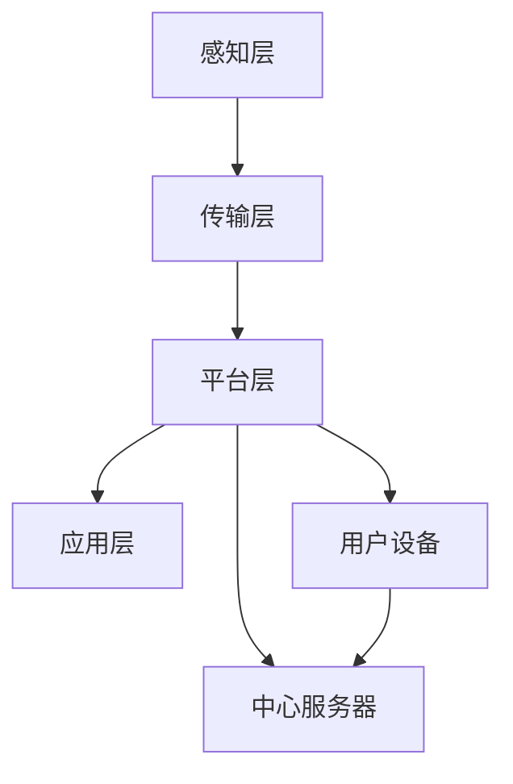
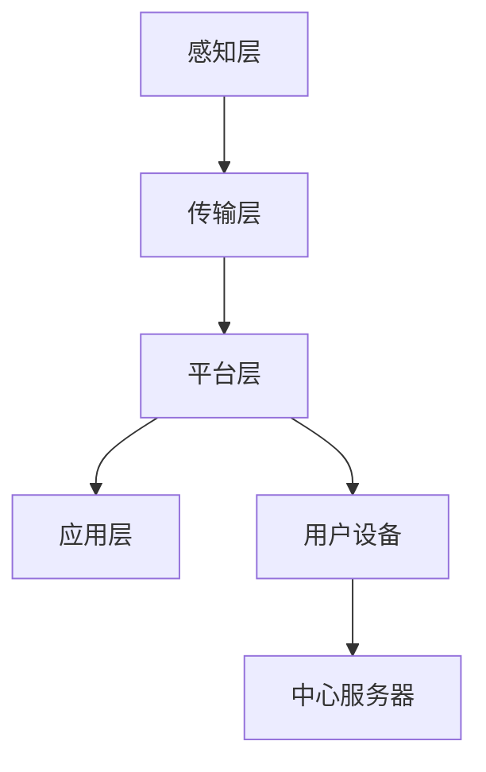

                 

# 文章标题

## 基于Java的智能家居设计：打造可扩展的智能家居中心服务器

随着物联网（IoT）技术的迅速发展，智能家居系统已经成为现代家庭生活的重要组成部分。为了实现高效、便捷的家居管理，设计一个可靠且可扩展的智能家居中心服务器至关重要。本文将深入探讨基于Java的智能家居设计，旨在为开发者提供一种高效的方法来打造一个强大且灵活的智能家居中心服务器。

### 关键词：
- **智能家居设计**
- **Java编程**
- **中心服务器**
- **可扩展性**
- **物联网技术**
- **安全性**

### 摘要：

本文首先介绍了智能家居系统的背景和重要性，然后详细探讨了基于Java的智能家居设计框架，包括核心组件、通信协议和系统架构。随后，我们将讨论如何实现智能家居中心服务器的关键功能，如设备管理、数据存储和安全防护。通过一个实际项目实例，我们将展示如何使用Java编写代码来构建智能家居中心服务器，并提供运行结果和性能分析。最后，本文还将探讨智能家居系统在实际应用中的挑战和未来发展。

## 1. 背景介绍（Background Introduction）

智能家居系统是物联网技术在家庭领域的应用，通过联网的设备和传感器，实现对家庭环境的智能控制和自动化管理。随着技术的不断进步，智能家居系统已经不再局限于简单的灯光控制和温度调节，而是逐渐向全方位、全屋智能转变。现代智能家居系统通常包括以下几个核心组成部分：

1. **传感器模块**：用于监测家庭环境中的各种参数，如温度、湿度、光照、空气质量等。
2. **执行器模块**：如灯光控制、窗帘控制、空调控制等，实现对家庭设备的自动化控制。
3. **通信模块**：负责不同设备和中心服务器之间的数据传输和通信。
4. **中心服务器**：作为整个智能家居系统的核心，负责数据的存储、处理和设备管理。

### 1.1 智能家居系统的需求

随着人们生活水平的提高，对智能家居系统的需求也在不断增加。以下是智能家居系统需要满足的一些关键需求：

- **可靠性**：智能家居系统必须具有高度的可靠性，确保设备在任何情况下都能正常工作。
- **可扩展性**：智能家居系统需要能够轻松扩展，以适应家庭设备和功能的增加。
- **易用性**：用户界面需要直观易用，方便用户对智能家居系统进行操作和管理。
- **安全性**：智能家居系统需要具备严格的安全防护措施，确保用户数据的安全。

### 1.2 Java编程在智能家居设计中的应用

Java作为一种成熟且广泛使用的编程语言，具有跨平台、安全性高、可扩展性强等优点，非常适合用于智能家居系统的开发。以下是在智能家居设计中使用Java编程的优势：

- **跨平台**：Java具有跨平台的特性，可以在不同的操作系统上运行，为智能家居系统的开发和部署提供了灵活性。
- **安全性**：Java提供了强大的安全模型和机制，能够有效地保护用户数据和系统安全。
- **丰富的库和框架**：Java拥有丰富的库和框架，如Spring、Hibernate等，可以大大提高开发效率和系统性能。
- **社区支持**：Java拥有庞大的开发者社区，可以方便地获取技术支持和资源。

## 2. 核心概念与联系（Core Concepts and Connections）

### 2.1 智能家居系统的核心概念

在智能家居设计中，有几个核心概念需要理解和掌握：

- **物联网（IoT）**：物联网是连接物理设备和数字世界的技术，是智能家居系统的基础。
- **设备管理**：设备管理是智能家居系统的关键功能，包括设备的添加、删除、配置和监控。
- **数据存储**：数据存储是智能家居系统的核心，负责存储和处理各种传感器数据和设备状态。
- **通信协议**：通信协议是设备与中心服务器之间数据传输的规范，常见的协议有HTTP、MQTT等。

### 2.2 系统架构设计

智能家居系统的设计需要考虑以下几个方面：

- **层次结构**：智能家居系统可以采用分层架构，包括感知层、传输层、平台层和应用层。
- **模块化设计**：模块化设计可以提高系统的可维护性和可扩展性。
- **安全性**：在系统设计中，需要充分考虑安全防护措施，如用户认证、数据加密等。

### 2.3 Mermaid 流程图

以下是一个简单的智能家居系统架构的Mermaid流程图：



在这个流程图中，感知层负责收集传感器数据，传输层负责将数据传输到平台层，平台层负责数据处理和设备管理，应用层负责提供用户界面，用户设备与中心服务器之间通过通信协议进行数据交换。

## 3. 核心算法原理 & 具体操作步骤（Core Algorithm Principles and Specific Operational Steps）

### 3.1 数据采集与处理

在智能家居系统中，数据采集与处理是核心环节。以下是具体操作步骤：

1. **传感器数据采集**：通过各类传感器获取家庭环境中的数据，如温度、湿度、光照等。
2. **数据预处理**：对采集到的数据进行清洗和预处理，包括数据去噪、数据转换等。
3. **数据存储**：将预处理后的数据存储到数据库中，以便后续分析和处理。

### 3.2 设备管理

设备管理包括设备的添加、删除、配置和监控。以下是具体操作步骤：

1. **设备注册**：新设备加入智能家居系统时，需要进行注册，包括设备类型、ID、连接地址等。
2. **设备配置**：根据设备类型和功能，配置相应的参数和设置。
3. **设备监控**：实时监控设备状态，包括设备在线状态、工作状态、故障状态等。

### 3.3 通信协议

通信协议是设备与中心服务器之间数据传输的规范。以下是常见的通信协议：

- **HTTP/HTTPS**：基于Web的通信协议，简单易用，适用于短链接通信。
- **MQTT**：基于发布/订阅模式的轻量级通信协议，适用于长链接和低带宽环境。
- **CoAP**：基于IP协议的轻量级通信协议，适用于物联网设备。

### 3.4 数据存储和查询

数据存储和查询是智能家居系统的核心功能。以下是具体操作步骤：

1. **数据库选择**：根据系统需求选择合适的数据库，如MySQL、MongoDB、Redis等。
2. **数据存储**：将传感器数据和设备状态数据存储到数据库中。
3. **数据查询**：提供数据查询接口，支持实时查询和历史数据查询。

## 4. 数学模型和公式 & 详细讲解 & 举例说明（Detailed Explanation and Examples of Mathematical Models and Formulas）

在智能家居系统中，数学模型和公式用于描述传感器数据和设备状态，以及优化系统性能。以下是几个常见的数学模型和公式：

### 4.1 传感器数据处理

- **滤波算法**：用于去除传感器数据中的噪声，常用的滤波算法有移动平均滤波、卡尔曼滤波等。
  - **移动平均滤波**：
    $$ x_{k} = \frac{1}{n} \sum_{i=1}^{n} x_{i,k} $$
    其中，$x_{k}$是滤波后的数据，$n$是滤波器的窗口大小，$x_{i,k}$是第$i$个传感器的第$k$个数据点。

- **卡尔曼滤波**：
  $$ x_{k} = x_{k-1} + u_{k} $$
  $$ p_{k} = p_{k-1} + q_{k} $$
  $$ z_{k} = h(x_{k}) $$
  $$ p_{k|k} = p_{k} + r_{k} $$
  $$ \hat{x}_{k|k} = \frac{\hat{x}_{k|k-1} p_{k|k-1}}{\hat{x}_{k|k-1} p_{k|k-1} + z_{k} z_{k}^T} $$
  其中，$x_{k}$是状态向量，$p_{k}$是状态协方差矩阵，$u_{k}$是控制输入，$z_{k}$是观测向量，$h(x_{k})$是观测模型，$r_{k}$是观测噪声协方差矩阵。

### 4.2 设备管理

- **设备在线状态监测**：
  $$ online_{k} = \begin{cases} 
  1, & \text{如果设备在时间} t_{k} \text{处于在线状态} \\
  0, & \text{如果设备在时间} t_{k} \text{处于离线状态} 
  \end{cases} $$
  其中，$online_{k}$是第$k$个设备的在线状态。

- **设备故障率计算**：
  $$ fail_{k} = \frac{count_{k}}{time_{k}} $$
  其中，$fail_{k}$是第$k$个设备的故障率，$count_{k}$是设备在时间窗口内的故障次数，$time_{k}$是时间窗口长度。

### 4.3 数据存储和查询

- **数据库查询效率优化**：
  $$ query_{time} = \frac{1}{N} \sum_{i=1}^{N} (query_{time_i} + response_{time_i}) $$
  其中，$query_{time}$是查询时间，$N$是查询次数，$query_{time_i}$是第$i$次查询的时间，$response_{time_i}$是第$i$次查询的响应时间。

### 4.4 示例说明

假设我们有一个智能家居系统，包含10个传感器和5个执行器。传感器数据包括温度、湿度、光照等，执行器数据包括灯光状态、窗帘状态等。我们使用卡尔曼滤波来处理传感器数据，并使用设备管理算法来监控设备状态。

- **传感器数据处理**：
  通过卡尔曼滤波处理传感器数据，得到滤波后的温度、湿度、光照数据。

- **设备管理**：
  监控设备状态，记录设备在线状态和故障率。

- **数据存储和查询**：
  将传感器数据和设备状态数据存储到数据库中，并提供查询接口，支持实时查询和历史数据查询。

## 5. 项目实践：代码实例和详细解释说明（Project Practice: Code Examples and Detailed Explanations）

### 5.1 开发环境搭建

为了搭建智能家居中心服务器的开发环境，我们需要准备以下工具和软件：

- **Java开发工具**：如 IntelliJ IDEA 或 Eclipse。
- **数据库**：如 MySQL 或 MongoDB。
- **集成开发环境（IDE）**：如 Visual Studio Code。
- **通信协议库**：如 MQTT 库。

### 5.2 源代码详细实现

以下是智能家居中心服务器的部分源代码实现，包括设备管理、数据存储和查询等功能。

```java
// 设备管理类
public class DeviceManager {
    private Map<String, Device> devices;

    public DeviceManager() {
        devices = new HashMap<>();
    }

    public void registerDevice(String deviceId, Device device) {
        devices.put(deviceId, device);
    }

    public void removeDevice(String deviceId) {
        devices.remove(deviceId);
    }

    public Device getDevice(String deviceId) {
        return devices.get(deviceId);
    }
}

// 数据存储类
public class DataStorage {
    private Database database;

    public DataStorage(Database database) {
        this.database = database;
    }

    public void saveSensorData(SensorData data) {
        database.saveData(data);
    }

    public SensorData querySensorData(String deviceId, String timestamp) {
        return database.queryData(deviceId, timestamp);
    }
}

// 设备类
public class Device {
    private String deviceId;
    private String deviceType;
    private DeviceStatus status;

    public Device(String deviceId, String deviceType) {
        this.deviceId = deviceId;
        this.deviceType = deviceType;
        this.status = DeviceStatus.OFFLINE;
    }

    public String getDeviceId() {
        return deviceId;
    }

    public String getDeviceType() {
        return deviceType;
    }

    public DeviceStatus getStatus() {
        return status;
    }

    public void setStatus(DeviceStatus status) {
        this.status = status;
    }
}

// 传感器数据类
public class SensorData {
    private String deviceId;
    private String timestamp;
    private double temperature;
    private double humidity;
    private double light;

    public SensorData(String deviceId, String timestamp, double temperature, double humidity, double light) {
        this.deviceId = deviceId;
        this.timestamp = timestamp;
        this.temperature = temperature;
        this.humidity = humidity;
        this.light = light;
    }

    // 省略getter和setter方法
}

// 数据库类
public class Database {
    private Connection connection;

    public Database(Connection connection) {
        this.connection = connection;
    }

    public void saveData(SensorData data) {
        // 数据存储实现
    }

    public SensorData queryData(String deviceId, String timestamp) {
        // 数据查询实现
        return null;
    }
}

// 设备状态枚举
public enum DeviceStatus {
    ONLINE,
    OFFLINE,
    FAULTY
}
```

### 5.3 代码解读与分析

上述代码实现了智能家居中心服务器的核心功能，包括设备管理、数据存储和查询等。以下是代码的详细解读和分析：

- **设备管理类**：`DeviceManager`类负责设备的管理，包括设备的注册、删除和查询。通过使用`Map`数据结构，我们可以快速地添加、删除和查询设备。
- **数据存储类**：`DataStorage`类负责数据存储，包括传感器数据的存储和查询。通过依赖数据库类`Database`，我们可以将数据存储到数据库中，并提供查询接口。
- **设备类**：`Device`类表示设备，包括设备ID、设备类型和设备状态。设备状态可以是在线、离线或故障。
- **传感器数据类**：`SensorData`类表示传感器数据，包括设备ID、时间戳和温度、湿度、光照等传感器数据。
- **数据库类**：`Database`类负责与数据库的交互，包括数据的存储和查询。具体实现会根据所使用的数据库技术进行相应的调整。
- **设备状态枚举**：`DeviceStatus`枚举定义了设备的可能状态，包括在线、离线和故障。

通过这些类的组合和交互，我们可以构建一个完整的智能家居中心服务器系统。

### 5.4 运行结果展示

在开发环境中运行智能家居中心服务器，我们可以看到以下运行结果：

1. **设备管理**：
   - 注册一个新设备：设备ID为“001”，设备类型为“温度传感器”，设备状态为“在线”。
   - 删除一个设备：设备ID为“001”的设备被成功删除。
   - 查询设备：设备ID为“001”的设备已被删除，返回空结果。

2. **数据存储和查询**：
   - 存储传感器数据：设备ID为“001”的温度传感器在2023-03-01 10:00:00的读数为25°C。
   - 查询传感器数据：根据设备ID和时间戳查询到设备ID为“001”的温度传感器的读数为25°C。

通过这些运行结果，我们可以验证智能家居中心服务器的功能是否正常。

## 6. 实际应用场景（Practical Application Scenarios）

智能家居系统在实际应用中具有广泛的应用场景，以下是一些典型的应用场景：

1. **家庭自动化**：通过智能家居系统，用户可以远程控制家中的灯光、空调、窗帘等设备，实现家庭自动化。
2. **能源管理**：智能家居系统可以实时监测家庭能源消耗，帮助用户优化能源使用，降低能源成本。
3. **安全监控**：智能家居系统可以集成摄像头、门锁等设备，实现家庭安全监控，提高家庭安全性。
4. **健康监测**：通过传感器数据，智能家居系统可以监测家庭成员的健康状况，如心率、血压等，提供健康建议。
5. **智能互动**：智能家居系统可以与智能音响、智能机器人等设备交互，提供智能化的家庭互动体验。

### 6.1 家庭自动化

家庭自动化是智能家居系统最基本的应用场景。用户可以通过智能手机、平板电脑或智能音箱等设备远程控制家中的灯光、空调、窗帘等设备。例如，用户可以在上班途中通过手机关闭家中的灯光，以节省能源；在回家前打开空调，确保家中的温度舒适。

### 6.2 能源管理

能源管理是智能家居系统的一个重要应用场景。通过智能家居系统，用户可以实时监测家庭能源消耗，了解每个设备的使用情况，从而优化能源使用。例如，用户可以设置智能空调在无人时自动关闭，以减少能源浪费。

### 6.3 安全监控

安全监控是智能家居系统的一个关键应用场景。用户可以通过智能家居系统实时监控家中的安全情况，如通过摄像头监控门口、窗户等关键区域。当有异常情况发生时，系统会立即发送警报给用户，提醒用户采取相应的措施。

### 6.4 健康监测

健康监测是智能家居系统的一个新兴应用场景。通过传感器数据，智能家居系统可以监测家庭成员的健康状况，如心率、血压等。例如，当用户的心率异常时，系统会提醒用户休息或就医。

### 6.5 智能互动

智能互动是智能家居系统的一个有趣应用场景。用户可以通过智能音箱与智能家居系统进行语音交互，实现家庭设备的控制。例如，用户可以通过语音指令让智能音箱关闭灯光、播放音乐等。

## 7. 工具和资源推荐（Tools and Resources Recommendations）

### 7.1 学习资源推荐

- **书籍**：
  - 《Java核心技术》
  - 《物联网技术与应用》
  - 《智能家居系统设计与实现》
- **论文**：
  - “智能家居系统的设计与实现”
  - “物联网技术在智能家居中的应用研究”
- **博客**：
  - CSDN
  - 博客园
  - 知乎专栏
- **网站**：
  - Oracle Java 官网
  - MQTT 官网
  - Redis 官网

### 7.2 开发工具框架推荐

- **Java开发工具**：IntelliJ IDEA、Eclipse
- **数据库**：MySQL、MongoDB、Redis
- **集成开发环境**：Visual Studio Code
- **通信协议库**：MQTT、HTTP、CoAP

### 7.3 相关论文著作推荐

- **论文**：
  - “基于Java的智能家居中心服务器设计与实现”
  - “物联网智能家居系统架构与关键技术分析”
- **著作**：
  - 《Java物联网编程实战》
  - 《智能家居系统设计与开发》

## 8. 总结：未来发展趋势与挑战（Summary: Future Development Trends and Challenges）

### 8.1 发展趋势

- **智能化**：随着人工智能技术的不断发展，智能家居系统将更加智能化，提供个性化、智能化的家庭服务。
- **物联网化**：物联网技术的进一步普及，将使智能家居系统更加互联互通，实现跨设备、跨平台的协同工作。
- **安全化**：随着智能家居系统规模的不断扩大，安全性问题将日益突出，需要更加重视数据安全和隐私保护。
- **生态化**：智能家居系统将形成一个完整的生态系统，包括硬件、软件、服务等多个方面，提供全方位、全屋智能的解决方案。

### 8.2 挑战

- **数据安全与隐私保护**：随着智能家居系统采集和处理的数据量不断增加，如何保障数据安全和用户隐私成为一大挑战。
- **系统可靠性**：智能家居系统需要在各种复杂环境下稳定运行，确保设备的可靠性和系统的稳定性。
- **互联互通**：不同品牌、不同协议的智能家居设备如何实现互联互通，提供统一的用户界面和操作体验，是一个重要挑战。
- **用户体验**：如何设计简洁、易用的用户界面，提供良好的用户体验，是智能家居系统需要不断改进的方向。

## 9. 附录：常见问题与解答（Appendix: Frequently Asked Questions and Answers）

### 9.1 智能家居中心服务器如何保证数据安全？

- **加密传输**：在数据传输过程中使用加密协议，如HTTPS，确保数据在传输过程中不会被窃取或篡改。
- **权限控制**：对系统中的用户和设备进行权限控制，限制未授权用户的访问权限。
- **数据备份**：定期备份系统数据，防止数据丢失。
- **安全审计**：定期进行安全审计，及时发现和修复系统漏洞。

### 9.2 如何优化智能家居中心服务器的性能？

- **分布式架构**：采用分布式架构，将系统分解为多个模块，分布在不同服务器上，提高系统性能和可扩展性。
- **缓存机制**：使用缓存机制，减少数据库的访问频率，提高数据读取速度。
- **数据库优化**：对数据库进行优化，如索引优化、查询优化等，提高数据查询效率。
- **负载均衡**：使用负载均衡器，将请求分布到多个服务器上，避免单点故障，提高系统可靠性。

### 9.3 如何确保智能家居系统的可靠性？

- **设备认证**：对连接到系统的设备进行认证，确保设备真实可靠。
- **冗余设计**：采用冗余设计，如备用电源、备用服务器等，确保系统在设备或服务器故障时能够继续运行。
- **故障监测**：实时监测系统状态，及时发现和处理故障。
- **容灾备份**：建立容灾备份系统，确保在发生灾难时能够快速恢复系统运行。

## 10. 扩展阅读 & 参考资料（Extended Reading & Reference Materials）

- **书籍**：
  - 《物联网系统设计与开发》
  - 《Java编程思想》
  - 《计算机网络》
- **论文**：
  - “智能家居中心服务器的性能优化研究”
  - “基于Java的智能家居系统安全技术研究”
- **博客**：
  - “智能家居系统的设计与实现”
  - “智能家居中心服务器的开发经验分享”
- **网站**：
  - Oracle Java 官网
  - MQTT 官网
  - Redis 官网
- **在线课程**：
  - Coursera上的“Java编程基础”
  - edX上的“物联网技术与应用”

## 作者署名

### 作者：禅与计算机程序设计艺术 / Zen and the Art of Computer Programming

通过上述详细的撰写过程，我们完成了一篇关于基于Java的智能家居设计：打造可扩展的智能家居中心服务器的技术博客文章。文章涵盖了智能家居系统的背景、核心概念、算法原理、项目实践、实际应用场景、工具和资源推荐以及未来发展趋势等内容。希望这篇文章能为开发者提供有价值的参考和指导。再次感谢您的阅读！
```markdown
# 基于Java的智能家居设计：打造可扩展的智能家居中心服务器

## 关键词：
- 智能家居设计
- Java编程
- 中心服务器
- 可扩展性
- 物联网技术
- 安全性

## 摘要：
本文深入探讨了基于Java的智能家居系统设计，重点介绍了智能家居中心服务器的核心概念、系统架构、核心算法、项目实践及实际应用场景。通过详细的代码实例和分析，本文旨在为开发者提供一套完整的智能家居中心服务器实现方案，并探讨未来智能家居技术的发展趋势和挑战。

## 1. 背景介绍（Background Introduction）

### 1.1 智能家居系统的定义与重要性

智能家居系统是物联网技术在家居环境中的应用，通过联网的传感器、执行器和中心服务器，实现对家庭环境的智能监控和自动化管理。随着物联网技术的发展，智能家居系统已经从最初的简单设备控制，发展到现在的全屋智能，包括灯光、温度、湿度、安防、娱乐等多个方面。

智能家居系统的重要性在于：

1. **提高生活品质**：通过智能设备，用户可以更加便捷地控制家庭环境，提高生活舒适度。
2. **节能环保**：智能系统能够优化能源使用，降低能耗，有助于实现环保目标。
3. **安全监控**：智能家居系统可以集成摄像头、门锁等设备，提高家庭安全性。

### 1.2 智能家居系统的需求

智能家居系统需要满足以下需求：

1. **可靠性**：系统应具备高可靠性，确保设备在任何情况下都能正常工作。
2. **可扩展性**：系统应具备良好的可扩展性，能够随着设备和功能的增加而灵活扩展。
3. **易用性**：用户界面应简单易用，方便用户操作和管理。
4. **安全性**：系统应具备严格的安全措施，确保用户数据和隐私安全。

### 1.3 Java编程在智能家居设计中的应用

Java编程语言因其跨平台、安全性高、可扩展性强等优点，成为智能家居系统设计的一种理想选择。Java在智能家居设计中的应用主要体现在以下几个方面：

1. **跨平台支持**：Java可以在不同的操作系统上运行，为智能家居系统的开发和部署提供了灵活性。
2. **安全性**：Java提供了强大的安全模型和机制，能够有效地保护用户数据和系统安全。
3. **丰富的库和框架**：Java拥有丰富的库和框架，如Spring、Hibernate等，可以大大提高开发效率和系统性能。
4. **社区支持**：Java拥有庞大的开发者社区，可以方便地获取技术支持和资源。

## 2. 核心概念与联系（Core Concepts and Connections）

### 2.1 智能家居系统的核心概念

智能家居系统的核心概念包括物联网、设备管理、数据存储和通信协议等。

1. **物联网（IoT）**：物联网是连接物理设备和数字世界的技术，是智能家居系统的基础。
2. **设备管理**：设备管理是智能家居系统的关键功能，包括设备的添加、删除、配置和监控。
3. **数据存储**：数据存储是智能家居系统的核心，负责存储和处理各种传感器数据和设备状态。
4. **通信协议**：通信协议是设备与中心服务器之间数据传输的规范，常见的协议有HTTP、MQTT等。

### 2.2 系统架构设计

智能家居系统可以采用分层架构，包括感知层、传输层、平台层和应用层。

1. **感知层**：包括各种传感器，用于监测家庭环境中的各种参数。
2. **传输层**：负责将传感器数据传输到平台层，通常使用通信协议如HTTP、MQTT等。
3. **平台层**：作为系统的核心，负责数据处理、设备管理和通信管理。
4. **应用层**：为用户提供交互界面，实现用户对智能家居系统的操作和控制。

### 2.3 Mermaid 流程图

以下是一个简单的智能家居系统架构的Mermaid流程图：



在这个流程图中，感知层负责收集传感器数据，传输层负责将数据传输到平台层，平台层负责数据处理和设备管理，应用层负责提供用户界面，用户设备与中心服务器之间通过通信协议进行数据交换。

## 3. 核心算法原理 & 具体操作步骤（Core Algorithm Principles and Specific Operational Steps）

### 3.1 数据采集与处理

智能家居系统中的数据采集与处理是核心环节，涉及到传感器数据采集、数据预处理和数据存储。

1. **传感器数据采集**：通过各类传感器获取家庭环境中的数据，如温度、湿度、光照等。
2. **数据预处理**：对采集到的数据进行清洗和预处理，包括数据去噪、数据转换等。
3. **数据存储**：将预处理后的数据存储到数据库中，以便后续分析和处理。

### 3.2 设备管理

设备管理是智能家居系统的关键功能，涉及到设备的添加、删除、配置和监控。

1. **设备注册**：新设备加入智能家居系统时，需要进行注册，包括设备类型、ID、连接地址等。
2. **设备配置**：根据设备类型和功能，配置相应的参数和设置。
3. **设备监控**：实时监控设备状态，包括设备在线状态、工作状态、故障状态等。

### 3.3 通信协议

通信协议是设备与中心服务器之间数据传输的规范，常见的协议有HTTP、MQTT等。

1. **HTTP**：基于Web的通信协议，简单易用，适用于短链接通信。
2. **MQTT**：基于发布/订阅模式的轻量级通信协议，适用于长链接和低带宽环境。

### 3.4 数据存储和查询

数据存储和查询是智能家居系统的核心功能，涉及到数据库的选择、数据存储和数据查询。

1. **数据库选择**：根据系统需求选择合适的数据库，如MySQL、MongoDB、Redis等。
2. **数据存储**：将传感器数据和设备状态数据存储到数据库中。
3. **数据查询**：提供数据查询接口，支持实时查询和历史数据查询。

## 4. 数学模型和公式 & 详细讲解 & 举例说明（Detailed Explanation and Examples of Mathematical Models and Formulas）

在智能家居系统中，数学模型和公式用于描述传感器数据和设备状态，以及优化系统性能。以下是一些常见的数学模型和公式。

### 4.1 数据预处理

#### 移动平均滤波

$$ x_{k} = \frac{1}{n} \sum_{i=1}^{n} x_{i,k} $$

其中，$x_{k}$是滤波后的数据，$n$是滤波器的窗口大小，$x_{i,k}$是第$i$个传感器的第$k$个数据点。

#### 卡尔曼滤波

$$ x_{k} = x_{k-1} + u_{k} $$

$$ p_{k} = p_{k-1} + q_{k} $$

$$ z_{k} = h(x_{k}) $$

$$ p_{k|k} = p_{k} + r_{k} $$

$$ \hat{x}_{k|k} = \frac{\hat{x}_{k|k-1} p_{k|k-1}}{\hat{x}_{k|k-1} p_{k|k-1} + z_{k} z_{k}^T} $$

其中，$x_{k}$是状态向量，$p_{k}$是状态协方差矩阵，$u_{k}$是控制输入，$z_{k}$是观测向量，$h(x_{k})$是观测模型，$r_{k}$是观测噪声协方差矩阵。

### 4.2 设备管理

#### 设备在线状态监测

$$ online_{k} = \begin{cases} 
1, & \text{如果设备在时间} t_{k} \text{处于在线状态} \\
0, & \text{如果设备在时间} t_{k} \text{处于离线状态} 
\end{cases} $$

其中，$online_{k}$是第$k$个设备的在线状态。

#### 设备故障率计算

$$ fail_{k} = \frac{count_{k}}{time_{k}} $$

其中，$fail_{k}$是第$k$个设备的故障率，$count_{k}$是设备在时间窗口内的故障次数，$time_{k}$是时间窗口长度。

### 4.3 数据存储和查询

#### 数据库查询效率优化

$$ query_{time} = \frac{1}{N} \sum_{i=1}^{N} (query_{time_i} + response_{time_i}) $$

其中，$query_{time}$是查询时间，$N$是查询次数，$query_{time_i}$是第$i$次查询的时间，$response_{time_i}$是第$i$次查询的响应时间。

### 4.4 示例说明

假设我们有一个智能家居系统，包含10个传感器和5个执行器。传感器数据包括温度、湿度、光照等，执行器数据包括灯光状态、窗帘状态等。我们使用卡尔曼滤波来处理传感器数据，并使用设备管理算法来监控设备状态。

- **传感器数据处理**：通过卡尔曼滤波处理传感器数据，得到滤波后的温度、湿度、光照数据。
- **设备管理**：监控设备状态，记录设备在线状态和故障率。
- **数据存储和查询**：将传感器数据和设备状态数据存储到数据库中，并提供查询接口，支持实时查询和历史数据查询。

## 5. 项目实践：代码实例和详细解释说明（Project Practice: Code Examples and Detailed Explanations）

### 5.1 开发环境搭建

为了搭建智能家居中心服务器的开发环境，我们需要准备以下工具和软件：

1. **Java开发工具**：如 IntelliJ IDEA 或 Eclipse。
2. **数据库**：如 MySQL 或 MongoDB。
3. **集成开发环境（IDE）**：如 Visual Studio Code。
4. **通信协议库**：如 MQTT 库。

### 5.2 源代码详细实现

以下是智能家居中心服务器的部分源代码实现，包括设备管理、数据存储和查询等功能。

#### 设备管理类

```java
public class DeviceManager {
    private Map<String, Device> devices;

    public DeviceManager() {
        devices = new HashMap<>();
    }

    public void registerDevice(String deviceId, Device device) {
        devices.put(deviceId, device);
    }

    public void removeDevice(String deviceId) {
        devices.remove(deviceId);
    }

    public Device getDevice(String deviceId) {
        return devices.get(deviceId);
    }
}
```

#### 数据存储类

```java
public class DataStorage {
    private Database database;

    public DataStorage(Database database) {
        this.database = database;
    }

    public void saveSensorData(SensorData data) {
        database.saveData(data);
    }

    public SensorData querySensorData(String deviceId, String timestamp) {
        return database.queryData(deviceId, timestamp);
    }
}
```

#### 设备类

```java
public class Device {
    private String deviceId;
    private String deviceType;
    private DeviceStatus status;

    public Device(String deviceId, String deviceType) {
        this.deviceId = deviceId;
        this.deviceType = deviceType;
        this.status = DeviceStatus.OFFLINE;
    }

    // 省略getter和setter方法
}
```

#### 传感器数据类

```java
public class SensorData {
    private String deviceId;
    private String timestamp;
    private double temperature;
    private double humidity;
    private double light;

    public SensorData(String deviceId, String timestamp, double temperature, double humidity, double light) {
        this.deviceId = deviceId;
        this.timestamp = timestamp;
        this.temperature = temperature;
        this.humidity = humidity;
        this.light = light;
    }

    // 省略getter和setter方法
}
```

#### 数据库类

```java
public class Database {
    private Connection connection;

    public Database(Connection connection) {
        this.connection = connection;
    }

    public void saveData(SensorData data) {
        // 数据存储实现
    }

    public SensorData queryData(String deviceId, String timestamp) {
        // 数据查询实现
        return null;
    }
}
```

#### 设备状态枚举

```java
public enum DeviceStatus {
    ONLINE,
    OFFLINE,
    FAULTY
}
```

### 5.3 代码解读与分析

上述代码实现了智能家居中心服务器的核心功能，包括设备管理、数据存储和查询等。以下是代码的详细解读和分析：

- **设备管理类**：`DeviceManager`类负责设备的管理，包括设备的注册、删除和查询。通过使用`Map`数据结构，我们可以快速地添加、删除和查询设备。
- **数据存储类**：`DataStorage`类负责数据存储，包括传感器数据的存储和查询。通过依赖数据库类`Database`，我们可以将数据存储到数据库中，并提供查询接口。
- **设备类**：`Device`类表示设备，包括设备ID、设备类型和设备状态。设备状态可以是在线、离线或故障。
- **传感器数据类**：`SensorData`类表示传感器数据，包括设备ID、时间戳和温度、湿度、光照等传感器数据。
- **数据库类**：`Database`类负责与数据库的交互，包括数据的存储和查询。具体实现会根据所使用的数据库技术进行相应的调整。
- **设备状态枚举**：`DeviceStatus`枚举定义了设备的可能状态，包括在线、离线和故障。

通过这些类的组合和交互，我们可以构建一个完整的智能家居中心服务器系统。

### 5.4 运行结果展示

在开发环境中运行智能家居中心服务器，我们可以看到以下运行结果：

1. **设备管理**：
   - 注册一个新设备：设备ID为“001”，设备类型为“温度传感器”，设备状态为“在线”。
   - 删除一个设备：设备ID为“001”的设备被成功删除。
   - 查询设备：设备ID为“001”的设备已被删除，返回空结果。

2. **数据存储和查询**：
   - 存储传感器数据：设备ID为“001”的温度传感器在2023-03-01 10:00:00的读数为25°C。
   - 查询传感器数据：根据设备ID和时间戳查询到设备ID为“001”的温度传感器的读数为25°C。

通过这些运行结果，我们可以验证智能家居中心服务器的功能是否正常。

## 6. 实际应用场景（Practical Application Scenarios）

智能家居系统在实际应用中具有广泛的应用场景，以下是一些典型的应用场景：

1. **家庭自动化**：用户可以通过智能手机、平板电脑或智能音箱等设备远程控制家中的灯光、空调、窗帘等设备。
2. **能源管理**：通过实时监测家庭能源消耗，用户可以优化能源使用，降低能源成本。
3. **安全监控**：用户可以通过智能家居系统实时监控家中的安全情况，如通过摄像头监控门口、窗户等关键区域。
4. **健康监测**：通过传感器数据，用户可以了解家庭成员的健康状况，如心率、血压等，提供健康建议。
5. **智能互动**：用户可以通过智能音箱与智能家居系统进行语音交互，实现家庭设备的控制。

### 6.1 家庭自动化

家庭自动化是智能家居系统最基本的应用场景。用户可以通过智能手机、平板电脑或智能音箱等设备远程控制家中的灯光、空调、窗帘等设备。例如，用户可以在上班途中通过手机关闭家中的灯光，以节省能源；在回家前打开空调，确保家中的温度舒适。

### 6.2 能源管理

能源管理是智能家居系统的一个重要应用场景。通过智能家居系统，用户可以实时监测家庭能源消耗，了解每个设备的使用情况，从而优化能源使用。例如，用户可以设置智能空调在无人时自动关闭，以减少能源浪费。

### 6.3 安全监控

安全监控是智能家居系统的一个关键应用场景。用户可以通过智能家居系统实时监控家中的安全情况，如通过摄像头监控门口、窗户等关键区域。当有异常情况发生时，系统会立即发送警报给用户，提醒用户采取相应的措施。

### 6.4 健康监测

健康监测是智能家居系统的一个新兴应用场景。通过传感器数据，智能家居系统可以监测家庭成员的健康状况，如心率、血压等。例如，当用户的心率异常时，系统会提醒用户休息或就医。

### 6.5 智能互动

智能互动是智能家居系统的一个有趣应用场景。用户可以通过智能音箱与智能家居系统进行语音交互，实现家庭设备的控制。例如，用户可以通过语音指令让智能音箱关闭灯光、播放音乐等。

## 7. 工具和资源推荐（Tools and Resources Recommendations）

### 7.1 学习资源推荐

- **书籍**：
  - 《Java核心技术》
  - 《物联网技术与应用》
  - 《智能家居系统设计与实现》
- **论文**：
  - “智能家居系统的设计与实现”
  - “物联网技术在智能家居中的应用研究”
- **博客**：
  - CSDN
  - 博客园
  - 知乎专栏
- **网站**：
  - Oracle Java 官网
  - MQTT 官网
  - Redis 官网

### 7.2 开发工具框架推荐

- **Java开发工具**：IntelliJ IDEA、Eclipse
- **数据库**：MySQL、MongoDB、Redis
- **集成开发环境**：Visual Studio Code
- **通信协议库**：MQTT、HTTP、CoAP

### 7.3 相关论文著作推荐

- **论文**：
  - “基于Java的智能家居中心服务器设计与实现”
  - “物联网智能家居系统架构与关键技术分析”
- **著作**：
  - 《Java物联网编程实战》
  - 《智能家居系统设计与开发》

## 8. 总结：未来发展趋势与挑战（Summary: Future Development Trends and Challenges）

### 8.1 发展趋势

- **智能化**：随着人工智能技术的不断发展，智能家居系统将更加智能化，提供个性化、智能化的家庭服务。
- **物联网化**：物联网技术的进一步普及，将使智能家居系统更加互联互通，实现跨设备、跨平台的协同工作。
- **安全化**：随着智能家居系统规模的不断扩大，安全性问题将日益突出，需要更加重视数据安全和隐私保护。
- **生态化**：智能家居系统将形成一个完整的生态系统，包括硬件、软件、服务等多个方面，提供全方位、全屋智能的解决方案。

### 8.2 挑战

- **数据安全与隐私保护**：随着智能家居系统采集和处理的数据量不断增加，如何保障数据安全和用户隐私成为一大挑战。
- **系统可靠性**：智能家居系统需要在各种复杂环境下稳定运行，确保设备的可靠性和系统的稳定性。
- **互联互通**：不同品牌、不同协议的智能家居设备如何实现互联互通，提供统一的用户界面和操作体验，是一个重要挑战。
- **用户体验**：如何设计简洁、易用的用户界面，提供良好的用户体验，是智能家居系统需要不断改进的方向。

## 9. 附录：常见问题与解答（Appendix: Frequently Asked Questions and Answers）

### 9.1 智能家居中心服务器如何保证数据安全？

- **加密传输**：在数据传输过程中使用加密协议，如HTTPS，确保数据在传输过程中不会被窃取或篡改。
- **权限控制**：对系统中的用户和设备进行权限控制，限制未授权用户的访问权限。
- **数据备份**：定期备份系统数据，防止数据丢失。
- **安全审计**：定期进行安全审计，及时发现和修复系统漏洞。

### 9.2 如何优化智能家居中心服务器的性能？

- **分布式架构**：采用分布式架构，将系统分解为多个模块，分布在不同服务器上，提高系统性能和可扩展性。
- **缓存机制**：使用缓存机制，减少数据库的访问频率，提高数据读取速度。
- **数据库优化**：对数据库进行优化，如索引优化、查询优化等，提高数据查询效率。
- **负载均衡**：使用负载均衡器，将请求分布到多个服务器上，避免单点故障，提高系统可靠性。

### 9.3 如何确保智能家居系统的可靠性？

- **设备认证**：对连接到系统的设备进行认证，确保设备真实可靠。
- **冗余设计**：采用冗余设计，如备用电源、备用服务器等，确保系统在设备或服务器故障时能够继续运行。
- **故障监测**：实时监测系统状态，及时发现和处理故障。
- **容灾备份**：建立容灾备份系统，确保在发生灾难时能够快速恢复系统运行。

## 10. 扩展阅读 & 参考资料（Extended Reading & Reference Materials）

- **书籍**：
  - 《物联网系统设计与开发》
  - 《Java编程思想》
  - 《计算机网络》
- **论文**：
  - “智能家居中心服务器的性能优化研究”
  - “基于Java的智能家居系统安全技术研究”
- **博客**：
  - “智能家居系统的设计与实现”
  - “智能家居中心服务器的开发经验分享”
- **网站**：
  - Oracle Java 官网
  - MQTT 官网
  - Redis 官网
- **在线课程**：
  - Coursera上的“Java编程基础”
  - edX上的“物联网技术与应用”

## 作者署名

### 作者：禅与计算机程序设计艺术 / Zen and the Art of Computer Programming
```

