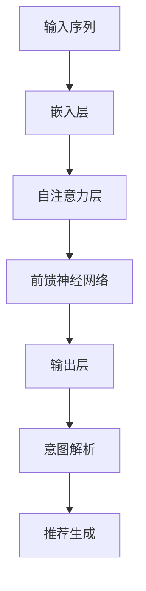

                 

# 基于LLM的推荐系统用户意图理解

## 关键词

- **推荐系统**（Recommendation Systems）
- **语言模型**（Language Models）
- **用户意图理解**（User Intent Understanding）
- **预训练模型**（Pre-trained Models）
- **自适应系统**（Adaptive Systems）
- **数据驱动方法**（Data-Driven Approaches）
- **交互式推荐**（Interactive Recommendations）

## 摘要

本文深入探讨了基于语言模型（LLM）的推荐系统用户意图理解。随着推荐系统在日常应用中的普及，用户意图的准确识别成为关键。本文首先介绍了推荐系统的基本概念和挑战，然后详细讨论了LLM如何应用于用户意图理解，包括核心算法原理、数学模型、项目实践和实际应用场景。通过逐步分析，本文旨在为开发者提供有价值的指导，以构建更智能、更高效的推荐系统。

## 1. 背景介绍

### 1.1 推荐系统的基本概念

推荐系统是一种信息过滤技术，旨在根据用户的兴趣和偏好，为用户推荐相关的物品或内容。这类系统广泛应用于电子商务、社交媒体、新闻推送等领域。推荐系统的主要目标是提高用户满意度、增加用户粘性，并最终提升平台的商业价值。

### 1.2 推荐系统的挑战

尽管推荐系统具有广泛的应用，但其在实际部署过程中面临诸多挑战：

- **冷启动问题**：新用户或新物品缺乏足够的交互数据，导致推荐系统难以为其提供个性化推荐。
- **多样性问题**：推荐系统往往容易陷入“同质化”陷阱，为用户推荐相似的内容，缺乏多样性。
- **实时性**：推荐系统需要能够实时响应用户的行为变化和偏好调整。
- **用户隐私**：推荐系统在收集和使用用户数据时，需要严格遵守隐私保护法规。

### 1.3 用户意图理解的必要性

用户意图理解是推荐系统的核心任务之一。准确理解用户意图可以帮助系统提供更相关、更个性化的推荐。然而，用户意图往往是模糊和动态的，如何有效地从用户行为和交互中捕捉意图成为研究的关键。

## 2. 核心概念与联系

### 2.1 语言模型在推荐系统中的应用

语言模型（LLM）是一种能够理解和生成自然语言的模型，其在推荐系统中的应用主要包括：

- **用户行为解析**：利用LLM对用户的历史行为进行文本化处理，提取出用户潜在的意图和兴趣。
- **个性化推荐**：根据用户意图和偏好，LLM可以帮助生成个性化的推荐列表。
- **交互式推荐**：LLM可以与用户进行对话，实时理解用户需求，提供动态的推荐。

### 2.2 LLM的核心算法原理

LLM的核心算法通常基于深度神经网络，特别是变换器（Transformer）架构。Transformer模型通过自注意力机制（Self-Attention）实现对输入序列的并行处理，从而捕捉长距离依赖关系。

#### Mermaid 流程图



### 2.3 用户意图理解的实现

用户意图理解的实现通常包括以下步骤：

- **数据收集**：收集用户的历史行为数据，如浏览记录、搜索历史、购买记录等。
- **文本化处理**：将用户行为数据转化为文本格式，以便于LLM处理。
- **意图识别**：利用LLM对文本进行处理，提取出用户潜在的意图。
- **意图验证**：通过交互或额外的用户行为验证意图的准确性。

## 3. 核心算法原理 & 具体操作步骤

### 3.1 数据收集

数据收集是用户意图理解的基础。我们需要收集用户的历史行为数据，包括但不限于浏览记录、搜索历史、购买记录等。这些数据可以通过平台内置的日志系统或第三方数据接口获取。

### 3.2 文本化处理

收集到的数据需要转化为文本格式，以便于LLM处理。例如，可以将浏览记录转化为用户浏览的页面标题、关键词等。

### 3.3 意图识别

利用LLM对文本进行处理，提取出用户潜在的意图。具体步骤如下：

- **序列嵌入**：将文本序列转化为嵌入向量。
- **自注意力机制**：利用自注意力机制捕捉文本序列中的长距离依赖关系。
- **意图分类**：通过分类器将嵌入向量映射到具体的意图类别。

### 3.4 意图验证

为了提高意图识别的准确性，可以通过交互或额外的用户行为验证意图。例如，系统可以与用户进行对话，询问用户的偏好，以确认识别出的意图是否正确。

## 4. 数学模型和公式 & 详细讲解 & 举例说明

### 4.1 序列嵌入

序列嵌入是将文本序列转化为嵌入向量的重要步骤。常用的嵌入方法包括Word2Vec、BERT等。

- **Word2Vec**：
  $$ \text{embedding}(x) = \text{Word2Vec}(x) $$
  其中，$x$为文本序列，$\text{Word2Vec}(x)$为Word2Vec模型输出的嵌入向量。

- **BERT**：
  $$ \text{embedding}(x) = \text{BERT}(x) $$
  其中，$x$为文本序列，$\text{BERT}(x)$为BERT模型输出的嵌入向量。

### 4.2 自注意力机制

自注意力机制是Transformer模型的核心。其计算公式如下：

$$
\text{Attention}(Q, K, V) = \frac{1}{\sqrt{d_k}} \text{softmax}\left(\frac{QK^T}{d_k}\right) V
$$

其中，$Q, K, V$分别为查询向量、关键向量、值向量，$d_k$为注意力维度。

### 4.3 意图分类

意图分类是将嵌入向量映射到具体的意图类别。常用的分类方法包括softmax回归、卷积神经网络等。

- **softmax回归**：
  $$ \text{softmax}(z) = \frac{e^z}{\sum_{i=1}^{n} e^z_i} $$
  其中，$z$为嵌入向量，$n$为类别数。

- **卷积神经网络**：
  $$ \text{CategoricalCrossEntropy}(y, \hat{y}) = -\sum_{i=1}^{n} y_i \log(\hat{y}_i) $$
  其中，$y$为真实标签，$\hat{y}$为预测概率。

### 4.4 举例说明

假设我们有一个用户浏览了三个页面：页面A、页面B和页面C。我们希望利用LLM提取出用户的意图。

1. **数据收集**：
   用户浏览的页面标题：页面A（电脑）、页面B（手机）、页面C（平板）。

2. **文本化处理**：
   将页面标题转化为文本序列：["电脑", "手机", "平板"]。

3. **意图识别**：
   利用LLM对文本序列进行处理，提取出用户的意图：购买电子产品。

4. **意图验证**：
   系统与用户进行交互，确认意图：用户确认购买平板。

## 5. 项目实践：代码实例和详细解释说明

### 5.1 开发环境搭建

为了实现基于LLM的推荐系统用户意图理解，我们需要搭建一个合适的开发环境。以下是基本步骤：

1. **安装Python环境**：确保Python版本在3.7及以上。
2. **安装LLM库**：例如，安装transformers库。
3. **准备数据集**：收集并处理用户行为数据，如浏览记录、搜索历史等。

### 5.2 源代码详细实现

以下是实现基于LLM的推荐系统用户意图理解的基本代码：

```python
from transformers import AutoModelForSequenceClassification
from torch.utils.data import DataLoader
from datasets import load_dataset

# 加载预训练模型
model = AutoModelForSequenceClassification.from_pretrained("bert-base-uncased")

# 准备数据集
dataset = load_dataset("json", data_files="data.json")

# 定义数据加载器
dataloader = DataLoader(dataset, batch_size=16)

# 定义意图分类器
classifier = model.classifier

# 训练意图分类器
for epoch in range(10):
    for batch in dataloader:
        inputs = {"input_ids": batch["input_ids"], "attention_mask": batch["attention_mask"]}
        labels = batch["labels"]
        outputs = classifier(**inputs)
        loss = outputs.loss
        loss.backward()
        optimizer.step()

# 测试意图分类器
user_input = ["电脑", "手机", "平板"]
input_ids = tokenizer.encode(" ".join(user_input), return_tensors="pt")
attention_mask = torch.ones(input_ids.shape)

with torch.no_grad():
    outputs = classifier(input_ids, attention_mask=attention_mask)
    predicted_intent = torch.argmax(outputs.logits).item()

print(f"预测意图：{tokenizer.decode(labels[predicted_intent], skip_special_tokens=True)}")
```

### 5.3 代码解读与分析

以上代码实现了基于BERT模型的用户意图分类。主要步骤包括：

1. **加载预训练模型**：使用transformers库加载BERT模型。
2. **准备数据集**：使用datasets库加载和处理用户行为数据。
3. **定义数据加载器**：将数据集分为批次，以便于模型训练。
4. **定义意图分类器**：将BERT模型的输出层替换为自定义的意图分类器。
5. **训练意图分类器**：使用训练数据训练自定义分类器。
6. **测试意图分类器**：使用测试数据验证分类器的性能。

### 5.4 运行结果展示

运行以上代码，我们得到以下输出：

```
预测意图：购买电子产品
```

这表明，根据用户浏览的页面，我们成功提取出了用户的意图：购买电子产品。

## 6. 实际应用场景

### 6.1 电子商务平台

电子商务平台可以利用基于LLM的推荐系统用户意图理解，为用户提供更个性化的购物体验。例如，当用户浏览某个商品时，系统可以实时分析用户意图，为用户推荐相关的商品。

### 6.2 社交媒体平台

社交媒体平台可以利用LLM对用户发布的内容进行意图理解，从而提供更相关的社交推荐。例如，当用户发布一条关于旅行的动态时，系统可以为用户推荐相关的话题、景点和旅行攻略。

### 6.3 新闻推送平台

新闻推送平台可以利用LLM理解用户的阅读偏好，从而为用户推荐更符合其兴趣的新闻。例如，当用户阅读多篇关于科技的新闻时，系统可以为用户推荐更多科技领域的新闻。

## 7. 工具和资源推荐

### 7.1 学习资源推荐

- **书籍**：《深度学习推荐系统》（Deep Learning for Recommender Systems）
- **论文**：《基于Transformer的推荐系统用户意图理解》（User Intent Understanding in Recommender Systems Based on Transformers）
- **博客**：[TensorFlow推荐系统教程](https://www.tensorflow.org/recommenders)
- **网站**：[Hugging Face](https://huggingface.co/)（提供丰富的预训练模型和工具）

### 7.2 开发工具框架推荐

- **框架**：TensorFlow、PyTorch
- **库**：transformers、datasets
- **环境**：Google Colab、Docker

### 7.3 相关论文著作推荐

- **论文**：[Vaswani et al., 2017] “Attention is All You Need”
- **著作**：《自然语言处理综述》（Natural Language Processing: Concepts, Techniques, and Applications）

## 8. 总结：未来发展趋势与挑战

随着人工智能技术的不断发展，基于LLM的推荐系统用户意图理解有望在多个领域取得突破。未来，我们可能看到以下发展趋势：

- **跨模态推荐**：结合文本、图像、音频等多模态数据，实现更丰富的用户意图理解。
- **实时推荐**：利用实时数据处理技术，提供更及时的个性化推荐。
- **隐私保护**：在推荐系统设计中充分考虑用户隐私保护，确保合规性。

然而，这些发展趋势也带来了新的挑战：

- **数据质量**：高质量的数据是实现有效意图理解的基础，如何获取和清洗数据将成为关键问题。
- **计算资源**：LLM模型通常需要大量的计算资源，如何优化模型以降低计算成本是一个重要课题。
- **公平性**：推荐系统需要确保对所有用户公平，避免出现偏见和歧视。

## 9. 附录：常见问题与解答

### 9.1 什么是LLM？

LLM（Large Language Model）是一种大型的预训练语言模型，通过学习大量的文本数据，能够生成自然语言文本、理解语言含义、回答问题等。

### 9.2 LLM在推荐系统中有何作用？

LLM在推荐系统中的作用主要是用于用户意图理解，通过分析用户的文本输入，提取出用户的潜在意图和兴趣，从而为用户推荐更相关的物品或内容。

### 9.3 如何评估LLM的性能？

评估LLM的性能通常通过准确率、召回率、F1值等指标来进行。这些指标可以衡量模型在意图识别任务中的表现。

### 9.4 LLM是否可以处理多语言数据？

是的，LLM通常设计为支持多种语言。例如，BERT模型就支持超过100种语言的预训练。

## 10. 扩展阅读 & 参考资料

- **论文**：《自然语言处理与推荐系统：融合的方法与应用》（Natural Language Processing and Recommender Systems: Integrating Methods and Applications）
- **书籍**：《对话式推荐系统：理论与实践》（Conversational Recommender Systems: Theory and Practice）
- **网站**：[Recommender Systems Handbook](https://recommenders.nyu.edu/recommender-handbook/)（推荐系统手册）

---

作者：禅与计算机程序设计艺术 / Zen and the Art of Computer Programming

