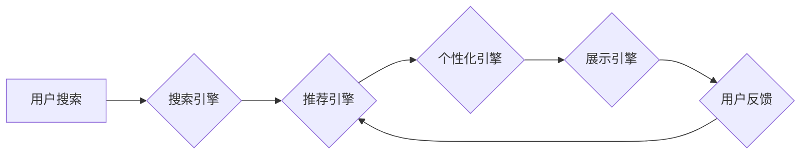

                 

## 大数据驱动的电商搜索推荐系统：AI 模型融合是核心，用户体验是重点

> 关键词：电商搜索推荐系统、大数据、AI模型融合、用户体验、推荐算法、协同过滤、内容过滤、深度学习、自然语言处理

## 1. 背景介绍

在当今数字经济时代，电商平台已成为人们购物的首选方式。然而，面对海量商品和用户需求，如何精准推荐用户感兴趣的产品，提升用户购物体验，成为电商平台发展面临的重大挑战。大数据技术的兴起为电商搜索推荐系统提供了强大的数据支撑，而人工智能（AI）技术的应用则赋予了推荐系统更强大的智能化能力。

传统的电商搜索推荐系统主要依赖于基于规则的推荐算法，例如商品分类、关键词匹配等。随着用户行为数据的积累和AI技术的进步，基于数据驱动的推荐算法逐渐成为主流。这些算法能够从海量用户行为数据中挖掘用户兴趣和偏好，并根据用户画像和商品特征进行精准推荐。

## 2. 核心概念与联系

### 2.1  电商搜索推荐系统

电商搜索推荐系统是帮助用户快速找到所需商品的智能化系统，它通常由以下几个核心模块组成：

* **搜索引擎:** 处理用户搜索关键词，并返回相关商品列表。
* **推荐引擎:** 基于用户行为数据和商品特征，推荐用户可能感兴趣的商品。
* **个性化引擎:** 根据用户画像和偏好，对推荐结果进行个性化定制。
* **展示引擎:** 将推荐结果以用户友好的方式展示给用户。

### 2.2  大数据

大数据是指海量、高速度、高多样性的数据。电商平台每天产生大量的用户行为数据，例如浏览记录、购买记录、评价信息等。这些数据蕴含着丰富的用户兴趣和偏好信息，是构建精准推荐系统的关键数据源。

### 2.3  人工智能（AI）

人工智能是指模拟人类智能行为的计算机系统。在电商搜索推荐系统中，AI技术主要应用于以下几个方面：

* **推荐算法:** 基于机器学习和深度学习算法，从海量数据中挖掘用户兴趣和偏好，进行精准推荐。
* **自然语言处理（NLP）:** 对用户搜索关键词进行理解和分析，提高搜索结果的准确性。
* **计算机视觉:** 对商品图片进行识别和分析，提高商品推荐的精准度。

### 2.4  AI 模型融合

AI 模型融合是指将多种AI模型组合在一起，发挥各自优势，构建更强大的推荐系统。例如，可以将协同过滤算法与内容过滤算法相结合，或者将深度学习模型与规则引擎相结合。

**核心架构流程图**



## 3. 核心算法原理 & 具体操作步骤

### 3.1  算法原理概述

电商搜索推荐系统常用的算法主要包括：

* **协同过滤:** 基于用户对商品的评分或购买行为，推荐与用户兴趣相似的用户购买的商品。
* **内容过滤:** 基于商品的特征和描述，推荐与用户过去购买或浏览的商品相似的商品。
* **深度学习:** 利用深度神经网络从海量数据中学习用户兴趣和商品特征，进行精准推荐。

### 3.2  算法步骤详解

**协同过滤算法步骤:**

1. **数据收集:** 收集用户对商品的评分或购买行为数据。
2. **用户相似度计算:** 计算用户之间的相似度，例如使用余弦相似度或皮尔逊相关系数。
3. **推荐商品:** 对于给定用户，找到与该用户兴趣相似的用户，并推荐这些用户购买的商品。

**内容过滤算法步骤:**

1. **商品特征提取:** 从商品描述、属性等信息中提取商品特征。
2. **用户兴趣建模:** 根据用户过去购买或浏览的商品，构建用户兴趣模型。
3. **推荐商品:** 计算商品特征与用户兴趣模型的相似度，推荐相似度高的商品。

**深度学习算法步骤:**

1. **数据预处理:** 对海量数据进行清洗、转换和特征工程。
2. **模型构建:** 选择合适的深度学习模型，例如多层感知机（MLP）、卷积神经网络（CNN）或循环神经网络（RNN）。
3. **模型训练:** 利用训练数据训练深度学习模型，学习用户兴趣和商品特征。
4. **模型预测:** 利用训练好的模型对新的用户进行预测，推荐可能感兴趣的商品。

### 3.3  算法优缺点

| 算法 | 优点 | 缺点 |
|---|---|---|
| 协同过滤 | 能够发现用户隐性需求 | 数据稀疏性问题，冷启动问题 |
| 内容过滤 | 能够解释推荐结果 | 容易陷入局部最优，缺乏个性化 |
| 深度学习 | 能够学习复杂的用户兴趣和商品特征 | 需要大量数据训练，模型解释性差 |

### 3.4  算法应用领域

* **电商推荐:** 推荐商品、优惠券、广告等。
* **社交推荐:** 推荐好友、群组、内容等。
* **音乐推荐:** 推荐歌曲、专辑、艺术家等。
* **电影推荐:** 推荐电影、电视剧、演员等。

## 4. 数学模型和公式 & 详细讲解 & 举例说明

### 4.1  数学模型构建

协同过滤算法的核心是计算用户之间的相似度。常用的相似度度量方法包括余弦相似度和皮尔逊相关系数。

**余弦相似度:**

$$
\text{相似度} = \frac{\mathbf{u} \cdot \mathbf{v}}{\|\mathbf{u}\| \|\mathbf{v}\|}
$$

其中，$\mathbf{u}$ 和 $\mathbf{v}$ 是两个用户的向量表示，$\cdot$ 表示点积，$\|\mathbf{u}\|$ 和 $\|\mathbf{v}\|$ 表示向量的模长。

**皮尔逊相关系数:**

$$
\text{相似度} = \frac{\sum_{i=1}^{n}(u_i - \bar{u})(v_i - \bar{v})}{\sqrt{\sum_{i=1}^{n}(u_i - \bar{u})^2} \sqrt{\sum_{i=1}^{n}(v_i - \bar{v})^2}}
$$

其中，$u_i$ 和 $v_i$ 是两个用户对商品 $i$ 的评分，$\bar{u}$ 和 $\bar{v}$ 是两个用户的平均评分。

### 4.2  公式推导过程

余弦相似度的推导过程如下：

1. 两个向量的点积表示两个向量在同一方向上的投影长度。
2. 向量的模长表示向量的长度。
3. 将点积除以两个向量的模长乘积，得到两个向量夹角的余弦值。
4. 余弦值表示两个向量的相似度，值越大，相似度越高。

皮尔逊相关系数的推导过程类似于协方差的计算，它衡量了两个变量之间的线性相关性。

### 4.3  案例分析与讲解

假设有两个用户 A 和 B，他们对三部电影的评分如下：

| 电影 | 用户 A | 用户 B |
|---|---|---|
| 电影 1 | 5 | 4 |
| 电影 2 | 3 | 2 |
| 电影 3 | 4 | 5 |

我们可以使用余弦相似度计算用户 A 和 B 的相似度：

1. 将用户 A 和 B 的评分向量表示为：

$$
\mathbf{u} = [5, 3, 4], \quad \mathbf{v} = [4, 2, 5]
$$

2. 计算两个向量的点积：

$$
\mathbf{u} \cdot \mathbf{v} = (5 \times 4) + (3 \times 2) + (4 \times 5) = 20 + 6 + 20 = 46
$$

3. 计算两个向量的模长：

$$
\|\mathbf{u}\| = \sqrt{5^2 + 3^2 + 4^2} = \sqrt{50}, \quad \|\mathbf{v}\| = \sqrt{4^2 + 2^2 + 5^2} = \sqrt{45}
$$

4. 计算余弦相似度：

$$
\text{相似度} = \frac{46}{\sqrt{50} \sqrt{45}} \approx 0.83
$$

因此，用户 A 和 B 的余弦相似度约为 0.83，说明他们兴趣相近。

## 5. 项目实践：代码实例和详细解释说明

### 5.1  开发环境搭建

* **操作系统:** Linux 或 macOS
* **编程语言:** Python
* **库依赖:** pandas, numpy, scikit-learn, tensorflow 等

### 5.2  源代码详细实现

```python
import pandas as pd
from sklearn.metrics.pairwise import cosine_similarity

# 加载用户评分数据
ratings_data = pd.read_csv('ratings.csv')

# 计算用户之间的余弦相似度
user_similarity = cosine_similarity(ratings_data)

# 获取用户 A 和用户 B 的相似度
user_A_id = 1
user_B_id = 2
similarity = user_similarity[user_A_id - 1, user_B_id - 1]

# 打印相似度
print(f'用户 {user_A_id} 和用户 {user_B_id} 的相似度为: {similarity}')
```

### 5.3  代码解读与分析

* **数据加载:** 使用 pandas 库加载用户评分数据。
* **相似度计算:** 使用 scikit-learn 库的 `cosine_similarity` 函数计算用户之间的余弦相似度。
* **相似度获取:** 根据用户 ID 获取用户之间的相似度值。
* **输出结果:** 打印用户 A 和用户 B 的相似度值。

### 5.4  运行结果展示

运行上述代码后，会输出用户 A 和用户 B 的余弦相似度值。

## 6. 实际应用场景

### 6.1  电商平台推荐

电商平台可以利用协同过滤算法推荐用户可能感兴趣的商品，例如亚马逊、淘宝等。

### 6.2  社交媒体推荐

社交媒体平台可以利用内容过滤算法推荐用户可能感兴趣的内容，例如 Facebook、Twitter 等。

### 6.3  音乐流媒体推荐

音乐流媒体平台可以利用深度学习算法推荐用户可能喜欢的歌曲，例如 Spotify、Apple Music 等。

### 6.4  未来应用展望

随着大数据和人工智能技术的不断发展，电商搜索推荐系统将更加智能化、个性化和精准化。未来，推荐系统可能能够：

* 更深入地理解用户的需求和偏好。
* 提供更个性化的推荐结果。
* 跨平台、跨场景地进行推荐。
* 利用增强现实（AR）和虚拟现实（VR）技术提供更沉浸式的推荐体验。

## 7. 工具和资源推荐

### 7.1  学习资源推荐

* **书籍:**
    * 《推荐系统实践》
    * 《深度学习》
* **在线课程:**
    * Coursera 上的推荐系统课程
    * edX 上的机器学习课程

### 7.2  开发工具推荐

* **Python:** 广泛用于机器学习和数据分析。
* **scikit-learn:** Python 的机器学习库。
* **TensorFlow:** Google 开发的深度学习框架。
* **PyTorch:** Facebook 开发的深度学习框架。

### 7.3  相关论文推荐

* **协同过滤:**
    * "Collaborative Filtering: A User-Based Approach"
    * "Memory-Based Collaborative Filtering"
* **内容过滤:**
    * "Content-Based Recommendation Systems"
    * "Filtering and Recommending News Articles"
* **深度学习:**
    * "Deep Learning for Recommender Systems"
    * "Neural Collaborative Filtering"

## 8. 总结：未来发展趋势与挑战

### 8.1  研究成果总结

近年来，大数据驱动的电商搜索推荐系统取得了显著进展，AI 模型融合技术为推荐系统带来了更强大的智能化能力。

### 8.2  未来发展趋势

* **更精准的推荐:** 利用更先进的机器学习和深度学习算法，更深入地理解用户的需求和偏好，提供更精准的推荐结果。
* **更个性化的推荐:** 基于用户的行为数据、兴趣爱好、生活方式等多方面信息，提供更个性化的推荐体验。
* **跨平台、跨场景的推荐:** 将推荐系统扩展到多个平台和场景，例如移动端、桌面端、智能家居等。
* **解释性更强的推荐:** 提高推荐系统的透明度和可解释性，让用户能够理解推荐结果背后的逻辑。

### 8.3  面临的挑战

* **数据质量:** 推荐系统的准确性依赖于高质量的数据，数据清洗、预处理和特征工程是关键挑战。
* **模型复杂度:** 深度学习模型的训练和部署需要强大的计算资源和技术能力。
* **用户隐私:** 如何保护用户的隐私信息是推荐系统面临的重要伦理挑战。

### 8.4  研究展望

未来，电商搜索推荐系统将继续朝着更智能化、个性化、精准化和可解释化的方向发展。研究者将继续探索新的算法、模型和技术，以解决上述挑战，为用户提供更优质的购物体验。

## 9. 附录：常见问题与解答

**Q1: 协同过滤算法和内容过滤算法有什么区别？**

**A1:** 协同过滤算法基于用户的行为数据，推荐与用户兴趣相似的用户的商品；内容过滤算法基于商品的特征和描述，推荐与用户过去购买或浏览的商品相似的商品。

**Q2: 深度学习算法在推荐系统中的优势是什么？**

**A2:** 深度学习算法能够学习用户兴趣和商品特征的复杂关系，从而提供更精准的推荐结果。

**Q3: 如何解决推荐系统中的数据稀疏性问题？**

**A3:** 可以使用矩阵分解、协同过滤算法的改进版本或结合其他数据源来解决数据稀疏性问题。


作者：禅与计算机程序设计艺术 / Zen and the Art of Computer Programming<end_of_turn>

