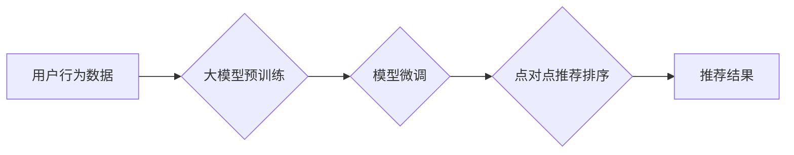

                 

## 大模型在point-wise推荐排序中的表现

> 关键词：大模型、推荐排序、point-wise、Transformer、Fine-tuning、评估指标

## 1. 背景介绍

推荐系统是互联网时代的重要组成部分，旨在为用户提供个性化的内容和服务。推荐排序作为推荐系统的核心技术，旨在根据用户的历史行为、偏好等信息，对候选物品进行排序，并推荐给用户。传统的推荐排序算法主要依赖于特征工程和手工设计的规则，但随着数据量的爆炸式增长和用户行为的复杂化，这些方法逐渐难以满足需求。

近年来，大模型技术取得了显著进展，其强大的学习能力和泛化能力为推荐排序带来了新的机遇。大模型，通常指参数规模超过数十亿甚至千亿的深度学习模型，能够从海量数据中学习到更丰富的用户和物品表示，从而提升推荐排序的准确性和个性化程度。

## 2. 核心概念与联系

**2.1 点对点推荐排序 (Point-wise)**

点对点推荐排序是一种将推荐问题转化为二分类或多分类问题的排序方式。它将每个用户-物品对视为一个独立的样本，预测用户是否会点击、购买或评分该物品。

**2.2 Transformer模型**

Transformer模型是一种基于注意力机制的深度学习模型，在自然语言处理领域取得了突破性的进展。其强大的序列建模能力和并行计算能力使其也适用于推荐排序任务。

**2.3 流程图**



## 3. 核心算法原理 & 具体操作步骤

**3.1 算法原理概述**

大模型在点对点推荐排序中的应用主要包括以下步骤：

1. **预训练:** 使用大模型在海量文本或多模态数据上进行预训练，学习到丰富的语义表示和知识。
2. **微调:** 将预训练好的大模型用于特定推荐任务，通过在推荐数据上进行微调，进一步提升模型的性能。
3. **预测:** 将用户和物品的特征输入到微调后的模型中，预测用户对物品的点击、购买或评分概率。

**3.2 算法步骤详解**

1. **数据预处理:** 收集用户行为数据，包括用户ID、物品ID、点击、购买、评分等信息。对数据进行清洗、转换和特征工程，例如将用户行为转化为one-hot编码或词向量表示。
2. **模型选择:** 选择合适的预训练大模型，例如BERT、RoBERTa、GPT等。
3. **模型微调:** 将预训练模型的最后一层替换为新的输出层，并使用推荐数据进行微调。微调过程中，可以使用交叉熵损失函数或其他合适的损失函数，优化模型参数。
4. **模型评估:** 使用测试数据评估模型的性能，常用的指标包括AUC、NDCG、MRR等。
5. **模型部署:** 将训练好的模型部署到线上环境，用于实时推荐排序。

**3.3 算法优缺点**

**优点:**

* 强大的学习能力：大模型能够从海量数据中学习到更丰富的用户和物品表示，提升推荐排序的准确性和个性化程度。
* 泛化能力强：预训练好的大模型具有较强的泛化能力，可以应用于不同的推荐任务和领域。
* 减少特征工程：大模型可以自动学习特征，减少人工特征工程的成本和时间。

**缺点:**

* 计算资源消耗大：大模型的训练和部署需要大量的计算资源，成本较高。
* 训练时间长：大模型的训练时间较长，需要大量的计算时间和数据。
* 数据依赖性强：大模型的性能依赖于训练数据的质量和数量。

**3.4 算法应用领域**

大模型在点对点推荐排序领域具有广泛的应用前景，例如：

* **电商推荐:** 推荐商品、优惠券、促销活动等。
* **内容推荐:** 推荐新闻、视频、音乐、书籍等。
* **社交推荐:** 推荐好友、群组、话题等。
* **广告推荐:** 推荐广告位、广告内容等。

## 4. 数学模型和公式 & 详细讲解 & 举例说明

**4.1 数学模型构建**

在点对点推荐排序中，可以使用二分类或多分类模型来预测用户对物品的点击或评分概率。

**二分类模型:**

假设用户 $u$ 对物品 $i$ 的点击概率为 $p(u, i)$，可以使用sigmoid函数将模型输出映射到 [0, 1] 的概率区间：

$$
p(u, i) = \sigma(w^T \cdot h(u, i))
$$

其中，$w$ 是模型参数，$h(u, i)$ 是用户 $u$ 和物品 $i$ 的特征向量。

**多分类模型:**

可以使用softmax函数将模型输出映射到多个类别概率的分布：

$$
p(u, i_j) = \frac{exp(w_j^T \cdot h(u, i_j))}{\sum_{k=1}^{K} exp(w_k^T \cdot h(u, i_k))}
$$

其中，$K$ 是物品类别的数量，$w_j$ 是第 $j$ 个类别的模型参数。

**4.2 公式推导过程**

二分类模型的损失函数通常使用交叉熵损失函数：

$$
L = - \sum_{u, i} y_{u, i} \cdot log(p(u, i)) + (1 - y_{u, i}) \cdot log(1 - p(u, i))
$$

其中，$y_{u, i}$ 是用户 $u$ 对物品 $i$ 的真实标签，1 表示点击，0 表示未点击。

多分类模型的损失函数可以使用交叉熵损失函数的变体：

$$
L = - \sum_{u, i_j} y_{u, i_j} \cdot log(p(u, i_j))
$$

其中，$y_{u, i_j}$ 是用户 $u$ 对物品 $i_j$ 的真实标签，1 表示属于该类别，0 表示不属于该类别。

**4.3 案例分析与讲解**

假设我们有一个电商平台，需要推荐商品给用户。我们可以使用大模型进行点对点推荐排序，例如使用BERT模型对用户历史购买记录和商品描述进行编码，然后使用sigmoid函数预测用户是否会点击该商品。

## 5. 项目实践：代码实例和详细解释说明

**5.1 开发环境搭建**

* Python 3.7+
* PyTorch 1.7+
* Transformers 4.0+

**5.2 源代码详细实现**

```python
import torch
from transformers import BertModel, BertTokenizer

# 加载预训练模型和词典
model_name = "bert-base-uncased"
tokenizer = BertTokenizer.from_pretrained(model_name)
model = BertModel.from_pretrained(model_name)

# 定义输入数据
user_input = "我想要买一部手机"
item_input = "华为P50 Pro"

# 对输入数据进行编码
user_tokens = tokenizer.encode(user_input, add_special_tokens=True)
item_tokens = tokenizer.encode(item_input, add_special_tokens=True)

# 将编码后的数据输入模型
user_embedding = model(torch.tensor([user_tokens]))[0][0]
item_embedding = model(torch.tensor([item_tokens]))[0][0]

# 计算用户和物品的相似度
similarity = torch.cosine_similarity(user_embedding, item_embedding)

# 打印相似度
print(similarity)
```

**5.3 代码解读与分析**

* 首先，我们加载预训练的BERT模型和词典。
* 然后，我们对用户输入和物品输入进行编码，得到对应的词向量表示。
* 将编码后的数据输入BERT模型，得到用户和物品的上下文表示。
* 计算用户和物品上下文表示之间的余弦相似度，作为推荐排序的依据。

**5.4 运行结果展示**

运行上述代码，会输出用户和物品之间的相似度值。相似度值越高，表示用户对该物品的兴趣越大，推荐排序的优先级越高。

## 6. 实际应用场景

大模型在点对点推荐排序领域具有广泛的应用场景，例如：

* **电商推荐:** 推荐商品、优惠券、促销活动等。
* **内容推荐:** 推荐新闻、视频、音乐、书籍等。
* **社交推荐:** 推荐好友、群组、话题等。
* **广告推荐:** 推荐广告位、广告内容等。

**6.4 未来应用展望**

随着大模型技术的不断发展，其在点对点推荐排序领域的应用将更加广泛和深入。例如：

* **多模态推荐:** 将文本、图像、音频等多模态数据融合到推荐排序模型中，提升推荐的准确性和个性化程度。
* **个性化推荐:** 利用大模型学习用户的细粒度兴趣和偏好，提供更加个性化的推荐结果。
* **实时推荐:** 利用大模型的快速推理能力，实现实时推荐排序，满足用户对即时信息的获取需求。

## 7. 工具和资源推荐

**7.1 学习资源推荐**

* **论文:**
    * BERT: Pre-training of Deep Bidirectional Transformers for Language Understanding
    * RoBERTa: A Robustly Optimized BERT Pretraining Approach
    * Transformer: Attention Is All You Need
* **博客:**
    * Jay Alammar's Blog: https://jalammar.github.io/
    * Hugging Face Blog: https://huggingface.co/blog

**7.2 开发工具推荐**

* **PyTorch:** https://pytorch.org/
* **Transformers:** https://huggingface.co/docs/transformers/index

**7.3 相关论文推荐**

* **Deep Learning for Recommender Systems**
* **Neural Collaborative Filtering**
* **Factorization Machines**

## 8. 总结：未来发展趋势与挑战

**8.1 研究成果总结**

大模型在点对点推荐排序领域取得了显著进展，其强大的学习能力和泛化能力提升了推荐排序的准确性和个性化程度。

**8.2 未来发展趋势**

未来，大模型在点对点推荐排序领域的发展趋势包括：

* **多模态推荐:** 将文本、图像、音频等多模态数据融合到推荐排序模型中。
* **个性化推荐:** 利用大模型学习用户的细粒度兴趣和偏好，提供更加个性化的推荐结果。
* **实时推荐:** 利用大模型的快速推理能力，实现实时推荐排序。

**8.3 面临的挑战**

大模型在点对点推荐排序领域也面临一些挑战：

* **计算资源消耗大:** 大模型的训练和部署需要大量的计算资源，成本较高。
* **数据依赖性强:** 大模型的性能依赖于训练数据的质量和数量。
* **模型解释性差:** 大模型的决策过程较为复杂，难以解释其推荐结果背后的逻辑。

**8.4 研究展望**

未来研究方向包括：

* **高效训练大模型:** 研究更有效的训练方法，降低大模型的训练成本。
* **数据增强:** 开发新的数据增强技术，提升训练数据的质量和数量。
* **模型解释性:** 研究大模型的决策机制，提高模型的解释性。

## 9. 附录：常见问题与解答

**Q1: 大模型的训练需要多少数据？**

A1: 大模型的训练数据量通常在数十亿甚至千亿级别。

**Q2: 如何评估大模型的推荐排序性能？**

A2: 常用的评估指标包括AUC、NDCG、MRR等。

**Q3: 如何部署大模型进行实时推荐排序？**

A3: 可以使用云平台提供的服务，例如AWS SageMaker、Google Cloud AI Platform等，进行大模型的部署和推理。


作者：禅与计算机程序设计艺术 / Zen and the Art of Computer Programming 
<end_of_turn>

