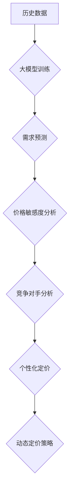

                 

## 大模型在动态定价中的应用

> 关键词：大模型、动态定价、机器学习、预测模型、价格优化、需求预测、市场分析、算法

## 1. 背景介绍

在当今数据爆炸的时代，企业面临着越来越复杂的市场环境和竞争压力。传统的定价策略往往难以适应瞬息万变的市场需求，导致定价决策缺乏灵活性，难以实现利润最大化。动态定价，即根据实时市场信息和用户行为进行价格调整，逐渐成为企业优化定价策略的重要手段。

大模型作为一种强大的机器学习模型，凭借其强大的数据处理能力和学习能力，在动态定价领域展现出巨大的潜力。大模型可以从海量历史数据中学习到复杂的市场规律和用户偏好，并根据实时数据进行预测和分析，为企业提供更精准、更有效的定价建议。

## 2. 核心概念与联系

### 2.1 动态定价的概念

动态定价是指根据实时市场信息和用户行为，对商品或服务的定价进行灵活调整的策略。其核心目标是根据市场供需关系、竞争对手价格、用户需求等因素，动态调整价格以实现利润最大化。

### 2.2 大模型的概念

大模型是指参数规模庞大、训练数据量巨大的深度学习模型。其强大的学习能力使其能够处理复杂的任务，例如自然语言处理、图像识别、语音合成等。

### 2.3 动态定价与大模型的联系

大模型可以为动态定价提供以下关键支持：

* **需求预测:** 大模型可以分析历史销售数据、市场趋势、用户行为等信息，预测未来商品或服务的市场需求。
* **价格敏感度分析:** 大模型可以分析用户对价格变化的反应，评估不同价格点下的购买意愿，从而确定最佳价格区间。
* **竞争对手分析:** 大模型可以收集和分析竞争对手的定价策略，帮助企业制定更具竞争力的价格策略。
* **个性化定价:** 大模型可以根据用户的个人特征、购买历史、行为偏好等信息，提供个性化的价格建议。

**Mermaid 流程图**



## 3. 核心算法原理 & 具体操作步骤

### 3.1 算法原理概述

大模型在动态定价中的应用主要基于以下核心算法：

* **回归算法:** 用于预测商品或服务的未来价格，例如线性回归、逻辑回归、支持向量机等。
* **分类算法:** 用于分类用户群体，并根据不同群体的特征制定不同的价格策略，例如决策树、随机森林、神经网络等。
* **强化学习算法:** 用于优化价格策略，通过不断调整价格并观察其对销售额的影响，学习到最优的定价策略。

### 3.2 算法步骤详解

1. **数据收集:** 收集历史销售数据、市场趋势数据、用户行为数据等相关信息。
2. **数据预处理:** 对收集到的数据进行清洗、转换、特征工程等处理，使其适合模型训练。
3. **模型选择:** 根据具体应用场景选择合适的算法模型，例如回归算法、分类算法或强化学习算法。
4. **模型训练:** 使用训练数据训练模型，并评估模型的性能。
5. **模型部署:** 将训练好的模型部署到生产环境中，用于实时预测和分析。
6. **价格调整:** 根据模型预测结果和实时市场信息，动态调整商品或服务的定价。

### 3.3 算法优缺点

**回归算法:**

* **优点:** 算法简单易懂，易于实现，训练速度快。
* **缺点:** 对非线性关系的拟合能力较弱，难以捕捉复杂市场规律。

**分类算法:**

* **优点:** 可以对用户进行细分，制定个性化的价格策略。
* **缺点:** 需要大量的分类标签数据，训练难度较高。

**强化学习算法:**

* **优点:** 可以学习到最优的定价策略，适应不断变化的市场环境。
* **缺点:** 训练时间长，需要大量的试错数据，算法复杂度高。

### 3.4 算法应用领域

大模型在动态定价领域具有广泛的应用场景，例如：

* **电商平台:** 根据用户行为、商品属性、市场趋势等信息，动态调整商品价格，提高转化率和利润。
* **旅游行业:** 根据航班时刻、酒店入住率、旅游需求等信息，动态调整机票和酒店价格，优化资源配置。
* **金融行业:** 根据市场波动、用户风险偏好等信息，动态调整贷款利率和投资收益率，降低风险并提高收益。

## 4. 数学模型和公式 & 详细讲解 & 举例说明

### 4.1 数学模型构建

**需求预测模型:**

假设商品的销量与价格呈负相关关系，可以使用线性回归模型进行预测：

$$
Q = a - bP
$$

其中：

* $Q$：商品销量
* $P$：商品价格
* $a$：销量在价格为0时的值
* $b$：价格对销量的影响系数

**价格敏感度模型:**

可以使用弹性系数来衡量用户对价格变化的反应：

$$
\text{弹性系数} = \frac{\% \Delta Q}{\% \Delta P}
$$

其中：

* $\% \Delta Q$：销量变化百分比
* $\% \Delta P$：价格变化百分比

### 4.2 公式推导过程

**需求预测模型的推导:**

根据经济学原理，假设商品的销量与价格呈线性关系，可以建立以下方程：

$$
Q = f(P)
$$

其中 $f(P)$ 表示价格对销量的影响函数。

通过对历史数据进行线性回归分析，可以得到以下线性函数：

$$
Q = a - bP
$$

其中 $a$ 和 $b$ 是回归系数，可以通过最小二乘法求解。

**价格敏感度模型的推导:**

弹性系数是衡量价格变化对销量变化的影响程度的指标。

$$
\text{弹性系数} = \frac{\% \Delta Q}{\% \Delta P} = \frac{\frac{Q_2 - Q_1}{Q_1}}{\frac{P_2 - P_1}{P_1}}
$$

其中：

* $Q_1$ 和 $Q_2$ 分别是价格为 $P_1$ 和 $P_2$ 时对应的销量
* $P_1$ 和 $P_2$ 分别是两个价格点

### 4.3 案例分析与讲解

假设一家电商平台销售一款手机，其历史销售数据如下：

| 价格 (元) | 销量 (台) |
|---|---|
| 3000 | 100 |
| 2800 | 120 |
| 2600 | 150 |
| 2400 | 180 |

可以使用线性回归模型对该手机的销量进行预测。

通过最小二乘法求解，得到以下线性回归模型：

$$
Q = 250 - 0.1P
$$

其中 $Q$ 表示销量， $P$ 表示价格。

根据该模型，当价格为 2500 元时，预测销量为 200 台。

## 5. 项目实践：代码实例和详细解释说明

### 5.1 开发环境搭建

* Python 3.7+
* TensorFlow 2.0+
* Pandas
* NumPy
* Matplotlib

### 5.2 源代码详细实现

```python
import pandas as pd
from sklearn.linear_model import LinearRegression

# 加载历史数据
data = pd.read_csv('sales_data.csv')

# 准备数据
X = data[['price']]
y = data['sales']

# 创建线性回归模型
model = LinearRegression()

# 训练模型
model.fit(X, y)

# 预测销量
price = 2500
predicted_sales = model.predict([[price]])

# 打印预测结果
print(f'当价格为 {price} 元时，预测销量为 {predicted_sales[0]} 台')
```

### 5.3 代码解读与分析

* 首先，加载历史销售数据并准备数据，将价格作为特征变量，销量作为目标变量。
* 然后，创建线性回归模型并训练模型。
* 最后，使用训练好的模型预测当价格为 2500 元时的销量。

### 5.4 运行结果展示

运行上述代码后，将输出预测销量结果。

## 6. 实际应用场景

### 6.1 电商平台

电商平台可以利用大模型进行动态定价，根据用户行为、商品属性、市场趋势等信息，实时调整商品价格，提高转化率和利润。例如，可以根据用户的浏览历史、购买记录、购物车内容等信息，为用户提供个性化的价格优惠。

### 6.2 旅游行业

旅游行业可以利用大模型预测未来酒店入住率和机票需求，根据市场供需关系动态调整价格。例如，在旅游旺季，可以提高酒店价格和机票价格；而在淡季，可以降低价格以吸引更多用户。

### 6.3 金融行业

金融行业可以利用大模型分析市场波动、用户风险偏好等信息，动态调整贷款利率和投资收益率。例如，可以根据用户的信用评分、收入水平等信息，为用户提供不同的贷款利率；也可以根据市场风险偏好，调整投资组合的资产配置。

### 6.4 未来应用展望

随着大模型技术的不断发展，其在动态定价领域的应用将更加广泛和深入。例如，可以利用更复杂的算法模型，预测更精细的用户需求和市场趋势；可以利用更强大的计算能力，处理更大的数据量和更复杂的计算任务；可以利用更先进的机器学习技术，开发更智能、更灵活的动态定价策略。

## 7. 工具和资源推荐

### 7.1 学习资源推荐

* **书籍:**
    * 《深度学习》 by Ian Goodfellow, Yoshua Bengio, and Aaron Courville
    * 《机器学习》 by Tom Mitchell
* **在线课程:**
    * Coursera: Machine Learning by Andrew Ng
    * Udacity: Deep Learning Nanodegree
* **博客和网站:**
    * Towards Data Science
    * Machine Learning Mastery

### 7.2 开发工具推荐

* **Python:** 
    * TensorFlow
    * PyTorch
    * Keras
* **数据处理工具:**
    * Pandas
    * NumPy
* **可视化工具:**
    * Matplotlib
    * Seaborn

### 7.3 相关论文推荐

* **《Attention Is All You Need》:** https://arxiv.org/abs/1706.03762
* **《BERT: Pre-training of Deep Bidirectional Transformers for Language Understanding》:** https://arxiv.org/abs/1810.04805
* **《GPT-3: Language Models are Few-Shot Learners》:** https://arxiv.org/abs/2005.14165

## 8. 总结：未来发展趋势与挑战

### 8.1 研究成果总结

大模型在动态定价领域取得了显著的成果，能够有效预测市场需求、分析用户行为、优化定价策略。

### 8.2 未来发展趋势

* **模型规模和复杂度提升:** 未来大模型的规模和复杂度将进一步提升，能够处理更复杂的数据和更复杂的计算任务。
* **多模态数据融合:** 大模型将能够融合文本、图像、音频等多模态数据，提供更全面的市场信息和用户洞察。
* **个性化定价策略:** 大模型将能够根据用户的个人特征、购买历史、行为偏好等信息，制定更个性化的定价策略。
* **实时动态调整:** 大模型将能够实时监控市场变化和用户行为，并根据实时信息动态调整价格，实现更精准的定价策略。

### 8.3 面临的挑战

* **数据质量和可用性:** 大模型的训练需要海量高质量的数据，而获取和清洗高质量数据仍然是一个挑战。
* **模型解释性和可解释性:** 大模型的决策过程往往是复杂的，难以解释和理解，这可能会导致企业难以信任模型的决策结果。
* **公平性和伦理问题:** 动态定价策略可能会导致价格歧视，因此需要考虑公平性和伦理问题，确保定价策略的公正性和透明度。

### 8.4 研究展望

未来，大模型在动态定价领域的应用将继续深入发展，为企业提供更智能、更灵活、更有效的定价解决方案。


## 9. 附录：常见问题与解答

**Q1: 大模型的训练需要多少数据？**

A1: 大模型的训练需要海量数据，通常需要百万甚至数十亿条数据才能达到良好的效果。

**Q2: 如何评估大模型的性能？**

A2: 大模型的性能可以通过多种指标评估，例如准确率、召回率、F1-score、AUC等。

**Q3: 如何解决大模型的解释性和可解释性问题？**

A3: 可以使用可解释机器学习方法，例如LIME、SHAP等，来解释大模型的决策过程。

**Q4: 大模型的动态定价策略是否会造成价格歧视？**

A4: 为了避免价格歧视，需要在设计动态定价策略时，考虑公平性和伦理问题，确保定价策略的公正性和透明度。


作者：禅与计算机程序设计艺术 / Zen and the Art of Computer Programming 
<end_of_turn>

