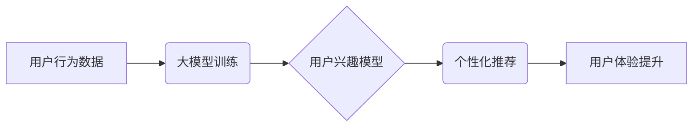

                 

## 大模型技术在电商平台用户兴趣探索与利用权衡中的创新

> 关键词：大模型、用户兴趣探索、电商平台、推荐系统、个性化、伦理

## 1. 背景介绍

随着电商平台的蓬勃发展，用户兴趣的探索与利用已成为平台核心竞争力之一。传统基于规则和协同过滤的推荐系统，在面对海量用户数据和复杂用户行为时，逐渐显露出其局限性。大模型技术凭借其强大的学习能力和泛化能力，为电商平台用户兴趣探索与利用带来了新的机遇。

大模型是指参数规模达到数亿甚至数千亿的深度学习模型，能够通过海量数据训练，学习到复杂的模式和关系。在自然语言处理、计算机视觉等领域取得了突破性进展，也为电商平台用户兴趣探索提供了新的思路。

## 2. 核心概念与联系

### 2.1 用户兴趣探索

用户兴趣探索是指通过分析用户行为、偏好、历史数据等信息，挖掘用户潜在兴趣，并将其转化为可行动的推荐。

### 2.2 大模型技术

大模型技术是指训练参数规模庞大的深度学习模型，通过海量数据学习复杂的模式和关系，从而实现更精准的预测和理解。

### 2.3 电商平台

电商平台是指提供商品展示、交易、支付等服务的线上交易平台。

### 2.4 核心概念架构



## 3. 核心算法原理 & 具体操作步骤

### 3.1 算法原理概述

大模型技术在电商平台用户兴趣探索中主要应用于以下算法：

* **Transformer模型**: Transformer模型是一种基于注意力机制的深度学习模型，能够有效捕捉文本序列中的长距离依赖关系，适用于用户行为数据的分析和用户兴趣建模。
* **BERT模型**: BERT模型是一种预训练语言模型，能够理解上下文信息，适用于用户评论、产品描述等文本数据的分析，帮助挖掘用户兴趣。
* **Graph Neural Networks (GNN)**: GNN模型能够处理图结构数据，适用于分析用户-商品交互关系，挖掘用户兴趣偏好。

### 3.2 算法步骤详解

1. **数据收集与预处理**: 收集用户行为数据，包括浏览记录、购买记录、评价信息、搜索历史等，并进行清洗、格式化、编码等预处理操作。
2. **模型训练**: 选择合适的深度学习模型，例如Transformer、BERT或GNN，并利用收集到的数据进行模型训练。
3. **模型评估**: 使用测试数据评估模型性能，例如准确率、召回率、F1-score等指标。
4. **模型部署**: 将训练好的模型部署到电商平台，并将其集成到推荐系统中。
5. **个性化推荐**: 根据用户的历史行为数据和兴趣模型的预测结果，为用户提供个性化的商品推荐。

### 3.3 算法优缺点

**优点**:

* **精准度提升**: 大模型能够学习到更复杂的模式和关系，提高推荐的精准度。
* **个性化程度增强**: 大模型能够根据用户的个性化需求提供更精准的推荐。
* **泛化能力强**: 大模型能够应用于不同的电商平台和场景。

**缺点**:

* **训练成本高**: 大模型的训练需要大量的计算资源和时间。
* **数据依赖性强**: 大模型的性能依赖于训练数据的质量和数量。
* **可解释性差**: 大模型的决策过程较为复杂，难以解释其推荐结果。

### 3.4 算法应用领域

大模型技术在电商平台用户兴趣探索中的应用领域广泛，包括：

* **商品推荐**: 根据用户的兴趣偏好推荐相关商品。
* **内容推荐**: 根据用户的阅读习惯推荐相关文章、视频等内容。
* **用户画像**: 通过分析用户的行为数据构建用户画像，了解用户的兴趣、需求和行为模式。
* **搜索结果优化**: 根据用户的搜索关键词和历史行为数据优化搜索结果。

## 4. 数学模型和公式 & 详细讲解 & 举例说明

### 4.1 数学模型构建

用户兴趣模型可以构建为一个概率模型，例如贝叶斯网络或马尔科夫链，来表示用户对不同商品的兴趣概率。

### 4.2 公式推导过程

假设用户u对商品i的兴趣概率为P(i|u)，可以使用贝叶斯公式来计算：

$$P(i|u) = \frac{P(u|i)P(i)}{P(u)}$$

其中：

* P(i|u) 是用户u对商品i的兴趣概率。
* P(u|i) 是用户u购买商品i的概率。
* P(i) 是商品i的出现概率。
* P(u) 是用户u的总概率。

### 4.3 案例分析与讲解

例如，假设用户A购买过商品A1和A2，而商品B1和B2是与A1和A2相关的商品。根据贝叶斯公式，我们可以计算用户A对B1和B2的兴趣概率。

* P(A1|A) 和 P(A2|A) 是用户A购买A1和A2的概率，可以从历史数据中获取。
* P(B1|A1) 和 P(B2|A2) 是用户购买A1和A2后购买B1和B2的概率，可以从用户行为数据中分析。
* P(A1) 和 P(A2) 是商品A1和A2的出现概率，可以从商品销售数据中获取。

通过以上信息，我们可以使用贝叶斯公式计算用户A对B1和B2的兴趣概率，并根据这些概率为用户A推荐相关商品。

## 5. 项目实践：代码实例和详细解释说明

### 5.1 开发环境搭建

* Python 3.7+
* TensorFlow 2.0+
* PyTorch 1.0+
* CUDA Toolkit 10.2+

### 5.2 源代码详细实现

```python
# 导入必要的库
import tensorflow as tf

# 定义用户兴趣模型
class UserInterestModel(tf.keras.Model):
    def __init__(self, embedding_dim, num_users, num_items):
        super(UserInterestModel, self).__init__()
        self.user_embedding = tf.keras.layers.Embedding(num_users, embedding_dim)
        self.item_embedding = tf.keras.layers.Embedding(num_items, embedding_dim)
        self.dense = tf.keras.layers.Dense(1, activation='sigmoid')

    def call(self, user_ids, item_ids):
        user_embeddings = self.user_embedding(user_ids)
        item_embeddings = self.item_embedding(item_ids)
        combined_embeddings = user_embeddings * item_embeddings
        predictions = self.dense(combined_embeddings)
        return predictions

# 实例化模型
model = UserInterestModel(embedding_dim=64, num_users=1000, num_items=10000)

# 训练模型
model.compile(optimizer='adam', loss='binary_crossentropy', metrics=['accuracy'])
model.fit(x=[user_ids, item_ids], y=labels, epochs=10)

```

### 5.3 代码解读与分析

* 代码首先导入必要的库，包括TensorFlow。
* 然后定义了一个用户兴趣模型，该模型使用嵌入层和全连接层来学习用户和商品的表示，并预测用户对商品的兴趣概率。
* 模型实例化后，使用Adam优化器和二分类交叉熵损失函数进行训练。
* 训练完成后，模型可以用于预测用户对商品的兴趣概率，并根据这些概率进行个性化推荐。

### 5.4 运行结果展示

训练完成后，可以使用测试数据评估模型性能，例如准确率、召回率、F1-score等指标。

## 6. 实际应用场景

### 6.1 商品推荐

大模型技术可以用于个性化商品推荐，例如根据用户的浏览历史、购买记录、评价信息等数据，推荐用户可能感兴趣的商品。

### 6.2 内容推荐

大模型技术可以用于推荐相关内容，例如根据用户的阅读习惯、观看历史、点赞记录等数据，推荐用户可能感兴趣的文章、视频、音频等内容。

### 6.3 用户画像

大模型技术可以用于构建用户画像，例如根据用户的行为数据，分析用户的兴趣、需求、行为模式等，并将其转化为可操作的标签或特征。

### 6.4 未来应用展望

大模型技术在电商平台用户兴趣探索中的应用前景广阔，未来可能应用于以下领域：

* **更精准的个性化推荐**: 通过更深入地理解用户的兴趣和需求，提供更精准的个性化推荐。
* **多模态用户兴趣探索**: 将文本、图像、视频等多模态数据融合，更全面地理解用户的兴趣。
* **动态兴趣建模**: 随着用户的行为变化，动态更新用户的兴趣模型，提供更实时、更精准的推荐。

## 7. 工具和资源推荐

### 7.1 学习资源推荐

* **深度学习书籍**: 《深度学习》 (Ian Goodfellow, Yoshua Bengio, Aaron Courville)
* **在线课程**: Coursera、edX、Udacity 等平台提供深度学习相关的课程。
* **开源代码**: TensorFlow、PyTorch 等深度学习框架的官方网站提供丰富的开源代码示例。

### 7.2 开发工具推荐

* **TensorFlow**: Google 开发的开源深度学习框架。
* **PyTorch**: Facebook 开发的开源深度学习框架。
* **Jupyter Notebook**: 用于深度学习代码开发和可视化的交互式笔记本环境。

### 7.3 相关论文推荐

* **BERT: Pre-training of Deep Bidirectional Transformers for Language Understanding** (Devlin et al., 2018)
* **Attention Is All You Need** (Vaswani et al., 2017)
* **Graph Convolutional Networks** (Kipf & Welling, 2016)

## 8. 总结：未来发展趋势与挑战

### 8.1 研究成果总结

大模型技术在电商平台用户兴趣探索中取得了显著成果，能够提高推荐的精准度和个性化程度。

### 8.2 未来发展趋势

* **模型规模和能力的提升**: 随着计算资源的不断发展，大模型的规模和能力将进一步提升，能够学习到更复杂的模式和关系。
* **多模态用户兴趣探索**: 将文本、图像、视频等多模态数据融合，更全面地理解用户的兴趣。
* **动态兴趣建模**: 随着用户的行为变化，动态更新用户的兴趣模型，提供更实时、更精准的推荐。

### 8.3 面临的挑战

* **数据隐私和安全**: 大模型的训练需要大量的用户数据，如何保护用户隐私和数据安全是一个重要的挑战。
* **模型可解释性和透明度**: 大模型的决策过程较为复杂，难以解释其推荐结果，如何提高模型的可解释性和透明度是一个重要的研究方向。
* **模型公平性和偏见**: 大模型的训练数据可能存在偏差，导致模型输出结果存在公平性和偏见问题，如何构建公平、公正的模型是一个重要的挑战。

### 8.4 研究展望

未来，大模型技术在电商平台用户兴趣探索领域将继续发展，并带来更多创新和应用。研究者需要关注数据隐私、模型可解释性和公平性等问题，并探索更有效的模型训练方法和应用场景。

## 9. 附录：常见问题与解答

### 9.1 如何选择合适的深度学习模型？

选择合适的深度学习模型需要根据具体应用场景和数据特点进行选择。例如，对于文本数据，BERT模型效果较好；对于图结构数据，GNN模型效果较好。

### 9.2 如何处理大规模数据？

大规模数据处理可以使用分布式训练技术，将数据分发到多个机器上进行训练。

### 9.3 如何评估大模型的性能？

大模型的性能可以使用准确率、召回率、F1-score等指标进行评估。

### 9.4 如何解决模型过拟合问题？

模型过拟合问题可以通过正则化、数据增强、Dropout等技术进行解决。


作者：禅与计算机程序设计艺术 / Zen and the Art of Computer Programming 
<end_of_turn>

