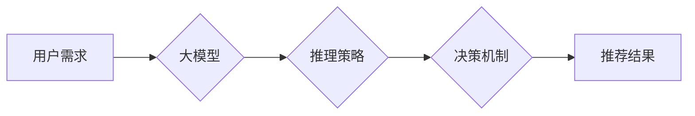

                 

## 大模型推荐中的推理策略与决策机制创新探索

> 关键词：大模型、推荐系统、推理策略、决策机制、个性化推荐、效率优化、可解释性

## 1. 背景介绍

推荐系统作为连接用户需求与信息资源的重要桥梁，在电商、社交媒体、内容平台等领域发挥着至关重要的作用。随着大模型技术的蓬勃发展，大模型在推荐系统中的应用日益广泛，为个性化推荐、内容发现和用户体验提升带来了新的机遇。然而，大模型在推荐系统中的应用也面临着诸多挑战，例如推理效率低下、决策机制缺乏透明度以及个性化推荐效果有限等。

传统推荐系统主要依赖于基于内容、协同过滤和深度学习等方法，但这些方法在处理海量数据、捕捉用户复杂行为和个性化需求方面存在局限性。大模型凭借其强大的语义理解能力、泛化能力和学习能力，能够更好地理解用户需求、挖掘潜在关联和生成个性化推荐结果。

## 2. 核心概念与联系

### 2.1 大模型

大模型是指参数规模庞大、训练数据海量的人工智能模型，通常拥有数十亿甚至数千亿个参数。大模型通过学习海量数据中的模式和关系，能够实现对自然语言、图像、音频等多种数据类型的理解和生成。

### 2.2 推理策略

推理策略是指大模型在进行推荐时，如何从庞大的知识库中检索和组合信息，以生成最符合用户需求的推荐结果。不同的推理策略会影响推荐结果的准确性、多样性和效率。

### 2.3 决策机制

决策机制是指大模型在选择推荐结果时，如何权衡不同因素，并最终做出推荐决策。决策机制通常涉及到用户偏好、物品属性、上下文信息等多方面的因素。

**Mermaid 流程图**



## 3. 核心算法原理 & 具体操作步骤

### 3.1 算法原理概述

大模型推荐系统通常采用基于 Transformer 的架构，例如 BERT、GPT 和 T5 等模型。这些模型通过自注意力机制学习用户和物品之间的语义关系，并利用解码器生成个性化推荐结果。

### 3.2 算法步骤详解

1. **数据预处理:** 收集用户行为数据、物品信息数据等，并进行清洗、转换和编码。
2. **模型训练:** 使用预训练的 Transformer 模型，对数据进行训练，学习用户和物品之间的语义关系。
3. **推理策略选择:** 根据具体场景选择合适的推理策略，例如基于内容的推荐、基于协同过滤的推荐、基于用户的行为轨迹的推荐等。
4. **决策机制设计:** 设计决策机制，根据用户偏好、物品属性、上下文信息等因素，权衡不同推荐结果，并最终选择最优的推荐结果。
5. **推荐结果生成:** 利用训练好的模型和选择的推理策略和决策机制，生成个性化推荐结果。

### 3.3 算法优缺点

**优点:**

* **强大的语义理解能力:** 大模型能够更好地理解用户需求和物品属性，生成更精准的推荐结果。
* **泛化能力强:** 大模型在不同领域和场景下都能够表现出良好的性能。
* **学习能力强:** 大模型能够不断学习用户行为数据，并不断优化推荐效果。

**缺点:**

* **推理效率低:** 大模型的参数规模庞大，推理过程耗时较长。
* **决策机制缺乏透明度:** 大模型的决策过程较为复杂，难以解释其推荐结果背后的逻辑。
* **数据依赖性强:** 大模型的性能依赖于训练数据的质量和数量。

### 3.4 算法应用领域

大模型推荐系统在电商、社交媒体、内容平台、金融服务等领域都有广泛的应用。例如，电商平台可以使用大模型推荐个性化商品，社交媒体平台可以使用大模型推荐相关用户和内容，内容平台可以使用大模型推荐个性化文章和视频。

## 4. 数学模型和公式 & 详细讲解 & 举例说明

### 4.1 数学模型构建

大模型推荐系统通常采用基于 Transformer 的架构，其核心是自注意力机制。自注意力机制可以捕捉用户和物品之间的语义关系，并赋予不同词语不同的权重。

**公式:**

$$
Attention(Q, K, V) = \frac{exp(Q \cdot K^T / \sqrt{d_k})}{exp(Q \cdot K^T / \sqrt{d_k})} \cdot V
$$

其中:

* $Q$：查询矩阵
* $K$：键矩阵
* $V$：值矩阵
* $d_k$：键向量的维度

### 4.2 公式推导过程

自注意力机制的核心思想是通过计算查询向量 $Q$ 与键向量 $K$ 之间的相似度，来确定不同词语之间的关系。

* $Q \cdot K^T$：计算查询向量与键向量的点积，得到一个得分矩阵。
* $\sqrt{d_k}$：对得分矩阵进行缩放，以避免梯度爆炸。
* $exp(Q \cdot K^T / \sqrt{d_k})$：对得分矩阵进行softmax归一化，得到每个词语的注意力权重。
* $ \cdot V$：将注意力权重与值矩阵 $V$ 相乘，得到最终的输出向量。

### 4.3 案例分析与讲解

假设我们有一个句子 "我喜欢吃苹果和香蕉"，我们想要计算 "我喜欢" 与 "苹果" 之间的注意力权重。

* $Q$：查询向量为 "我喜欢" 的词向量。
* $K$：键向量为 "苹果" 的词向量。
* $V$：值向量为 "苹果" 的词向量。

通过计算 $Q \cdot K^T$，我们可以得到一个得分，该得分表示 "我喜欢" 与 "苹果" 之间的相似度。通过softmax归一化，我们可以得到 "我喜欢" 与 "苹果" 之间的注意力权重。

## 5. 项目实践：代码实例和详细解释说明

### 5.1 开发环境搭建

* Python 3.7+
* PyTorch 1.7+
* Transformers 4.0+

### 5.2 源代码详细实现

```python
from transformers import AutoModelForSequenceClassification, AutoTokenizer

# 加载预训练模型和词典
model_name = "bert-base-uncased"
tokenizer = AutoTokenizer.from_pretrained(model_name)
model = AutoModelForSequenceClassification.from_pretrained(model_name)

# 输入文本
text = "我喜欢吃苹果和香蕉"

# 对文本进行编码
inputs = tokenizer(text, return_tensors="pt")

# 进行推理
outputs = model(**inputs)

# 获取预测结果
predicted_class = outputs.logits.argmax().item()

# 打印预测结果
print(predicted_class)
```

### 5.3 代码解读与分析

* 首先，我们加载预训练的 BERT 模型和词典。
* 然后，我们对输入文本进行编码，将文本转换为模型可以理解的格式。
* 接着，我们使用模型进行推理，得到预测结果。
* 最后，我们打印预测结果。

### 5.4 运行结果展示

运行上述代码，可以得到一个预测结果，例如 0 或 1。

## 6. 实际应用场景

### 6.1 个性化推荐

大模型推荐系统可以根据用户的兴趣、偏好、行为轨迹等信息，生成个性化的推荐结果，例如推荐用户可能感兴趣的商品、文章、视频等。

### 6.2 内容发现

大模型推荐系统可以帮助用户发现新的内容，例如推荐用户可能感兴趣的主题、作者、出版物等。

### 6.3 用户行为预测

大模型推荐系统可以预测用户的行为，例如预测用户是否会购买商品、点击广告、分享内容等。

### 6.4 未来应用展望

大模型推荐系统在未来将会有更广泛的应用，例如：

* **跨模态推荐:** 将文本、图像、音频等多种模态信息融合在一起，进行更精准的推荐。
* **实时推荐:** 基于用户的实时行为，进行动态的推荐。
* **可解释性推荐:** 明确推荐结果背后的逻辑，提高用户对推荐结果的信任度。

## 7. 工具和资源推荐

### 7.1 学习资源推荐

* **论文:**
    * Vaswani, A., Shazeer, N., Parmar, N., Uszkoreit, J., Jones, L., Gomez, A. N., ... & Polosukhin, I. (2017). Attention is all you need. In Advances in neural information processing systems (pp. 5998-6008).
    * Devlin, J., Chang, M. W., Lee, K., & Toutanova, K. (2018). Bert: Pre-training of deep bidirectional transformers for language understanding. arXiv preprint arXiv:1810.04805.
* **书籍:**
    * Deep Learning with Python by Francois Chollet
    * Natural Language Processing with PyTorch by Yoav Goldberg

### 7.2 开发工具推荐

* **PyTorch:** 深度学习框架
* **Transformers:** 预训练模型库
* **Hugging Face:** 预训练模型平台

### 7.3 相关论文推荐

* **BERT for Recommender Systems:** https://arxiv.org/abs/1908.08939
* **Exploring Transformer-Based Models for Recommender Systems:** https://arxiv.org/abs/2003.07223

## 8. 总结：未来发展趋势与挑战

### 8.1 研究成果总结

大模型推荐系统在推荐准确性、个性化程度和内容发现能力方面取得了显著的进展。

### 8.2 未来发展趋势

* **跨模态推荐:** 将文本、图像、音频等多种模态信息融合在一起，进行更精准的推荐。
* **实时推荐:** 基于用户的实时行为，进行动态的推荐。
* **可解释性推荐:** 明确推荐结果背后的逻辑，提高用户对推荐结果的信任度。

### 8.3 面临的挑战

* **推理效率:** 大模型的推理过程耗时较长，需要进一步优化推理效率。
* **数据隐私:** 大模型推荐系统需要处理大量用户数据，需要保障用户数据隐私安全。
* **公平性:** 大模型推荐系统可能存在偏见，需要确保推荐结果公平公正。

### 8.4 研究展望

未来，大模型推荐系统将朝着更智能、更个性化、更可解释的方向发展。研究者将继续探索新的模型架构、推理策略和决策机制，以提高推荐系统的性能和用户体验。

## 9. 附录：常见问题与解答

### 9.1 如何选择合适的推理策略？

选择合适的推理策略取决于具体的应用场景和数据特点。例如，对于基于内容的推荐，可以使用基于关键词匹配的策略；对于基于协同过滤的推荐，可以使用基于用户相似度的策略。

### 9.2 如何提高大模型推荐系统的推理效率？

可以采用以下方法提高大模型推荐系统的推理效率：

* 使用量化技术压缩模型参数。
* 使用模型剪枝技术删除冗余参数。
* 使用并行推理技术加速推理过程。

### 9.3 如何保证大模型推荐系统的公平性？

可以采用以下方法保证大模型推荐系统的公平性：

* 使用公平性损失函数进行模型训练。
* 对推荐结果进行公平性评估。
* 对推荐系统进行定期审核，确保其公平性。


作者：禅与计算机程序设计艺术 / Zen and the Art of Computer Programming 
<end_of_turn>

