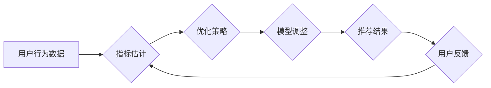

                 

## 大模型推荐场景中的在线指标估计与优化策略

> 关键词：大模型、推荐系统、在线指标、指标估计、优化策略、A/B测试、因果推理

## 1. 背景介绍

推荐系统作为连接用户和内容的重要桥梁，在信息爆炸的时代扮演着越来越重要的角色。随着大模型技术的蓬勃发展，大模型在推荐系统中的应用也日益广泛，例如BERT、GPT等模型在个性化推荐、内容生成、搜索结果排序等方面展现出强大的能力。然而，大模型的训练和部署成本高昂，对资源需求也十分苛刻。因此，如何高效地评估和优化大模型在推荐场景中的性能，成为一个亟待解决的关键问题。

传统的推荐系统评估指标主要依赖于离线评估，即在训练集或测试集上进行评估。然而，离线评估无法完全反映大模型在真实场景下的表现，因为用户行为和环境在离线和在线环境中存在显著差异。此外，大模型的复杂性使得离线评估难以捕捉其所有潜在的优缺点。

在线指标估计和优化策略旨在解决上述问题，通过实时监控和分析用户行为数据，动态地评估大模型的性能，并根据评估结果进行模型调整和优化。这使得推荐系统能够更准确地反映用户需求，并持续提升推荐效果。

## 2. 核心概念与联系

### 2.1 在线指标

在线指标是指在真实用户交互环境下实时收集和计算的指标，例如点击率（CTR）、转化率（CVR）、用户满意度等。这些指标能够更准确地反映大模型在实际场景中的表现，并为模型优化提供更可靠的依据。

### 2.2 指标估计方法

由于在线环境下数据流速快，实时计算在线指标存在挑战。因此，需要采用一些高效的指标估计方法，例如：

* **滑动窗口法:** 将用户行为数据划分为多个滑动窗口，在每个窗口内计算指标，并根据窗口大小和滑动速度调整指标估计的精度。
* **重要采样法:** 从用户行为数据中随机抽取一部分数据进行指标计算，并根据抽样比例进行权重调整，以提高指标估计的效率。
* **贝叶斯估计法:** 利用贝叶斯定理对指标进行估计，并根据新数据不断更新估计值，从而实现动态调整和优化。

### 2.3 优化策略

优化策略是指根据在线指标估计结果，对大模型进行调整和优化的方法。常见的优化策略包括：

* **A/B测试:** 将用户随机分配到不同的模型组，并比较不同模型组的在线指标表现，选择性能更好的模型进行部署。
* **梯度下降法:** 利用梯度下降算法对模型参数进行调整，以提高模型的在线指标表现。
* **强化学习:** 将模型视为一个智能体，通过与环境交互学习，并不断优化模型策略以最大化在线指标收益。

**Mermaid 流程图**



## 3. 核心算法原理 & 具体操作步骤

### 3.1 算法原理概述

在线指标估计和优化策略的核心算法原理是基于实时数据流的动态调整和优化。通过高效的指标估计方法，实时获取大模型在真实场景下的性能表现，并根据预设的优化目标，采用相应的优化策略对模型进行调整，以不断提升推荐效果。

### 3.2 算法步骤详解

1. **数据收集:** 收集用户行为数据，例如点击、浏览、购买等行为。
2. **指标估计:** 利用滑动窗口法、重要采样法或贝叶斯估计法等方法，实时估计在线指标，例如CTR、CVR等。
3. **优化策略选择:** 根据预设的优化目标和当前指标估计结果，选择合适的优化策略，例如A/B测试、梯度下降法或强化学习等。
4. **模型调整:** 根据选定的优化策略，对大模型进行调整，例如更新模型参数、调整模型结构等。
5. **性能评估:** 对调整后的模型进行评估，并根据评估结果进行反馈，迭代优化模型。

### 3.3 算法优缺点

**优点:**

* **实时性:** 可以实时监控和分析用户行为数据，动态调整模型，从而更准确地反映用户需求。
* **灵活性:** 可以根据不同的优化目标和场景选择不同的优化策略，实现个性化的模型优化。
* **效率:** 可以通过A/B测试等方法快速筛选出性能更好的模型，提高资源利用效率。

**缺点:**

* **数据依赖:** 在线指标估计和优化策略依赖于实时用户行为数据，数据质量和数量直接影响模型性能。
* **计算复杂度:** 一些指标估计和优化策略计算复杂度较高，需要强大的计算资源支持。
* **偏差风险:** 在线环境下数据分布可能与离线环境存在差异，导致指标估计存在偏差。

### 3.4 算法应用领域

在线指标估计和优化策略广泛应用于推荐系统、广告系统、搜索引擎等领域，例如：

* **个性化推荐:** 根据用户的历史行为数据，实时调整推荐模型，提供更个性化的推荐结果。
* **广告投放:** 根据用户的兴趣和行为特征，实时优化广告投放策略，提高广告点击率和转化率。
* **搜索结果排序:** 根据用户的搜索历史和行为数据，实时调整搜索结果排序算法，提供更相关的搜索结果。

## 4. 数学模型和公式 & 详细讲解 & 举例说明

### 4.1 数学模型构建

在线指标估计可以使用滑动窗口法构建数学模型。假设我们想要估计一个指标 $M$，例如CTR，滑动窗口大小为 $w$，则窗口内用户行为数据为 $D_t = \{d_1, d_2, ..., d_w\}$，其中 $d_i$ 表示第 $i$ 个用户行为数据。

**滑动窗口法模型:**

$$
M_t = \frac{1}{w} \sum_{i=1}^{w} f(d_i)
$$

其中，$M_t$ 表示在时间 $t$ 窗口内的指标估计值，$f(d_i)$ 表示第 $i$ 个用户行为数据对指标 $M$ 的贡献。

### 4.2 公式推导过程

滑动窗口法模型的推导过程如下：

1. 对于每个时间窗口 $D_t$，计算窗口内所有用户行为数据对指标 $M$ 的贡献之和。
2. 将贡献之和除以窗口大小 $w$，得到窗口内指标 $M$ 的估计值 $M_t$。

### 4.3 案例分析与讲解

假设我们想要估计一个推荐系统的CTR，滑动窗口大小为 100，窗口内用户点击推荐结果的次数为 10，则窗口内CTR的估计值为：

$$
CTR_t = \frac{10}{100} = 0.1
$$

## 5. 项目实践：代码实例和详细解释说明

### 5.1 开发环境搭建

* Python 3.7+
* TensorFlow 2.0+
* PyTorch 1.0+
* scikit-learn 0.20+

### 5.2 源代码详细实现

```python
import numpy as np
from sklearn.metrics import accuracy_score

class OnlineIndicatorEstimator:
    def __init__(self, window_size):
        self.window_size = window_size
        self.data_buffer = []

    def update(self, data):
        self.data_buffer.append(data)
        if len(self.data_buffer) > self.window_size:
            self.data_buffer.pop(0)

    def estimate(self):
        # 计算指标估计值
        pass

class A/BTestOptimizer:
    def __init__(self, model_a, model_b, test_ratio):
        self.model_a = model_a
        self.model_b = model_b
        self.test_ratio = test_ratio

    def optimize(self, data):
        # 根据测试比例将数据分配到模型A和模型B
        # 评估模型A和模型B的性能
        # 选择性能更好的模型进行部署
        pass

```

### 5.3 代码解读与分析

* `OnlineIndicatorEstimator` 类负责实时估计在线指标，例如CTR。
* `A/BTestOptimizer` 类负责进行A/B测试，选择性能更好的模型进行部署。

### 5.4 运行结果展示

运行结果展示需要根据具体的项目场景和数据进行分析，例如绘制指标变化趋势图、比较不同模型的性能差异等。

## 6. 实际应用场景

### 6.1 个性化推荐

在线指标估计和优化策略可以用于个性化推荐系统，例如根据用户的历史行为数据，实时调整推荐模型，提供更个性化的推荐结果。

### 6.2 广告投放

在线指标估计和优化策略可以用于广告投放系统，例如根据用户的兴趣和行为特征，实时优化广告投放策略，提高广告点击率和转化率。

### 6.3 搜索结果排序

在线指标估计和优化策略可以用于搜索引擎，例如根据用户的搜索历史和行为数据，实时调整搜索结果排序算法，提供更相关的搜索结果。

### 6.4 未来应用展望

随着大模型技术的不断发展，在线指标估计和优化策略将在更多领域得到应用，例如：

* **内容生成:** 根据用户的反馈数据，实时调整内容生成模型，生成更符合用户需求的内容。
* **对话系统:** 根据用户的对话历史数据，实时调整对话系统模型，提供更自然流畅的对话体验。
* **机器翻译:** 根据用户的翻译需求和反馈数据，实时调整机器翻译模型，提高翻译质量。

## 7. 工具和资源推荐

### 7.1 学习资源推荐

* **书籍:**
    * 《推荐系统实践》
    * 《深度学习》
* **在线课程:**
    * Coursera: Machine Learning
    * Udacity: Deep Learning Nanodegree

### 7.2 开发工具推荐

* **TensorFlow:** 开源深度学习框架
* **PyTorch:** 开源深度学习框架
* **scikit-learn:** 机器学习库

### 7.3 相关论文推荐

* **《Online Learning for Recommender Systems》**
* **《A Survey on Online Learning for Recommender Systems》**

## 8. 总结：未来发展趋势与挑战

### 8.1 研究成果总结

在线指标估计和优化策略为大模型在推荐场景中的应用提供了有效的解决方案，能够实时监控和调整模型性能，提升推荐效果。

### 8.2 未来发展趋势

未来，在线指标估计和优化策略将朝着以下方向发展：

* **更精准的指标估计:** 利用更先进的统计方法和机器学习算法，提高指标估计的精度和可靠性。
* **更智能的优化策略:** 利用强化学习等算法，实现更智能的模型优化，自动调整模型参数和结构。
* **更个性化的推荐:** 基于用户的个性化需求和行为特征，实现更精准和个性化的推荐。

### 8.3 面临的挑战

在线指标估计和优化策略也面临一些挑战：

* **数据质量:** 指标估计和优化策略依赖于高质量的用户行为数据，数据质量问题会直接影响模型性能。
* **计算复杂度:** 一些指标估计和优化策略计算复杂度较高，需要强大的计算资源支持。
* **偏差风险:** 在线环境下数据分布可能与离线环境存在差异，导致指标估计存在偏差。

### 8.4 研究展望

未来，需要进一步研究如何解决上述挑战，提高在线指标估计和优化策略的精度、效率和鲁棒性，为大模型在推荐场景中的应用提供更有效的解决方案。

## 9. 附录：常见问题与解答

**Q1: 如何选择合适的滑动窗口大小？**

**A1:** 滑动窗口大小的选择需要根据实际场景和数据特点进行调整。一般来说，窗口大小越大，指标估计越稳定，但同时也降低了对实时变化的响应速度。

**Q2: 如何处理数据质量问题？**

**A2:** 可以采用数据清洗、异常值处理等方法来提高数据质量。

**Q3: 如何降低计算复杂度？**

**A3:** 可以采用并行计算、近似算法等方法来降低计算复杂度。


作者：禅与计算机程序设计艺术 / Zen and the Art of Computer Programming 
<end_of_turn>

