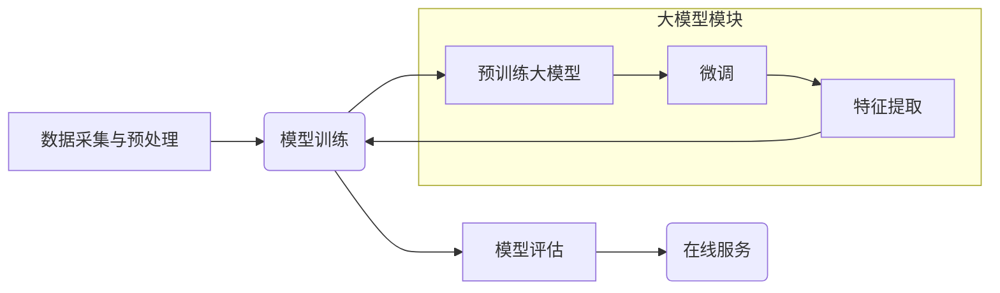

                 

## 大模型推荐落地中的工程化挑战与应对

> 关键词：大模型、推荐系统、工程化、落地、挑战、应对

### 1. 背景介绍

近年来，大模型技术取得了飞速发展，其强大的泛化能力和表达能力在自然语言处理、计算机视觉等领域展现出巨大潜力。推荐系统作为信息获取和内容消费的重要环节，也逐渐开始拥抱大模型技术。大模型推荐系统能够更好地理解用户需求，提供更精准、个性化的推荐结果，从而提升用户体验和商业价值。

然而，将大模型技术应用于推荐系统落地过程中，面临着诸多工程化挑战。这些挑战涵盖模型训练、部署、在线服务、数据处理、安全隐私等多个方面。

### 2. 核心概念与联系

#### 2.1 大模型推荐系统

大模型推荐系统是指利用大规模预训练语言模型（例如BERT、GPT、T5等）进行推荐任务的系统。与传统推荐系统相比，大模型推荐系统具有以下特点：

* **更强的语义理解能力:** 大模型通过预训练学习了大量的文本语义知识，能够更好地理解用户需求和商品描述，从而进行更精准的匹配。
* **更丰富的特征表达:** 大模型可以学习到更丰富的文本特征，例如用户兴趣、商品属性、上下文信息等，为推荐提供更全面的信息支持。
* **更好的泛化能力:** 预训练的大模型具有较强的泛化能力，能够适应不同的推荐场景和数据分布。

#### 2.2 推荐系统架构

推荐系统通常由以下几个模块组成：

* **数据采集与预处理:** 收集用户行为数据、商品信息等数据，并进行清洗、转换、特征工程等预处理工作。
* **模型训练:** 利用训练数据训练推荐模型，例如协同过滤、深度学习等模型。
* **模型评估:** 使用测试数据评估模型性能，例如准确率、召回率、NDCG等指标。
* **在线服务:** 将训练好的模型部署到线上环境，为用户提供实时推荐服务。

#### 2.3 大模型推荐系统架构

大模型推荐系统通常基于上述推荐系统架构，并在其中引入大模型技术。



### 3. 核心算法原理 & 具体操作步骤

#### 3.1 算法原理概述

大模型推荐系统通常采用以下几种核心算法：

* **基于大模型的协同过滤:** 利用大模型学习用户-商品交互矩阵的潜在语义表示，进行推荐。
* **基于大模型的深度学习:** 利用大模型作为特征提取器，提取用户和商品的语义特征，并将其输入到深度学习模型中进行推荐。
* **基于大模型的检索式推荐:** 利用大模型对用户查询进行理解，并从商品数据库中检索出相关的商品进行推荐。

#### 3.2 算法步骤详解

以基于大模型的深度学习推荐为例，其具体操作步骤如下：

1. **数据预处理:** 收集用户行为数据、商品信息等数据，并进行清洗、转换、特征工程等预处理工作。
2. **大模型预训练:** 利用大规模文本数据对预训练语言模型进行预训练，例如BERT、GPT等。
3. **大模型微调:** 将预训练的大模型微调到推荐任务上，利用用户-商品交互数据进行训练。
4. **特征提取:** 将用户和商品的文本信息输入到微调后的大模型中，提取其语义特征。
5. **推荐模型训练:** 将提取到的语义特征作为输入，训练深度学习推荐模型，例如神经网络、图神经网络等。
6. **模型评估:** 使用测试数据评估模型性能，例如准确率、召回率、NDCG等指标。
7. **在线服务:** 将训练好的模型部署到线上环境，为用户提供实时推荐服务。

#### 3.3 算法优缺点

**优点:**

* **更强的语义理解能力:** 大模型能够更好地理解用户需求和商品描述，从而进行更精准的匹配。
* **更丰富的特征表达:** 大模型可以学习到更丰富的文本特征，为推荐提供更全面的信息支持。
* **更好的泛化能力:** 预训练的大模型具有较强的泛化能力，能够适应不同的推荐场景和数据分布。

**缺点:**

* **训练成本高:** 大模型的训练需要大量的计算资源和时间。
* **模型复杂度高:** 大模型的结构复杂，调试和维护难度较大。
* **数据依赖性强:** 大模型的性能依赖于训练数据的质量和数量。

#### 3.4 算法应用领域

大模型推荐系统在以下领域具有广泛的应用前景：

* **电商推荐:** 为用户推荐商品，提高转化率。
* **内容推荐:** 为用户推荐新闻、视频、音乐等内容，提升用户粘性。
* **社交推荐:** 为用户推荐好友、兴趣小组等，促进用户互动。
* **个性化教育:** 为学生推荐学习资源，个性化定制学习方案。

### 4. 数学模型和公式 & 详细讲解 & 举例说明

#### 4.1 数学模型构建

大模型推荐系统通常采用以下数学模型进行建模：

* **协同过滤模型:** 利用矩阵分解技术，将用户-商品交互矩阵分解成用户向量和商品向量，从而预测用户对商品的评分或偏好。
* **深度学习模型:** 利用神经网络结构，学习用户和商品的语义特征，并进行预测。

#### 4.2 公式推导过程

以协同过滤模型为例，其目标是学习用户向量和商品向量，使得预测的评分与实际评分之间的误差最小化。

假设用户集合为U，商品集合为I，用户u对商品i的评分为r<sub>ui</sub>。协同过滤模型的目标函数为：

$$
L = \sum_{u \in U} \sum_{i \in I} (r_{ui} - \hat{r}_{ui})^2
$$

其中，$\hat{r}_{ui}$为模型预测的用户u对商品i的评分。

模型参数为用户向量和商品向量，可以通过梯度下降算法进行优化。

#### 4.3 案例分析与讲解

假设有一个电商平台，用户集合为U={1, 2, 3, 4}, 商品集合为I={A, B, C, D}, 用户对商品的评分如下表所示：

| 用户 | A | B | C | D |
|---|---|---|---|---|
| 1 | 5 | 4 | 3 | 2 |
| 2 | 3 | 5 | 2 | 4 |
| 3 | 4 | 3 | 5 | 1 |
| 4 | 2 | 1 | 4 | 5 |

可以使用协同过滤模型学习用户向量和商品向量，并预测用户对未评分商品的评分。

### 5. 项目实践：代码实例和详细解释说明

#### 5.1 开发环境搭建

大模型推荐系统开发环境通常需要以下软件和工具：

* **Python:** 作为编程语言。
* **深度学习框架:** 例如TensorFlow、PyTorch等。
* **大模型库:** 例如HuggingFace Transformers等。
* **数据处理工具:** 例如Pandas、NumPy等。

#### 5.2 源代码详细实现

以下是一个基于PyTorch和HuggingFace Transformers的简单大模型推荐系统代码示例：

```python
import torch
from transformers import AutoModel

# 加载预训练模型
model = AutoModel.from_pretrained("bert-base-uncased")

# 定义用户和商品的嵌入层
user_embedding = torch.nn.Embedding(num_embeddings=100, embedding_dim=128)
item_embedding = torch.nn.Embedding(num_embeddings=100, embedding_dim=128)

# 定义推荐模型
class RecommenderModel(torch.nn.Module):
    def __init__(self):
        super(RecommenderModel, self).__init__()
        self.model = AutoModel.from_pretrained("bert-base-uncased")
        self.user_embedding = torch.nn.Embedding(num_embeddings=100, embedding_dim=128)
        self.item_embedding = torch.nn.Embedding(num_embeddings=100, embedding_dim=128)

    def forward(self, user_id, item_id):
        user_embedding = self.user_embedding(user_id)
        item_embedding = self.item_embedding(item_id)
        # 使用大模型提取特征
        output = self.model(user_embedding + item_embedding)
        # 获取模型输出
        return output.last_hidden_state

# 实例化模型
model = RecommenderModel()

# 训练模型
# ...

# 在线服务
def recommend(user_id):
    # 获取用户最近交互的商品
    recent_items = get_recent_items(user_id)
    # 使用模型预测用户对其他商品的评分
    predictions = model(user_id, recent_items)
    # 返回评分最高的商品
    return get_top_items(predictions)
```

#### 5.3 代码解读与分析

该代码示例展示了大模型推荐系统的基本流程：

1. 加载预训练模型和定义用户和商品的嵌入层。
2. 定义推荐模型，将用户和商品的嵌入向量输入到大模型中，提取特征，并进行预测。
3. 实例化模型并进行训练。
4. 在在线服务中，根据用户的ID获取其最近交互的商品，并使用模型预测用户对其他商品的评分，返回评分最高的商品。

#### 5.4 运行结果展示

运行该代码示例后，可以得到用户对不同商品的评分预测结果，并根据预测结果进行商品推荐。

### 6. 实际应用场景

#### 6.1 电商推荐

大模型推荐系统可以为电商平台用户推荐个性化的商品，提高用户体验和转化率。例如，可以根据用户的浏览历史、购买记录、评价等信息，推荐用户可能感兴趣的商品。

#### 6.2 内容推荐

大模型推荐系统可以为用户推荐个性化的内容，例如新闻、视频、音乐等。例如，可以根据用户的阅读习惯、观看历史、点赞等信息，推荐用户可能感兴趣的内容。

#### 6.3 社交推荐

大模型推荐系统可以为用户推荐好友、兴趣小组等，促进用户互动。例如，可以根据用户的社交关系、兴趣爱好等信息，推荐用户可能认识的朋友或感兴趣的社群。

#### 6.4 未来应用展望

大模型推荐系统在未来将有更广泛的应用场景，例如：

* **个性化教育:** 为学生推荐学习资源，个性化定制学习方案。
* **医疗保健:** 为患者推荐合适的医疗服务和药物。
* **金融服务:** 为用户推荐理财产品和投资策略。

### 7. 工具和资源推荐

#### 7.1 学习资源推荐

* **HuggingFace Transformers:** https://huggingface.co/docs/transformers/index
* **TensorFlow:** https://www.tensorflow.org/
* **PyTorch:** https://pytorch.org/

#### 7.2 开发工具推荐

* **Jupyter Notebook:** https://jupyter.org/
* **VS Code:** https://code.visualstudio.com/

#### 7.3 相关论文推荐

* **BERT: Pre-training of Deep Bidirectional Transformers for Language Understanding**
* **GPT: Generative Pre-trained Transformer**
* **T5: Text-to-Text Transfer Transformer**

### 8. 总结：未来发展趋势与挑战

#### 8.1 研究成果总结

大模型推荐系统在推荐任务中取得了显著的成果，其强大的语义理解能力和特征表达能力，为推荐提供了更精准、个性化的解决方案。

#### 8.2 未来发展趋势

未来大模型推荐系统的发展趋势包括：

* **模型规模的进一步扩大:** 更大规模的预训练模型将带来更强的语义理解能力和特征表达能力。
* **多模态融合:** 将文本、图像、音频等多模态信息融合到推荐系统中，提升推荐的准确性和个性化程度。
* **联邦学习:** 利用联邦学习技术，在保护用户隐私的前提下，进行大模型训练和部署。

#### 8.3 面临的挑战

大模型推荐系统也面临着一些挑战：

* **训练成本高:** 大模型的训练需要大量的计算资源和时间，成本较高。
* **模型复杂度高:** 大模型的结构复杂，调试和维护难度较大。
* **数据依赖性强:** 大模型的性能依赖于训练数据的质量和数量。

#### 8.4 研究展望

未来研究方向包括：

* **降低训练成本:** 研究更有效的训练方法和硬件加速技术，降低大模型训练成本。
* **提高模型效率:** 研究更轻量级的模型结构和压缩技术，提高模型效率。
* **解决数据隐私问题:** 研究联邦学习等隐私保护技术，解决大模型训练和部署中的数据隐私问题。

### 9. 附录：常见问题与解答

#### 9.1 如何选择合适的预训练模型？

选择合适的预训练模型取决于具体的推荐任务和数据特点。

#### 9.2 如何进行大模型微调？

大模型微调需要根据具体的推荐任务，调整模型参数和训练策略。

#### 9.3 如何评估大模型推荐系统的性能？

可以使用准确率、召回率、NDCG等指标评估大模型推荐系统的性能。


作者：禅与计算机程序设计艺术 / Zen and the Art of Computer Programming<end_of_turn>

