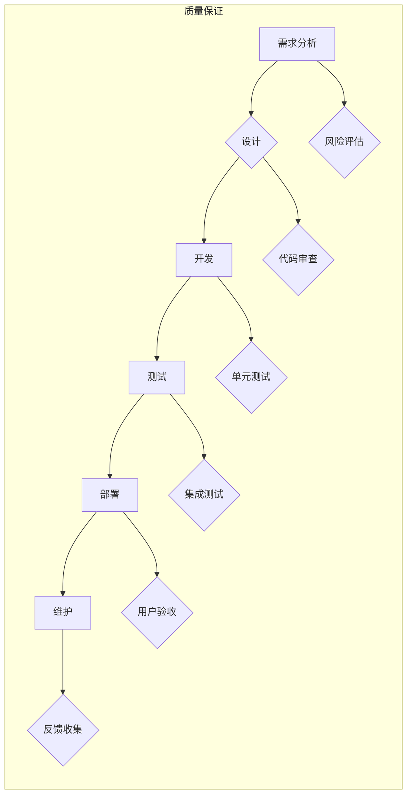

                 

## 大量输出:管理者学习质量的保证

> 关键词：质量保证, 大量输出, 软件开发, 测试策略, 自动化, 持续集成, DevOps

## 1. 背景介绍

在当今软件开发领域，速度和效率至关重要。敏捷开发、DevOps等理念的兴起，强调快速迭代、持续交付，推动了软件开发流程的加速。然而，在追求速度的同时，如何保证软件质量，确保交付的产品稳定可靠，成为了一个不容忽视的问题。

大量输出，即快速、频繁地交付软件版本，是现代软件开发的趋势。然而，大量输出也带来了新的挑战：如何有效地管理质量，确保每个版本都符合预期标准？

传统的质量保证方法，例如瀑布式开发中的严格测试阶段，在大量输出的环境下显得不够灵活和高效。因此，我们需要新的方法和工具，来应对大量输出带来的质量挑战。

## 2. 核心概念与联系

**2.1 质量保证的本质**

质量保证 (Quality Assurance，QA) 是软件开发过程中，确保软件产品符合用户需求和预期标准的系统性工作。它涵盖了整个软件生命周期，从需求分析到设计、开发、测试、部署和维护。

**2.2 大量输出与质量保证的关联**

大量输出的本质是提高软件开发的效率和速度，而质量保证的目标则是确保软件产品的稳定性和可靠性。两者看似矛盾，但实际上是相互促进的。

* **大量输出促进质量保证:** 频繁的迭代和交付，可以更快地发现和修复缺陷，从而提高软件质量。
* **质量保证保障大量输出:**  只有保证了软件质量，才能确保大量输出的软件版本能够稳定运行，并满足用户需求。

**2.3 核心概念架构**



## 3. 核心算法原理 & 具体操作步骤

**3.1 算法原理概述**

在大量输出的环境下，传统的测试方法难以满足需求。我们需要采用更加高效、自动化、持续的测试策略。

**3.2 算法步骤详解**

1. **单元测试:** 对软件的每个独立模块进行测试，确保每个模块的功能正确。
2. **集成测试:** 将多个模块组合在一起，进行整体测试，确保模块之间能够正常交互。
3. **系统测试:** 对整个软件系统进行测试，确保系统能够满足用户需求。
4. **回归测试:** 在每次代码修改后，重新执行所有相关的测试用例，确保修改没有引入新的缺陷。
5. **自动化测试:** 使用自动化工具，对重复性的测试用例进行自动化执行，提高测试效率。

**3.3 算法优缺点**

* **优点:** 提高测试效率，降低测试成本，提高软件质量。
* **缺点:** 需要投入时间和精力进行测试工具和用例的开发和维护。

**3.4 算法应用领域**

* 软件开发
* Web 应用开发
* 移动应用开发
* 游戏开发

## 4. 数学模型和公式 & 详细讲解 & 举例说明

**4.1 数学模型构建**

我们可以使用数学模型来量化软件质量。例如，我们可以使用以下公式来计算软件缺陷密度：

$$缺陷密度 = \frac{缺陷数量}{代码行数}$$

**4.2 公式推导过程**

该公式的推导过程如下：

* 缺陷密度是指软件中每行代码出现的缺陷数量。
* 缺陷数量和代码行数是可量化的指标。
* 将缺陷数量除以代码行数，即可得到软件缺陷密度。

**4.3 案例分析与讲解**

假设一个软件项目有 1000 行代码，其中发现 10 个缺陷，那么该软件的缺陷密度为：

$$缺陷密度 = \frac{10}{1000} = 0.01$$

这意味着每 100 行代码中平均存在 1 个缺陷。

## 5. 项目实践：代码实例和详细解释说明

**5.1 开发环境搭建**

* 操作系统: Ubuntu 20.04
* 编程语言: Python 3.8
* 测试框架: pytest

**5.2 源代码详细实现**

```python
def add(x, y):
    """
    This function adds two numbers.
    """
    return x + y

def subtract(x, y):
    """
    This function subtracts two numbers.
    """
    return x - y
```

**5.3 代码解读与分析**

* 该代码定义了两个函数: `add` 和 `subtract`。
* `add` 函数接收两个参数 `x` 和 `y`，并返回它们的和。
* `subtract` 函数接收两个参数 `x` 和 `y`，并返回它们的差。

**5.4 运行结果展示**

```
>>> add(2, 3)
5
>>> subtract(5, 2)
3
```

## 6. 实际应用场景

**6.1 软件开发流程中的质量保证**

在软件开发流程中，质量保证贯穿始终。从需求分析阶段开始，就需要考虑软件质量的因素。

* **需求分析:** 确保需求清晰、完整、可实现。
* **设计阶段:** 设计出符合用户需求、易于维护的软件架构。
* **开发阶段:** 编写高质量的代码，并进行单元测试。
* **测试阶段:** 对软件进行全面测试，确保软件功能正确、稳定可靠。
* **部署阶段:** 将软件部署到生产环境，并进行监控和维护。

**6.2 DevOps 时代下的质量保证**

DevOps 强调自动化、持续集成和持续交付。在 DevOps 时代，质量保证需要更加注重自动化和持续性。

* **自动化测试:** 使用自动化工具，对软件进行持续的测试，确保每次代码变更都经过测试。
* **持续集成:** 将代码变更频繁地集成到主分支，并进行自动化测试，及时发现和修复缺陷。
* **持续交付:** 将经过测试的软件版本自动部署到生产环境，确保软件能够快速交付给用户。

**6.4 未来应用展望**

随着人工智能和机器学习技术的进步，质量保证领域将迎来新的发展机遇。

* **智能化测试:** 使用人工智能技术，自动生成测试用例，提高测试效率。
* **缺陷预测:** 使用机器学习技术，预测软件缺陷的发生，并采取措施进行预防。
* **质量分析:** 使用人工智能技术，对软件质量进行更深入的分析，并提供改进建议。

## 7. 工具和资源推荐

**7.1 学习资源推荐**

* **书籍:**
    * 《软件测试艺术》
    * 《软件质量保证》
* **网站:**
    * https://www.guru99.com/software-testing-tutorial.html
    * https://www.softwaretestinghelp.com/

**7.2 开发工具推荐**

* **测试框架:** pytest, unittest, JUnit
* **自动化测试工具:** Selenium, Appium
* **持续集成工具:** Jenkins, GitLab CI

**7.3 相关论文推荐**

* **论文:**
    * "A Survey of Software Quality Assurance Techniques"
    * "Automated Software Testing: A Survey"

## 8. 总结：未来发展趋势与挑战

**8.1 研究成果总结**

大量输出和质量保证是现代软件开发中不可分割的两部分。通过采用自动化测试、持续集成和持续交付等方法，我们可以有效地管理质量，确保大量输出的软件版本能够稳定运行，并满足用户需求。

**8.2 未来发展趋势**

未来，质量保证领域将更加注重智能化、自动化和持续性。人工智能和机器学习技术将被更加广泛地应用于软件质量保证领域，例如智能化测试、缺陷预测和质量分析。

**8.3 面临的挑战**

* 如何在保证软件质量的同时，提高开发效率。
* 如何应对不断变化的软件需求和技术环境。
* 如何培养具备质量意识的开发人员。

**8.4 研究展望**

未来，我们需要继续探索新的质量保证方法和技术，以应对不断变化的软件开发环境。


## 9. 附录：常见问题与解答

**9.1 如何提高自动化测试的覆盖率？**

* 编写更加全面的测试用例。
* 使用代码覆盖率分析工具，识别未被测试的代码。
* 采用测试驱动开发 (TDD) 方法，在编写代码之前先编写测试用例。

**9.2 如何应对频繁的代码变更？**

* 使用持续集成和持续交付工具，将代码变更频繁地集成到主分支，并进行自动化测试。
* 使用版本控制系统，跟踪代码变更，并进行回滚操作。
* 采用敏捷开发方法，将软件开发周期缩短，并进行频繁的迭代和交付。


作者：禅与计算机程序设计艺术 / Zen and the Art of Computer Programming 
<end_of_turn>

