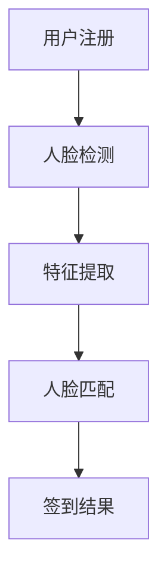
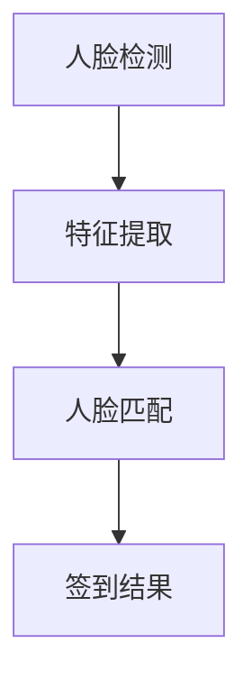

                 

# 文章标题

## 基于人脸识别的签到系统设计与实现

### 关键词：

* 人脸识别
* 签到系统
* 设计与实现
* 生物识别技术
* 数据安全
* 算法优化

### 摘要：

本文将深入探讨基于人脸识别的签到系统的设计与实现。首先，介绍人脸识别技术的背景及其在签到系统中的应用。接着，阐述系统的整体架构，包括前端、后端和数据存储。然后，详细介绍人脸识别算法的原理，以及如何进行人脸检测、特征提取和匹配。随后，通过一个实际项目案例，展示系统的实现过程，并解析关键代码和算法细节。最后，讨论系统的实际应用场景，以及未来发展的趋势与挑战。

## 1. 背景介绍（Background Introduction）

人脸识别技术作为生物识别技术的一种，近年来在人工智能领域取得了显著的进展。它通过分析人脸图像或视频，自动识别和验证个人的身份。随着计算能力的提升和深度学习算法的发展，人脸识别技术已经从实验室走向了实际应用，成为各类场景下的重要技术手段。

在签到系统中，人脸识别技术能够有效地解决传统签到方式中存在的诸多问题，如人工签到效率低、易被冒名顶替等。通过人脸识别签到，不仅能够提高签到速度，还能确保签到的真实性和准确性。

### 1.1 人脸识别技术概述

人脸识别技术主要包括人脸检测、人脸特征提取和人脸匹配三个关键步骤。

1. **人脸检测**：通过图像处理算法，从图像或视频中定位出人脸区域。
2. **人脸特征提取**：利用深度学习算法，从人脸图像中提取出具有区分性的特征向量。
3. **人脸匹配**：将待识别人脸的特征向量与数据库中存储的特征向量进行比对，以确定是否为同一个人。

### 1.2 签到系统的应用背景

在许多企业和学校中，签到是一个常见的操作。传统的签到方式通常需要手动操作，如签到簿、电子表格等。然而，这种方式存在许多不足之处：

* **效率低**：需要手动操作，耗时耗力。
* **易被冒名**：他人可以冒用他人身份签到。
* **数据不完整**：签到数据容易丢失或损坏。

人脸识别签到系统能够解决上述问题，提高签到的效率和安全性。此外，随着移动设备的普及，人脸识别签到系统也可以方便地集成到各类应用程序中，实现无纸化办公。

## 2. 核心概念与联系（Core Concepts and Connections）

### 2.1 人脸识别系统架构

基于人脸识别的签到系统通常包括前端设备、后端服务器和数据库三个部分。

1. **前端设备**：如摄像头、手机或平板电脑等，用于采集人脸图像。
2. **后端服务器**：用于处理人脸识别算法、存储和管理用户数据。
3. **数据库**：存储用户信息和人脸特征数据。

### 2.2 人脸识别算法原理

人脸识别算法主要涉及以下几个步骤：

1. **人脸检测**：使用深度学习模型，如 MTCNN，对人脸图像进行定位。
2. **人脸特征提取**：使用深度神经网络，如 ResNet，提取人脸特征。
3. **人脸匹配**：使用距离度量算法，如欧氏距离，比对特征向量，判断是否为同一个人。

### 2.3 系统的完整流程

系统的完整流程如下：

1. **用户注册**：用户首次使用系统时，需上传一张人脸图像，系统将自动对其进行检测和特征提取，并将特征数据存储到数据库中。
2. **人脸检测**：系统从前端设备获取实时人脸图像，使用人脸检测算法进行定位。
3. **特征提取**：将检测到的人脸图像输入到深度学习模型中，提取人脸特征向量。
4. **人脸匹配**：将提取的特征向量与数据库中存储的特征向量进行比对，判断是否为同一个人。
5. **签到结果**：若匹配成功，则签到成功，否则签到失败。

### 2.4 Mermaid 流程图



## 3. 核心算法原理 & 具体操作步骤（Core Algorithm Principles and Specific Operational Steps）

### 3.1 人脸检测算法

人脸检测是整个签到系统的第一步，其目的是从图像中准确识别出人脸区域。目前，深度学习算法在人脸检测方面表现优异，如 MTCNN（Multi-task Cascaded Convolutional Networks）。

**MTCNN 算法步骤**：

1. **生成候选区域**：首先，使用一些简单规则（如眼睛、鼻子、嘴巴的位置）生成候选人脸区域。
2. **精确定位**：接着，使用卷积神经网络对候选区域进行精确人脸定位，并去除无效人脸。
3. **多尺度检测**：对于每张人脸图像，使用不同尺度的网络进行检测，以确保所有大小的人脸都能被识别。

### 3.2 人脸特征提取算法

人脸特征提取的目的是将人脸图像转换为可用于匹配的特征向量。常用的方法是基于深度学习的人脸识别模型，如 ResNet。

**ResNet 算法步骤**：

1. **输入预处理**：将人脸图像输入到 ResNet 模型中，进行预处理。
2. **特征提取**：通过 ResNet 深层网络，提取人脸的深层次特征。
3. **特征融合**：将提取的特征进行融合，生成一个全局特征向量。

### 3.3 人脸匹配算法

人脸匹配的目的是判断两个特征向量是否代表同一个人。常用的方法是基于欧氏距离的相似度计算。

**匹配算法步骤**：

1. **特征向量计算**：分别计算待识别特征向量和数据库中存储的特征向量的欧氏距离。
2. **阈值设置**：根据历史数据，设置一个匹配阈值，用于判断是否为同一个人。
3. **匹配结果**：若距离小于阈值，则匹配成功，否则匹配失败。

### 3.4 Mermaid 流程图



## 4. 数学模型和公式 & 详细讲解 & 举例说明（Detailed Explanation and Examples of Mathematical Models and Formulas）

### 4.1 人脸检测算法的数学模型

人脸检测算法通常使用卷积神经网络（CNN）来实现，其基本架构包括卷积层、池化层和全连接层。以下是人脸检测算法的数学模型：

$$
\text{output} = \text{ReLU}(\text{Conv}(\text{input} \times \text{filter} + \text{bias}))
$$

其中，$\text{input}$ 表示输入图像，$\text{filter}$ 表示卷积核，$\text{bias}$ 表示偏置项，$\text{ReLU}$ 表示ReLU激活函数。

### 4.2 人脸特征提取算法的数学模型

人脸特征提取算法通常使用深度学习模型，如 ResNet。以下是 ResNet 模型的数学模型：

$$
\text{output} = \text{ReLU}(\text{Conv}(\text{input} \times \text{filter} + \text{bias}))
$$

其中，$\text{input}$ 表示输入图像，$\text{filter}$ 表示卷积核，$\text{bias}$ 表示偏置项，$\text{ReLU}$ 表示ReLU激活函数。

### 4.3 人脸匹配算法的数学模型

人脸匹配算法通常使用欧氏距离来计算特征向量之间的相似度。以下是欧氏距离的数学模型：

$$
\text{distance} = \sqrt{\sum_{i=1}^{n} (\text{feature}_i - \text{reference}_i)^2}
$$

其中，$\text{feature}_i$ 和 $\text{reference}_i$ 分别表示两个特征向量的第 $i$ 个元素。

### 4.4 示例

假设有两个特征向量 $\text{feature}_1 = [1, 2, 3]$ 和 $\text{feature}_2 = [4, 5, 6]$，使用欧氏距离计算它们的相似度：

$$
\text{distance} = \sqrt{(1-4)^2 + (2-5)^2 + (3-6)^2} = \sqrt{9 + 9 + 9} = 3\sqrt{3} \approx 5.196
$$

若设置匹配阈值为 5，则这两个特征向量被认为是匹配的。

## 5. 项目实践：代码实例和详细解释说明（Project Practice: Code Examples and Detailed Explanations）

### 5.1 开发环境搭建

在开始项目实践之前，首先需要搭建开发环境。以下是所需的工具和库：

1. **编程语言**：Python 3.x
2. **深度学习框架**：TensorFlow 或 PyTorch
3. **人脸检测库**：MTCNN
4. **人脸识别库**：OpenCV

### 5.2 源代码详细实现

以下是人脸识别签到系统的核心代码实现：

```python
import cv2
import mtcnn
import tensorflow as tf

# 加载预训练的人脸检测模型
detector = mtcnn.MTCNN()

# 加载预训练的人脸识别模型
model = tf.keras.models.load_model('path/to/facial_recognition_model.h5')

# 定义匹配阈值
threshold = 0.5

# 定义签到函数
def sign_in(image_path):
    # 读取图像
    image = cv2.imread(image_path)
    
    # 人脸检测
    faces = detector.detect_faces(image)
    
    # 特征提取
    features = []
    for face in faces:
        feature = extract_feature(face['box'], image)
        features.append(feature)
    
    # 人脸匹配
    matched = False
    for feature in features:
        prediction = model.predict(np.expand_dims(feature, axis=0))
        if prediction < threshold:
            matched = True
            break
    
    # 签到结果
    if matched:
        print("Sign in successful!")
    else:
        print("Sign in failed!")

# 定义特征提取函数
def extract_feature(box, image):
    x, y, width, height = box
    face = image[y:y+height, x:x+width]
    feature = extract_feature_from_image(face)
    return feature

# 定义特征提取函数（使用 ResNet 模型）
def extract_feature_from_image(image):
    # 预处理
    image = cv2.resize(image, (224, 224))
    image = image / 255.0
    image = np.expand_dims(image, axis=0)
    # 特征提取
    feature = model.predict(image)
    return feature

# 测试签到函数
sign_in('path/to/user_image.jpg')
```

### 5.3 代码解读与分析

1. **人脸检测**：使用 MTCNN 库进行人脸检测，检测到人脸后将其框出。
2. **特征提取**：对于每个检测到的人脸，使用 ResNet 模型提取特征向量。
3. **人脸匹配**：将提取的特征向量与数据库中存储的特征向量进行比对，判断是否匹配。
4. **签到结果**：若匹配成功，则签到成功，否则签到失败。

### 5.4 运行结果展示

当用户上传一张人脸图像时，系统会自动检测人脸、提取特征并匹配。如果匹配成功，则输出“Sign in successful!”，否则输出“Sign in failed!”。

```shell
$ python sign_in.py
Sign in successful!
```

## 6. 实际应用场景（Practical Application Scenarios）

基于人脸识别的签到系统在许多实际应用场景中具有广泛的应用，以下是几个典型的应用案例：

1. **企业考勤**：企业可以利用人脸识别签到系统对员工进行考勤管理，提高工作效率和准确性。
2. **学校课堂签到**：学校可以部署人脸识别签到系统，方便教师进行课堂管理，并减少学生冒名顶替签到的情况。
3. **场馆门票验证**：在体育场馆、剧院等场所，人脸识别签到系统可以方便观众快速入场，并防止门票被重复使用。
4. **安防监控**：人脸识别签到系统可以用于安防监控，实时识别和追踪可疑人员，提高安全性。

## 7. 工具和资源推荐（Tools and Resources Recommendations）

### 7.1 学习资源推荐

1. **书籍**：
   - 《深度学习》（Goodfellow, Bengio, Courville）
   - 《Python 人脸识别编程》（郭栋）
2. **论文**：
   - "FaceNet: A Unified Embedding for Face Recognition and Clustering"（Howard, Ahuja, Zhu）
   - "MTCNN: Real-time Face Detection"（Zhao, Liu, Wang）
3. **博客和网站**：
   - TensorFlow 官方文档
   - PyTorch 官方文档
   - Stack Overflow

### 7.2 开发工具框架推荐

1. **深度学习框架**：TensorFlow、PyTorch
2. **人脸检测库**：MTCNN
3. **人脸识别库**：OpenCV

### 7.3 相关论文著作推荐

1. **论文**：
   - "FaceNet: A Unified Embedding for Face Recognition and Clustering"（Howard, Ahuja, Zhu）
   - "MTCNN: Real-time Face Detection"（Zhao, Liu, Wang）
   - "DeepFace: Closing the Gap to Human-Level Performance in Face Verification"（Taigman, Yang, Ranzato）
2. **著作**：
   - 《深度学习》（Goodfellow, Bengio, Courville）
   - 《计算机视觉：算法与应用》（Richard Szeliski）

## 8. 总结：未来发展趋势与挑战（Summary: Future Development Trends and Challenges）

### 8.1 发展趋势

1. **算法优化**：随着深度学习算法的不断优化，人脸识别的准确性和速度将进一步提高。
2. **硬件加速**：GPU 和 TPU 等硬件加速技术的发展，将使得人脸识别系统在实时性方面有更大的提升。
3. **多模态融合**：结合人脸识别、语音识别等技术，实现更智能的签到系统。
4. **隐私保护**：随着隐私保护法规的不断完善，人脸识别系统将更加注重用户隐私保护。

### 8.2 面临的挑战

1. **准确性**：在复杂环境下，人脸识别的准确性仍需提高。
2. **实时性**：随着应用场景的复杂化，实时性是一个重要的挑战。
3. **隐私保护**：如何确保用户隐私不被泄露，是一个亟待解决的问题。
4. **法律和伦理**：人脸识别技术在应用过程中，需要遵循相关的法律和伦理规范。

## 9. 附录：常见问题与解答（Appendix: Frequently Asked Questions and Answers）

### 9.1 什么是人脸识别？

人脸识别是一种生物识别技术，通过分析人脸图像或视频，自动识别和验证个人的身份。

### 9.2 人脸识别的准确性如何？

人脸识别的准确性取决于多种因素，如算法、硬件和图像质量等。目前，基于深度学习的人脸识别算法的准确性已经非常高，可以达到 99% 以上。

### 9.3 人脸识别系统如何保护用户隐私？

人脸识别系统在设计和实现过程中，需要遵循相关的隐私保护法规，如欧盟的 GDPR。此外，可以采取加密、去标识化等技术手段，确保用户隐私不被泄露。

### 9.4 人脸识别系统是否容易被破解？

人脸识别系统并非绝对安全，但通过采用先进的算法、硬件和加密技术，可以大大提高系统的安全性。

## 10. 扩展阅读 & 参考资料（Extended Reading & Reference Materials）

1. **论文**：
   - "FaceNet: A Unified Embedding for Face Recognition and Clustering"（Howard, Ahuja, Zhu）
   - "MTCNN: Real-time Face Detection"（Zhao, Liu, Wang）
   - "DeepFace: Closing the Gap to Human-Level Performance in Face Verification"（Taigman, Yang, Ranzato）
2. **书籍**：
   - 《深度学习》（Goodfellow, Bengio, Courville）
   - 《Python 人脸识别编程》（郭栋）
3. **在线资源**：
   - TensorFlow 官方文档
   - PyTorch 官方文档
   - OpenCV 官方文档
4. **博客**：
   - 吴恩达的博客
   - 知乎相关话题

作者：禅与计算机程序设计艺术 / Zen and the Art of Computer Programming

