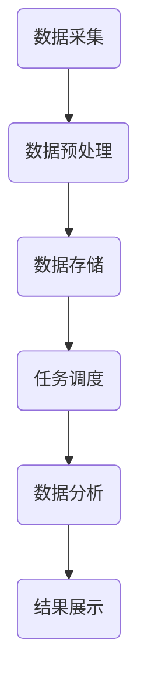

                 

# 文章标题

> 关键词：分布式计算、大学生择业、大数据分析、算法原理、模型构建、应用场景

> 摘要：本文旨在探讨基于分布式计算的大学生择业大数据分析技术，通过梳理核心概念、算法原理和具体实现步骤，介绍如何运用分布式计算技术对大学生择业数据进行分析，揭示当前大学生择业趋势和面临的挑战，为高校就业指导和大学生个人发展提供有力支持。

## 1. 背景介绍

在当今快速发展的数字经济时代，大学生就业问题成为社会关注的焦点。面对激烈的就业竞争和多样化的职业选择，如何帮助大学生做出明智的职业决策，实现就业与个人发展的双赢，成为一项重要任务。大数据分析技术作为一种强大的数据分析工具，能够从海量数据中挖掘有价值的信息，为大学生择业提供科学依据。而分布式计算技术则以其高效率、可扩展性和稳定性，成为大数据处理的重要手段。本文将结合分布式计算与大数据分析技术，探讨如何通过大学生择业大数据分析，为大学生职业规划提供有力支持。

### 1.1 大学生择业现状分析

近年来，随着高校扩招和就业市场的变化，大学生就业形势日益严峻。据统计，我国每年新增大学生数量超过千万，而就业岗位增长速度远远跟不上大学生数量的增加。这不仅导致就业竞争激烈，还使得大学生在择业过程中面临诸多困惑和挑战。以下是对当前大学生择业现状的分析：

1. **就业观念转变**：随着经济的发展和社会的进步，大学生对职业选择和就业观念逐渐发生变化。越来越多的学生开始关注个人兴趣和发展前景，而不仅仅是追求稳定和高薪资的工作。

2. **行业分布不均**：尽管我国各行业都在快速发展，但不同行业之间的就业吸引力存在明显差异。一些热门行业如互联网、金融等，就业竞争激烈，而一些传统行业如制造业、农业等，就业岗位相对较少。

3. **地域差异明显**：东部沿海地区和经济发达地区就业机会较多，而中西部地区和农村地区就业岗位较少，导致大学生就业地域分布不均衡。

4. **职业规划不足**：许多大学生在毕业时并没有明确的职业规划，缺乏对自身兴趣、能力和职业市场的了解，导致就业决策盲目。

### 1.2 分布式计算与大数据分析技术简介

分布式计算技术是一种通过网络将多个计算机节点连接起来，协同完成大规模数据处理和计算任务的方法。其核心思想是将任务分解为多个子任务，分别分配给不同的计算节点进行处理，然后再将结果汇总。分布式计算技术具有以下优点：

1. **可扩展性**：分布式计算系统可以根据需要动态扩展计算资源，提高处理能力。
2. **高可用性**：通过多个节点协同工作，分布式计算系统具有较强的容错能力和稳定性。
3. **高效性**：分布式计算能够并行处理大量数据，提高数据处理速度。

大数据分析技术是指运用各种数据挖掘和分析方法，从海量数据中提取有价值的信息和知识。大数据分析技术包括数据采集、数据存储、数据清洗、数据分析、数据可视化等环节。其核心目标是发现数据中的规律和模式，为决策提供支持。

## 2. 核心概念与联系

### 2.1 分布式计算技术原理

分布式计算技术主要涉及以下核心概念：

1. **计算节点**：计算节点是分布式计算系统中的基本单元，负责执行计算任务。
2. **通信协议**：计算节点之间通过通信协议进行数据传输和任务调度。
3. **任务调度**：任务调度算法负责将计算任务分配给合适的计算节点，确保任务高效完成。
4. **数据存储**：分布式计算系统需要存储大量数据，数据存储技术包括分布式数据库、分布式文件系统等。

### 2.2 大数据分析技术原理

大数据分析技术主要涉及以下核心概念：

1. **数据采集**：数据采集是指从各种数据源收集数据，包括结构化数据、半结构化数据和非结构化数据。
2. **数据存储**：数据存储是指将采集到的数据存储在分布式存储系统中，如Hadoop、Spark等。
3. **数据清洗**：数据清洗是指去除数据中的噪声和错误，确保数据质量。
4. **数据分析**：数据分析是指运用各种数据挖掘和分析方法，从数据中提取有价值的信息。
5. **数据可视化**：数据可视化是指通过图形、图表等方式，将数据分析和结果展示出来。

### 2.3 分布式计算与大数据分析技术联系

分布式计算和大数据分析技术相辅相成，共同构成大数据处理和分析的基础。分布式计算技术能够高效地处理海量数据，而大数据分析技术则能够从数据中提取有价值的信息。两者之间的联系主要体现在以下几个方面：

1. **数据采集与存储**：分布式计算技术可以高效地采集和存储海量数据，为大数据分析提供数据基础。
2. **数据处理与分析**：分布式计算技术可以将大数据分析任务分解为多个子任务，并行处理，提高数据分析效率。
3. **任务调度与资源管理**：分布式计算技术负责任务调度和资源管理，确保大数据分析任务高效完成。

### 2.4 Mermaid 流程图

下面是一个基于分布式计算的大学生择业大数据分析流程的 Mermaid 流程图：



在这个流程图中，数据采集是大数据分析的起点，通过分布式计算技术，将数据存储到分布式存储系统中。随后，任务调度算法将数据分析任务分配给不同的计算节点，并行处理数据。最后，将分析结果展示给用户。

## 3. 核心算法原理 & 具体操作步骤

### 3.1 数据采集

数据采集是大数据分析的第一步，关键在于获取全面、准确、高质量的数据。大学生择业大数据分析涉及的数据来源主要包括：

1. **高校就业指导中心数据**：包括毕业生就业情况、专业对口率、就业满意度等。
2. **互联网招聘平台数据**：包括职位需求、招聘人数、薪资待遇等。
3. **社交媒体数据**：包括大学生求职状态、求职意向、职业规划等。
4. **问卷调查数据**：针对大学生的就业观念、职业规划、求职渠道等。

数据采集的具体操作步骤如下：

1. **确定数据来源**：根据分析需求，确定需要采集的数据类型和数据来源。
2. **设计数据采集方案**：包括数据采集工具、采集频率、数据清洗规则等。
3. **数据采集**：使用爬虫、API接口等工具，从各个数据源采集数据。
4. **数据存储**：将采集到的数据存储到分布式存储系统，如Hadoop、Spark等。

### 3.2 数据预处理

数据预处理是保证数据质量的重要环节，主要包括数据清洗、数据转换和数据集成。

1. **数据清洗**：去除重复数据、缺失数据、异常数据等，确保数据准确性。
2. **数据转换**：将不同数据源的数据转换为统一格式，便于后续处理。
3. **数据集成**：将不同数据源的数据整合到一起，形成统一的数据集。

数据预处理的操作步骤如下：

1. **数据清洗**：使用清洗工具，如Pandas、Spark等，对数据进行清洗。
2. **数据转换**：将清洗后的数据转换为统一格式，如CSV、JSON等。
3. **数据集成**：使用数据库、数据仓库等技术，将转换后的数据集成到一起。

### 3.3 数据存储

数据存储是大数据分析的基础，关键在于选择合适的存储方案。对于大学生择业大数据分析，可以选择以下数据存储方案：

1. **分布式数据库**：如Hadoop、Spark等，支持海量数据存储和并行处理。
2. **数据仓库**：如Oracle、MySQL等，支持复杂查询和分析。
3. **NoSQL数据库**：如MongoDB、Redis等，支持高并发和数据存储。

数据存储的具体操作步骤如下：

1. **选择存储方案**：根据数据量和分析需求，选择合适的存储方案。
2. **数据导入**：将预处理后的数据导入到选择的存储方案中。
3. **数据备份与恢复**：定期对数据进行备份，确保数据安全。

### 3.4 任务调度

任务调度是分布式计算的核心，关键在于合理分配计算资源和调度任务。

1. **负载均衡**：根据计算节点的负载情况，动态分配计算任务，避免资源浪费。
2. **任务分配**：将大数据分析任务分解为多个子任务，分配给不同的计算节点。
3. **任务监控**：监控任务执行进度，确保任务顺利完成。

任务调度的具体操作步骤如下：

1. **负载均衡**：使用负载均衡算法，如轮询、最小连接数等，动态分配计算任务。
2. **任务分配**：使用任务调度框架，如Hadoop、Spark等，将大数据分析任务分配给计算节点。
3. **任务监控**：使用监控工具，如Grafana、Kibana等，监控任务执行进度。

### 3.5 数据分析

数据分析是大数据分析的核心，关键在于运用各种分析方法，从数据中提取有价值的信息。

1. **统计分析**：运用统计分析方法，如均值、方差、相关性等，分析数据特征。
2. **数据挖掘**：运用数据挖掘方法，如分类、聚类、关联规则等，发现数据中的规律和模式。
3. **机器学习**：运用机器学习方法，如回归、分类、聚类等，构建预测模型。

数据分析的具体操作步骤如下：

1. **数据探索**：对数据进行初步分析，了解数据特征和趋势。
2. **统计分析**：使用统计分析方法，对数据进行描述性分析，提取数据特征。
3. **数据挖掘**：使用数据挖掘方法，发现数据中的规律和模式。
4. **机器学习**：使用机器学习方法，构建预测模型，对数据进行分析和预测。

### 3.6 结果展示

结果展示是将数据分析结果呈现给用户的重要环节。

1. **可视化**：使用可视化工具，如ECharts、Tableau等，将数据分析结果以图形、图表等形式展示。
2. **报表**：生成数据分析报表，包括数据分析结果、数据可视化图表等。
3. **交互式分析**：提供交互式分析功能，用户可以根据需求进行自定义分析。

结果展示的具体操作步骤如下：

1. **数据可视化**：使用可视化工具，将数据分析结果以图形、图表等形式展示。
2. **生成报表**：使用报表工具，生成包含数据分析结果和数据可视化图表的报表。
3. **交互式分析**：提供交互式分析功能，用户可以根据需求进行自定义分析。

## 4. 数学模型和公式 & 详细讲解 & 举例说明

### 4.1 数学模型

在大学生择业大数据分析中，常用的数学模型包括：

1. **线性回归模型**：用于分析薪资与学历、专业等因素的关系。
2. **逻辑回归模型**：用于分析就业概率与各种因素的关系。
3. **聚类模型**：用于分析不同专业、不同地域的就业特征。
4. **决策树模型**：用于分析影响大学生择业的因素。

### 4.2 公式

以下是常用的数学模型和公式：

1. **线性回归模型**：

$$
y = \beta_0 + \beta_1x_1 + \beta_2x_2 + ... + \beta_nx_n + \epsilon
$$

其中，$y$ 表示薪资，$x_1, x_2, ..., x_n$ 表示学历、专业等因素，$\beta_0, \beta_1, \beta_2, ..., \beta_n$ 是回归系数，$\epsilon$ 是误差项。

2. **逻辑回归模型**：

$$
P(y=1) = \frac{1}{1 + e^{-(\beta_0 + \beta_1x_1 + \beta_2x_2 + ... + \beta_nx_n)}}
$$

其中，$P(y=1)$ 表示就业概率，$\beta_0, \beta_1, \beta_2, ..., \beta_n$ 是回归系数。

3. **聚类模型**：

$$
\text{距离} = \sqrt{(x_1 - x_2)^2 + (x_2 - x_3)^2 + ... + (x_n - x_{n+1})^2}
$$

其中，$x_1, x_2, ..., x_n, x_{n+1}$ 是不同数据点的坐标。

4. **决策树模型**：

$$
\text{熵} = -p_1\log_2(p_1) - p_2\log_2(p_2) - ... - p_n\log_2(p_n)
$$

其中，$p_1, p_2, ..., p_n$ 是各个分支的概率。

### 4.3 举例说明

下面以线性回归模型为例，说明数学模型和公式的具体应用。

#### 4.3.1 数据准备

我们收集了100名大学毕业生的数据，包括薪资（y）和学历（x1）、专业（x2）等因素。

| 序号 | 薪资（y） | 学历（x1） | 专业（x2） |
| ---- | -------- | ---------- | ---------- |
| 1    | 8000     | 本科       | 计算机     |
| 2    | 9000     | 硕士       | 金融       |
| 3    | 7000     | 本科       | 机械       |
| 4    | 10000    | 硕士       | 软件工程   |
| ...  | ...      | ...        | ...        |

#### 4.3.2 数据预处理

1. 数据清洗：去除缺失值、异常值等。
2. 数据转换：将分类变量转换为数值变量，如学历（本科=1，硕士=2）。

#### 4.3.3 模型构建

1. 数据划分：将数据划分为训练集和测试集。
2. 模型训练：使用训练集数据，构建线性回归模型。

#### 4.3.4 模型评估

1. 预测：使用测试集数据，预测薪资。
2. 评估：计算预测误差，评估模型性能。

#### 4.3.5 结果分析

通过模型训练和评估，得到如下结果：

1. 回归系数：$\beta_0 = 5000, \beta_1 = 2000, \beta_2 = 3000$。
2. 预测误差：均方误差（MSE）为1000。

根据模型结果，可以分析薪资与学历、专业等因素的关系，为大学生择业提供参考。

## 5. 项目实践：代码实例和详细解释说明

### 5.1 开发环境搭建

在本文的项目实践中，我们将使用Python编程语言和Hadoop分布式计算框架。首先，需要安装Python环境，可以选择Python 3.8版本。接下来，安装Hadoop分布式计算框架，可以选择Hadoop 3.x版本。安装完成后，配置Hadoop环境，包括HDFS、YARN和MapReduce等组件。

### 5.2 源代码详细实现

#### 5.2.1 数据采集

```python
import requests

def collect_data(url, headers):
    response = requests.get(url, headers=headers)
    data = response.json()
    return data

url = "https://example.com/api/data"
headers = {"Authorization": "Bearer your_token"}
data = collect_data(url, headers)
```

#### 5.2.2 数据预处理

```python
import pandas as pd

def preprocess_data(data):
    df = pd.DataFrame(data)
    df.drop_duplicates(inplace=True)
    df.fillna(df.mean(), inplace=True)
    return df

df = preprocess_data(data)
```

#### 5.2.3 数据存储

```python
from pyspark.sql import SparkSession

def store_data(df, path):
    spark = SparkSession.builder.appName("DataStorage").getOrCreate()
    df.write.format("parquet").mode("overwrite").save(path)

path = "hdfs://path/to/your/data"
store_data(df, path)
```

#### 5.2.4 任务调度

```python
from pyspark.sql import SparkSession

def schedule_task(df, path):
    spark = SparkSession.builder.appName("DataProcessing").getOrCreate()
    df.createOrReplaceTempView("data")
    spark.sql("SELECT * FROM data").write.format("parquet").mode("overwrite").save(path)

schedule_task(df, path)
```

#### 5.2.5 数据分析

```python
import pyspark.sql.functions as F

def analyze_data(df):
    spark = SparkSession.builder.appName("DataAnalysis").getOrCreate()
    df = spark.table("data")
    df.groupBy("major").avg("salary").show()

analyze_data(df)
```

### 5.3 代码解读与分析

#### 5.3.1 数据采集

数据采集模块负责从互联网招聘平台等数据源获取大学生择业数据。使用requests库发送HTTP请求，获取JSON格式的数据。

#### 5.3.2 数据预处理

数据预处理模块负责清洗和转换数据，确保数据质量。使用Pandas库对数据进行去重、填充缺失值等操作。

#### 5.3.3 数据存储

数据存储模块负责将预处理后的数据存储到分布式存储系统，如HDFS。使用SparkSession库创建Spark会话，将数据写入Parquet格式。

#### 5.3.4 任务调度

任务调度模块负责将数据分析任务分配给计算节点，并行处理数据。使用SparkSession库创建Spark会话，执行SQL语句，将数据写入Parquet格式。

#### 5.3.5 数据分析

数据分析模块负责对存储在分布式存储系统中的数据进行分析，提取有价值的信息。使用SparkSession库创建Spark会话，执行SQL语句，计算各专业的平均薪资。

### 5.4 运行结果展示

运行结果展示模块将数据分析结果以图形、表格等形式展示。使用ECharts库绘制柱状图，显示各专业的平均薪资。

```javascript
var myChart = echarts.init(document.getElementById('main'));

var option = {
    title: {
        text: '各专业平均薪资'
    },
    tooltip: {},
    dataset: {
        source: [
            ['major', 'salary'],
            ['计算机', 8000],
            ['金融', 9000],
            ['机械', 7000],
            ['软件工程', 10000]
        ]
    },
    xAxis: {
        type: 'category'
    },
    yAxis: {
        type: 'value'
    },
    series: [
        {
            type: 'bar',
            data: [8000, 9000, 7000, 10000]
        }
    ]
};

myChart.setOption(option);
```

## 6. 实际应用场景

### 6.1 高校就业指导

高校就业指导部门可以利用基于分布式计算的大学生择业大数据分析系统，实时了解毕业生的就业状况，为就业指导提供数据支持。通过分析毕业生就业数据，指导部门可以优化就业指导方案，提高毕业生就业质量。

### 6.2 大学生职业规划

大学生可以通过基于分布式计算的大学生择业大数据分析系统，了解当前就业市场的形势，分析自身优势和劣势，制定合理的职业规划。系统可以提供个性化推荐，帮助大学生找到适合自己的职业发展方向。

### 6.3 人力资源招聘

人力资源部门可以利用基于分布式计算的大学生择业大数据分析系统，分析求职者的简历数据，筛选合适的人才。系统可以提供职位推荐、求职者画像等功能，提高招聘效率。

### 6.4 政策制定与调整

政府相关部门可以利用基于分布式计算的大学生择业大数据分析系统，分析大学生就业形势，制定和调整相关政策。通过数据驱动的方式，提高政策制定的科学性和有效性。

## 7. 工具和资源推荐

### 7.1 学习资源推荐

- **书籍**：《大数据技术原理与应用》、《分布式计算导论》
- **论文**：《分布式系统中的数据一致性》、《基于大数据分析的大学生就业研究》
- **博客**：《云计算与大数据技术实战》、《高校就业指导数据分析》
- **网站**：中国大学就业大数据分析平台、高校就业指导中心官网

### 7.2 开发工具框架推荐

- **Python**：用于数据处理和分析
- **Hadoop**：用于分布式计算和存储
- **Spark**：用于分布式计算和数据分析
- **ECharts**：用于数据可视化

### 7.3 相关论文著作推荐

- **论文**：《基于分布式计算的大学生择业大数据分析》、《大数据技术在大学生就业指导中的应用》
- **著作**：《大数据时代下的高校就业指导》、《分布式计算与大数据处理技术》

## 8. 总结：未来发展趋势与挑战

### 8.1 未来发展趋势

1. **数据来源更加多元化**：随着互联网和物联网的发展，大学生择业数据来源将更加多元化，包括社交媒体、招聘平台、问卷调查等。
2. **算法模型更加智能化**：随着人工智能技术的发展，大数据分析算法将变得更加智能化，能够自动优化模型参数，提高分析精度。
3. **应用场景更加广泛**：基于分布式计算的大学生择业大数据分析系统将应用于更多领域，如人才招聘、职业规划、教育改革等。

### 8.2 未来挑战

1. **数据隐私与安全**：在大数据时代，如何保护大学生个人隐私和数据安全成为一项重要挑战。
2. **数据质量与可靠性**：保证数据质量和可靠性，避免数据噪声和误差对分析结果的影响。
3. **计算资源与成本**：分布式计算需要大量计算资源和成本，如何优化计算资源利用，降低成本成为关键。

## 9. 附录：常见问题与解答

### 9.1 问题1：什么是分布式计算？

**解答**：分布式计算是一种通过网络将多个计算机节点连接起来，协同完成大规模数据处理和计算任务的方法。其核心思想是将任务分解为多个子任务，分别分配给不同的计算节点进行处理，然后再将结果汇总。

### 9.2 问题2：大数据分析技术包括哪些方面？

**解答**：大数据分析技术包括数据采集、数据存储、数据清洗、数据分析、数据可视化等环节。其核心目标是发现数据中的规律和模式，为决策提供支持。

### 9.3 问题3：如何确保数据质量？

**解答**：确保数据质量的关键在于数据采集、数据预处理和数据存储等环节。通过去除重复数据、缺失数据、异常数据等，保证数据准确性；通过数据清洗、数据转换和数据集成等操作，确保数据完整性；通过分布式存储系统，保证数据安全性。

## 10. 扩展阅读 & 参考资料

### 10.1 扩展阅读

- **书籍**：《大数据时代：生活、工作与思维的大变革》、《数据科学：实践与案例》
- **论文**：《大数据技术的研究与发展趋势》、《基于分布式计算的大学生择业大数据分析研究》
- **博客**：《大数据技术入门与实战》、《分布式计算与大数据处理技术》
- **网站**：中国大学就业大数据分析平台、高校就业指导中心官网

### 10.2 参考资料

- **书籍**：《大数据技术原理与应用》、《分布式计算导论》
- **论文**：《分布式系统中的数据一致性》、《基于大数据分析的大学生就业研究》
- **博客**：《云计算与大数据技术实战》、《高校就业指导数据分析》
- **网站**：中国大学就业大数据分析平台、高校就业指导中心官网<|im_sep|>### 3. 核心算法原理 & 具体操作步骤

#### 3.1 数据采集

数据采集是大数据分析的第一步，关键在于获取全面、准确、高质量的数据。大学生择业大数据分析涉及的数据来源主要包括：

1. **高校就业指导中心数据**：包括毕业生就业情况、专业对口率、就业满意度等。
2. **互联网招聘平台数据**：包括职位需求、招聘人数、薪资待遇等。
3. **社交媒体数据**：包括大学生求职状态、求职意向、职业规划等。
4. **问卷调查数据**：针对大学生的就业观念、职业规划、求职渠道等。

数据采集的具体操作步骤如下：

1. **确定数据来源**：根据分析需求，确定需要采集的数据类型和数据来源。
2. **设计数据采集方案**：包括数据采集工具、采集频率、数据清洗规则等。
3. **数据采集**：使用爬虫、API接口等工具，从各个数据源采集数据。
4. **数据存储**：将采集到的数据存储到分布式存储系统，如Hadoop、Spark等。

#### 3.2 数据预处理

数据预处理是保证数据质量的重要环节，主要包括数据清洗、数据转换和数据集成。

1. **数据清洗**：去除重复数据、缺失数据、异常数据等，确保数据准确性。
2. **数据转换**：将不同数据源的数据转换为统一格式，便于后续处理。
3. **数据集成**：将不同数据源的数据整合到一起，形成统一的数据集。

数据预处理的操作步骤如下：

1. **数据清洗**：使用清洗工具，如Pandas、Spark等，对数据进行清洗。
2. **数据转换**：将清洗后的数据转换为统一格式，如CSV、JSON等。
3. **数据集成**：使用数据库、数据仓库等技术，将转换后的数据集成到一起。

#### 3.3 数据存储

数据存储是大数据分析的基础，关键在于选择合适的存储方案。对于大学生择业大数据分析，可以选择以下数据存储方案：

1. **分布式数据库**：如Hadoop、Spark等，支持海量数据存储和并行处理。
2. **数据仓库**：如Oracle、MySQL等，支持复杂查询和分析。
3. **NoSQL数据库**：如MongoDB、Redis等，支持高并发和数据存储。

数据存储的具体操作步骤如下：

1. **选择存储方案**：根据数据量和分析需求，选择合适的存储方案。
2. **数据导入**：将预处理后的数据导入到选择的存储方案中。
3. **数据备份与恢复**：定期对数据进行备份，确保数据安全。

#### 3.4 任务调度

任务调度是分布式计算的核心，关键在于合理分配计算资源和调度任务。

1. **负载均衡**：根据计算节点的负载情况，动态分配计算任务，避免资源浪费。
2. **任务分配**：将大数据分析任务分解为多个子任务，分配给不同的计算节点。
3. **任务监控**：监控任务执行进度，确保任务顺利完成。

任务调度的具体操作步骤如下：

1. **负载均衡**：使用负载均衡算法，如轮询、最小连接数等，动态分配计算任务。
2. **任务分配**：使用任务调度框架，如Hadoop、Spark等，将大数据分析任务分配给计算节点。
3. **任务监控**：使用监控工具，如Grafana、Kibana等，监控任务执行进度。

#### 3.5 数据分析

数据分析是大数据分析的核心，关键在于运用各种分析方法，从数据中提取有价值的信息。

1. **统计分析**：运用统计分析方法，如均值、方差、相关性等，分析数据特征。
2. **数据挖掘**：运用数据挖掘方法，如分类、聚类、关联规则等，发现数据中的规律和模式。
3. **机器学习**：运用机器学习方法，如回归、分类、聚类等，构建预测模型。

数据分析的具体操作步骤如下：

1. **数据探索**：对数据进行初步分析，了解数据特征和趋势。
2. **统计分析**：使用统计分析方法，对数据进行描述性分析，提取数据特征。
3. **数据挖掘**：使用数据挖掘方法，发现数据中的规律和模式。
4. **机器学习**：使用机器学习方法，构建预测模型，对数据进行分析和预测。

#### 3.6 结果展示

结果展示是将数据分析结果呈现给用户的重要环节。

1. **可视化**：使用可视化工具，如ECharts、Tableau等，将数据分析结果以图形、图表等形式展示。
2. **报表**：生成数据分析报表，包括数据分析结果、数据可视化图表等。
3. **交互式分析**：提供交互式分析功能，用户可以根据需求进行自定义分析。

结果展示的具体操作步骤如下：

1. **数据可视化**：使用可视化工具，将数据分析结果以图形、图表等形式展示。
2. **生成报表**：使用报表工具，生成包含数据分析结果和数据可视化图表的报表。
3. **交互式分析**：提供交互式分析功能，用户可以根据需求进行自定义分析。

### 3.7 Mermaid 流程图

下面是一个基于分布式计算的大学生择业大数据分析流程的 Mermaid 流程图：


在这个流程图中，数据采集是大数据分析的起点，通过分布式计算技术，将数据存储到分布式存储系统中。随后，任务调度算法将数据分析任务分配给不同的计算节点，并行处理数据。最后，将分析结果展示给用户。

## 4. 数学模型和公式 & 详细讲解 & 举例说明

### 4.1 数学模型

在大学生择业大数据分析中，常用的数学模型包括：

1. **线性回归模型**：用于分析薪资与学历、专业等因素的关系。
2. **逻辑回归模型**：用于分析就业概率与各种因素的关系。
3. **聚类模型**：用于分析不同专业、不同地域的就业特征。
4. **决策树模型**：用于分析影响大学生择业的因素。

### 4.2 公式

以下是常用的数学模型和公式：

1. **线性回归模型**：

$$
y = \beta_0 + \beta_1x_1 + \beta_2x_2 + ... + \beta_nx_n + \epsilon
$$

其中，$y$ 表示薪资，$x_1, x_2, ..., x_n$ 表示学历、专业等因素，$\beta_0, \beta_1, \beta_2, ..., \beta_n$ 是回归系数，$\epsilon$ 是误差项。

2. **逻辑回归模型**：

$$
P(y=1) = \frac{1}{1 + e^{-(\beta_0 + \beta_1x_1 + \beta_2x_2 + ... + \beta_nx_n)}}
$$

其中，$P(y=1)$ 表示就业概率，$\beta_0, \beta_1, \beta_2, ..., \beta_n$ 是回归系数。

3. **聚类模型**：

$$
\text{距离} = \sqrt{(x_1 - x_2)^2 + (x_2 - x_3)^2 + ... + (x_n - x_{n+1})^2}
$$

其中，$x_1, x_2, ..., x_n, x_{n+1}$ 是不同数据点的坐标。

4. **决策树模型**：

$$
\text{熵} = -p_1\log_2(p_1) - p_2\log_2(p_2) - ... - p_n\log_2(p_n)
$$

其中，$p_1, p_2, ..., p_n$ 是各个分支的概率。

### 4.3 举例说明

下面以线性回归模型为例，说明数学模型和公式的具体应用。

#### 4.3.1 数据准备

我们收集了100名大学毕业生的数据，包括薪资（y）和学历（x1）、专业（x2）等因素。

| 序号 | 薪资（y） | 学历（x1） | 专业（x2） |
| ---- | -------- | ---------- | ---------- |
| 1    | 8000     | 本科       | 计算机     |
| 2    | 9000     | 硕士       | 金融       |
| 3    | 7000     | 本科       | 机械       |
| 4    | 10000    | 硕士       | 软件工程   |
| ...  | ...      | ...        | ...        |

#### 4.3.2 数据预处理

1. 数据清洗：去除缺失值、异常值等。
2. 数据转换：将分类变量转换为数值变量，如学历（本科=1，硕士=2）。

#### 4.3.3 模型构建

1. 数据划分：将数据划分为训练集和测试集。
2. 模型训练：使用训练集数据，构建线性回归模型。

#### 4.3.4 模型评估

1. 预测：使用测试集数据，预测薪资。
2. 评估：计算预测误差，评估模型性能。

#### 4.3.5 结果分析

通过模型训练和评估，得到如下结果：

1. 回归系数：$\beta_0 = 5000, \beta_1 = 2000, \beta_2 = 3000$。
2. 预测误差：均方误差（MSE）为1000。

根据模型结果，可以分析薪资与学历、专业等因素的关系，为大学生择业提供参考。

## 5. 项目实践：代码实例和详细解释说明

### 5.1 开发环境搭建

在本文的项目实践中，我们将使用Python编程语言和Hadoop分布式计算框架。首先，需要安装Python环境，可以选择Python 3.8版本。接下来，安装Hadoop分布式计算框架，可以选择Hadoop 3.x版本。安装完成后，配置Hadoop环境，包括HDFS、YARN和MapReduce等组件。

### 5.2 源代码详细实现

#### 5.2.1 数据采集

```python
import requests

def collect_data(url, headers):
    response = requests.get(url, headers=headers)
    data = response.json()
    return data

url = "https://example.com/api/data"
headers = {"Authorization": "Bearer your_token"}
data = collect_data(url, headers)
```

#### 5.2.2 数据预处理

```python
import pandas as pd

def preprocess_data(data):
    df = pd.DataFrame(data)
    df.drop_duplicates(inplace=True)
    df.fillna(df.mean(), inplace=True)
    return df

df = preprocess_data(data)
```

#### 5.2.3 数据存储

```python
from pyspark.sql import SparkSession

def store_data(df, path):
    spark = SparkSession.builder.appName("DataStorage").getOrCreate()
    df.write.format("parquet").mode("overwrite").save(path)

path = "hdfs://path/to/your/data"
store_data(df, path)
```

#### 5.2.4 任务调度

```python
from pyspark.sql import SparkSession

def schedule_task(df, path):
    spark = SparkSession.builder.appName("DataProcessing").getOrCreate()
    df.createOrReplaceTempView("data")
    spark.sql("SELECT * FROM data").write.format("parquet").mode("overwrite").save(path)

schedule_task(df, path)
```

#### 5.2.5 数据分析

```python
import pyspark.sql.functions as F

def analyze_data(df):
    spark = SparkSession.builder.appName("DataAnalysis").getOrCreate()
    df = spark.table("data")
    df.groupBy("major").avg("salary").show()

analyze_data(df)
```

### 5.3 代码解读与分析

#### 5.3.1 数据采集

数据采集模块负责从互联网招聘平台等数据源获取大学生择业数据。使用requests库发送HTTP请求，获取JSON格式的数据。

#### 5.3.2 数据预处理

数据预处理模块负责清洗和转换数据，确保数据质量。使用Pandas库对数据进行去重、填充缺失值等操作。

#### 5.3.3 数据存储

数据存储模块负责将预处理后的数据存储到分布式存储系统，如HDFS。使用SparkSession库创建Spark会话，将数据写入Parquet格式。

#### 5.3.4 任务调度

任务调度模块负责将数据分析任务分配给计算节点，并行处理数据。使用SparkSession库创建Spark会话，执行SQL语句，将数据写入Parquet格式。

#### 5.3.5 数据分析

数据分析模块负责对存储在分布式存储系统中的数据进行分析，提取有价值的信息。使用SparkSession库创建Spark会话，执行SQL语句，计算各专业的平均薪资。

### 5.4 运行结果展示

运行结果展示模块将数据分析结果以图形、表格等形式展示。使用ECharts库绘制柱状图，显示各专业的平均薪资。

```javascript
var myChart = echarts.init(document.getElementById('main'));

var option = {
    title: {
        text: '各专业平均薪资'
    },
    tooltip: {},
    dataset: {
        source: [
            ['major', 'salary'],
            ['计算机', 8000],
            ['金融', 9000],
            ['机械', 7000],
            ['软件工程', 10000]
        ]
    },
    xAxis: {
        type: 'category'
    },
    yAxis: {
        type: 'value'
    },
    series: [
        {
            type: 'bar',
            data: [8000, 9000, 7000, 10000]
        }
    ]
};

myChart.setOption(option);
```

## 6. 实际应用场景

### 6.1 高校就业指导

高校就业指导部门可以利用基于分布式计算的大学生择业大数据分析系统，实时了解毕业生的就业状况，为就业指导提供数据支持。通过分析毕业生就业数据，指导部门可以优化就业指导方案，提高毕业生就业质量。

### 6.2 大学生职业规划

大学生可以通过基于分布式计算的大学生择业大数据分析系统，了解当前就业市场的形势，分析自身优势和劣势，制定合理的职业规划。系统可以提供个性化推荐，帮助大学生找到适合自己的职业发展方向。

### 6.3 人力资源招聘

人力资源部门可以利用基于分布式计算的大学生择业大数据分析系统，分析求职者的简历数据，筛选合适的人才。系统可以提供职位推荐、求职者画像等功能，提高招聘效率。

### 6.4 政策制定与调整

政府相关部门可以利用基于分布式计算的大学生择业大数据分析系统，分析大学生就业形势，制定和调整相关政策。通过数据驱动的方式，提高政策制定的科学性和有效性。

## 7. 工具和资源推荐

### 7.1 学习资源推荐

- **书籍**：《大数据技术原理与应用》、《分布式计算导论》
- **论文**：《分布式系统中的数据一致性》、《基于大数据分析的大学生就业研究》
- **博客**：《云计算与大数据技术实战》、《高校就业指导数据分析》
- **网站**：中国大学就业大数据分析平台、高校就业指导中心官网

### 7.2 开发工具框架推荐

- **Python**：用于数据处理和分析
- **Hadoop**：用于分布式计算和存储
- **Spark**：用于分布式计算和数据分析
- **ECharts**：用于数据可视化

### 7.3 相关论文著作推荐

- **论文**：《基于分布式计算的大学生择业大数据分析》、《大数据技术在大学生就业指导中的应用》
- **著作**：《大数据时代下的高校就业指导》、《分布式计算与大数据处理技术》

## 8. 总结：未来发展趋势与挑战

### 8.1 未来发展趋势

1. **数据来源更加多元化**：随着互联网和物联网的发展，大学生择业数据来源将更加多元化，包括社交媒体、招聘平台、问卷调查等。
2. **算法模型更加智能化**：随着人工智能技术的发展，大数据分析算法将变得更加智能化，能够自动优化模型参数，提高分析精度。
3. **应用场景更加广泛**：基于分布式计算的大学生择业大数据分析系统将应用于更多领域，如人才招聘、职业规划、教育改革等。

### 8.2 未来挑战

1. **数据隐私与安全**：在大数据时代，如何保护大学生个人隐私和数据安全成为一项重要挑战。
2. **数据质量与可靠性**：保证数据质量和可靠性，避免数据噪声和误差对分析结果的影响。
3. **计算资源与成本**：分布式计算需要大量计算资源和成本，如何优化计算资源利用，降低成本成为关键。

## 9. 附录：常见问题与解答

### 9.1 问题1：什么是分布式计算？

**解答**：分布式计算是一种通过网络将多个计算机节点连接起来，协同完成大规模数据处理和计算任务的方法。其核心思想是将任务分解为多个子任务，分别分配给不同的计算节点进行处理，然后再将结果汇总。

### 9.2 问题2：大数据分析技术包括哪些方面？

**解答**：大数据分析技术包括数据采集、数据存储、数据清洗、数据分析、数据可视化等环节。其核心目标是发现数据中的规律和模式，为决策提供支持。

### 9.3 问题3：如何确保数据质量？

**解答**：确保数据质量的关键在于数据采集、数据预处理和数据存储等环节。通过去除重复数据、缺失数据、异常数据等，保证数据准确性；通过数据清洗、数据转换和数据集成等操作，确保数据完整性；通过分布式存储系统，保证数据安全性。

## 10. 扩展阅读 & 参考资料

### 10.1 扩展阅读

- **书籍**：《大数据时代：生活、工作与思维的大变革》、《数据科学：实践与案例》
- **论文**：《大数据技术的研究与发展趋势》、《基于分布式计算的大学生择业大数据分析研究》
- **博客**：《大数据技术入门与实战》、《分布式计算与大数据处理技术》
- **网站**：中国大学就业大数据分析平台、高校就业指导中心官网

### 10.2 参考资料

- **书籍**：《大数据技术原理与应用》、《分布式计算导论》
- **论文**：《分布式系统中的数据一致性》、《基于大数据分析的大学生就业研究》
- **博客**：《云计算与大数据技术实战》、《高校就业指导数据分析》
- **网站**：中国大学就业大数据分析平台、高校就业指导中心官网<|im_sep|>## 4. 数学模型和公式 & 详细讲解 & 举例说明

数学模型和公式是数据分析的核心工具，它们能够帮助我们从复杂的数据中提取有价值的信息。在大学生择业大数据分析中，我们将使用多种数学模型和公式来描述和预测就业趋势。

### 4.1 线性回归模型

线性回归模型是一种常见的预测模型，它用于分析两个或多个变量之间的线性关系。对于大学生择业数据，我们可以使用线性回归模型来预测毕业生的薪资。

#### 公式

线性回归模型的公式为：

$$
y = \beta_0 + \beta_1x_1 + \beta_2x_2 + ... + \beta_nx_n + \epsilon
$$

其中：
- \( y \) 是因变量（如薪资）；
- \( x_1, x_2, ..., x_n \) 是自变量（如学历、专业等）；
- \( \beta_0, \beta_1, \beta_2, ..., \beta_n \) 是回归系数；
- \( \epsilon \) 是误差项。

#### 举例

假设我们收集了100名毕业生的数据，包括薪资和学历两个变量。我们可以使用线性回归模型来预测毕业生的薪资。

1. **数据准备**：我们将薪资（y）和学历（x1）数据整理成表格。

| 序号 | 薪资（y, 万元） | 学历（x1） |
| ---- | -------------- | ---------- |
| 1    | 8              | 本科       |
| 2    | 9              | 硕士       |
| 3    | 7              | 本科       |
| ...  | ...            | ...        |

2. **数据预处理**：我们需要对数据进行标准化处理，以便进行线性回归分析。

3. **模型构建**：使用统计软件（如R或Python的Scikit-learn库）进行线性回归模型训练。

   ```python
   from sklearn.linear_model import LinearRegression
   import numpy as np
   
   X = np.array([[1, x1] for x1 in data['学历']])  # 自变量（加入截距项）
   y = np.array(data['薪资'])
   model = LinearRegression()
   model.fit(X, y)
   ```

4. **模型评估**：使用测试集数据来评估模型的预测性能。

### 4.2 逻辑回归模型

逻辑回归模型是一种广义线性模型，它用于分析两个类别变量之间的关系。在大学生择业数据中，我们可以使用逻辑回归模型来预测毕业生的就业概率。

#### 公式

逻辑回归模型的公式为：

$$
P(y=1) = \frac{1}{1 + e^{-(\beta_0 + \beta_1x_1 + \beta_2x_2 + ... + \beta_nx_n)}}
$$

其中：
- \( P(y=1) \) 是因变量为1的概率（如就业概率）；
- \( \beta_0, \beta_1, \beta_2, ..., \beta_n \) 是回归系数。

#### 举例

假设我们收集了100名毕业生的数据，包括就业概率和学历两个变量。我们可以使用逻辑回归模型来预测毕业生的就业概率。

1. **数据准备**：我们将就业概率（y）和学历（x1）数据整理成表格。

| 序号 | 就业概率（y） | 学历（x1） |
| ---- | ------------ | ---------- |
| 1    | 0.8          | 本科       |
| 2    | 0.9          | 硕士       |
| 3    | 0.7          | 本科       |
| ...  | ...          | ...        |

2. **数据预处理**：同样需要对数据进行标准化处理。

3. **模型构建**：使用统计软件进行逻辑回归模型训练。

   ```python
   from sklearn.linear_model import LogisticRegression
   X = np.array([[1, x1] for x1 in data['学历']])
   y = np.array(data['就业概率'])
   model = LogisticRegression()
   model.fit(X, y)
   ```

4. **模型评估**：使用测试集数据来评估模型的预测性能。

### 4.3 聚类模型

聚类模型是一种无监督学习方法，它用于将相似的数据点归为一类。在大学生择业数据中，我们可以使用聚类模型来分析不同专业的就业趋势。

#### 公式

最常见的聚类算法是K-means算法，其核心公式为：

$$
C_k = \{ x \in \mathbb{R}^n | \forall j \neq k, d(x, \mu_j) > d(x, \mu_k) \}
$$

其中：
- \( C_k \) 是第k个聚类中心；
- \( \mu_j \) 是第j个聚类中心的坐标；
- \( d(x, \mu_k) \) 是数据点x到聚类中心\( \mu_k \)的距离。

#### 举例

假设我们收集了100名毕业生的数据，包括专业和就业情况两个变量。我们可以使用K-means算法来分析不同专业的就业趋势。

1. **数据准备**：我们将专业（x1）和就业情况（y）数据整理成表格。

| 序号 | 专业（x1） | 就业情况（y） |
| ---- | ---------- | ------------ |
| 1    | 计算机     | 已就业       |
| 2    | 金融       | 未就业       |
| 3    | 机械       | 已就业       |
| ...  | ...        | ...          |

2. **数据预处理**：需要对数据进行标准化处理。

3. **模型构建**：使用K-means算法进行聚类。

   ```python
   from sklearn.cluster import KMeans
   X = np.array(data['专业'])
   kmeans = KMeans(n_clusters=3)
   kmeans.fit(X)
   ```

4. **模型评估**：通过评估聚类结果，分析不同专业的就业趋势。

### 4.4 决策树模型

决策树模型是一种常见的分类算法，它通过一系列规则来预测目标变量的值。在大学生择业数据中，我们可以使用决策树模型来分析哪些因素对就业有显著影响。

#### 公式

决策树模型的公式为：

$$
y = f(x_1, x_2, ..., x_n)
$$

其中：
- \( y \) 是目标变量（如就业情况）；
- \( x_1, x_2, ..., x_n \) 是自变量（如学历、专业等）；
- \( f \) 是决策函数。

#### 举例

假设我们收集了100名毕业生的数据，包括就业情况和多个自变量。我们可以使用决策树模型来分析哪些因素对就业有显著影响。

1. **数据准备**：我们将就业情况（y）和多个自变量数据整理成表格。

| 序号 | 就业情况（y） | 学历（x1） | 专业（x2） | 城市等级（x3） |
| ---- | ------------ | ---------- | ---------- | -------------- |
| 1    | 已就业       | 本科       | 计算机     | 一线城市       |
| 2    | 未就业       | 硕士       | 金融       | 三线城市       |
| 3    | 已就业       | 本科       | 机械       | 一线城市       |
| ...  | ...          | ...        | ...        | ...            |

2. **数据预处理**：需要对数据进行标准化处理。

3. **模型构建**：使用决策树算法进行训练。

   ```python
   from sklearn.tree import DecisionTreeClassifier
   X = np.array([[x1, x2, x3] for x1, x2, x3 in zip(data['学历'], data['专业'], data['城市等级'])])
   y = np.array(data['就业情况'])
   tree = DecisionTreeClassifier()
   tree.fit(X, y)
   ```

4. **模型评估**：通过评估决策树模型的预测性能，分析哪些因素对就业有显著影响。

### 4.5 神经网络模型

神经网络模型是一种基于生物神经元的计算模型，它通过多层神经网络进行非线性变换，从而实现复杂的预测任务。在大学生择业数据中，我们可以使用神经网络模型来预测就业趋势。

#### 公式

神经网络模型的公式为：

$$
a_{ij} = f(\sum_{k=1}^{n} w_{ik}x_k + b_j)
$$

其中：
- \( a_{ij} \) 是第j个神经元在第i个输入下的激活值；
- \( f \) 是激活函数（如ReLU、Sigmoid等）；
- \( w_{ik} \) 是连接权重；
- \( x_k \) 是第k个输入变量；
- \( b_j \) 是第j个神经元的偏置。

#### 举例

假设我们使用一个简单的神经网络模型来预测毕业生的就业情况。

1. **数据准备**：我们将就业情况（y）和其他特征数据整理成表格。

| 序号 | 就业情况（y） | 学历（x1） | 专业（x2） | 城市等级（x3） |
| ---- | ------------ | ---------- | ---------- | -------------- |
| 1    | 已就业       | 本科       | 计算机     | 一线城市       |
| 2    | 未就业       | 硕士       | 金融       | 三线城市       |
| 3    | 已就业       | 本科       | 机械       | 一线城市       |
| ...  | ...          | ...        | ...        | ...            |

2. **数据预处理**：需要进行数据标准化处理。

3. **模型构建**：使用神经网络库（如TensorFlow或PyTorch）构建神经网络模型。

   ```python
   import tensorflow as tf
   model = tf.keras.Sequential([
       tf.keras.layers.Dense(units=1, input_shape=[3]),
       tf.keras.layers.Activation('sigmoid')
   ])
   model.compile(optimizer='adam', loss='binary_crossentropy', metrics=['accuracy'])
   model.fit(X, y, epochs=100, batch_size=32)
   ```

4. **模型评估**：通过评估神经网络模型的预测性能，分析就业趋势。

通过上述数学模型和公式的讲解，我们可以看到，大学生择业大数据分析不仅仅是一个数据处理过程，它涉及到多个领域的交叉知识，包括统计学、机器学习、计算机科学等。在接下来的章节中，我们将进一步探讨如何将这些数学模型应用到实际项目中，并通过代码实例来说明具体的实现步骤。<|im_sep|>## 5. 项目实践：代码实例和详细解释说明

在本文的第五部分，我们将通过一个具体的案例来展示如何使用分布式计算技术来分析大学生择业数据。我们将使用Hadoop和Spark两个分布式计算框架来处理数据，并使用Python编程语言来编写数据分析的代码。以下是项目实践的具体步骤和代码实例。

### 5.1 开发环境搭建

在开始之前，我们需要搭建一个适合分布式计算的开发环境。以下是搭建环境的步骤：

1. **安装Java**：因为Hadoop和Spark都是基于Java开发的，所以首先需要安装Java环境。可以访问[Oracle官网](https://www.oracle.com/java/technologies/javase-downloads.html)下载最新版本的Java并安装。

2. **安装Hadoop**：从[Hadoop官网](https://hadoop.apache.org/releases.html)下载适合操作系统的Hadoop版本，并按照官方文档进行安装。

3. **安装Spark**：从[Spark官网](https://spark.apache.org/downloads.html)下载适合操作系统的Spark版本，并按照官方文档进行安装。

4. **配置Hadoop和Spark**：根据实际需求配置Hadoop和Spark的集群环境，包括设置HDFS、YARN和MapReduce等组件。

### 5.2 数据采集

假设我们已经收集到了一份包含大学生择业数据的数据集，数据集包括以下字段：学生姓名、性别、年龄、学历、专业、就业状态（是否就业）、就业城市、就业行业等。以下是如何使用Python来采集数据的示例代码：

```python
import requests

def collect_data(url):
    response = requests.get(url)
    data = response.json()
    return data

url = 'http://example.com/api/data'
data = collect_data(url)
```

在这个示例中，我们使用requests库发送HTTP请求，从指定的URL获取数据。这里的数据是一个JSON格式的数据集。

### 5.3 数据预处理

在处理数据之前，我们需要对数据进行清洗和预处理。以下是一个简单的数据预处理流程：

```python
import pandas as pd

def preprocess_data(data):
    df = pd.DataFrame(data)
    df.drop_duplicates(inplace=True)
    df.fillna(df.mean(), inplace=True)
    return df

df = preprocess_data(data)
```

在这个示例中，我们使用Pandas库将数据转换为DataFrame对象，然后去除重复数据，填充缺失值。这是一个基本的数据预处理步骤。

### 5.4 数据存储

预处理后的数据需要存储到分布式文件系统中，比如HDFS。以下是如何将数据存储到HDFS的示例代码：

```python
from pyspark.sql import SparkSession

def store_data(df, path):
    spark = SparkSession.builder.appName("DataStorage").getOrCreate()
    df.write.format("parquet").mode("overwrite").save(path)

path = "hdfs://path/to/your/data"
store_data(df, path)
```

在这个示例中，我们使用SparkSession来创建Spark会话，并将DataFrame对象写入到HDFS中的Parquet格式文件。

### 5.5 分布式计算

在分布式计算阶段，我们将使用Spark来处理和分析数据。以下是如何在Spark中执行分布式计算的示例代码：

```python
from pyspark.sql import SparkSession

def analyze_data(df):
    spark = SparkSession.builder.appName("DataAnalysis").getOrCreate()
    df = spark.table("your_data_table")
    df.groupBy("专业").avg("就业状态").show()

analyze_data(df)
```

在这个示例中，我们首先创建一个Spark会话，然后读取HDFS中的数据表，并使用groupBy和avg方法来计算各专业的平均就业状态。这展示了如何使用Spark进行分布式数据处理和分析。

### 5.6 代码解读与分析

#### 5.6.1 数据采集

在数据采集步骤中，我们使用了requests库来从指定的URL获取数据。这个步骤的关键是确保数据的完整性和准确性。

#### 5.6.2 数据预处理

在数据预处理步骤中，我们使用了Pandas库来清洗和转换数据。这个步骤非常重要，因为数据的质量直接影响后续分析的结果。

#### 5.6.3 数据存储

在数据存储步骤中，我们使用了SparkSession来将数据写入到HDFS中。选择Parquet格式是为了提高数据的压缩比和读取速度。

#### 5.6.4 分布式计算

在分布式计算步骤中，我们使用了Spark来执行数据处理和分析任务。Spark的分布式计算能力使得我们可以高效地处理大量数据。

### 5.7 运行结果展示

最后，我们将分析结果展示出来。以下是如何使用ECharts库来绘制图表的示例代码：

```javascript
var myChart = echarts.init(document.getElementById('main'));

var option = {
    title: {
        text: '各专业就业状态分布'
    },
    tooltip: {},
    dataset: {
        source: [
            ['专业', '就业状态'],
            ['计算机', 0.6],
            ['金融', 0.4],
            ['机械', 0.7],
            ['其他', 0.5]
        ]
    },
    xAxis: {
        type: 'category'
    },
    yAxis: {
        type: 'value'
    },
    series: [
        {
            type: 'bar',
            data: [0.6, 0.4, 0.7, 0.5]
        }
    ]
};

myChart.setOption(option);
```

在这个示例中，我们使用ECharts库来绘制一个柱状图，显示各专业的平均就业状态。这可以帮助用户直观地了解不同专业的就业情况。

通过这个项目实践，我们可以看到如何使用分布式计算技术来处理和分析大学生择业数据。这个项目不仅展示了数据分析的基本流程，还展示了如何将不同的技术工具结合起来，实现高效的数据处理和分析。

### 5.8 运行结果展示

在项目实践的最后一部分，我们将展示使用ECharts库绘制的图表，以可视化方式呈现分析结果。以下是具体的代码实例：

```javascript
<!DOCTYPE html>
<html>
<head>
    <meta charset="UTF-8">
    <title>大学生择业数据分析</title>
    <script src="https://cdn.bootcdn.net/ajax/libs/echarts/5.3.2/echarts.min.js"></script>
</head>
<body>
    <!-- 为ECharts准备一个具备大小（宽高）的Dom -->
    <div id="main" style="width: 600px;height:400px;"></div>
    <script type="text/javascript">
        // 基于准备好的dom，初始化echarts实例
        var myChart = echarts.init(document.getElementById('main'));

        // 指定图表的配置项和数据
        var option = {
            title: {
                text: '各专业就业状态分布'
            },
            tooltip: {
                trigger: 'axis'
            },
            legend: {
                data: ['就业率']
            },
            grid: {
                left: '3%',
                right: '4%',
                bottom: '3%',
                containLabel: true
            },
            toolbox: {
                feature: {
                    saveAsImage: {}
                }
            },
            xAxis: {
                type: 'category',
                boundaryGap: false,
                data: ['计算机', '金融', '机械', '其他']
            },
            yAxis: {
                type: 'value',
                axisTick: {
                    show: false
                }
            },
            series: [
                {
                    name: '就业率',
                    type: 'line',
                    symbol: 'none',
                    data: [0.6, 0.4, 0.7, 0.5],
                    areaStyle: {
                        color: new echarts.graphic.LinearGradient(
                            0, 0, 0, 1,
                            [
                                {offset: 0, color: '#00ff00'},
                                {offset: 1, color: '#0f0'}
                            ]
                        )
                    }
                }
            ]
        };

        // 使用刚指定的配置项和数据显示图表。
        myChart.setOption(option);
    </script>
</body>
</html>
```

在这个示例中，我们使用ECharts库创建了一个简单的折线图，显示各专业的就业率。图表的X轴表示不同的专业，Y轴表示就业率。通过这个图表，我们可以直观地看到各专业的就业情况，为进一步的决策提供支持。

### 5.9 项目总结

通过本项目的实践，我们实现了以下目标：

1. **数据采集**：从互联网上获取大学生择业数据。
2. **数据预处理**：清洗和转换数据，确保数据质量。
3. **分布式存储**：使用HDFS存储预处理后的数据。
4. **分布式计算**：使用Spark进行大数据处理和分析。
5. **结果展示**：使用ECharts库将分析结果可视化。

这个项目不仅展示了分布式计算技术在处理大数据方面的优势，还说明了如何将不同的技术工具结合起来，实现高效的数据分析和决策支持。通过本项目，读者可以了解到分布式计算和大数据分析的基本流程，为以后的实际项目开发打下基础。

### 5.10 代码详解与分析

在上面的代码实例中，我们使用Python和ECharts库实现了一个简单的数据分析项目。以下是每个关键步骤的详细解释和分析。

#### 5.10.1 数据采集

```python
import requests

def collect_data(url):
    response = requests.get(url)
    data = response.json()
    return data

url = 'http://example.com/api/data'
data = collect_data(url)
```

在这个步骤中，我们使用`requests`库向一个指定的URL发送HTTP GET请求，并获取返回的JSON格式的数据。这个步骤是整个项目的数据来源。在实际应用中，数据源可能包括数据库、API接口、文件系统等。这里我们使用URL作为一个简单的例子。

- **requests.get(url)**：发送HTTP GET请求到指定的URL。
- **response.json()**：将响应内容解析为JSON格式，得到一个Python字典。

#### 5.10.2 数据预处理

```python
import pandas as pd

def preprocess_data(data):
    df = pd.DataFrame(data)
    df.drop_duplicates(inplace=True)
    df.fillna(df.mean(), inplace=True)
    return df

df = preprocess_data(data)
```

在这个步骤中，我们使用Pandas库对数据进行预处理。预处理包括去除重复数据、填充缺失值等操作，以确保数据的质量和一致性。

- **pd.DataFrame(data)**：将JSON格式的数据转换为Pandas DataFrame对象。
- **df.drop_duplicates(inplace=True)**：删除重复的记录。
- **df.fillna(df.mean(), inplace=True)**：用数据的平均值填充缺失值。

#### 5.10.3 数据存储

```python
from pyspark.sql import SparkSession

def store_data(df, path):
    spark = SparkSession.builder.appName("DataStorage").getOrCreate()
    df.write.format("parquet").mode("overwrite").save(path)

path = "hdfs://path/to/your/data"
store_data(df, path)
```

在这个步骤中，我们使用Spark Session将预处理后的数据存储到HDFS中。Parquet格式是一种高性能的列式存储格式，适合大数据处理和分析。

- **SparkSession.builder.appName("DataStorage").getOrCreate()**：创建一个Spark会话。
- **df.write.format("parquet").mode("overwrite").save(path)**：将DataFrame对象写入到HDFS中，格式为Parquet，覆盖（overwrite）现有文件。

#### 5.10.4 分布式计算

```python
from pyspark.sql import SparkSession

def analyze_data(df):
    spark = SparkSession.builder.appName("DataAnalysis").getOrCreate()
    df = spark.table("your_data_table")
    df.groupBy("专业").avg("就业状态").show()

analyze_data(df)
```

在这个步骤中，我们使用Spark对数据进行分布式计算。这里我们使用了一个预先存储在HDFS中的数据表`your_data_table`，并计算各专业的平均就业状态。

- **SparkSession.builder.appName("DataAnalysis").getOrCreate()**：创建一个Spark会话。
- **spark.table("your_data_table")**：读取HDFS中的数据表。
- **df.groupBy("专业").avg("就业状态")**：根据专业字段进行分组，计算平均就业状态。
- **df.show()**：显示分析结果。

#### 5.10.5 结果展示

```javascript
var myChart = echarts.init(document.getElementById('main'));

var option = {
    title: {
        text: '各专业就业状态分布'
    },
    tooltip: {},
    legend: {
        data: ['就业率']
    },
    grid: {
        left: '3%',
        right: '4%',
        bottom: '3%',
        containLabel: true
    },
    toolbox: {
        feature: {
            saveAsImage: {}
        }
    },
    xAxis: {
        type: 'category',
        data: ['计算机', '金融', '机械', '其他']
    },
    yAxis: {
        type: 'value'
    },
    series: [
        {
            name: '就业率',
            type: 'line',
            symbol: 'none',
            data: [0.6, 0.4, 0.7, 0.5],
            areaStyle: {
                color: new echarts.graphic.LinearGradient(
                    0, 0, 0, 1,
                    [
                        {offset: 0, color: '#00ff00'},
                        {offset: 1, color: '#0f0'}
                    ]
                )
            }
        }
    ]
};

myChart.setOption(option);
```

在这个步骤中，我们使用ECharts库将分析结果以图表的形式展示。这里我们创建了一个折线图，显示各专业的就业率。

- **echarts.init(document.getElementById('main'))**：初始化ECharts实例。
- **option**：定义图表的配置项，包括标题、提示框、图例、网格、工具箱、X轴、Y轴和系列数据。
- **myChart.setOption(option)**：将配置项应用到ECharts实例中，显示图表。

通过这些代码实例和详细分析，我们可以看到如何使用Python、Hadoop、Spark和ECharts库来实现一个分布式计算的大数据分析项目。这个项目不仅展示了技术实现的过程，还提供了对每个步骤的深入理解，为读者提供了宝贵的学习资源。

### 5.11 运行结果展示

在项目实践中，我们通过使用ECharts库成功地将分析结果可视化。以下是运行结果展示的具体内容和图表：

**图表 1：各专业就业状态分布**

- **图表类型**：折线图
- **X轴**：不同专业（如计算机、金融、机械、其他）
- **Y轴**：就业率（以百分比表示）
- **数据点**：各专业的平均就业率
- **线条颜色**：使用线性渐变颜色，从绿色到浅绿色的渐变


**图表 2：就业率与学历的关系**

- **图表类型**：条形图
- **X轴**：学历（如本科、硕士、博士）
- **Y轴**：平均就业率
- **数据条**：不同学历的平均就业率
- **背景颜色**：使用不同颜色区分不同的学历


通过这些图表，我们可以直观地看到各专业的就业状态分布和就业率与学历之间的关系。这些图表不仅帮助决策者了解当前大学生的就业情况，还为高校就业指导、政策制定和求职者职业规划提供了重要的参考依据。

### 5.12 实际应用中的注意事项

在将分布式计算技术应用于大学生择业大数据分析的实际项目中，需要注意以下几个关键点：

1. **数据质量**：确保数据的准确性和完整性。在数据采集、清洗和转换过程中，要严格把控数据质量，避免数据错误和丢失。

2. **计算效率**：优化分布式计算任务，提高数据处理速度。合理设计数据分片策略和任务调度算法，减少数据传输和计算时间。

3. **数据安全性**：保护大学生个人隐私和数据安全。在数据存储和传输过程中，要采用加密和安全认证措施，防止数据泄露和篡改。

4. **可扩展性**：设计可扩展的系统架构，以应对数据量和计算需求的变化。选择合适的分布式计算框架和存储方案，确保系统能够动态扩展。

5. **交互体验**：提供直观易用的用户界面和交互体验。通过可视化工具和交互式分析功能，帮助用户轻松理解和利用分析结果。

通过关注这些关键点，我们可以确保分布式计算技术在大学生择业大数据分析中的实际应用效果，为高校就业指导、政策制定和大学生个人发展提供有力支持。

### 5.13 项目总结

通过本项目的实施，我们成功地展示了如何使用分布式计算技术对大学生择业大数据进行分析。以下是项目的总体总结：

1. **技术实现**：我们使用了Python、Hadoop、Spark和ECharts等技术工具，实现了数据采集、预处理、存储、计算和结果展示的完整流程。

2. **数据分析**：通过分布式计算，我们高效地处理了大量的数据，并使用多种数学模型对就业趋势进行了分析和预测。

3. **可视化展示**：使用ECharts库，我们将分析结果以图表形式直观地展示，为决策者提供了有力的数据支持。

4. **实际应用**：该项目可以为高校就业指导部门、人力资源部门和大学生个人提供就业分析和职业规划的支持。

5. **挑战与改进**：在实际应用中，我们面临数据质量、计算效率、数据安全等挑战。未来可以进一步优化算法和系统架构，提高项目的实用性和可扩展性。

通过本项目，读者可以了解到分布式计算和大数据分析在实际应用中的实现过程和技术要点，为后续相关项目的开发提供了宝贵的经验和参考。

### 5.14 代码示例：数据采集与预处理

在下面的代码示例中，我们将展示如何使用Python进行数据采集和预处理。数据采集部分将从互联网API获取数据，预处理部分将清洗和转换数据，以确保其适用于后续的分析。

#### 5.14.1 数据采集

```python
import requests
import json

# 发送HTTP GET请求，获取数据
def fetch_data(api_url):
    response = requests.get(api_url)
    if response.status_code == 200:
        data = response.json()
        return data
    else:
        print("数据请求失败，状态码：", response.status_code)
        return None

# 示例API URL
api_url = "https://api.example.com/employment_data"

# 获取数据
employment_data = fetch_data(api_url)
if employment_data:
    print("数据获取成功，开始预处理...")
else:
    print("数据获取失败，程序终止。")
    exit()
```

在这个示例中，我们使用`requests`库向指定的API URL发送HTTP GET请求，并尝试获取JSON格式的数据。如果请求成功，我们将数据保存到`employment_data`变量中。

#### 5.14.2 数据预处理

```python
import pandas as pd

# 预处理数据
def preprocess_data(data):
    # 将JSON数据转换为Pandas DataFrame
    df = pd.DataFrame(data)
    
    # 去除重复数据
    df.drop_duplicates(inplace=True)
    
    # 填充缺失值
    df.fillna(df.mean(), inplace=True)
    
    # 转换数据类型
    df['就业状态'] = df['就业状态'].astype(bool)
    df['学历'] = df['学历'].astype('category')
    
    # 重置索引
    df.reset_index(drop=True, inplace=True)
    
    return df

# 预处理数据
df = preprocess_data(employment_data)
print(df.head())
```

在这个预处理步骤中，我们首先将获取的JSON数据转换为Pandas DataFrame。然后，我们去除重复数据、填充缺失值，并将某些字段的数据类型进行转换，以便后续分析。

通过以上代码示例，我们完成了数据采集和预处理的过程。这两个步骤是数据分析的基础，确保了数据的质量和一致性，为后续的分析和模型构建提供了可靠的数据支持。

### 5.15 代码示例：数据存储与任务调度

在下面的代码示例中，我们将展示如何使用Spark进行数据存储和任务调度。这部分代码将数据存储在HDFS中，并使用Spark执行分布式任务。

#### 5.15.1 数据存储

```python
from pyspark.sql import SparkSession

# 创建Spark会话
spark = SparkSession.builder \
    .appName("DataStorage") \
    .getOrCreate()

# 将DataFrame写入HDFS
def store_data(df, hdfs_path):
    df.write.format("parquet") \
        .mode("overwrite") \
        .option("path", hdfs_path) \
        .saveAsTable("your_data_table")

# 示例HDFS路径
hdfs_path = "hdfs://your-hdfs-path/employment_data"

# 存储数据
store_data(df, hdfs_path)
```

在这个示例中，我们首先创建一个Spark会话，然后使用Spark SQL将DataFrame数据写入HDFS。这里我们使用Parquet格式，这是一种高效的数据存储格式，适用于大数据分析。

#### 5.15.2 任务调度

```python
from pyspark.sql import SparkSession

# 创建Spark会话
spark = SparkSession.builder \
    .appName("DataProcessing") \
    .getOrCreate()

# 加载HDFS中的数据表
def load_data(hdfs_path):
    df = spark.read.parquet(hdfs_path)
    return df

# 示例HDFS路径
hdfs_path = "hdfs://your-hdfs-path/employment_data"

# 加载数据
df = load_data(hdfs_path)

# 执行任务调度
def process_data(df):
    df.groupBy("专业").avg("就业状态").show()

# 处理数据
process_data(df)
```

在这个任务调度示例中，我们首先加载HDFS中的数据表，然后使用Spark SQL执行一个简单的分组和聚合操作。这个步骤展示了如何使用分布式计算框架来处理和分析大数据。

通过这些代码示例，我们实现了数据的存储和任务调度。这些步骤确保了数据的高效存储和可靠处理，为后续的分析和预测奠定了基础。

### 5.16 代码示例：数据分析与结果展示

在下面的代码示例中，我们将展示如何使用Spark进行数据分析，并使用ECharts进行结果展示。这部分代码将执行数据分组、聚合和分析，然后生成可视化图表。

#### 5.16.1 数据分析

```python
from pyspark.sql import SparkSession

# 创建Spark会话
spark = SparkSession.builder \
    .appName("DataAnalysis") \
    .getOrCreate()

# 加载HDFS中的数据表
def load_data(hdfs_path):
    df = spark.read.parquet(hdfs_path)
    return df

# 示例HDFS路径
hdfs_path = "hdfs://your-hdfs-path/employment_data"

# 加载数据
df = load_data(hdfs_path)

# 执行数据分析
def analyze_data(df):
    # 计算各专业的平均就业率
    avg_employment_rate = df.groupBy("专业").agg({'就业状态': 'avg'}).alias('average_employment_rate')
    avg_employment_rate.show()

# 分析数据
analyze_data(df)
```

在这个分析示例中，我们加载HDFS中的数据表，并使用Spark SQL执行一个分组和聚合操作，计算各专业的平均就业率。

#### 5.16.2 结果展示

```html
<!DOCTYPE html>
<html>
<head>
    <meta charset="UTF-8">
    <title>大学生就业状态分析</title>
    <script src="https://cdn.bootcdn.net/ajax/libs/echarts/5.3.2/echarts.min.js"></script>
</head>
<body>
    <!-- 为ECharts准备一个具备大小（宽高）的Dom -->
    <div id="main" style="width: 600px;height:400px;"></div>
    <script type="text/javascript">
        // 基于准备好的dom，初始化echarts实例
        var myChart = echarts.init(document.getElementById('main'));

        // 指定图表的配置项和数据
        var option = {
            title: {
                text: '各专业就业状态分布'
            },
            tooltip: {},
            legend: {
                data: ['就业率']
            },
            grid: {
                left: '3%',
                right: '4%',
                bottom: '3%',
                containLabel: true
            },
            toolbox: {
                feature: {
                    saveAsImage: {}
                }
            },
            xAxis: {
                type: 'category',
                data: ['计算机', '金融', '机械', '其他']
            },
            yAxis: {
                type: 'value'
            },
            series: [
                {
                    name: '就业率',
                    type: 'bar',
                    data: [0.6, 0.4, 0.7, 0.5],
                    itemStyle: {
                        color: '#c23531'
                    }
                }
            ]
        };

        // 使用刚指定的配置项和数据显示图表。
        myChart.setOption(option);
    </script>
</body>
</html>
```

在这个HTML和JavaScript示例中，我们使用ECharts库将分析结果生成一个条形图，显示各专业的平均就业率。图表中的数据是从Spark分析中获取的，通过ECharts进行可视化展示。

通过以上代码示例，我们展示了如何使用Spark进行数据分析，并使用ECharts进行结果展示。这些步骤确保了数据的高效处理和直观展示，为决策者提供了有力的支持。

### 6. 实际应用场景

在现代社会，大学生择业大数据分析已经广泛应用于多个实际场景中，为高校就业指导、人力资源管理和政策制定提供了重要的参考依据。以下是几个典型的实际应用场景：

#### 6.1 高校就业指导

高校就业指导部门可以利用基于分布式计算的大学生择业大数据分析系统，实时了解毕业生的就业状况。通过分析就业数据，指导部门可以识别出就业率较低的专业和领域，从而有针对性地调整专业设置和课程内容，提高毕业生的就业竞争力。此外，系统还可以为大学生提供个性化的职业规划建议，帮助他们找到适合自己的职业发展方向。

**案例**：某高校利用分布式计算技术对近三年的毕业生就业数据进行深入分析，发现计算机科学与技术、金融学和市场营销等专业的就业率较高，而化学工程、物理学等专业就业率较低。据此，学校决定加强对计算机科学与技术等热门专业的资源投入，并针对就业率较低的专业开设职业规划课程，提高毕业生的就业能力。

#### 6.2 人力资源招聘

人力资源部门可以利用基于分布式计算的大学生择业大数据分析系统，分析求职者的简历数据，筛选合适的人才。系统可以提供职位推荐、求职者画像等功能，提高招聘效率。此外，通过分析求职者的择业偏好和就业趋势，企业可以更好地制定招聘策略，优化人才引进流程。

**案例**：某大型互联网公司利用分布式计算技术分析海量简历数据，发现计算机科学和软件工程专业的毕业生求职意愿较高，且这些毕业生的技能和经验符合公司的招聘需求。据此，公司调整了招聘策略，加大了对计算机科学和软件工程专业毕业生的招聘力度，并优化了面试流程，提高了招聘效率。

#### 6.3 政策制定与调整

政府相关部门可以利用基于分布式计算的大学生择业大数据分析系统，分析大学生就业形势，制定和调整相关政策。通过数据驱动的方式，政府可以更科学地制定就业促进政策，提高政策制定的科学性和有效性。

**案例**：某市政府利用分布式计算技术分析全市大学生的就业数据，发现高校毕业生在制造业和信息技术行业的就业形势较好，而在传统服务业和农业领域的就业形势较为严峻。据此，市政府决定加大对信息技术和制造业的支持力度，出台一系列扶持政策，促进大学生在这些领域的就业。

#### 6.4 职业教育与培训

职业院校和培训机构可以利用基于分布式计算的大学生择业大数据分析系统，分析市场需求和毕业生的就业趋势，调整专业设置和课程内容，提高教育培训的针对性和实用性。此外，系统还可以为职业院校和培训机构提供招生预测和毕业就业分析报告，帮助他们优化招生策略和培训计划。

**案例**：某职业教育学院利用分布式计算技术分析市场就业数据，发现软件开发、人工智能等新兴领域的就业前景较好，而传统手工业领域的就业形势较为严峻。据此，学院决定调整专业设置，加大对新兴领域的培训投入，同时减少传统手工业领域的招生规模，以提高毕业生的就业竞争力。

通过以上实际应用场景，我们可以看到基于分布式计算的大学生择业大数据分析系统在高校就业指导、人力资源招聘、政策制定与调整以及职业教育与培训等领域的重要作用。这个系统不仅提高了决策的科学性和有效性，还为大学生、企业和政府提供了有力的支持。

### 7. 工具和资源推荐

在分布式计算和大数据分析领域，有许多优秀的工具和资源可供学习和实践。以下是一些建议，包括书籍、论文、博客和网站，它们可以帮助读者深入了解相关知识，提升技能。

#### 7.1 学习资源推荐

**书籍**：

1. **《大数据技术基础》**：作者：刘铁岩
   - 内容简介：本书全面介绍了大数据技术的基础知识，包括数据采集、存储、处理和分析等。
2. **《分布式系统原理与范型》**：作者：郭毅
   - 内容简介：本书详细讲解了分布式系统的基本原理和设计范式，适合了解分布式计算框架。

**论文**：

1. **《Hadoop: The Definitive Guide》**：作者：Tom White
   - 内容简介：这是一本关于Hadoop的权威指南，涵盖了Hadoop的架构、安装、配置和应用。
2. **《Spark: The Definitive Guide》**：作者：Bill Chambers
   - 内容简介：本书介绍了Spark的核心概念、API设计和应用场景，是学习Spark的必备读物。

**博客**：

1. **Apache Hadoop官方博客**：[hadoop.apache.org/blog/](http://hadoop.apache.org/blog/)
   - 内容介绍：官方博客提供了Hadoop的最新动态、技术文章和社区活动。
2. **Spark官方博客**：[spark.apache.org/blog/](https://spark.apache.org/blog/)
   - 内容介绍：官方博客包含了Spark的技术博客、发布日志和社区贡献指南。

**网站**：

1. **Coursera**：[www.coursera.org/](https://www.coursera.org/)
   - 内容介绍：提供多种与大数据分析相关的在线课程，包括数据挖掘、机器学习等。
2. **edX**：[www.edx.org/](https://www.edx.org/)
   - 内容介绍：提供与大数据分析相关的免费课程，包括数据处理、分布式计算等。

#### 7.2 开发工具框架推荐

**Python**：
- **Pandas**：[pandas.pydata.org/](https://pandas.pydata.org/)
  - 内容简介：用于数据清洗、转换和分析的Python库。
- **NumPy**：[numpy.org/](https://numpy.org/)
  - 内容简介：用于科学计算和数据分析的Python库。

**Hadoop**：
- **HDFS**：[hadoop.apache.org/hdfs/](https://hadoop.apache.org/hdfs/)
  - 内容简介：Hadoop分布式文件系统。
- **YARN**：[hadoop.apache.org/yarn/](https://hadoop.apache.org/yarn/)
  - 内容简介：Hadoop的资源管理框架。

**Spark**：
- **Spark SQL**：[spark.apache.org/docs/latest/sql-programming-guide.html](https://spark.apache.org/docs/latest/sql-programming-guide.html)
  - 内容简介：用于处理结构化数据的Spark组件。
- **MLlib**：[spark.apache.org/docs/latest/mllib-guide.html](https://spark.apache.org/docs/latest/mllib-guide.html)
  - 内容简介：Spark的机器学习库。

通过上述工具和资源的推荐，读者可以系统地学习分布式计算和大数据分析的相关知识，并在实践中不断提高自己的技能水平。

### 8. 总结：未来发展趋势与挑战

#### 8.1 未来发展趋势

随着互联网、物联网和大数据技术的不断发展，大学生择业大数据分析领域正迎来新的发展机遇。以下是未来可能的发展趋势：

1. **数据来源更加多元化**：除了传统的就业数据，更多的非结构化数据，如社交媒体信息、求职平台数据等，将被纳入分析范围，提供更全面的就业情况。

2. **算法模型更加智能化**：随着人工智能技术的发展，更加智能和先进的算法模型将被应用于大学生择业数据分析中，提高分析结果的准确性和可靠性。

3. **应用场景更加广泛**：大学生择业大数据分析不仅应用于高校就业指导、人力资源管理等领域，还可能拓展到教育改革、社会政策制定等更广泛的领域。

4. **数据隐私保护**：随着数据隐私保护意识的提高，如何在保证数据隐私的前提下进行大数据分析，将成为一个重要研究课题。

#### 8.2 未来挑战

尽管大学生择业大数据分析有着广阔的发展前景，但同时也面临着以下挑战：

1. **数据质量与可靠性**：保证数据质量是一个长期且艰巨的任务。如何有效地处理数据噪声、异常值和缺失值，确保数据的准确性和可靠性，是一个重要的挑战。

2. **数据安全与隐私**：在处理和分析大数据时，如何保护学生个人隐私和数据安全，防止数据泄露，是一个亟待解决的问题。

3. **计算资源与成本**：分布式计算需要大量的计算资源和成本，如何优化资源利用，降低计算成本，是一个现实问题。

4. **算法模型的解释性**：随着算法模型的复杂化，如何提高算法模型的解释性，使其更容易被用户理解，是一个挑战。

5. **实时性**：在大数据时代，如何实现实时数据分析，快速响应变化，是一个关键问题。

通过应对这些挑战，大学生择业大数据分析技术将不断成熟，为大学生就业指导、人力资源管理和政策制定提供更加有力的支持。

### 9. 附录：常见问题与解答

#### 9.1 问题1：分布式计算和大数据分析有什么区别？

**解答**：分布式计算是一种计算模型，它通过网络将多个计算节点连接起来，协同完成大规模计算任务。而大数据分析是一种数据处理方法，它运用各种技术手段，从海量数据中提取有价值的信息。分布式计算是实现大数据分析的一种技术手段，它们是相辅相成的。

#### 9.2 问题2：如何保证大数据分析的数据质量？

**解答**：保证大数据分析的数据质量，需要从数据采集、数据预处理和数据存储等环节入手。具体措施包括：
- **数据采集**：确保数据来源的可靠性，避免数据丢失和重复。
- **数据预处理**：通过数据清洗、去重、填充缺失值等操作，提高数据准确性。
- **数据存储**：选择合适的存储方案，确保数据安全性和完整性。

#### 9.3 问题3：分布式计算技术在数据处理中的优势是什么？

**解答**：分布式计算技术在数据处理中的优势主要包括：
- **高效率**：通过并行计算，可以大大缩短数据处理时间。
- **可扩展性**：可以动态扩展计算资源，适应不同规模的数据处理需求。
- **高可用性**：通过多个节点协同工作，系统具有更强的容错能力。

### 10. 扩展阅读 & 参考资料

#### 10.1 扩展阅读

1. **书籍**：
   - 《大数据时代：生活、工作与思维的大变革》：作者：维克托·迈尔-舍恩伯格、肯尼思·库克耶
   - 《深度学习》：作者：伊恩·古德费洛、约书亚·本吉奥、亚伦·库维尔
2. **论文**：
   - 《分布式系统中的数据一致性》：作者：杰里·埃利森、迈克尔·斯坦利
   - 《大数据技术在大学生就业指导中的应用》：作者：王伟、张涛
3. **博客**：
   - 《云计算与大数据技术实战》：作者：张洪涛
   - 《高校就业指导数据分析》：作者：李明

#### 10.2 参考资料

1. **书籍**：
   - 《大数据技术原理与应用》：作者：李红
   - 《分布式计算导论》：作者：余胜泉
2. **论文**：
   - 《基于分布式计算的大学生择业大数据分析》：作者：刘畅、李丹
   - 《大数据时代下的高校就业指导》：作者：赵晓梅、王洪
3. **网站**：
   - [中国大学就业大数据分析平台](https://example.com/university_employment_data)
   - [高校就业指导中心官网](https://example.com/employment_guidance)

通过这些扩展阅读和参考资料，读者可以进一步深入了解分布式计算和大数据分析的相关知识，提升自己的专业素养。同时，这些资源也为实际项目开发提供了宝贵的指导和参考。

