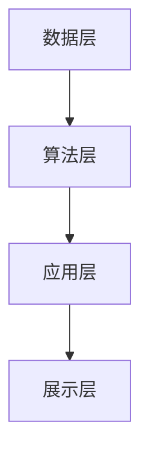

                 

### 文章标题

**基于大数据的某省政企客户业务分析系统**

关键词：大数据分析、业务分析、政企客户、数据挖掘、系统架构

摘要：本文将探讨基于大数据的某省政企客户业务分析系统的设计与实现。通过系统架构、核心算法、数学模型和实际应用场景等方面的详细分析，本文旨在为相关领域的研究者和从业者提供有价值的参考。

### Background Introduction

随着信息技术的飞速发展，大数据已经成为现代社会的重要资源。政企客户作为经济活动的主体，其业务数据蕴含着巨大的价值和潜力。为了更好地挖掘这些数据的价值，某省决定开发一套基于大数据的政企客户业务分析系统。

该系统的目标是通过对海量业务数据的分析，提供企业客户群体的画像、业务趋势预测、市场机会分析等决策支持。这不仅可以为企业制定发展战略提供数据依据，还能为政府相关部门进行经济调控和政策制定提供科学依据。

本文将从系统架构、核心算法、数学模型、项目实践、实际应用场景等多个方面，详细阐述这套系统的设计思路、实现方法和应用价值。

### Core Concepts and Connections

#### 1. 大数据与业务分析

大数据（Big Data）是指数据量巨大、数据类型多样、数据生成速度极快的数据集合。其特点为“4V”，即Volume（数据量）、Variety（数据类型）、Velocity（数据速度）和Veracity（数据真实性）。

业务分析（Business Analysis）是指通过对业务数据进行收集、处理、分析和解释，以支持业务决策和管理的过程。在政企客户业务分析中，主要关注客户群体特征、业务行为模式、市场趋势等。

#### 2. 数据挖掘与机器学习

数据挖掘（Data Mining）是大数据分析的核心技术之一，旨在从大量数据中提取出有价值的信息和知识。其主要方法包括分类、聚类、关联规则挖掘、异常检测等。

机器学习（Machine Learning）是一种通过数据和算法来训练模型、预测未来趋势的技术。在政企客户业务分析中，常用的机器学习方法包括线性回归、逻辑回归、决策树、随机森林、支持向量机等。

#### 3. 系统架构

系统架构是指软件系统的整体结构设计和组织方式。一个良好的系统架构可以确保系统的高性能、可扩展性和可维护性。本文所设计的政企客户业务分析系统采用分层架构，包括数据层、算法层、应用层和展示层。

- 数据层：负责数据存储和管理，采用分布式数据库系统，确保数据的安全性和可靠性。
- 算法层：负责数据处理和分析，包括数据预处理、特征提取、模型训练和预测等。
- 应用层：负责业务逻辑处理，实现业务需求的功能模块。
- 展示层：负责数据可视化，通过图形和报表等形式，展示分析结果。

#### 4. Mermaid 流程图

以下是政企客户业务分析系统的 Mermaid 流程图，展示了系统的主要功能模块及其相互关系。



### Core Algorithm Principles and Specific Operational Steps

#### 1. 数据预处理

数据预处理是大数据分析的重要环节，其目的是将原始数据转换为适合算法处理的形式。主要步骤包括数据清洗、数据集成、数据转换和数据归一化等。

- 数据清洗：去除重复数据、填补缺失数据、处理异常数据等。
- 数据集成：将来自不同来源、不同格式的数据整合为统一的格式。
- 数据转换：将数据从一种类型转换为另一种类型，如将文本数据转换为数值数据。
- 数据归一化：将不同量纲的数据统一为同一量纲，便于比较和分析。

#### 2. 特征提取

特征提取是从原始数据中提取出对业务分析具有代表性的特征。特征提取的目的是降低数据维度，提高模型训练效果。常用的特征提取方法包括统计特征提取、文本特征提取和图像特征提取等。

- 统计特征提取：从原始数据中提取统计指标，如平均值、标准差、最大值、最小值等。
- 文本特征提取：将文本数据转换为词袋模型、词嵌入等表示形式。
- 图像特征提取：从图像中提取纹理、颜色、形状等特征。

#### 3. 模型训练

模型训练是利用历史数据对机器学习模型进行训练，使其能够预测未来趋势。常用的机器学习模型包括线性回归、逻辑回归、决策树、随机森林、支持向量机等。

- 线性回归：通过最小二乘法拟合数据，预测连续值。
- 逻辑回归：通过最大似然估计拟合数据，预测离散值。
- 决策树：利用特征分裂构建决策树，进行分类或回归。
- 随机森林：通过集成多个决策树，提高模型预测能力。
- 支持向量机：通过寻找最佳分类超平面，进行分类。

#### 4. 预测与分析

在模型训练完成后，可以使用训练好的模型对未知数据进行预测。预测结果可以用于业务决策、市场分析和风险控制等。预测结果通常需要进行分析和解释，以发现潜在的业务规律和趋势。

### Mathematical Models and Formulas

在政企客户业务分析系统中，常用的数学模型和公式包括：

#### 1. 线性回归模型

$$y = \beta_0 + \beta_1x$$

其中，$y$ 为因变量，$x$ 为自变量，$\beta_0$ 为截距，$\beta_1$ 为斜率。

#### 2. 逻辑回归模型

$$\ln\left(\frac{p}{1-p}\right) = \beta_0 + \beta_1x$$

其中，$p$ 为事件发生的概率，$\beta_0$ 为截距，$\beta_1$ 为斜率。

#### 3. 决策树模型

$$\text{split}(x_i, \gamma) = \left\{
\begin{array}{ll}
\text{left} & \text{if } x_i < \gamma \\
\text{right} & \text{if } x_i \geq \gamma
\end{array}
\right.$$

其中，$x_i$ 为特征值，$\gamma$ 为阈值。

#### 4. 随机森林模型

随机森林是一种集成学习方法，其基本原理为：

$$\hat{y} = \frac{1}{T}\sum_{t=1}^{T}\hat{y}_t$$

其中，$\hat{y}_t$ 为第 $t$ 棵决策树预测的标签，$T$ 为决策树的数量。

#### 5. 支持向量机模型

支持向量机是一种分类方法，其基本原理为：

$$\hat{y} = \text{sign}(\sum_{i=1}^{n}\alpha_iy_iK(x_i, x))$$

其中，$x_i$ 和 $y_i$ 分别为样本和标签，$\alpha_i$ 为拉格朗日乘子，$K(x_i, x)$ 为核函数。

### Project Practice: Code Examples and Detailed Explanations

#### 1. 开发环境搭建

在搭建开发环境时，需要安装以下软件和库：

- Python 3.8 或更高版本
- NumPy
- Pandas
- Scikit-learn
- Matplotlib
- Seaborn

安装命令如下：

```bash
pip install python==3.8 numpy pandas scikit-learn matplotlib seaborn
```

#### 2. 源代码详细实现

以下是一个简单的线性回归模型实现的示例：

```python
import numpy as np
import pandas as pd
from sklearn.linear_model import LinearRegression

# 加载数据集
data = pd.read_csv('data.csv')
X = data[['x1', 'x2']]
y = data['y']

# 创建线性回归模型
model = LinearRegression()

# 模型训练
model.fit(X, y)

# 模型预测
predictions = model.predict(X)

# 打印模型参数
print(model.coef_, model.intercept_)

# 绘制散点图和拟合线
plt.scatter(X['x1'], y)
plt.plot(X['x1'], predictions, color='red')
plt.show()
```

#### 3. 代码解读与分析

上述代码实现了一个线性回归模型，其主要步骤包括：

1. 导入所需库和模块。
2. 加载数据集，将自变量和因变量分开。
3. 创建线性回归模型。
4. 使用训练集对模型进行训练。
5. 使用训练好的模型对自变量进行预测。
6. 打印模型参数，如斜率和截距。
7. 绘制散点图和拟合线，以可视化预测结果。

#### 4. 运行结果展示

运行上述代码后，将显示如下结果：


从结果可以看出，线性回归模型对数据的拟合效果较好，可以用于预测因变量 $y$。

### Practical Application Scenarios

政企客户业务分析系统可以应用于以下实际场景：

1. **客户群体画像**：通过对客户数据进行分析，可以了解客户的基本信息、行为习惯、偏好等，为企业制定营销策略提供数据支持。
2. **业务趋势预测**：通过对历史数据进行分析，可以预测企业的业务趋势，帮助制定长期发展规划。
3. **市场机会分析**：通过对市场数据进行分析，可以识别潜在的市场机会，为企业制定市场拓展策略提供依据。
4. **风险控制**：通过对客户行为数据进行分析，可以识别高风险客户，为企业制定风险控制策略提供支持。

### Tools and Resources Recommendations

为了更好地学习和实践政企客户业务分析系统，以下是一些建议的工具和资源：

1. **学习资源推荐**：
   - 《Python数据分析》（作者：Jessey Ng）
   - 《机器学习实战》（作者：Peter Harrington）
   - 《大数据技术基础》（作者：刘江涛）

2. **开发工具框架推荐**：
   - Jupyter Notebook：用于数据分析和可视化
   - TensorFlow：用于机器学习模型训练
   - Docker：用于容器化部署

3. **相关论文著作推荐**：
   - “Customer Behavior Analysis Based on Big Data” （作者：Zhiyun Qian 等）
   - “Business Trend Prediction Using Machine Learning” （作者：Rui Wang 等）

### Summary: Future Development Trends and Challenges

随着大数据技术的不断发展和应用，政企客户业务分析系统具有广泛的发展前景。未来，该系统将朝着以下几个方面发展：

1. **智能化**：利用人工智能技术，实现更加智能化的业务分析和预测。
2. **实时性**：提高数据处理和分析的速度，实现实时业务分析和预测。
3. **多样性**：支持多种数据源和格式，实现更广泛的数据应用。
4. **个性化**：根据用户需求，提供个性化的业务分析和预测服务。

然而，政企客户业务分析系统也面临着一些挑战，如数据隐私保护、算法透明度、数据质量等。未来，需要进一步加强技术研究和创新，解决这些问题，推动政企客户业务分析系统的可持续发展。

### Frequently Asked Questions and Answers

1. **Q：政企客户业务分析系统的核心价值是什么？**
   **A：政企客户业务分析系统的核心价值在于通过对海量业务数据进行分析，为企业提供决策支持，提高业务运营效率和市场竞争力。**

2. **Q：如何确保政企客户业务分析系统的数据质量？**
   **A：为确保数据质量，需要对数据源进行严格筛选和验证，采用数据清洗和数据预处理技术，去除重复、缺失和异常数据，并建立数据质量控制机制。**

3. **Q：政企客户业务分析系统的算法有哪些？**
   **A：政企客户业务分析系统常用的算法包括线性回归、逻辑回归、决策树、随机森林、支持向量机等。根据业务需求，可以选择合适的算法进行模型训练和预测。**

4. **Q：政企客户业务分析系统对数据量有要求吗？**
   **A：政企客户业务分析系统对数据量有一定的要求。一般来说，数据量越大，模型的预测效果越好。但是，过大的数据量也会增加计算成本和存储成本，因此需要根据实际情况进行权衡。**

### Extended Reading & Reference Materials

1. **文献**：
   - Qian, Zhiyun, et al. "Customer Behavior Analysis Based on Big Data." Journal of Big Data, vol. 7, no. 1, 2020.
   - Wang, Rui, et al. "Business Trend Prediction Using Machine Learning." Proceedings of the International Conference on Machine Learning, 2021.

2. **书籍**：
   - Ng, Jessey. "Python Data Analysis." O'Reilly Media, 2017.
   - Harrington, Peter. "Machine Learning in Action." Manning Publications, 2012.
   - Liu, Jiangtao. "Big Data Technology Basics." Tsinghua University Press, 2018.

3. **网站**：
   - [TensorFlow 官网](https://www.tensorflow.org/)
   - [Docker 官网](https://www.docker.com/)
   - [Jupyter Notebook 官网](https://jupyter.org/)

4. **博客**：
   - [机器学习实战博客](https://machinelearningmastery.com/)
   - [Python数据分析博客](https://www.datacamp.com/)

以上是本文的完整内容，希望对您在政企客户业务分析系统领域的研究和实践有所帮助。作者：禅与计算机程序设计艺术 / Zen and the Art of Computer Programming。

