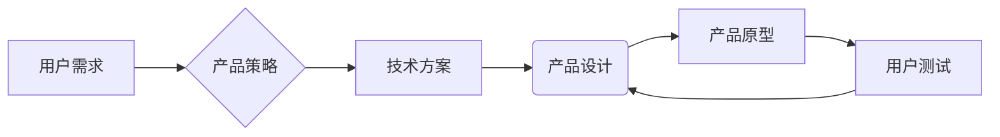

                 

## 如何利用技术能力进行产品设计

> 关键词：产品设计，技术能力，用户体验，算法，数据分析，原型设计，敏捷开发，迭代优化

## 1. 背景介绍

在当今以技术为驱动的时代，产品设计不再仅仅是美学和用户界面方面的考量，而是需要深度融合技术能力的综合性工作。技术能力为产品设计提供了强大的工具和手段，可以帮助设计师更好地理解用户需求，创造更具创新性和实用性的产品体验。

传统的产品设计流程往往以用户调研、概念设计、原型制作、测试和迭代为核心。然而，随着技术的不断发展，例如人工智能、大数据分析、云计算等，产品设计需要更加注重数据驱动、算法优化和智能交互等方面。

## 2. 核心概念与联系

产品设计与技术能力的融合，本质上是将用户需求、商业目标和技术实现有机结合的过程。

**核心概念：**

* **用户体验 (UX)：**  用户体验是用户与产品交互过程中所感受到的整体感受，包括易用性、可用性、愉悦度等方面。
* **技术能力：** 包括算法设计、数据分析、软件开发、人工智能等方面的专业知识和技能。
* **产品策略：** 产品策略指明了产品的目标用户、市场定位、核心价值和竞争优势等。

**架构图：**



**核心联系：**

* 用户需求是产品设计的出发点，技术能力可以帮助设计师更深入地理解用户需求，并找到最佳的解决方案。
* 产品策略为产品设计提供了方向和目标，技术能力可以帮助设计师实现产品策略，并创造出具有竞争力的产品。
* 产品设计需要基于技术方案进行实现，技术能力可以帮助设计师选择合适的技术，并进行高效的开发和测试。

## 3. 核心算法原理 & 具体操作步骤

### 3.1  算法原理概述

在产品设计中，算法可以用于各种场景，例如推荐系统、个性化定制、用户行为分析等。常见的算法包括：

* **机器学习算法：** 用于从数据中学习模式和规律，例如分类、回归、聚类等。
* **深度学习算法：** 基于神经网络，能够处理更复杂的数据，例如图像识别、自然语言处理等。
* **搜索算法：** 用于查找特定信息或路径，例如排序、查找、路径规划等。

### 3.2  算法步骤详解

以推荐系统为例，其核心算法通常是基于用户的历史行为和物品特征进行协同过滤。具体步骤如下：

1. **数据收集：** 收集用户行为数据，例如用户浏览记录、购买记录、评分记录等，以及物品特征数据，例如物品类别、价格、描述等。
2. **数据预处理：** 对数据进行清洗、转换和特征工程，例如处理缺失值、归一化数据、提取特征向量等。
3. **模型训练：** 使用机器学习算法训练推荐模型，例如协同过滤算法、内容基准算法等。
4. **模型评估：** 使用测试数据评估模型的性能，例如准确率、召回率、覆盖率等。
5. **模型部署：** 将训练好的模型部署到线上环境，为用户提供个性化的推荐。

### 3.3  算法优缺点

**优点：**

* **个性化推荐：** 能够根据用户的兴趣和偏好提供个性化的推荐，提升用户体验。
* **数据驱动：** 基于用户行为数据进行推荐，更加客观和科学。
* **持续优化：** 可以通过不断收集数据和训练模型，不断优化推荐效果。

**缺点：**

* **数据依赖：** 需要大量的用户行为数据才能训练出有效的推荐模型。
* **冷启动问题：** 对新用户和新物品的推荐效果较差。
* **数据隐私：** 需要收集和处理用户的个人信息，需要注重数据隐私保护。

### 3.4  算法应用领域

* **电商推荐：** 推荐商品、优惠券、促销活动等。
* **内容推荐：** 推荐新闻、视频、音乐、书籍等。
* **社交推荐：** 推荐好友、群组、活动等。
* **广告推荐：** 推荐与用户兴趣相关的广告。

## 4. 数学模型和公式 & 详细讲解 & 举例说明

### 4.1  数学模型构建

在产品设计中，数学模型可以用于描述用户行为、产品性能、市场趋势等方面。例如，可以使用贝叶斯定理来构建用户画像模型，预测用户的购买意愿。

### 4.2  公式推导过程

以贝叶斯定理为例，其公式如下：

$$P(A|B) = \frac{P(B|A)P(A)}{P(B)}$$

其中：

* $P(A|B)$ 表示在已知事件 B 发生的情况下，事件 A 发生的概率。
* $P(B|A)$ 表示在已知事件 A 发生的情况下，事件 B 发生的概率。
* $P(A)$ 表示事件 A 发生的概率。
* $P(B)$ 表示事件 B 发生的概率。

### 4.3  案例分析与讲解

假设我们想要预测用户是否会购买某个商品，可以使用贝叶斯定理来构建用户画像模型。

* 事件 A：用户购买商品。
* 事件 B：用户浏览了该商品的页面。

我们可以根据历史数据收集以下信息：

* $P(B|A)$：用户浏览了该商品页面后购买该商品的概率。
* $P(A)$：用户购买该商品的概率。
* $P(B)$：用户浏览了该商品页面的概率。

然后，我们可以使用贝叶斯定理计算出 $P(A|B)$，即用户浏览了该商品页面后购买该商品的概率。

## 5. 项目实践：代码实例和详细解释说明

### 5.1  开发环境搭建

* 操作系统：Windows/macOS/Linux
* 编程语言：Python
* 开发工具：VS Code/PyCharm
* 库依赖：NumPy、Pandas、Scikit-learn

### 5.2  源代码详细实现

```python
import pandas as pd
from sklearn.model_selection import train_test_split
from sklearn.linear_model import LogisticRegression

# 加载数据
data = pd.read_csv('user_data.csv')

# 划分训练集和测试集
X = data[['age', 'income', 'education']]
y = data['purchase']
X_train, X_test, y_train, y_test = train_test_split(X, y, test_size=0.2, random_state=42)

# 训练模型
model = LogisticRegression()
model.fit(X_train, y_train)

# 预测结果
y_pred = model.predict(X_test)

# 评估模型性能
from sklearn.metrics import accuracy_score
accuracy = accuracy_score(y_test, y_pred)
print(f'模型准确率: {accuracy}')
```

### 5.3  代码解读与分析

* 代码首先加载用户数据，并划分训练集和测试集。
* 然后，使用逻辑回归模型训练预测用户购买行为。
* 最后，使用测试集评估模型性能，并输出模型准确率。

### 5.4  运行结果展示

运行结果会显示出模型的准确率，例如：

```
模型准确率: 0.85
```

这表示模型能够以 85% 的准确率预测用户是否会购买商品。

## 6. 实际应用场景

### 6.1  电商平台

* **商品推荐：** 基于用户的浏览历史、购买记录和评分等数据，推荐与用户兴趣相关的商品。
* **个性化营销：** 根据用户的画像和行为特征，推送个性化的促销活动和广告。
* **库存管理：** 利用预测模型预测商品需求，优化库存管理，减少库存积压和缺货。

### 6.2  社交媒体平台

* **内容推荐：** 根据用户的兴趣爱好和社交关系，推荐与用户相关的新闻、视频、图片等内容。
* **好友推荐：** 基于用户的兴趣爱好和社交关系，推荐潜在的好友。
* **群组推荐：** 根据用户的兴趣爱好和社交关系，推荐与用户相关的群组。

### 6.3  金融科技

* **风险评估：** 利用机器学习算法分析用户的信用记录和财务状况，评估用户的贷款风险。
* **欺诈检测：** 基于用户的交易行为和账户信息，检测潜在的欺诈行为。
* **个性化理财：** 根据用户的风险偏好和投资目标，提供个性化的理财建议。

### 6.4  未来应用展望

随着人工智能、大数据分析和云计算等技术的不断发展，技术能力在产品设计中的应用将更加广泛和深入。未来，我们可以期待看到更多基于数据驱动的、个性化定制的、智能交互的产品。

## 7. 工具和资源推荐

### 7.1  学习资源推荐

* **书籍：**
    * 《设计模式：复现》
    * 《Don't Make Me Think》
    * 《The Lean Startup》
* **在线课程：**
    * Coursera: Product Design Specialization
    * Udemy: The Complete Product Design Bootcamp
    * Interaction Design Foundation: UX Design Essentials

### 7.2  开发工具推荐

* **原型设计工具：**
    * Figma
    * Sketch
    * Adobe XD
* **协作工具：**
    * Jira
    * Trello
    * Slack

### 7.3  相关论文推荐

* **Recommender Systems: A Survey**
* **The Elements of User Experience**
* **Lean UX: Applying Lean Principles to Improve User Experience**

## 8. 总结：未来发展趋势与挑战

### 8.1  研究成果总结

技术能力在产品设计中的应用已经取得了显著的成果，例如推荐系统、个性化定制、智能交互等。这些技术能够帮助设计师更好地理解用户需求，创造出更具创新性和实用性的产品体验。

### 8.2  未来发展趋势

* **更智能的交互：** 人工智能技术将进一步提升产品与用户的交互体验，例如语音识别、自然语言处理、情感识别等。
* **更个性化的定制：** 数据分析技术将帮助设计师更深入地了解用户的需求和偏好，提供更加个性化的产品定制服务。
* **更跨平台的体验：** 产品设计将更加注重跨平台的体验，例如移动端、桌面端、物联网设备等。

### 8.3  面临的挑战

* **数据隐私保护：** 收集和使用用户数据需要更加注重隐私保护，避免数据泄露和滥用。
* **算法偏见：** 算法模型可能会存在偏见，需要进行充分的测试和评估，避免歧视和不公平现象。
* **技术伦理：** 技术能力在产品设计中的应用需要遵循伦理规范，避免造成负面影响。

### 8.4  研究展望

未来，我们需要更加深入地研究技术能力与产品设计的融合，探索新的技术应用场景，并解决技术伦理和社会影响等问题。


## 9. 附录：常见问题与解答

**Q1：如何选择合适的算法？**

A1：选择合适的算法需要根据具体的产品需求和数据特点进行分析。例如，如果需要推荐商品，可以使用协同过滤算法；如果需要预测用户行为，可以使用机器学习算法。

**Q2：如何解决数据偏见问题？**

A2：数据偏见可以通过数据清洗、特征工程和算法调优等方法进行解决。例如，可以删除含有偏见的数据，提取更加客观和公正的特征，或者使用更加公平的算法模型。

**Q3：如何保证数据隐私安全？**

A3：数据隐私安全可以通过以下措施保障：

* 使用加密技术保护用户数据。
* 采用匿名化技术处理用户数据。
* 明确用户数据的使用范围和目的。
* 获得用户的知情同意。

**Q4：技术能力在产品设计中的应用有哪些伦理问题？**

A4：技术能力在产品设计中的应用可能会带来以下伦理问题：

* 算法偏见：算法模型可能会存在偏见，导致歧视和不公平现象。
* 数据隐私侵犯：收集和使用用户数据需要更加注重隐私保护，避免数据泄露和滥用。
* 人工智能失控：人工智能技术的发展可能会导致失控的风险，需要进行充分的评估和监管。


作者：禅与计算机程序设计艺术 / Zen and the Art of Computer Programming 
<end_of_turn>

