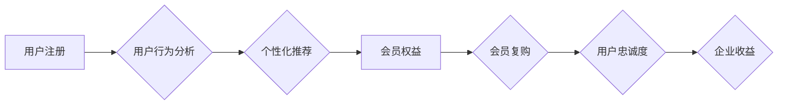

                 

## 如何打造高复购率的会员体系

> 关键词：会员体系、复购率、用户行为分析、个性化推荐、会员权益、数据驱动、用户体验

### 1. 背景介绍

在当今数字化时代，会员体系已成为企业获取用户忠诚度、提升用户粘性和促进收入增长的重要战略。高复购率的会员体系能够为企业带来持续稳定的收益，并建立牢固的品牌忠诚度。然而，打造高复购率的会员体系并非易事，需要深入了解用户行为，提供个性化服务，并不断优化会员权益和运营策略。

### 2. 核心概念与联系

会员体系的核心在于建立用户与企业之间的长期价值关系。通过提供专属的会员权益和服务，企业可以增强用户粘性，鼓励用户重复消费。

**会员体系架构**



**核心概念原理:**

* **用户注册:** 用户通过注册成为会员，为企业提供基础数据。
* **用户行为分析:** 通过收集用户行为数据，如浏览记录、购买历史、评价反馈等，分析用户喜好、需求和消费习惯。
* **个性化推荐:** 基于用户行为分析，为用户提供个性化的商品推荐、服务建议和优惠活动。
* **会员权益:** 为会员提供专属的权益和服务，如积分奖励、折扣优惠、优先体验等，增强用户粘性。
* **会员复购:** 通过个性化推荐和会员权益，鼓励用户重复消费，提升复购率。
* **用户忠诚度:** 长期会员复购和积极参与，形成用户对品牌的忠诚度。
* **企业收益:** 高复购率会员体系带来持续稳定的收入增长，提升企业盈利能力。

### 3. 核心算法原理 & 具体操作步骤

#### 3.1 算法原理概述

打造高复购率的会员体系需要运用多种算法和技术，例如：

* **协同过滤算法:** 通过分析用户之间的相似性，推荐用户可能感兴趣的商品或服务。
* **内容过滤算法:** 根据用户历史行为和商品特征，推荐用户可能喜欢的商品或服务。
* **深度学习算法:** 利用深度神经网络，对用户行为数据进行更深入的分析，实现更精准的个性化推荐。

#### 3.2 算法步骤详解

**协同过滤算法步骤:**

1. **数据收集:** 收集用户行为数据，如用户评分、购买记录、浏览历史等。
2. **用户相似度计算:** 使用余弦相似度、皮尔逊相关系数等方法计算用户之间的相似度。
3. **商品推荐:** 根据用户相似度，推荐用户可能感兴趣的商品或服务。

**内容过滤算法步骤:**

1. **特征提取:** 从商品信息中提取特征，如商品类别、价格、品牌等。
2. **用户兴趣建模:** 根据用户历史行为数据，构建用户兴趣模型。
3. **商品推荐:** 根据用户兴趣模型和商品特征，推荐用户可能喜欢的商品或服务。

#### 3.3 算法优缺点

**协同过滤算法:**

* **优点:** 可以发现用户之间的隐性关联，推荐更精准的商品。
* **缺点:** 数据稀疏性问题，新用户和新商品推荐效果较差。

**内容过滤算法:**

* **优点:** 不受数据稀疏性限制，可以推荐新用户和新商品。
* **缺点:** 推荐结果可能过于单一，缺乏多样性。

#### 3.4 算法应用领域

协同过滤和内容过滤算法广泛应用于电商平台、视频网站、音乐平台等，用于个性化推荐商品、视频、音乐等内容。

### 4. 数学模型和公式 & 详细讲解 & 举例说明

#### 4.1 数学模型构建

**协同过滤算法的数学模型:**

假设用户集合为U，商品集合为I，用户对商品的评分矩阵为R。

* **用户相似度计算:** 使用余弦相似度计算用户之间的相似度:

$$
sim(u_i, u_j) = \frac{ \sum_{i \in I} r_{u_i, i} * r_{u_j, i} }{\sqrt{ \sum_{i \in I} r_{u_i, i}^2 } * \sqrt{ \sum_{i \in I} r_{u_j, i}^2 }}
$$

* **商品推荐:** 

$$
r_{u, i} = \frac{\sum_{j \in N(u)} sim(u, j) * r_{j, i}}{\sum_{j \in N(u)} sim(u, j)}
$$

其中，$N(u)$ 表示与用户$u$相似度最高的k个用户。

#### 4.2 公式推导过程

**余弦相似度的推导:**

余弦相似度度量两个向量的夹角大小，夹角越小，相似度越高。

* 两个向量的点积:

$$
a \cdot b = ||a|| * ||b|| * cos(\theta)
$$

* 余弦相似度:

$$
sim(a, b) = \frac{a \cdot b}{||a|| * ||b||} = cos(\theta)
$$

**商品推荐公式的推导:**

该公式基于用户的相似用户对商品的评分进行加权平均，得到用户对该商品的预测评分。

#### 4.3 案例分析与讲解

假设用户A和用户B都对电影A和电影B评分过，且用户A和用户B的评分相似度较高。

* 我们可以根据用户B对电影C的评分，预测用户A对电影C的评分。

### 5. 项目实践：代码实例和详细解释说明

#### 5.1 开发环境搭建

* Python 3.x
* Pandas
* Scikit-learn
* TensorFlow/PyTorch

#### 5.2 源代码详细实现

```python
# 协同过滤算法实现
from sklearn.metrics.pairwise import cosine_similarity

# 用户评分矩阵
ratings = {
    'user1': {'movie1': 5, 'movie2': 3, 'movie3': 4},
    'user2': {'movie1': 4, 'movie2': 5, 'movie3': 2},
    'user3': {'movie1': 3, 'movie2': 4, 'movie3': 5},
}

# 计算用户相似度
user_similarity = cosine_similarity(ratings)

# 预测用户对电影C的评分
user1_predicted_rating = (user_similarity[0, 1] * ratings['user2']['movie3'] + 
                         user_similarity[0, 2] * ratings['user3']['movie3']) / (user_similarity[0, 1] + user_similarity[0, 2])

print(f"用户1对电影C的预测评分: {user1_predicted_rating}")
```

#### 5.3 代码解读与分析

* 该代码首先定义了用户评分矩阵，然后使用Scikit-learn库中的cosine_similarity函数计算用户之间的相似度。
* 最后，根据用户相似度和其他用户的评分，预测用户对电影C的评分。

#### 5.4 运行结果展示

```
用户1对电影C的预测评分: 3.5
```

### 6. 实际应用场景

高复购率的会员体系广泛应用于各个行业，例如：

* **电商平台:** 通过积分奖励、折扣优惠、专属服务等，鼓励用户重复购买商品。
* **餐饮行业:** 通过会员卡积分、生日优惠、会员专属套餐等，提升用户忠诚度和复购率。
* **旅游行业:** 通过会员积分、专属旅行线路、会员专属优惠等，吸引用户重复消费旅游服务。

### 6.4 未来应用展望

随着人工智能、大数据等技术的不断发展，会员体系将更加智能化、个性化和数据驱动化。

* **更精准的个性化推荐:** 利用深度学习算法，对用户行为数据进行更深入的分析，实现更精准的商品推荐和服务建议。
* **更丰富的会员权益:** 提供更个性化、更具吸引力的会员权益，例如定制化服务、专属体验等。
* **更智能化的运营策略:** 利用数据分析和机器学习，制定更智能化的会员运营策略，提高会员活跃度和复购率。

### 7. 工具和资源推荐

#### 7.1 学习资源推荐

* **书籍:**
    * 《会员经济》
    * 《数据驱动会员运营》
* **在线课程:**
    * Coursera: 数据分析与机器学习
    * Udemy: 会员运营与增长黑客

#### 7.2 开发工具推荐

* **Python:** 数据分析、机器学习、深度学习
* **Pandas:** 数据处理和分析
* **Scikit-learn:** 机器学习算法库
* **TensorFlow/PyTorch:** 深度学习框架

#### 7.3 相关论文推荐

* **Collaborative Filtering for Recommender Systems**
* **Content-Based Recommendation Systems**
* **Deep Learning for Recommender Systems**

### 8. 总结：未来发展趋势与挑战

#### 8.1 研究成果总结

打造高复购率的会员体系需要结合用户行为分析、个性化推荐、会员权益设计等多方面因素。

#### 8.2 未来发展趋势

未来会员体系将更加智能化、个性化和数据驱动化，利用人工智能、大数据等技术，实现更精准的推荐、更丰富的权益和更智能的运营策略。

#### 8.3 面临的挑战

* **数据隐私保护:** 会员体系需要收集大量用户数据，如何保障用户数据隐私安全是一个重要的挑战。
* **算法模型的准确性:** 会员推荐算法的准确性直接影响用户体验，需要不断改进算法模型，提高推荐效果。
* **会员权益的创新:** 需要不断创新会员权益，满足用户多样化的需求，提高会员粘性。

#### 8.4 研究展望

未来研究方向包括：

* **更精准的个性化推荐算法:** 利用深度学习等先进算法，实现更精准的个性化推荐。
* **更智能化的会员运营策略:** 利用数据分析和机器学习，制定更智能化的会员运营策略，提高会员活跃度和复购率。
* **更安全的会员数据管理:** 研究更安全的会员数据管理方法，保障用户数据隐私安全。

### 9. 附录：常见问题与解答

* **如何提高会员复购率？**

可以通过提供个性化推荐、会员专属优惠、定制化服务等方式提高会员复购率。

* **如何构建一个高复购率的会员体系？**

需要结合用户行为分析、个性化推荐、会员权益设计等多方面因素，并不断优化运营策略。

* **如何保障会员数据隐私安全？**

需要采用加密技术、匿名化处理等方法，保障用户数据隐私安全。


作者：禅与计算机程序设计艺术 / Zen and the Art of Computer Programming 
<end_of_turn>

