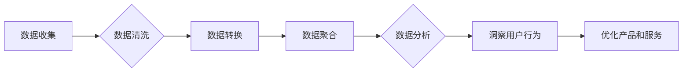

                 

## 如何进行有效的用户行为分析

> 关键词：用户行为分析，数据挖掘，机器学习，A/B测试，用户画像，网站分析，移动应用分析，转化率优化

## 1. 背景介绍

在当今数据爆炸的时代，用户行为分析已成为企业了解用户、优化产品和提升商业效益的关键手段。通过对用户在网站、移动应用等平台上的行为进行深入分析，企业可以洞察用户需求、识别潜在问题、制定精准的营销策略，最终实现业务目标。

用户行为分析涵盖了广泛的领域，包括用户访问路径、点击行为、停留时间、转化率等。这些数据可以帮助企业构建用户画像，了解用户群体特征、兴趣偏好和行为模式。基于用户行为分析的结果，企业可以进行产品优化、内容推荐、个性化营销等一系列行动，从而提升用户体验和商业价值。

## 2. 核心概念与联系

用户行为分析的核心在于收集、存储、处理和分析用户行为数据。

**数据来源:**

* **网站分析工具:** Google Analytics、百度统计等工具可以记录用户访问网站的页面、时间、来源等信息。
* **移动应用分析工具:** App Annie、Firebase等工具可以记录用户在移动应用中的使用时长、功能使用频率、崩溃率等信息。
* **用户反馈:** 用户评论、意见反馈、问卷调查等方式可以收集用户对产品和服务的直接反馈。
* **传感器数据:** 手机、电脑等设备的传感器可以收集用户位置、运动轨迹、心率等数据，为行为分析提供更丰富的维度。

**数据处理:**

* **数据清洗:** 去除无效数据、重复数据和错误数据，确保数据质量。
* **数据转换:** 将数据转换为分析所需的格式，例如将时间戳转换为日期、将文本数据转换为数值数据。
* **数据聚合:** 将数据按照时间、用户、设备等维度进行聚合，例如计算用户每天的访问次数、每个页面停留的时间等。

**数据分析:**

* **描述性分析:** 描述用户行为的总体特征，例如用户年龄分布、访问时间段等。
* **探索性分析:** 寻找用户行为中的潜在模式和趋势，例如用户访问路径、点击行为等。
* **预测性分析:** 利用机器学习算法预测用户未来的行为，例如用户是否会购买商品、是否会流失等。

**Mermaid 流程图:**



## 3. 核心算法原理 & 具体操作步骤

### 3.1  算法原理概述

用户行为分析中常用的算法包括：

* **聚类算法:** 将用户按照相似行为特征进行分组，例如 K-Means 聚类、层次聚类等。
* **关联规则挖掘算法:** 发现用户行为之间的关联关系，例如 Apriori 算法、FP-Growth 算法等。
* **推荐算法:** 根据用户的历史行为推荐相关内容，例如协同过滤、内容过滤等。
* **预测模型:** 利用机器学习算法预测用户的未来行为，例如线性回归、逻辑回归、决策树等。

### 3.2  算法步骤详解

以 K-Means 聚类算法为例，详细说明其步骤：

1. **初始化:** 随机选择 K 个用户作为初始聚类中心。
2. **分配:** 将每个用户分配到距离其最近的聚类中心所属的类别。
3. **更新:** 计算每个聚类中心的新的位置，即所有属于该类别的用户的平均值。
4. **重复:** 重复步骤 2 和 3，直到聚类中心不再发生变化或达到最大迭代次数。

### 3.3  算法优缺点

**聚类算法:**

* **优点:** 可以发现用户行为的潜在结构，并对用户进行细分。
* **缺点:** 需要预先设定聚类数量 K，且对初始聚类中心的选择敏感。

**关联规则挖掘算法:**

* **优点:** 可以发现用户行为之间的关联关系，例如哪些商品经常一起购买。
* **缺点:** 可能会产生大量冗余规则，需要进行筛选和过滤。

**推荐算法:**

* **优点:** 可以根据用户的历史行为推荐相关内容，提升用户体验。
* **缺点:** 需要大量的历史数据进行训练，且容易陷入冷启动问题。

**预测模型:**

* **优点:** 可以预测用户的未来行为，例如用户是否会购买商品。
* **缺点:** 需要专业的机器学习知识和技术，且模型的准确性依赖于训练数据的质量。

### 3.4  算法应用领域

* **电商:** 用户画像构建、商品推荐、个性化营销
* **社交媒体:** 用户兴趣分析、内容推荐、广告投放
* **金融:** 风险评估、欺诈检测、客户服务
* **游戏:** 用户行为分析、游戏设计优化、付费转化率提升

## 4. 数学模型和公式 & 详细讲解 & 举例说明

### 4.1  数学模型构建

用户行为分析中常用的数学模型包括：

* **贝叶斯网络:** 用于表示用户行为之间的概率关系，可以进行预测和推理。
* **Markov 链:** 用于描述用户在不同状态之间的转移概率，可以预测用户的未来行为路径。
* **潜在语义分析 (LSA):** 用于挖掘文本数据中的潜在主题和语义关系，可以分析用户评论和反馈。

### 4.2  公式推导过程

以贝叶斯网络为例，其核心公式为：

$$P(A|B) = \frac{P(B|A)P(A)}{P(B)}$$

其中：

* $P(A|B)$ 表示在已知事件 B 发生的情况下，事件 A 发生的概率。
* $P(B|A)$ 表示在已知事件 A 发生的情况下，事件 B 发生的概率。
* $P(A)$ 表示事件 A 发生的概率。
* $P(B)$ 表示事件 B 发生的概率。

### 4.3  案例分析与讲解

假设我们想要预测用户是否会购买商品，我们可以构建一个贝叶斯网络，其中节点包括用户特征、商品信息、用户行为等。

* 用户特征: 年龄、性别、收入等。
* 商品信息: 价格、类别、评价等。
* 用户行为: 浏览商品、加入购物车、购买商品等。

我们可以根据历史数据训练贝叶斯网络，学习用户特征、商品信息和用户行为之间的概率关系。然后，对于一个新的用户和商品，我们可以利用贝叶斯网络进行预测，判断用户是否会购买该商品。

## 5. 项目实践：代码实例和详细解释说明

### 5.1  开发环境搭建

* Python 3.x
* Jupyter Notebook
* pandas
* scikit-learn
* matplotlib

### 5.2  源代码详细实现

```python
import pandas as pd
from sklearn.cluster import KMeans

# 加载用户行为数据
data = pd.read_csv('user_behavior.csv')

# 选择特征变量
features = ['age', 'gender', 'income', 'purchase_frequency']

# 训练 K-Means 聚类模型
kmeans = KMeans(n_clusters=3)
data[features].fit(kmeans.predict(data[features]))

# 查看聚类结果
print(data['cluster'])
```

### 5.3  代码解读与分析

* 首先，我们加载用户行为数据，并选择需要进行聚类的特征变量。
* 然后，我们使用 K-Means 聚类算法训练模型，并指定聚类数量为 3。
* 最后，我们使用模型预测每个用户的聚类类别，并打印结果。

### 5.4  运行结果展示

运行代码后，我们会得到一个包含用户 ID 和聚类类别的 DataFrame。每个用户的聚类类别代表其与其他用户行为相似程度最高的群组。

## 6. 实际应用场景

### 6.1  电商平台

* **用户画像构建:** 通过分析用户的购买历史、浏览记录、评价等行为，构建用户画像，了解用户的兴趣偏好、消费习惯等。
* **商品推荐:** 根据用户的兴趣和购买历史，推荐相关的商品，提升用户体验和转化率。
* **个性化营销:** 根据用户的画像和行为，进行个性化的营销推广，提高营销效果。

### 6.2  社交媒体平台

* **用户兴趣分析:** 分析用户的点赞、评论、分享等行为，了解用户的兴趣爱好和社交圈。
* **内容推荐:** 根据用户的兴趣和行为，推荐相关的文章、视频、图片等内容，提升用户粘性和活跃度。
* **广告投放:** 根据用户的兴趣和行为，精准投放广告，提高广告效果。

### 6.3  移动应用平台

* **用户留存分析:** 分析用户的使用时长、功能使用频率等行为，了解用户留存情况，并制定留存策略。
* **功能优化:** 分析用户的使用行为，识别功能使用率低或存在问题的模块，进行优化和改进。
* **用户体验提升:** 通过分析用户的行为反馈，改进应用的用户体验，提升用户满意度。

### 6.4  未来应用展望

随着人工智能技术的不断发展，用户行为分析将更加智能化、个性化和精准化。未来，用户行为分析将应用于更广泛的领域，例如医疗、教育、金融等，为企业和个人提供更深入的洞察和价值。

## 7. 工具和资源推荐

### 7.1  学习资源推荐

* **书籍:**
    * 《数据挖掘：概念与技术》
    * 《机器学习》
    * 《用户行为分析》
* **在线课程:**
    * Coursera: 数据科学、机器学习
    * edX: 数据分析、用户体验设计
    * Udemy: 用户行为分析、数据可视化

### 7.2  开发工具推荐

* **数据分析工具:**
    * Python: pandas, scikit-learn, matplotlib
    * R: dplyr, ggplot2
    * Tableau, Power BI
* **用户行为分析工具:**
    * Google Analytics
    * 百度统计
    * Mixpanel
    * Amplitude

### 7.3  相关论文推荐

* **用户行为分析:**
    * "A Survey of User Behavior Analysis Techniques"
    * "User Behavior Modeling and Prediction: A Survey"
* **机器学习:**
    * "The Elements of Statistical Learning"
    * "Pattern Recognition and Machine Learning"

## 8. 总结：未来发展趋势与挑战

### 8.1  研究成果总结

用户行为分析已经取得了显著的成果，为企业提供了洞察用户、优化产品和提升商业效益的重要手段。

### 8.2  未来发展趋势

* **更智能化:** 利用人工智能技术，实现更智能的分析和预测。
* **更个性化:** 根据用户的个体差异，提供更个性化的分析和服务。
* **更精准化:** 利用更先进的算法和模型，提高分析的准确性和可靠性。

### 8.3  面临的挑战

* **数据隐私:** 如何保护用户隐私，同时进行有效的分析。
* **数据质量:** 如何保证数据的准确性和完整性。
* **算法解释性:** 如何解释和理解算法的决策结果。

### 8.4  研究展望

未来，用户行为分析将继续朝着更智能、更个性化、更精准的方向发展，为企业和个人带来更多价值。


## 9. 附录：常见问题与解答

* **Q1: 如何选择合适的聚类算法？**

* **A1:** 选择聚类算法需要根据数据的特点和分析目标进行选择。例如，对于离散数据，可以使用 K-Means 聚类算法；对于连续数据，可以使用层次聚类算法。

* **Q2: 如何确定聚类数量 K？**

* **A2:** 可以使用肘部法、Silhouette 分析等方法来确定聚类数量 K。

* **Q3: 如何解释机器学习模型的决策结果？**

* **A3:** 可以使用特征重要性分析、局部解释模型等方法来解释机器学习模型的决策结果。


作者：禅与计算机程序设计艺术 / Zen and the Art of Computer Programming 
<end_of_turn>

