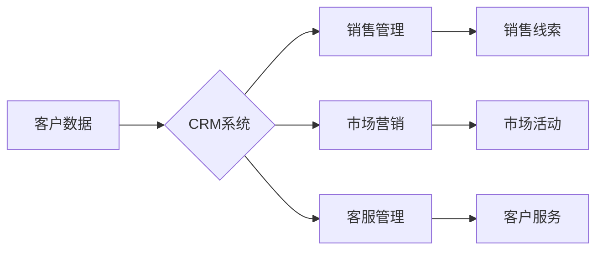

                 

## 客户关系管理：提升客户满意度的策略

> 关键词：客户关系管理 (CRM)、客户满意度、数据分析、机器学习、个性化服务、人工智能、预测分析、客户旅程

## 1. 背景介绍

在当今竞争激烈的市场环境中，客户关系管理 (CRM) 已成为企业成功和持续增长的关键因素。客户满意度是衡量企业成功的重要指标，而CRM系统旨在通过收集、分析和利用客户数据来提升客户体验，增强客户忠诚度，最终促进企业盈利。

随着互联网和移动技术的快速发展，客户与企业之间的互动方式发生了根本性的变化。客户拥有了更多的选择权和信息获取渠道，对产品和服务的期望也越来越高。企业需要更加注重客户需求，提供个性化、定制化的服务，才能在激烈的市场竞争中脱颖而出。

## 2. 核心概念与联系

CRM的核心概念是围绕客户进行业务运营，将客户视为企业的核心资产。CRM系统通过整合企业内部的各个部门，例如销售、市场营销、客服等，建立一个统一的客户数据平台，以便企业能够全面了解客户的需求、行为和偏好。

**CRM系统架构**



CRM系统通过收集、分析和利用客户数据，实现以下核心功能：

* **客户关系管理:** 记录客户信息、历史交易、沟通记录等，建立客户档案，以便企业能够更好地了解客户。
* **销售管理:** 帮助企业管理销售线索、销售机会、销售流程等，提高销售效率和转化率。
* **市场营销:** 帮助企业进行精准营销，制定个性化的营销策略，提高营销效果。
* **客服管理:** 帮助企业提供高效、便捷的客户服务，提升客户满意度。

## 3. 核心算法原理 & 具体操作步骤

### 3.1  算法原理概述

CRM系统中常用的算法包括：

* **数据挖掘算法:** 用于从海量客户数据中挖掘出有价值的知识和模式，例如客户行为分析、市场趋势预测等。
* **机器学习算法:** 用于根据历史数据训练模型，预测客户未来的行为，例如客户流失预测、购买意向预测等。
* **推荐算法:** 用于根据客户的兴趣和偏好，推荐相关的产品或服务。

### 3.2  算法步骤详解

以客户流失预测为例，其算法步骤如下：

1. **数据收集:** 收集客户的历史数据，例如购买记录、浏览记录、反馈信息等。
2. **数据预处理:** 对收集到的数据进行清洗、转换、编码等操作，使其适合算法训练。
3. **特征选择:** 选择与客户流失相关的特征，例如客户购买频率、平均消费金额、最近一次购买时间等。
4. **模型训练:** 使用机器学习算法，例如逻辑回归、决策树、支持向量机等，对选取的特征进行训练，建立客户流失预测模型。
5. **模型评估:** 使用测试数据对模型进行评估，例如准确率、召回率、F1-score等指标。
6. **模型部署:** 将训练好的模型部署到生产环境中，用于预测客户流失风险。

### 3.3  算法优缺点

**优点:**

* 能够准确预测客户流失风险，帮助企业及时采取措施挽留客户。
* 可以根据预测结果，制定个性化的挽留策略，提高挽留效果。
* 可以帮助企业了解客户流失的原因，改进产品和服务，降低流失率。

**缺点:**

* 需要大量的历史数据进行训练，否则模型精度会降低。
* 模型的准确性受数据质量的影响，数据不准确或不完整会导致模型预测结果不准确。
* 需要专业的技术人员进行模型开发和维护。

### 3.4  算法应用领域

客户流失预测算法广泛应用于以下领域：

* 电商：预测客户流失风险，制定挽留策略。
* 金融：预测客户流失风险，提高客户留存率。
* Telecom：预测客户流失风险，优化客户服务。
* 教育：预测学生流失风险，提高学生留存率。

## 4. 数学模型和公式 & 详细讲解 & 举例说明

### 4.1  数学模型构建

客户流失预测模型通常采用分类模型，例如逻辑回归模型。逻辑回归模型将客户流失风险作为输出变量，输入变量为客户特征。

**逻辑回归模型公式:**

$$
P(Y=1|X) = \frac{1}{1 + e^{-(β_0 + β_1X_1 + β_2X_2 + ... + β_nX_n)}}
$$

其中：

* $P(Y=1|X)$ 是客户流失的概率，即客户属于流失客户的概率。
* $X_1, X_2, ..., X_n$ 是客户特征，例如购买频率、平均消费金额等。
* $β_0, β_1, β_2, ..., β_n$ 是模型参数，需要通过训练数据进行估计。

### 4.2  公式推导过程

逻辑回归模型的推导过程基于最大似然估计。最大似然估计的目标是找到模型参数，使得模型预测结果与实际结果的吻合度最大。

### 4.3  案例分析与讲解

假设我们有一个电商平台，想要预测客户流失风险。我们可以收集客户的历史数据，例如购买频率、平均消费金额、最近一次购买时间等，作为客户特征。然后，我们可以使用逻辑回归模型训练一个客户流失预测模型。

模型训练完成后，我们可以使用模型预测新客户的流失风险。例如，如果模型预测一个客户的流失风险为 0.8，则表示该客户流失的概率为 80%。

## 5. 项目实践：代码实例和详细解释说明

### 5.1  开发环境搭建

为了实现客户关系管理系统，我们需要搭建一个开发环境。常用的开发环境包括：

* **操作系统:** Linux、Windows、macOS
* **编程语言:** Python、Java、C#
* **数据库:** MySQL、PostgreSQL、MongoDB
* **云平台:** AWS、Azure、GCP

### 5.2  源代码详细实现

以下是一个使用 Python 和 scikit-learn 库实现客户流失预测模型的代码示例：

```python
from sklearn.linear_model import LogisticRegression
from sklearn.model_selection import train_test_split
from sklearn.metrics import accuracy_score

# 加载数据
data = pd.read_csv('customer_data.csv')

# 选择特征和目标变量
X = data[['购买频率', '平均消费金额', '最近一次购买时间']]
y = data['流失标记']

# 将数据分成训练集和测试集
X_train, X_test, y_train, y_test = train_test_split(X, y, test_size=0.2, random_state=42)

# 创建逻辑回归模型
model = LogisticRegression()

# 训练模型
model.fit(X_train, y_train)

# 预测测试集结果
y_pred = model.predict(X_test)

# 计算模型准确率
accuracy = accuracy_score(y_test, y_pred)
print('模型准确率:', accuracy)
```

### 5.3  代码解读与分析

这段代码首先加载客户数据，然后选择客户特征和目标变量。接着，将数据分成训练集和测试集，用于训练和评估模型。

代码创建了一个逻辑回归模型，并使用训练集训练模型。最后，使用测试集预测结果，并计算模型准确率。

### 5.4  运行结果展示

运行这段代码后，会输出模型的准确率。准确率越高，模型的预测效果越好。

## 6. 实际应用场景

CRM系统在各个行业都有广泛的应用场景，例如：

### 6.1  电商行业

* **客户个性化推荐:** 根据客户的购买历史和浏览记录，推荐相关的商品，提高转化率。
* **客户流失预测:** 预测客户流失风险，及时采取措施挽留客户。
* **营销活动优化:** 分析客户行为数据，优化营销活动，提高营销效果。

### 6.2  金融行业

* **客户风险评估:** 评估客户的信用风险，降低贷款风险。
* **客户关系管理:** 建立客户档案，记录客户的交易记录和沟通记录，提供个性化的服务。
* **反欺诈:** 利用机器学习算法，识别欺诈行为，保护客户资产安全。

### 6.3  医疗行业

* **患者管理:** 记录患者的病历、治疗记录、预约信息等，提供个性化的医疗服务。
* **疾病预测:** 利用患者数据，预测疾病风险，进行预防和治疗。
* **药物研发:** 分析患者数据，辅助药物研发，提高药物研发效率。

### 6.4  未来应用展望

随着人工智能和大数据技术的不断发展，CRM系统将更加智能化、个性化和自动化。未来，CRM系统将能够：

* 更准确地预测客户行为，提供更精准的营销和服务。
* 更深入地了解客户需求，提供更个性化的产品和服务。
* 更智能地自动化客户服务流程，提高客户服务效率。


## 7. 工具和资源推荐

### 7.1  学习资源推荐

* **书籍:**
    * 《CRM实战指南》
    * 《客户关系管理》
    * 《数据挖掘实战》
* **在线课程:**
    * Coursera: CRM Fundamentals
    * Udemy: Customer Relationship Management (CRM)
    * edX: Introduction to Data Science

### 7.2  开发工具推荐

* **CRM平台:** Salesforce, Microsoft Dynamics 365, HubSpot
* **数据分析工具:** Tableau, Power BI, Python (Pandas, Scikit-learn)
* **机器学习平台:** Google Cloud AI Platform, Amazon SageMaker, Azure Machine Learning

### 7.3  相关论文推荐

* **客户流失预测:**
    * "Customer Churn Prediction Using Machine Learning Techniques"
    * "A Review of Customer Churn Prediction Models"
* **个性化推荐:**
    * "Collaborative Filtering for Recommender Systems"
    * "Content-Based Recommendation Systems"

## 8. 总结：未来发展趋势与挑战

### 8.1  研究成果总结

CRM系统已经取得了显著的成果，帮助企业提升客户满意度、提高客户留存率、促进业务增长。

### 8.2  未来发展趋势

未来，CRM系统将朝着以下方向发展：

* **更智能化:** 利用人工智能技术，实现客户行为预测、个性化服务、自动化客户服务等。
* **更个性化:** 根据客户的个性化需求，提供定制化的产品和服务。
* **更协同化:** 与其他企业系统进行整合，实现数据共享和业务协同。

### 8.3  面临的挑战

CRM系统的发展也面临着一些挑战：

* **数据质量:** CRM系统依赖于高质量的数据，数据不准确或不完整会导致模型预测结果不准确。
* **隐私保护:** 客户数据涉及到个人隐私，需要采取措施保护客户数据安全。
* **技术复杂性:** CRM系统涉及到多种技术，例如数据挖掘、机器学习、云计算等，需要专业的技术人员进行开发和维护。

### 8.4  研究展望

未来，我们需要继续研究以下问题：

* 如何提高CRM系统的数据质量和准确性。
* 如何更好地保护客户数据隐私。
* 如何降低CRM系统开发和维护的成本。


## 9. 附录：常见问题与解答

**常见问题:**

* **CRM系统有哪些类型？**

CRM系统可以分为以下几种类型：

* **运营型CRM:** 侧重于客户服务和销售管理，例如 Salesforce、Microsoft Dynamics 365。
* **分析型CRM:** 侧重于数据分析和客户洞察，例如 Tableau、Power BI。
* **协同型CRM:** 侧重于企业内部部门协同，例如 HubSpot、Zoho CRM。

* **如何选择合适的CRM系统？**

选择合适的CRM系统需要考虑以下因素：

* 企业规模和业务类型
* 客户数据量和需求
* 预算和技术能力
* 系统功能和集成性

**解答:**

* **CRM系统如何提升客户满意度？**

CRM系统可以通过以下方式提升客户满意度：

* 提供个性化服务
* 提高客户服务效率
* 增强客户体验
* 预测客户需求
* 及时解决客户问题

**作者：禅与计算机程序设计艺术 / Zen and the Art of Computer Programming**<end_of_turn>

