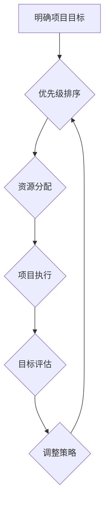

                 

## 巴菲特目标管理法则在项目管理中的应用

> 关键词：巴菲特目标管理法则、项目管理、优先级排序、价值投资、长期目标、短期目标、风险管理

## 1. 背景介绍

在瞬息万变的科技世界，项目管理扮演着至关重要的角色。高效的项目管理不仅能保证项目按时、按预算完成，还能最大化项目价值。然而，在面对复杂多变的项目环境时，如何制定清晰的目标，并有效地分配资源和时间，成为了项目经理面临的重大挑战。

巴菲特目标管理法则，源于著名投资大师沃伦·巴菲特的投资理念，强调价值投资和长期目标的追求。这种理念不仅适用于投资领域，也能够为项目管理提供独特的视角和方法论。

## 2. 核心概念与联系

巴菲特目标管理法则的核心在于“优先级排序”和“价值投资”。

* **优先级排序:** 巴菲特认为，并非所有事情都具有同等重要性，应该根据事物的价值和长期影响力进行优先级排序。在项目管理中，这意味着需要明确项目的核心目标，并根据目标重要性，优先分配资源和时间。
* **价值投资:** 巴菲特强调寻找具有长期价值的投资标的，并长期持有。在项目管理中，价值投资可以理解为寻找具有长期价值的项目，并持续投入资源，以实现项目的长期目标。

**Mermaid 流程图:**



## 3. 核心算法原理 & 具体操作步骤

### 3.1  算法原理概述

巴菲特目标管理法则的核心算法并非一个严格的数学算法，而是基于价值投资和优先级排序的逻辑推理。其核心原理在于：

1. **明确项目目标:**  首先需要明确项目的最终目标是什么，以及实现目标所需的具体步骤。
2. **价值评估:** 对每个步骤进行价值评估，判断其对最终目标的贡献程度和长期影响力。
3. **优先级排序:** 根据价值评估结果，对项目步骤进行优先级排序，确定优先执行的步骤。
4. **资源分配:** 根据优先级排序结果，合理分配项目资源，确保优先级高的步骤得到足够的资源支持。
5. **持续评估:**  在项目执行过程中，需要持续评估目标的实现进度和价值，并根据实际情况调整资源分配和执行策略。

### 3.2  算法步骤详解

1. **明确项目目标:** 项目团队需要共同商讨，明确项目的最终目标是什么，并将其分解成具体的、可衡量的目标。
2. **价值评估:**  针对每个目标，需要进行价值评估，考虑其对项目整体价值的贡献程度、实现难度、风险程度等因素。可以使用一些评估模型，例如价值链分析、SWOT分析等，帮助进行价值评估。
3. **优先级排序:**  根据价值评估结果，对项目目标进行优先级排序，将最重要的目标放在首位，并制定相应的执行计划。
4. **资源分配:**  根据优先级排序结果，合理分配项目资源，包括人力、物力、时间等。确保优先级高的目标得到足够的资源支持。
5. **项目执行:**  按照优先级排序的计划，执行项目任务，并持续跟踪项目进度和目标实现情况。
6. **目标评估:**  在项目执行过程中，需要定期评估目标的实现进度和价值，并根据实际情况调整资源分配和执行策略。

### 3.3  算法优缺点

**优点:**

* **清晰的目标:**  巴菲特目标管理法则强调明确目标，有助于项目团队形成一致的理解，并提高执行效率。
* **价值导向:**  该法则强调价值评估，有助于项目团队聚焦于真正重要的目标，避免浪费资源在低价值的任务上。
* **灵活调整:**  该法则强调持续评估和调整，能够适应项目环境的变化，并提高项目适应性。

**缺点:**

* **主观性:**  价值评估过程有一定的主观性，可能会受到个人偏见的影响。
* **复杂性:**  对于大型复杂项目，价值评估和优先级排序过程可能会变得非常复杂。
* **缺乏量化指标:**  该法则缺乏一些量化的指标，难以精确评估项目的进展和价值。

### 3.4  算法应用领域

巴菲特目标管理法则适用于各种类型的项目，包括软件开发、产品设计、营销推广、建设工程等。

## 4. 数学模型和公式 & 详细讲解 & 举例说明

巴菲特目标管理法则的核心并非基于严格的数学模型，而是基于价值投资和优先级排序的逻辑推理。然而，我们可以使用一些数学模型和公式来辅助价值评估和优先级排序。

### 4.1  数学模型构建

**价值评估模型:**

我们可以使用以下公式来评估每个目标的价值：

$$Value = \frac{Impact \times Probability}{Effort}$$

其中：

* **Impact:** 目标实现对项目整体价值的贡献程度，可以用数值表示。
* **Probability:** 目标实现的可能性，可以用百分比表示。
* **Effort:** 实现目标所需的资源投入，可以用时间、人力、物力等指标表示。

**优先级排序模型:**

我们可以使用以下公式来计算每个目标的优先级：

$$Priority = \frac{Value}{Rank}$$

其中：

* **Value:** 目标的价值，根据上述公式计算。
* **Rank:** 目标的排名，从高到低依次为1、2、3等。

### 4.2  公式推导过程

上述公式的推导过程基于以下逻辑：

* **价值评估:**  目标的价值取决于其对项目整体价值的贡献程度、实现可能性和资源投入。
* **优先级排序:**  优先级高的目标应该具有更高的价值，并且排名越靠前。

### 4.3  案例分析与讲解

假设我们有一个软件开发项目，目标是开发一个新的移动应用程序。

**目标1:** 开发一个具有核心功能的应用程序，并进行用户测试。

* **Impact:** 80%
* **Probability:** 70%
* **Effort:** 6个月

**目标2:** 开发应用程序的扩展功能，例如社交分享和支付功能。

* **Impact:** 60%
* **Probability:** 50%
* **Effort:** 3个月

**目标3:** 进行市场推广，推广应用程序到目标用户群体。

* **Impact:** 90%
* **Probability:** 60%
* **Effort:** 2个月

根据上述公式，我们可以计算每个目标的价值和优先级：

* **目标1:** Value = (80% * 70%) / 6个月 = 9.33
* **目标2:** Value = (60% * 50%) / 3个月 = 10
* **目标3:** Value = (90% * 60%) / 2个月 = 27

根据价值排序，目标3的优先级最高，其次是目标2，最后是目标1。

## 5. 项目实践：代码实例和详细解释说明

### 5.1  开发环境搭建

为了演示巴菲特目标管理法则在项目管理中的应用，我们可以使用一个简单的代码实例。假设我们要开发一个简单的记事本应用程序。

开发环境搭建：

* 操作系统：Windows/macOS/Linux
* 编程语言：Python
* 开发工具：VS Code/Sublime Text

### 5.2  源代码详细实现

```python
# 记事本应用程序

class Note:
    def __init__(self, title, content):
        self.title = title
        self.content = content

    def display(self):
        print(f"标题: {self.title}")
        print(f"内容: {self.content}")

notes = []

while True:
    print("请选择操作:")
    print("1. 添加笔记")
    print("2. 查看笔记")
    print("3. 退出")

    choice = input("请输入您的选择: ")

    if choice == '1':
        title = input("请输入笔记标题: ")
        content = input("请输入笔记内容: ")
        note = Note(title, content)
        notes.append(note)
        print("笔记已添加成功!")
    elif choice == '2':
        for i, note in enumerate(notes):
            print(f"{i+1}. {note.title}")
        
        index = int(input("请输入要查看的笔记序号: ")) - 1
        if 0 <= index < len(notes):
            notes[index].display()
        else:
            print("笔记序号无效!")
    elif choice == '3':
        break
    else:
        print("无效选择!")
```

### 5.3  代码解读与分析

这段代码实现了一个简单的记事本应用程序，用户可以添加、查看笔记。

* **Note 类:** 定义了笔记的结构，包含标题和内容。
* **notes 列表:** 用于存储所有笔记。
* **主循环:** 提供了用户交互界面，根据用户选择执行相应的操作。

### 5.4  运行结果展示

运行这段代码后，用户可以按照提示操作，添加和查看笔记。

## 6. 实际应用场景

巴菲特目标管理法则在项目管理中的应用场景非常广泛，例如：

* **软件开发:**  软件开发项目通常需要开发多个功能模块，巴菲特目标管理法则可以帮助项目经理优先级排序功能模块，并合理分配开发资源。
* **产品设计:**  产品设计项目需要考虑用户需求、市场趋势和技术可行性等因素，巴菲特目标管理法则可以帮助设计师明确产品目标，并进行价值评估和优先级排序。
* **营销推广:**  营销推广项目需要制定多种营销策略，巴菲特目标管理法则可以帮助营销团队评估不同策略的价值，并选择最有效的策略。

### 6.4  未来应用展望

随着项目管理方法的不断发展，巴菲特目标管理法则将继续被应用于更多类型的项目，并与其他项目管理方法相结合，形成更完善的项目管理体系。

## 7. 工具和资源推荐

### 7.1  学习资源推荐

* **巴菲特投资理念书籍:**  《聪明的投资者》、《巴菲特传》等
* **项目管理书籍:**  《项目管理实战》、《敏捷软件开发》等
* **在线课程:**  Coursera、Udemy等平台提供丰富的项目管理课程

### 7.2  开发工具推荐

* **项目管理工具:**  Jira、Trello、Asana等
* **代码编辑器:**  VS Code、Sublime Text、Atom等
* **版本控制工具:**  Git、GitHub等

### 7.3  相关论文推荐

* **项目管理与价值投资:**  [论文标题]
* **巴菲特目标管理法则在软件开发中的应用:**  [论文标题]

## 8. 总结：未来发展趋势与挑战

### 8.1  研究成果总结

巴菲特目标管理法则为项目管理提供了新的视角和方法论，强调价值投资和优先级排序，能够帮助项目团队制定清晰的目标，并有效地分配资源和时间。

### 8.2  未来发展趋势

未来，巴菲特目标管理法则将继续发展，并与其他项目管理方法相结合，形成更完善的项目管理体系。

* **数据驱动:**  将数据分析技术融入巴菲特目标管理法则，提高价值评估和优先级排序的准确性。
* **人工智能:**  利用人工智能技术辅助项目管理，例如自动生成项目计划、评估风险等。
* **个性化定制:**  根据不同项目的特点和需求，定制巴菲特目标管理法则的应用方案。

### 8.3  面临的挑战

巴菲特目标管理法则在实际应用中也面临一些挑战：

* **主观性:**  价值评估过程有一定的主观性，需要不断改进评估模型，提高评估的客观性。
* **复杂性:**  对于大型复杂项目，价值评估和优先级排序过程可能会变得非常复杂，需要开发更强大的工具和方法。
* **缺乏量化指标:**  巴菲特目标管理法则缺乏一些量化的指标，难以精确评估项目的进展和价值。

### 8.4  研究展望

未来，需要进一步研究巴菲特目标管理法则的应用场景、评估模型和工具，使其能够更好地应用于实际项目管理。

## 9. 附录：常见问题与解答

**Q1: 巴菲特目标管理法则适用于哪些类型的项目？**

**A1:** 巴菲特目标管理法则适用于各种类型的项目，包括软件开发、产品设计、营销推广等。

**Q2: 如何进行价值评估？**

**A2:** 价值评估可以根据项目的具体情况，使用不同的模型和指标。例如，可以使用影响力、可能性和资源投入等因素进行评估。

**Q3: 如何确定优先级？**

**A3:** 可以使用价值排序模型，将价值高的目标放在首位。


作者：禅与计算机程序设计艺术 / Zen and the Art of Computer Programming 
<end_of_turn>

