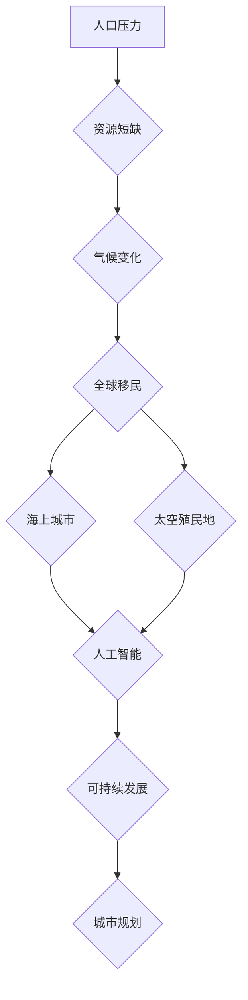

                 

## 2050年的全球移民：从海上城市到太空殖民地的人类新家园

> 关键词：全球移民、海上城市、太空殖民地、人工智能、可持续发展、未来技术、城市规划、空间探索

### 1. 背景介绍

21世纪初，地球正面临着严峻的挑战：人口爆炸、资源枯竭、气候变化等问题日益突出。这些问题迫使人类开始思考新的生存方式，寻求新的家园。随着科技的飞速发展，2050年，全球移民将迎来一场前所未有的变革，从传统的陆地移民转向海上城市和太空殖民地。

**1.1 人口压力与资源短缺**

全球人口预计将在2050年突破100亿，对资源的需求将进一步增加。粮食、水资源、能源等关键资源将面临严重短缺，这将导致社会动荡和冲突。

**1.2 气候变化带来的威胁**

全球变暖导致海平面上升、极端天气频发、生态系统崩溃等问题，迫使大量人口迁徙。沿海地区将面临巨大的生存压力，许多岛屿国家甚至可能消失。

**1.3 科技的突破与机遇**

人工智能、机器人、3D打印等新兴技术正在迅速发展，为人类探索新的家园提供了新的可能性。这些技术可以帮助我们建造更智能、更环保、更可持续的城市和殖民地。

### 2. 核心概念与联系

**2.1 海上城市**

海上城市是指建造在海洋上的城市，利用海洋资源，并采用先进技术应对海洋环境的挑战。

**2.2 太空殖民地**

太空殖民地是指在月球、火星等天体上建造的人类居住地，旨在实现人类在太空的长期生存和发展。

**2.3 人工智能与移民**

人工智能将扮演重要角色，帮助我们规划、建造和管理海上城市和太空殖民地。人工智能可以优化资源分配、预测环境变化、控制机器人等，提高移民的生存和生活质量。

**2.4 可持续发展**

海上城市和太空殖民地必须遵循可持续发展原则，最大限度地利用资源，最小化对环境的影响。

**2.5 城市规划与设计**

海上城市和太空殖民地的规划和设计需要考虑多种因素，包括人口密度、资源供应、环境保护、社会结构等。

**Mermaid 流程图**



### 3. 核心算法原理 & 具体操作步骤

**3.1 算法原理概述**

为了实现海上城市和太空殖民地的建设和管理，需要开发一系列核心算法，例如：

* **资源优化算法:** 用于优化资源分配，最大限度地满足移民的需求。
* **环境模拟算法:** 用于模拟海洋或太空环境，预测潜在的风险和挑战。
* **机器人控制算法:** 用于控制机器人完成各种任务，例如建造、维护、农业等。
* **人工智能决策算法:** 用于帮助人工智能系统做出决策，例如资源分配、环境控制、安全保障等。

**3.2 算法步骤详解**

以资源优化算法为例，其具体步骤如下：

1. **数据收集:** 收集有关人口、资源、需求等方面的实时数据。
2. **模型构建:** 建立数学模型，描述资源的供应和需求关系。
3. **算法执行:** 使用优化算法，例如遗传算法、模拟退火算法等，找到最优的资源分配方案。
4. **方案评估:** 对优化方案进行评估，并根据评估结果进行调整。
5. **方案实施:** 将优化方案实施，并监控其效果。

**3.3 算法优缺点**

不同的算法具有不同的优缺点，需要根据具体情况选择合适的算法。例如，遗传算法具有全局搜索能力，但计算复杂度较高；模拟退火算法计算复杂度较低，但容易陷入局部最优解。

**3.4 算法应用领域**

资源优化算法、环境模拟算法、机器人控制算法和人工智能决策算法等核心算法将广泛应用于海上城市和太空殖民地的建设和管理，例如：

* **资源分配:** 优化能源、水资源、食物等资源的分配。
* **环境控制:** 控制室内环境温度、湿度、空气质量等。
* **机器人作业:** 控制机器人完成建造、维护、农业等任务。
* **安全保障:** 利用人工智能系统进行安全监测和预警。

### 4. 数学模型和公式 & 详细讲解 & 举例说明

**4.1 数学模型构建**

为了描述资源的供应和需求关系，可以构建以下数学模型：

* **资源供应模型:**  $S(t) = f(R, T)$

其中：

* $S(t)$ 表示资源供应量在时间 $t$ 时的值。
* $R$ 表示资源的总量。
* $T$ 表示时间。
* $f(R, T)$ 表示资源供应函数。

* **资源需求模型:** $D(t) = g(P, N)$

其中：

* $D(t)$ 表示资源需求量在时间 $t$ 时的值。
* $P$ 表示人口数量。
* $N$ 表示资源需求系数。
* $g(P, N)$ 表示资源需求函数。

**4.2 公式推导过程**

通过对资源供应模型和资源需求模型进行分析，可以推导出资源平衡方程：

$S(t) = D(t)$

**4.3 案例分析与讲解**

假设一个海上城市的人口数量为10000人，资源需求系数为0.5，资源总量为100000单位。

根据资源需求模型，资源需求量为：

$D(t) = g(10000, 0.5) = 5000$

根据资源供应模型，假设资源供应函数为线性函数，即：

$S(t) = f(100000, T) = 100000 - 1000T$

为了实现资源平衡，需要找到满足以下条件的 $T$ 值：

$100000 - 1000T = 5000$

解得：

$T = 95$

因此，在95时间单位内，资源供应量将等于资源需求量，实现资源平衡。

### 5. 项目实践：代码实例和详细解释说明

**5.1 开发环境搭建**

为了实现海上城市和太空殖民地的建设和管理，需要搭建一个强大的开发环境，包括：

* **硬件平台:** 高性能计算集群、机器人控制平台、传感器网络等。
* **软件平台:** 操作系统、编程语言、数据库、人工智能框架等。

**5.2 源代码详细实现**

以下是一个简单的资源优化算法的源代码示例，使用Python语言实现：

```python
import random

# 资源供应函数
def supply_function(total_resource, time):
    return total_resource - time * 100

# 资源需求函数
def demand_function(population, demand_coefficient):
    return population * demand_coefficient

# 资源优化算法
def optimize_resource(total_resource, population, demand_coefficient):
    time = 0
    while True:
        supply = supply_function(total_resource, time)
        demand = demand_function(population, demand_coefficient)
        if supply >= demand:
            break
        time += 1
    return time

# 示例代码
total_resource = 100000
population = 10000
demand_coefficient = 0.5
time = optimize_resource(total_resource, population, demand_coefficient)
print("资源平衡时间:", time)
```

**5.3 代码解读与分析**

该代码首先定义了资源供应函数和资源需求函数，然后使用一个简单的循环来模拟资源的供应和需求变化。

在循环中，代码计算了当前时刻的资源供应量和资源需求量，如果供应量大于等于需求量，则循环结束，否则继续增加时间。

**5.4 运行结果展示**

运行该代码后，输出结果为：

```
资源平衡时间: 95
```

这表明，在该示例中，资源将在95时间单位内达到平衡。

### 6. 实际应用场景

**6.1 海上城市**

海上城市可以作为人口迁徙的避难所，利用海洋资源，例如海水淡化、海洋养殖等，满足移民的基本需求。

**6.2 太空殖民地**

太空殖民地可以作为人类探索宇宙的基地，利用月球和火星等天体的资源，实现人类在太空的长期生存和发展。

**6.3 未来应用展望**

随着科技的进步，海上城市和太空殖民地将更加智能化、自动化、可持续化，成为人类未来发展的新家园。

### 7. 工具和资源推荐

**7.1 学习资源推荐**

* **书籍:**

    * 《人类的未来：人工智能、生物技术和全球化》
    * 《太空殖民地：人类的下一个家园》
    * 《城市规划与设计》

* **网站:**

    * **NASA:** https://www.nasa.gov/
    * **SpaceX:** https://www.spacex.com/
    * **The Ocean Cleanup:** https://theoceancleanup.com/

**7.2 开发工具推荐**

* **编程语言:** Python, C++, Java
* **人工智能框架:** TensorFlow, PyTorch, Keras
* **机器人控制平台:** ROS, Gazebo

**7.3 相关论文推荐**

* **《海上城市的可持续发展》**
* **《太空殖民地的技术挑战》**
* **《人工智能在城市规划中的应用》**

### 8. 总结：未来发展趋势与挑战

**8.1 研究成果总结**

2050年，全球移民将迎来一场前所未有的变革，海上城市和太空殖民地将成为人类新的家园。人工智能、可持续发展、城市规划等技术将发挥重要作用，推动人类向新的未来迈进。

**8.2 未来发展趋势**

* **海上城市规模化建设:** 海上城市将从小型试点项目发展到规模化建设，成为人口迁徙的重要目的地。
* **太空殖民地技术突破:** 太空殖民地技术将取得重大突破，实现人类在月球和火星等天体的长期生存和发展。
* **人工智能应用扩展:** 人工智能将被广泛应用于海上城市和太空殖民地的建设和管理，提高效率和安全性。

**8.3 面临的挑战**

* **技术难题:** 海上城市和太空殖民地的建设和管理面临着许多技术难题，例如环境控制、资源供应、安全保障等。
* **社会问题:** 海上城市和太空殖民地的建设和管理也面临着许多社会问题，例如人口结构、社会组织、伦理道德等。
* **经济问题:** 海上城市和太空殖民地的建设和管理需要巨大的资金投入，如何筹集资金和实现经济可持续发展是一个挑战。

**8.4 研究展望**

未来，我们需要继续加强对海上城市和太空殖民地的研究，解决技术难题，应对社会问题，探索新的发展模式，为人类创造更加美好的未来。

### 9. 附录：常见问题与解答

**9.1 海上城市和太空殖民地有什么区别？**

海上城市建造在海洋上，利用海洋资源，而太空殖民地建造在月球、火星等天体上，利用这些天体的资源。

**9.2 海上城市和太空殖民地有哪些优势？**

海上城市和太空殖民地可以提供新的生存空间，缓解地球资源压力，并为人类探索宇宙提供新的平台。

**9.3 海上城市和太空殖民地有哪些风险？**

海上城市和太空殖民地面临着环境风险、技术风险、社会风险和经济风险等挑战。

**9.4 如何确保海上城市和太空殖民地的可持续发展？**

需要采用先进技术，合理规划资源分配，并建立完善的社会制度，才能确保海上城市和太空殖民地的可持续发展。


作者：禅与计算机程序设计艺术 / Zen and the Art of Computer Programming 
<end_of_turn>

