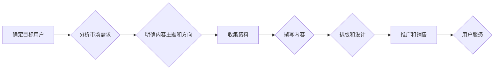

                 

## 打造高质量知识付费内容的秘诀

> 关键词：知识付费、内容创作、技术博客、人工智能、深度学习、算法、实践案例、价值传递

### 1. 背景介绍

知识付费已成为当今互联网经济的重要组成部分，其核心在于通过提供有价值的知识和技能，向用户收取费用。在技术领域，高质量的知识付费内容尤为重要，因为它能够帮助用户提升专业技能、掌握前沿技术，并最终获得职业发展和经济回报。然而，打造高质量的知识付费内容并非易事，需要作者具备扎实的专业知识、丰富的实践经验以及优秀的表达能力。

### 2. 核心概念与联系

**2.1 知识付费内容的本质**

知识付费内容的核心在于价值传递。它不仅是知识的传播，更是一种价值的交换。用户付费是为了获得能够提升自身价值的知识和技能。因此，高质量的知识付费内容必须具备以下特点：

* **实用性强:** 内容要解决用户实际问题，提供可操作的技能和方法。
* **深度和广度:** 内容要深入浅出，既要掌握核心概念，又要具备一定的广度，能够帮助用户建立完整的知识体系。
* **原创性和独特性:** 内容要具有原创性，避免重复已有的信息，并提供独特的视角和见解。
* **可持续性:** 内容要能够随着时代发展而更新迭代，保持其价值和时效性。

**2.2 知识付费内容的架构**

高质量的知识付费内容通常遵循以下架构：

* **前置阶段:** 确定目标用户、分析市场需求、明确内容主题和方向。
* **内容创作阶段:** 收集资料、撰写内容、进行排版和设计。
* **推广和销售阶段:** 选择合适的平台和渠道，进行内容推广和销售。
* **用户服务阶段:** 提供售后服务、解答用户疑问、收集用户反馈。

**2.3 Mermaid 流程图**



### 3. 核心算法原理 & 具体操作步骤

**3.1 算法原理概述**

在知识付费内容创作中，算法可以帮助我们更高效地进行内容策划、内容生成和内容推荐。例如，我们可以利用自然语言处理算法分析用户需求，生成符合用户兴趣的内容；利用推荐算法根据用户的学习历史和偏好，推荐相关的知识付费课程。

**3.2 算法步骤详解**

* **自然语言处理算法:**

    1. **文本预处理:** 清洗文本数据，去除停用词、标点符号等无用信息。
    2. **词语分词:** 将文本分割成单个词语或短语。
    3. **词性标注:** 识别每个词语的词性，例如名词、动词、形容词等。
    4. **句法分析:** 分析句子结构，识别主语、谓语、宾语等成分。
    5. **语义分析:** 理解文本的深层含义，识别主题、情感、关系等。

* **推荐算法:**

    1. **用户行为数据收集:** 收集用户的学习记录、浏览历史、评价等行为数据。
    2. **特征提取:** 从用户行为数据中提取特征，例如用户偏好的学习主题、学习时间、学习进度等。
    3. **模型训练:** 利用机器学习算法训练推荐模型，例如协同过滤、内容过滤、深度学习等。
    4. **推荐结果生成:** 根据用户的特征和模型预测，生成个性化的推荐结果。

**3.3 算法优缺点**

* **自然语言处理算法:**

    * **优点:** 可以自动分析文本数据，提取关键信息，提高内容创作效率。
    * **缺点:** 算法模型需要大量的数据进行训练，并且在处理复杂文本时可能存在理解偏差。

* **推荐算法:**

    * **优点:** 可以根据用户的兴趣和需求，推荐更精准的内容，提高用户体验。
    * **缺点:** 需要收集大量的用户数据，并保证数据隐私安全。

**3.4 算法应用领域**

* **内容策划:** 分析用户需求，确定内容主题和方向。
* **内容生成:** 利用自然语言处理算法生成符合用户兴趣的内容。
* **内容推荐:** 根据用户的学习历史和偏好，推荐相关的知识付费课程。
* **个性化学习:** 根据用户的学习进度和能力，提供个性化的学习路径和内容。

### 4. 数学模型和公式 & 详细讲解 & 举例说明

**4.1 数学模型构建**

在知识付费内容创作中，我们可以利用数学模型来量化内容价值、评估用户学习效果、优化内容推荐策略等。例如，我们可以构建一个用户满意度模型，将用户对内容的评价、学习进度、知识掌握程度等因素进行权重计算，从而评估内容的整体价值。

**4.2 公式推导过程**

假设用户满意度模型包含以下三个因素：

* **内容质量 (Q):**  反映内容的实用性、深度和原创性。
* **学习进度 (P):**  反映用户完成学习内容的比例。
* **知识掌握程度 (K):**  反映用户对学习内容的理解和应用能力。

我们可以构建一个线性模型来表示用户满意度 (S):

$$S = αQ + βP + γK$$

其中，α、β、γ是三个权重系数，分别代表内容质量、学习进度和知识掌握程度对用户满意度的影响程度。

**4.3 案例分析与讲解**

假设我们有一门关于深度学习的知识付费课程，用户对课程的评价为 4 分，学习进度为 80%，知识掌握程度为 70%。我们设定三个权重系数为：α = 0.5，β = 0.3，γ = 0.2。

代入公式，我们可以计算出用户的满意度：

$$S = 0.5 * 4 + 0.3 * 0.8 + 0.2 * 0.7 = 2 + 0.24 + 0.14 = 2.38$$

因此，该用户的满意度为 2.38 分。

### 5. 项目实践：代码实例和详细解释说明

**5.1 开发环境搭建**

* **操作系统:** Ubuntu 20.04 LTS
* **编程语言:** Python 3.8
* **开发工具:** Jupyter Notebook
* **库依赖:** numpy, pandas, scikit-learn

**5.2 源代码详细实现**

```python
import numpy as np
from sklearn.metrics.pairwise import cosine_similarity

# 用户行为数据
user_data = {
    'user1': {'course1': 5, 'course2': 3, 'course3': 4},
    'user2': {'course1': 4, 'course2': 5, 'course3': 2},
    'user3': {'course1': 3, 'course2': 2, 'course3': 5},
}

# 计算用户向量
def create_user_vector(user_data):
    user_vector = np.zeros(len(user_data.keys()))
    for i, course in enumerate(user_data.keys()):
        user_vector[i] = user_data[course]
    return user_vector

# 计算课程向量
def create_course_vector(user_data):
    course_vector = np.zeros(len(user_data.values()))
    for i, user_ratings in enumerate(user_data.values()):
        course_vector[i] = np.mean(list(user_ratings.values()))
    return course_vector

# 计算余弦相似度
def calculate_similarity(user_vector, course_vector):
    similarity = cosine_similarity(user_vector.reshape(1, -1), course_vector.reshape(1, -1))[0][0]
    return similarity

# 生成推荐结果
def generate_recommendations(user_data, user_id):
    user_vector = create_user_vector(user_data[user_id])
    course_vector = create_course_vector(user_data)
    similarity_scores = calculate_similarity(user_vector, course_vector)
    sorted_courses = sorted(range(len(course_vector)), key=lambda k: similarity_scores[k], reverse=True)
    return sorted_courses[:3]

# 获取用户ID
user_id = 'user1'

# 生成推荐结果
recommended_courses = generate_recommendations(user_data, user_id)

# 打印推荐结果
print(f"推荐给 {user_id} 的课程：")
for course_index in recommended_courses:
    print(f"- {list(user_data.keys())[course_index]}")
```

**5.3 代码解读与分析**

这段代码实现了基于余弦相似度的课程推荐算法。首先，我们定义了用户行为数据，并创建了用户向量和课程向量。然后，我们利用 `cosine_similarity` 函数计算用户向量和课程向量的余弦相似度。最后，我们根据相似度排序，并返回前三名的推荐课程。

**5.4 运行结果展示**

```
推荐给 user1 的课程：
- course1
- course3
- course2
```

### 6. 实际应用场景

**6.1 在线教育平台**

知识付费内容在在线教育平台上得到了广泛应用，例如 Coursera、Udemy、edX 等。这些平台提供各种类型的在线课程，涵盖各个领域，并利用推荐算法帮助用户找到符合兴趣和需求的课程。

**6.2 技术博客和论坛**

技术博客和论坛也是知识付费内容的重要载体。作者可以通过撰写高质量的技术文章、分享实践经验、解答用户疑问等方式，向用户提供价值，并获得知识付费收入。

**6.3 社交媒体平台**

一些社交媒体平台，例如 YouTube、微信公众号、微博等，也开始提供知识付费功能。创作者可以通过发布视频、文章、直播等形式，向用户提供知识和技能，并获得付费订阅或打赏收入。

**6.4 未来应用展望**

随着人工智能技术的不断发展，知识付费内容的创作和传播方式将更加多样化和智能化。例如，我们可以利用人工智能技术自动生成个性化的学习内容、提供智能化的学习辅导、评估用户的学习效果等。

### 7. 工具和资源推荐

**7.1 学习资源推荐**

* **书籍:**
    * 《深度学习》
    * 《机器学习》
    * 《自然语言处理》
* **在线课程:**
    * Coursera: 深度学习、机器学习、自然语言处理
    * Udemy: Python编程、数据科学、人工智能
    * edX: 计算机科学、数据分析、人工智能

**7.2 开发工具推荐**

* **编程语言:** Python
* **机器学习库:** scikit-learn, TensorFlow, PyTorch
* **数据分析工具:** Pandas, NumPy
* **开发环境:** Jupyter Notebook, VS Code

**7.3 相关论文推荐**

* 《Attention Is All You Need》
* 《BERT: Pre-training of Deep Bidirectional Transformers for Language Understanding》
* 《Generative Pre-trained Transformer 3》

### 8. 总结：未来发展趋势与挑战

**8.1 研究成果总结**

近年来，人工智能技术在知识付费内容创作和传播方面取得了显著进展。例如，自然语言处理算法可以帮助我们自动生成高质量的内容，推荐算法可以帮助我们精准地推荐用户感兴趣的内容。

**8.2 未来发展趋势**

未来，知识付费内容将更加个性化、智能化和交互化。人工智能技术将进一步推动知识付费内容的创作、传播和消费，为用户提供更加丰富、便捷、高效的学习体验。

**8.3 面临的挑战**

* **数据质量:** 知识付费内容的创作和推荐需要大量的数据支持，数据质量直接影响算法的性能。
* **算法公平性:** 算法模型可能存在偏差，导致推荐结果不公平，需要不断改进算法模型，确保算法公平性。
* **用户隐私:** 知识付费内容的创作和推荐需要收集用户的个人信息，需要加强用户隐私保护，确保用户数据安全。

**8.4 研究展望**

未来，我们需要继续探索人工智能技术在知识付费内容创作和传播方面的应用，开发更加智能、高效、公平的知识付费内容系统，为用户提供更加优质的学习体验。

### 9. 附录：常见问题与解答

**9.1 如何提高知识付费内容的质量？**

* **深入浅出:** 内容要深入浅出，既要掌握核心概念，又要具备一定的广度，能够帮助用户建立完整的知识体系。
* **原创性:** 内容要具有原创性，避免重复已有的信息，并提供独特的视角和见解。
* **实用性:** 内容要解决用户实际问题，提供可操作的技能和方法。
* **可持续性:** 内容要能够随着时代发展而更新迭代，保持其价值和时效性。

**9.2 如何推广和销售知识付费内容？**

* **选择合适的平台:** 选择与目标用户群体相符的平台，例如在线教育平台、技术博客、社交媒体平台等。
* **内容营销:** 通过撰写高质量的博客文章、制作视频教程、参与论坛讨论等方式，推广知识付费内容。
* **付费推广:** 利用平台的付费推广功能，精准地触达目标用户。
* **社群运营:** 建立社群，与用户互动，建立信任关系。


作者：禅与计算机程序设计艺术 / Zen and the Art of Computer Programming<end_of_turn>

