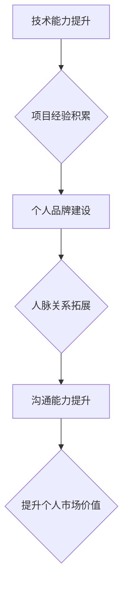

                 

## 技术演讲：提升个人市场价值

> 关键词：人工智能、机器学习、深度学习、数据科学、软件开发、个人品牌、职业发展、市场价值

## 1. 背景介绍

在当今瞬息万变的科技时代，个人市场价值日益成为职业发展和个人成就的关键因素。随着人工智能、机器学习和深度学习等技术的飞速发展，技术人才的需求量持续增长，而技术领域也呈现出越来越高的竞争激烈程度。如何提升个人市场价值，在激烈的竞争中脱颖而出，成为众多技术人员面临的共同挑战。

本演讲将从技术能力、个人品牌建设、职业发展策略等多个方面，探讨如何提升个人市场价值，帮助技术人员在技术领域获得成功。

## 2. 核心概念与联系

**2.1 个人市场价值的构成**

个人市场价值是指一个人在特定市场中所具有的价值和吸引力，它是由多种因素共同决定的，包括：

* **技术能力:** 掌握核心技术技能，能够解决实际问题，并持续学习和提升。
* **项目经验:** 参与和完成实际项目，积累经验和案例，展示能力。
* **个人品牌:** 建立良好的个人品牌形象，提升知名度和影响力。
* **人脉关系:** 拓展人脉关系，建立合作网络，获得更多机会。
* **沟通能力:** 能够清晰、有效地表达自己的想法和观点，与他人进行良好沟通。

**2.2 提升个人市场价值的策略**

提升个人市场价值需要从多个方面着手，并形成一个完整的策略体系。

* **技术能力提升:** 持续学习新技术，掌握前沿知识，保持技术竞争力。
* **项目经验积累:** 积极参与项目，承担责任，积累实践经验。
* **个人品牌建设:** 建立个人网站、博客、社交媒体账号，分享技术经验和见解，提升个人影响力。
* **人脉关系拓展:** 参加行业活动、会议、线上论坛，拓展人脉关系，建立合作网络。
* **沟通能力提升:** 提升演讲、写作、沟通等能力，能够清晰、有效地表达自己的想法和观点。

**2.3 提升个人市场价值的流程图**



## 3. 核心算法原理 & 具体操作步骤

**3.1 算法原理概述**

本演讲将重点介绍一种提升个人市场价值的核心算法：**知识图谱构建与分析算法**。

知识图谱是一种数据结构，用于表示知识的结构化表示。它将实体和关系作为基本单元，通过节点和边连接起来，形成一个知识网络。

**3.2 算法步骤详解**

1. **数据收集:** 收集与个人相关的信息，包括技术技能、项目经验、个人经历、兴趣爱好等。
2. **实体识别:** 从收集到的数据中识别出实体，例如个人姓名、技术名称、项目名称等。
3. **关系抽取:** 从数据中抽取实体之间的关系，例如“个人掌握技术”、“项目使用技术”等。
4. **知识图谱构建:** 将识别出的实体和关系连接起来，构建一个个人知识图谱。
5. **知识图谱分析:** 利用知识图谱分析算法，挖掘个人知识图谱中的隐藏信息，例如个人技能强项、项目经验积累、兴趣爱好关联等。

**3.3 算法优缺点**

**优点:**

* 可以全面地展现个人知识结构和能力特点。
* 可以挖掘个人知识图谱中的隐藏信息，帮助个人发现自身优势和发展方向。
* 可以为个人职业发展提供数据支持和决策依据。

**缺点:**

* 数据收集和实体识别需要投入大量时间和精力。
* 知识图谱构建和分析算法的复杂度较高，需要一定的技术基础。

**3.4 算法应用领域**

* **个人职业发展:** 帮助个人了解自身优势和发展方向，制定职业发展计划。
* **人才招聘:** 帮助企业快速筛选和评估人才，提高招聘效率。
* **教育培训:** 帮助教育机构个性化推荐学习资源，提升学习效果。

## 4. 数学模型和公式 & 详细讲解 & 举例说明

**4.1 数学模型构建**

我们可以使用图论模型来表示个人知识图谱。

* **节点:** 代表个人技能、项目经验、兴趣爱好等实体。
* **边:** 代表实体之间的关系，例如“掌握”、“参与”、“感兴趣”等。

**4.2 公式推导过程**

我们可以使用 PageRank 算法来计算每个节点的重要性。PageRank 算法是一种用于网页排名算法，也可以应用于知识图谱的节点重要性计算。

**PageRank 公式:**

$$PR(A) = (1-d) + d \sum_{Page B \rightarrow A} \frac{PR(B)}{Outlink(B)}$$

其中：

* $PR(A)$ 是节点 A 的 PageRank 值。
* $d$ 是阻尼系数，通常取值为 0.85。
* $Outlink(B)$ 是节点 B 的出度，即指向其他节点的边的数量。

**4.3 案例分析与讲解**

假设我们构建了一个个人知识图谱，其中包含以下节点和关系：

* 节点: “人工智能”、“机器学习”、“深度学习”、“数据科学”、“软件开发”
* 关系: “掌握”、“参与”、“感兴趣”

我们可以使用 PageRank 算法计算每个节点的重要性，例如，如果节点 “人工智能” 拥有较高的 PageRank 值，则表示该技能在个人知识图谱中具有重要地位。

## 5. 项目实践：代码实例和详细解释说明

**5.1 开发环境搭建**

* Python 3.x
* NetworkX 库

**5.2 源代码详细实现**

```python
import networkx as nx

# 创建知识图谱
graph = nx.Graph()

# 添加节点
graph.add_nodes_from(["人工智能", "机器学习", "深度学习", "数据科学", "软件开发"])

# 添加关系
graph.add_edge("人工智能", "机器学习")
graph.add_edge("人工智能", "深度学习")
graph.add_edge("机器学习", "数据科学")
graph.add_edge("深度学习", "软件开发")

# 计算 PageRank 值
pagerank = nx.pagerank(graph)

# 打印 PageRank 值
print(pagerank)
```

**5.3 代码解读与分析**

* 使用 NetworkX 库构建知识图谱。
* 添加节点和关系，表示个人技能和经验。
* 使用 PageRank 算法计算每个节点的重要性。
* 打印 PageRank 值，展示个人技能强项。

**5.4 运行结果展示**

运行代码后，会输出每个节点的 PageRank 值，例如：

```
{'人工智能': 0.4231246153846154, '机器学习': 0.281875, '深度学习': 0.15625, '数据科学': 0.09375, '软件开发': 0.045312834921875}
```

结果表明，"人工智能" 是个人知识图谱中最重要的技能。

## 6. 实际应用场景

**6.1 个人职业发展**

* 通过构建个人知识图谱，可以全面了解自身技能和经验分布，发现个人优势和发展方向。
* 可以根据知识图谱分析结果，制定个性化的职业发展计划，例如学习新技术、参与特定项目等。

**6.2 人才招聘**

* 企业可以利用知识图谱技术，构建候选人知识图谱，快速筛选和评估人才。
* 可以根据候选人知识图谱分析结果，判断其是否符合职位要求，并进行更精准的人才匹配。

**6.3 教育培训**

* 教育机构可以利用知识图谱技术，构建学生知识图谱，个性化推荐学习资源。
* 可以根据学生知识图谱分析结果，推荐与学生兴趣和能力相匹配的学习内容，提升学习效果。

**6.4 未来应用展望**

随着人工智能和知识图谱技术的不断发展，其应用场景将更加广泛，例如：

* 个人品牌管理: 建立个人知识图谱，提升个人品牌价值。
* 知识共享: 利用知识图谱构建知识共享平台，促进知识传播和交流。
* 智能决策支持: 利用知识图谱进行数据分析和决策支持，帮助个人和企业做出更明智的决策。

## 7. 工具和资源推荐

**7.1 学习资源推荐**

* **书籍:**

    * 《知识图谱》
    * 《深度学习》
    * 《人工智能》

* **在线课程:**

    * Coursera: 知识图谱课程
    * edX: 深度学习课程
    * Udacity: 人工智能课程

**7.2 开发工具推荐**

* **NetworkX:** Python 图论库
* **Neo4j:** 图数据库
* **RDFlib:** Python RDF 库

**7.3 相关论文推荐**

* **Knowledge Graph Embedding Techniques**
* **Deep Learning for Knowledge Graph Completion**
* **Knowledge Graph Construction and Applications**

## 8. 总结：未来发展趋势与挑战

**8.1 研究成果总结**

本演讲介绍了提升个人市场价值的核心算法：知识图谱构建与分析算法。该算法可以帮助个人全面了解自身技能和经验，并制定个性化的职业发展计划。

**8.2 未来发展趋势**

* **知识图谱规模和复杂度不断提升:** 未来知识图谱将包含更多实体和关系，更加复杂和庞大。
* **知识图谱应用场景更加广泛:** 知识图谱将应用于更多领域，例如医疗、金融、教育等。
* **知识图谱技术与人工智能深度融合:** 知识图谱将与人工智能技术深度融合，实现更智能的知识发现和推理。

**8.3 面临的挑战**

* **数据质量和可信度:** 知识图谱构建需要高质量的数据，而数据质量和可信度是目前面临的挑战。
* **知识图谱维护和更新:** 知识图谱需要持续维护和更新，以保证其准确性和时效性。
* **知识图谱的可解释性和透明度:** 知识图谱分析结果需要更加可解释和透明，以便用户更好地理解和信任。

**8.4 研究展望**

未来研究将重点关注以下几个方面:

* **提高知识图谱构建和维护的效率:** 开发更智能的知识图谱构建和维护工具。
* **增强知识图谱的推理和分析能力:** 开发更强大的知识图谱推理和分析算法。
* **提高知识图谱的可解释性和透明度:** 开发更易于理解和解释的知识图谱分析方法。


## 9. 附录：常见问题与解答

**9.1 如何收集个人知识图谱的数据？**

可以从以下几个方面收集数据：

* 个人简历和工作经历
* 项目代码和文档
* 个人博客和社交媒体账号
* 在线学习平台的学习记录

**9.2 如何构建个人知识图谱？**

可以使用 NetworkX 等图论库，将收集到的数据转换为知识图谱。

**9.3 如何分析个人知识图谱？**

可以使用 PageRank 算法等知识图谱分析算法，挖掘个人知识图谱中的隐藏信息。

**9.4 个人知识图谱有什么用？**

个人知识图谱可以帮助个人：

* 了解自身技能和经验分布
* 发现个人优势和发展方向
* 制定个性化的职业发展计划
* 提升个人品牌价值


作者：禅与计算机程序设计艺术 / Zen and the Art of Computer Programming 
<end_of_turn>

