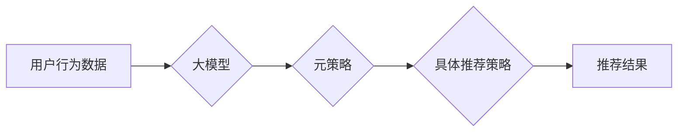

                 

## 推荐系统中的大模型元强化学习与策略优化

> 关键词：推荐系统、大模型、元强化学习、策略优化、深度学习、个性化推荐

## 1. 背景介绍

推荐系统作为信息过滤和个性化内容呈现的关键技术，在电商、社交媒体、视频平台等领域发挥着越来越重要的作用。传统的推荐系统主要依赖于协同过滤、内容过滤等方法，但随着数据规模的不断增长和用户行为的复杂性增加，这些方法面临着越来越多的挑战。

近年来，深度学习技术在推荐系统领域取得了显著的进展，基于深度学习的推荐模型能够更好地学习用户兴趣和物品特征，从而提供更精准的推荐结果。然而，深度学习模型的训练通常需要大量的 labeled 数据，而获取高质量的 labeled 数据成本高昂且耗时。

元强化学习 (Meta Reinforcement Learning, MRL) 作为一种新兴的机器学习范式，能够学习通用的策略，并将其应用于不同的任务，从而有效解决数据稀缺问题。将 MRL 与大模型结合，可以构建更强大的推荐系统，实现更精准、更个性化的推荐。

## 2. 核心概念与联系

### 2.1 元强化学习 (MRL)

元强化学习 (MRL) 旨在学习一个通用的策略，该策略能够在不同的环境下有效地执行任务。MRL 的核心思想是将学习过程看作是一个“学习如何学习”的过程。

MRL 模型学习一个“元策略”，该策略能够根据环境信息生成一个具体的策略，并通过执行该策略来获得奖励。

### 2.2 大模型

大模型是指参数量巨大、训练数据量庞大的深度学习模型。大模型通常具有强大的泛化能力和表示能力，能够学习到更复杂的特征和模式。

### 2.3 推荐系统与 MRL 的结合

将 MRL 与推荐系统结合，可以构建一个元学习驱动的推荐系统。该系统可以学习一个通用的推荐策略，并根据用户的历史行为、物品特征等信息生成具体的推荐策略。

**Mermaid 流程图**



## 3. 核心算法原理 & 具体操作步骤

### 3.1 算法原理概述

元强化学习与策略优化的结合，可以构建一个高效的推荐系统。该算法的核心思想是：

1. **元学习:** 利用大模型学习一个通用的策略，该策略能够根据用户的历史行为和物品特征等信息生成具体的推荐策略。
2. **策略优化:** 通过强化学习算法，优化具体的推荐策略，使其能够最大化用户的点击、购买等行为。

### 3.2 算法步骤详解

1. **数据预处理:** 收集用户行为数据、物品特征数据等，并进行预处理，例如特征工程、数据清洗等。
2. **大模型训练:** 利用大模型训练一个元策略，该策略能够根据用户的历史行为和物品特征等信息生成具体的推荐策略。
3. **策略优化:** 利用强化学习算法，例如 Proximal Policy Optimization (PPO) 等，优化具体的推荐策略，使其能够最大化用户的点击、购买等行为。
4. **推荐结果生成:** 根据优化的推荐策略，生成推荐结果，并展示给用户。

### 3.3 算法优缺点

**优点:**

* **个性化推荐:** 能够根据用户的历史行为和物品特征等信息，生成个性化的推荐结果。
* **数据效率:** 元学习能够学习通用的策略，从而减少对 labeled 数据的需求。
* **鲁棒性:** 能够适应不断变化的用户行为和物品特征。

**缺点:**

* **计算复杂度高:** 元学习和策略优化的训练过程计算复杂度高，需要强大的计算资源。
* **模型参数量大:** 大模型的参数量巨大，需要大量的存储空间和内存。
* **算法调参困难:** 元学习和策略优化的算法参数需要进行精心调参，才能获得最佳的性能。

### 3.4 算法应用领域

* **电商推荐:** 为用户推荐商品、优惠券等。
* **社交媒体推荐:** 为用户推荐好友、内容等。
* **视频平台推荐:** 为用户推荐视频、节目等。
* **新闻推荐:** 为用户推荐新闻、文章等。

## 4. 数学模型和公式 & 详细讲解 & 举例说明

### 4.1 数学模型构建

元强化学习模型可以看作是一个嵌套的强化学习框架。

* **外部环境:** 用户行为数据、物品特征数据等。
* **内层强化学习:** 学习具体的推荐策略。
* **外层强化学习:** 学习一个通用的元策略。

### 4.2 公式推导过程

**元策略:**

$$
\pi_\theta(a|s) = \text{softmax}(W_\theta a + b_\theta)
$$

其中，$\pi_\theta(a|s)$ 是元策略在状态 $s$ 下选择动作 $a$ 的概率，$\theta$ 是元策略的参数，$W_\theta$ 和 $b_\theta$ 是权重矩阵和偏置向量。

**具体策略:**

$$
\pi_\phi(a|s) = \text{softmax}(V_\phi a + c_\phi)
$$

其中，$\pi_\phi(a|s)$ 是具体策略在状态 $s$ 下选择动作 $a$ 的概率，$\phi$ 是具体策略的参数，$V_\phi$ 和 $c_\phi$ 是权重矩阵和偏置向量。

**奖励函数:**

$$
R(s, a) = \text{reward}(s, a)
$$

其中，$R(s, a)$ 是在状态 $s$ 执行动作 $a$ 得到的奖励，$\text{reward}(s, a)$ 是奖励函数。

### 4.3 案例分析与讲解

假设我们有一个电商推荐系统，目标是推荐用户感兴趣的商品。

* **状态:** 用户的浏览历史、购买历史、购物车内容等。
* **动作:** 推荐给用户不同的商品。
* **奖励:** 用户点击、购买商品的概率。

我们可以使用元强化学习算法训练一个元策略，该策略能够根据用户的历史行为和物品特征等信息生成具体的推荐策略。

例如，如果用户经常购买电子产品，那么元策略会生成一个倾向于推荐电子产品的具体策略。

## 5. 项目实践：代码实例和详细解释说明

### 5.1 开发环境搭建

* Python 3.7+
* TensorFlow 2.0+
* PyTorch 1.0+
* CUDA 10.0+

### 5.2 源代码详细实现

```python
# 导入必要的库
import tensorflow as tf

# 定义元策略
class MetaPolicy(tf.keras.Model):
    def __init__(self, state_dim, action_dim):
        super(MetaPolicy, self).__init__()
        self.fc1 = tf.keras.layers.Dense(128, activation='relu')
        self.fc2 = tf.keras.layers.Dense(action_dim, activation='softmax')

    def call(self, state):
        x = self.fc1(state)
        return self.fc2(x)

# 定义具体策略
class ConcretePolicy(tf.keras.Model):
    def __init__(self, state_dim, action_dim):
        super(ConcretePolicy, self).__init__()
        self.fc1 = tf.keras.layers.Dense(128, activation='relu')
        self.fc2 = tf.keras.layers.Dense(action_dim, activation='softmax')

    def call(self, state):

        x = self.fc1(state)
        return self.fc2(x)

# 定义奖励函数
def reward_function(state, action):
    # 计算奖励
    return ...

# 训练元策略
def train_meta_policy(meta_policy, concrete_policy, state_data, action_data, reward_data):
    # ...

# 训练具体策略
def train_concrete_policy(concrete_policy, state_data, action_data, reward_data):
    # ...

# 生成推荐结果
def generate_recommendations(meta_policy, concrete_policy, user_state):
    # ...
```

### 5.3 代码解读与分析

* **MetaPolicy:** 元策略模型，负责根据用户状态生成具体的策略。
* **ConcretePolicy:** 具体策略模型，负责根据用户状态生成推荐结果。
* **reward_function:** 奖励函数，用于评估推荐结果的质量。
* **train_meta_policy:** 训练元策略的函数。
* **train_concrete_policy:** 训练具体策略的函数。
* **generate_recommendations:** 生成推荐结果的函数。

### 5.4 运行结果展示

运行上述代码，可以得到推荐结果，并评估推荐结果的质量。

## 6. 实际应用场景

### 6.1 个性化推荐

元强化学习与策略优化可以实现更精准的个性化推荐，例如根据用户的浏览历史、购买历史等信息，推荐用户感兴趣的商品。

### 6.2 内容推荐

元强化学习与策略优化可以用于推荐新闻、文章、视频等内容，例如根据用户的阅读偏好、观看历史等信息，推荐用户感兴趣的内容。

### 6.3 广告推荐

元强化学习与策略优化可以用于推荐广告，例如根据用户的兴趣爱好、行为特征等信息，推荐用户感兴趣的广告。

### 6.4 未来应用展望

元强化学习与策略优化在推荐系统领域的应用前景广阔，未来可以应用于更多场景，例如：

* **跨平台推荐:** 将用户行为数据整合到多个平台，实现跨平台的个性化推荐。
* **动态推荐:** 根据用户实时行为变化，动态调整推荐策略。
* **多模态推荐:** 结合文本、图像、视频等多模态数据，实现更丰富的推荐体验。

## 7. 工具和资源推荐

### 7.1 学习资源推荐

* **书籍:**
    * Deep Reinforcement Learning Hands-On by Maxim Lapan
    * Reinforcement Learning: An Introduction by Richard S. Sutton and Andrew G. Barto
* **课程:**
    * Deep Reinforcement Learning Specialization by DeepLearning.AI
    * Reinforcement Learning by David Silver (University of DeepMind)
* **博客:**
    * OpenAI Blog
    * DeepMind Blog

### 7.2 开发工具推荐

* **TensorFlow:** https://www.tensorflow.org/
* **PyTorch:** https://pytorch.org/
* **Keras:** https://keras.io/

### 7.3 相关论文推荐

* **Meta-Learning with Differentiable Convex Optimization** by Finn et al. (2017)
* **Model-Agnostic Meta-Learning for Fast Adaptation of Deep Networks** by Vinyals et al. (2017)
* **Proximal Policy Optimization Algorithms** by Schulman et al. (2017)

## 8. 总结：未来发展趋势与挑战

### 8.1 研究成果总结

元强化学习与策略优化在推荐系统领域取得了显著的进展，能够实现更精准、更个性化的推荐。

### 8.2 未来发展趋势

* **更强大的元学习模型:** 研究更强大的元学习模型，能够学习更通用的策略，并适应更复杂的环境。
* **更有效的策略优化算法:** 研究更有效的策略优化算法，能够更快地收敛到最优策略。
* **多模态元强化学习:** 将文本、图像、视频等多模态数据整合到元强化学习框架中，实现更丰富的推荐体验。

### 8.3 面临的挑战

* **数据效率:** 元强化学习仍然需要大量的 labeled 数据，如何提高数据效率是未来的挑战。
* **计算复杂度:** 元强化学习的训练过程计算复杂度高，如何降低计算复杂度是未来的挑战。
* **可解释性:** 元强化学习模型的决策过程难以解释，如何提高模型的可解释性是未来的挑战。

### 8.4 研究展望

元强化学习与策略优化在推荐系统领域具有巨大的潜力，未来研究将继续探索更强大的模型、更有效的算法和更丰富的应用场景。

## 9. 附录：常见问题与解答

### 9.1 Q1: 元强化学习与传统推荐系统的区别是什么？

**A1:** 传统推荐系统主要依赖于协同过滤、内容过滤等方法，而元强化学习能够学习通用的策略，并根据用户的历史行为和物品特征等信息生成具体的推荐策略。

### 9.2 Q2: 元强化学习的训练过程需要哪些数据？

**A2:** 元强化学习的训练过程需要用户行为数据、物品特征数据等。

### 9.3 Q3: 元强化学习的应用场景有哪些？

**A3:** 元强化学习可以应用于个性化推荐、内容推荐、广告推荐等场景。


作者：禅与计算机程序设计艺术 / Zen and the Art of Computer Programming 
<end_of_turn>

