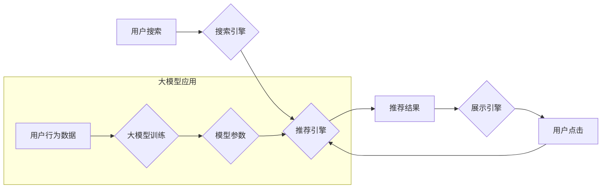

                 

## 搜索推荐系统的AI 大模型应用：电商平台的核心竞争力

> 关键词：搜索推荐系统、大模型、电商平台、AI 算法、个性化推荐、用户体验、商业价值

### 1. 背景介绍

在当今数字经济时代，电商平台已成为人们购物的首选方式。然而，随着商品数量的激增，用户面临着信息过载的困境。如何精准推荐用户感兴趣的商品，提升用户购物体验，成为电商平台的核心竞争力。传统搜索推荐系统主要依赖于基于规则和协同过滤的算法，但这些方法难以捕捉用户复杂的需求和商品多维特征之间的关联。

近年来，大模型技术在自然语言处理、计算机视觉等领域取得了突破性进展，为搜索推荐系统的升级提供了新的机遇。大模型具备海量数据处理能力、强大的语义理解能力和泛化学习能力，能够更精准地理解用户意图，挖掘商品之间的潜在关联，从而提供更个性化、更精准的推荐结果。

### 2. 核心概念与联系

#### 2.1 搜索推荐系统

搜索推荐系统是电商平台的核心功能之一，旨在帮助用户快速找到所需商品。它通常由以下几个模块组成：

* **搜索引擎:** 处理用户搜索词，并返回相关商品列表。
* **推荐引擎:** 基于用户行为、商品特征等数据，推荐用户可能感兴趣的商品。
* **展示引擎:** 将搜索结果和推荐结果以用户友好的方式展示给用户。

#### 2.2 大模型

大模型是指参数规模庞大、训练数据海量的人工智能模型。它通常基于Transformer架构，能够学习到语言的复杂语义关系和模式。

#### 2.3 AI 算法

AI 算法是搜索推荐系统中核心技术，用于分析用户数据、商品数据，并生成推荐结果。常见的AI 算法包括：

* **深度学习:** 利用多层神经网络学习数据特征，例如卷积神经网络 (CNN)、循环神经网络 (RNN) 和 Transformer。
* **机器学习:** 利用统计方法学习数据模式，例如线性回归、逻辑回归和支持向量机 (SVM)。

**核心概念与架构流程图**



### 3. 核心算法原理 & 具体操作步骤

#### 3.1 算法原理概述

大模型在搜索推荐系统中的应用主要体现在以下几个方面：

* **语义理解:** 大模型能够理解用户搜索词的深层含义，例如识别用户意图、关键词关系和上下文信息。
* **商品特征提取:** 大模型可以学习商品的多种特征，例如商品标题、描述、图片、评论等，并将其转化为向量表示，方便进行相似度计算和推荐。
* **个性化推荐:** 大模型可以根据用户的历史行为、偏好和兴趣，生成个性化的推荐结果。

#### 3.2 算法步骤详解

1. **数据预处理:** 收集用户行为数据、商品数据等，并进行清洗、格式化和特征工程。
2. **大模型训练:** 使用预处理后的数据训练大模型，例如BERT、GPT-3等。
3. **模型评估:** 使用测试数据评估模型的性能，例如准确率、召回率和 NDCG 等指标。
4. **模型部署:** 将训练好的模型部署到线上环境，用于实时推荐。
5. **结果分析:** 分析推荐结果的点击率、转化率等指标，并根据反馈进行模型调优。

#### 3.3 算法优缺点

**优点:**

* **精准度高:** 大模型能够捕捉用户需求和商品特征之间的复杂关系，提供更精准的推荐结果。
* **个性化强:** 大模型可以根据用户的历史行为和偏好，生成个性化的推荐，提升用户体验。
* **泛化能力强:** 大模型经过海量数据训练，具有较强的泛化能力，能够适应不同的用户群体和商品种类。

**缺点:**

* **训练成本高:** 大模型训练需要大量的计算资源和时间，成本较高。
* **数据依赖性强:** 大模型的性能依赖于训练数据的质量和数量，数据不足或质量低会影响模型效果。
* **解释性差:** 大模型的决策过程较为复杂，难以解释其推荐结果背后的逻辑。

#### 3.4 算法应用领域

大模型在搜索推荐系统领域的应用非常广泛，例如：

* **电商平台:** 推荐商品、个性化广告、用户画像分析。
* **社交媒体:** 推荐好友、内容推荐、兴趣标签识别。
* **新闻平台:** 推荐新闻文章、个性化新闻订阅、热点话题挖掘。

### 4. 数学模型和公式 & 详细讲解 & 举例说明

#### 4.1 数学模型构建

大模型在搜索推荐系统中通常采用基于用户的协同过滤模型或基于内容的推荐模型。

**基于用户的协同过滤模型:**

该模型假设用户具有相似的兴趣倾向，如果用户A喜欢商品X，那么用户B也可能喜欢商品X。

**基于内容的推荐模型:**

该模型假设商品具有相似的特征，如果用户喜欢商品A，那么用户也可能喜欢具有相似特征的商品B。

#### 4.2 公式推导过程

**基于用户的协同过滤模型:**

用户-商品评分矩阵 $R$，其中 $R_{ui}$ 表示用户 $u$ 对商品 $i$ 的评分。

推荐评分公式:

$$
R_{ui} = \frac{\sum_{v \in N(u)} \frac{R_{uv} \cdot S_{vi}}{\sum_{w \in N(u)} S_{vw}}}{\sum_{v \in N(u)} \frac{S_{vi}}{\sum_{w \in N(u)} S_{vw}}}
$$

其中:

* $N(u)$ 表示与用户 $u$ 具有相似兴趣的用户集合。
* $S_{vi}$ 表示用户 $v$ 对商品 $i$ 的评分。

**基于内容的推荐模型:**

商品特征向量 $X$，其中 $X_i$ 表示商品 $i$ 的特征向量。

用户特征向量 $Y$，其中 $Y_u$ 表示用户 $u$ 的特征向量。

推荐评分公式:

$$
R_{ui} = \frac{Y_u \cdot X_i}{||Y_u|| ||X_i||}
$$

#### 4.3 案例分析与讲解

假设一个电商平台有 1000 个用户和 10000 个商品，用户对商品的评分数据如下:

```
用户1: 商品1 - 5, 商品2 - 3, 商品3 - 4
用户2: 商品1 - 4, 商品2 - 5, 商品3 - 2
用户3: 商品1 - 3, 商品2 - 4, 商品3 - 5
```

可以使用基于用户的协同过滤模型，计算用户1对商品4的推荐评分。

#### 4.4 数学模型的局限性

虽然数学模型可以有效地进行推荐，但它也存在一些局限性:

* **数据稀疏性:** 用户-商品评分矩阵通常是稀疏的，这意味着很多用户对很多商品都没有评分。
* **冷启动问题:** 新用户和新商品难以获得准确的推荐，因为缺乏历史数据。
* **数据偏差:** 数据可能存在偏差，例如用户评分的倾向性，这会影响模型的准确性。

### 5. 项目实践：代码实例和详细解释说明

#### 5.1 开发环境搭建

* **操作系统:** Linux 或 macOS
* **编程语言:** Python
* **深度学习框架:** TensorFlow 或 PyTorch
* **其他工具:** Git、Jupyter Notebook

#### 5.2 源代码详细实现

```python
# 使用 TensorFlow 实现基于用户的协同过滤模型
import tensorflow as tf

# 定义用户-商品评分矩阵
ratings = tf.constant([[5, 3, 4],
                      [4, 5, 2],
                      [3, 4, 5]])

# 定义用户相似度矩阵
user_similarity = tf.constant([[1, 0.8, 0.6],
                              [0.8, 1, 0.7],
                              [0.6, 0.7, 1]])

# 计算推荐评分
def recommend(user_id, item_id):
  # 获取用户相似用户
  similar_users = tf.gather(user_similarity[user_id], tf.math.top_k(user_similarity[user_id], k=2))
  # 获取相似用户对商品的评分
  similar_ratings = tf.gather_nd(ratings, tf.stack([similar_users, tf.constant([item_id])], axis=1))
  # 计算推荐评分
  return tf.reduce_sum(similar_ratings * user_similarity[user_id][similar_users]) / tf.reduce_sum(user_similarity[user_id][similar_users])

# 获取用户1对商品4的推荐评分
recommendation = recommend(0, 3)
print(recommendation)
```

#### 5.3 代码解读与分析

* 代码首先定义了用户-商品评分矩阵和用户相似度矩阵。
* `recommend` 函数计算用户对商品的推荐评分，它首先获取用户相似用户，然后获取相似用户对商品的评分，最后计算推荐评分。
* 代码最后调用 `recommend` 函数，获取用户1对商品4的推荐评分。

#### 5.4 运行结果展示

运行代码后，会输出用户1对商品4的推荐评分。

### 6. 实际应用场景

#### 6.1 电商平台

大模型在电商平台的应用场景非常广泛，例如：

* **商品推荐:** 根据用户的历史购买记录、浏览记录、收藏记录等数据，推荐用户可能感兴趣的商品。
* **个性化广告:** 根据用户的兴趣爱好、购买习惯等数据，推送个性化的广告，提高广告点击率和转化率。
* **用户画像分析:** 利用大模型分析用户的行为数据，构建用户画像，帮助商家了解用户的需求和偏好。

#### 6.2 新闻平台

大模型可以帮助新闻平台实现以下功能:

* **新闻推荐:** 根据用户的阅读历史、兴趣标签等数据，推荐用户可能感兴趣的新闻文章。
* **热点话题挖掘:** 利用大模型分析新闻文本，挖掘热点话题和用户关注的领域。
* **内容生成:** 利用大模型生成新闻标题、摘要、评论等内容，提高内容生产效率。

#### 6.3 社交媒体

大模型可以帮助社交媒体平台实现以下功能:

* **好友推荐:** 根据用户的兴趣爱好、社交关系等数据，推荐用户可能认识的朋友。
* **内容推荐:** 根据用户的阅读历史、点赞记录等数据，推荐用户可能感兴趣的内容。
* **兴趣标签识别:** 利用大模型分析用户的社交行为，识别用户的兴趣标签，帮助用户发现新的兴趣爱好。

#### 6.4 未来应用展望

随着大模型技术的不断发展，其在搜索推荐系统中的应用场景将更加广泛，例如:

* **多模态推荐:** 将文本、图片、视频等多种数据类型融合在一起，提供更丰富的推荐结果。
* **个性化解释:** 为推荐结果提供更详细的解释，帮助用户理解推荐背后的逻辑。
* **实时推荐:** 利用大模型的实时推理能力，提供更及时、更精准的推荐。

### 7. 工具和资源推荐

#### 7.1 学习资源推荐

* **书籍:**
    * 《深度学习》 - Ian Goodfellow, Yoshua Bengio, Aaron Courville
    * 《自然语言处理》 - Jurafsky, Martin
* **在线课程:**
    * Coursera: 深度学习 Specialization
    * Udacity: 自然语言处理 Nanodegree
* **博客和网站:**
    * TensorFlow Blog: https://blog.tensorflow.org/
    * PyTorch Blog: https://pytorch.org/blog/

#### 7.2 开发工具推荐

* **深度学习框架:** TensorFlow, PyTorch
* **数据处理工具:** Pandas, NumPy
* **云计算平台:** AWS, Google Cloud, Azure

#### 7.3 相关论文推荐

* **BERT:** Devlin, J., Chang, M. W., Lee, K., & Toutanova, K. (2018). BERT: Pre-training of deep bidirectional transformers for language understanding. arXiv preprint arXiv:1810.04805.
* **GPT-3:** Brown, T. B., Mann, B., Ryder, N., Subbiah, M., Kaplan, J., Dhariwal, P., ... & Amodei, D. (2020). Language models are few-shot learners. arXiv preprint arXiv:2005.14165.

### 8. 总结：未来发展趋势与挑战

#### 8.1 研究成果总结

大模型在搜索推荐系统中的应用取得了显著成果，能够提供更精准、更个性化的推荐结果，提升用户体验和商业价值。

#### 8.2 未来发展趋势

* **模型规模和能力提升:** 大模型规模将继续扩大，模型能力将进一步提升，能够处理更复杂的数据和任务。
* **多模态融合:** 大模型将融合文本、图片、视频等多种数据类型，提供更丰富的推荐结果。
* **个性化解释:** 大模型将能够为推荐结果提供更详细的解释，帮助用户理解推荐背后的逻辑。
* **实时推荐:** 大模型将实现实时推理能力，提供更及时、更精准的推荐。

#### 8.3 面临的挑战

* **数据安全和隐私:** 大模型训练需要大量数据，如何保证数据安全和用户隐私是一个重要挑战。
* **模型解释性和可控性:** 大模型的决策过程较为复杂，难以解释其推荐结果背后的逻辑，如何提高模型的解释性和可控性是一个重要研究方向。
* **计算资源和成本:** 大模型训练需要大量的计算资源和时间，成本较高，如何降低训练成本是一个重要问题。

#### 8.4 研究展望

未来，大模型在搜索推荐系统领域的应用将更加广泛和深入，为用户提供更智能、更个性化的体验。


### 9. 附录：常见问题与解答

**Q1: 大模型的训练需要多少数据？**

A1: 大模型的训练需要海量数据，通常需要数十亿甚至数百亿个数据点。

**Q2: 如何评估大模型的性能？**

A2: 大模型的性能通常使用准确率、召回率、NDCG 等指标进行评估。

**Q3: 如何部署大模型？**

A3: 大模型可以部署到云计算平台、边缘设备等多种环境中。

**Q4: 如何解决大模型的解释性和可控性问题？**

A4: 

* **可解释性模型:** 使用可解释性模型，例如线性回归、决策树等，来解释大模型的决策过程。
* **注意力机制:** 利用注意力机制，分析大模型对哪些数据点更加关注，从而理解其决策逻辑。
* **对抗训练:** 通过对抗训练，提高模型的鲁棒性，使其对对抗样本更加免疫。


作者：禅与计算机程序设计艺术 / Zen and the Art of Computer Programming<end_of_turn>

