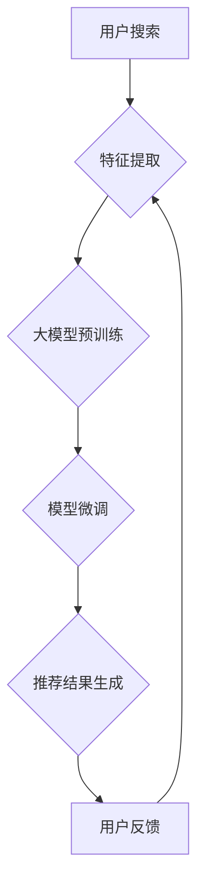

                 

## 搜索推荐系统的AI 进化：大模型融合带来的挑战与机遇

> 关键词：搜索推荐系统、大模型、Transformer、深度学习、自然语言处理、个性化推荐、AI 进化

### 1. 背景介绍

搜索推荐系统是现代互联网的核心组成部分，它连接着用户需求和信息资源，为用户提供个性化、精准的推荐服务。传统的搜索推荐系统主要依赖于基于规则和基于内容的算法，这些算法虽然有效，但缺乏对用户行为和语义理解的深度挖掘。

近年来，深度学习技术的蓬勃发展为搜索推荐系统的进化带来了新的机遇。深度学习模型能够从海量数据中学习复杂的特征和模式，从而实现更精准、更个性化的推荐。其中，大模型的出现更是推动了搜索推荐系统的AI 进化，为构建更智能、更强大的推荐系统提供了强大的工具。

### 2. 核心概念与联系

**2.1 搜索推荐系统**

搜索推荐系统旨在根据用户的搜索历史、浏览记录、购买行为等信息，预测用户对哪些商品或内容感兴趣，并将其推荐给用户。

**2.2 大模型**

大模型是指参数量巨大、训练数据海量、具备强大的泛化能力的深度学习模型。大模型通常在预训练阶段学习了丰富的语言知识和语义理解能力，可以应用于各种自然语言处理任务，包括搜索推荐。

**2.3 Transformer**

Transformer是一种基于注意力机制的深度学习模型，它能够有效地捕捉文本序列中的长距离依赖关系，在自然语言处理任务中取得了显著的成果。

**2.4 融合**

大模型融合是指将大模型的预训练能力与搜索推荐系统的特定任务相结合，构建更强大的推荐模型。

**2.5 流程图**



### 3. 核心算法原理 & 具体操作步骤

**3.1 算法原理概述**

大模型融合在搜索推荐系统中的核心算法原理是将大模型的预训练能力与搜索推荐系统的特定任务相结合。具体来说，大模型首先在海量文本数据上进行预训练，学习丰富的语言知识和语义理解能力。然后，将预训练的大模型微调到搜索推荐任务上，例如商品推荐、内容推荐等。

**3.2 算法步骤详解**

1. **数据预处理:** 收集用户搜索历史、浏览记录、购买行为等数据，并进行清洗、格式化等预处理操作。
2. **大模型预训练:** 选择合适的预训练大模型，例如BERT、GPT等，并使用海量文本数据进行预训练。
3. **特征提取:** 将用户搜索词、商品信息等文本数据输入到预训练的大模型中，提取相应的特征表示。
4. **模型微调:** 使用预训练的大模型作为基础模型，在搜索推荐任务的数据集上进行微调，优化模型参数，提高模型性能。
5. **推荐结果生成:** 将用户特征和商品特征输入到微调后的模型中，预测用户对商品的兴趣程度，并生成推荐结果。

**3.3 算法优缺点**

**优点:**

* **强大的语义理解能力:** 大模型能够捕捉文本序列中的复杂语义关系，提升推荐的精准度。
* **个性化推荐:** 大模型可以学习用户的个性化偏好，提供更精准的推荐。
* **可扩展性强:** 大模型可以应用于多种搜索推荐任务，并根据需要进行扩展。

**缺点:**

* **训练成本高:** 大模型的训练需要大量的计算资源和时间。
* **数据依赖性强:** 大模型的性能取决于训练数据的质量和数量。
* **可解释性差:** 大模型的决策过程较为复杂，难以解释其推荐结果。

**3.4 算法应用领域**

大模型融合的搜索推荐算法广泛应用于电商、社交媒体、新闻资讯等领域，例如：

* **商品推荐:** 根据用户的搜索历史、浏览记录、购买行为等信息，推荐用户可能感兴趣的商品。
* **内容推荐:** 根据用户的阅读习惯、兴趣爱好等信息，推荐用户可能感兴趣的文章、视频等内容。
* **广告推荐:** 根据用户的兴趣爱好、行为特征等信息，推荐用户可能感兴趣的广告。

### 4. 数学模型和公式 & 详细讲解 & 举例说明

**4.1 数学模型构建**

大模型融合的搜索推荐系统通常采用基于用户的协同过滤模型或基于内容的协同过滤模型。

* **基于用户的协同过滤模型:**

该模型假设用户具有相似的兴趣倾向，通过分析用户之间的相似度，推荐用户可能感兴趣的商品。

* **基于内容的协同过滤模型:**

该模型假设商品具有相似的特征，通过分析商品之间的相似度，推荐用户可能感兴趣的商品。

**4.2 公式推导过程**

基于用户的协同过滤模型的推荐算法可以表示为：

$$r_{ui} = \frac{\sum_{j \in N(u)} s_{uj} \cdot r_{uj}}{\sum_{j \in N(u)} s_{uj}}$$

其中：

* $r_{ui}$ 表示用户 $u$ 对商品 $i$ 的评分。
* $s_{uj}$ 表示用户 $u$ 和用户 $j$ 的相似度。
* $r_{uj}$ 表示用户 $j$ 对商品 $i$ 的评分。
* $N(u)$ 表示与用户 $u$ 相似的用户集合。

**4.3 案例分析与讲解**

假设有两个用户 $u_1$ 和 $u_2$，他们都对商品 $p_1$ 和 $p_2$ 进行了评分。

* $u_1$ 对 $p_1$ 的评分为 5，对 $p_2$ 的评分为 3。
* $u_2$ 对 $p_1$ 的评分为 4，对 $p_2$ 的评分为 2。

如果 $u_1$ 和 $u_2$ 的相似度为 0.8，那么根据公式，我们可以预测 $u_1$ 对 $p_3$ 的评分为：

$$r_{u_1 p_3} = \frac{0.8 \cdot 4 + 0.8 \cdot 2}{0.8 + 0.8} = 3$$

### 5. 项目实践：代码实例和详细解释说明

**5.1 开发环境搭建**

* Python 3.7+
* TensorFlow 2.0+
* PyTorch 1.0+
* CUDA Toolkit 10.2+

**5.2 源代码详细实现**

```python
import tensorflow as tf

# 定义模型结构
class RecommenderModel(tf.keras.Model):
    def __init__(self, embedding_dim, num_users, num_items):
        super(RecommenderModel, self).__init__()
        self.user_embedding = tf.keras.layers.Embedding(num_users, embedding_dim)
        self.item_embedding = tf.keras.layers.Embedding(num_items, embedding_dim)
        self.dense = tf.keras.layers.Dense(1)

    def call(self, user_ids, item_ids):
        user_embeddings = self.user_embedding(user_ids)
        item_embeddings = self.item_embedding(item_ids)
        combined_embeddings = user_embeddings + item_embeddings
        predictions = self.dense(combined_embeddings)
        return predictions

# 训练模型
model = RecommenderModel(embedding_dim=64, num_users=1000, num_items=10000)
model.compile(optimizer='adam', loss='mse')
model.fit(x=[user_ids, item_ids], y=ratings, epochs=10)

# 生成推荐结果
user_id = 123
item_ids = tf.constant([1, 2, 3, 4, 5])
predictions = model(user_id, item_ids)
top_k_items = tf.argsort(predictions, direction='DESCENDING')[:5]
```

**5.3 代码解读与分析**

* 代码首先定义了一个推荐模型类 `RecommenderModel`，该模型使用嵌入层将用户和商品ID映射到低维向量空间，然后使用全连接层进行预测。
* 训练模型时，使用 Adam 优化器和均方误差损失函数。
* 生成推荐结果时，将用户的ID和候选商品的ID输入到模型中，得到每个商品的预测评分，然后根据评分排序，选择前k个商品作为推荐结果。

**5.4 运行结果展示**

运行代码后，会输出每个候选商品的预测评分，并根据评分排序，选择前k个商品作为推荐结果。

### 6. 实际应用场景

大模型融合的搜索推荐系统已广泛应用于各种场景，例如：

* **电商平台:** 为用户推荐个性化的商品，提高转化率。
* **社交媒体平台:** 为用户推荐感兴趣的内容，增强用户粘性。
* **新闻资讯平台:** 为用户推荐个性化的新闻资讯，提高用户阅读体验。

**6.4 未来应用展望**

随着大模型技术的不断发展，大模型融合的搜索推荐系统将有更广泛的应用场景，例如：

* **多模态推荐:** 将文本、图像、视频等多模态数据融合，提供更丰富的推荐体验。
* **个性化广告推荐:** 更精准地匹配用户兴趣，提高广告效果。
* **跨平台推荐:** 将用户行为数据跨平台整合，提供更个性化的推荐服务。

### 7. 工具和资源推荐

**7.1 学习资源推荐**

* **书籍:**

* 《深度学习》
* 《自然语言处理》

* **在线课程:**

* Coursera: 深度学习
* Udacity: 自然语言处理

**7.2 开发工具推荐**

* TensorFlow
* PyTorch
* Hugging Face Transformers

**7.3 相关论文推荐**

* BERT: Pre-training of Deep Bidirectional Transformers for Language Understanding
* GPT-3: Language Models are Few-Shot Learners
* Transformer: Attention Is All You Need

### 8. 总结：未来发展趋势与挑战

**8.1 研究成果总结**

大模型融合为搜索推荐系统带来了新的机遇，提升了推荐的精准度和个性化程度。

**8.2 未来发展趋势**

未来，大模型融合的搜索推荐系统将朝着以下方向发展：

* **多模态融合:** 将文本、图像、视频等多模态数据融合，提供更丰富的推荐体验。
* **跨平台推荐:** 将用户行为数据跨平台整合，提供更个性化的推荐服务。
* **可解释性增强:** 提升模型的可解释性，帮助用户理解推荐结果背后的逻辑。

**8.3 面临的挑战**

大模型融合的搜索推荐系统也面临一些挑战：

* **训练成本高:** 大模型的训练需要大量的计算资源和时间。
* **数据依赖性强:** 大模型的性能取决于训练数据的质量和数量。
* **可解释性差:** 大模型的决策过程较为复杂，难以解释其推荐结果。

**8.4 研究展望**

未来研究将重点关注以下几个方面：

* **降低训练成本:** 研究更有效的训练方法和硬件架构，降低大模型的训练成本。
* **提升数据质量:** 研究数据增强和数据清洗技术，提高训练数据的质量。
* **增强模型可解释性:** 研究模型可解释性技术，帮助用户理解推荐结果背后的逻辑。


### 9. 附录：常见问题与解答

**9.1 Q: 大模型融合的搜索推荐系统与传统的搜索推荐系统相比有什么优势？**

**A:** 大模型融合的搜索推荐系统相比传统的搜索推荐系统，具有以下优势：

* **更强大的语义理解能力:** 大模型能够捕捉文本序列中的复杂语义关系，提升推荐的精准度。
* **更个性化的推荐:** 大模型可以学习用户的个性化偏好，提供更精准的推荐。
* **更强的可扩展性:** 大模型可以应用于多种搜索推荐任务，并根据需要进行扩展。

**9.2 Q: 大模型融合的搜索推荐系统有哪些缺点？**

**A:** 大模型融合的搜索推荐系统也存在一些缺点：

* **训练成本高:** 大模型的训练需要大量的计算资源和时间。
* **数据依赖性强:** 大模型的性能取决于训练数据的质量和数量。
* **可解释性差:** 大模型的决策过程较为复杂，难以解释其推荐结果。

**9.3 Q: 如何选择合适的预训练大模型？**

**A:** 选择合适的预训练大模型需要考虑以下因素：

* **任务类型:** 不同的任务类型需要选择不同的预训练大模型。
* **数据规模:** 数据规模越大，需要选择参数量更大的预训练大模型。
* **计算资源:** 计算资源有限的情况下，需要选择参数量较小的预训练大模型。


作者：禅与计算机程序设计艺术 / Zen and the Art of Computer Programming 
<end_of_turn>

