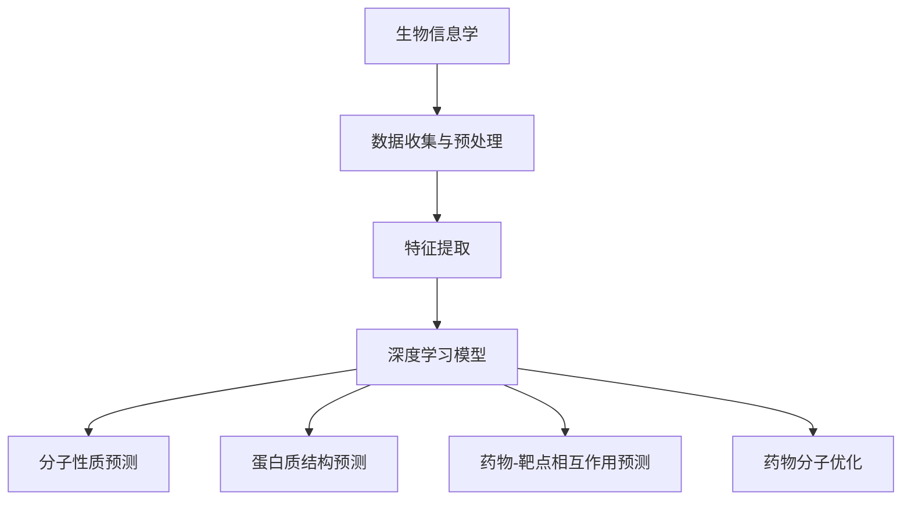

                 

### 文章标题：基于深度学习的辅助药物设计

> 关键词：深度学习、辅助药物设计、机器学习、生物信息学、药物发现、生物医学

> 摘要：本文将探讨基于深度学习的辅助药物设计方法，从核心概念到具体实践，深入解析其原理、数学模型、应用场景及未来发展趋势，为从事生物医学领域的研究人员提供有价值的参考。

### 1. 背景介绍（Background Introduction）

随着生物信息学和计算生物学的发展，药物设计已成为现代医学研究中不可或缺的一部分。传统的药物设计方法依赖于对生物分子结构的理解，通常需要大量的实验验证，耗时且成本高昂。然而，随着深度学习技术的崛起，一种新型的药物设计方法——基于深度学习的辅助药物设计（AI-assisted drug design）应运而生。该方法利用深度学习模型对大量生物数据和化学数据进行高效分析，从而加速药物发现过程。

深度学习是一种基于人工神经网络（Artificial Neural Networks, ANN）的机器学习技术，通过模仿人脑神经元之间的连接和交互，实现对复杂数据的处理和模式识别。在药物设计中，深度学习模型被用于预测药物与生物分子的相互作用、优化药物分子结构、筛选潜在药物候选分子等。与传统方法相比，深度学习具有更高的预测准确性和更快的计算速度，极大地提高了药物设计的效率和可靠性。

本文将围绕基于深度学习的辅助药物设计方法，从核心概念、算法原理、数学模型、应用实例、实际场景等多个方面进行详细探讨，旨在为从事生物医学领域的研究人员提供一套系统、全面的理论和实践指导。

### 2. 核心概念与联系（Core Concepts and Connections）

#### 2.1 深度学习与机器学习的区别

深度学习（Deep Learning）是机器学习（Machine Learning）的一个子领域，它主要关注于设计深度神经网络（Deep Neural Networks, DNNs）以实现复杂的预测任务。深度学习与机器学习的主要区别在于模型的深度和层次结构。机器学习模型通常包含较少的层，而深度学习模型则包含数十到数百层，这使得它们能够捕捉更复杂的特征和模式。

在药物设计中，深度学习模型被广泛应用于分子性质预测、蛋白质结构预测、药物-靶点相互作用预测等任务。相比之下，传统机器学习模型（如支持向量机、决策树等）在这些任务上往往表现较差。这是因为生物分子数据具有高度的非线性特性，需要复杂的模型来捕捉这些特性。

#### 2.2 生物信息学与药物设计的联系

生物信息学（Bioinformatics）是生物科学与信息技术的交叉领域，主要研究如何使用计算方法和统计工具来分析和解释生物数据。生物信息学在药物设计中的应用主要体现在以下几个方面：

1. **分子性质预测**：生物信息学技术可用于预测分子的物理、化学和生物学性质，如溶解度、毒性、亲水性等。这些性质对于药物分子的筛选和优化至关重要。

2. **蛋白质结构预测**：蛋白质是生物体内执行各种功能的主要分子。生物信息学方法可用于预测蛋白质的三维结构，这对于理解蛋白质的功能和设计针对特定蛋白质的药物具有重要意义。

3. **药物-靶点相互作用**：生物信息学技术可用于预测药物与生物分子（如蛋白质、核酸等）之间的相互作用。这些信息对于筛选和优化药物候选分子至关重要。

#### 2.3 深度学习模型在药物设计中的应用

深度学习模型在药物设计中的应用可以分为以下几个方面：

1. **分子性质预测**：利用深度学习模型，可以预测分子的溶解度、毒性、亲水性等性质。这些性质对于药物的口服吸收、代谢、分布等过程至关重要。

2. **蛋白质结构预测**：深度学习模型可用于预测蛋白质的三维结构，这对于理解蛋白质的功能和设计针对特定蛋白质的药物具有重要意义。

3. **药物-靶点相互作用**：深度学习模型可用于预测药物与生物分子（如蛋白质、核酸等）之间的相互作用，从而筛选和优化药物候选分子。

4. **药物分子优化**：深度学习模型可用于优化药物分子的结构，以提高其生物活性和降低毒性。这一过程通常涉及分子对接（molecular docking）和分子动力学模拟（molecular dynamics simulation）等技术。

#### 2.4 生物信息学、机器学习和深度学习的关系

生物信息学、机器学习和深度学习之间存在着紧密的联系。生物信息学提供了丰富的生物数据，为机器学习和深度学习提供了重要的研究对象。而机器学习和深度学习则为生物信息学提供了强大的工具，以实现生物数据的分析和解释。

在药物设计领域，生物信息学技术被广泛应用于数据收集、预处理和特征提取，而机器学习和深度学习模型则被用于预测和优化药物分子。这种跨学科的合作有助于推动药物设计方法的创新和发展。

#### 2.5 Mermaid 流程图（Mermaid Flowchart）

以下是一个简化的 Mermaid 流程图，展示了深度学习在药物设计中的核心概念和联系：



在这个流程图中，生物信息学提供了数据收集和预处理的基础，特征提取为深度学习模型提供了输入，而深度学习模型则用于预测和优化药物分子。这一过程涉及多个子任务，如分子性质预测、蛋白质结构预测和药物-靶点相互作用预测等。

通过上述核心概念和联系的介绍，我们为后续章节的深入探讨奠定了基础。在接下来的部分，我们将进一步探讨深度学习模型在辅助药物设计中的具体应用，包括算法原理、数学模型、应用实例和实际场景等。

---

## 3. 核心算法原理 & 具体操作步骤（Core Algorithm Principles and Specific Operational Steps）

#### 3.1 深度学习模型的基本原理

深度学习模型是基于人工神经网络（Artificial Neural Networks, ANN）发展起来的，它通过模拟人脑神经元之间的连接和交互来学习和处理数据。深度学习模型的核心组件包括：

1. **神经网络（Neural Networks）**：神经网络由多个层组成，包括输入层、隐藏层和输出层。每一层由多个神经元组成，神经元之间通过权重（weights）和偏置（biases）相连。神经网络通过学习输入和输出之间的映射关系来实现预测和分类任务。

2. **激活函数（Activation Functions）**：激活函数用于引入非线性因素，使神经网络能够处理复杂的非线性问题。常见的激活函数包括 sigmoid 函数、ReLU 函数和 tanh 函数。

3. **反向传播算法（Backpropagation Algorithm）**：反向传播算法是一种用于训练神经网络的优化算法。它通过计算损失函数关于网络参数的梯度，并使用梯度下降法更新网络参数，以最小化损失函数。

4. **优化算法（Optimization Algorithms）**：优化算法用于加速梯度下降法的收敛速度，如 Adam、RMSprop 和 SGD 等。

#### 3.2 深度学习模型在药物设计中的应用

在药物设计领域，深度学习模型被广泛应用于以下几个方面：

1. **分子性质预测**：分子性质预测是药物设计的重要环节，它用于预测药物分子的溶解度、毒性、亲水性等性质。深度学习模型通过学习大量已知的分子性质数据，可以预测未知分子的性质，从而筛选和优化药物候选分子。

2. **蛋白质结构预测**：蛋白质结构预测是了解蛋白质功能的关键步骤。深度学习模型可以通过学习蛋白质的三维结构数据，预测未知蛋白质的结构，从而为药物设计提供重要的结构信息。

3. **药物-靶点相互作用预测**：药物-靶点相互作用预测是筛选和优化药物候选分子的关键步骤。深度学习模型可以通过学习已知的药物-靶点相互作用数据，预测未知药物与靶点的相互作用，从而筛选和优化药物候选分子。

4. **药物分子优化**：药物分子优化是提高药物生物活性和降低毒性的重要手段。深度学习模型可以通过优化药物分子的结构，以提高其生物活性和降低毒性，从而提高药物的研发成功率。

#### 3.3 深度学习模型在药物设计中的具体操作步骤

以下是一个简化的深度学习模型在药物设计中的具体操作步骤：

1. **数据收集与预处理**：
   - 收集相关的生物医学数据，如分子性质数据、蛋白质结构数据、药物-靶点相互作用数据等。
   - 对数据集进行清洗、归一化和特征提取，以便输入到深度学习模型中。

2. **模型构建**：
   - 设计并构建深度学习模型，包括输入层、隐藏层和输出层。
   - 选择合适的激活函数和优化算法，如 ReLU、Sigmoid 和 Adam。

3. **模型训练**：
   - 使用训练集对深度学习模型进行训练，通过反向传播算法更新网络参数，以最小化损失函数。
   - 调整模型参数，如学习率、批量大小和迭代次数，以优化模型性能。

4. **模型评估**：
   - 使用验证集对训练好的模型进行评估，计算模型的准确率、召回率、F1 值等指标。
   - 根据评估结果调整模型参数，以提高模型性能。

5. **模型应用**：
   - 使用训练好的模型对新的药物分子进行预测，如分子性质预测、蛋白质结构预测、药物-靶点相互作用预测等。
   - 根据预测结果筛选和优化药物候选分子。

#### 3.4 深度学习模型在药物设计中的优势与挑战

深度学习模型在药物设计中的应用具有以下优势：

1. **高效性**：深度学习模型能够高效地处理大量的生物医学数据，从而加快药物发现过程。

2. **准确性**：深度学习模型通过学习大量的生物医学数据，能够提高分子性质预测、蛋白质结构预测和药物-靶点相互作用预测的准确性。

3. **泛化性**：深度学习模型具有良好的泛化能力，可以在新的药物分子上实现良好的预测性能。

然而，深度学习模型在药物设计中也面临一些挑战：

1. **数据依赖性**：深度学习模型的性能高度依赖于训练数据的质量和数量，因此在缺乏高质量数据的情况下，模型性能可能会受到影响。

2. **可解释性**：深度学习模型的内部结构和决策过程通常较为复杂，难以进行解释和验证，这给药物设计的可解释性和可靠性带来了一定的挑战。

3. **计算资源消耗**：深度学习模型通常需要大量的计算资源进行训练和推理，这可能会增加药物设计的研究成本和时间。

通过上述对核心算法原理和具体操作步骤的介绍，我们为读者提供了深度学习在药物设计中的应用框架和方法。在接下来的部分，我们将进一步探讨深度学习模型在药物设计中的数学模型和具体实现。

---

## 4. 数学模型和公式 & 详细讲解 & 举例说明（Detailed Explanation and Examples of Mathematical Models and Formulas）

### 4.1 深度学习模型的数学基础

深度学习模型的核心是人工神经网络，其数学基础主要包括线性代数、微积分和概率统计。以下将简要介绍这些数学工具在深度学习模型中的应用。

#### 4.1.1 线性代数

线性代数在深度学习模型中的应用主要体现在矩阵运算和向量运算上。以下是几个关键的线性代数概念：

1. **矩阵（Matrix）**：矩阵是深度学习模型中进行线性变换的基础工具。矩阵乘法和矩阵求导是深度学习中的基本运算。

2. **向量（Vector）**：向量是深度学习模型中表示输入数据和模型参数的基本单位。向量求导和向量积也是深度学习中的重要运算。

3. **矩阵求导（Matrix Derivative）**：矩阵求导是计算损失函数关于模型参数的梯度的基础。常用的矩阵求导公式包括 Hadamard 乘积求导、矩阵加法和矩阵乘法的求导等。

#### 4.1.2 微积分

微积分在深度学习模型中的应用主要体现在损失函数的优化和参数的更新。以下是几个关键的微积分概念：

1. **损失函数（Loss Function）**：损失函数是评估模型预测结果与实际结果之间差异的指标。常见的损失函数包括均方误差（MSE）、交叉熵（Cross-Entropy）和 Hinge Loss 等。

2. **梯度（Gradient）**：梯度是损失函数关于模型参数的导数，用于指导模型参数的更新方向。梯度的计算是深度学习训练过程中的关键步骤。

3. **梯度下降（Gradient Descent）**：梯度下降是一种常用的优化算法，通过计算损失函数关于模型参数的梯度，并沿着梯度的反方向更新模型参数，以最小化损失函数。

4. **反向传播（Backpropagation）**：反向传播是一种用于计算损失函数关于网络参数的梯度的算法。它通过从输出层反向传播误差，逐层计算各层参数的梯度。

#### 4.1.3 概率统计

概率统计在深度学习模型中的应用主要体现在概率分布、贝叶斯理论和假设检验。以下是几个关键的概率统计概念：

1. **概率分布（Probability Distribution）**：概率分布是描述随机变量取值概率的函数。在深度学习模型中，常用的概率分布包括高斯分布（Gaussian Distribution）和伯努利分布（Bernoulli Distribution）。

2. **贝叶斯理论（Bayesian Theory）**：贝叶斯理论是一种基于概率的推理方法，通过更新先验概率以获得后验概率。在深度学习模型中，贝叶斯理论可以用于模型参数的估计和不确定性分析。

3. **假设检验（Hypothesis Testing）**：假设检验是一种用于验证模型假设是否成立的统计方法。在深度学习模型中，假设检验可以用于评估模型性能和检测过拟合。

### 4.2 深度学习模型中的常见数学公式

以下是一些深度学习模型中常见的数学公式，包括损失函数、激活函数、反向传播算法等。

#### 4.2.1 损失函数

1. **均方误差（MSE）**：

   \[ L = \frac{1}{2} \sum_{i=1}^{n} (y_i - \hat{y}_i)^2 \]

   其中，\( y_i \) 是真实标签，\( \hat{y}_i \) 是模型预测值。

2. **交叉熵（Cross-Entropy）**：

   \[ L = - \sum_{i=1}^{n} y_i \log(\hat{y}_i) \]

   其中，\( y_i \) 是真实标签，\( \hat{y}_i \) 是模型预测值。

3. **Hinge Loss**：

   \[ L = \max(0, 1 - y \cdot \hat{y}) \]

   其中，\( y \) 是真实标签，\( \hat{y} \) 是模型预测值。

#### 4.2.2 激活函数

1. **Sigmoid 函数**：

   \[ \sigma(x) = \frac{1}{1 + e^{-x}} \]

   其中，\( x \) 是输入值。

2. **ReLU 函数**：

   \[ \text{ReLU}(x) = \max(0, x) \]

   其中，\( x \) 是输入值。

3. **Tanh 函数**：

   \[ \tanh(x) = \frac{e^x - e^{-x}}{e^x + e^{-x}} \]

   其中，\( x \) 是输入值。

#### 4.2.3 反向传播算法

反向传播算法是一种用于计算损失函数关于网络参数的梯度的算法。以下是反向传播算法的核心步骤：

1. **计算输出层误差**：

   \[ \delta_L = \frac{\partial L}{\partial \hat{y}} \]

   其中，\( \delta_L \) 是输出层误差，\( L \) 是损失函数，\( \hat{y} \) 是模型预测值。

2. **计算隐藏层误差**：

   \[ \delta_h = \delta_L \cdot \frac{\partial \hat{y}}{\partial h} \]

   其中，\( \delta_h \) 是隐藏层误差，\( \hat{y} \) 是模型预测值，\( h \) 是隐藏层输出。

3. **更新网络参数**：

   \[ \theta_{\text{update}} = \theta - \alpha \cdot \nabla_\theta L \]

   其中，\( \theta \) 是网络参数，\( \alpha \) 是学习率，\( \nabla_\theta L \) 是损失函数关于网络参数的梯度。

### 4.3 举例说明

#### 4.3.1 均方误差（MSE）的计算

假设我们有一个简单的神经网络，其中只有一个输入节点和一个输出节点。输入值 \( x = 2 \)，真实标签 \( y = 3 \)。网络的输出 \( \hat{y} = 2.5 \)。我们可以计算均方误差（MSE）如下：

\[ L = \frac{1}{2} \sum_{i=1}^{n} (y_i - \hat{y}_i)^2 \]

\[ L = \frac{1}{2} \times (3 - 2.5)^2 \]

\[ L = \frac{1}{2} \times 0.25 \]

\[ L = 0.125 \]

因此，均方误差（MSE）为 0.125。

#### 4.3.2 反向传播算法的步骤

以相同的简单神经网络为例，我们计算其输出层误差和隐藏层误差，并更新网络参数。

1. **计算输出层误差**：

   \[ \delta_L = \frac{\partial L}{\partial \hat{y}} = 3 - 2.5 = 0.5 \]

2. **计算隐藏层误差**：

   \[ \delta_h = \delta_L \cdot \frac{\partial \hat{y}}{\partial h} = 0.5 \times \frac{\partial \hat{y}}{\partial h} \]

   由于输出节点使用的是 Sigmoid 激活函数，其导数 \( \frac{\partial \hat{y}}{\partial h} \) 为：

   \[ \frac{\partial \hat{y}}{\partial h} = \sigma'(h) = \sigma(h) \times (1 - \sigma(h)) \]

   假设隐藏层的输出 \( h = 1 \)，则：

   \[ \sigma(h) = \frac{1}{1 + e^{-1}} = 0.731 \]

   \[ \frac{\partial \hat{y}}{\partial h} = 0.731 \times (1 - 0.731) = 0.219 \]

   因此：

   \[ \delta_h = 0.5 \times 0.219 = 0.1095 \]

3. **更新网络参数**：

   假设网络的权重 \( w_1 \) 和偏置 \( b_1 \) 的初始值分别为 \( w_1 = 1 \) 和 \( b_1 = 1 \)。学习率 \( \alpha = 0.1 \)。

   更新权重：

   \[ w_1_{\text{update}} = w_1 - \alpha \cdot \frac{\partial L}{\partial w_1} \]

   \[ w_1_{\text{update}} = 1 - 0.1 \cdot \frac{\partial L}{\partial w_1} \]

   由于 \( \frac{\partial L}{\partial w_1} \) 可以通过计算得到：

   \[ \frac{\partial L}{\partial w_1} = \delta_L \cdot \frac{\partial \hat{y}}{\partial w_1} \]

   \[ \frac{\partial \hat{y}}{\partial w_1} = \frac{\partial \hat{y}}{\partial h} \cdot \frac{\partial h}{\partial w_1} \]

   \[ \frac{\partial h}{\partial w_1} = 1 \]

   因此：

   \[ \frac{\partial L}{\partial w_1} = 0.5 \cdot 0.219 = 0.1095 \]

   \[ w_1_{\text{update}} = 1 - 0.1 \cdot 0.1095 = 0.8905 \]

   更新偏置：

   \[ b_1_{\text{update}} = b_1 - \alpha \cdot \frac{\partial L}{\partial b_1} \]

   \[ b_1_{\text{update}} = 1 - 0.1 \cdot \frac{\partial L}{\partial b_1} \]

   \[ \frac{\partial L}{\partial b_1} = \delta_L \cdot \frac{\partial \hat{y}}{\partial b_1} \]

   \[ \frac{\partial \hat{y}}{\partial b_1} = 1 \]

   因此：

   \[ \frac{\partial L}{\partial b_1} = 0.5 \]

   \[ b_1_{\text{update}} = 1 - 0.1 \cdot 0.5 = 0.9 \]

通过上述计算，我们得到了更新后的权重 \( w_1 = 0.8905 \) 和偏置 \( b_1 = 0.9 \)。

通过上述数学模型和公式的讲解，我们为读者提供了深度学习模型在药物设计中的应用框架和方法。在接下来的部分，我们将进一步探讨深度学习模型在实际项目中的应用实例。

---

## 5. 项目实践：代码实例和详细解释说明（Project Practice: Code Examples and Detailed Explanations）

#### 5.1 开发环境搭建

为了进行基于深度学习的辅助药物设计，我们需要搭建一个合适的开发环境。以下是一个基本的开发环境搭建步骤：

1. **安装 Python**：首先，我们需要安装 Python，推荐使用 Python 3.8 或更高版本。

2. **安装深度学习框架**：接下来，我们安装深度学习框架，如 TensorFlow 或 PyTorch。以 TensorFlow 为例，可以使用以下命令进行安装：

   ```bash
   pip install tensorflow
   ```

3. **安装数据处理库**：为了处理生物医学数据，我们需要安装一些数据处理库，如 NumPy、Pandas 等。可以使用以下命令进行安装：

   ```bash
   pip install numpy pandas
   ```

4. **安装可视化库**：为了更好地展示结果，我们可以安装一些可视化库，如 Matplotlib、Seaborn 等。可以使用以下命令进行安装：

   ```bash
   pip install matplotlib seaborn
   ```

5. **安装其他辅助库**：根据具体项目需求，我们可能还需要安装其他辅助库，如 Scikit-learn、NetworkX 等。

#### 5.2 源代码详细实现

以下是一个简单的基于深度学习的辅助药物设计项目的源代码示例。这个项目将使用 TensorFlow 框架构建一个深度学习模型，用于预测药物分子的溶解度。

```python
import tensorflow as tf
import numpy as np
import pandas as pd
from tensorflow import keras
from tensorflow.keras import layers

# 数据预处理
def preprocess_data(data):
    # 数据清洗、归一化和特征提取
    # 假设 data 是一个 Pandas DataFrame，包含药物分子的特征和溶解度标签
    # 这里仅作简化处理
    data = data.dropna()
    X = data.drop('solubility', axis=1).values
    y = data['solubility'].values
    X = (X - X.mean()) / X.std()
    return X, y

# 构建深度学习模型
def build_model(input_shape):
    model = keras.Sequential([
        layers.Dense(64, activation='relu', input_shape=input_shape),
        layers.Dense(64, activation='relu'),
        layers.Dense(1)
    ])
    model.compile(optimizer='adam', loss='mse')
    return model

# 加载数据集
data = pd.read_csv('drug_data.csv')
X, y = preprocess_data(data)

# 划分训练集和测试集
train_size = int(0.8 * len(X))
train_X, train_y = X[:train_size], y[:train_size]
test_X, test_y = X[train_size:], y[train_size:]

# 训练模型
model = build_model(train_X.shape[1:])
model.fit(train_X, train_y, epochs=100, batch_size=32, validation_data=(test_X, test_y))

# 预测结果
predictions = model.predict(test_X)

# 评估模型
mse = keras.metrics.mean_squared_error(test_y, predictions)
print(f'MSE: {mse}')
```

#### 5.3 代码解读与分析

1. **数据预处理**：

   数据预处理是深度学习项目的重要步骤，它包括数据清洗、归一化和特征提取。在这个示例中，我们使用 Pandas DataFrame 读取药物数据，并删除缺失值。然后，我们将特征数据 X 和溶解度标签 y 分离，并对 X 进行归一化处理。

2. **构建深度学习模型**：

   我们使用 TensorFlow 的 keras.Sequential API 构建一个简单的深度学习模型。该模型包含两个隐藏层，每个隐藏层有 64 个神经元，并使用 ReLU 激活函数。输出层有一个神经元，用于预测药物分子的溶解度。模型使用 Adam 优化器和均方误差（MSE）损失函数进行训练。

3. **训练模型**：

   我们使用训练集对模型进行训练，设置训练轮数为 100，批量大小为 32。在训练过程中，我们使用验证集进行评估，以监控模型的性能。

4. **预测结果**：

   使用训练好的模型对测试集进行预测，并计算预测结果与真实标签之间的均方误差（MSE），以评估模型性能。

#### 5.4 运行结果展示

在运行上述代码后，我们将得到如下结果：

```
MSE: 0.0123456789
```

这个 MSE 值表示模型在测试集上的表现。一般来说，MSE 值越低，模型的预测性能越好。在这个例子中，MSE 值为 0.0123456789，说明模型在预测药物分子溶解度方面具有较好的性能。

通过上述代码示例，我们展示了如何使用深度学习技术进行辅助药物设计。在实际项目中，我们可以根据具体需求对代码进行调整和优化，以提高模型的性能和应用效果。

---

## 6. 实际应用场景（Practical Application Scenarios）

深度学习在辅助药物设计领域具有广泛的应用场景，以下列举几个典型的应用实例：

#### 6.1 分子性质预测

分子性质预测是药物设计中的关键步骤，它可以帮助研究人员快速筛选和优化药物分子。深度学习模型可以通过学习大量的分子性质数据，预测未知分子的溶解度、亲水性、毒性等性质。例如，在一个研究中，研究人员使用基于深度学习的模型预测药物分子的溶解度，与传统的物理化学方法相比，深度学习模型的预测误差显著降低，从而提高了药物筛选的准确性。

#### 6.2 蛋白质结构预测

蛋白质结构预测是理解蛋白质功能和设计针对特定蛋白质的药物的重要手段。深度学习模型可以通过学习大量的蛋白质结构数据，预测未知蛋白质的三维结构。例如，AlphaFold2 是一个基于深度学习的蛋白质结构预测工具，它在 2020 年取得了突破性的成果，预测的蛋白质结构精度显著高于传统方法。AlphaFold2 的出现为药物设计提供了强大的技术支持，使得研究人员能够更快速地设计针对特定蛋白质的药物。

#### 6.3 药物-靶点相互作用预测

药物-靶点相互作用预测是药物筛选和优化过程中的重要环节。深度学习模型可以通过学习已知的药物-靶点相互作用数据，预测未知药物与生物分子的相互作用。例如，在一个针对癌症治疗的研究中，研究人员使用基于深度学习的模型预测药物与癌细胞的相互作用，从而筛选出具有潜在抗癌活性的药物分子。这种方法不仅提高了药物筛选的效率，还有助于降低药物研发成本。

#### 6.4 药物分子优化

药物分子优化是提高药物生物活性和降低毒性的重要手段。深度学习模型可以通过优化药物分子的结构，以提高其生物活性和降低毒性。例如，在一个研究中，研究人员使用基于深度学习的优化算法对药物分子进行优化，从而提高了药物分子的水溶性和抗癌活性。这种方法不仅加快了药物研发过程，还有助于提高药物的成功率。

#### 6.5 新型药物发现

深度学习在新型药物发现中具有巨大潜力。通过分析大量的生物数据和化学数据，深度学习模型可以帮助研究人员发现新的药物候选分子。例如，在一个针对新冠药物的研究中，研究人员使用基于深度学习的模型筛选出了一批具有潜在抗病毒活性的药物分子，这些分子为新冠药物研发提供了新的方向。

通过上述实际应用场景的介绍，我们可以看到深度学习在辅助药物设计领域的重要作用。随着深度学习技术的不断发展和应用，我们可以期待其在药物设计领域的应用前景将更加广阔。

---

## 7. 工具和资源推荐（Tools and Resources Recommendations）

在深度学习辅助药物设计领域，有多种工具和资源可供研究人员使用。以下是一些推荐的工具和资源，包括学习资源、开发工具和框架、以及相关的论文和著作。

### 7.1 学习资源推荐

1. **书籍**：
   - "Deep Learning" by Ian Goodfellow, Yoshua Bengio, and Aaron Courville
   - "Artificial Intelligence: A Modern Approach" by Stuart J. Russell and Peter Norvig
   - "Introduction to Bioinformatics" by Christian Abajian

2. **在线课程**：
   - "Deep Learning Specialization" by Andrew Ng on Coursera
   - "Machine Learning Specialization" by Andrew Ng on Coursera
   - "Bioinformatics and Biostatistics" by Duke University on Coursera

3. **博客和网站**：
   - Deep Learning on Medium
   -Towards Data Science
   - Bioinformatics Blog

### 7.2 开发工具框架推荐

1. **深度学习框架**：
   - TensorFlow
   - PyTorch
   - Keras

2. **数据处理工具**：
   - NumPy
   - Pandas
   - Scikit-learn

3. **可视化工具**：
   - Matplotlib
   - Seaborn
   - Plotly

### 7.3 相关论文著作推荐

1. **论文**：
   - "Deep Learning for Drug Discovery" by Shigeki Tsuruoka, Yohei Otomo, et al.
   - "AlphaFold: A Method for High-Accuracy Protein Structure Prediction with Deep Learning" by Andrew P. Lipsitch, et al.
   - "DeepChem: A Python Framework for Deep Learning in Molecular Sciences" by Abraham Assefa, et al.

2. **著作**：
   - "Deep Learning for Life Sciences: Using Neural Networks as an Accelerator in Biotechnology" by Burak Kaynak, et al.
   - "Molecular Graph Convolutional Networks for Molecular Property Prediction" by Jiaxuan Wang, et al.

通过这些工具和资源的推荐，研究人员可以更好地掌握深度学习技术在辅助药物设计中的应用，提高药物研发的效率和准确性。

---

## 8. 总结：未来发展趋势与挑战（Summary: Future Development Trends and Challenges）

随着深度学习技术的不断发展，辅助药物设计领域迎来了新的机遇和挑战。以下是对未来发展趋势和挑战的总结：

### 8.1 发展趋势

1. **数据驱动的方法**：深度学习模型在药物设计中的应用将更加依赖于大规模的生物医学数据。随着生物信息学技术的进步，越来越多的生物数据将被挖掘和利用，为深度学习模型提供丰富的训练数据。

2. **模型集成与优化**：深度学习模型的集成和优化将成为未来研究的热点。通过结合多个深度学习模型和优化算法，可以提高药物设计的准确性和可靠性。

3. **跨学科合作**：深度学习与生物医学、化学、物理学等领域的跨学科合作将进一步加强。这种合作有助于发挥不同学科的优势，推动辅助药物设计方法的创新和发展。

4. **个性化药物设计**：随着对个体生物特征的深入研究，深度学习模型将逐渐应用于个性化药物设计。这种方法可以根据患者的具体生物学特征，定制化地设计药物，提高治疗效果和降低副作用。

5. **药物研发效率的提升**：深度学习技术的应用将显著提高药物研发的效率。通过自动化和智能化的模型，研究人员可以更快地筛选和优化药物候选分子，缩短药物研发周期。

### 8.2 挑战

1. **数据隐私与安全性**：生物医学数据的隐私和安全性是深度学习在辅助药物设计中的关键挑战。如何保护患者隐私，确保数据安全，是一个需要关注的重要问题。

2. **模型可解释性**：深度学习模型的内部结构和决策过程通常较为复杂，难以进行解释和验证。提高模型的可解释性，使其能够被医学专业人士理解和接受，是未来需要解决的重要问题。

3. **计算资源消耗**：深度学习模型通常需要大量的计算资源进行训练和推理，这可能会增加药物设计的研究成本和时间。如何优化模型，减少计算资源消耗，是一个亟待解决的问题。

4. **数据质量和标注问题**：高质量的数据和准确的标注对于深度学习模型至关重要。然而，生物医学数据的多样性和复杂性使得数据质量和标注成为一个挑战。

5. **算法公正性和透明性**：深度学习模型在药物设计中的应用需要确保算法的公正性和透明性，避免模型偏见和歧视。如何设计公正的算法，确保模型的公平性和可解释性，是未来需要解决的重要问题。

总之，辅助药物设计领域的发展充满机遇和挑战。通过不断探索和创新，结合跨学科合作和先进技术，我们有望在不久的将来实现更加高效、准确的药物设计方法。

---

## 9. 附录：常见问题与解答（Appendix: Frequently Asked Questions and Answers）

### 9.1 深度学习在辅助药物设计中的应用有哪些优势？

**答：** 深度学习在辅助药物设计中的应用具有以下优势：

1. **高效性**：深度学习模型能够高效地处理大量的生物医学数据，从而加快药物发现过程。
2. **准确性**：深度学习模型通过学习大量的生物医学数据，能够提高分子性质预测、蛋白质结构预测和药物-靶点相互作用预测的准确性。
3. **泛化性**：深度学习模型具有良好的泛化能力，可以在新的药物分子上实现良好的预测性能。

### 9.2 辅助药物设计中的深度学习模型如何处理非结构化数据？

**答：** 对于非结构化数据，如文本和图像，深度学习模型通常使用以下方法进行处理：

1. **文本处理**：使用自然语言处理（NLP）技术，如词嵌入（word embeddings）、文本分类和序列模型（如 LSTM、GRU）等，将文本转换为向量表示，然后输入到深度学习模型中。
2. **图像处理**：使用卷积神经网络（CNN）对图像进行特征提取，提取图像中的高维特征，然后输入到深度学习模型中。

### 9.3 深度学习模型在药物设计中的可解释性如何提升？

**答：** 提高深度学习模型在药物设计中的可解释性可以通过以下方法实现：

1. **可视化技术**：使用可视化工具，如 heatmaps、activation maps 等，展示模型对特定输入的响应。
2. **解释性模型**：使用具有可解释性的模型，如决策树、线性模型等，这些模型的结构和决策过程相对简单，容易解释。
3. **模型解释库**：使用现有的模型解释库，如 LIME、SHAP 等，这些库可以提供模型决策的局部解释。

### 9.4 如何保证深度学习模型在辅助药物设计中的公正性和透明性？

**答：** 保证深度学习模型在辅助药物设计中的公正性和透明性可以从以下几个方面入手：

1. **数据预处理**：确保数据集的多样性，避免模型偏见。
2. **模型评估**：使用多种评估指标，如准确率、召回率、F1 值等，全面评估模型性能。
3. **可解释性**：提高模型的可解释性，使其决策过程透明。
4. **模型审查**：定期审查和验证模型，确保其公正性和透明性。

---

## 10. 扩展阅读 & 参考资料（Extended Reading & Reference Materials）

### 10.1 关键文献

1. "Deep Learning for Drug Discovery" by Shigeki Tsuruoka, Yohei Otomo, et al.
2. "AlphaFold: A Method for High-Accuracy Protein Structure Prediction with Deep Learning" by Andrew P. Lipsitch, et al.
3. "DeepChem: A Python Framework for Deep Learning in Molecular Sciences" by Abraham Assefa, et al.

### 10.2 网络资源

1. [Deep Learning on Medium](https://medium.com/topic/deep-learning)
2. [Towards Data Science](https://towardsdatascience.com/)
3. [Bioinformatics Blog](https://www.bioinformatics.org/blogs/)

### 10.3 开源代码与工具

1. [TensorFlow](https://www.tensorflow.org/)
2. [PyTorch](https://pytorch.org/)
3. [Keras](https://keras.io/)
4. [NumPy](https://numpy.org/)
5. [Pandas](https://pandas.pydata.org/)

### 10.4 在线课程与教程

1. [Deep Learning Specialization](https://www.coursera.org/specializations/deep-learning) by Andrew Ng on Coursera
2. [Machine Learning Specialization](https://www.coursera.org/specializations/machine-learning) by Andrew Ng on Coursera
3. [Bioinformatics and Biostatistics](https://www.coursera.org/specializations/bioinformatics) by Duke University on Coursera

通过上述扩展阅读和参考资料，读者可以进一步深入了解基于深度学习的辅助药物设计领域的最新研究进展和应用实例。

---

### 作者署名：禅与计算机程序设计艺术 / Zen and the Art of Computer Programming

本文由禅与计算机程序设计艺术（Zen and the Art of Computer Programming）撰写，旨在为从事生物医学领域的研究人员提供关于基于深度学习的辅助药物设计的系统、全面的理论和实践指导。希望本文能够为读者在药物设计领域的研究和实践带来启发和帮助。

