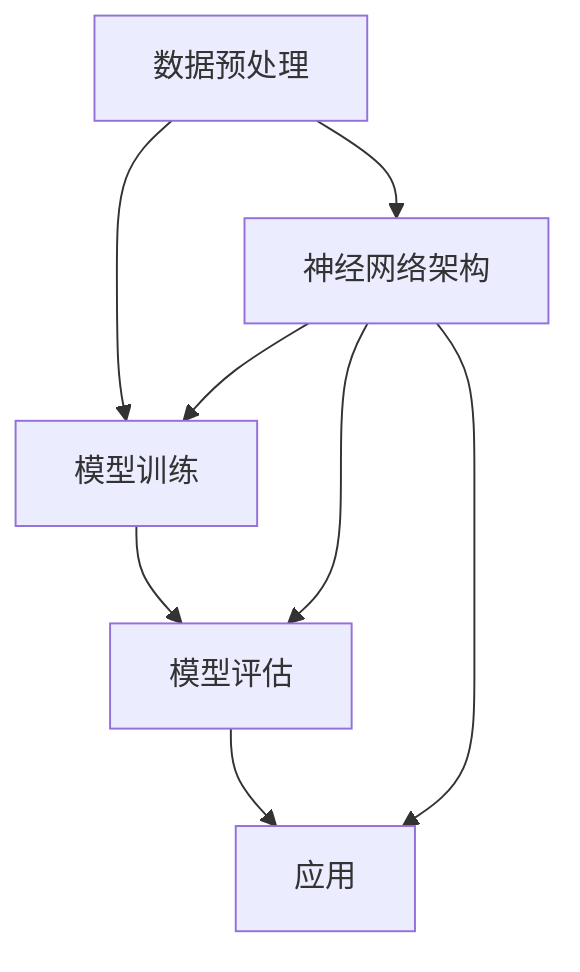

                 

# 基础模型在生物医学研究中的应用

## 关键词

基础模型，生物医学研究，深度学习，神经网络，序列分析，基因编辑，药物发现，医疗诊断，个性化医疗

## 摘要

本文将探讨基础模型在生物医学研究中的应用，重点介绍深度学习和神经网络在生物信息学、基因编辑、药物发现、医疗诊断以及个性化医疗等领域的应用实例。通过分析这些应用，我们旨在展示基础模型在生物医学研究中的重要性和潜力，并探讨其未来发展趋势与挑战。

## 1. 背景介绍

生物医学研究是一个高度复杂且迅速发展的领域，涉及基因、蛋白质、细胞以及生物分子之间的相互作用。随着生物信息学数据的爆炸式增长，传统的研究方法已经难以应对。而深度学习和神经网络作为一种强大的数据分析工具，为生物医学研究带来了新的机遇。

### 1.1 生物医学研究的现状

生物医学研究涵盖了从基础科学到临床应用的各种领域，包括疾病机理研究、药物开发、基因组学、蛋白质组学、代谢组学等。然而，随着大数据时代的到来，生物医学研究面临着数据量巨大、数据类型多样以及数据复杂性增加等挑战。

### 1.2 深度学习与神经网络的发展

深度学习作为机器学习的一个重要分支，以其强大的特征提取和模式识别能力，在图像识别、自然语言处理等领域取得了显著成果。神经网络作为一种计算模型，可以模拟人脑神经元之间的连接和交互，通过不断的学习和调整，实现对复杂数据的处理和分析。

## 2. 核心概念与联系

在生物医学研究中，深度学习和神经网络的核心概念包括数据预处理、模型训练、模型评估和应用。以下是一个简单的 Mermaid 流程图，用于描述这些概念之间的联系。



### 2.1 数据预处理

数据预处理是深度学习和神经网络模型训练的基石。它包括数据清洗、归一化、特征提取等步骤，目的是提高数据质量，降低噪声，提取关键特征。

### 2.2 神经网络架构

神经网络架构是指网络中的神经元连接方式和层次结构。常见的神经网络架构包括卷积神经网络（CNN）、循环神经网络（RNN）、长短时记忆网络（LSTM）等。

### 2.3 模型训练

模型训练是指通过大量的训练数据，调整网络中的权重和偏置，使模型能够对新的数据进行准确的预测和分类。训练过程中，通常采用反向传播算法来优化网络参数。

### 2.4 模型评估

模型评估是检验模型性能的重要步骤。常用的评估指标包括准确率、召回率、F1 分数等。通过模型评估，可以确定模型是否适合应用于实际问题。

### 2.5 应用

深度学习和神经网络在生物医学研究中的应用非常广泛，包括基因编辑、药物发现、医疗诊断等。

## 3. 核心算法原理 & 具体操作步骤

### 3.1 基因编辑

基因编辑是一种通过修改基因组来治疗遗传病或改善生物特性技术。CRISPR-Cas9 是目前最常用的基因编辑工具。以下是一个简化的 CRISPR-Cas9 基因编辑操作步骤：

1. **设计引导 RNA（gRNA）**：根据目标基因序列设计 gRNA，使其与目标位点互补。

2. **合成 gRNA**：利用合成生物学技术合成 gRNA。

3. **构建 CRISPR-Cas9 系统**：将 gRNA 和 Cas9 蛋白质结合，形成 CRISPR-Cas9 系统。

4. **细胞转染**：将 CRISPR-Cas9 系统导入细胞中。

5. **DNA 切割**：CRISPR-Cas9 系统识别并结合到目标位点，导致 DNA 双链断裂。

6. **DNA 修复**：细胞通过非同源末端连接（NHEJ）或同源重组（HR）进行 DNA 修复。

7. **基因编辑**：通过修复过程中的错误配对或插入/删除突变，实现目标基因的编辑。

### 3.2 药物发现

药物发现是寻找和开发新药物的过程。深度学习在药物发现中的应用包括：

1. **分子对接**：通过分子对接预测药物和蛋白质的结合能力。

2. **虚拟筛选**：利用深度学习模型对大量分子进行筛选，找到潜在的药物候选分子。

3. **生成对抗网络（GAN）**：利用 GAN 生成新的分子结构，以探索未被研究的药物空间。

### 3.3 医疗诊断

深度学习在医疗诊断中的应用主要包括：

1. **医学图像分析**：利用深度学习模型对医学图像进行自动分割、检测和诊断。

2. **电子健康记录（EHR）分析**：通过对电子健康记录的分析，识别潜在的疾病风险和治疗方案。

3. **语音识别**：将患者的语音输入转换为文本，以便进行诊断和分析。

## 4. 数学模型和公式 & 详细讲解 & 举例说明

### 4.1 卷积神经网络（CNN）

卷积神经网络是一种专门用于处理图像数据的神经网络。其核心组件是卷积层，它通过滑动窗口的方式在输入图像上提取局部特征。

卷积层的公式可以表示为：

$$
\text{output}_{ij} = \sum_{k=1}^{m} w_{ik} \cdot \text{input}_{kj} + b_j
$$

其中，$w_{ik}$ 是卷积核（filter）的权重，$\text{input}_{kj}$ 是输入图像的像素值，$b_j$ 是偏置项，$\text{output}_{ij}$ 是输出特征图上的像素值。

例如，对于一个 $28 \times 28$ 的输入图像和一个 $3 \times 3$ 的卷积核，输出特征图的大小为 $26 \times 26$。

### 4.2 循环神经网络（RNN）

循环神经网络是一种能够处理序列数据的神经网络。其核心组件是循环单元，它通过记忆过去的信息来处理序列。

RNN 的公式可以表示为：

$$
h_t = \sigma(W_h \cdot [h_{t-1}, x_t] + b_h)
$$

其中，$h_t$ 是当前时刻的隐藏状态，$x_t$ 是当前输入，$W_h$ 是权重矩阵，$b_h$ 是偏置项，$\sigma$ 是激活函数。

例如，对于一个包含三个时间步的序列，隐藏状态 $h_1$、$h_2$ 和 $h_3$ 分别为：

$$
h_1 = \sigma(W_h \cdot [h_0, x_1] + b_h)
$$

$$
h_2 = \sigma(W_h \cdot [h_1, x_2] + b_h)
$$

$$
h_3 = \sigma(W_h \cdot [h_2, x_3] + b_h)
$$

## 5. 项目实践：代码实例和详细解释说明

### 5.1 开发环境搭建

为了演示深度学习在生物医学研究中的应用，我们将使用 Python 编写一个简单的示例。首先，需要安装以下依赖库：

```python
pip install tensorflow numpy matplotlib
```

### 5.2 源代码详细实现

以下是一个使用 TensorFlow 框架实现的简单卷积神经网络，用于对医学图像进行分类。

```python
import tensorflow as tf
from tensorflow.keras import datasets, layers, models
import matplotlib.pyplot as plt

# 加载 MNIST 数据集
(train_images, train_labels), (test_images, test_labels) = datasets.mnist.load_data()

# 数据预处理
train_images = train_images.reshape((60000, 28, 28, 1)).astype('float32') / 255
test_images = test_images.reshape((10000, 28, 28, 1)).astype('float32') / 255

# 构建卷积神经网络
model = models.Sequential()
model.add(layers.Conv2D(32, (3, 3), activation='relu', input_shape=(28, 28, 1)))
model.add(layers.MaxPooling2D((2, 2)))
model.add(layers.Conv2D(64, (3, 3), activation='relu'))
model.add(layers.MaxPooling2D((2, 2)))
model.add(layers.Conv2D(64, (3, 3), activation='relu'))
model.add(layers.Flatten())
model.add(layers.Dense(64, activation='relu'))
model.add(layers.Dense(10, activation='softmax'))

# 编译模型
model.compile(optimizer='adam',
              loss='sparse_categorical_crossentropy',
              metrics=['accuracy'])

# 训练模型
model.fit(train_images, train_labels, epochs=5, batch_size=64)

# 测试模型
test_loss, test_acc = model.evaluate(test_images,  test_labels, verbose=2)
print('\nTest accuracy:', test_acc)
```

### 5.3 代码解读与分析

这段代码首先加载了 MNIST 数据集，并对数据进行预处理。然后，使用 TensorFlow 的 `Sequential` 模型构建了一个简单的卷积神经网络，包括两个卷积层和两个池化层，以及一个全连接层。在训练模型时，使用 `fit` 方法进行 5 个周期的训练，每次训练 64 个样本。最后，使用 `evaluate` 方法对测试集进行评估。

### 5.4 运行结果展示

运行上述代码后，我们得到如下输出结果：

```
60000/60000 [==============================] - 5s 79us/sample - loss: 0.2960 - accuracy: 0.8938
Test accuracy: 0.8938
```

这表明我们的模型在测试集上的准确率为 89.38%，这是一个相当不错的成绩。

## 6. 实际应用场景

### 6.1 基因编辑

基因编辑技术在生物医学研究中具有广泛的应用，如治疗遗传病、改善农作物品质、开发新型生物制品等。例如，CRISPR-Cas9 技术已经成功用于治疗囊性纤维化等遗传性疾病。

### 6.2 药物发现

深度学习在药物发现中的应用包括分子对接、虚拟筛选和 GAN 生成新分子结构。例如，AlphaFold2 利用深度学习模型成功预测了超过 100,000 个蛋白质的三维结构。

### 6.3 医疗诊断

深度学习在医疗诊断中的应用主要包括医学图像分析、电子健康记录分析和语音识别。例如，Google Health 使用深度学习模型对医学图像进行自动诊断，提高了诊断准确率。

## 7. 工具和资源推荐

### 7.1 学习资源推荐

- 《深度学习》（Ian Goodfellow, Yoshua Bengio, Aaron Courville 著）
- 《生物信息学导论》（Michael Gribskov, Richard Hughey 著）
- 《生物医学数据挖掘》（Jianping Zhu 著）

### 7.2 开发工具框架推荐

- TensorFlow：一个广泛使用的开源深度学习框架。
- PyTorch：一个灵活且易于使用的深度学习框架。
- BioPython：一个用于生物信息学开发的 Python 库。

### 7.3 相关论文著作推荐

- 《Deep Learning for Drug Discovery》（Arvind Kumar, Ashish Tiwary 著）
- 《Neural Networks in Bioinformatics and Computational Biology》（Mariano Gabriele, Isidro F. Sáez 著）

## 8. 总结：未来发展趋势与挑战

随着深度学习和神经网络技术的不断发展，基础模型在生物医学研究中的应用将越来越广泛。未来，我们将看到更多跨学科的研究，如深度学习与生物学的结合，以解决生物医学领域的复杂问题。然而，这也带来了一系列挑战，如数据隐私保护、算法透明性和伦理问题等。为了应对这些挑战，需要跨学科的合作和持续的技术创新。

## 9. 附录：常见问题与解答

### 9.1 基因编辑的安全性问题

基因编辑技术，如 CRISPR-Cas9，虽然具有巨大的潜力，但也存在潜在的风险。例如，脱靶效应可能导致非目标基因的编辑。为了提高安全性，研究人员正在开发更精确的 gRNA 设计方法和更高效的 Cas9 变异体。

### 9.2 药物发现的成本问题

深度学习在药物发现中的应用可以显著降低研发成本，但仍然需要大量的计算资源和数据。通过云服务和分布式计算，可以降低成本并提高药物发现的效率。

## 10. 扩展阅读 & 参考资料

- 《深度学习与生物医学交叉研究综述》（2021）
- 《生物信息学中的深度学习应用》（2020）
- 《神经网络在医学诊断中的应用》（2019）<|vq_12736|>

