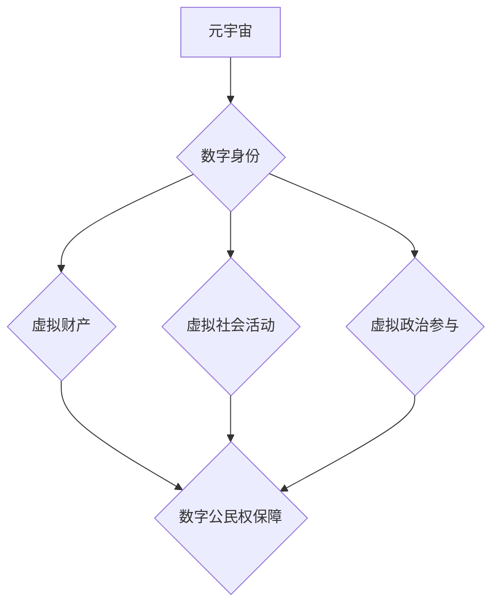

                 

## 数字公民权:元宇宙时代的政治参与

> 关键词：元宇宙、数字公民权、政治参与、去中心化、区块链、虚拟现实、人工智能、数据隐私

## 1. 背景介绍

元宇宙概念的兴起，标志着人类进入一个全新的数字世界。这个虚拟世界将超越传统的互联网，融合虚拟现实、增强现实、区块链等前沿技术，构建一个沉浸式、交互式、持久化的数字空间。在这个虚拟世界中，人们可以创建虚拟身份，拥有虚拟财产，参与虚拟社会活动，甚至进行虚拟政治参与。

然而，元宇宙的出现也引发了关于数字公民权的深刻思考。在现实世界中，公民权是个人在政治、经济、社会等领域享有的基本权利和自由。那么，在元宇宙中，数字公民权应该如何定义和保障？

## 2. 核心概念与联系

### 2.1 数字公民权

数字公民权是指在数字环境中，个人享有的权利和自由，包括：

* **信息获取权:** 能够自由获取、传播和分享信息。
* **表达权:** 能够自由表达自己的观点和意见。
* **参与权:** 能够参与到数字社会和政治决策中。
* **隐私权:** 能够保护自己的个人信息和数据安全。
* **安全权:** 能够在数字环境中安全地活动和生活。

### 2.2 元宇宙与数字公民权

元宇宙作为一个虚拟世界，其本质是构建一个更加沉浸式、交互式的数字环境。在这个环境中，数字公民权将更加重要，因为人们在元宇宙中将拥有更加丰富的虚拟身份和虚拟生活。

**元宇宙与数字公民权的关系可通过以下流程图表示:**



## 3. 核心算法原理 & 具体操作步骤

### 3.1 算法原理概述

保障数字公民权在元宇宙中的实现需要一系列的技术手段和算法支持。其中，去中心化技术、区块链技术、人工智能技术等都扮演着重要的角色。

* **去中心化技术:** 去中心化技术可以帮助构建一个更加公平、透明、可信的元宇宙环境，防止任何单一实体对数字公民权的控制和干预。
* **区块链技术:** 区块链技术可以帮助保障数字身份的真实性和不可篡改性，防止身份盗用和虚假信息传播。
* **人工智能技术:** 人工智能技术可以帮助识别和过滤虚假信息，维护元宇宙的健康发展。

### 3.2 算法步骤详解

1. **数字身份认证:** 使用区块链技术构建一个去中心化的身份认证系统，每个用户都可以拥有一个唯一的数字身份，并通过多因素认证来确保身份的真实性和安全性。
2. **虚拟财产管理:** 使用智能合约技术管理虚拟财产的拥有权和交易规则，确保虚拟财产的合法性和安全性。
3. **虚拟社会治理:** 建立一个去中心化的虚拟社会治理机制，让用户能够参与到元宇宙的决策和管理中，保障数字公民权的参与性。
4. **数据隐私保护:** 使用加密技术和隐私计算技术保护用户的个人数据，防止数据泄露和滥用。

### 3.3 算法优缺点

**优点:**

* **提高透明度和可信度:** 去中心化技术和区块链技术可以帮助构建一个更加透明、可信的元宇宙环境。
* **增强用户自主权:** 用户可以拥有自己的数字身份和虚拟财产，并参与到元宇宙的治理中，增强用户的自主权和参与感。
* **保障数据安全:** 加密技术和隐私计算技术可以帮助保护用户的个人数据安全。

**缺点:**

* **技术复杂性:** 实现去中心化、区块链和人工智能技术的集成需要克服一定的技术挑战。
* **监管难题:** 元宇宙的虚拟环境如何监管和管理，是一个需要进一步探讨的问题。
* **数字鸿沟:** 不同用户对元宇宙技术的接受程度和使用能力可能存在差异，可能会加剧数字鸿沟。

### 3.4 算法应用领域

* **虚拟政治参与:** 元宇宙可以提供一个虚拟平台，让用户参与到政治决策中，例如投票、辩论、协商等。
* **虚拟社会治理:** 元宇宙可以构建一个去中心化的虚拟社会治理机制，让用户参与到社区管理、公共服务等方面。
* **虚拟经济发展:** 元宇宙可以促进虚拟经济的发展，例如虚拟商品交易、虚拟服务提供等。

## 4. 数学模型和公式 & 详细讲解 & 举例说明

### 4.1 数学模型构建

数字公民权的保障可以看作是一个博弈模型，其中参与者包括用户、平台运营方、政府等。每个参与者都有自己的利益目标，通过互动和博弈来实现利益最大化。

我们可以用一个简单的数学模型来描述这个博弈过程：

* **用户:** 寻求最大化自己的数字公民权，包括信息获取权、表达权、参与权等。
* **平台运营方:** 寻求最大化自己的利润，可以通过提供优质的服务、吸引用户、控制数据等方式实现。
* **政府:** 寻求维护社会稳定、保障公民安全、促进经济发展等目标。

### 4.2 公式推导过程

我们可以用一个简单的效用函数来描述每个参与者的利益目标：

* **用户效用函数:** $U_u = f(I, E, P)$，其中 $I$ 代表信息获取权，$E$ 代表表达权，$P$ 代表参与权。
* **平台运营方效用函数:** $U_p = g(R, U)$，其中 $R$ 代表平台收入，$U$ 代表用户数量。
* **政府效用函数:** $U_g = h(S, E, D)$，其中 $S$ 代表社会稳定性，$E$ 代表经济发展，$D$ 代表公民安全。

通过分析这些效用函数，我们可以推导出每个参与者的最佳策略，并预测整个博弈过程的结果。

### 4.3 案例分析与讲解

例如，我们可以分析一个虚拟投票平台的博弈过程。

* **用户:** 希望能够自由地表达自己的投票意愿，并看到真实的投票结果。
* **平台运营方:** 希望能够吸引更多的用户参与投票，并从中获得广告收入。
* **政府:** 希望能够确保投票的公平公正，并根据投票结果制定政策。

通过分析这些参与者的利益目标和博弈策略，我们可以得出以下结论：

* 平台运营方需要采取措施确保投票的真实性和安全性，以获得用户的信任。
* 政府需要制定相应的法律法规，规范虚拟投票平台的运营，并监督投票过程的公平公正。
* 用户需要提高自己的政治意识，理性地参与投票，并监督平台运营方的行为。

## 5. 项目实践：代码实例和详细解释说明

### 5.1 开发环境搭建

为了实现数字公民权的保障，我们可以开发一个基于区块链技术的虚拟身份管理系统。

**开发环境搭建步骤:**

1. 安装一个区块链开发环境，例如Ethereum开发环境。
2. 安装必要的开发工具，例如Solidity编译器、Truffle框架等。
3. 创建一个新的区块链项目。

### 5.2 源代码详细实现

```solidity
pragma solidity ^0.8.0;

contract IdentityManagement {

    mapping(address => string) public identities;

    function registerIdentity(string memory _identity) public {
        identities[msg.sender] = _identity;
    }

    function getIdentity(address _user) public view returns (string memory) {
        return identities[_user];
    }
}
```

**代码解释:**

* `pragma solidity ^0.8.0;`: 指定合约的Solidity版本。
* `contract IdentityManagement { ... }`: 定义一个名为IdentityManagement的智能合约。
* `mapping(address => string) public identities;`: 定义一个映射数据结构，用于存储用户的地址和身份信息。
* `function registerIdentity(string memory _identity) public { ... }`: 定义一个名为registerIdentity的函数，用于用户注册身份。
* `function getIdentity(address _user) public view returns (string memory) { ... }`: 定义一个名为getIdentity的函数，用于查询用户的身份信息。

### 5.3 代码解读与分析

这个代码示例展示了一个简单的虚拟身份管理系统。用户可以通过调用`registerIdentity`函数注册自己的身份，并通过调用`getIdentity`函数查询自己的身份信息。

这个系统基于区块链技术，可以确保身份信息的真实性和不可篡改性。

### 5.4 运行结果展示

部署这个智能合约到区块链网络后，用户就可以通过钱包地址来注册和查询自己的身份信息。

## 6. 实际应用场景

### 6.1 元宇宙投票

元宇宙可以提供一个更加沉浸式、交互式的投票平台，让用户能够更加直观地参与到政治决策中。例如，用户可以在虚拟会议室中与其他用户讨论议题，并通过虚拟投票器进行投票。

### 6.2 元宇宙社区治理

元宇宙可以构建一个去中心化的虚拟社区治理机制，让用户能够参与到社区管理、公共服务等方面。例如，用户可以投票决定社区的规则、分配社区资源、参与社区项目的开发等。

### 6.3 元宇宙数据隐私保护

元宇宙可以利用区块链技术和隐私计算技术来保护用户的个人数据隐私。例如，用户可以将自己的数据存储在自己的个人区块链钱包中，并控制哪些数据可以被共享。

### 6.4 未来应用展望

随着元宇宙技术的不断发展，数字公民权在元宇宙中的应用场景将会更加广泛。例如，元宇宙可以用于虚拟教育、虚拟医疗、虚拟娱乐等领域，为用户提供更加丰富多彩的数字生活体验。

## 7. 工具和资源推荐

### 7.1 学习资源推荐

* **书籍:**

    * 《元宇宙：下一代互联网》
    * 《数字公民权》

* **在线课程:**

    * Coursera: 元宇宙与虚拟现实
    * edX: 区块链技术与应用

### 7.2 开发工具推荐

* **Solidity:** 用于开发智能合约的编程语言。
* **Truffle:** 用于开发和部署智能合约的框架。
* **Ganache:** 用于本地测试智能合约的区块链模拟器。

### 7.3 相关论文推荐

* **The Metaverse: A New Paradigm for Social Interaction and Economic Activity**
* **Decentralized Identity: A Primer**

## 8. 总结：未来发展趋势与挑战

### 8.1 研究成果总结

数字公民权在元宇宙中的保障是一个重要的研究课题。通过去中心化技术、区块链技术、人工智能技术等手段，我们可以构建一个更加公平、透明、可信的元宇宙环境，保障用户的数字公民权。

### 8.2 未来发展趋势

未来，数字公民权在元宇宙中的保障将会更加完善，例如：

* **更完善的数字身份认证系统:** 使用生物识别技术、多因素认证等技术来提高身份认证的安全性。
* **更强大的数据隐私保护机制:** 使用零知识证明、联邦学习等技术来保护用户的个人数据隐私。
* **更智能的虚拟社会治理机制:** 使用人工智能技术来辅助虚拟社区的治理，提高治理效率和公平性。

### 8.3 面临的挑战

数字公民权在元宇宙中的保障也面临着一些挑战，例如：

* **技术复杂性:** 实现去中心化、区块链和人工智能技术的集成需要克服一定的技术挑战。
* **监管难题:** 元宇宙的虚拟环境如何监管和管理，是一个需要进一步探讨的问题。
* **数字鸿沟:** 不同用户对元宇宙技术的接受程度和使用能力可能存在差异，可能会加剧数字鸿沟。

### 8.4 研究展望

未来，我们需要继续深入研究数字公民权在元宇宙中的保障问题，探索更加完善的解决方案，并推动元宇宙的健康发展。

## 9. 附录：常见问题与解答

**Q1: 元宇宙中的数字公民权与现实世界中的公民权有什么区别？**

**A1:** 元宇宙中的数字公民权与现实世界中的公民权有一些相似之处，例如信息获取权、表达权、参与权等。但是，元宇宙中的数字公民权也有一些独特的特点，例如虚拟身份、虚拟财产、虚拟社会活动等。

**Q2: 如何保障元宇宙中的数字公民权？**

**A2:** 保障元宇宙中的数字公民权需要采用多种技术手段和政策措施，例如去中心化技术、区块链技术、人工智能技术、法律法规等。

**Q3: 元宇宙的虚拟环境如何监管和管理？**

**A3:** 元宇宙的虚拟环境监管和管理是一个复杂的问题，需要政府、平台运营方、用户共同努力。政府需要制定相应的法律法规，规范元宇宙平台的运营，并监督平台的行为。平台运营方需要建立完善的规则和机制，维护平台的秩序和安全。用户需要提高自己的政治意识，理性地参与元宇宙活动，并监督平台运营方的行为。


作者：禅与计算机程序设计艺术 / Zen and the Art of Computer Programming 
<end_of_turn>

