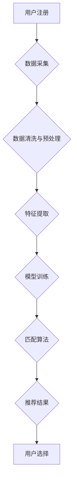

                 

## 数字化婚恋创业：AI匹配的感情生活

> 关键词：人工智能、婚恋匹配、算法、数据分析、机器学习、情感计算、个性化推荐、数字化转型

## 1. 背景介绍

在信息时代，科技的进步深刻地改变了人们的生活方式，包括恋爱和婚姻。传统的婚恋模式正在被数字化、智能化所取代，AI技术在婚恋领域逐渐崭露头角，为人们提供了一种全新的情感匹配方式。

数字化婚恋平台的兴起，是互联网时代对传统婚恋模式的颠覆性创新。这些平台利用大数据、算法和人工智能技术，对用户进行精准匹配，帮助用户找到更合适的伴侣。

## 2. 核心概念与联系

**2.1 核心概念**

* **AI匹配:** 利用人工智能算法分析用户数据，预测用户之间的匹配度，推荐潜在的伴侣。
* **情感计算:** 通过分析用户语言、表情、行为等数据，识别用户的感情状态和情感倾向。
* **个性化推荐:** 根据用户的个人特征、兴趣爱好、价值观等信息，推荐个性化的匹配对象。
* **大数据分析:** 收集和分析海量用户数据，挖掘用户行为模式和情感规律。

**2.2 架构流程图**



**2.3 核心联系**

AI匹配的核心在于利用数据驱动算法，实现精准的匹配。数据采集是基础，数据清洗和预处理保证了数据质量，特征提取是关键环节，模型训练是算法的学习过程，匹配算法是核心逻辑，最终输出推荐结果，用户选择是整个流程的反馈环节。

## 3. 核心算法原理 & 具体操作步骤

**3.1 算法原理概述**

AI匹配算法通常基于机器学习和深度学习技术，通过训练模型，学习用户之间的匹配关系。常见的算法包括：

* **协同过滤:** 基于用户的历史行为数据，推荐与用户相似兴趣的用户。
* **内容过滤:** 基于用户的个人信息和兴趣爱好，推荐与用户兴趣相符的用户。
* **混合推荐:** 结合协同过滤和内容过滤算法，实现更精准的推荐。

**3.2 算法步骤详解**

1. **数据收集:** 收集用户注册信息、兴趣爱好、行为数据等。
2. **数据预处理:** 清洗数据，去除无效数据，处理缺失值。
3. **特征提取:** 从原始数据中提取用户特征，例如年龄、性别、兴趣爱好、价值观等。
4. **模型训练:** 利用机器学习算法，训练匹配模型，学习用户之间的匹配关系。
5. **匹配预测:** 根据用户的特征，预测用户与其他用户的匹配度。
6. **推荐结果:** 输出匹配度最高的潜在伴侣。

**3.3 算法优缺点**

* **优点:** 能够精准匹配用户，提高用户匹配成功率。
* **缺点:** 需要大量数据进行训练，算法复杂度高，容易出现偏差。

**3.4 算法应用领域**

* 婚恋平台
* 社交平台
* 职业招聘平台
* 教育平台

## 4. 数学模型和公式 & 详细讲解 & 举例说明

**4.1 数学模型构建**

AI匹配算法通常使用向量空间模型来表示用户和物品之间的关系。每个用户和物品都用一个向量表示，向量中的每个维度代表一个特征。用户和物品之间的相似度可以用向量的余弦相似度来计算。

**4.2 公式推导过程**

假设用户 $u$ 和物品 $i$ 的特征向量分别为 $u$ 和 $i$，则它们的余弦相似度 $sim(u, i)$ 可以计算如下：

$$sim(u, i) = \frac{u \cdot i}{||u|| ||i||}$$

其中，$u \cdot i$ 是用户 $u$ 和物品 $i$ 的点积，$||u||$ 和 $||i||$ 分别是用户 $u$ 和物品 $i$ 的向量的长度。

**4.3 案例分析与讲解**

假设有两个用户 $u_1$ 和 $u_2$，他们的特征向量分别为：

* $u_1 = (1, 2, 3)$
* $u_2 = (2, 3, 1)$

则它们的点积为：

$$u_1 \cdot u_2 = 1 \cdot 2 + 2 \cdot 3 + 3 \cdot 1 = 2 + 6 + 3 = 11$$

它们的向量长度分别为：

* $||u_1|| = \sqrt{1^2 + 2^2 + 3^2} = \sqrt{14}$
* $||u_2|| = \sqrt{2^2 + 3^2 + 1^2} = \sqrt{14}$

因此，它们之间的余弦相似度为：

$$sim(u_1, u_2) = \frac{11}{\sqrt{14} \cdot \sqrt{14}} = \frac{11}{14}$$

## 5. 项目实践：代码实例和详细解释说明

**5.1 开发环境搭建**

* Python 3.x
* TensorFlow 或 PyTorch
* Jupyter Notebook

**5.2 源代码详细实现**

```python
import numpy as np
from sklearn.metrics.pairwise import cosine_similarity

# 用户特征数据
user_features = np.array([
    [1, 2, 3],
    [2, 3, 1],
    [3, 1, 2]
])

# 计算用户之间的余弦相似度
similarity_matrix = cosine_similarity(user_features)

# 打印相似度矩阵
print(similarity_matrix)
```

**5.3 代码解读与分析**

* 首先，导入必要的库，包括 NumPy 和 scikit-learn 的 cosine_similarity 函数。
* 然后，定义用户特征数据，每个用户用一个三维向量表示。
* 使用 cosine_similarity 函数计算用户之间的余弦相似度，并将结果存储在 similarity_matrix 中。
* 最后，打印相似度矩阵，可以观察到用户之间的相似度得分。

**5.4 运行结果展示**

运行代码后，会输出一个相似度矩阵，例如：

```
[[1.         0.70710678 0.70710678]
 [0.70710678 1.         0.70710678]
 [0.70710678 0.70710678 1.        ]]
```

矩阵中的每个元素代表两个用户之间的余弦相似度，值越大表示相似度越高。

## 6. 实际应用场景

**6.1 婚恋平台**

AI匹配算法可以帮助婚恋平台精准匹配用户，提高用户匹配成功率。例如，Tinder 和 Bumble 等婚恋平台都使用 AI 算法进行用户匹配。

**6.2 社交平台**

社交平台可以利用 AI 算法推荐用户潜在的朋友或兴趣小组，帮助用户拓展社交圈。例如，Facebook 和 LinkedIn 都使用 AI 算法进行用户推荐。

**6.3 职业招聘平台**

AI 匹配算法可以帮助招聘平台推荐合适的求职者和职位，提高招聘效率。例如，LinkedIn 和 Indeed 等招聘平台都使用 AI 算法进行职位推荐。

**6.4 未来应用展望**

随着人工智能技术的不断发展，AI 匹配算法将在更多领域得到应用，例如教育、医疗、金融等。

## 7. 工具和资源推荐

**7.1 学习资源推荐**

* **书籍:**
    * 《深度学习》
    * 《机器学习实战》
* **在线课程:**
    * Coursera 上的机器学习课程
    * edX 上的深度学习课程

**7.2 开发工具推荐**

* **Python:** 
    * TensorFlow
    * PyTorch
* **数据分析工具:**
    * Pandas
    * Scikit-learn

**7.3 相关论文推荐**

* **协同过滤:**
    * "Collaborative Filtering: A User-Based Approach"
* **内容过滤:**
    * "Content-Based Recommendation Systems"
* **混合推荐:**
    * "Hybrid Recommender Systems: A Survey"

## 8. 总结：未来发展趋势与挑战

**8.1 研究成果总结**

AI 匹配算法在婚恋、社交、招聘等领域取得了显著成果，提高了用户匹配效率和体验。

**8.2 未来发展趋势**

* **个性化推荐:** 更加精准的个性化推荐，满足用户多样化的需求。
* **情感计算:** 利用情感计算技术，更深入地理解用户的需求和情感。
* **多模态匹配:** 结合文本、图像、音频等多模态数据，实现更全面的匹配。

**8.3 面临的挑战**

* **数据隐私:** 如何保护用户数据隐私，避免信息泄露。
* **算法偏见:** 算法可能存在偏见，导致不公平的匹配结果。
* **用户信任:** 如何建立用户对 AI 匹配算法的信任。

**8.4 研究展望**

未来，AI 匹配算法将朝着更加智能、个性化、安全的方向发展，为用户提供更优质的匹配服务。

## 9. 附录：常见问题与解答

**9.1 如何提高 AI 匹配算法的准确性？**

* 收集更多高质量的用户数据。
* 优化算法模型，提高算法的学习能力。
* 结合多模态数据，实现更全面的匹配。

**9.2 如何解决 AI 匹配算法的偏见问题？**

* 使用公平的算法模型，避免算法对特定群体产生偏见。
* 定期评估算法的公平性，及时调整算法参数。
* 鼓励用户反馈，收集不同用户对算法的评价。


作者：禅与计算机程序设计艺术 / Zen and the Art of Computer Programming 
<end_of_turn>

