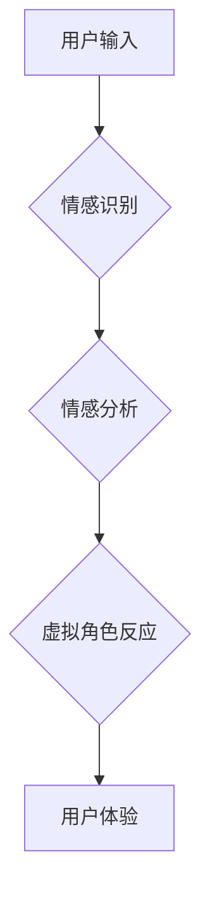

                 

## 数字化情绪:元宇宙中的情感管理

> 关键词：元宇宙、情感计算、情绪管理、人工智能、虚拟现实、数字身份、用户体验

## 1. 背景介绍

元宇宙的概念近年来备受关注，它被描绘成一个沉浸式、互联、持久虚拟世界，人们可以在其中工作、娱乐、社交等。然而，元宇宙的构建不仅仅是技术上的挑战，更重要的是如何构建一个能够满足人类情感需求的虚拟环境。

人类的情感是复杂的，它影响着我们的行为、决策和体验。在元宇宙中，虚拟角色和环境能够感知和理解用户的真实情感，并做出相应的反应，从而创造更真实、更具沉浸感的体验。这被称为“情感计算”，它将人工智能技术应用于理解、识别和模拟人类的情感。

## 2. 核心概念与联系

### 2.1 情感计算

情感计算的核心是理解和模拟人类情感。它涉及多个领域，包括自然语言处理、计算机视觉、机器学习等。

* **自然语言处理 (NLP):** 分析文本和语音数据，识别情感表达，例如喜怒哀乐等。
* **计算机视觉 (CV):** 分析图像和视频数据，识别面部表情、肢体语言等情感线索。
* **机器学习 (ML):** 利用大量数据训练模型，学习识别和预测情感模式。

### 2.2 元宇宙与情感计算的融合

元宇宙为情感计算提供了广阔的应用场景。虚拟角色可以通过情感计算技术感知用户的真实情感，并做出相应的反应，例如：

* **个性化互动:** 根据用户的喜好和情绪，虚拟角色可以提供个性化的对话和互动体验。
* **沉浸式体验:** 通过模拟真实的情感反应，虚拟环境可以更加逼真，增强用户的沉浸感。
* **情感支持:** 元宇宙中的虚拟角色可以提供情感支持，帮助用户缓解压力和焦虑。

**Mermaid 流程图:**



## 3. 核心算法原理 & 具体操作步骤

### 3.1 算法原理概述

情感计算算法通常基于以下原理：

* **特征提取:** 从文本、语音、图像等数据中提取情感相关的特征，例如关键词、语气、表情等。
* **情感分类:** 利用机器学习算法对提取的特征进行分类，识别情感类别，例如快乐、悲伤、愤怒等。
* **情感强度度量:** 评估情感的强度，例如轻微、中等、强烈等。

### 3.2 算法步骤详解

1. **数据收集:** 收集大量文本、语音、图像等数据，并进行标注，标记情感类别和强度。
2. **特征提取:** 使用NLP、CV等技术提取情感相关的特征。
3. **模型训练:** 利用机器学习算法，例如支持向量机 (SVM)、随机森林 (RF)、深度神经网络 (DNN) 等，训练情感分类模型。
4. **模型评估:** 使用测试数据评估模型的准确率、召回率等指标。
5. **模型部署:** 将训练好的模型部署到元宇宙平台，用于识别和分析用户的真实情感。

### 3.3 算法优缺点

**优点:**

* **自动化:** 可以自动识别和分析情感，提高效率。
* **客观:** 减少主观判断的影响，提高准确性。
* **可扩展:** 可以应用于多种数据类型和场景。

**缺点:**

* **数据依赖:** 需要大量标注数据进行训练，数据质量直接影响模型性能。
* **情感复杂性:** 人类情感复杂多变，难以完全模拟和理解。
* **伦理问题:** 情感计算技术可能被用于操控用户情绪，需要谨慎使用。

### 3.4 算法应用领域

* **元宇宙:** 构建更具沉浸感和交互性的虚拟环境。
* **游戏:** 增强游戏体验，使游戏角色更加智能和人性化。
* **教育:** 评估学生的学习情绪，提供个性化的学习建议。
* **医疗:** 辅助诊断和治疗心理疾病。

## 4. 数学模型和公式 & 详细讲解 & 举例说明

### 4.1 数学模型构建

情感计算模型通常基于概率论和统计学原理，例如贝叶斯分类器、朴素贝叶斯算法等。

**贝叶斯分类器:**

贝叶斯分类器是一种基于贝叶斯定理的分类算法，用于根据输入特征预测情感类别。

**公式:**

$$P(C_i|X) = \frac{P(X|C_i)P(C_i)}{P(X)}$$

其中:

* $P(C_i|X)$: 给定特征 $X$，情感类别 $C_i$ 的概率。
* $P(X|C_i)$: 给定情感类别 $C_i$，特征 $X$ 的概率。
* $P(C_i)$: 情感类别 $C_i$ 的先验概率。
* $P(X)$: 特征 $X$ 的边缘概率。

### 4.2 公式推导过程

贝叶斯定理用于计算后验概率，即给定特征 $X$ 的情况下，情感类别 $C_i$ 的概率。

**推导过程:**

根据贝叶斯定理，我们可以得到以下公式:

$$P(C_i|X) = \frac{P(X|C_i)P(C_i)}{P(X)}$$

其中，$P(X|C_i)$ 可以通过训练数据计算，$P(C_i)$ 是先验概率，可以根据情感类别在训练数据中的频率估计，$P(X)$ 是特征 $X$ 的边缘概率，可以通过训练数据计算。

### 4.3 案例分析与讲解

假设我们有一个情感分类模型，用于识别文本中的情感类别，例如“快乐”、“悲伤”、“愤怒”。

**训练数据:**

* “今天天气真好，心情很愉快” - 快乐
* “我失恋了，感觉很伤心” - 悲伤
* “这个游戏太难了，我生气了” - 愤怒

**测试数据:**

* “我今天遇到了很多困难，感觉很沮丧”

**模型预测:**

根据训练数据和贝叶斯分类器，模型可以预测测试数据“我今天遇到了很多困难，感觉很沮丧”的情感类别为“悲伤”。

## 5. 项目实践：代码实例和详细解释说明

### 5.1 开发环境搭建

* **操作系统:** Windows/macOS/Linux
* **编程语言:** Python
* **库:** NLTK、Scikit-learn、TensorFlow/PyTorch

### 5.2 源代码详细实现

```python
# 情感分类模型示例代码

import nltk
from nltk.sentiment import SentimentIntensityAnalyzer

# 下载情感分析工具包
nltk.download('vader_lexicon')

# 初始化情感分析器
analyzer = SentimentIntensityAnalyzer()

# 测试文本
text = "今天天气真好，心情很愉快"

# 分析文本情感
scores = analyzer.polarity_scores(text)

# 打印情感得分
print(scores)
```

### 5.3 代码解读与分析

* **导入库:** 导入必要的库，例如NLTK用于自然语言处理，Scikit-learn用于机器学习。
* **下载工具包:** 下载情感分析工具包，例如VADER lexicon。
* **初始化分析器:** 初始化情感分析器，例如SentimentIntensityAnalyzer。
* **测试文本:** 定义需要分析的情感文本。
* **分析情感:** 使用分析器对文本进行情感分析，获取情感得分。
* **打印结果:** 打印情感得分，例如正向情感、负向情感、中性情感等。

### 5.4 运行结果展示

```
{'neg': 0.0, 'neu': 0.262, 'pos': 0.738, 'compound': 0.9017}
```

结果表明，文本“今天天气真好，心情很愉快”的情感倾向为正向，情感强度较高。

## 6. 实际应用场景

### 6.1 元宇宙游戏

* **角色互动:** 游戏角色可以根据玩家的情感做出不同的反应，例如玩家感到开心时，角色会给予鼓励，玩家感到悲伤时，角色会提供安慰。
* **剧情体验:** 游戏剧情可以根据玩家的情感进行调整，例如玩家感到恐惧时，剧情会变得更加紧张刺激。
* **社交互动:** 游戏玩家可以通过情感计算技术更好地理解彼此的情绪，从而建立更深层的社交关系。

### 6.2 元宇宙教育

* **个性化学习:** 根据学生的学习情绪，提供个性化的学习建议和辅导。
* **课堂互动:** 老师可以通过情感计算技术了解学生的学习状态，及时调整教学方法。
* **远程教育:** 情感计算技术可以帮助远程教育平台更好地理解学生的学习需求，提供更有效的学习支持。

### 6.3 元宇宙医疗

* **心理健康:** 情感计算技术可以帮助识别和评估心理健康问题，例如抑郁症、焦虑症等。
* **情绪管理:** 元宇宙平台可以提供情绪管理工具和训练，帮助用户更好地控制自己的情绪。
* **远程医疗:** 情感计算技术可以帮助远程医疗平台更好地了解患者的情绪状态，提供更有效的医疗服务。

### 6.4 未来应用展望

随着元宇宙技术的不断发展，情感计算技术将在元宇宙中发挥越来越重要的作用。未来，我们可以期待：

* **更逼真的虚拟角色:** 虚拟角色能够更加真实地理解和模拟人类的情感，提供更沉浸式的体验。
* **更个性化的服务:** 元宇宙平台能够根据用户的个人喜好和情绪提供个性化的服务和体验。
* **更有效的治疗手段:** 情感计算技术可以帮助开发更有效的治疗心理疾病的方法。

## 7. 工具和资源推荐

### 7.1 学习资源推荐

* **书籍:**
    * 《情感计算》 by Alan Lee
    * 《机器学习》 by Tom Mitchell
* **在线课程:**
    * Coursera: Natural Language Processing Specialization
    * edX: Artificial Intelligence

### 7.2 开发工具推荐

* **Python:** 广泛使用的编程语言，用于情感计算和机器学习开发。
* **NLTK:** 自然语言处理工具包，提供情感分析、文本分类等功能。
* **Scikit-learn:** 机器学习库，提供各种机器学习算法，例如支持向量机、随机森林等。
* **TensorFlow/PyTorch:** 深度学习框架，用于训练复杂的深度神经网络模型。

### 7.3 相关论文推荐

* **"Sentiment Analysis Using Deep Learning"** by Liu et al.
* **"A Survey of Emotion Recognition Methods: Techniques, Datasets, and Applications"** by Poria et al.

## 8. 总结：未来发展趋势与挑战

### 8.1 研究成果总结

情感计算技术在元宇宙的应用取得了显著进展，例如虚拟角色的情感识别和反应、个性化学习和医疗服务等。

### 8.2 未来发展趋势

* **更准确的情感识别:** 利用更先进的机器学习算法和数据分析技术，提高情感识别的准确率和可靠性。
* **更丰富的用户体验:** 将情感计算技术融入到元宇宙的各个方面，提供更沉浸式、更个性化的体验。
* **跨模态情感分析:** 将文本、语音、图像等多种数据类型融合起来，进行更全面的情感分析。

### 8.3 面临的挑战

* **数据隐私和安全:** 情感计算技术需要处理大量用户数据，需要确保数据隐私和安全。
* **算法偏见:** 情感计算算法可能存在偏见，需要进行公平性和可解释性方面的研究。
* **伦理问题:** 情感计算技术可能被用于操控用户情绪，需要制定相应的伦理规范和监管机制。

### 8.4 研究展望

未来，情感计算技术将继续发展，并在元宇宙中发挥越来越重要的作用。我们需要加强对情感计算技术的研究，解决其面临的挑战，并确保其安全、公平、可持续地发展。

## 9. 附录：常见问题与解答

**Q1: 情感计算技术是如何工作的？**

**A1:** 情感计算技术利用机器学习算法，从文本、语音、图像等数据中提取情感相关的特征，并进行分类和分析，从而识别和理解人类的情感。

**Q2: 情感计算技术有哪些应用场景？**

**A2:** 情感计算技术在元宇宙、游戏、教育、医疗等多个领域都有应用，例如虚拟角色的情感互动、个性化学习、情绪管理等。

**Q3: 情感计算技术有哪些伦理问题？**

**A3:** 情感计算技术可能被用于操控用户情绪，需要制定相应的伦理规范和监管机制，确保其安全、公平、可持续地发展。


作者：禅与计算机程序设计艺术 / Zen and the Art of Computer Programming 
<end_of_turn>

