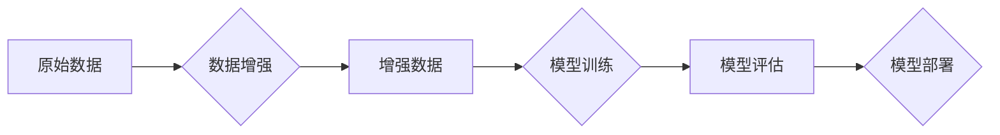

                 

## 数据增强技术：图像和文本

> 关键词：数据增强、图像处理、文本处理、机器学习、深度学习、迁移学习、模型泛化

## 1. 背景介绍

在机器学习和深度学习领域，高质量的数据是训练模型的关键要素。然而，获取大量高质量标注数据往往成本高昂且耗时费力。数据增强技术应运而生，它通过对现有数据进行各种变换，生成新的、类似但不同的数据样本，从而有效地扩充数据集规模，提升模型的泛化能力。

数据增强技术在计算机视觉和自然语言处理领域都取得了显著的成果。在图像领域，数据增强可以用于提高图像分类、目标检测、图像分割等任务的性能。在文本领域，数据增强可以用于增强文本分类、情感分析、机器翻译等任务的鲁棒性。

## 2. 核心概念与联系

数据增强技术的核心是通过对原始数据进行一系列的变换，生成新的数据样本，这些变换可以是几何变换、颜色变换、噪声添加等。这些变换的目标是模拟真实世界中的数据分布，使模型能够更好地应对各种输入数据。

数据增强技术与机器学习、深度学习等领域密切相关。它可以作为模型训练过程中的重要组成部分，帮助模型学习更丰富的特征，提高模型的泛化能力。

**数据增强技术流程图**



## 3. 核心算法原理 & 具体操作步骤

### 3.1  算法原理概述

数据增强算法的原理是通过对原始数据进行一系列的变换，生成新的数据样本。这些变换可以是几何变换、颜色变换、噪声添加等。

**几何变换**包括旋转、缩放、平移、剪切等，可以改变图像或文本的形状和位置。

**颜色变换**包括亮度调整、对比度调整、饱和度调整等，可以改变图像或文本的颜色分布。

**噪声添加**包括高斯噪声、椒盐噪声等，可以模拟真实世界中的数据噪声。

### 3.2  算法步骤详解

1. **选择数据增强策略:** 根据具体的应用场景和数据特点，选择合适的增强策略。

2. **参数设置:** 对增强策略的参数进行设置，例如旋转角度、缩放比例、噪声强度等。

3. **数据增强:** 对原始数据进行增强操作，生成新的数据样本。

4. **数据评估:** 对增强后的数据进行评估，确保增强效果良好。

### 3.3  算法优缺点

**优点:**

* 能够有效地扩充数据集规模。
* 可以提高模型的泛化能力。
* 相对简单易实现。

**缺点:**

* 增强后的数据可能与真实数据分布不完全一致。
* 过度增强可能会导致数据质量下降。

### 3.4  算法应用领域

数据增强技术广泛应用于图像和文本处理领域，例如：

* **图像分类:** 提高图像分类模型的准确率。
* **目标检测:** 增强目标检测模型对小目标和遮挡目标的检测能力。
* **图像分割:** 提高图像分割模型的精度。
* **文本分类:** 增强文本分类模型对噪声文本和短文本的鲁棒性。
* **情感分析:** 提高情感分析模型对复杂情感的识别能力。

## 4. 数学模型和公式 & 详细讲解 & 举例说明

### 4.1  数学模型构建

数据增强算法通常可以看作是一种随机变换过程，其数学模型可以基于概率分布来构建。例如，图像旋转的数学模型可以表示为：

$$
\theta = \text{rand}(0, 360)
$$

其中，$\theta$ 表示旋转角度，$\text{rand}(0, 360)$ 表示从0到360之间随机生成一个角度。

### 4.2  公式推导过程

数据增强算法的具体公式推导过程取决于具体的增强策略。例如，图像亮度调整的公式可以表示为：

$$
I' = I \cdot (1 + \alpha)
$$

其中，$I$ 表示原始图像，$I'$ 表示增强后的图像，$\alpha$ 表示亮度调整系数。

### 4.3  案例分析与讲解

**案例:** 图像旋转增强

假设我们想要对一张图像进行旋转增强，旋转角度为随机生成的30度。我们可以使用以下公式进行旋转：

$$
R(\theta) = \begin{bmatrix}
\cos(\theta) & -\sin(\theta) \\
\sin(\theta) & \cos(\theta)
\end{bmatrix}
$$

其中，$R(\theta)$ 表示旋转矩阵，$\theta$ 表示旋转角度。

我们可以将图像像素坐标 $(x, y)$ 乘以旋转矩阵，得到旋转后的坐标 $(x', y')$。

$$
\begin{bmatrix}
x' \\
y'
\end{bmatrix} = R(\theta) \begin{bmatrix}
x \\
y
\end{bmatrix}
$$

通过以上步骤，我们可以将原始图像旋转30度，生成新的图像样本。

## 5. 项目实践：代码实例和详细解释说明

### 5.1  开发环境搭建

本项目使用Python语言进行开发，所需的库包括NumPy、OpenCV、TensorFlow等。

### 5.2  源代码详细实现

```python
import numpy as np
import cv2

def rotate_image(image, angle):
    """
    旋转图像

    Args:
        image: 图像数据
        angle: 旋转角度

    Returns:
        旋转后的图像数据
    """
    height, width = image.shape[:2]
    center = (width / 2, height / 2)
    rotation_matrix = cv2.getRotationMatrix2D(center, angle, 1.0)
    rotated_image = cv2.warpAffine(image, rotation_matrix, (width, height))
    return rotated_image

# 示例代码
image = cv2.imread('image.jpg')
rotated_image = rotate_image(image, 30)
cv2.imshow('Rotated Image', rotated_image)
cv2.waitKey(0)
```

### 5.3  代码解读与分析

该代码首先定义了一个`rotate_image`函数，该函数接受图像数据和旋转角度作为输入，并返回旋转后的图像数据。

函数内部首先获取图像的高度和宽度，并计算图像中心坐标。然后，使用`cv2.getRotationMatrix2D`函数生成旋转矩阵。

最后，使用`cv2.warpAffine`函数将图像应用旋转矩阵进行旋转，并返回旋转后的图像数据。

### 5.4  运行结果展示

运行该代码后，将显示旋转30度的图像。

## 6. 实际应用场景

### 6.1  图像分类

在图像分类任务中，数据增强可以帮助模型学习更丰富的特征，提高模型对不同角度、尺度和光照条件下的图像的识别能力。例如，在识别猫狗图像时，可以使用旋转、缩放、翻转等数据增强策略，生成更多不同角度和尺度的猫狗图像，帮助模型更好地学习猫狗的特征。

### 6.2  目标检测

在目标检测任务中，数据增强可以帮助模型提高对小目标和遮挡目标的检测能力。例如，在检测车辆图像时，可以使用裁剪、随机裁剪等数据增强策略，生成更多不同大小和位置的车辆图像，帮助模型更好地学习车辆的特征。

### 6.3  图像分割

在图像分割任务中，数据增强可以帮助模型提高对图像边缘和细节的识别能力。例如，在分割医学图像时，可以使用噪声添加、模糊等数据增强策略，生成更多不同噪声和模糊程度的图像，帮助模型更好地学习图像的边缘和细节特征。

### 6.4  未来应用展望

随着人工智能技术的不断发展，数据增强技术将发挥越来越重要的作用。未来，数据增强技术可能会应用于更多领域，例如：

* **生成式对抗网络 (GAN):** 数据增强可以帮助GAN生成更逼真的图像和文本。
* **强化学习:** 数据增强可以帮助强化学习算法更快地学习。
* **联邦学习:** 数据增强可以帮助联邦学习算法更好地处理分散的数据。

## 7. 工具和资源推荐

### 7.1  学习资源推荐

* **书籍:**

    * 《Deep Learning》 by Ian Goodfellow, Yoshua Bengio, and Aaron Courville
    * 《Hands-On Machine Learning with Scikit-Learn, Keras & TensorFlow》 by Aurélien Géron

* **在线课程:**

    * Coursera: Deep Learning Specialization
    * Udacity: Machine Learning Engineer Nanodegree

### 7.2  开发工具推荐

* **NumPy:** Python数值计算库
* **OpenCV:** 图像处理库
* **TensorFlow:** 深度学习框架
* **PyTorch:** 深度学习框架

### 7.3  相关论文推荐

* **ImageNet Classification with Deep Convolutional Neural Networks** by Alex Krizhevsky, Ilya Sutskever, and Geoffrey E. Hinton
* **Generative Adversarial Networks** by Ian Goodfellow, Jean Pouget-Abadie, Mehdi Mirza, Bing Xu, David Warde-Farley, Sherjil Ozair, Aaron Courville, and Yoshua Bengio

## 8. 总结：未来发展趋势与挑战

### 8.1  研究成果总结

数据增强技术在图像和文本处理领域取得了显著的成果，有效地提高了模型的性能和泛化能力。

### 8.2  未来发展趋势

未来，数据增强技术将朝着以下方向发展：

* **更智能的数据增强策略:** 利用人工智能算法自动生成更有效的增强策略。
* **跨模态数据增强:** 将图像和文本等不同模态的数据进行融合增强。
* **对抗性数据增强:** 生成对抗性样本，提高模型的鲁棒性。

### 8.3  面临的挑战

数据增强技术也面临一些挑战：

* **增强数据与真实数据分布不一致:** 增强数据可能与真实数据分布不完全一致，导致模型性能下降。
* **数据增强策略的复杂性:** 一些数据增强策略比较复杂，难以实现和调参。
* **数据增强计算成本:** 一些数据增强策略计算成本较高，难以在资源有限的设备上进行。

### 8.4  研究展望

未来，需要进一步研究更智能、更有效的、更鲁棒的数据增强技术，以更好地解决上述挑战，推动人工智能技术的进一步发展。

## 9. 附录：常见问题与解答

**问题:** 数据增强会增加训练时间吗？

**答案:** 

数据增强会增加训练数据量，从而可能延长训练时间。但是，数据增强可以提高模型的泛化能力，从而减少模型训练所需的迭代次数，最终可能缩短训练时间。

**问题:** 数据增强会降低模型的准确率吗？

**答案:** 

如果数据增强策略不当，可能会降低模型的准确率。但是，如果选择合适的增强策略和参数，数据增强可以提高模型的准确率。

**问题:** 数据增强适用于所有机器学习任务吗？

**答案:** 

数据增强适用于许多机器学习任务，但并非所有任务都适用。例如，在某些需要精确预测的任务中，数据增强可能会降低模型的准确率。


作者：禅与计算机程序设计艺术 / Zen and the Art of Computer Programming 
<end_of_turn>

