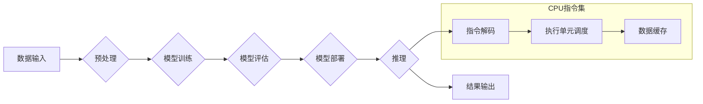

                 

## 无限vs有限：LLM和CPU指令集的较量

> 关键词：LLM, CPU指令集, 自然语言处理, 机器学习, 深度学习, 计算模型, 算法效率, 硬件架构

### 1. 背景介绍

近年来，人工智能（AI）领域取得了令人瞩目的进展，其中大型语言模型（LLM）的出现尤为引人注目。这些模型，例如GPT-3、LaMDA和BERT，展现出惊人的文本生成、理解和翻译能力，引发了人们对人工智能未来潜力的热烈讨论。与此同时，传统CPU指令集作为计算机处理的核心机制，在过去几十年中也经历了不断演进，追求更高的计算速度和效率。

然而，LLM和CPU指令集之间存在着本质的区别。LLM基于深度学习算法，通过海量文本数据训练，学习语言的复杂模式和结构。而CPU指令集则是一种有限的、预定义的指令集，通过执行这些指令来处理数据。这种差异导致了两种计算模型在处理方式、效率和应用场景上存在显著的差异。

本文将深入探讨LLM和CPU指令集之间的关系，分析其各自的优势和局限性，并展望未来发展趋势。

### 2. 核心概念与联系

#### 2.1 LLM

大型语言模型（LLM）是一种基于深度学习的统计模型，能够理解和生成人类语言。其核心原理是通过训练一个多层神经网络，学习语言的语法、语义和上下文关系。

LLM的训练过程通常涉及以下步骤：

1. **数据收集和预处理:** 收集大量文本数据，并进行清洗、分词、标记等预处理操作。
2. **模型构建:** 设计一个多层神经网络结构，例如Transformer，并选择合适的激活函数、损失函数等参数。
3. **模型训练:** 使用训练数据训练模型，通过反向传播算法不断调整模型参数，使其能够准确预测下一个词或句子。
4. **模型评估:** 使用测试数据评估模型的性能，例如准确率、困惑度等指标。
5. **模型部署:** 将训练好的模型部署到实际应用场景中，例如聊天机器人、文本生成、机器翻译等。

#### 2.2 CPU指令集

CPU指令集是计算机处理器执行指令的规范。它定义了一系列指令，每个指令对应一个特定的计算操作，例如加减乘除、逻辑运算、数据移动等。

CPU指令集的架构通常分为以下几个层次：

1. **指令集架构 (ISA):** 指示CPU可以执行的指令类型和格式。
2. **微架构:** 指示CPU内部如何执行指令，包括指令解码、执行单元调度、数据缓存等。
3. **寄存器文件:** 指示CPU内部存储数据的寄存器数量和结构。

#### 2.3 LLM与CPU指令集的联系

尽管LLM和CPU指令集在本质上存在差异，但它们在实际应用中是相互关联的。

LLM的训练和推理过程都需要大量的计算资源，而CPU指令集是实现这些计算的底层机制。

LLM的模型参数需要存储在内存中，CPU指令集负责数据访问和内存管理。

LLM的推理过程需要执行大量的数学运算，CPU指令集负责执行这些运算。

**Mermaid 流程图**



### 3. 核心算法原理 & 具体操作步骤

#### 3.1 算法原理概述

LLM的核心算法是基于深度学习的Transformer模型。Transformer模型利用自注意力机制，能够捕捉文本序列中长距离依赖关系，从而实现更准确的语言理解和生成。

#### 3.2 算法步骤详解

1. **词嵌入:** 将每个词转换为一个向量表示，捕捉词的语义信息。
2. **自注意力机制:** 计算每个词与其他词之间的注意力权重，捕捉词之间的关系。
3. **多头注意力:** 使用多个自注意力层，从不同的角度捕捉词之间的关系。
4. **前馈神经网络:** 对每个词的注意力输出进行进一步处理，提取更深层的语义信息。
5. **位置编码:** 将词的顺序信息编码到词向量中，保证模型能够理解文本的顺序关系。
6. **解码器:** 使用循环神经网络或Transformer解码器，根据输入序列生成目标序列。

#### 3.3 算法优缺点

**优点:**

* 能够捕捉长距离依赖关系，实现更准确的语言理解和生成。
* 训练效率高，能够在海量数据上进行训练。
* 可迁移性强，能够应用于多种自然语言处理任务。

**缺点:**

* 计算资源需求高，训练和推理过程需要大量的计算能力。
* 模型参数量大，需要大量的存储空间。
* 训练数据对模型性能影响较大，需要高质量的训练数据。

#### 3.4 算法应用领域

LLM在自然语言处理领域具有广泛的应用场景，例如：

* **文本生成:** 自动生成文章、故事、诗歌等文本。
* **机器翻译:** 将一种语言翻译成另一种语言。
* **聊天机器人:** 与人类进行自然语言对话。
* **问答系统:** 回答用户提出的问题。
* **文本摘要:** 生成文本的简短摘要。

### 4. 数学模型和公式 & 详细讲解 & 举例说明

#### 4.1 数学模型构建

LLM的数学模型主要基于概率论和统计学。其核心目标是学习一个概率分布，该分布能够描述文本序列的生成概率。

#### 4.2 公式推导过程

LLM的训练过程通常使用最大似然估计（MLE）方法，其目标是最大化模型在训练数据上的似然概率。

假设训练数据为一个文本序列 $x = (x_1, x_2, ..., x_T)$，其中 $x_i$ 表示第 $i$ 个词。LLM的目标是学习一个参数向量 $\theta$，使得模型能够最大化以下似然概率：

$$
P(x; \theta) = \prod_{i=1}^{T} P(x_i | x_{1:i-1}; \theta)
$$

其中，$P(x_i | x_{1:i-1}; \theta)$ 表示给定前 $i-1$ 个词的情况下，第 $i$ 个词的生成概率。

#### 4.3 案例分析与讲解

例如，在训练一个简单的文本生成模型时，我们可以使用一个简单的词典模型。该模型将每个词映射到一个概率向量，该向量表示该词在文本序列中出现的概率。

假设我们有一个词典包含以下词语：

* "the"
* "quick"
* "brown"
* "fox"

我们可以为每个词语分配一个概率向量，例如：

* "the": [0.2, 0.1, 0.3, 0.4]
* "quick": [0.1, 0.3, 0.2, 0.4]
* "brown": [0.4, 0.1, 0.3, 0.2]
* "fox": [0.3, 0.2, 0.1, 0.4]

当我们输入一个词语，例如 "the" 时，模型会根据该词语的概率向量生成下一个词语的概率分布。

### 5. 项目实践：代码实例和详细解释说明

#### 5.1 开发环境搭建

LLM的开发环境通常需要安装Python和相关的深度学习框架，例如TensorFlow或PyTorch。

#### 5.2 源代码详细实现

以下是一个使用PyTorch实现简单的LLM文本生成模型的代码示例：

```python
import torch
import torch.nn as nn

class SimpleLLM(nn.Module):
    def __init__(self, vocab_size, embedding_dim, hidden_dim):
        super(SimpleLLM, self).__init__()
        self.embedding = nn.Embedding(vocab_size, embedding_dim)
        self.lstm = nn.LSTM(embedding_dim, hidden_dim)
        self.fc = nn.Linear(hidden_dim, vocab_size)

    def forward(self, x):
        embedded = self.embedding(x)
        output, (hidden, cell) = self.lstm(embedded)
        output = self.fc(output[:, -1, :])
        return output

# 实例化模型
model = SimpleLLM(vocab_size=10000, embedding_dim=128, hidden_dim=256)

# 定义损失函数和优化器
criterion = nn.CrossEntropyLoss()
optimizer = torch.optim.Adam(model.parameters())

# 训练模型
for epoch in range(num_epochs):
    # ...
```

#### 5.3 代码解读与分析

该代码实现了一个简单的LLM文本生成模型，其结构包括嵌入层、LSTM层和全连接层。

* 嵌入层将每个词语映射到一个向量表示。
* LSTM层捕捉文本序列中的长距离依赖关系。
* 全连接层将LSTM层的输出映射到词语的概率分布。

#### 5.4 运行结果展示

训练完成后，模型能够根据输入的文本序列生成下一个词语。

### 6. 实际应用场景

LLM在各个领域都有着广泛的应用场景，例如：

#### 6.1 文本生成

* **自动写作:** 生成新闻报道、产品描述、广告文案等文本。
* **创意写作:** 生成诗歌、小说、剧本等创意内容。
* **代码生成:** 根据自然语言描述生成代码。

#### 6.2 机器翻译

* **跨语言沟通:** 实现不同语言之间的文本翻译。
* **多语言内容创作:** 将内容翻译成多种语言，扩大受众范围。

#### 6.3 聊天机器人

* **智能客服:** 自动回复用户咨询，提高服务效率。
* **陪伴型机器人:** 与用户进行自然语言对话，提供情感支持。

#### 6.4 其他应用场景

* **问答系统:** 回答用户提出的问题，提供信息查询服务。
* **文本摘要:** 生成文本的简短摘要，节省阅读时间。
* **情感分析:** 分析文本的情感倾向，用于市场调研、用户反馈分析等。

#### 6.5 未来应用展望

随着LLM技术的不断发展，其应用场景将更加广泛，例如：

* **个性化教育:** 根据学生的学习情况生成个性化的学习内容。
* **医疗诊断:** 辅助医生进行疾病诊断，提高诊断准确率。
* **科学研究:** 自动生成研究论文、分析实验数据等。

### 7. 工具和资源推荐

#### 7.1 学习资源推荐

* **书籍:**
    * 《深度学习》 by Ian Goodfellow, Yoshua Bengio, and Aaron Courville
    * 《自然语言处理》 by Dan Jurafsky and James H. Martin
* **在线课程:**
    * Coursera: Natural Language Processing Specialization
    * Stanford CS224N: Natural Language Processing with Deep Learning
* **博客和网站:**
    * The Gradient
    * Towards Data Science
    * OpenAI Blog

#### 7.2 开发工具推荐

* **深度学习框架:** TensorFlow, PyTorch, JAX
* **自然语言处理库:** NLTK, SpaCy, Hugging Face Transformers
* **云计算平台:** AWS, Google Cloud, Azure

#### 7.3 相关论文推荐

* **Attention Is All You Need** by Vaswani et al. (2017)
* **BERT: Pre-training of Deep Bidirectional Transformers for Language Understanding** by Devlin et al. (2018)
* **GPT-3: Language Models are Few-Shot Learners** by Brown et al. (2020)

### 8. 总结：未来发展趋势与挑战

#### 8.1 研究成果总结

近年来，LLM取得了显著的进展，在文本生成、机器翻译、问答系统等领域展现出强大的能力。

#### 8.2 未来发展趋势

* **模型规模和能力的提升:** 随着计算资源的不断发展，LLM模型规模将继续扩大，能力将进一步提升。
* **多模态LLM的开发:** 将文本、图像、音频等多种模态信息融合到LLM中，实现更全面的理解和生成能力。
* **可解释性和安全性:** 研究LLM的决策机制，提高模型的可解释性和安全性。

#### 8.3 面临的挑战

* **数据获取和标注:** 训练高性能LLM需要海量高质量的数据，数据获取和标注成本较高。
* **计算资源需求:** 训练和推理大型LLM需要大量的计算资源，成本高昂。
* **伦理和社会影响:** LLM的应用可能带来伦理和社会问题，例如信息操纵、隐私泄露等，需要谨慎考虑。

#### 8.4 研究展望

未来，LLM研究将继续朝着更强大、更安全、更可解释的方向发展，为人类社会带来更多福祉。

### 9. 附录：常见问题与解答

#### 9.1 什么是LLM？

LLM是指大型语言模型，是一种基于深度学习的统计模型，能够理解和生成人类语言。

#### 9.2 LLM的训练数据是什么？

LLM的训练数据通常是海量文本数据，例如书籍、文章、网站内容等。

#### 9.3 LLM的应用场景有哪些？

LLM在各个领域都有着广泛的应用场景，例如文本生成、机器翻译、聊天机器人等。

#### 9.4 如何训练一个LLM？

训练一个LLM需要大量的计算资源和专业知识，通常需要使用深度学习框架和大量的训练数据。

#### 9.5 LLM的未来发展趋势是什么？

LLM的未来发展趋势是模型规模和能力的提升、多模态LLM的开发、可解释性和安全性。


作者：禅与计算机程序设计艺术 / Zen and the Art of Computer Programming<end_of_turn>

