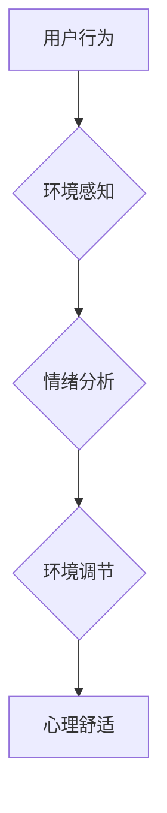

                 

## 智能家居心理舒适创业：情绪调节的居住环境

> 关键词：智能家居、情绪调节、心理舒适、环境感知、机器学习、自然语言处理、人机交互

## 1. 背景介绍

随着科技的飞速发展，智能家居已成为现代生活的重要组成部分。智能家居不仅能够提升生活便利性，更重要的是，它有潜力为人们创造更加舒适、健康、愉悦的生活体验。而“心理舒适”作为一种重要的体验维度，在智能家居的发展中显得尤为重要。

传统智能家居主要关注功能性，例如远程控制、自动化场景等。然而，人们对居住环境的需求不仅仅是功能上的满足，更重要的是情感上的共鸣和精神上的放松。一个能够感知和理解用户情绪，并根据用户需求进行环境调节的智能家居，将能够为用户提供更加个性化、人性化的体验，从而提升用户的生活质量和幸福感。

## 2. 核心概念与联系

### 2.1 心理舒适与智能家居

心理舒适是指人在环境中感受到身心愉悦、放松、安全和满足的状态。它是一个多维度的概念，涉及到人的生理、心理、社会等多个方面。

智能家居可以通过感知用户行为、环境变化以及生理信号，并根据这些信息进行智能调节，从而营造出更加符合用户心理需求的环境。例如，当用户感到疲劳时，智能家居可以自动调节灯光亮度、温度和音乐播放，帮助用户放松身心；当用户感到焦虑时，智能家居可以播放舒缓的音乐、打开窗帘让自然光照射进来，帮助用户缓解压力。

### 2.2 核心概念架构



**环境感知:** 通过传感器收集用户行为、环境温度、湿度、光照等数据。

**情绪分析:** 利用机器学习算法和自然语言处理技术，分析用户语音、文本、表情等信息，识别用户的情绪状态。

**环境调节:** 根据用户情绪状态，智能调节灯光、温度、音乐、香氛等环境因素，营造符合用户心理需求的环境。

**心理舒适:** 用户在智能家居环境中感受到身心愉悦、放松、安全和满足的状态。

## 3. 核心算法原理 & 具体操作步骤

### 3.1 算法原理概述

情绪调节智能家居的核心算法主要包括以下几个方面：

* **环境感知算法:** 用于收集和分析用户行为、环境变化等数据。
* **情绪识别算法:** 用于识别用户的情绪状态。
* **环境调节算法:** 用于根据用户情绪状态，智能调节环境因素。

这些算法通常基于机器学习和深度学习技术，通过训练大量的样本数据，学习到用户情绪与环境因素之间的关系，从而实现智能调节。

### 3.2 算法步骤详解

**1. 环境数据采集:**

* 使用传感器收集用户行为数据，例如：用户在房间内移动轨迹、停留时间、使用电器频率等。
* 使用环境传感器收集环境数据，例如：温度、湿度、光照强度、空气质量等。

**2. 数据预处理:**

* 对采集到的数据进行清洗、去噪、归一化等处理，去除无效数据和噪声，保证数据质量。

**3. 情绪识别模型训练:**

* 选择合适的深度学习模型，例如：卷积神经网络（CNN）、循环神经网络（RNN）等，用于训练情绪识别模型。
* 使用标注好的用户语音、文本、表情等数据进行模型训练，学习到用户情绪与特征之间的映射关系。

**4. 环境调节模型训练:**

* 选择合适的机器学习算法，例如：决策树、支持向量机（SVM）、神经网络等，用于训练环境调节模型。
* 使用训练好的情绪识别模型和环境数据，训练环境调节模型，学习到不同情绪状态下，应该如何调节环境因素。

**5. 环境调节执行:**

* 根据用户的情绪状态，环境调节模型输出相应的环境调节指令，例如：调节灯光亮度、温度、音乐播放等。
* 智能家居设备根据指令执行环境调节，营造符合用户心理需求的环境。

### 3.3 算法优缺点

**优点:**

* **个性化体验:** 根据用户情绪状态进行环境调节，提供更加个性化、人性化的体验。
* **提升生活质量:** 营造舒适、愉悦的居住环境，提升用户的生活质量和幸福感。
* **健康管理:** 通过环境调节，帮助用户缓解压力、改善睡眠、提升身心健康。

**缺点:**

* **数据隐私:** 需要收集和分析用户情绪数据，存在数据隐私安全问题。
* **算法准确性:** 情绪识别算法的准确性仍然存在一定局限性，可能导致环境调节不准确。
* **成本较高:** 需要部署复杂的传感器和算法模型，成本较高。

### 3.4 算法应用领域

* **智能家居:** 营造舒适、愉悦的居住环境，提升生活质量。
* **医疗保健:** 帮助患者缓解压力、改善睡眠、促进康复。
* **教育培训:** 营造更加专注、高效的学习环境。
* **商业零售:** 提升顾客体验，促进消费。

## 4. 数学模型和公式 & 详细讲解 & 举例说明

### 4.1 数学模型构建

情绪调节智能家居的数学模型可以基于用户情绪状态和环境因素之间的关系进行构建。例如，我们可以使用以下公式来描述用户情绪状态与灯光亮度之间的关系：

$$
E = f(L, T, A)
$$

其中：

* $E$ 表示用户情绪状态，可以采用数值表示，例如：1-10分，1表示非常负面情绪，10表示非常正面情绪。
* $L$ 表示灯光亮度，可以采用数值表示，例如：0-100，0表示完全黑暗，100表示完全亮。
* $T$ 表示环境温度，可以采用数值表示，例如：15-30摄氏度。
* $A$ 表示其他环境因素，例如：空气质量、音乐播放等。
* $f$ 表示一个非线性函数，描述用户情绪状态与环境因素之间的复杂关系。

### 4.2 公式推导过程

为了构建 $f$ 函数，我们可以使用机器学习算法对大量用户情绪数据和环境数据进行训练。例如，我们可以使用回归算法，将用户情绪状态作为目标变量，将灯光亮度、环境温度、其他环境因素作为特征变量，训练出一个能够预测用户情绪状态的模型。

### 4.3 案例分析与讲解

假设我们训练了一个回归模型，并得到以下结果：

$$
E = 0.2L + 0.5T - 0.1A + 5
$$

这个公式表示，灯光亮度对用户情绪状态的影响最大，其次是环境温度，最后是其他环境因素。

例如，当灯光亮度为50，环境温度为25，其他环境因素为0时，用户情绪状态可以预测为：

$$
E = 0.2 * 50 + 0.5 * 25 - 0.1 * 0 + 5 = 10 + 12.5 + 5 = 27.5
$$

由于情绪状态的数值范围为1-10，所以这个结果需要进行归一化处理，例如：将27.5归一化为10分。

## 5. 项目实践：代码实例和详细解释说明

### 5.1 开发环境搭建

* 操作系统：Windows/macOS/Linux
* 编程语言：Python
* 开发工具：VS Code/PyCharm
* 库依赖：TensorFlow/PyTorch、NumPy、pandas、OpenCV

### 5.2 源代码详细实现

```python
# 情绪识别模型训练代码示例

import tensorflow as tf
from tensorflow.keras.models import Sequential
from tensorflow.keras.layers import Conv2D, MaxPooling2D, Flatten, Dense

# 加载情绪识别数据集
(x_train, y_train), (x_test, y_test) = load_dataset()

# 定义情绪识别模型
model = Sequential()
model.add(Conv2D(32, (3, 3), activation='relu', input_shape=x_train.shape[1:]))
model.add(MaxPooling2D((2, 2)))
model.add(Conv2D(64, (3, 3), activation='relu'))
model.add(MaxPooling2D((2, 2)))
model.add(Flatten())
model.add(Dense(10, activation='softmax'))

# 编译模型
model.compile(optimizer='adam',
              loss='sparse_categorical_crossentropy',
              metrics=['accuracy'])

# 训练模型
model.fit(x_train, y_train, epochs=10, batch_size=32)

# 评估模型
loss, accuracy = model.evaluate(x_test, y_test)
print('Test loss:', loss)
print('Test accuracy:', accuracy)
```

### 5.3 代码解读与分析

* 该代码示例展示了情绪识别模型的训练过程。
* 使用 TensorFlow 库构建了一个卷积神经网络模型，用于识别用户的情绪状态。
* 模型输入是用户表情图像，输出是用户情绪类别。
* 使用 Adam 优化器和交叉熵损失函数进行模型训练。
* 训练完成后，使用测试集评估模型的性能。

### 5.4 运行结果展示

运行结果会显示模型在测试集上的损失值和准确率。

## 6. 实际应用场景

### 6.1 智能家居场景

* **情绪感知灯光:** 根据用户情绪状态，智能调节灯光亮度和色温，营造舒适、愉悦的氛围。
* **智能音乐播放:** 根据用户情绪状态，播放舒缓、欢快或激昂的音乐，帮助用户放松、提升情绪或增强活力。
* **智能温度调节:** 根据用户情绪状态，智能调节室内温度，帮助用户保持舒适体感。
* **智能香氛释放:** 根据用户情绪状态，释放不同香味的香氛，帮助用户放松、提神或提升专注力。

### 6.2 其他应用场景

* **医疗保健:** 帮助患者缓解压力、焦虑和抑郁情绪，促进康复。
* **教育培训:** 营造更加专注、高效的学习环境，提升学习效率。
* **商业零售:** 根据顾客情绪状态，提供个性化的商品推荐和服务，提升顾客体验。

### 6.4 未来应用展望

随着人工智能技术的不断发展，情绪调节智能家居将拥有更加广泛的应用场景。例如：

* **更精准的情绪识别:** 利用更先进的机器学习算法和传感器技术，实现更加精准的情绪识别。
* **更个性化的环境调节:** 根据用户的个人喜好和需求，提供更加个性化的环境调节方案。
* **更智能的交互方式:** 利用自然语言处理和语音识别技术，实现更加智能、便捷的人机交互。
* **更广泛的应用场景:** 将情绪调节智能家居技术应用于更多领域，例如：交通、娱乐、金融等。

## 7. 工具和资源推荐

### 7.1 学习资源推荐

* **书籍:**
    * 《深度学习》
    * 《机器学习》
    * 《自然语言处理》
* **在线课程:**
    * Coursera
    * edX
    * Udacity

### 7.2 开发工具推荐

* **编程语言:** Python
* **机器学习库:** TensorFlow, PyTorch
* **数据处理库:** NumPy, pandas
* **图像处理库:** OpenCV

### 7.3 相关论文推荐

* **ACL:** Association for Computational Linguistics
* **ICML:** International Conference on Machine Learning
* **NeurIPS:** Neural Information Processing Systems

## 8. 总结：未来发展趋势与挑战

### 8.1 研究成果总结

情绪调节智能家居是一个新兴的领域，近年来取得了显著的进展。

* **情绪识别技术:** 随着深度学习技术的不断发展，情绪识别技术的准确率不断提高。
* **环境调节技术:** 越来越多的智能家居设备能够根据用户需求进行环境调节。
* **人机交互技术:** 自然语言处理和语音识别技术的发展，使得人机交互更加智能、便捷。

### 8.2 未来发展趋势

* **更精准的情绪识别:** 利用多模态数据（例如：语音、文本、表情、生理信号）进行情绪识别，提高识别准确率。
* **更个性化的环境调节:** 基于用户的个人喜好和需求，提供更加个性化的环境调节方案。
* **更智能的交互方式:** 利用自然语言处理和语音识别技术，实现更加智能、便捷的人机交互。
* **更广泛的应用场景:** 将情绪调节智能家居技术应用于更多领域，例如：医疗保健、教育培训、商业零售等。

### 8.3 面临的挑战

* **数据隐私:** 情绪识别需要收集和分析用户情绪数据，存在数据隐私安全问题。
* **算法准确性:** 情绪识别算法的准确性仍然存在一定局限性，可能导致环境调节不准确。
* **成本较高:** 需要部署复杂的传感器和算法模型，成本较高。

### 8.4 研究展望

未来，情绪调节智能家居将朝着更加智能、个性化、安全的方向发展。

* 研究更隐私保护的机器学习算法，保障用户数据安全。
* 研究更鲁棒、更准确的情绪识别算法，提高环境调节的准确性。
* 研究更低成本、更易部署的智能家居解决方案，降低用户使用门槛。


## 9. 附录：常见问题与解答

**1. 如何保证用户数据隐私安全？**

* 使用加密技术保护用户数据，防止数据泄露。
* 采用匿名化技术，将用户数据脱敏处理，保护用户隐私。
* 明确用户数据使用协议，获得用户同意后方可使用数据。

**2. 如何提高情绪识别算法的准确性？**

* 使用更丰富的训练数据，包括不同年龄、性别、文化背景的用户情绪数据。
* 研究更先进的情绪识别算法，例如：基于深度学习的算法。
* 结合多模态数据进行情绪识别，例如：语音、文本、表情、生理信号等。

**3. 如何降低智能家居的成本？**

* 使用更低成本的传感器和算法模型。
* 采用云计算技术，降低硬件成本。
* 开发开源的智能家居解决方案，降低开发成本。


作者：禅与计算机程序设计艺术 / Zen and the Art of Computer Programming<end_of_turn>

