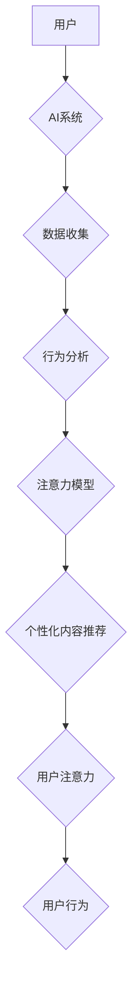

                 

## 注意力劫持：AI时代的心理操纵

> 关键词：人工智能、注意力机制、深度学习、心理操纵、信息茧房、算法偏见、伦理困境

## 1. 背景介绍

在信息爆炸的时代，我们每天都被海量信息所包围。从社交媒体的推送，到搜索引擎的结果，再到个性化推荐，都试图抓住我们的注意力，引导我们的行为。而人工智能（AI）技术的快速发展，则进一步加剧了这一趋势。AI算法能够精准地分析我们的行为模式，预测我们的兴趣，并针对性地推送内容，从而实现对我们注意力的精准操控。

这种对注意力的操控，并非仅仅是商业广告的营销手段，它已经渗透到生活的方方面面，甚至可能对我们的认知、价值观和行为产生深远的影响。

## 2. 核心概念与联系

### 2.1 注意力机制

注意力机制是深度学习领域的重要发展方向，它模拟了人类大脑在处理信息时，会选择性地关注某些信息，而忽略其他信息的机制。在深度学习模型中，注意力机制可以帮助模型更好地理解上下文信息，提高预测精度。

### 2.2  心理操纵

心理操纵是指利用心理学原理和技巧，以达到控制他人的思想、行为或情感的目的。在AI时代，注意力机制被应用于心理操纵，可以更精准地识别和操控用户的注意力，从而达到更深层次的心理影响。

### 2.3  AI时代的心理操纵

AI时代的心理操纵，是指利用AI技术，特别是注意力机制，对用户的注意力进行精准操控，从而影响用户的认知、行为和情感。

**Mermaid 流程图**



## 3. 核心算法原理 & 具体操作步骤

### 3.1  算法原理概述

注意力机制的核心原理是学习一个“注意力权重”，用来衡量模型对不同输入元素的关注程度。这些权重可以动态调整，根据输入序列的不同位置和上下文信息，选择性地关注重要的信息。

常见的注意力机制类型包括：

* **自注意力机制 (Self-Attention):**  模型关注自身输入序列中的不同元素，捕捉序列之间的关系。
* **交叉注意力机制 (Cross-Attention):** 模型关注两个不同序列之间的关系，例如文本和图像之间的关系。

### 3.2  算法步骤详解

1. **输入数据:** 将输入序列（例如文本、图像等）转换为模型可处理的格式。
2. **编码器:** 使用编码器网络将输入序列编码成一个固定长度的向量表示。
3. **注意力计算:** 计算每个元素对其他元素的注意力权重。
4. **加权求和:** 根据注意力权重，对编码后的向量进行加权求和，得到最终的输出表示。

### 3.3  算法优缺点

**优点:**

* 能够捕捉序列中的长距离依赖关系。
* 能够学习到不同元素之间的重要关系。
* 在许多自然语言处理任务中取得了优异的性能。

**缺点:**

* 计算复杂度较高。
* 训练数据量较大。
* 容易受到噪声数据的影响。

### 3.4  算法应用领域

注意力机制在自然语言处理、计算机视觉、语音识别等领域都有广泛的应用，例如：

* **机器翻译:** 捕捉源语言和目标语言之间的语义关系。
* **文本摘要:**  识别文本中最关键的信息。
* **图像识别:**  关注图像中最重要的区域。

## 4. 数学模型和公式 & 详细讲解 & 举例说明

### 4.1  数学模型构建

注意力机制的核心是计算每个元素对其他元素的注意力权重。常用的注意力机制模型是基于softmax函数的注意力机制。

**公式:**

$$
\text{Attention}(Q, K, V) = \text{softmax}\left(\frac{Q K^T}{\sqrt{d_k}}\right) V
$$

其中：

* $Q$：查询矩阵，表示需要关注的元素。
* $K$：键矩阵，表示所有元素的特征表示。
* $V$：值矩阵，表示所有元素的实际值。
* $d_k$：键向量的维度。

### 4.2  公式推导过程

softmax函数的作用是将输入向量转换为概率分布，每个元素的权重代表其被关注的程度。

**softmax函数公式:**

$$
\text{softmax}(x_i) = \frac{e^{x_i}}{\sum_{j=1}^{n} e^{x_j}}
$$

其中：

* $x_i$：输入向量的第i个元素。
* $n$：输入向量的维度。

### 4.3  案例分析与讲解

假设我们有一个句子：“我爱吃苹果”。我们想要使用注意力机制来找出句子中最重要的词语。

我们可以将句子中的每个词语作为输入元素，并将其编码成向量表示。然后，我们可以使用注意力机制计算每个词语对其他词语的注意力权重。

最终，注意力权重最高的词语就是句子中最重要的词语，在这个例子中，可能是“爱”或“苹果”。

## 5. 项目实践：代码实例和详细解释说明

### 5.1  开发环境搭建

* Python 3.6+
* TensorFlow 2.0+
* PyTorch 1.0+

### 5.2  源代码详细实现

```python
import tensorflow as tf

# 定义注意力机制层
class AttentionLayer(tf.keras.layers.Layer):
    def __init__(self, units):
        super(AttentionLayer, self).__init__()
        self.Wq = tf.keras.layers.Dense(units)
        self.Wk = tf.keras.layers.Dense(units)
        self.Wv = tf.keras.layers.Dense(units)
        self.fc = tf.keras.layers.Dense(units)

    def call(self, inputs):
        Q = self.Wq(inputs)
        K = self.Wk(inputs)
        V = self.Wv(inputs)
        attention_scores = tf.matmul(Q, K, transpose_b=True) / tf.math.sqrt(tf.cast(tf.shape(Q)[-1], tf.float32))
        attention_weights = tf.nn.softmax(attention_scores, axis=-1)
        output = tf.matmul(attention_weights, V)
        return self.fc(output)

# 定义模型
model = tf.keras.Sequential([
    tf.keras.layers.Embedding(input_dim=10000, output_dim=128),
    AttentionLayer(128),
    tf.keras.layers.Dense(10, activation='softmax')
])

# 训练模型
model.compile(optimizer='adam', loss='sparse_categorical_crossentropy', metrics=['accuracy'])
model.fit(x_train, y_train, epochs=10)
```

### 5.3  代码解读与分析

* 首先，我们定义了一个注意力机制层 `AttentionLayer`，它包含三个稠密层 `Wq`、`Wk` 和 `Wv`，用于分别计算查询、键和值矩阵。
* 然后，我们使用 `tf.matmul` 函数计算查询矩阵和键矩阵的点积，并进行归一化处理。
* 接着，我们使用 `tf.nn.softmax` 函数将点积结果转换为注意力权重。
* 最后，我们使用注意力权重对值矩阵进行加权求和，得到最终的输出表示。
* 我们定义了一个简单的模型，它包含一个嵌入层、一个注意力机制层和一个全连接层。
* 我们使用 `tf.keras.layers.Embedding` 将词语转换为向量表示。
* 我们使用 `AttentionLayer` 计算每个词语对其他词语的注意力权重。
* 我们使用 `tf.keras.layers.Dense` 将注意力权重后的向量表示转换为最终的输出。

### 5.4  运行结果展示

训练完成后，我们可以使用模型对新的文本进行预测。例如，我们可以输入句子“我爱吃香蕉”，模型会输出一个概率分布，表示每个词语被预测为目标词语的概率。

## 6. 实际应用场景

### 6.1  个性化推荐系统

注意力机制可以帮助推荐系统更好地理解用户的兴趣，并推荐更个性化的内容。例如，电商平台可以利用注意力机制分析用户的浏览历史和购买记录，推荐更符合用户需求的商品。

### 6.2  搜索引擎优化

注意力机制可以帮助搜索引擎更好地理解用户的搜索意图，并返回更相关的搜索结果。例如，搜索引擎可以利用注意力机制分析用户的搜索词和点击历史，识别用户的潜在需求，并推荐更精准的搜索结果。

### 6.3  广告投放

注意力机制可以帮助广告平台更精准地投放广告，提高广告的点击率和转化率。例如，广告平台可以利用注意力机制分析用户的兴趣和行为，精准地推送相关的广告。

### 6.4  未来应用展望

随着人工智能技术的不断发展，注意力机制将在更多领域得到应用，例如：

* **医疗诊断:** 利用注意力机制分析患者的病历和影像数据，辅助医生进行诊断。
* **教育教学:** 利用注意力机制个性化教学内容，提高学生的学习效率。
* **金融风险控制:** 利用注意力机制分析金融数据的异常行为，降低金融风险。

## 7. 工具和资源推荐

### 7.1  学习资源推荐

* **书籍:**
    * 《深度学习》
    * 《Attention Is All You Need》
* **在线课程:**
    * Coursera: 深度学习
    * Udacity: 自然语言处理

### 7.2  开发工具推荐

* **TensorFlow:** 开源深度学习框架
* **PyTorch:** 开源深度学习框架
* **Keras:** 高级深度学习API

### 7.3  相关论文推荐

* 《Attention Is All You Need》
* 《BERT: Pre-training of Deep Bidirectional Transformers for Language Understanding》
* 《Transformer-XL: Attentive Language Models Beyond a Fixed-Length Context》

## 8. 总结：未来发展趋势与挑战

### 8.1  研究成果总结

注意力机制是深度学习领域的重要发展方向，它在许多自然语言处理任务中取得了优异的性能。

### 8.2  未来发展趋势

* **更强大的注意力机制:** 研究更强大的注意力机制，例如长距离依赖关系的注意力机制、多模态注意力机制等。
* **注意力机制的应用扩展:** 将注意力机制应用到更多领域，例如医疗诊断、教育教学、金融风险控制等。
* **注意力机制的解释性:** 研究注意力机制的解释性，使其更易于理解和应用。

### 8.3  面临的挑战

* **计算复杂度:** 传统的注意力机制计算复杂度较高，难以应用于大规模数据。
* **训练数据量:** 训练注意力机制模型需要大量的训练数据。
* **算法偏见:** 注意力机制模型容易受到训练数据中的偏见影响。

### 8.4  研究展望

未来，注意力机制的研究将继续深入，并取得更多突破。我们期待看到更强大的注意力机制模型，以及注意力机制在更多领域应用的场景。

## 9. 附录：常见问题与解答

**Q1: 注意力机制和循环神经网络 (RNN) 的区别是什么？**

**A1:** RNN 可以处理序列数据，但其处理长距离依赖关系的能力有限。注意力机制可以更好地捕捉序列中的长距离依赖关系。

**Q2: 注意力机制的训练方法是什么？**

**A2:** 注意力机制通常使用反向传播算法进行训练。

**Q3: 注意力机制的应用场景有哪些？**

**A3:** 注意力机制的应用场景非常广泛，例如机器翻译、文本摘要、图像识别、语音识别等。


作者：禅与计算机程序设计艺术 / Zen and the Art of Computer Programming 
<end_of_turn>

