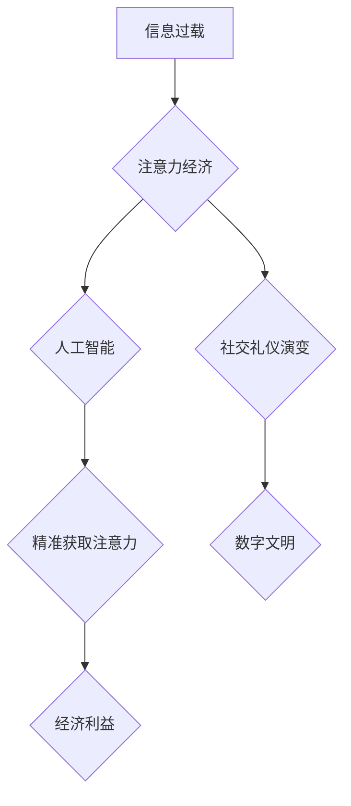

                 

## 注意力经济与个人社交礼仪的演变

> 关键词：注意力经济、社交礼仪、人工智能、深度学习、信息过载、人机交互、数字文明

### 1. 背景介绍

在当今信息爆炸的时代，我们每个人都被无休止的数字信息所包围。从智能手机推送的通知到社交媒体的动态更新，从电子邮件的轰炸到网络广告的追踪，信息无处不在，争夺着我们的注意力。这种状态被称为“注意力经济”，它深刻地改变了我们的生活方式，也对个人社交礼仪提出了新的挑战。

传统的社交礼仪，例如面带微笑、眼神交流、耐心倾听等，在数字世界中显得有些格格不入。在网络社交平台上，文字和表情符号成为了主要的沟通方式，而虚拟身份和匿名性也使得人们更容易忽略社交礼仪的规范。

随着人工智能技术的快速发展，深度学习算法能够精准地分析用户行为，预测用户的兴趣和需求，从而更加有效地获取用户的注意力。这使得注意力经济更加复杂，也更加难以掌控。

### 2. 核心概念与联系

#### 2.1 注意力经济

注意力经济是指在信息过载的时代，人们对信息的筛选和选择成为一种稀缺资源，而能够有效获取和利用用户注意力的企业和产品能够获得更大的经济利益。

#### 2.2 社交礼仪

社交礼仪是指在社会交往中，人们遵循的规范和准则，以维护良好的社会秩序和人际关系。

#### 2.3 人工智能与注意力

人工智能，特别是深度学习算法，能够通过分析用户行为数据，预测用户的兴趣和需求，从而更加精准地获取用户的注意力。

**Mermaid 流程图：**



### 3. 核心算法原理 & 具体操作步骤

#### 3.1 算法原理概述

获取用户注意力的核心算法通常基于深度学习，例如：

* **推荐算法:** 通过分析用户的历史行为数据，预测用户可能感兴趣的内容，并将其推荐给用户。
* **个性化算法:** 根据用户的个人特征和偏好，定制个性化的内容和体验。
* **内容分发算法:** 根据内容的主题、标签、作者等信息，将内容分发给合适的用户。

#### 3.2 算法步骤详解

1. **数据收集:** 收集用户的行为数据，例如浏览记录、点击记录、点赞记录、评论记录等。
2. **数据预处理:** 对收集到的数据进行清洗、转换和格式化，使其能够被算法模型所使用。
3. **模型训练:** 使用深度学习算法训练模型，学习用户行为模式和偏好。
4. **模型评估:** 使用测试数据评估模型的性能，并进行调整和优化。
5. **模型部署:** 将训练好的模型部署到生产环境中，用于实时获取用户注意力。

#### 3.3 算法优缺点

**优点:**

* **精准度高:** 深度学习算法能够学习到复杂的模式和关系，从而实现更加精准的用户画像和内容推荐。
* **效率高:** 深度学习算法能够并行处理海量数据，提高了获取用户注意力的效率。
* **可扩展性强:** 深度学习算法能够根据数据量的增加进行自动调整，具有良好的可扩展性。

**缺点:**

* **数据依赖性强:** 深度学习算法需要大量的训练数据，否则模型的性能会下降。
* **黑盒效应:** 深度学习模型的内部机制较为复杂，难以解释其决策过程，这可能会导致算法的不可信赖性。
* **伦理问题:** 深度学习算法可能会被用于操纵用户行为，例如利用用户的心理弱点进行精准营销，这引发了伦理方面的担忧。

#### 3.4 算法应用领域

* **社交媒体:** 推送个性化推荐、精准广告投放。
* **电商平台:** 推荐商品、个性化购物体验。
* **内容平台:** 推送个性化内容、推荐相关文章。
* **游戏行业:** 个性化游戏体验、精准游戏推荐。

### 4. 数学模型和公式 & 详细讲解 & 举例说明

#### 4.1 数学模型构建

注意力机制的数学模型通常基于概率论和信息论，例如：

* **Softmax 函数:** 用于将多个候选项的得分转换为概率分布，选择最优的候选项。

$$
P(i) = \frac{exp(s_i)}{\sum_{j=1}^{N} exp(s_j)}
$$

其中：

* $P(i)$ 是候选项 $i$ 的概率。
* $s_i$ 是候选项 $i$ 的得分。
* $N$ 是候选项的总数。

* **注意力权重:** 用于衡量不同候选项的重要性，分配不同的注意力资源。

$$
a_i = \frac{exp(e_i)}{\sum_{j=1}^{N} exp(e_j)}
$$

其中：

* $a_i$ 是候选项 $i$ 的注意力权重。
* $e_i$ 是候选项 $i$ 的注意力得分。

#### 4.2 公式推导过程

注意力机制的公式推导过程通常基于以下原理：

* **最大化信息增益:** 选择能够最大化信息增益的候选项。
* **分配注意力资源:** 根据候选项的重要性分配不同的注意力资源。

#### 4.3 案例分析与讲解

例如，在机器翻译任务中，注意力机制可以帮助模型关注源语言中与目标语言相关的重要词语，从而提高翻译的准确性。

### 5. 项目实践：代码实例和详细解释说明

#### 5.1 开发环境搭建

* Python 3.x
* TensorFlow 或 PyTorch 深度学习框架
* Jupyter Notebook 或 VS Code 代码编辑器

#### 5.2 源代码详细实现

```python
import tensorflow as tf

# 定义注意力机制层
class AttentionLayer(tf.keras.layers.Layer):
    def __init__(self, units):
        super(AttentionLayer, self).__init__()
        self.W1 = tf.keras.layers.Dense(units)
        self.W2 = tf.keras.layers.Dense(units)
        self.V = tf.keras.layers.Dense(1)

    def call(self, inputs):
        # 计算注意力权重
        scores = self.V(tf.nn.tanh(self.W1(inputs) + self.W2(inputs)))
        # 将注意力权重转换为概率分布
        attention_weights = tf.nn.softmax(scores, axis=-1)
        # 计算加权平均值
        context_vector = tf.matmul(attention_weights, inputs)
        return context_vector

# 定义模型
model = tf.keras.Sequential([
    # ... 其他层 ...
    AttentionLayer(units=128),
    # ... 其他层 ...
])
```

#### 5.3 代码解读与分析

* `AttentionLayer` 类定义了一个注意力机制层，包含三个稠密层：`W1`、`W2` 和 `V`。
* `call` 方法计算注意力权重，并将其转换为概率分布，然后计算加权平均值，得到上下文向量。
* `model` 是一个包含注意力机制层的深度学习模型。

#### 5.4 运行结果展示

运行模型并评估其性能，例如在机器翻译任务中，可以计算BLEU分数来评估翻译的准确性。

### 6. 实际应用场景

#### 6.1 社交媒体

* **个性化推荐:** 根据用户的兴趣和行为，推荐相关的帖子、视频和好友。
* **精准广告投放:** 根据用户的兴趣和需求，精准投放广告，提高广告转化率。

#### 6.2 电商平台

* **商品推荐:** 根据用户的浏览记录和购买历史，推荐相关的商品。
* **个性化购物体验:** 根据用户的喜好和偏好，定制个性化的购物体验。

#### 6.3 内容平台

* **内容推荐:** 根据用户的阅读记录和兴趣，推荐相关的文章、视频和音频。
* **个性化内容创作:** 根据用户的反馈和偏好，创作个性化的内容。

#### 6.4 未来应用展望

* **虚拟现实和增强现实:** 在虚拟现实和增强现实场景中，注意力机制可以帮助用户更好地沉浸在虚拟世界中，并与虚拟环境进行交互。
* **自动驾驶:** 在自动驾驶场景中，注意力机制可以帮助车辆识别周围环境中的重要信息，并做出更安全的决策。
* **医疗保健:** 在医疗保健场景中，注意力机制可以帮助医生分析患者的病历和影像数据，做出更准确的诊断。

### 7. 工具和资源推荐

#### 7.1 学习资源推荐

* **书籍:**
    * 《深度学习》 by Ian Goodfellow, Yoshua Bengio, and Aaron Courville
    * 《Attention Is All You Need》 by Vaswani et al.
* **在线课程:**
    * Coursera: Deep Learning Specialization
    * Udacity: Deep Learning Nanodegree

#### 7.2 开发工具推荐

* **TensorFlow:** https://www.tensorflow.org/
* **PyTorch:** https://pytorch.org/
* **Jupyter Notebook:** https://jupyter.org/

#### 7.3 相关论文推荐

* **Attention Is All You Need:** https://arxiv.org/abs/1706.03762
* **BERT: Pre-training of Deep Bidirectional Transformers for Language Understanding:** https://arxiv.org/abs/1810.04805

### 8. 总结：未来发展趋势与挑战

#### 8.1 研究成果总结

注意力机制在计算机视觉、自然语言处理等领域取得了显著的成果，并逐渐成为深度学习模型的重要组成部分。

#### 8.2 未来发展趋势

* **更有效的注意力机制:** 研究更有效的注意力机制，例如自注意力机制、多头注意力机制等，提高模型的性能。
* **注意力机制的解释性:** 研究注意力机制的解释性，使其能够更好地理解模型的决策过程。
* **注意力机制的应用扩展:** 将注意力机制应用到更多领域，例如自动驾驶、医疗保健等。

#### 8.3 面临的挑战

* **数据隐私:** 注意力机制需要大量的用户数据，如何保护用户数据隐私是一个重要的挑战。
* **算法公平性:** 注意力机制可能会存在偏见，导致算法不公平，如何确保算法的公平性是一个重要的挑战。
* **伦理问题:** 注意力机制可能会被用于操纵用户行为，如何避免注意力机制的滥用是一个重要的伦理问题。

#### 8.4 研究展望

未来，注意力机制的研究将继续深入，并与其他人工智能技术相结合，推动人工智能技术的进步，并为人类社会带来更多福祉。

### 9. 附录：常见问题与解答

* **什么是注意力机制？**

注意力机制是一种模仿人类注意力机制的算法，能够帮助模型关注输入数据中最重要的部分，从而提高模型的性能。

* **注意力机制有哪些应用场景？**

注意力机制在计算机视觉、自然语言处理等领域都有广泛的应用，例如机器翻译、图像识别、文本摘要等。

* **如何实现注意力机制？**

注意力机制可以通过多种方式实现，例如使用softmax函数计算注意力权重，或者使用自注意力机制学习注意力关系。


作者：禅与计算机程序设计艺术 / Zen and the Art of Computer Programming 
<end_of_turn>

