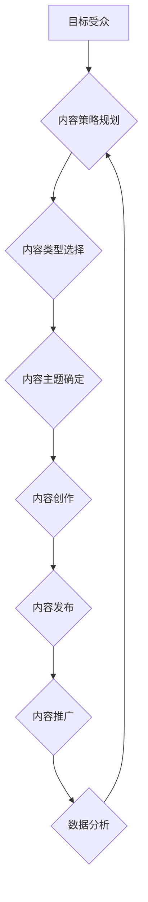

                 

## 1. 背景介绍

在当今信息爆炸的时代，人们每天接触的海量信息量令人难以置信。从新闻推送到社交媒体，从电子邮件到广告，信息无处不在，却往往淹没在信息洪流中。在这种情况下，如何有效地抓住用户的注意力，并将其转化为价值，成为了企业和个人都面临的重大挑战。

注意力经济的概念应运而生，它强调了注意力作为一种稀缺资源，并指出，在信息过载的时代，拥有和控制注意力将成为至关重要的竞争优势。

内容策略规划与实践，则是如何在注意力经济中，有效地利用内容来吸引、留住和转化用户注意力，从而实现商业目标或个人价值的实现。

## 2. 核心概念与联系

### 2.1 注意力经济

注意力经济的核心概念是：注意力是稀缺的资源，而获取和保持用户注意力是企业和个人竞争的关键。

在信息爆炸的时代，人们每天接触的海量信息，使得注意力变得越来越稀缺。用户需要花费大量时间和精力来筛选和过滤信息，从而找到真正有价值的内容。

因此，企业和个人需要找到有效的方法来吸引用户的注意力，并将其转化为价值。

### 2.2 内容策略

内容策略是指企业或个人在制定和发布内容时遵循的一套规划和原则。它涵盖了以下几个方面：

* **目标受众:** 确定目标受众的特征、需求和兴趣。
* **内容类型:** 选择合适的类型和形式，例如文章、视频、音频、图片等。
* **内容主题:** 确定内容的主题和方向，并与目标受众的兴趣相符。
* **内容发布:** 制定内容发布的计划和渠道，例如网站、社交媒体、电子邮件等。
* **内容推广:** 利用各种渠道和方法推广内容，例如搜索引擎优化、社交媒体营销、付费广告等。

### 2.3 内容策略规划与实践

内容策略规划与实践是指根据企业或个人的目标和受众，制定并执行一套有效的策略，以创造有价值、有影响力的内容，并将其传播到目标受众。

它是一个持续的过程，需要不断地收集数据、分析结果、调整策略，以确保内容始终能够吸引和留住用户的注意力。

**Mermaid 流程图**



## 3. 核心算法原理 & 具体操作步骤

### 3.1 算法原理概述

在内容策略规划与实践中，可以使用一些算法来帮助分析用户行为、预测内容受欢迎程度，以及优化内容发布策略。

例如，推荐算法可以根据用户的历史浏览记录、点赞行为等数据，推荐他们可能感兴趣的内容。

内容分级算法可以根据内容的主题、风格、情感等特征，对内容进行分类和排序，帮助用户快速找到所需的内容。

### 3.2 算法步骤详解

以下是一些常见的算法步骤：

* **数据收集:** 收集用户行为数据，例如浏览记录、点赞行为、评论内容等。
* **数据预处理:** 对收集到的数据进行清洗、转换和格式化，以便于算法的训练和使用。
* **特征提取:** 从用户行为数据中提取特征，例如用户兴趣、内容主题、情感倾向等。
* **模型训练:** 使用机器学习算法对提取的特征进行训练，建立预测模型。
* **模型评估:** 使用测试数据对模型进行评估，并根据评估结果进行模型调整和优化。
* **模型部署:** 将训练好的模型部署到生产环境中，用于实时推荐内容、分级内容等。

### 3.3 算法优缺点

* **优点:** 算法可以帮助自动化内容策略规划与实践，提高效率和准确性。
* **缺点:** 算法需要大量的数据进行训练，并且算法的准确性取决于数据的质量和算法模型的复杂度。

### 3.4 算法应用领域

* **内容推荐:** 根据用户的兴趣和行为推荐相关内容。
* **内容分级:** 根据内容的主题、风格、情感等特征对内容进行分类和排序。
* **内容个性化:** 根据用户的个人特征和偏好，定制个性化的内容。
* **内容优化:** 分析用户行为数据，优化内容的标题、摘要、关键词等，提高内容的曝光率和点击率。

## 4. 数学模型和公式 & 详细讲解 & 举例说明

### 4.1 数学模型构建

在内容策略规划与实践中，可以使用数学模型来量化用户行为、预测内容受欢迎程度，以及优化内容发布策略。

例如，可以使用贝叶斯定理来计算用户点击特定内容的概率，根据用户的历史行为和内容的特征进行预测。

可以使用线性回归模型来预测内容的阅读量，根据内容的主题、风格、发布时间等因素进行预测。

### 4.2 公式推导过程

**贝叶斯定理**

$$P(A|B) = \frac{P(B|A)P(A)}{P(B)}$$

其中：

* $P(A|B)$ 是在已知事件 B 发生的情况下，事件 A 发生的概率。
* $P(B|A)$ 是在已知事件 A 发生的情况下，事件 B 发生的概率。
* $P(A)$ 是事件 A 发生的概率。
* $P(B)$ 是事件 B 发生的概率。

**线性回归模型**

$$y = \beta_0 + \beta_1x_1 + \beta_2x_2 + ... + \beta_nx_n + \epsilon$$

其中：

* $y$ 是预测变量。
* $x_1, x_2, ..., x_n$ 是自变量。
* $\beta_0, \beta_1, \beta_2, ..., \beta_n$ 是回归系数。
* $\epsilon$ 是误差项。

### 4.3 案例分析与讲解

**案例：预测用户点击新闻文章的概率**

假设我们有一个新闻网站，想要预测用户点击特定新闻文章的概率。我们可以使用贝叶斯定理，根据用户的历史浏览记录、文章的主题、标题等特征进行预测。

例如，如果用户之前经常点击科技类新闻，并且当前文章的主题是科技类，那么用户点击该文章的概率会更高。

**案例：预测新闻文章的阅读量**

假设我们有一个新闻网站，想要预测新闻文章的阅读量。我们可以使用线性回归模型，根据文章的主题、风格、发布时间等因素进行预测。

例如，如果文章的主题是热门话题，并且发布时间在用户活跃时间段，那么文章的阅读量会更高。

## 5. 项目实践：代码实例和详细解释说明

### 5.1 开发环境搭建

* **操作系统:** Linux/macOS/Windows
* **编程语言:** Python
* **开发工具:** Jupyter Notebook/VS Code
* **库依赖:** pandas, numpy, scikit-learn

### 5.2 源代码详细实现

```python
# 导入必要的库
import pandas as pd
from sklearn.linear_model import LinearRegression

# 加载数据
data = pd.read_csv('news_data.csv')

# 选择特征和目标变量
features = ['topic', 'style', 'publish_time']
target = 'read_count'

# 训练线性回归模型
model = LinearRegression()
model.fit(data[features], data[target])

# 预测新的新闻文章的阅读量
new_data = pd.DataFrame({
    'topic': ['科技'],
    'style': ['新闻'],
    'publish_time': [16:00]
})
predicted_read_count = model.predict(new_data)

# 打印预测结果
print(predicted_read_count)
```

### 5.3 代码解读与分析

* **数据加载:** 使用 pandas 库加载新闻数据。
* **特征选择:** 选择文章的主题、风格、发布时间等特征作为预测模型的输入。
* **目标变量:** 选择文章的阅读量作为预测模型的目标变量。
* **模型训练:** 使用 scikit-learn 库的 LinearRegression 模型训练预测模型。
* **模型预测:** 使用训练好的模型预测新的新闻文章的阅读量。

### 5.4 运行结果展示

运行代码后，会输出预测的阅读量。

## 6. 实际应用场景

### 6.1 内容推荐系统

* **电商平台:** 根据用户的浏览历史、购买记录等数据，推荐相关的商品。
* **新闻网站:** 根据用户的阅读历史、点赞行为等数据，推荐相关的新闻文章。
* **视频网站:** 根据用户的观看历史、点赞行为等数据，推荐相关的视频内容。

### 6.2 内容分级系统

* **社交媒体平台:** 根据内容的主题、风格、情感等特征，对内容进行分类和排序，帮助用户快速找到所需的内容。
* **搜索引擎:** 根据内容的主题、风格、情感等特征，对搜索结果进行排序，提高搜索结果的准确性和相关性。
* **教育平台:** 根据内容的难度、主题、学习目标等特征，对学习资源进行分类和推荐，帮助用户找到适合自己的学习内容。

### 6.3 内容个性化系统

* **新闻网站:** 根据用户的个人特征和偏好，定制个性化的新闻推荐。
* **电商平台:** 根据用户的个人特征和偏好，定制个性化的商品推荐。
* **社交媒体平台:** 根据用户的个人特征和偏好，定制个性化的内容推荐。

### 6.4 未来应用展望

* **人工智能驱动的内容创作:** 利用人工智能技术，自动生成高质量的内容，例如新闻报道、广告文案、诗歌等。
* **虚拟现实和增强现实的内容体验:** 利用虚拟现实和增强现实技术，创造更加沉浸式的用户体验，例如虚拟博物馆、虚拟旅游等。
* **跨平台内容整合:** 利用云计算和大数据技术，整合不同平台的内容，为用户提供更加全面的内容体验。

## 7. 工具和资源推荐

### 7.1 学习资源推荐

* **书籍:**
    * 《内容营销》
    * 《内容策略》
    * 《注意力经济》
* **在线课程:**
    * Coursera: Content Marketing Specialization
    * Udemy: Content Strategy for Beginners
* **博客和网站:**
    * Content Marketing Institute
    * Copyblogger
    * Neil Patel

### 7.2 开发工具推荐

* **内容管理系统 (CMS):** WordPress, Drupal, Joomla
* **数据分析工具:** Google Analytics, Adobe Analytics
* **社交媒体管理工具:** Hootsuite, Buffer

### 7.3 相关论文推荐

* **The Attention Economy: A Framework for Understanding the Impact of Information Overload**
* **Content Strategy: A Framework for Planning and Managing Content**
* **The Science of Content Marketing: How to Create Content That People Actually Want to Read**

## 8. 总结：未来发展趋势与挑战

### 8.1 研究成果总结

注意力经济与内容策略规划与实践是一个不断发展和演进的领域。

近年来，人工智能、大数据、云计算等技术的快速发展，为内容策略规划与实践提供了新的机遇和挑战。

### 8.2 未来发展趋势

* **人工智能驱动的个性化内容推荐:** 利用人工智能技术，更加精准地推荐用户感兴趣的内容。
* **沉浸式内容体验:** 利用虚拟现实和增强现实技术，创造更加沉浸式的用户体验。
* **跨平台内容整合:** 利用云计算和大数据技术，整合不同平台的内容，为用户提供更加全面的内容体验。

### 8.3 面临的挑战

* **数据隐私和安全:** 如何保护用户数据隐私和安全，是内容策略规划与实践面临的一个重要挑战。
* **算法偏见:** 算法模型可能会存在偏见，导致内容推荐不公平或不准确。
* **内容质量:** 如何保证内容的质量和原创性，是内容策略规划与实践面临的一个持续挑战。

### 8.4 研究展望

未来，注意力经济与内容策略规划与实践的研究将更加注重以下几个方面:

* **开发更加公平、透明、可解释的算法模型。**
* **探索新的内容形式和体验模式。**
* **建立更加完善的内容生态系统，促进内容的共享和传播。**

## 9. 附录：常见问题与解答

**Q1: 如何确定目标受众？**

**A1:** 可以通过用户调研、数据分析、市场研究等方法来确定目标受众。

**Q2: 如何选择合适的类型和形式？**

**A2:** 需要根据目标受众的兴趣、需求和习惯来选择合适的类型和形式。

**Q3: 如何优化内容发布策略？**

**A3:** 可以通过数据分析、A/B测试等方法来优化内容发布策略。

**Q4: 如何评估内容策略的成效？**

**A4:** 可以通过网站流量、用户参与度、转化率等指标来评估内容策略的成效。


作者：禅与计算机程序设计艺术 / Zen and the Art of Computer Programming 
<end_of_turn>

